# SF32LB55x Hardware Design Guide


## Basic Introduction

The main purpose of this document is to help hardware engineers complete schematic and PCB designs based on the SF32LB55x series chips.

SF32LB55x is a series of highly integrated, high-performance system-on-chip (SoC) MCU chips for ultra-low-power Artificial Intelligence of Things (AIoT) scenarios. The processor in the chip provides a good balance between the high computing performance required for human-machine interaction and the ultra-low operating and sleep power consumption required for long standby time. It can be widely used in various application scenarios such as wristband wearable electronic devices, smart mobile terminals, and smart homes.

This chip integrates a world-class low-power Bluetooth 5.2 transceiver, featuring high receive sensitivity, high transmit power, and low power consumption.

The chip provides abundant internal and external memory resources. Full-package chips have multiple QSPI memory interfaces, an independent OPI-PSRAM interface, and an SD/eMMC interface. In addition, depending on the model, the internal SiP of the chip provides different combinations of NOR Flash and PSRAM capacities.

To better support display applications, the chip provides comprehensive display interfaces, including 8080, SPI/Dual-SPI/Quad-SPI, and MIPI-DSI.

## Package

### Package Introduction

The package information for SF32LB55x is shown in Table 2-1.

<div align="center"> Table 2-1 Package Information List </div>

```{table}
:align: center
| Package Name | Size        | Pin Pitch | Ball Diameter  |
| -------- | ----------- | -------- | ------- |
| QFN68L   | 7x7x0.75 mm | 0.35 mm  | -       |
| BGA125   | 7x7x0.94 mm | 0.5 mm   | 0.25 mm |
| BGA145   | 7x7x0.94 mm | 0.5 mm   | 0.25 mm |
| BGA169   | 7x7x0.94 mm | 0.5 mm   | 0.25 mm |
```
### QFN68L Package

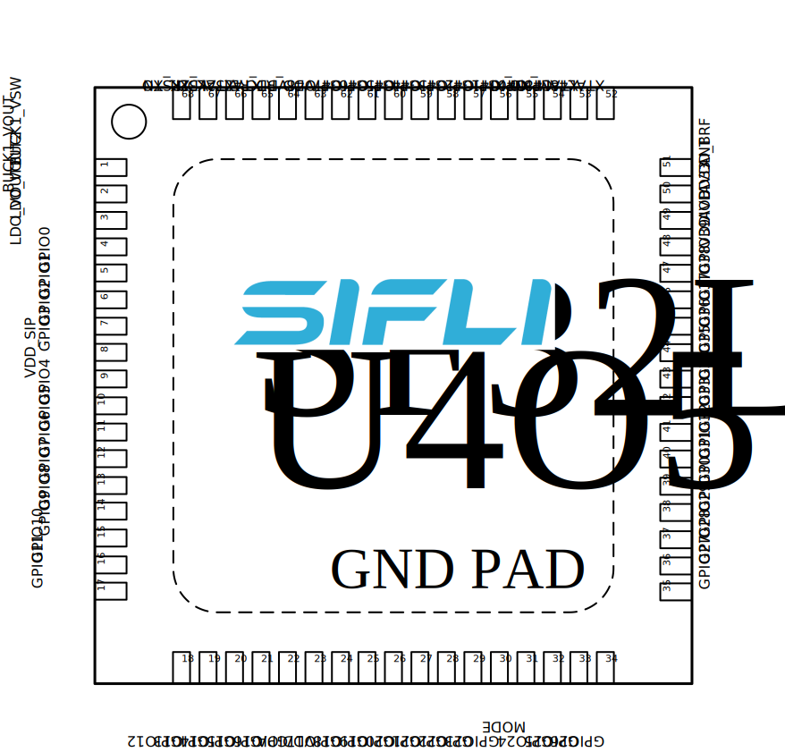

<div align="center"> Figure 2-1 QFN68L Pin Distribution </div>  <br> <br> <br>

### BGA125 Package

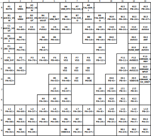

<div align="center"> Figure 2-2 BGA125 Pin Distribution </div>  <br> <br> <br>

### BGA145 Package

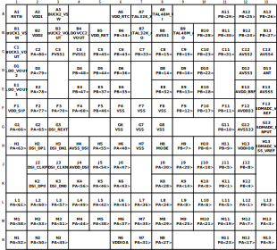

<div align="center"> Figure 2-3 BGA145 Pin Distribution </div>  <br> <br> <br>

### BGA169 Package

The BGA169 package has two ball maps, corresponding to SF32LB557V8N6 (already EOL) and SF32LB557VD3A6, respectively.

Compared with SF32LB557V8N6, SF32LB557VD3A6 has six NC balls.

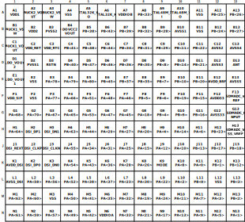

<div align="center"> Figure 2-4 SF32LB557V8N6 BGA169 Pin Distribution </div>  <br> <br> <br>

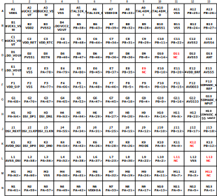

<div align="center"> Figure 2-5 SF32LB557VD3A6 BGA169 Pin Distribution </div>  <br> <br> <br>


## Schematic Design Guidelines

### Power Supply

The SF32LB55x series chips integrate a PMU power supply unit and support two BUCK outputs, which require external inductors and capacitors before being routed back to the chip's internal power inputs. There are also four internal LDO power supplies that require capacitors to be connected externally to the chip.

#### Power Supply Requirements

The power supply requirements of the SF32LB55x series chips are shown in Tables 3-1, 3-2, 3-3, 3-4, and 3-5.

<div align="center"> Table 3-1 PMU Power Supply Specifications </div>

```{table}
:align: center
| PMU Power Supply Pins      | Minimum Voltage (V) | Typical Voltage (V) | Maximum Voltage (V) | Maximum Current (mA) | Detailed Description                                                    |
| ------------------ | ----------- | ----------- | ----------- | ------------ | ----------------------------------------------------------- |
| VDD1               | 1.71        | 1.8         | 3.6         | 50           | VDD1 Power Supply input                                              |
| VDD2               | 1.71        | 1.8         | 3.6         | 50           | VDD2 Power Supply input                                              |
| BUCK1_VSW  BUCK1_VOUT              | -           | 1.25        | -           | 50           | BUCK1 VSW output, connected to the inductor; internal Power Supply input 1, connected to the other end of the inductor and an external capacitor |
| BUCK2_VSW  BUCK2_VOUT  LDOVCC2_VOUT| -           | 0.9         | -           | 50           | BUCK2 VSW output, connected to the inductor; internal Power Supply input 2, connected to the other end of the inductor and an external capacitor |
| LDO_VOUT1          | -           | 1.1         | -           | 50           | LDO output 1, connect an external capacitor                                           |
| LDO_VOUT2          | -           | 0.9         | -           | 20           | LDO output 2, connect an external capacitor                                           |
| VDD_RET            | -           | 0.9         | -           | 1            | RET LDO output, connect an external capacitor                                       |
| VDD_RTC            | -           | 1.1         | -           | 1            | RTC LDO output, connect an external capacitor                                       |
```
:::{note}
The SF32LB551 in the QFN68L package does not have the following power pins: VDD2, BUCK2_VSW, BUCK2_VOUT, and LDOVCC2_VOUT.
:::

Other power specifications for the SF32LB55x series chips that require external power are shown in Table 3-2.

<div align="center"> Table 3-2. RFPower Supply Specifications </div>

```{table}
:align: center
| Other Power Supply Pins | Minimum Voltage (V) | Typical Voltage (V) | Maximum Voltage (V) | Maximum Current (mA) | Detailed Description                     |
| ------------ | ----------- | ----------- | ----------- | ------------ | ---------------------------- |
| AVDD_BRF     | 1.71        | 1.8         | 3.63        | 30           | RF Power Supply input                 |
| AVDD_DSI     | 1.71        | 1.8         | 2.75        | 20           | MIPI DSI Power Supply input; power must be supplied   |
| VDD_SIP      | 1.71        | 1.8         | 1.98        | 30           | Power Supply input for the co-packaged memory chip         |
| AVDD33       | 3.15        | 3.3         | 3.63        | 50           | Power Supply input                     |
| VDDIOA       | 1.71        | 1.8         | 3.63        | -            | PA I/O Power Supply input               |
| VDDIOB       | 1.71        | 1.8         | 3.63        | -            | PB I/O Power Supply input               |
```
:::{note}
The SF32LB551 in the QFN68L package and the SF32LB553 in the BGA125 package do not have the AVDD_DSI power pin.
:::

The recommended values for external capacitors on the power pins of the SF32LB55x series chips are shown in Table 3-3.

<div align="center"> Table 3-3 Recommended Capacitance Values </div>

```{table}
:align: center
| Power Supply pins              | Capacitor          | Detailed description                                                       |
| ------------------    | ------------- | ----------------------------------------------                |
| VDD1 VDD2             | 0.1uF + 10uF  | Short VDD1 and VDD2 together. Place at least two capacitors, 10uF and 0.1uF, close to the pins   |
| BUCK1_VSW  BUCK1_VOUT | 0.1uF + 4.7uF | Place at least two capacitors, 4.7uF and 0.1uF, close to the pins                  |
| BUCK2_VSW  BUCK2_VOUT | 0.1uF + 4.7uF | Place at least two capacitors, 4.7uF and 0.1uF, close to the pins                  |
| LDOVCC2_VOUT          | 0.1uF + 4.7uF | When BUCK2 is configured in BUCK mode, leave this pin floating; when BUCK2 is configured in LDO mode, leave BUCK2_VSW floating, short LDOVCC2_VOUT and BUCK2_VOUT together, and place at least two capacitors, 4.7uF and 0.1uF, close to the pins                            |
| LDO_VOUT1             | 4.7uF         | Place at least one 4.7uF capacitor close to the pin                             |
| LDO_VOUT2             | 4.7uF         | Place at least one 4.7uF capacitor close to the pin                             |
| VDD_RET               | 0.47uF        | Place at least one 0.47uF capacitor close to the pin                            |
| VDD_RTC               | 1uF           | Place at least one 1uF capacitor close to the pin                               |
| VDD_SIP               | 1uF           | Place at least one 1uF capacitor close to the pin                               |
| SDMADC_VREF           | 4.7uF         | Place at least one 4.7uF capacitor close to the pin                             |
| AVDD_DSI              | 0.1uF + 10uF  | Place at least two capacitors, 10uF and 0.1uF, close to the pins                   |
| AVDD33                | 4.7uF         | Place at least one 4.7uF capacitor close to the pin                             |
| AVDD_BRF              | 1uF           | Place at least one 1uF capacitor close to the pin                               |
| VDDIOA VDDIOB         | 2 × 0.1uF + 2 × 1uF  | Place at least two capacitors, 1uF and 0.1uF, close to each pin |
```
:::{note}
The SF32LB551 in the QFN68L Package does not have the following Power Supply pins: VDD2, BUCK2_VSW, BUCK2_VOUT, LDOVCC2_VOUT, and AVDD_DSI.
The SF32LB553 in the BGA125 Package does not have the AVDD_DSI Power Supply pin.
:::

#### Power-On Sequence and Reset

The SF32LB55x series chips integrate a power-on reset function. VDD1 and VDD2 (SF32LB551 does not have VDD2) are required to power on simultaneously. The specific requirements are shown in Figure 3-1.

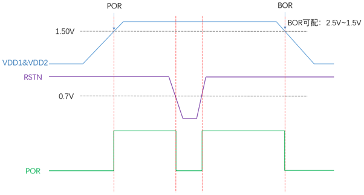

<div align="center"> Figure 3-1 Power-On/Power-Off Timing Diagram </div>  <br> <br> <br>

The RSTN reset signal must be pulled up to the VDD1 input voltage domain and connected to ground through a 0.1uF capacitor to implement an RC-delayed reset, as shown in Figure 3-2. Figure 3-3 shows the measured power-on timing diagram.

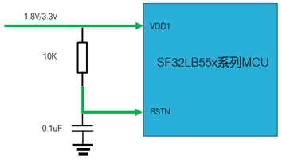

<div align="center"> Figure 3-2 Reset Circuit Diagram </div>  <br> <br> <br>

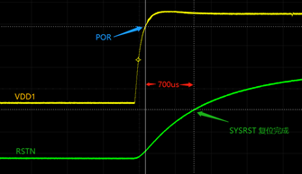

<div align="center"> Figure 3-3 Measured Power-On Timing Diagram </div>  <br> <br> <br>

#### Typical Power Supply Circuit

The BGA packages of the SF32LB55x series chips integrate two BUCK outputs. BUCK2 supports BUCK mode or LDO mode, and BUCK mode is recommended, as shown in Figure 3-4.

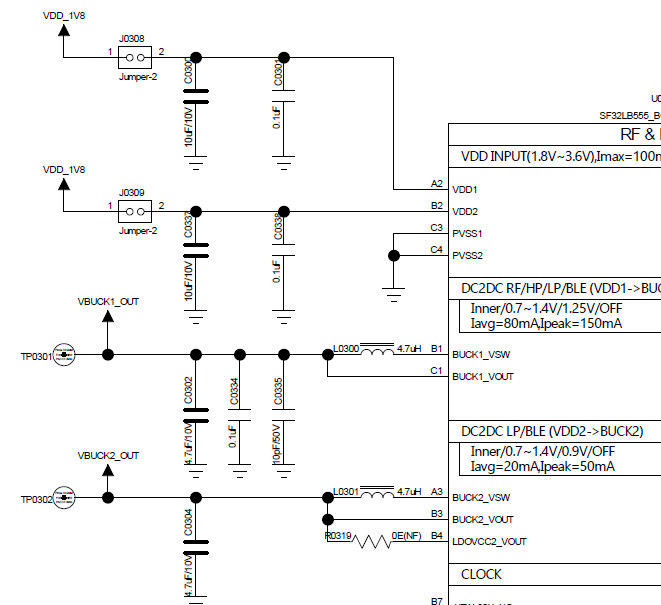

<div align="center"> Figure 3-4 BGAPackagePMU Schematic </div>  <br> <br> <br>

The QFN packages of the SF32LB55x series chips integrate one BUCK output, as shown in Figure 3-5.

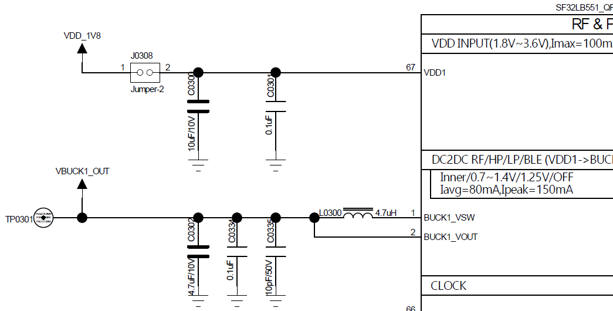

<div align="center"> Figure 3-5 QFNPackagePMU Schematic </div>  <br> <br> <br>

#### BUCK Inductor Selection Requirements

:::{important}

**Key Parameters of the Power Inductor**

L (inductance) = 4.7uH, DCR (DC resistance) ≦ 0.4 ohm, Isat (saturation current) ≧ 450mA

:::


### Boot Mode

The SF32LB55x series chips provide one Mode pin to configure the boot mode, as shown in Table 3-4.

<div align="center"> Table 3-4 Mode Description </div>

```{table}
:align: center
| Mode configuration | Detailed description                             |
| -------- | ------------------------------------ |
| High       | After the chip powers on and starts up, it enters download mode         |
| Low       | After the chip powers on and starts up, it jumps to the user program area to start |
```

:::{note}
**Notes:**

1. The voltage domain of Mode is the same as that of VDDIOA;
2. Mode must be connected externally through a 10K resistor to the power supply or GND to keep the level stable. It must not be left floating or be subject to toggle interference;
3. A test point must be reserved for the Mode pin on mass-production boards. It is used for program flashing or crystal calibration; a jumper does not need to be reserved;
4. It is recommended to reserve a jumper for the Mode pin on test boards, so that after a program crash, the board can be booted from download mode to download the program.
:::

### Clock

The SF32LB55x series chips require two external clock sources: a 48 MHz main crystal and a 32.768 kHz RTC crystal. The specific requirements are shown in Table 3-5.

<div align="center"> Table 3-5 Crystal Specification Requirements </div>

```{table}
:align: center
|Crystal|Crystal specification requirements   |Detailed description  |
|:--|:-------|:--------|
|48MHz |7pF≦CL≦12pF (recommended value 8.8pF) △F/F0≦±10ppm ESR≦30 ohms (recommended value 22ohms)|Crystal oscillator power consumption is related to CL and ESR. The smaller the CL and ESR, the lower the power consumption. For optimal power performance, it is recommended to use components with relatively smaller CL and ESR values within the required range. Reserve parallel matching capacitors next to the crystal. When CL<12pF, no capacitors need to be mounted|
|32.768KHz |CL≦12.5pF (recommended value 7pF) △F/F0≦±20ppm ESR≦80k ohms (recommended value 38Kohms)|Crystal power consumption is related to CL and ESR. The smaller the CL and ESR, the lower the power consumption. For optimal power consumption performance, it is recommended to use components with relatively small CL and ESR values within the required range. Reserve parallel matching capacitors next to the crystal. When CL<12.5pF, no capacitor needs to be soldered|
```

 **Crystal Recommendation**

For detailed material certification information, refer to:
[SIFLI-MCU-AVL Certification List](index)

### RF

The RF section of the SF32LB55x series chips uses on-chip integrated wideband matching filter technology. It is only necessary to ensure that the RF PCB trace has a 50-ohm characteristic impedance. If the antenna is already matched, no additional RF components are required. It is recommended to reserve a π-type matching network in the design for spurious filtering and antenna matching. Refer to the circuit shown in Figure 3-6.

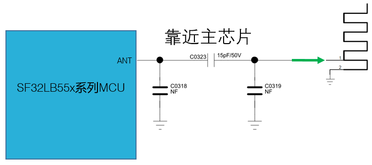 

<div align="center"> Figure 3-6 RF Schematic </div>  <br> <br> <br>

:::{note}
**Note:**

The component values of the matching network must be determined through testing based on the actual antenna and PCB layout.
:::

### External Memory Interface

#### OPI PSRAM Interface

The BGA145 package of the SF32LB55x series chips supports PSRAM chips with a single-channel OPI interface. The PSRAM circuit is shown in Figure 3-7, and the signal connections are shown in Table 3-6.

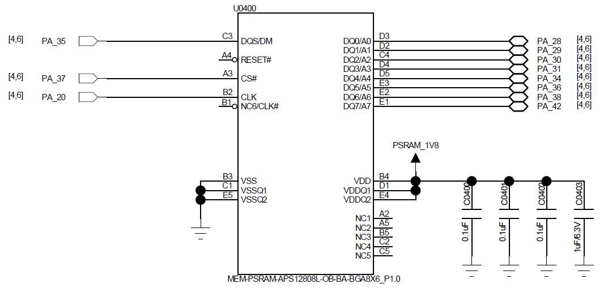

<div align="center"> Figure 3-7 BGA145 PackagePSRAM Circuit </div>  <br> <br> <br>

<div align="center"> Table 3-6 BGA145 PackagePSRAM Signal Connections </div>

```{table}
:align: center
| PSRAM signal | I/O             | Detailed description                                    |
| ---------- | --------------- | ------------------------------------------- |
| CS#        | PA37            | Chip select output                          |
| CLK        | PA20            | Clock output                                |
| DQS        | PA35            | DQ strobe clock output for DQ[7:0]          |
| DQ0        | PA28            | Data Inout 0                                |
| DQ1        | PA29            | Data Inout 1                                |
| DQ2        | PA30            | Data Inout 2                                |
| DQ3        | PA31            | Data Inout 3                                |
| DQ4        | PA34            | Data Inout 4                                |
| DQ5        | PA36            | Data Inout 5                                |
| DQ6        | PA38            | Data Inout 6                                |
| DQ7        | PA42            | Data Inout 7                                |
```

The BGA169 package of the SF32LB55x series chips supports PSRAM chips with a 2-channel OPI interface. The PSRAM circuits are shown in Figure 3-8 and Figure 3-9, and the signal connections are shown in Table 3-7 and Table 3-8.

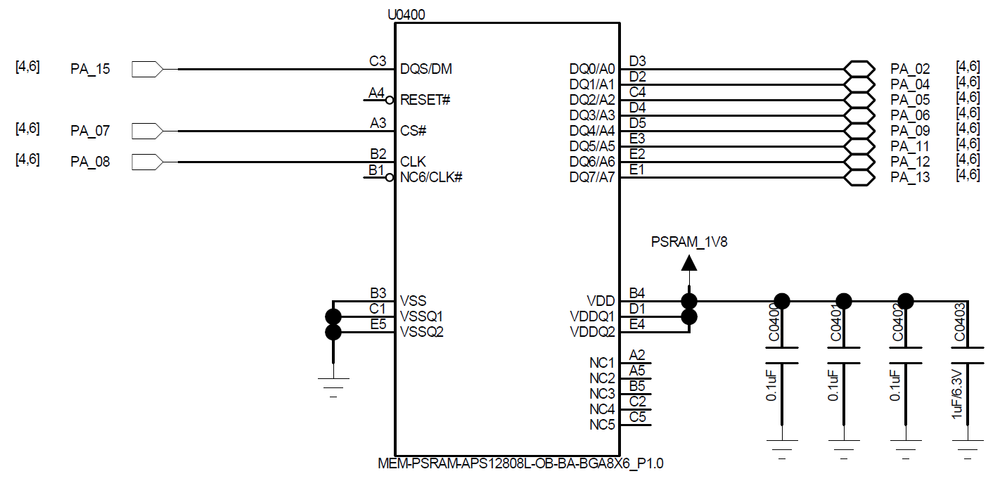

<div align="center"> Figure 3-8 BGA169 PackagePSRAM Chip 1 Circuit </div>  <br> <br> <br>

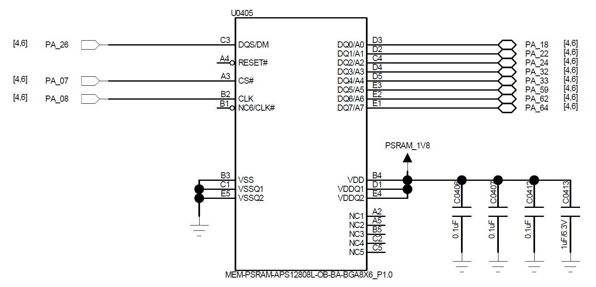

<div align="center"> Figure 3-9 BGA169 PackagePSRAM Chip 2 Circuit </div>  <br> <br> <br>

<div align="center"> Table 3-7 BGA169 PackagePSRAM Chip 1 Signal Connections </div>

```{table}
:align: center
| PSRAM signal | I/O             | Detailed description                                    |
| ---------- | --------------- | ------------------------------------------- |
| CS#        | PA07            | Chip select input                           |
| CLK        | PA08            | Clock input                                 |
| DQS        | PA15            | DQ strobe clock input for DQ[7:0]           |
| DQ0        | PA02            | Data Inout 0                                |
| DQ1        | PA04            | Data Inout 1                                |
| DQ2        | PA05            | Data Inout 2                                |
| DQ3        | PA06            | Data Inout 3                                |
| DQ4        | PA09            | Data Inout 4                                |
| DQ5        | PA11            | Data Inout 5                                |
| DQ6        | PA12            | Data Inout 6                                |
| DQ7        | PA13            | Data Inout 7                                |
```

<div align="center"> Table 3-8 BGA169 PackagePSRAM Chip 2 Signal Connections </div>

```{table}
:align: center
| PSRAM signal | I/O             | Detailed description                                    |
| ---------- | --------------- | ------------------------------------------- |
| CS#        | PA07            | Chip select input                           |
| CLK        | PA08            | Clock input                                 |
| DQS        | PA26            | DQ strobe clock input for DQ[7:0]           |
| DQ0        | PA18            | Data Inout 0                                |
| DQ1        | PA22            | Data Inout 1                                |
| DQ2        | PA24            | Data Inout 2                                |
| DQ3        | PA32            | Data Inout 3                                |
| DQ4        | PA33            | Data Inout 4                                |
| DQ5        | PA59            | Data Inout 5                                |
| DQ6        | PA62            | Data Inout 6                                |
| DQ7        | PA64            | Data Inout 7                                |
```
:::{note}
For the power supply of the external OPI PSRAM, if it is controlled by an HCPU GPIO, with high level on and low level off, an HCPU PU pin must be used.
:::

#### QSPI NOR/NAND Flash and PSRAM Interface

The SF32LB55x series chips support three QSPI interfaces for connecting Nor, Nand Flash, and PSRAM devices.
QSPI PSRAM devices are recommended to use the QSPI2 interface. The signal connections are shown in Table 3-9, Table 3-10, and Table 3-11.

<div align="center"> Table 3-9 QSPI2 Signal Connections </div>

```{table}
:align: center
| Flash signal | QFN68  |BGA125/145/169 | Detailed description                                    |
| ---------- | ------ | ------------- | ------------------------------------------- |
| CS#        | GPIO9  | PA61          | Chip select, active low                     |
| SO         | GPIO7  | PA65          | Data Input (Data Input Output 1)            |
| WP#        | GPIO6  | PA66          | Write Protect Output (Data Input Output  2) |
| SI         | GPIO8  | PA63          | Data Output (Data Input Output 0)           |
| SCLK       | GPIO10 | PA60          | Serial Clock Output                         |
| Hold#      | GPIO5  | PA68          | Data Output (Data Input Output 3)           |
```

<div align="center"> Table 3-10 QSPI3 Signal Connections </div>

```{table}
:align: center
| Flash signal | QFN68  |BGA125/145/169 | Detailed description                                    |
| ---------- | ------ | ------------- | ------------------------------------------- |
| CS#        | GPIO16 | PA45          | Chip select, active low                     |
| SO         | GPIO14 | PA49          | Data Input (Data Input Output 1)            |
| WP#        | GPIO13 | PA51          | Write Protect Output (Data Input Output  2) |
| SI         | GPIO15 | PA47          | Data Output (Data Input Output 0)           |
| SCLK       | GPIO17 | PA44          | Serial Clock Output                         |
| Hold#      | GPIO12 | PA55          | Data Output (Data Input Output 3)           |
```

<div align="center"> Table 3-11 QSPI4 Signal Connections </div>

```{table}
:align: center
| Flash signal | QFN68/BGA125 |BGA145/169 | Detailed description                                    |
| ---------- | ------------ | --------- | ------------------------------------------- |
| CS#        | -            | PB33      | Chip select, active low                     |
| SO         | -            | PB36      | Data Input (Data Input Output 1)            |
| WP#        | -            | PB37      | Write Protect Output (Data Input Output  2) |
| SI         | -            | PB35      | Data Output (Data Input Output 0)           |
| SCLK       | -            | PB32      | Serial Clock Output                         |
| Hold#      | -            | PB07      | Data Output (Data Input Output 3)           |
```

:::{note}
1. The VDD_SIP power supply powers the internal Flash. If power switch control is required, PA58 must be used as the control signal. The power switch must turn on when PA58 is set high and turn off when PA58 is set low.
2. Contact an FAE colleague to evaluate the Flash space occupied by the G-sensor and HR algorithms connected to the LCPU, and determine whether to add an external NOR Flash on QSPI4.
3. For the power supply of the external QSPI PSRAM, if it is controlled by an HCPU GPIO, with high level on and low level off, an HCPU PU pin must be used.
:::

#### SDIO eMMC/Micro SD Interface

The SF32LB55x series chips support two SDIO interfaces for connecting eMMC or Micro SD devices. The signal connections are shown in Table 3-12, Table 3-13, and Table 3-14.

<div align="center"> Table 3-12 SDIO1 4bit Signal Connections </div>

```{table}
:align: center
| Flash signal | QFN68   | BGA125 |BGA145/169 | Detailed description                                    |
| ---------- | ------- | ------ | --------- | ------------------------------------------- |
| CLK        | GPIO10  | PA60   | PA34      | Clock input                                 |
| CMD        | GPIO9   | PA61   | PA36      | Command input                               |
| DATA0      | GPIO8   | PA63   | PA28      | Data 0                                      |
| DATA1      | GPIO7   | PA65   | PA29      | Data 1                                      |
| DATA2      | GPIO6   | PA66   | PA30      | Data 2                                      |
| DATA3      | GPIO5   | PA68   | PA31      | Data 3                                      |
```

<div align="center"> Table 3-13 SDIO1 8bit Signal Connections </div>

```{table}
:align: center
| Flash signal | QFN68   | BGA125 |BGA145/169 | Detailed description                                    |
| ---------- | ------- | ------ | --------- | ------------------------------------------- |
| CLK        | GPIO10  | -      | PA34      | Clock input                                 |
| CMD        | GPIO9   | -      | PA36      | Command input                               |
| DATA0      | GPIO8   | -      | PA28      | Data 0                                      |
| DATA1      | GPIO7   | -      | PA29      | Data 1                                      |
| DATA2      | GPIO6   | -      | PA30      | Data 2                                      |
| DATA3      | GPIO5   | -      | PA31      | Data 3                                      |
| DATA4      | GPIO15  | -      | PA47      | Data 4                                      |
| DATA5      | GPIO14  | -      | PA49      | Data 5                                      |
| DATA6      | GPIO13  | -      | PA51      | Data 6                                      |
| DATA7      | GPIO12  | -      | PA55      | Data 7                                      |
```

<div align="center"> Table 3-14 SDIO2 4bit Signal Connections </div>

```{table}
:align: center
| Flash signal | QFN68  |BGA125/145/169 | Detailed description                                    |
| ---------- | ------ | ------------- | ------------------------------------------- |
| CLK        | GPIO17 | PA44          | Clock input                                 |
| CMD        | GPIO16 | PA45          | Command input                               |
| DATA0      | GPIO15 | PA47          | Data 0                                      |
| DATA1      | GPIO14 | PA49          | Data 1                                      |
| DATA2      | GPIO13 | PA51          | Data 2                                      |
| DATA3      | GPIO12 | PA55          | Data 3                                      |
```

For detailed material certification information, refer to:
[SIFLI-MCU-AVL Certification List](index)

### Display

#### MIPI DSI Display Interface

The SF32LB55x series chips in BGA145/169 packages support a 2-lane MIPI DSI display interface. The signal connections are shown in Table 3-15. 

<div align="center"> Table 3-15 MIPI-DSI Signal Connections </div>

```{table}
:align: center 
| MIPI DSI signal | BGA145/169 I/O | Description                        |
| --------------- | -------------- | ---------------------------------- |
| CLKP            | DSI_CLKP       | MIPI Clock signal +                     |
| CLKN            | DSI_CLKN       | MIPI Clock signal -                     |
| D0P             | DSI_D0P        | MIPI data lane 0+                    |
| D0N             | DSI_D0N        | MIPI data lane 0-                    |
| D1P             | DSI_D1P        | MIPI data lane 1+                    |
| D1N             | DSI_D1N        | MIPI data lane 1-                    |
| -               | AVDD18_DSI     | MIPI Power Supply input                      |
| -               | DSI_REXT       | Connect an external 10K resistor to ground                    |
| -               | AVSS_DSI       | Ground                               |
| TE              | PA77           | Tearing effect to MCU frame signal |
| RESET           | PB17           | Reset signal for the Display panel                     |
```

:::{note}
1. TE can use other PA GPIOs;
2. If the display supports TE over the DSI protocol, no additional TE pin is required;
3. RESET can use other GPIOs on PB.
:::

#### SPI/QSPI Display Interface

The SF32LB55x series chips support 3/4-wire SPI and Quad-SPI interfaces for connecting LCD displays. The signal connections are shown in Table 3-16.

<div align="center"> Table 3-16 SPI/QSPI Signal Connection Method </div>

```{table}
:align: center 
| SPI signal | QFN68  | BGA125 | BGA145/169 | Detailed description                                                  |
| ------- | ------ | ------ | ---------- | --------------------------------------------------------- |
| CSX     | GPIO22 | PA31   | PB33       | Enable signal                                                  |
| WRX_SCL | GPIO23 | PA20   | PB32       | Clock signal                                                  |
| DCX     | GPIO20 | PA36   | PB36       | Data/command signal in 4-wire SPI mode; data 1 in Quad-SPI mode   |
| SDI_RDX | GPIO21 | PA34   | PB35       | Data input signal in 3/4-wire SPI mode; data 0 in Quad-SPI mode  |
| SDO     | GPIO21 | PA34   | PB35       | Data output signal in 3/4-wire SPI mode; short it together with SDI_RDX   |
| D[0]    | GPIO19 | PA38   | PB37       | Data 2 in Quad-SPI mode                                    |
| D[1]    | GPIO18 | PA42   | PB07       | Data 3 in Quad-SPI mode                                    |
| REST    | GPIO2  | PA78   | PB17       | Reset signal for the Display panel                                            |
| TE      | GPIO3  | PA77   | PB77       | Tearing effect to MCU frame signal                        |
```

:::{note}
1. TE can use PA77, or it can be emulated using other GPIOs on PA;
2. REST can use any GPIO. If the AOD function is required, using PB pins is recommended.
:::

#### MCU8080 Display Interface

The SF32LB55x series chips support the MCU8080 interface for connecting LCD displays. The signal connections are shown in Table 3-17. 

<div align="center"> Table 3-17 MCU8080 Display Signal Connection Method </div>

```{table}
:align: center 
| MCU8080 signal | QFN68  | BGA125 | BGA145/169 | Detailed description                            |
| ----------- | ------ | ------ | ---------- |------------------------------------ |
| CSX         | GPIO22 | PA31   | -          | Chip select                         |
| WRX         | GPIO23 | PA20   | -          | Writes strobe signal to  write data |
| DCX         | GPIO20 | PA36   | -          | Display data / command  selection   |
| RDX         | GPIO21 | PA34   | -          | Reads strobe signal to write  data  |
| D[0]        | GPIO19 | PA38   | -          | Data 0                              |
| D[1]        | GPIO18 | PA42   | -          | Data 1                              |
| D[2]        | GPIO17 | PA44   | -          | Data 2                              |
| D[3]        | GPIO16 | PA45   | -          | Data 3                              |
| D[4]        | GPIO15 | PA47   | -          | Data 4                              |
| D[5]        | GPIO14 | PA49   | -          | Data 5                              |
| D[6]        | GPIO13 | PA51   | -          | Data 6                              |
| D[7]        | GPIO12 | PA55   | -          | Data 7                              |
| REST        | GPIO2  | PA78   | -          | Reset                               |
| TE          | GPIO3  | PA77   | -          | Tearing effect to MCU frame signal  |
```

:::{note}
1. TE can use PA77, or it can be emulated using other GPIOs on PA;
2. REST can use any GPIO. If the AOD function is required, using PB pins is recommended.
:::

#### JDI Display Interface

The SF32LB55x series chips support parallel and serial JDI interfaces for connecting LCD displays, and support pin muxing of the corresponding signals to LCDC1 on PA or LCDC2 on PB. Using LCDC2 on the PB interface is recommended, as shown in Table 3-18 and Table 3-19.


<div align="center"> Table 3-18 Parallel JDI Display Signal Connection Method </div>

```{table}
:align: center
| JDI signal      | I/O（LCDC1） | Detailed description                                                     |
| ------------ | ------------ | ------------------------------------------------------------ |
| JDI_VCK      | PA20         | Shift clock for the vertical driver                          |
| JDI_VST      | PA31         | Start signal for the vertical driver                         |
| JDI_XRST     | PA34         | Reset signal for the horizontal and  vertical driver         |
| JDI_HCK      | PA36         | Shift clock for the  horizontal driver                       |
| JDI_HST      | PA38         | Start signal for the horizontal driver                       |
| JDI_ENB      | PA42         | Write enable signal for the pixel memory                     |
| JDI_R1       | PA49         | Red image data (odd pixels)                                  |
| JDI_R2       | PA51         | Red image data (even pixels)                                 |
| JDI_G1       | PA55         | Green image data (odd pixels)                                |
| JDI_G2       | PA77         | Green image data (even pixels)                               |
| JDI_B1       | PA78         | Blue image data (odd pixels)                                 |
| JDI_B2       | PA79         | Blue image data (even pixels)                                |
| JDI_XFRP     | PA45         | Liquid crystal driving signal  ("On" pixel)                  |
| JDI_VCOM/FRP | PA47         | Common electrode driving signal/   Liquid crystal driving signal  ("Off" pixel) |
```
 

<div align="center"> Table 3-19 Serial JDI Display Signal Connection Method </div>

```{table}
:align: center
| JDI signal      | I/O（LCDC1） | Detailed description                         |
| ------------ | ------------ | -------------------------------- |
| JDI_SCS      | PA31         | Chip Select Signal               |
| JDI_SCLK     | PA20         | Serial Clock Signal              |
| JDI_SO       | PA34         | Serial Data Output Signal        |
| JDI_DISP     | PA36         | Display ON/OFF Switching  Signal |
| JDI_EXTCOMIN | PA38         | COM Inversion Polarity Input     |
```

#### Touch and Backlight Interfaces

The SF32LB55x series chips support an I2C-format touchscreen control interface and touch status interrupt input, and also support one PWM signal to control the enable and brightness of the backlight power chip. The signal connections are shown in Table 3-20.

<div align="center"> Table 3-20 Touch and Backlight Control Connection Method </div>

```{table}
:align: center
| Touchscreen and backlight signals | QFN68  | BGA125 | BGA145 | BGA169 | Detailed description                   |
| ---------------- | ------ | ------ | ------ | ------ | -------------------------- |
| Interrupt        | GPIO1  | PA79   | PA79   | PA79   | Touch status interrupt signal (wake-up capable) |
| I2C1_SCL         | GPIO25 | PA10   | PA10   | PA10   | Touchscreen I2C Clock signal        |
| I2C1_SDA         | GPIO24 | PA14   | PA14   | PA14   | Touchscreen I2C data signal        |
| BL_PWM           | GPIO0  | PA80   | -      | -      | Backlight PWM control signal            |
| Reset            | GPIO16 | PA00   | PA00   | PA00   | Touch reset signal               |
| Power Enable     | GPIO26 | PA06   | PA06   | PA03   | Touchscreen Power Supply enable signal         |
```

:::{note}
BL_PWM must use a GPIO with the GPTIM1_CHX function. Configure the selected GPIO with PU or PD to prevent the backlight from being turned on abnormally during cold startup.
:::

### Other Peripheral Interfaces

#### Wake-up Button

The SF32LB55x series chips support 10 wake-up interrupt input pins: BGA125/145/169 packages (PA77~PA80, PB43~PB48) and QFN68 package (GPIO0~GPIO3, GPIO43~GPIO48). These pins can be used for button wake-up. The recommended button input pins are shown in Figure 3-10.

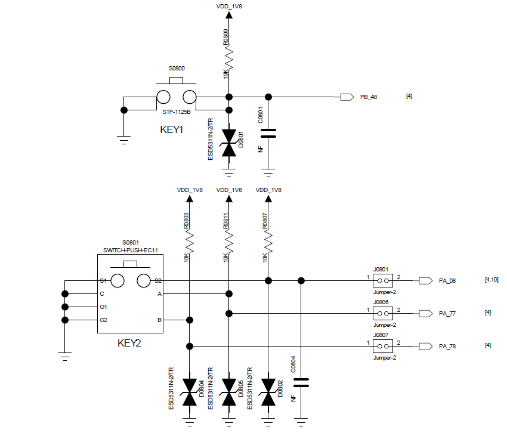

<div align="center"> Figure 3-10 Key Circuit Diagram </div>  <br> <br> <br>

#### Vibration Motor Interface

The SF32LB55x series chips support multiple PWM outputs, which can be used as drive signals for a vibration motor. Figure 3-11 shows the recommended circuit.

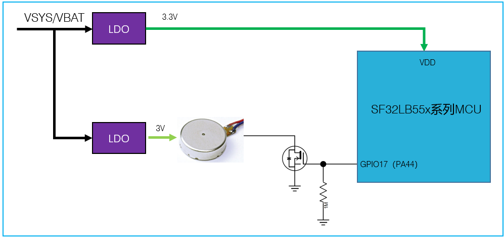

<div align="center"> Figure 3-11 Vibration Motor Circuit Diagram </div>  <br> <br> <br>

:::{note}
The PWM control signal for the motor must use a GPIO with the GPTIM1_CHx function. Configure the selected GPIO with PU or PD to prevent the motor from starting abnormally during cold startup.
:::

### Wake-up Interrupt Sources

The SF32LB55x series chips support 10 non-maskable wake-up interrupt sources, as shown in Table 3-21. HCPU has 4 interrupt sources, and LCPU has 6 interrupt sources. Each interrupt source can wake up only the corresponding CPU.


<div align="center"> Table 3-21 Interrupt Source Connection Method </div>

```{table}
:align: center
| Interrupt Source    | QFN68  | BGA125/145/169  | Detailed Description      |
| --------- | ------ | --------------- | ------------- |
| WKUP_A0   | GPIO3  | PA77            | HCPU interrupt signal 0 |
| WKUP_A1   | GPIO2  | PA78            | HCPU interrupt signal 1 |
| WKUP_A2   | GPIO1  | PA79            | HCPU interrupt signal 2 |
| WKUP_A3   | GPIO0  | PA80            | HCPU interrupt signal 3 |
| WKUP_B0   | GPIO43 | PB43            | LCPU interrupt signal 0 |
| WKUP_B1   | GPIO44 | PB44            | LCPU interrupt signal 1 |
| WKUP_B2   | GPIO45 | PB45            | LCPU interrupt signal 2 |
| WKUP_B3   | GPIO46 | PB46            | LCPU interrupt signal 3 |
| WKUP_B4   | GPIO47 | PB47            | LCPU interrupt signal 4 |
| WKUP_B5   | GPIO48 | PB48            | LCPU interrupt signal 5 |
```

:::{note}
1. The 10 signals WKUP_A0~WKUP_A3 and WKUP_B0~WKUP_B5 must not be left floating. Add an external pull-up or pull-down according to the actual function; otherwise, leakage current issues may occur when the chip is in sleep mode.
2. In Hibernate mode, only the 6 interrupt sources of LCPU support wake-up and power-on.
:::

### GPADC Design Requirements

The SF32LB55x chip supports a 5-channel 10-bit GPADC with an input range of 0~0.9 V. As shown in Figure 3-12, if the test voltage VIN is less than 0.9 V, the test voltage VIN can be input directly to the GPADC pin; if the test voltage VIN is greater than 0.9 V, the test voltage VIN must be divided by resistors before being input to the GPADC pin.

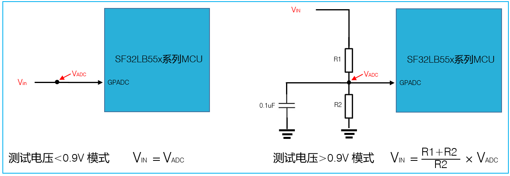

<div align="center"> Figure 3-12 GPADC Reference Circuit Diagram </div>  <br> <br> <br>

When measuring the lithium battery voltage VBAT, the resistor-divider input mode must be used. The input voltage of VADC must be less than 0.9 V, so the ratio of R1 to R2 is approximately 5:1. To reduce the quiescent current Iq, use MΩ-level resistors as much as possible; however, the larger the resistance, the longer the GPADC input voltage settling time will be. The resistors recommended based on comprehensive testing are shown in Table 3-22:

<div align="center"> Table 3-22 Interrupt Source Connection Method </div>

```{table}
:align: center
| Resistor Combination    | R1(Kohm) ±%1  | R2(Kohm) ±%1  | Voltage settling time(ms) | Iq(uA) (VIN = 4.2V) |
| ----------- | ------------- | ------------- | ---------------- | ------------------- |
| 1           | 1000          | 220           | 138              | 3.44                |
| 2           | 2000          | 430           | 250              | 1.73                |
| 3           | 3000          | 680           | 302              | 1.14                |
| 4           | 4300          | 910           | -                | 0.81                |
| 5           | 5100          | 1100          | 420              | 0.68                |
```

### Sensors

The SF32LB55x chip supports heart rate sensors, accelerometers, and other sensors. In the design, note that the I2C, SPI, control interface, interrupt wake-up, and other interfaces of the heart rate sensor and accelerometer must use LCPU interfaces. For the power supply of the heart rate sensor and accelerometer, select a DCDC, LDO, or load switch with relatively low Iq, so that the power supply can be switched on and off as needed.

### External Bluetooth Audio

The SF32LB55x chip supports external Bluetooth audio. The communication interface uses UART1 of HCPU. During use, ensure that the interface levels match. If they do not match, add a level-shifting chip in the UART path. If the external Bluetooth audio device needs to be powered off during use, the power supply of the UART interface level-shifting chip must also be turned off synchronously; otherwise, leakage current may easily occur.

If, during operation, the SF32LB55x chip enters Standby mode while the external Bluetooth audio device remains powered on, and the power enable control signal of the external Bluetooth audio device enables power at a low level, a GPIO on the LCPU of the SF32LB55x chip that is pulled down (PD) by default must be used.


### Debug and Flashing Interface

The SF32LB55x series chips support the Arm® standard SWD debug interface, which can be connected to EDA tools for single-step debugging. As shown in Figure 3-13, when connecting a SEEGER® J-Link® tool, the power supply of the debug tool must be changed to external interface input, and the J-Link tool must be powered by the SF32LB55x circuit board.

SF32LB55x provides 5 UART interfaces that can be selected for debug information output. For details, refer to Table 3-23.

<div align="center"> Table 3-23 Debug Port Connection Method </div>

```{table}
:align: center
| UART Signal | QFN68  | BGA125/145/169 | Detailed Description                       |
| -------- | ------ | -------------- | ------------------------------ |
| TXD1     | GPIO13 | PA19           | UART1 RXD signal                 |
| RXD1     | GPIO14 | PA17           | UART1 TXD signal                 |
| TXD2     | -      | PA07           | UART2 RXD signal                 |
| RXD2     | -      | PA05           | UART2 TXD signal                 |
| TXD3     | GPIO46 | PB46           | UART3 RXD signal, system default log port |
| RXD3     | GPIO45 | PB45           | UART3 TXD signal, system default log port |
| TXD4     | -      | PB14           | UART4 RXD signal                 |
| RXD4     | -      | PB12           | UART4 TXD signal                 |
| TXD5     | -      | PB11           | UART5 RXD signal                 |
| RXD5     | -      | PB06           | UART5 TXD signal                 |
| SWCLK    | GPIO41 | PB31           | SWD Clock signal                    |
| SWDIO    | GPIO42 | PB34           | SWD data signal                    |
```

:::{note}
The RXD signal of UARTx must not be left floating. Configure it as an internal pull-up during software initialization.
:::
 
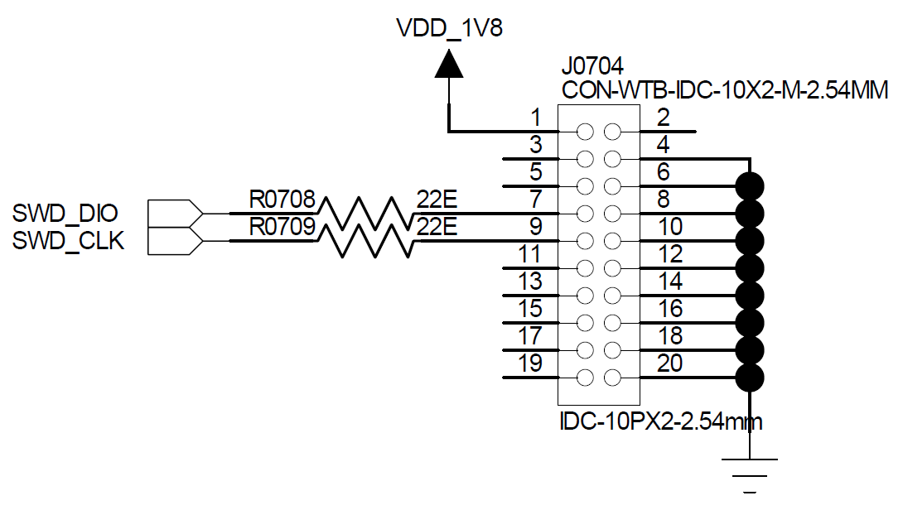 

<div align="center"> Figure 3-13 SWD Debug Interface Schematic </div>  <br> <br> <br> 


### Production Line Flashing and Crystal Calibration

Sifli provides an offline downloader to complete production-line program flashing and crystal calibration.

:::{note}
During hardware design, be sure to reserve at least the following test points: VBAT, GND, VDDIOA, VDDIOB, RSTN, Mode, SWDIO, SWCLK, RXD1, TXD1, RXD3, and TXD3.
Production-line manufacturing requires the following test points: VBAT, GND, boot_mode, VDDIOB, RXD3, and TXD3.
:::

## PCB Design Guidelines

### PCB Footprint Design

#### Package Dimensions

The SF32LB55x series chips are available in four package types. Different package types correspond to different product models and functions, as shown below:

- 1. BGA125 package, package dimensions: 7 mm × 7 mm × 0.94 mm, pitch: 0.5 mm. Detailed package information is shown in Figure 4-1:
 
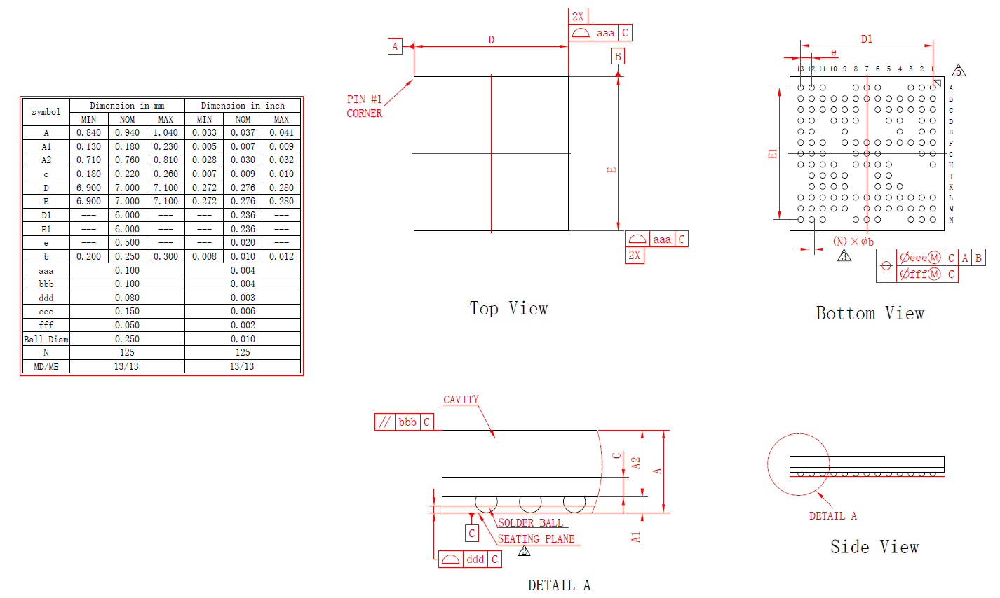  

<div align="center"> Figure 4-1 BGA125 Package Dimension Diagram </div>  <br> <br> <br> 

- 2. BGA145 package, package dimensions: 7 mm × 7 mm × 0.94 mm, pitch: 0.5 mm. Detailed package information is shown in Figure 4-2: 

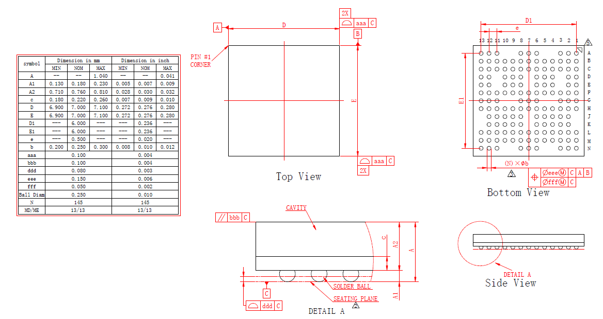  

<div align="center"> Figure 4-2 BGA145 Package Dimension Diagram </div>  <br> <br> <br> 

- 3. BGA169 package, package dimensions: 7 mm × 7 mm × 0.94 mm, pitch: 0.5 mm. Detailed package information is shown in Figure 4-3:

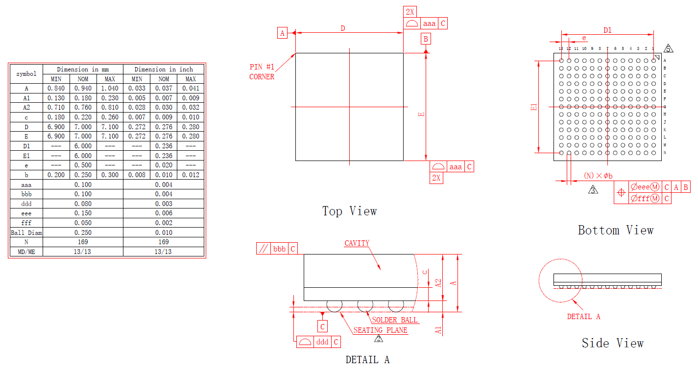  

<div align="center"> Figure 4-3 BGA169 Package Dimension Diagram </div>  <br> <br> <br> 

- 4. QFN68L package, package dimensions: 7 mm × 7 mm × 0.75 mm, pitch: 0.35 mm. Detailed package information is shown in Figure 4-4:

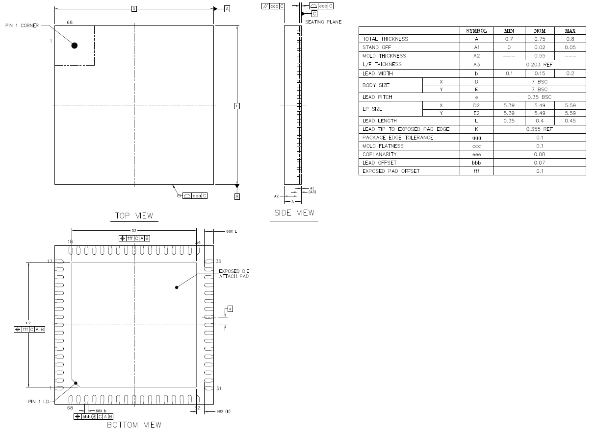  

<div align="center"> Figure 4-4 QFN68L Package Dimension Diagram </div>  <br> <br> <br> 

#### Package Shape

- 1. The BGA package type is shown in Figure 4-5.

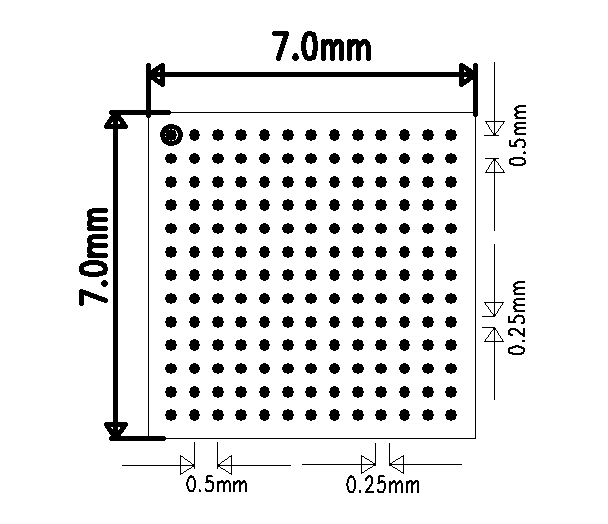  

<div align="center"> Figure 4-5 BGA Package Type </div>  <br> <br> <br> 

- 2. The PCB pad design information for the BGA package is shown in Figure 4-6.

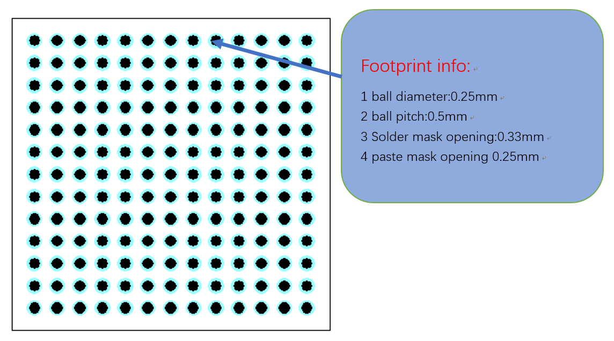  

<div align="center"> Figure 4-6 BGA Package PCB Pad Design </div>  <br> <br> <br> 

- 3. The PCB pad design information for the QFN68L package is shown in Figure 4-7.

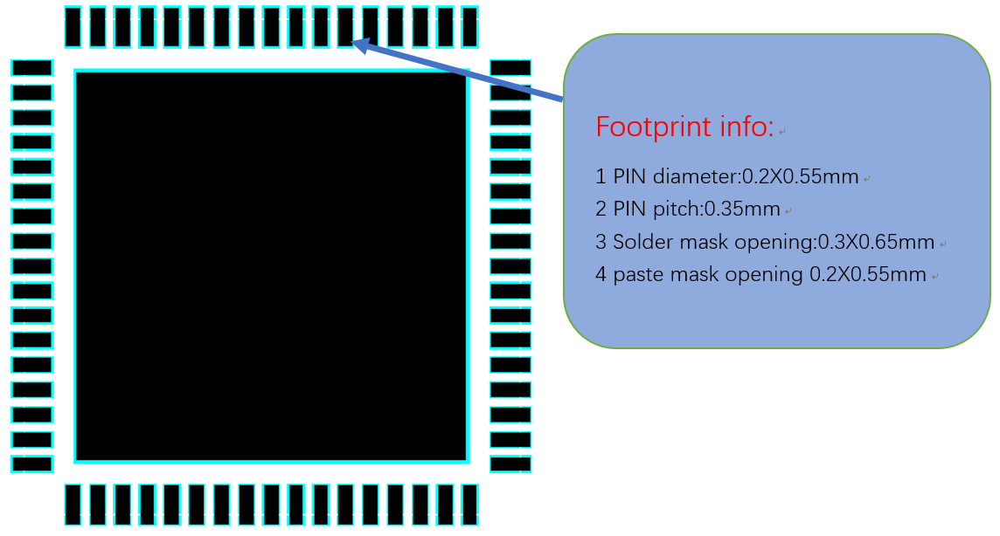  

<div align="center"> Figure 4-7 QFN68L Package PCB Pad Design </div>  <br> <br> <br> 

### PCB Stackup Design

The SF32LB55x series chips support single-sided and double-sided component placement. QFN68L, BGA125, and BGA145 support PTH through-hole boards, and a 4-layer PTH through-hole board is recommended. For BGA169, a 1-step HDI blind and buried via board is recommended. The recommended reference stackup structures are shown in Figure 4-8 and Figure 4-9:

 
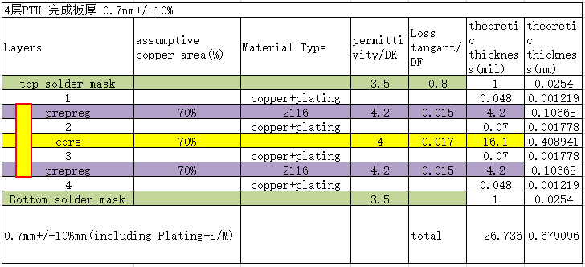  

<div align="center"> Figure 4-8 Reference Stackup Structure Diagram for a 4-Layer Through-Hole Board </div>  <br> <br> <br>

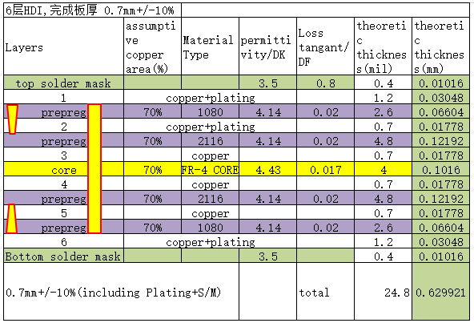  

<div align="center"> Figure 4-9 Reference Stackup Structure Diagram for a 6-Layer Blind and Buried Via Board </div>  <br> <br> <br>

### General PCB Design Rules

The general PCB design rules for PTH through-hole boards are shown in Figure 4-10.

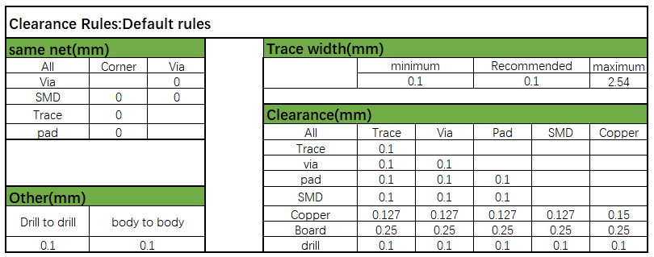  

<div align="center"> Figure 4-10 General PCB Design Rules for PTH Through-Hole Boards </div>  <br> <br> <br> 

The general PCB design rules for HDI-1 are shown in Figure 4-11.

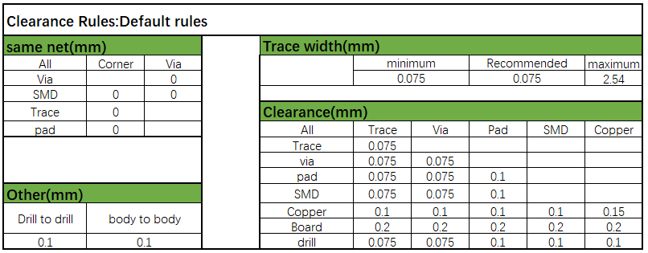  

<div align="center"> Figure 4-11 General PCB Design Rules for HDI-1 Blind and Buried Via Boards </div>  <br> <br> <br> 


### Chip Routing Fanout

The SF32LB55x series chips are available in multiple package types. Different routing and fanout methods must be used depending on the package type, as shown in Figure 4-12 for BGA package routing and fanout and in Figure 4-13 for QFN package routing and fanout:


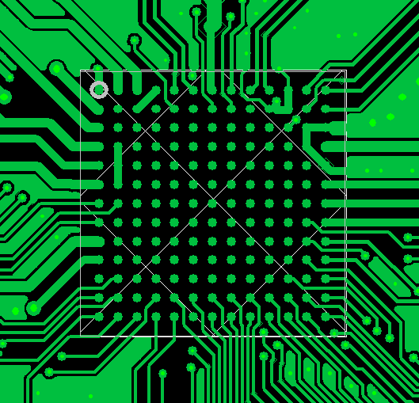  

<div align="center"> Figure 4-12 BGA Package Routing Fanout Reference Diagram </div>  <br> <br> <br> 


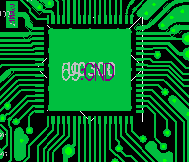  

<div align="center"> Figure 4-13 QFN Package Routing Fanout Reference Diagram </div>  <br> <br> <br> 


### Clock Interface Routing

The crystal must be placed inside the shielding cover, with a spacing of more than 1 mm from the PCB board outline. Keep it as far away as possible from devices that generate significant heat, such as PA, Charge, PMU, and other circuit components. The distance should preferably be greater than 5 mm to avoid affecting the crystal frequency deviation. The keep-out clearance for the crystal circuit must be greater than 0.25 mm to avoid other metal or components, as shown in Figure 4-14.

  

<div align="center"> Figure 4-14 Crystal Layout Diagram </div>  <br> <br> <br> 

For the 48 MHz crystal, it is recommended to route the traces on the top layer, with the length controlled within 3–10 mm and a trace width of 0.1 mm. Three-dimensional ground shielding must be applied, and the traces must be kept away from VBAT, DC/DC, and high-speed signal traces. The top layer and adjacent layers under the 48 MHz crystal area must be treated as keep-out areas, and no other traces are allowed to pass through this area, as shown in Figure 4-15, Figure 4-16, and Figure 4-17.

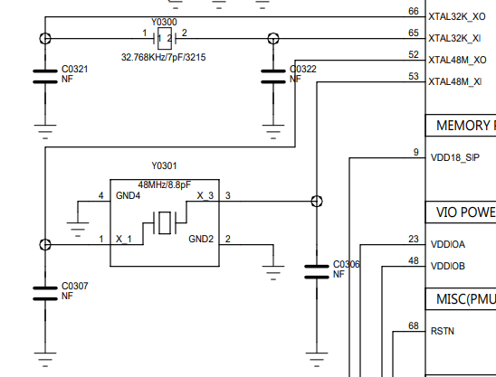  

<div align="center"> Figure 4-15 48 MHz Crystal Schematic </div>  <br> <br> <br> 

  

<div align="center"> Figure 4-16 48 MHz Crystal Routing Model </div>  <br> <br> <br> 

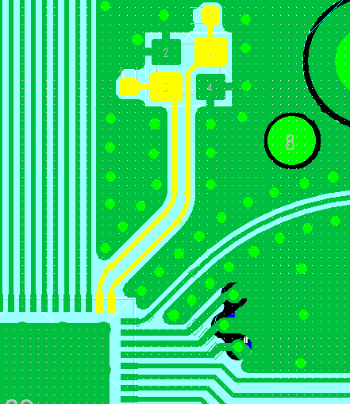  

<div align="center"> Figure 4-17 48 MHz Crystal Routing Reference </div>  <br> <br> <br> 

For the 32.768 kHz crystal, it is recommended to route the traces on the top layer, with the trace length controlled to ≤10 mm and a trace width of 0.1 mm. The spacing between the parallel 32K_XI/32_XO traces should be ≥0.15 mm. Three-dimensional ground shielding must be applied. The top layer and adjacent layer under the crystal area must be treated as keep-out areas, and no other traces are allowed to pass through this area, as shown in Figure 4-18, Figure 4-19, and Figure 4-20.

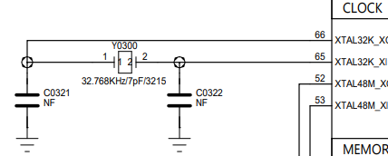  

<div align="center"> Figure 4-18 32.768 kHz Crystal Schematic </div>  <br> <br> <br> 

  

<div align="center"> Figure 4-19 32.768 kHz Crystal Routing Model </div>  <br> <br> <br> 

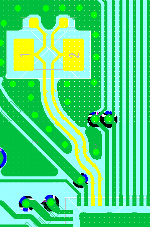  

<div align="center"> Figure 4-20 32.768 kHz Crystal Routing Reference </div>  <br> <br> <br> 

### RF Interface Routing

The RF matching circuit should be placed as close as possible to the chip side, not near the antenna side. The filter capacitor for the AVDD_BRF RF power supply should be placed as close as possible to the chip pin. The capacitor ground pin should be connected directly to the main ground through a via. The schematic and PCB layout of the π-type network for the RF signal are shown in Figure 4-21 and Figure 4-22, respectively.

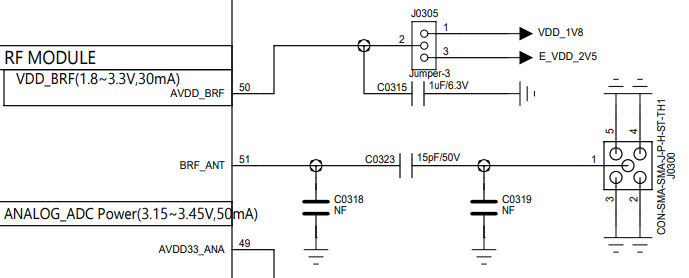  

<div align="center"> Figure 4-21 π-Type Network and Power Supply Circuit Schematic </div>  <br> <br> <br> 

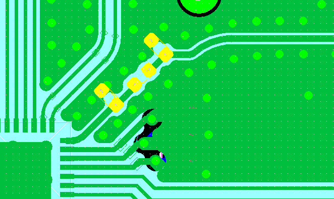  

<div align="center"> Figure 4-22 π-Type Network and Power Supply PCB Routing </div>  <br> <br> <br> 

It is recommended to route RF traces on the top layer and avoid vias and layer transitions that may affect RF performance. The trace width should preferably be greater than 10 mil. Three-dimensional ground shielding is required. Avoid routing with acute angles or right angles. Add multiple shielding ground vias on both sides of the RF trace. The RF trace must be controlled to 50-ohm impedance, as shown in Figure 4-23 and Figure 4-24.


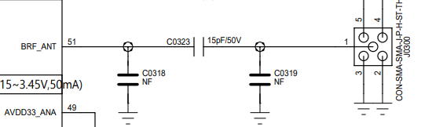  

<div align="center"> Figure 4-23 RF Signal Circuit Schematic </div>  <br> <br> <br> 


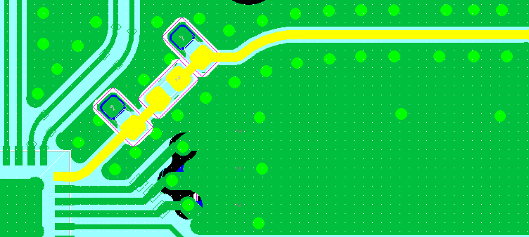  

<div align="center"> Figure 4-24 50-ohm RF Signal PCB Routing </div>  <br> <br> <br> 


For RF circuit routing, DC-DC, VBAT, and high-speed digital signals, such as crystal oscillator signals, high-frequency clocks, and digital interface signals (I2C, SPI, SDIO, I2S, UART, etc.), are prohibited from passing through this area.

For the BGA package, AVSS_TRF, AVSS_RRF, AVSS_BB, and AVSS_VCO are the RF circuit ground pins. Good grounding must be ensured, and the ground pads must have a sufficient number of vias connected to the main ground.

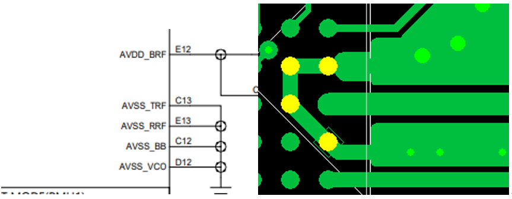

<div align="center"> Figure 4-25 PCB Diagram of RF Circuit Ground Signals </div>  <br> <br> <br>

### High-Speed Digital Signal Trace Routing

The MIPI_DSI, OPI PSRAM, LCDC_SPI, and QSPI interfaces of the SF32LB55x series chips must be routed according to the high-speed digital signal trace rules.

MIPI_DSI requires differential routing with 100-ohm characteristic impedance control, and the data and clock traces must be length-matched.

For the OPI interface of the external PSRAM memory chip, route the traces with matched lengths.

For the LCDC_SPI and QSPI interfaces, keep the trace lengths matched as much as possible.

Clock lines and I2C traces must be ground-shielded, and long parallel routing with other traces should be avoided.

### DC-DC Circuit Routing

The power inductor and filter capacitors of the DC-DC circuit must be placed close to the chip pins. The BUCK_VSW trace should be as short and wide as possible to ensure low loop inductance for the entire DC-DC circuit. All DC-DC output filter capacitor ground pins should be connected to the main ground plane with multiple vias. The BUCK_VOUT pin feedback trace must not be too narrow and must be greater than 0.25 mm. Copper pour is prohibited on the top layer in the power inductor area, and the adjacent layer must be a complete reference ground. Avoid routing other traces through the inductor area, as shown in Figure 4-26 and Figure 4-27.
   
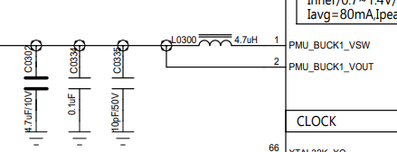

<div align="center"> Figure 4-26 Schematic of key DC-DC components </div>  <br> <br> <br>

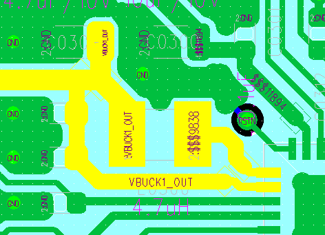

<div align="center"> Figure 4-27 PCB layout of key DC-DC components </div>  <br> <br> <br>

### Power Supply Routing

PVDD_PMU1(PIN67) is the power input pin for the chip's built-in PMU module. The corresponding capacitor must be placed close to the pin, and the trace should be as wide as possible and no less than 0.3 mm, as shown in Figure 4-28 and Figure 4-29.
   
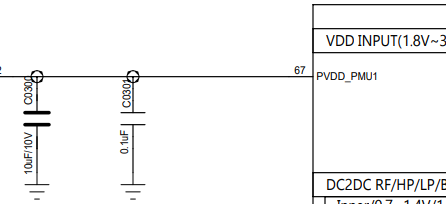

<div align="center"> Figure 4-28 Power supply circuit </div>  <br> <br> <br>

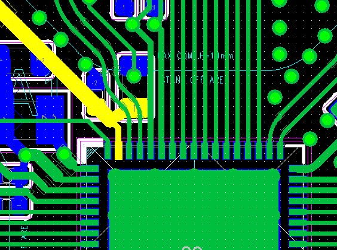

<div align="center"> Figure 4-29 PCB routing of the power supply circuit </div>  <br> <br> <br>

### LDO and I/O power input routing

The filter capacitors for all LDO outputs and I/O power input pins should be placed close to the corresponding pins. Their trace widths must meet the input current requirements, and the traces should be as short and wide as possible to reduce power ripple and improve system stability, as shown in Figure 4-30 and Figure 4-31.


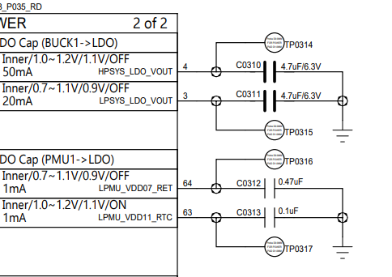

<div align="center"> Figure 4-30 LDO internal power supply filter circuit </div>  <br> <br> <br>

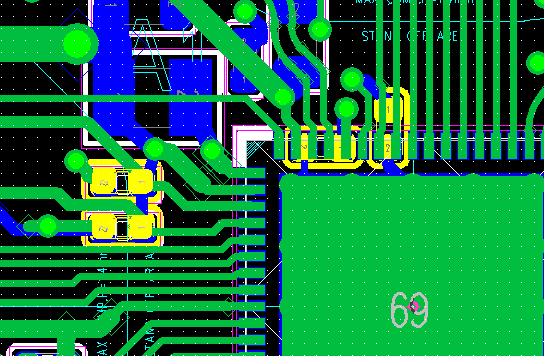

<div align="center"> Figure 4-31 LDO and I/O input power routing diagram </div>  <br> <br> <br>

### Other Interface Routing

Pins configured for GPADC signals must use three-dimensional ground shielding and be kept away from other interfering signals, such as the battery level circuit and temperature detection circuit.

#### Chip ground routing

For the QFN68 package, the pad in the center area of the package is the ground PIN for the entire chip. The PIN in the center area must be connected directly to the main ground layer with vias. In particular, place as many vias as possible in areas close to the RF interface pins and PMU interface pins to ensure good grounding.
   
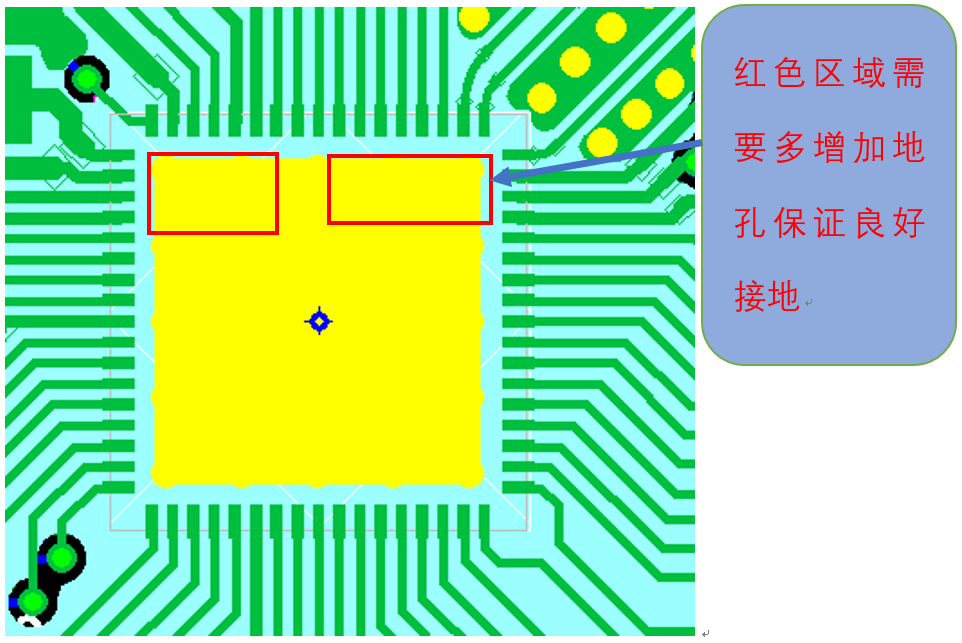

<div align="center"> Figure 4-32 QFN68 package ground routing </div>  <br> <br> <br>

For the BGA package, the RF interface ground and PMU interface ground are separated and are connected to ground through BGA balls. Ensure that the BGA balls corresponding to the RF interface ground, C13, E13, D12, and E13, are properly connected to the main ground, and avoid leaving them floating or not connected to the main ground. The BGA balls corresponding to the PMU interface DC-DC are D2 and B3. Ensure that these two balls are connected directly to the main ground layer, and avoid connecting them to other ground balls on the top layer.

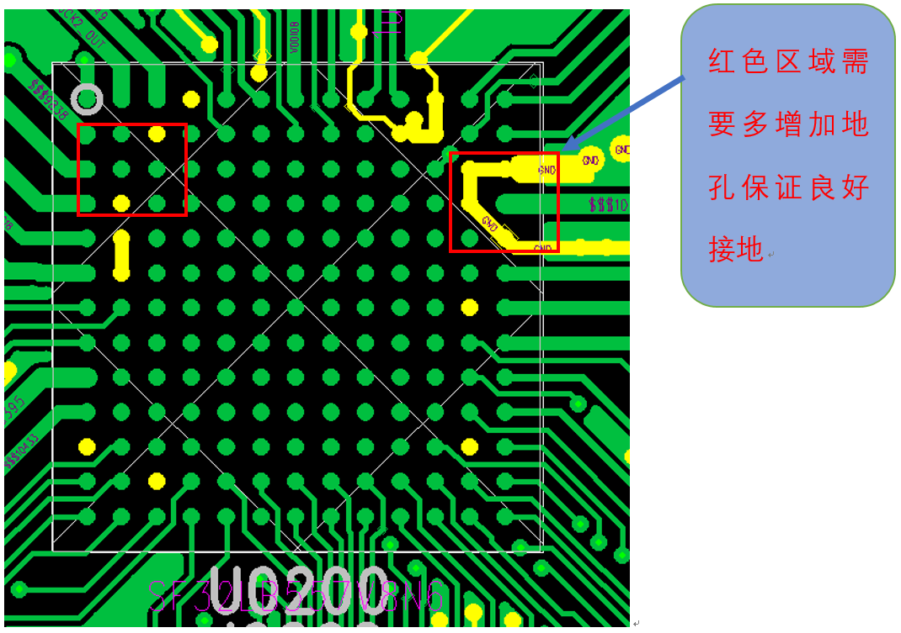

<div align="center"> Figure 4-33 BGA package ground routing </div>  <br> <br> <br>

#### EMI&ESD routing

Avoid long-distance routing on the top layer outside the shielding cover. In particular, interfering signals such as clocks and power supplies should be routed on inner layers as much as possible and must not be routed on the top layer. ESD protection devices must be placed close to the corresponding connector pins. Signal traces should first pass through the pins of the ESD protection device; avoid signal branches that bypass the ESD protection pins. The ground pins of ESD devices must be connected to the main ground through vias, and the ground pad traces must be short and wide to reduce impedance and improve ESD device performance.

#### Other

USB charging test points must be placed before the TVS diode, and the TVS diode for the battery holder must be placed before the platform. The routing must ensure that the traces go to the TVS first and then to the chip side.
 
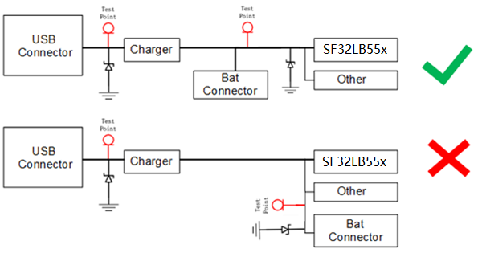

<div align="center"> Figure 4-34 Power Supply TVS Layout Reference </div>  <br> <br> <br>

Avoid routing the TVS diode ground pin over a long distance before connecting it to ground.


<div align="center"> Figure 4-35 TVS Routing Reference </div>  <br> <br> <br>

## Q&A

- Question 1: Why are the default states of some GPIOs different from the SPEC description when booting with Mode = 1?
  Answer: Booting with Mode = 1 enters download mode, which changes the states of the GPIOs related to QSPI2 and QSPI3 of the external Flash.

- Question 2: Why does the SMD motor vibrate abnormally during program download?
  Answer: This is caused by the motor Power Supply control signal or PWM control signal being turned on abnormally. If vibration starts at a high level, a GPIO with PU is used, causing the motor supply to start vibration. Therefore, it is recommended to use GPIO17 or GPIO39 with PD to output the PWM signal.

- Question 3: Why might soldering the battery cause a crash? How can this be avoided?
  Answer: Because the soldering iron is not properly grounded, a surge impact may cause a crash. Adding surge and ESD protection to the battery interface and properly grounding the soldering iron can avoid these issues.

- Question 4: The wake-up button is connected to the chip wake-up port, but it cannot wake up the MCU in Hibernate mode. Why?
  Answer: To wake up the MCU with a key in Hibernate mode, only the six LCPU GPIOs GPIO43-GPIO48 can be used; the HCPU-side GPIO0-GPIO3 cannot be used.

- Question 5: During low-power debugging, the power consumption of Sensors such as the G-Sensor or heart rate sensor is found to be high, or their functions are abnormal. How can this be avoided?
  Answer: Because the G-sensor or heart-rate Sensors program runs on the LCPU, its data signals such as I2C and SPI, as well as control signals and interrupt signals, must all use LCPU interfaces. If any signal uses an HCPU-side interface, it may cause higher power consumption or abnormal functionality.

- Question 6: During low-power debugging, the power consumption of Sensors such as the G-Sensor or heart rate sensor is found to be high, and all signals are connected to LCPU interfaces. How can this be avoided?
  Answer: The G-Sensor or heart rate sensor uses an I2C interface. During low-power debugging, the Power Supply of the G-Sensor or heart rate sensor is turned off, but the pull-up Power Supply of I2C is not turned off, causing leakage on the I2C interface of the G-Sensor or heart rate sensor. In this case, ensure that the Power Supply of the G-Sensor or heart rate sensor is turned off, and also be sure to turn off the pull-up Power Supply for signals such as its I2C interface and interrupt interface.

- Question 7: During low-power debugging, GPIO26 and GPIO27 are both used for output control, resulting in high power consumption. How can this be avoided?
  Answer: When entering sleep, make the levels of GPIO26 and GPIO27 consistent, or at least set one of them to a high-impedance state (no pull-up or pull-down).

- Question 8: During low-power debugging, after SS6600 enters Hibernate mode, the power consumption is found to be high. How can this be avoided?
  Answer: When entering Hibernate mode, if the signal levels of the 4 HCPU wake-up ports GPIO0-GPIO3 and the 6 LCPU wake-up ports GPIO43-GPIO48 are not stable high or low levels, leakage is likely to occur. Pay special attention that when the 10 wake-up ports are kept pulled up, the pull-up Power Supply must use an always-on 3.3VPower Supply.

- Question 9: During low-power debugging, the power consumption is found to be high. How can this be avoided?
  Answer: Selecting a BUCK, LDO, or Loadswitch with a large Iq current will increase power consumption. It is recommended to use devices with Iq below 1uA.

- Question 10: During ESD testing, the screen is found to display artifacts. How can this be avoided?
  Answer: ESD devices must be added to signals such as TP VDD, SCL, SDA, RESET, INT, and LCD Power Supply and RESET.

- Question 11: The display-off Display function is abnormal. How can this be avoided?
  Answer: The screen-off Display function is mainly used for AMOLED screens, which consume less power than TFT screens. It is recommended to use PB-interface GPIOs for control interfaces such as LCD_EN and LCD_RST. If a PA-interface GPIO is used for active-high enable, a PU GPIO must be used. If a PA PD pin is used for control, an abnormal screen-off lasting more than 10 ms will occur after wakeup.

- Question 12: A PA GPIO is used to control the switch of an external audio Bluetooth device. When SF32LB55X sleeps, the audio Bluetooth device needs to keep Power Supply supplied. After SF32LB55X wakes up, the external audio Bluetooth power-on/off becomes abnormal. How can this be avoided?
  Answer: If the SF32LB55X needs to keep the external audio Bluetooth power supply normal after entering sleep, an LCPU GPIO pin must be used for power on/off control. If it is enabled by a low level, select a GPIO pin with default PD.

- Question 13: After battery overdischarge, charging is abnormal and the battery cannot be charged normally. How can this be avoided?
  Answer: When the battery voltage is too low, the charging circuit needs to use path management to ensure that when the charger is inserted, the system Power Supply is provided by the charger. If the charging circuit does not have path management, the selected Charger IC must have a trickle charge current of at least 40mA.

- Question 14: After the charger is inserted, the battery cannot be charged. How can this be avoided?
  Answer: The charger insertion detection signal must be connected to the LCPU side, to any one of the wakeup-capable GPIO43-GPIO48 GPIO interfaces. If it is connected to another GPIO interface, the charging process cannot be started normally.

- Question 15: When MODE is pulled high, the device enters download mode and the current is too high. How can this be avoided?
  Answer: Pay attention to peripherals with relatively high current, such as an audio PA. If it is enabled by a high level, a PD GPIO must be selected to control the switch, and a PU GPIO must not be used. If a PU GPIO is selected, when entering download mode, it may be enabled abnormally, causing increased current and affecting program download.

- Question 16: When MODE is pulled high, program download is found to be abnormal. How can this be avoided?
  Answer: If the interrupt signal of Sensors such as G_SENSOR is connected to GPIO46, when the Mode pin is pulled high, GPIO46 defaults to UART3_RX, which will cause abnormal MCU program download. The solution is to connect the interrupt signal of Sensors such as G_SENSOR to any wakeup pin among GPIO43, GPIO44, GPIO47, and GPIO48. If the LCPU wakeup pins are still insufficient, the key signal (the key must not be on the mainboard) can be connected in series with a 0-ohm resistor to GPIO45 or GPIO46.

- Question 17: The G-Ssensor and HR algorithms occupy a large amount of resources, and the existing memory resources are insufficient. How can this be avoided?
  Answer: It is necessary to evaluate whether the storage space allocated to LCPU is sufficient. If it is not sufficient, an external Nor Flash must be connected on QSPI4.


## Revision History

| Version  | Date       | Release Notes                         |
| ----- | ---------- | -------------------------------- |
| 0.7   | 06/26/2024 | Modified the recommended capacitor values                   |
| 0.6   | 04/15/2024 | Changed formatting                         |
| 0.5   | 12/01/2023 | Updated the PCB design guidelines section             |
| 0.4   | 08/29/2022 | Updated some descriptions and added content such as the Q&A chapter |
| 0.3   | 10/19/2021 | Added the disclaimer and copyright notice            |
| 0.2   | 10/18/2021 | Added the document status description                  |
| 0.1   | 03/24/2021 | Initial draft                              |
