# SF32LB56xU Hardware Design Guide

## Basic Introduction

The main purpose of this document is to help developers develop watch solutions based on the SF32LB56xU series chips. This document focuses on hardware design considerations during solution development, reducing developers' workload as much as possible and shortening the product time to market.

The SF32LB56xU chip is a highly integrated, high-performance system-on-chip (SoC) MCU chip for ultra-low-power artificial intelligence IoT (AIoT) scenarios. The chip innovatively adopts a large/small core architecture based on the ARM Core-M33 STAR processor, and also integrates the industry's highest-performance 2.5D graphics engine, an artificial intelligence neural network accelerator, and Bluetooth Low Energy 5.3. It can be widely used in various application scenarios such as wrist-worn wearable electronic devices, smart mobile terminals, and smart homes.

  The SF32LB56xU chip processor peripheral resources are as follows:

- 44 GPIOs

- 6x UART

- 7x I2C

- 5x GPTIM

- 1x SPI

- 1x I2S audio interface

- 1x SDIO storage interface

- 1x differential analog audio output

- 1x differential analog audio input

- Supports single-/dual-/quad-data-line SPI display interfaces and serial JDI-mode display interfaces

- Supports both displays with GRAM and displays without GRAM

- Supports SWD and UART flashing and software debugging

## Package

### Package Introduction

The package information for SF32LB56xU is shown in Table 2-1.


<div align="center"> Table 2-1 Package Information List  </div>

```{table}
:align: center
| Package Name  | Dimensions             | Pin Pitch | 
| -------- | --------------- | -------- | 
| QFN68L   | 7x7x0.75 mm     | 0.35 mm  | 
```

### SF32LB56xU QFN68L package

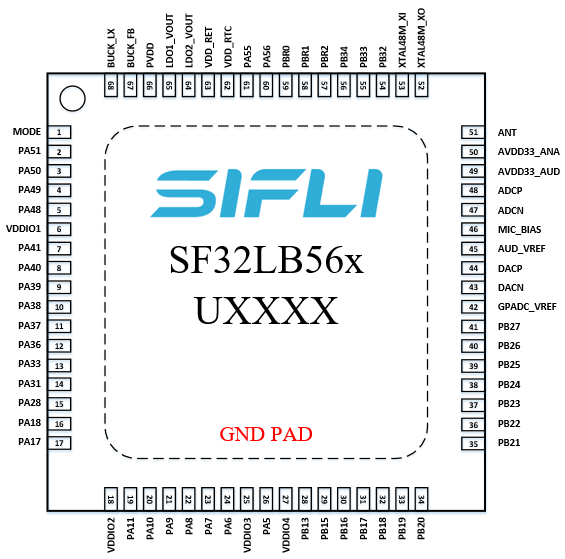 

<div align="center"> Figure 2-1 SF32LB56xU QFN68L Pinout </div>  <br>  <br>  <br>


## Typical Application Solution

Figure 3-1 shows a typical block diagram of a sports watch, whose main functions include display, storage, sensors, vibration motor, and audio input and output.

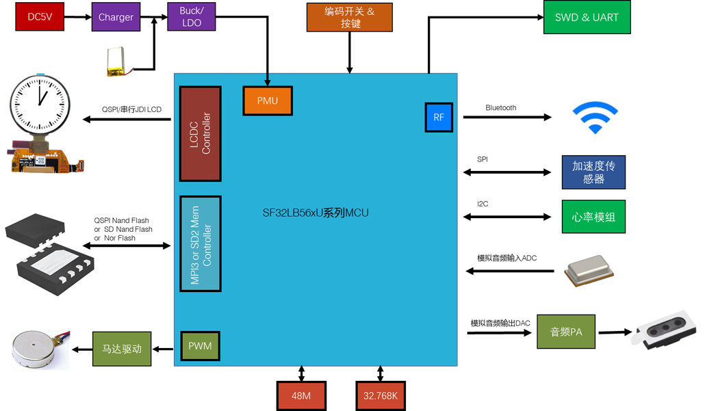 

<div align="center"> Figure 3-1 Sports Watch Block Diagram </div>  <br>  <br>  <br>

:::{Note} 

- Big/little dual-CPU architecture, meeting both high-performance and low-power design requirements

- External charging management chip

- Supports battery voltage detection using GPADC

- The power supply uses a Buck, LDO, and Load Switch solution

- Supports TFT or AMOLED displays with a QSPI interface, with resolutions up to 1024*1024

- Supports PWM backlight control

- Supports an external NOR Flash storage chip with a QSPI interface

- Supports an external NAND Flash storage chip with a QSPI interface

- Supports an external NAND Flash storage chip with an SDIO interface

- Supports Bluetooth 5.3 communication

- Supports analog audio input

- Supports analog audio output

- Supports PWM vibration motor control

- Supports accelerometer/geomagnetic/gyroscope sensors with SPI/I2C interfaces

- Supports heart rate/SpO2/ECG sensors with an I2C interface

- Supports SEGGER J-Link SWD debugging and flashing tools

- Supports a UART debug print interface

- Supports a Bluetooth HCI debug interface

- Supports one-to-many firmware flashing on the production line

- Supports crystal calibration on the production line

- Supports OTA online upgrade functionality
:::
  

## Schematic Design Guidelines

### Power Supply

This series of chips has a built-in PMU unit, and PVDD can support a 1.7~3.6 V power input. The PMU supports one Buck and multiple LDOs to supply power to the chip's internal circuits. For detailed connections of each power pin, refer to Table 4-1.

#### Processor Power Supply Requirements

SF32LB56xU power supply specifications:

<div align="center"> Table 4-1 PMU Power Supply Specifications </div>

```{table}
:align: center
| PMU Power Supply pin       | Minimum Voltage(V)   | Typical Voltage(V)  | Maximum Voltage(V)  | Maximum Current(mA)   | Detailed Description                                                   |
| :--------------- | :---------: | :---------: | :---------: | :----------: | :-------------------------------------------------------- |
| PVDD             |    1.7      |     1.8     |     3.6     |     100      | PVDD Power Supply input                                              |
| BUCK_LX  BUCK_FB |      -      |    1.25     |      -      |     100      | BUCK_LX output, connected to the inductor; internal Power Supply input, connected to the other end of the inductor and to an external capacitor         |
| LDO1_VOUT        |      -      |     1.1     |      -      |      50      | LDO1 output, with external capacitor                                          |
| LDO2_VOUT        |      -      |     0.9     |      -      |      20      | LDO2 output, with external capacitor                                          |
| VDD_RET          |      -      |     0.9     |      -      |      1       | RET LDO output, with external capacitor                                       |
| VDD_RTC          |      -      |     1.1     |      -      |      1       | RTC LDO output, with external capacitor                                       |
| MIC_BIAS         |     1.4     |      -      |     2.8     |      -       | MIC Power Supply output                                                |
| AVDD33_ANA       |    3.15     |     3.3     |    3.45     |      50      | Analog Power Supply + RFPA Power Supply input                                      |
| AVDD33_AUD       |    3.15     |     3.3     |    3.45     |      50      | Analog audio Power Supply                                                |
| VDDIO1           |    1.71     |     1.8     |    1.98     |      -       | Power Supply input for the internally packaged Storage device of the big core                                    |
| VDDIO2           |    1.71     |     1.8     |    3.45     |      -       | Power Supply input for PA GPIO (except PA5~11)                                 |
| VDDIO3           |    1.71     |     1.8     |    3.45     |      -       | Power Supply input for PA5~11                                              |
| VDDIO4           |    1.71     |     1.8     |    3.45     |      -       | Power Supply input for PB GPIO and internally packaged Flash of the small core                            |
| GPADC_VREF       |      -      |      -      |      -      |      -       | GPADC reference voltage input; connect only an external capacitor, no external power supply required                      |
| AUD_VREF         |      -      |      -      |      -      |      -       | Audio reference voltage input; connect only an external capacitor, no external power supply required                       |
```

The recommended values for the external capacitors on the power pins of the SF32LB56xU series chips are shown in Table 4-2.

<div align="center"> Table 4-2 Recommended Capacitance Values </div>

```{table}
:align: center
| Power Supply Pin          | Capacitor          | Detailed Description                                    |
| ---------------- | ------------- | ------------------------------------------ |
| PVDD             | 0.1uF + 10uF  | Place at least two capacitors, 10uF and 0.1uF, close to the pin.  |
| BUCK_LX  BUCK_FB | 0.1uF + 4.7uF | Place at least two capacitors, 4.7uF and 0.1uF, close to the pin. |
| LDO1_VOUT        | 4.7uF         | Place at least one 4.7uF capacitor close to the pin.            |
| LDO2_VOUT        | 4.7uF         | Place at least one 4.7uF capacitor close to the pin.            |
| VDD_RET          | 0.47uF        | Place at least one 0.47uF capacitor close to the pin.           |
| VDD_RTC          | 1uF           | Place at least one 1uF capacitor close to the pin.              |
| AVDD33_ANA       | 4.7uF         | Place at least one 4.7uF capacitor close to the pin.            |
| GPADC_VREF       | 4.7uF         | Place at least one 4.7uF capacitor close to the pin.          |
| AVDD33_AUD       | 4.7uF         | Place at least one 4.7uF capacitor close to the pin.          |
| AUD_VREF         | 1uF           | Place at least one 1uF capacitor close to the pin.            |
| MIC_BIAS         | 1uF           | Place at least one 1uF capacitor close to the pin.              |
| VDDIO1           | 1uF           | Place at least one 1uF capacitor close to the pin.              |
| VDDIO2           | 1uF           | Place at least one 1uF capacitor close to the pin.              |
| VDDIO3           | 1uF           | Place at least one 1uF capacitor close to the pin.              |
| VDDIO4           | 1uF           | Place at least one 1uF capacitor close to the pin.              |
```
#### SiFli PMIC chip power distribution

SF30147C is a highly integrated, high-efficiency, cost-effective power management chip designed for ultra-low-power wearable products. SF30147C integrates one high-efficiency, low-quiescent-current BUCK, with a 1.8 V output and a maximum drive current of 500 mA. SF30147C integrates four low-dropout, low-quiescent-current LDOs, with outputs of 2.8–3.3 V and a maximum drive current of 100 mA.

SF30147C integrates seven low-quiescent-current, low-on-resistance load switches. Among them, two are high-voltage load switches, suitable for peripherals driven directly by the battery voltage, such as audio power amplifiers; five are low-voltage switches, suitable for peripherals powered by 1.8 V.

SF32LB56xU can communicate with SF30147C through the TWI interface. For the usage of each power output of SF30147C, see Table 4-3. For details about this chip, refer to the "DS0002-SF30147C Chip Datasheet" document.

<div align="center"> Table 4-3 SF30147CPower Supply Allocation Table </div>

```{table}
:align: center
| SF30147C  Power Supply Pin | Minimum Voltage (V) | Maximum Voltage (V) | Maximum Current (mA) | Detailed Description                                                     |
| ------------------ | ----------- | ----------- | ------------ | ------------------------------------------------------------ |
| VBUCK              | 1.8         | 1.8         | 500          | 1.8V Power Supply inputs such as PVDD, VDDIOA, VDDIOA2, VDDIOB, VDDIOSA, VDDIOSB, VDDIOSC, AVDD_BRF of SF32LB56xU |
| LVSW1              | 1.8         | 1.8         | 100          | 1.8V power supply output                                                |
| LVSW2              | 1.8         | 1.8         | 100          | G-SENSOR 1.8V power supply input                                        |
| LVSW3              | 1.8         | 1.8         | 150          | Heart rate 1.8V power supply input                                            |
| LVSW4              | 1.8         | 1.8         | 150          | LCD 1.8V power supply input                                             |
| LVSW5              | 1.8         | 1.8         | 150          | 1.8V power supply output                                            |
| LDO1               | 2.8         | 3.3         | 100          | 3.3V Power Supply inputs such as AVDD33_ANA, AVDD33_AUD, VDDIOA2 of SF32LB56xU    |
| LDO2               | 2.8         | 3.3         | 100          | Motor power supply input                                        |
| LDO3               | 2.8         | 3.3         | 100          | LCD 3.3V power supply input                                             |
| LDO4               | 2.8         | 3.3         | 100          | Heart rate 3.3V power supply input                                             |
| HVSW1              | 2.8         | 5           | 150          | Analog Class-K PA power supply input                                       |
| HVSW2              | 2.8         | 5           | 150          | GPS power supply input                                                  |
```

#### Power-On Sequence and Reset

The PMU inside the SF32LB56xU chip integrates POR (Power-on Reset) and BOR (Brownout Reset) functions. The specific requirements are shown in Figure 4-1.

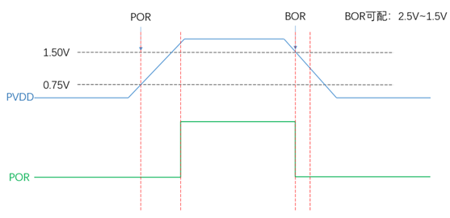 

<div align="center"> Figure 4-1 Power-On/Power-Off Timing Diagram </div>  <br>  <br>  <br>

When the system powers on and PVDD rises to 1.5 V, the system completes POR; when PVDD drops to the voltage value that triggers BOR (configurable from 2.5 V to 1.5 V), the PMU outputs a reset signal and the system resets.


#### Typical Power Supply Circuit

It is recommended to use SF30147C to supply power to SF32LB56xU and various peripherals. The reference schematic is shown in Figure 4-2, and details are provided in Table 4-3.

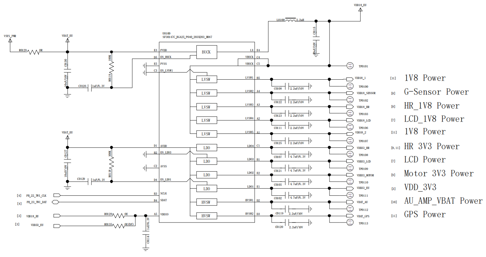 

<div align="center"> Figure 4-2 SF30147C Power Supply Diagram </div>  <br>  <br>  <br>

The SF32LB56xU series chips have one built-in BUCK output, as shown in Figure 4-3.

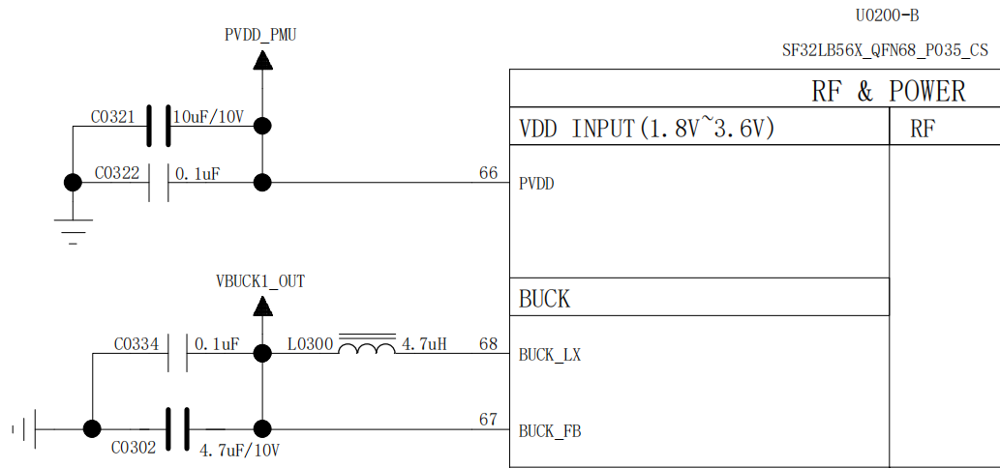 

<div align="center"> Figure 4-3 Built-in BUCK Circuit Diagram </div>  <br>  <br>  <br>

The SF32LB56xU series chips integrate four LDO channels, as shown in Figure 4-4.

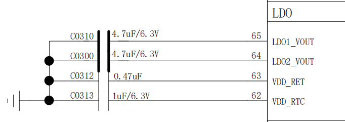 

<div align="center"> Figure 4-4 Built-in LDO Circuit Diagram </div>  <br>  <br>  <br>


#### Processor BUCK Inductor Selection Requirements

:::{important}
**Key Parameters of the Power Inductor**

L (inductance) = 4.7 uH ± 20%, DCR (DC resistance) ≦ 0.4 ohm, Isat (saturation current) ≧ 450 mA.
:::

#### Battery and Charging Control

A sports watch generally contains a polymer lithium battery pack, and the entire power system requires an additional charging circuit to charge the battery.

A typical charging circuit consists of a protection circuit (EOS, ESD, and OVP protection), a charging management chip, a battery, and other components. The charging management chip in the circuit in Figure 4-1 does not include path management. The system power supply and the battery are connected together. Because the leakage power consumption of the VBAT-powered modules is relatively high, the design does not meet the power consumption requirements of Shipping Mode, so Shipping Mode is not supported.

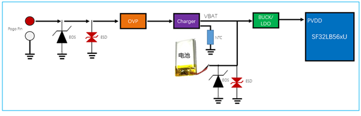 

<div align="center"> Figure 4-5 Typical Charging Circuit 1 </div>  <br>  <br>  <br>

As shown in Figure 4-6, the trickle charging current of the charging management chip must be greater than i1+i2 to charge an over-discharged battery. If the trickle charging current is less than i1+i2, the over-discharged battery cannot be charged.

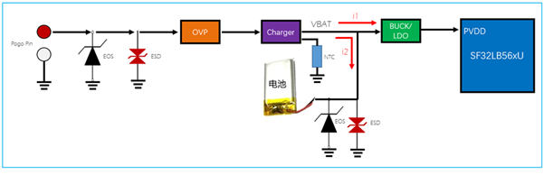 

<div align="center"> Figure 4-6 Schematic Diagram of Charging Circuit for an Overdischarged Battery </div>  <br>  <br>  <br>

As shown in Figure 4-7, if the system downstream of VBAT is powered on and operating normally, the constant-current charging current of the charging management chip must be greater than i1+i2. If it is less than i1+i2, both the charging management chip and the battery will supply power to the downstream system, preventing the battery from being fully charged.

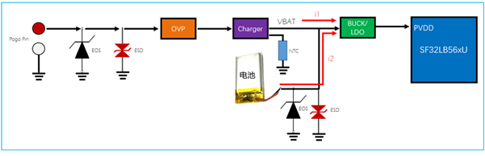 

<div align="center"> Figure 4-7 Schematic Diagram of Low Charging Current from the Charging Management IC </div>  <br>  <br>  <br>

In the circuit in Figure 4-8, the charging management chip is a complex chip with path management and can support Shipping Mode. Because the VSYS supply to the system and the charging of VBAT are separated, even if the battery is over-discharged, the power supply to the downstream system is not affected.

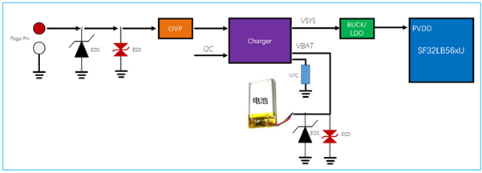 

<div align="center"> Figure 4-8 Typical Charging Circuit 2 </div>  <br>  <br>  <br>

#### How to Reduce Standby Power Consumption

To meet the long battery life requirements of watch products, it is recommended that the hardware design use load switches to perform dynamic Power Supply management for each functional module. For always-on modules or paths, select appropriate devices to reduce quiescent current.
The entire SF32LB56xU system requires two Power Supply rails, 3.3V and 1.8V, where:

* Some pins of the main chip SF32LB56xU are continuously supplied with 3.3 V and 1.8 V power;
* A 1.8 V interface level is recommended for peripheral devices;
* Other modules use load switches for power switch management and are off by default.

As shown in Figures 4-5, 4-6, and 4-7, depending on the peripheral device selection, the SF32LB56xU has three power supply topology options with low, medium, and high system power consumption. As shown in Figure 4-9, the PVDD and VDDIO1-4 of the SF32LB56xU are supplied with 1.8 V, and peripherals with a 1.8 V interface level are selected. Compared with the other two power supply topologies, this provides the lowest overall system power consumption. As shown in Figure 4-10, the MCU remains supplied by 1.8 V power, while peripherals with a 3.3 V interface level are selected. The overall system power consumption is higher than that of the topology in Figure 4-9. As shown in Figure 4-11, except for the on-chip PSRAM power supply pin VDDIO1, which is supplied with 1.8 V, the peripheral devices and MCU are supplied with 3.3 V. Compared with the first two topologies, this results in the highest overall system power consumption. Users can select the power supply topology according to device selection and system power consumption requirements.

During design, note that the hardware default level of the GPIO pin controlling the load switch must be consistent with the enable level of the load switch to ensure that the load switch is off by default. It is recommended to reserve a pull-up or pull-down resistor on the enable pin of the load switch, with a recommended resistance of 1 MΩ.


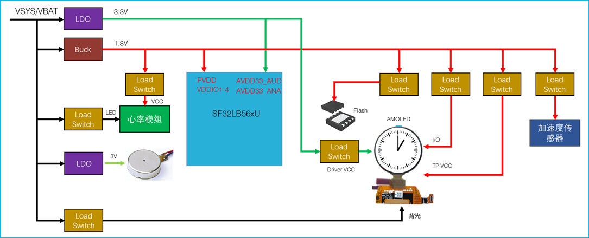 

<div align="center"> Figure 4-9 SF32LB56xU 1.8V Peripheral Power Supply Topology Diagram </div>  <br>  <br>  <br>

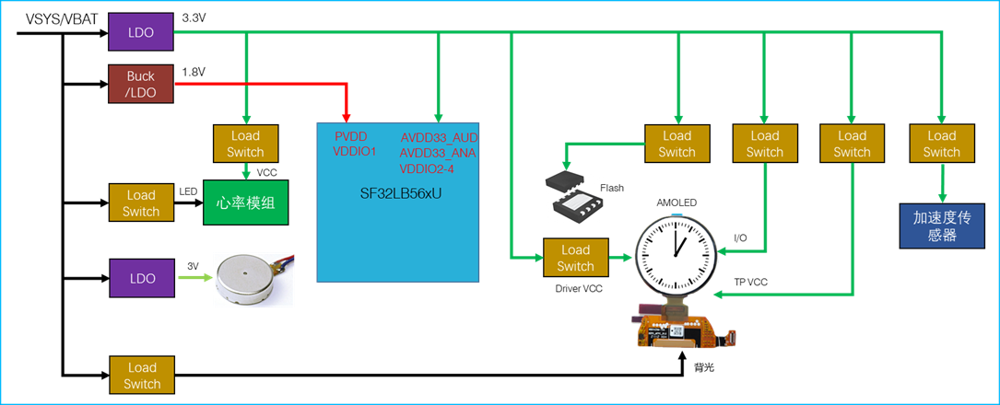 

<div align="center"> Figure 4-10 SF32LB56xU 3.3V Peripheral Power Supply Topology Diagram 1 </div>  <br>  <br>  <br>

 

<div align="center"> Figure 4-11 SF32LB56xU 3.3V Peripheral Power Supply Topology Diagram 2 </div>  <br>  <br>  <br>


### Reset Issues

The PMU inside the SF32LB56xU chip integrates POR (Power-on Reset) and BOR (Brownout Reset) functions. The specific requirements are shown in Figure 4-12.

 

<div align="center"> Figure 4-12 Power-On/Power-Off Timing Diagram </div>  <br>  <br>  <br>

When the system powers on and PVDD rises to 1.5 V, the system completes POR; when PVDD drops to the voltage value that triggers BOR (configurable from 2.5 V to 1.5 V), the PMU outputs a reset signal and the system resets.

### Boot Mode

The SF32LB56xU series chips provide a Mode pin for configuring the boot mode. It has an internal pull-down and can be left floating when not used. The reference circuit is shown in Figure 4-13:

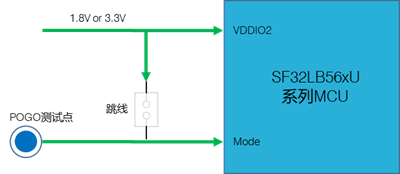 

<div align="center"> Figure 4-13 Recommended Circuit Diagram for the Mode Pin </div>  <br>  <br>  <br>

:::{attention}
**Mode pin definition:**

=1: The system enters download mode during boot and does not enter the user program;

=0: During system boot, the ROM checks whether a user program exists. If it exists, the system enters the user program; otherwise, it enters download mode.

**Notes:**

1. The voltage domain of Mode is the same as that of VDDIO2;
2. A test point must be reserved for the Mode pin on mass-production boards. It is used for program flashing or crystal calibration; a jumper does not need to be reserved;
3. It is recommended to reserve a jumper for the Mode pin on test boards, so that after a program crash, the board can be booted from download mode to download the program.
:::

### Processor Operating Modes and Wake-up Sources

Both the HCPU and LCPU of the SF32LB56xU series chips support the multiple operating modes listed in Table 4-4.

<div align="center"> Table 4-4 CPU Operating Mode List </div>

```{table}
:align: center

| Operating Mode      | CPU   | Peripheral  | SRAM                                | IO       | LPTIM | Wake-up Source                                    | Wake-up Time       |
| ------------- | ----- | ----- | ----------------------------------- | -------- | ----- | ----------------------------------------- | -------------- |
| Active        | Run   | Run   | Accessible                              | Toggleable   | Run   |                                           |                |
| WFI/WFE       | Stop  | Run   | Accessible                              | Toggleable   | Run   | Any interrupt                                  | < 0.5us        |
| DEEPWFI       | Stop  | Run   | Accessible                              | Toggleable   | Run   | Any interrupt                                  | < 5us          |
| Light sleep   | Stop  | Stop  | Not accessible,  fully retained                  | Level held | Run   | RTC, GPIO, LPTIM,  cross-system,  Bluetooth, comparator | < 100us        |
| Deep sleep    | Stop  | Stop  | Not accessible,  fully retained                  | Level held | Run   | < 300us                                   |                |
| Standby       | Reset | Reset | Not accessible,  LP fully retained, HP retains only 160KB | Level held | Run   | RTC, Buttons, LPTIM,  cross-system, Bluetooth          | 1.5ms+recovery |
| Hibernate rtc | Reset | Reset | Data not retained                          | High-Z     | Reset | RTC, Buttons                                 | > 2ms          |
| Hibernate pin | Reset | Reset | Data not retained                          | High-Z     | Reset | Buttons                                      | > 2ms          |
```
:::{attention}
- Using Standby mode as power-off:
  * Because the GPIO levels can be retained, VDDIO1 can be continuously powered, and there will be no leakage on the IO of the co-packaged memory.
  * The storage devices on MPI1 and MPI2 need to be set to low-power mode to reduce power consumption.
- Using Hibernate mode as power-off:
  * Because the GPIO levels cannot be retained, the VDDIO1 power supply must be turned off to avoid leakage on the IO of the co-packaged memory.
  * PBR0 is used as the control signal for the power switches of VDDIOSA and VDDIOSB.
:::

As shown in Table 4-5, the full series of chips supports eight wake-up-capable interrupt sources, which can wake up the big-core or small-core CPU.

<div align="center"> Table 4-5 Wake-Up Interrupt Source List </div>

```{table}
:align: center

| Interrupt Source     | Pin | Detailed Description   |
| ---------- | ---- | ---------- |
| WKUP_PIN0  | PB32 | Interrupt signal 0  |
| WKUP_PIN1  | PB33 | Interrupt signal 1  |
| WKUP_PIN2  | PB34 | Interrupt signal 2  |
| WKUP_PIN5  | PA50 | Interrupt signal 5  |
| WKUP_PIN6  | PA51 | Interrupt signal 6  |
| WKUP_PIN10 | PBR0 | Interrupt signal 10 |
| WKUP_PIN11 | PBR1 | Interrupt signal 11 |
| WKUP_PIN12 | PBR2 | Interrupt signal 12 |
```

### Clock

The SF32LB56xU series chips require two externally supplied clock sources: a 48 MHz main crystal and a 32.768 kHz RTC crystal. For the specific crystal specification requirements and selection, see Table 4-6 and Table 4-7.


:::{important}
**Key Crystal Parameters**

<div align="center"> Table 4-6 Crystal Specification Requirements </div>

```{table}
:align: center
|Crystal|Crystal specification requirements   |Detailed description  |
|:--|:-------|:--------|
|48MHz |7pF≦CL≦12pF (recommended value 8.8pF) △F/F0≦±10ppm ESR≦30 ohms (recommended value 22ohms)|Crystal oscillator power consumption is related to CL and ESR. The smaller the CL and ESR, the lower the power consumption. For optimal power performance, it is recommended to use components with relatively smaller CL and ESR values within the required range. Reserve parallel matching capacitors next to the crystal. When CL<12pF, no capacitors need to be mounted|
|32.768KHz |CL≦12.5pF (recommended value 7pF) △F/F0≦±20ppm ESR≦80k ohms (recommended value 38Kohms)|Crystal power consumption is related to CL and ESR. The smaller the CL and ESR, the lower the power consumption. For optimal power consumption performance, it is recommended to use components with relatively small CL and ESR values within the required range. Reserve parallel matching capacitors next to the crystal. When CL<12.5pF, no capacitor needs to be soldered|
```

**Crystal Recommendation**

<div align="center"> Table 4-7 Recommended Crystal List </div>

```{table}
:align: center

| Model                | Manufacturer    | Parameters                                                         |
| ------------------- | ------- | ------------------------------------------------------------ |
| E1SB48E001G00E      | Hosonic | F0 = 48.000000MHz, △F/F0 = -6 ~ 8 ppm,  CL = 8.8 pF, ESR =  22 ohms Max  TOPR  = -30 ~ 85℃, Package = (2016 metric) |
| ETST00327000LE      | Hosonic | F0 = 32.768KHz, △F/F0  = -20 ~ 20 ppm,  CL = 7 pF, ESR =  70K ohms Max  TOPR  = -40 ~ 85℃, Package = (3215 metric) |
| SX20Y048000B31T-8.8 | TKD     | F0 = 48.000000MHz, △F/F0 = -10 ~ 10 ppm,  CL = 8.8 pF, ESR =  40 ohms Max  TOPR  = -20 ~ 75℃, Package = (2016 metric) |
| SF32K32768D71T01    | TKD     | F0 = 32.768KHz, △F/F0  = -20 ~ 20 ppm,  CL = 7 pF, ESR =  70K ohms Max  TOPR  = -40 ~ 85℃, Package = (3215 metric) |
```

Note: The ESR of SX20Y048000B31T-8.8 is slightly higher, and the static power consumption will also be slightly higher.

When routing the PCB, remove at least the second-layer GND copper under the crystal to reduce the parasitic load capacitance on the clock signal.
:::

For detailed material certification information, refer to:
[SIFLI-MCU-AVL Certification List](index)

### RF

The RF PCB routing requirement for SF32LB56xU series chips is a 50-ohm characteristic impedance. If the antenna is already matched, no additional RF components are required. It is recommended to reserve a π-type matching network in the design for spurious filtering. Refer to the circuit shown in Figure 4-14.

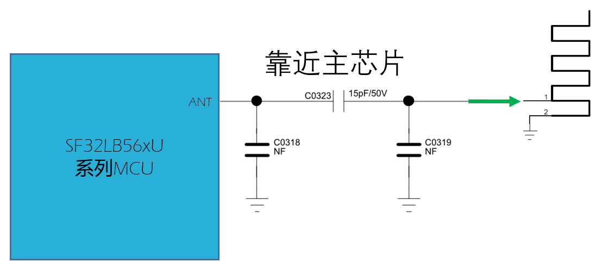 

<div align="center"> Figure 4-14 RF Circuit Diagram </div>  <br>  <br>  <br>

### How to Connect Peripherals to the Big-Core and Small-Core Processors

The SF32LB56xU series chips contain two processor systems. The PAx GPIOs are connected to the HCPU system, and the PBx GPIOs are connected to the LCPU system. The HCPU can access all peripheral resources of the LCPU, but it is not recommended for the LCPU to access HCPU resources. The HCPU can run at a maximum clock frequency of 240 MHz and is used to provide high-performance computing, graphics processing, and high-resolution/frame-rate display. External memory, display interfaces, and other high-power devices must be connected to the HCPU.

The LCPU typically runs at 48 MHz @ 0.9 V and can run up to 96 MHz @ 1.1 V. It is used to process the BLE protocol stack, as well as heart-rate and accelerometer sensor control in low-power mode, charging and PMIC management, voltage monitoring, and power-on/off management.   

### Display

The SF32LB56xU series chips support 3-Line SPI, 4-Line SPI, Dual data SPI, Quad data SPI, and serial JDI interfaces. They support 16.7M-colors (RGB888), 262K-colors (RGB666), 65K-colors (RGB565), and 8-color (RGB111) color depth modes. The maximum supported resolution is 1024RGBx1024. The list of supported LCD drivers is shown in Table 4-8.

<div align="center"> Table 4-8 LCD Driver Support List </div>

```{table}
:align: center

| Model     | Manufacturer       | Resolution  | Type   | Interface                                                         |
| -------- | ---------- | ------- | ------ | ------------------------------------------------------------ |
| RM69090  | Raydium    | 368*448 | Amoled | 3-Line SPI，4-Line  SPI，Dual data SPI，  Quad data SPI，MIPI-DSI |
| RM69330  | Raydium    | 454*454 | Amoled | 3-Line SPI，4-Line  SPI，Dual data SPI，  Quad data SPI，8-bits  8080-Series MCU ，MIPI-DSI |
| ILI8688E | ILITEK     | 368*448 | Amoled | Quad data SPI，MIPI-DSI                                      |
| SH8601A  | Shine World Technology   | 454*454 | Amoled | 3-Line SPI, 4-Line  SPI, Dual data SPI,  Quad data SPI, 8-bits  8080-Series MCU, MIPI-DSI |
| SPD2012  | Solomon    | 356*400 | TFT    | Quad data SPI                                                |
| GC9C01   | Galaxycore | 360*360 | TFT    | Quad data SPI                                                |
| ST77903  | Sitronix   | 400*400 | TFT    | Quad data SPI                                                |
```

#### SPI/QSPI Display Interface

The SF32LB56xU series chips support 3/4-wire SPI and Quad-SPI interfaces for connecting LCD displays. The signal descriptions are shown in Table 4-9.

<div align="center"> Table 4-9 SPI/QSPI Display Signal Connection Method </div>

```{table}
:align: center

| SPI Signal | SF32LB56XU Pin | SS6700A Pin | Detailed Description                                                  |
| ------- | -------------- | ----------- | --------------------------------------------------------- |
| CSX     | PA36           | PA36        | Enable signal                                                  |
| WRX_SCL | PA37           | PA37        | Clock signal                                                  |
| DCX     | PA39           | PA39        | Data/command signal in 4-wire SPI mode  Data 1 in Quad-SPI mode  |
| SDI_RDX | PA38           | PA38        | Data input signal in 3/4-wire SPI mode  Data 0 in Quad-SPI mode |
| SDO     | PA38           | PA38        | Data output signal in 3/4-wire SPI mode  Please short it together with SDI_RDX  |
| D0      | PA40           | PA40        | Data 2 in Quad-SPI mode                                    |
| D1      | PA41           | PA41        | Data 3 in Quad-SPI mode                                    |
| REST    | PA05           | PB04        | Display panel reset signal                                            |
| TE      | PA33           | PA33        | Tearing effect to MCU frame signal                        |
```

#### JDI Display Interface

The SF32LB56xU series chips support a serial JDI interface for connecting LCD displays, as shown in Table 4-10.

<div align="center"> Table 4-10 Serial JDI Display Signal Connection Method </div>

```{table}
:align: center

| JDI Signal      | Pin | Detailed Description                         |
| ------------ | ---- | -------------------------------- |
| JDI_SCS      | PA39 | Chip Select Signal               |
| JDI_SCLK     | PA41 | Serial Clock Signal              |
| JDI_SO       | PA40 | Serial  Data Output Signal       |
| JDI_DISP     | PA36 | Display  ON/OFF Switching Signal |
| JDI_EXTCOMIN | PA38 | COM Inversion Polarity Input     |
```

#### Touch and Backlight Interfaces

The SF32LB56xU series chips support an I2C-format touchscreen control interface and touch status interrupt input, and also support one PWM signal to control backlight power enable and brightness, as shown in Table 4-11.

<div align="center"> Table 4-11 Touch and Backlight Control Connection Method </div>

```{table}
:align: center

| Touchscreen and Backlight Signal | Pin | Detailed Description                   |
| ---------------- | ---- | -------------------------- |
| Interrupt        | PA50 | Touch status interrupt signal (wake-up capable) |
| I2C1_SCL         | PA48 | Touchscreen I2C Clock signal        |
| I2C1_SDA         | PA49 | Touchscreen I2C data signal        |
| BL_PWM           | PA31 | Backlight PWM control signal            |
| Reset            | PB18 | Touch reset signal               |
```

### Storage

#### SF32LB56xU External Memory

SF32LB56xU supports SPI NOR/NAND and SD NAND Flash peripherals. SPI NOR/NAND Flash uses the MPI interface, while SD NAND Flash uses the SD interface. The physical pins of these types of Flash chips are fully compatible. The interface definitions are shown in Tables 4-12 and 4-13. The GPIO pins PA06 to PA11 in the tables are powered by VDDIO3, which is independent of the voltage domains of other GPIOs. VDDIO3 can be set according to the interface level of the external Flash.

The MPI signal definitions are shown in Table 4-13, and the SD signal definitions are shown in Table 4-14.

<div align="center"> Table 4-12 SPI Nor/Nand Flash Signal Connection </div>

```{table}
:align: center

| Flash Signal | I/O Signal | Detailed Description                                    |
| ---------- | ------- | ------------------------------------------- |
| CS#        | PA06    | Chip select, active low.                    |
| SO         | PA07    | Data Input (Data Input Output 1)            |
| WP#        | PA08    | Write Protect Output (Data Input Output  2) |
| SI         | PA09    | Data Output (Data Input Output 0)           |
| SCLK       | PA10    | Serial Clock Output                         |
| Hold#      | PA11    | Data Output (Data Input Output 3)           |
```

:::{note}
The Hold# pin of the SPI NAND Flash must be pulled up to the SPI NAND Flash power supply through a 10K resistor.
:::

<div align="center"> Table 4-13 SD Nand Flash Signal Connections </div>

```{table}
:align: center

| Flash Signal | I/O Signal | Detailed Description |
| ---------- | ------- | -------- |
| SD2_CMD    | PA09    | Command signal |
| SD2_D1     | PA11    | Data 1    |
| SD2_D0     | PA10    | Data 0    |
| SD2_CLK    | PA08    | Clock signal |
| SD2_D2     | PA06    | Data 2    |
| SD2_D3     | PA07    | Data 3    |
```


### Buttons

The SF32LB56xU series chips use PB32 as the power on/off signal, so the short-press power on/off function and the long-press reset function can be combined on a single button. As shown in Figure 4-15, the design uses an active-high method. For the long-press reset function, the chip automatically resets when the button is pressed and held for more than 10 seconds.

The SF32LB56xU series chips support function key input and rotary knob signal input. The key or rotary knob signal must be pulled up. The key usage is shown in Figure 4-16. Optical tracking sensors are also supported. The I2C4 interface is recommended, and the signal connections are shown in Table 4-14.

<div align="center"> Table 4-14 Optical Tracking Sensors Signal Connections </div>

```{table}
:align: center

| I2C Signal | I/O  | Detailed Description                 |
| ------- | ---- | ------------------------ |
| SDA     | PA18 | Light-tracking SensorsI2C data signal |
| SCL     | PA17 | Light-tracking SensorsI2C Clock signal |
```

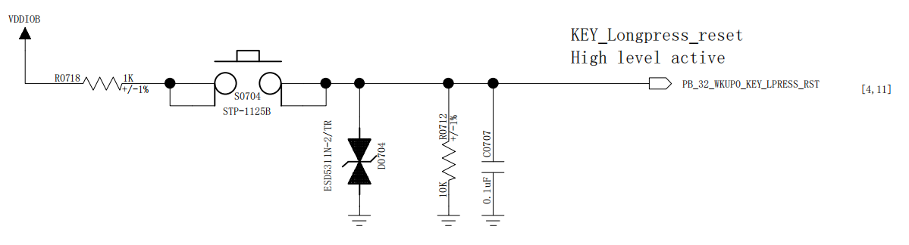 

<div align="center"> Figure 4-15 Power On/Off Buttons Circuit Diagram </div>  <br>  <br>  <br>

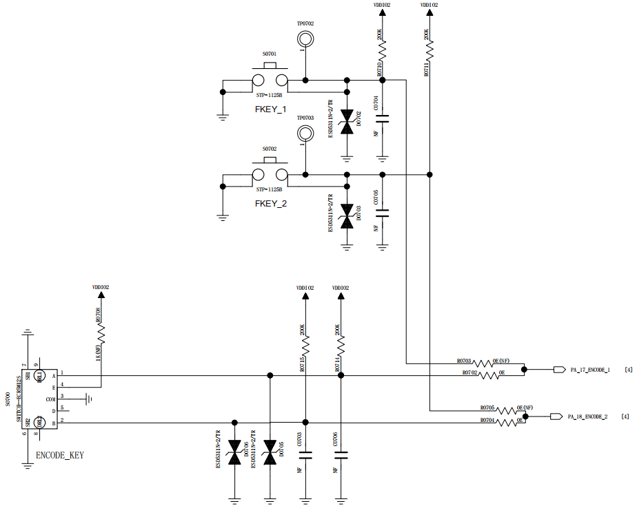 

<div align="center"> Figure 4-16 Function Buttons or Knob Circuit Diagram </div>  <br>  <br>  <br>

:::{note}
For a typical mechanical rotary encoder switch, the switch may not return to the off state after rotation. Therefore, the power supply connected to the pull-up resistor must be able to be turned off during standby to prevent leakage current.
:::

### Vibration Motor

The SF32LB56xU series chips support multiple PWM outputs, which can be used as drive signals for a vibration motor. Figure 4-17 shows the recommended circuit. If the current during motor vibration does not cause system instability, VBAT can also be used directly for power supply.

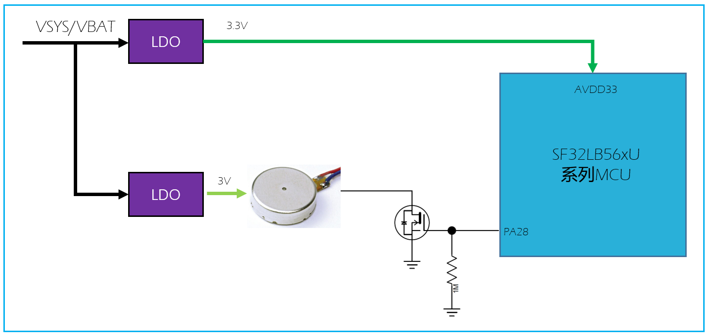 

<div align="center"> Figure 4-17 Vibration Motor Circuit Diagram </div>  <br>  <br>  <br>

:::{important}
If the software enables the HCPU main-frequency reduction macro definition `#define BSP PM FREQ SCALING 1`, after the HCPU enters the idle thread, the main frequency will decrease, and the PWM frequency of the corresponding Hcpu PA port will also change,
Therefore, it is recommended to use the PB interface to output the PWM signal.
:::

### Audio Interface

The audio-related interfaces of the SF32LB56xU series chips are shown in Table 4-15. The audio interface signals have the following characteristics:

1. Supports one differential ADC input for connecting an external analog MIC. A DC-blocking capacitor with a capacitance of at least 2.2 uF must be added in between. The power supply of the analog MIC is connected to the chip's MIC_BIAS power output pin;

2. Supports one differential DAC output for connecting an external analog audio PA. The DAC output traces should be routed as differential traces with proper ground shielding. Also note: trace capacitance < 10pF, length < 2cm. 

<div align="center"> Table 4-15 Audio Signal Connection Method </div>

```{table}
:align: center

| Audio Signal | I/O  | Detailed Description               |
| -------- | ---- | ---------------------- |
| AU_ADC1P | ADCP | Differential P or single-ended analog MIC input |
| AU_ADC1N | ADCN | Differential analog MIC input N or GND  |
| AU_DAC1P | DACP | Differential analog output P          |
| AU_DAC1N | DACN | Differential analog output N          |
```

The recommended circuit for an analog MEMS MIC with the SF32LB56xU series chips is shown in Figure 4-18. The recommended single-ended circuit for an analog ECM MIC is shown in Figure 4-19. The recommended differential circuit for an analog ECM MIC is shown in Figure 4-20. AU_ADC1P and AU_ADC1N are the ADC input pins connected to the SF32LB56XU.

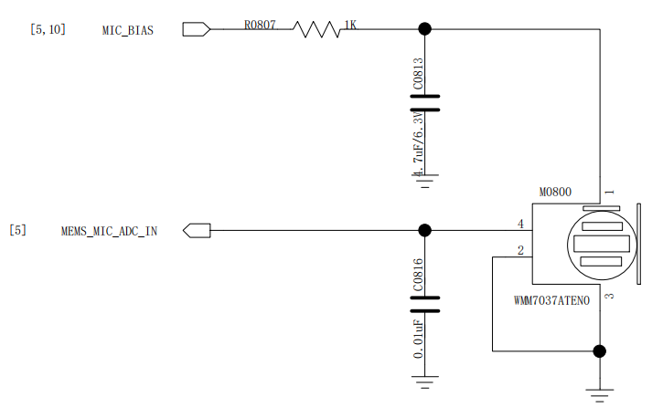 

<div align="center"> Figure 4-18 Analog MEMS MIC Input Circuit Diagram </div>  <br>  <br>  <br>

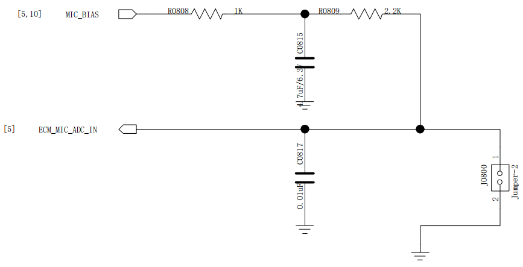 

<div align="center"> Figure 4-19 Analog ECM Single-Ended Input Circuit Diagram </div>  <br>  <br>  <br>

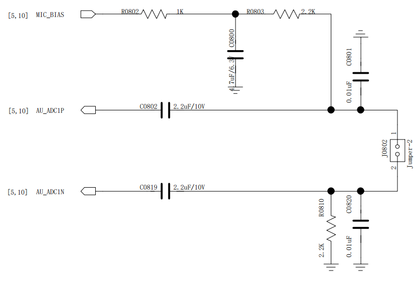 

<div align="center"> Figure 4-20 Analog ECM Differential Input Circuit Diagram </div>  <br>  <br>  <br>

The recommended analog audio output circuit for the SF32LB56xU series chips is shown in Figure 4-21. Note that the differential low-pass filter inside the dashed box should be placed close to the chip.

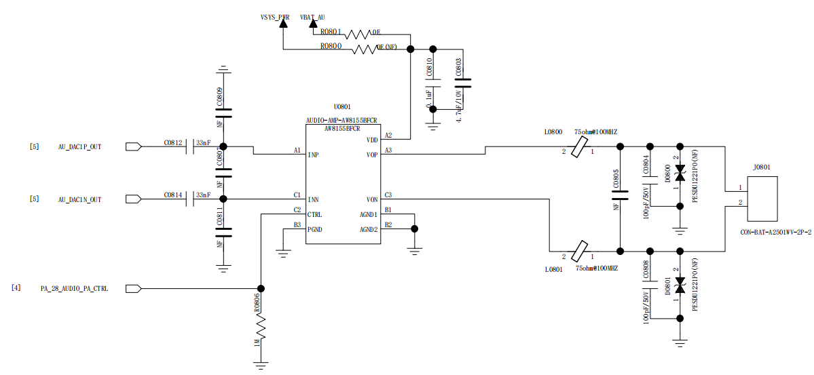 

<div align="center"> Figure 4-21 Analog Audio PA Circuit Diagram </div>  <br>  <br>  <br>


### PBR Interface Description

The SF32LB56xU series chips provide three PBR interfaces. Their main features are:

1. PBR0 changes from 0 to 1 during the power-on stage and is used for certain external LSW controls. PBR1-PBR2 output 0 by default;
2. PBR0-PBR2 can be used as outputs in both standby and hibernate modes;
3. PBR0-PBR2 can output LPTIM signals;
4. PBR1-PBR2 can output a 32K clock signal;
5. PBR0-PBR2 can be configured as inputs for wake-up signal input. When the MCU is awake, no interrupt is received.

### Sensors

The SF32LB56xU series chips support heart rate sensors, accelerometers, and other sensors. In the design, pay attention to the I2C, SPI, control, interrupt wake-up, and other interfaces for the heart rate sensor and accelerometer. It is recommended to use the LCPU PB interfaces. For the power supply of the heart rate sensor and accelerometer, use the LVSWx or LDO output of the SF30147C, which allows the power supply to be switched on and off as needed.

### UART and I2C Pin Settings

SF32LB56xU series chips support UART and I2C function mapping on any pin. All PA interfaces can be mapped as UART or I2C function pins. For PB ports, except for PB32/33/34 and PBR0/1/2, all IOs can be mapped as UART or I2C function pins.

### GPTIM Pin Settings

SF32LB56xU series chips support GPTIM function mapping on any pin. All PA interfaces can be mapped as GPTIM function pins. For PB ports, except for PB32/33/34 and PBR0/1/2, all IOs can be mapped as GPTIM function pins.

### Debug and Flashing Interface

SF32LB56xU series chips support the Arm® standard SWD debug interface, which can be connected to EDA tools for single-step execution and debugging. As shown in Figure 4-22, when connecting a SEEGER® J-Link® tool, the power supply of the debugging tool must be changed to external interface input, with the J-Link tool powered by the SF32LB56xU circuit board.

The SF32LB56xU series provides one SWD interface for debug information output, and one default UART port for flashing/downloading and printing logs. For details, refer to Table 4-16.

<div align="center"> Table 4-16 Debug Port Connection Method </div>

```{table}
:align: center
| Signal         | Pin | Detailed Description                       |
| ----------- | ---- | ----------------------------- |
| SWCLK       | PB15 | JLINK Clock signal, debug interface         |
| SWDIO       | PB13 | JLINK data signal, debug interface         |
| UART4_RXD   | PB16 | UART receive signal, download and log printing interface  |
| UART4_TXD   | PB17 | UART transmit signal, download and log printing interface  |
```

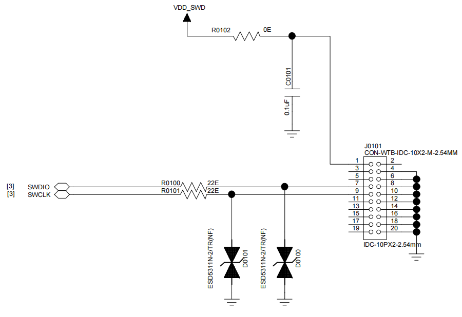 

<div align="center"> Figure 4-22 Debug Interface Circuit Diagram </div>  <br>  <br>  <br>


### Production Line Flashing and Crystal Calibration

SiFli Technology provides an offline downloader for production-line program flashing and crystal calibration.

During hardware design, be sure to reserve at least the following test points: VBAT, GND, VDDIO2, Mode, SWDIO, SWCLK, RXD4, TXD4, and PB20 or PB21 or PB25.

For detailed flashing and crystal calibration, see the “**_Offline Downloader User Guide.pdf” document, which is included in the development materials package.


### Schematic and PCB Drawing Checklist

See the “_Schematic checklist_.xlsx” and “_PCB checklist_.xlsx” documents, which are included in the development materials package.

## PCB Design Guidelines

### PCB Footprint Design

**Package Dimensions**

The SF32LB56xU chip uses the QFN68L package. Package dimensions: 7mmX7mmx0.75mm; number of pins: 68; pin pitch: 0.35mm. Detailed dimensions are shown in Figure 5-1.

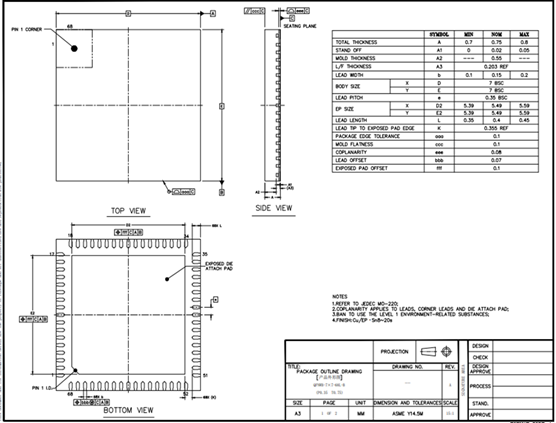  

<div align="center"> Figure 5-1 QFN68LPackage Dimension Drawing </div>  <br> <br> <br>

**Package Shape**

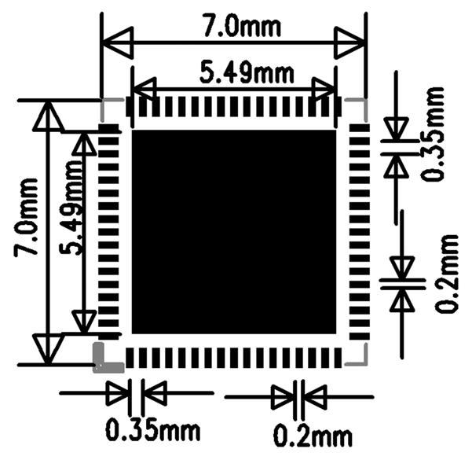  

<div align="center"> Figure 5-2 QFN68LPackage Outline Drawing </div>  <br> <br> <br>

**Pad Design**

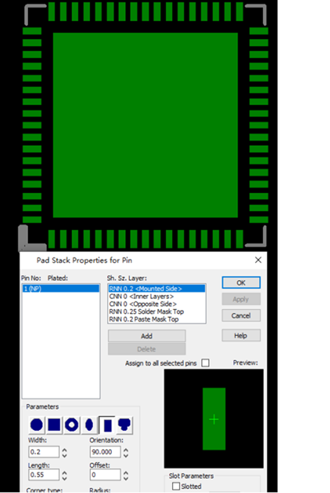  

<div align="center"> Figure 5-3 QFN68LPackagePCB Pad Design Reference </div>  <br> <br> <br>

**Package PINOUT/BALLMAP**

The QFN68L package PINOUT information for SF32LB56xU is shown in Figure 5-4.

  

<div align="center"> Figure 5-4 SF32LB56xUPackagePINOUT Information </div>  <br> <br> <br>


### PCB Stack-up Design

SF32LB56xU series chip layout supports single-sided and double-sided placement. The QFN package PCB supports PTH. A 4-layer PTH design is recommended. The recommended stack-up structure is shown in Figure 5-5.

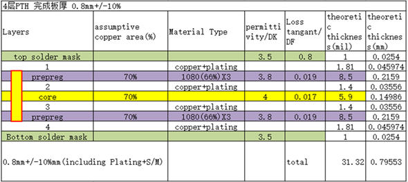  

<div align="center"> Figure 5-5 Reference Stack-Up Structure Diagram </div>  <br> <br> <br>

### General PCB Design Rules

The general PCB design rules for PTH boards are shown in Figure 5-6, with units in mm.

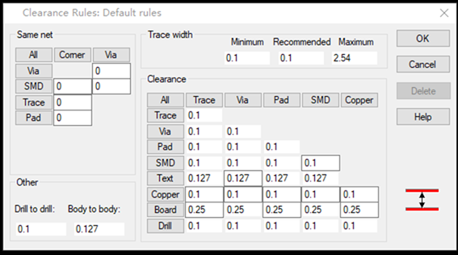  

<div align="center"> Figure 5-6 General Design Rules </div>  <br> <br> <br>

### Chip Routing Fanout

For the QFN package, all pins are fanned out through the top layer, as shown in Figure 5-7.

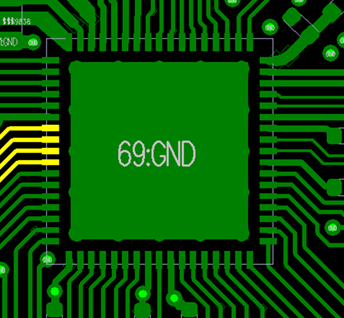  

<div align="center"> Figure 5-7 Top-Layer Fanout Reference Diagram </div>  <br> <br> <br>

### Clock Interface Routing

The crystal must be placed inside the shielding cover, with a spacing of more than 1mm from the PCB board outline. Keep it as far away as possible from components that generate significant heat, such as PA, Charge, PMU, and other circuit components; the distance should preferably be greater than 5MM to avoid affecting the crystal frequency offset. The keep-out clearance for the crystal circuit should be greater than 0.25mm to prevent other metals and components from being present, as shown in Figure 5-8.

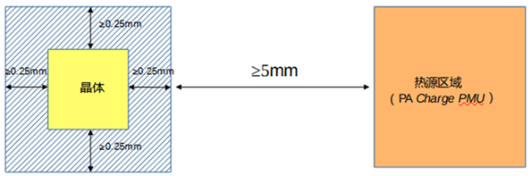  

<div align="center"> Figure 5-8 Crystal Layout Diagram </div>  <br> <br> <br>

For the 48MHz crystal traces, it is recommended to route them on the top layer, with the length controlled within 3-10mm and a trace width of 0.075mm. Three-dimensional ground shielding must be applied, and the traces must be kept away from VBAT, DC/DC, and high-speed signal lines. The top layer and adjacent layers under the 48MHz crystal area must be treated as a keep-out area, and other traces are prohibited from passing through this area, as shown in Figures 5-9, 5-10, and 5-11.


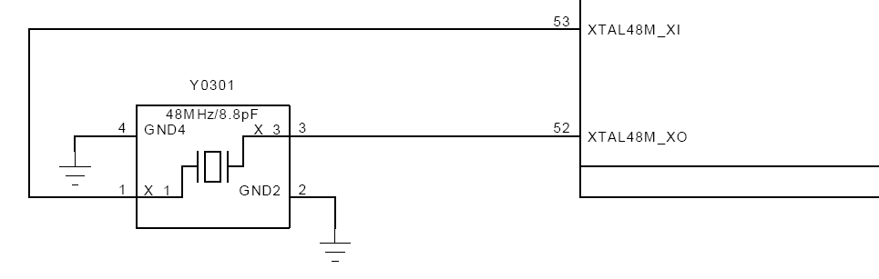  

<div align="center"> Figure 5-9 48MHz Crystal Schematic Diagram </div>  <br> <br> <br>

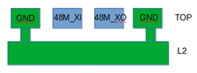  

<div align="center"> Figure 5-10 48MHz Crystal Trace Model </div>  <br> <br> <br>

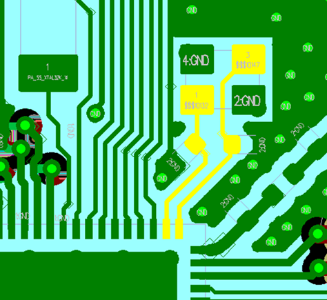  

<div align="center"> Figure 5-11 48MHz Crystal Routing Reference </div>  <br> <br> <br>

For the 32.768KHz crystal, it is recommended to route it on the top layer, with the trace length controlled to ≤10mm and a trace width of 0.075mm. The spacing between the parallel 32K_XI/32_XO traces should be ≥0.15mm. Three-dimensional ground shielding must be applied. The top layer and adjacent layers under the crystal area must be treated as a keep-out area, and other traces are prohibited from passing through this area, as shown in Figures 5-12, 5-13, and 5-14.


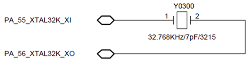  

<div align="center"> Figure 5-12  32.768KHz Crystal Schematic Diagram </div>  <br> <br> <br>

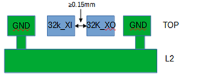  

<div align="center"> Figure 5-13  32.768KHz Crystal Trace Model </div>  <br> <br> <br>

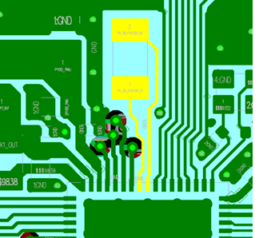  

<div align="center"> Figure 5-14  32.768KHz Crystal Routing Reference </div>  <br> <br> <br>

### RF Interface Routing

The RF matching circuit should be placed as close as possible to the chip side, not near the antenna side. For the AVDD_BRF RF power supply, its filter capacitor should be placed as close as possible to the chip pin. The capacitor ground pin should be connected directly to the main ground with vias. The schematic and PCB layout of the π-type network for the RF signal are shown in Figures 5-15 and 5-16, respectively.


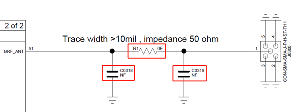  

<div align="center"> Figure 5-15 π-Type Network Circuit Schematic</div>  <br> <br> <br>

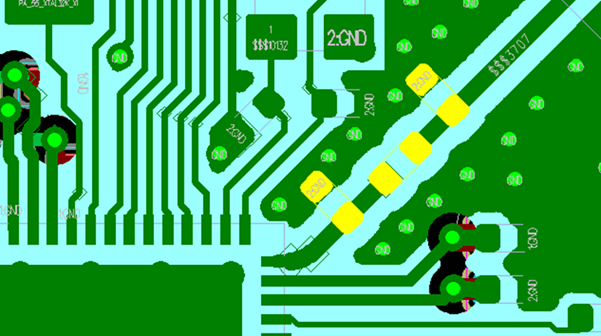  

<div align="center"> Figure 5-16 π-Type Network PCB Layout </div>  <br> <br> <br>

It is recommended to route the RF trace on the top layer to avoid vias and layer transitions that may affect RF performance. The trace width should preferably be greater than 10 mil. Three-dimensional ground shielding is required. Avoid routing with acute angles or right angles. Add multiple shielding ground vias on both sides of the RF trace. The RF trace must be controlled to 50-ohm impedance, as shown in Figures 5-17 and 5-18.

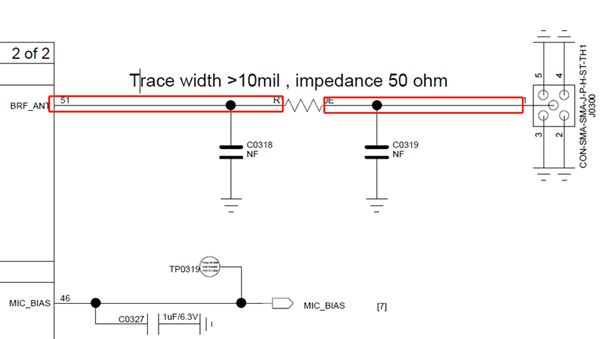  

<div align="center"> Figure 5-17 RF Signal Circuit Schematic </div>  <br> <br> <br>

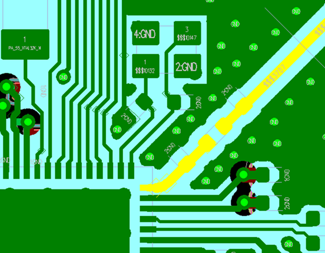  

<div align="center"> Figure 5-18 RF Signal PCB Routing </div>  <br> <br> <br>

### Audio Interface Routing

AVDD33_AUD is the pin that supplies power to the audio interface. Its filter capacitor should be placed close to the corresponding pin, and the ground pin of the filter capacitor should be well connected to the main ground. The AVDD33_ANA and AVDD33_AUD power traces both require ground shielding and should be kept away from high-current, strong-interference signals. The two power supplies should use star routing to avoid audio TDD noise, as shown in Figure 5-19.

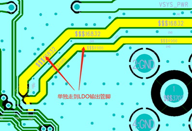  

<div align="center"> Figure 5-19  Audio Circuit Power Supply Routing Reference </div>  <br> <br> <br>

MIC_BIAS is the power supply circuit for the audio interface microphone. Its corresponding filter capacitor should be placed close to the corresponding pin, and the ground pin of the filter capacitor should be well connected to the main ground. The AUD_VREF filter capacitor should be placed close to the pin, as shown in Figure 5-20.

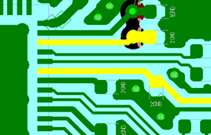   

<div align="center"> Figure 5-20  PCB Design for the Audio Circuit Power Supply Filter Circuit </div>  <br> <br> <br>

ADCP/ADCN are analog signal inputs. The corresponding circuit components should be placed as close as possible to the corresponding pins. Each P/N pair should be routed as differential traces, with the trace length kept as short as possible. The differential pair routing should use three-dimensional ground shielding. Strong interference signals from other interfaces should be kept away from these traces, as shown in Figure 5-21.

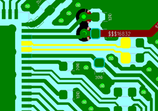  

<div align="center"> Figure 5-21  Analog Audio Input Routing Reference </div>  <br> <br> <br>

DACP/DACN are analog signal outputs. The corresponding circuit components should be placed as close as possible to the corresponding pins. Each P/N pair should be routed as differential traces, with the trace length kept as short as possible. The trace parasitic capacitance should be less than 10 pF. The differential pair routing must use three-dimensional ground shielding. Strong interference signals from other interfaces should be kept away from these traces, as shown in Figure 5-22.

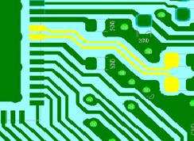  

<div align="center"> Figure 5-22  Analog Audio Output Routing Reference </div>  <br> <br> <br>

### USB Interface Routing

USB traces must first pass through the pins of the ESD device and then go to the chip side. Ensure that the ground pin of the ESD device is well connected to the main ground. PA17(USB DP)/PA18(USB_DN) should be routed as differential traces, controlled to 90-ohm differential impedance, and processed with three-dimensional ground shielding, as shown in Figure 5-23. Figure 5-24 shows a reference component layout and PCB routing model for USB signals.

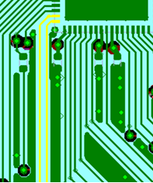  

<div align="center"> Figure 5-23  USB Signal PCB Design </div>  <br> <br> <br>


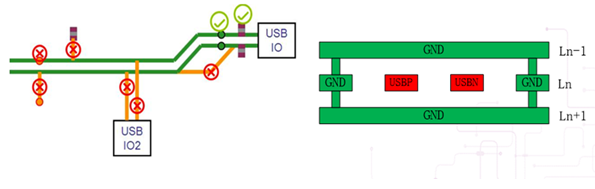  

<div align="center"> Figure 5-24  USB Signal Component Layout Reference Diagram and USBPCB Trace Model </div>  <br> <br> <br>


### SDIO Interface Routing

SF32LB56xU provides one SDIO interface. All SDIO signal traces should be routed together and should not be separated. The total trace length must be ≤50 mm, and the length within the group must be controlled to ≤6 mm. The SDIO interface clock signal requires three-dimensional ground shielding, and the DATA and CM signals also require ground shielding, as shown in Figure 5-25 and Figure 5-26.

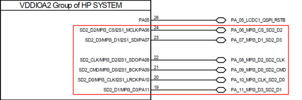  

<div align="center"> Figure 5-25 SDIO Interface Circuit Diagram </div>  <br> <br> <br>

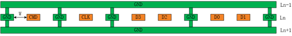  

<div align="center"> Figure 5-26 SDIO PCB Trace Model </div>  <br> <br> <br>

### DC-DC Circuit Routing

The power inductor and filter capacitor of the DC-DC circuit must be placed close to the chip pins. The BUCK_LX trace should be as short and wide as possible to ensure low loop inductance for the entire DC-DC circuit. The ground pins of all DC-DC output filter capacitors should be connected to the main ground plane with multiple vias. The BUCK_FB pin feedback trace must not be too narrow and must be greater than 0.25 mm. Copper pour is prohibited on the top layer in the power inductor area, and the adjacent layer must be a complete reference ground. Avoid routing other traces through the inductor area, as shown in Figure 5-27.

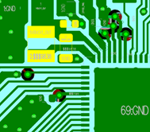  

<div align="center"> Figure 5-27 DC-DC Key Component PCB Layout Diagram </div>  <br> <br> <br>


### Power Supply Routing

PVDD is the power input pin for the chip's built-in PMU module. The corresponding capacitor must be placed close to the pin, and the trace should be as wide as possible and must not be less than 0.5 mm. PVSS is the ground pin of the PMU module and must be connected to the main ground through vias. Avoid leaving it floating, which would affect the performance of the entire PMU, as shown in Figure 5-28.

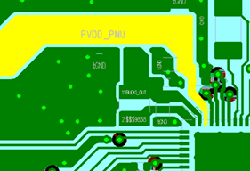  

<div align="center"> Figure 5-28 PVDD Input Routing </div>  <br> <br> <br>

### LDO and IO Power Input Routing

The filter capacitors for all LDO outputs and IO power input pins should be placed close to the corresponding pins. The trace width must meet the input current requirements, and the traces should be as short and wide as possible, thereby reducing power supply ripple and improving system stability, as shown in Figure 5-29.

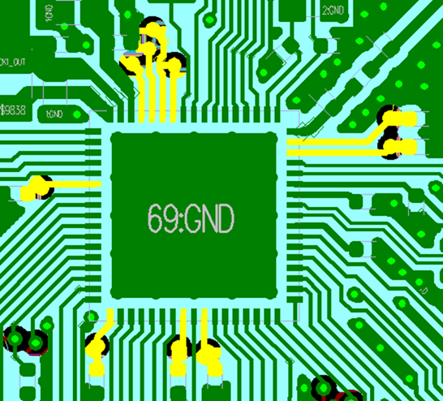  

<div align="center"> Figure 5-29 LDO and IO Input Power Supply Routing </div>  <br> <br> <br>

### Other Interface Routing

When a pin is configured as a GPADC pin signal, three-dimensional ground shielding is required, and it must be kept away from other interfering signals, such as battery level circuits and temperature detection circuits, as shown in Figure 5-30.

The PBR0-2 pins can all be configured as clock output pin signal networks. Three-dimensional ground shielding is required, and they must be kept away from other interfering signals, such as the 32K output, as shown in Figure 5-31.

### EMI&ESD routing

Avoid long-distance routing on the top layer outside the shielding cover. In particular, interfering signals such as clocks and power supplies should be routed on inner layers whenever possible and are prohibited from being routed on the top layer. ESD protection devices must be placed close to the corresponding connector pins. Signal traces should first pass through the pins of the ESD protection device to avoid signal branching that does not pass through the ESD protection pins. The ground pins of ESD devices must be connected to the main ground through vias. Ensure that the ground pad traces are short and wide to reduce impedance and improve the performance of the ESD devices.

### Other

USB charging cable test points must be placed before the TVS diode. The battery connector TVS diode must be placed before the platform, and its trace routing must ensure that the signal passes through the TVS first and then goes to the chip end, as shown in Figure 5-30.

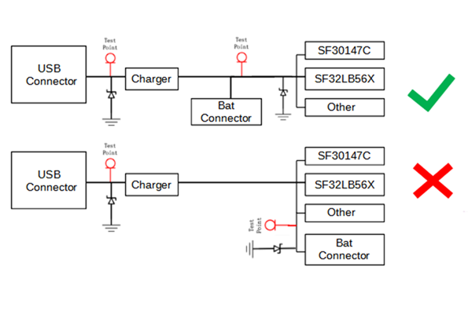  

<div align="center"> Figure 5-30 Power SupplyTVS Layout Reference </div>  <br> <br> <br>

Avoid routing a long trace from the TVS diode ground pin before connecting it to ground, as shown in Figure 5-31.

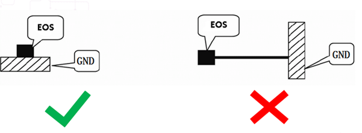  

<div align="center"> Figure 5-31 TVS Routing Reference </div>  <br> <br> <br>

## Q&A

Question 1: Why do some GPIO default states differ from the SPEC description when booting with Mode = 1?

Answer: Booting with Mode = 1 enters download mode, which changes the states of the MPI3-related GPIOs for the external Flash.

Question 2: Why might soldering the battery cause the system to hang? How can this be avoided?

Answer: Poor grounding of the soldering iron may cause a surge impact, resulting in a system hang. These issues can be avoided by adding surge and ESD protection to the battery interface and ensuring that the soldering iron is properly grounded.

##  Revision History

| Version  | Date   | Release Notes  |
| ----- | ------ | --------- |
| 0.0.1 | 3/2025 | Draft version |
|       |        |           |
|       |        |           |
