# SF32LB56xV Hardware Design Guide

## Basic Introduction

The main purpose of this document is to help developers complete watch solution development based on the SF32LB56xV series chips. This document focuses on hardware design considerations during solution development, reducing developers' workload as much as possible and shortening the product time to market.

The SF32LB56xV chip is a highly integrated, high-performance system-on-chip (SoC) MCU chip for ultra-low-power artificial intelligence Internet of Things (AIoT) scenarios. The chip innovatively adopts a big-core/little-core architecture based on the ARM Core-M33 STAR processor, and integrates an industry-leading 2.5D graphics engine, an artificial intelligence neural network accelerator, and Bluetooth Low Energy 5.3. It can be widely used in various application scenarios such as wrist-worn wearable electronic devices, smart mobile terminals, and smart homes.

  The SF32LB56xV chip processor peripheral resources are as follows:

- 120 GPIOs

- 6x UART

- 7x I2C

- 5x GPTIM

- 4x SPI

- 1x I2S audio interface

- 2x SDIO storage interfaces

- 1x differential analog audio output

- 1x differential analog audio input

- Supports single/dual/quad data-line SPI display interfaces, DBI 8080, DPI, and serial/parallel JDI mode display interfaces

- Supports both displays with GRAM and displays without GRAM

- Supports SWD and UART flashing and software debugging

## Package

### Package Introduction

The package information of SF32LB56xV is shown in Table 2-1.


<div align="center"> Table 2-1 Package Information List  </div>

```{table}
:align: center
| Package Name | Dimensions            | Pin Pitch | Ball Diameter |
| -------- | --------------- | -------- | ------ |
| WBBGA175 | 6.5x6.1x0.94 mm | 0.4 mm   | 0.25mm |
```

### WBBGA175 package

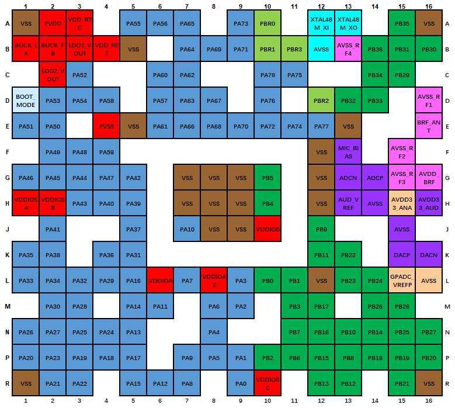 

<div align="center"> Figure 2-1 SF32LB56xV WBBGA175 Pin Distribution </div>  <br>  <br>  <br>


## Typical Application Solution

Figure 3-1 shows a typical block diagram of a sports watch, whose main functions include display, storage, sensors, vibration motor, and audio input and output.

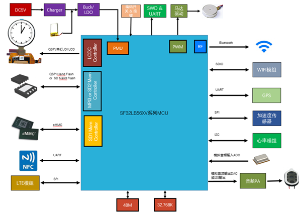 

<div align="center"> Figure 3-1 Sports Watch Block Diagram </div>  <br>  <br>  <br>

:::{Note} 
- Big/little dual-CPU architecture, meeting both high-performance and low-power design requirements

- External charging management chip

- Supports battery voltage detection using GPADC

- The power supply uses a Buck, LDO, and Load Switch solution

- Supports displays such as 3/4-wire SPI, Dual/Quad data SPI, DBI 8080, DPI, and serial/parallel JDI, with support for resolutions up to 1024*1024

- Supports PWM backlight control

- Supports an external NOR Flash storage chip with a QSPI interface

- Supports an external NAND Flash storage chip with a QSPI interface

- Supports an external NAND Flash storage chip with an SDIO interface

- Supports Bluetooth 5.3 communication

- Supports analog audio input

- Supports analog audio output

- Supports I2S audio interface

- Supports PWM vibration motor control

- Supports accelerometer/geomagnetic/gyroscope sensors with SPI/I2C interfaces

- Supports heart rate/SpO2/ECG sensors with an I2C interface

- Supports SEGGER J-Link SWD debugging and flashing tools

- Supports a UART debug print interface

- Supports a Bluetooth HCI debug interface

- Supports one-to-many firmware flashing on the production line

- Supports crystal calibration on the production line

- Supports OTA online upgrade functionality
:::
  

## Schematic Design Guidelines

### Power Supply

The series chips have a built-in PMU unit, and PVDD can support a 1.71~3.6 V power input. The PMU supports one Buck and multiple LDOs to supply power to the chip's internal circuits. For detailed connections of each power pin, refer to Table 4-1.

#### Processor Power Supply Requirements

SF32LB56xV power supply specifications:

<div align="center"> Table 4-1 PMU Power Supply Specifications </div>

```{table}
:align: center
| PMUPower Supply Pin      | Minimum Voltage (V) | Typical Voltage (V) | Maximum Voltage (V) | Maximum Current (mA) | Detailed Description                                                  |
| :--------------- | :---------: | :---------: | :---------: | :----------: | :-------------------------------------------------------- |
| PVDD             |    1.71     |     1.8     |     3.6     |     100      | PVDD Power Supply input                                             |
| BUCK_LX  BUCK_FB |      -      |    1.25     |      -      |     100      | BUCK_LX output, connected to the inductor; internal Power Supply input, connected to the other end of the inductor and to an external capacitor |
| LDO1_VOUT        |      -      |     1.1     |      -      |      50      | LDO1 output, connected to an external capacitor                                        |
| LDO2_VOUT        |      -      |     0.9     |      -      |      20      | LDO2 output, connected to an external capacitor                                        |
| VDD_RET          |      -      |     0.9     |      -      |      1       | RET LDO output, connected to an external capacitor                                     |
| VDD_RTC          |      -      |     1.1     |      -      |      1       | RTC LDO output, connected to an external capacitor                                     |
| MIC_BIAS         |     1.4     |      -      |     2.8     |      -       | MICPower Supply output                                               |
| AVDD_BRF         |    1.71     |     1.8     |     3.3     |      1       | RFPower Supply input                                              |
| AVDD33_ANA       |    3.15     |     3.3     |    3.45     |      50      | Analog Power Supply + RFPA Power Supply input                                   |
| AVDD33_AUD       |    3.15     |     3.3     |    3.45     |      50      | Analog audio Power Supply                                              |
| VDDIOA           |    1.71     |     1.8     |    3.45     |      -       | PA12-PA78 I/O Power Supply input                                     |
| VDDIOA2          |    1.71     |     1.8     |    3.45     |      -       | PA0-PA11 I/O Power Supply input                                      |
| VDDIOB           |    1.71     |     1.8     |    3.45     |      -       | PB I/O Power Supply input                                            |
| VDDIOSA          |    1.71     |     1.8     |    1.98     |      -       | SIPA Power Supply input                                              |
| VDDIOSB          |    1.71     |     1.8     |    1.98     |      -       | SIPB Power Supply input                                              |
| VDDIOSC          |    1.71     |     1.8     |    1.98     |      -       | SIPC Power Supply input                                              |   
| GPADC_VREF       |      -      |      -      |      -      |      -       | GPADC reference voltage input; only an external capacitor is connected, no external power supply is required                    |
| AUD_VREF         |      -      |      -      |      -      |      -       | Audio reference voltage input; only an external capacitor is connected, no external power supply is required                     |
```

The recommended values for external capacitors on the power pins of the SF32LB56xV series chips are shown in Table 4-2.

<div align="center"> Table 4-2 Recommended Capacitance Values </div>

```{table}
:align: center
| Power Supply pin         | Capacitor          | Detailed description                                       |
| ---------------- | ------------- | ---------------------------------------------- |
| PVDD             | 0.1uF + 10uF  | Place at least two capacitors, 10uF and 0.1uF, close to the pin.  |
| BUCK_LX  BUCK_FB | 0.1uF + 4.7uF | Place at least two capacitors, 4.7uF and 0.1uF, close to the pin. |
| LDO1_VOUT        | 4.7uF         | Place at least one 4.7uF capacitor close to the pin.            |
| LDO2_VOUT        | 4.7uF         | Place at least one 4.7uF capacitor close to the pin.            |
| VDD_RET          | 0.47uF        | Place at least one 0.47uF capacitor close to the pin.           |
| VDD_RTC          | 1uF           | Place at least one 1uF capacitor close to the pin.              |
| AVDD_BRF         | 4.7uF         | Place at least one 4.7uF capacitor close to the pin.            |
| AVDD33_ANA       | 4.7uF         | Place at least one 4.7uF capacitor close to the pin.            |
| GPADC_VREFP      | 4.7uF         | Place at least one 4.7uF capacitor close to the pin.          |
| AVDD33_AUD       | 4.7uF         | Place at least one 4.7uF capacitor close to the pin.          |
| AUD_VREF         | 1uF           | Place at least one 1uF capacitor close to the pin.            |
| MIC_BIAS         | 1uF           | Place at least one 1uF capacitor close to the pin.              |
| VDDIOA           | 1uF           | Place at least one 1uF capacitor close to the pin.              |
| VDDIOA2          | 1uF           | Place at least one 1uF capacitor close to the pin.              |
| VDDIOB           | 1uF           | Place at least one 1uF capacitor close to the pin.              |
| VDDIOSA          | 0.1uF         | Place at least one 0.1uF capacitor close to the pin.            |
| VDDIOSB          | 0.1uF         | Place at least one 0.1uF capacitor close to the pin.            |
| VDDIOSC          | 0.1uF         | Place at least one 0.1uF capacitor close to the pin.            |
```

#### SiFli PMIC chip power distribution

SF30147C is a highly integrated, high-efficiency, cost-effective power management chip designed for ultra-low-power wearable products. SF30147C integrates one high-efficiency, low-quiescent-current BUCK, with a 1.8 V output and a maximum drive current of 500 mA. SF30147C integrates four low-dropout, low-quiescent-current LDOs, with outputs of 2.8–3.3 V and a maximum drive current of 100 mA.

SF30147C integrates seven low-quiescent-current, low-on-resistance load switches. Among them, two are high-voltage load switches, suitable for peripherals driven directly by the battery voltage, such as audio power amplifiers; five are low-voltage switches, suitable for peripherals powered by 1.8 V.

SF32LB56XV can communicate with the SF30147C through the TWI interface. For the usage of each power output of the SF30147C, see Table 4-3. For details about this chip, refer to the "DS0002-SF30147C Chip Datasheet" document.

<div align="center"> Table 4-3 SF30147CPower Supply Allocation Table </div>

```{table}
:align: center
| SF30147C  Power Supply Pin | Minimum Voltage (V) | Maximum Voltage (V) | Maximum Current (mA) | Detailed Description                                                     |
| ------------------ | ----------- | ----------- | ------------ | ------------------------------------------------------------ |
| VBUCK              | 1.8         | 1.8         | 500          | 1.8V Power Supply input for SF32LB56xV PVDD, VDDIOA, VDDIOA2, VDDIOB, VDDIOSA, VDDIOSB, VDDIOSC, AVDD_BRF, etc. |
| LVSW1              | 1.8         | 1.8         | 100          | I2S Class-K PA logic power supply input                                   |
| LVSW2              | 1.8         | 1.8         | 100          | G-SENSOR 1.8V power supply input                                        |
| LVSW3              | 1.8         | 1.8         | 150          | Heart rate 1.8V power supply input                                            |
| LVSW4              | 1.8         | 1.8         | 150          | LCD 1.8V power supply input                                             |
| LVSW5              | 1.8         | 1.8         | 150          | EMMC CORE power supply input                                            |
| LDO1               | 2.8         | 3.3         | 100          | 3.3V Power Supply input for SF32LB56xV AVDD33_ANA, AVDD33_AUD, VDDIOA2, etc.    |
| LDO2               | 2.8         | 3.3         | 100          | EMMC or SD NAND power supply input                                        |
| LDO3               | 2.8         | 3.3         | 100          | LCD 3.3V power supply input                                             |
| LDO4               | 2.8         | 3.3         | 100          | Heart rate 3.3V power supply input                                             |
| HVSW1              | 2.8         | 5           | 150          | Analog Class-K PA power supply input                                       |
| HVSW2              | 2.8         | 5           | 150          | GPS power supply input                                                  |
```

#### Power-On Sequence and Reset

The PMU inside the SF32LB56xV chip integrates POR (Power-on Reset) and BOR (Brownout Reset) functions. The specific requirements are shown in Figure 4-1.

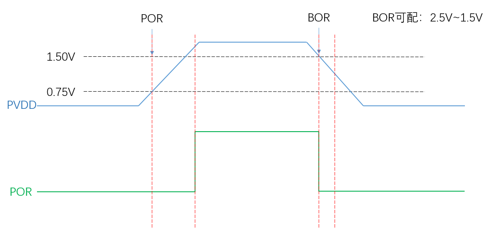 

<div align="center"> Figure 4-1 Power-On/Power-Off Timing Diagram </div>  <br>  <br>  <br>

When the system powers on and PVDD rises to 1.5 V, the system completes POR; when PVDD drops to the voltage value that triggers BOR (configurable from 2.5 V to 1.5 V), the PMU outputs a reset signal and the system resets.

#### Typical Power Supply Circuit

It is recommended to use the SF30147C to power the SF32LB56xV and various peripherals. The reference schematic is shown in Figure 4-2. For details, see Table 4-1.

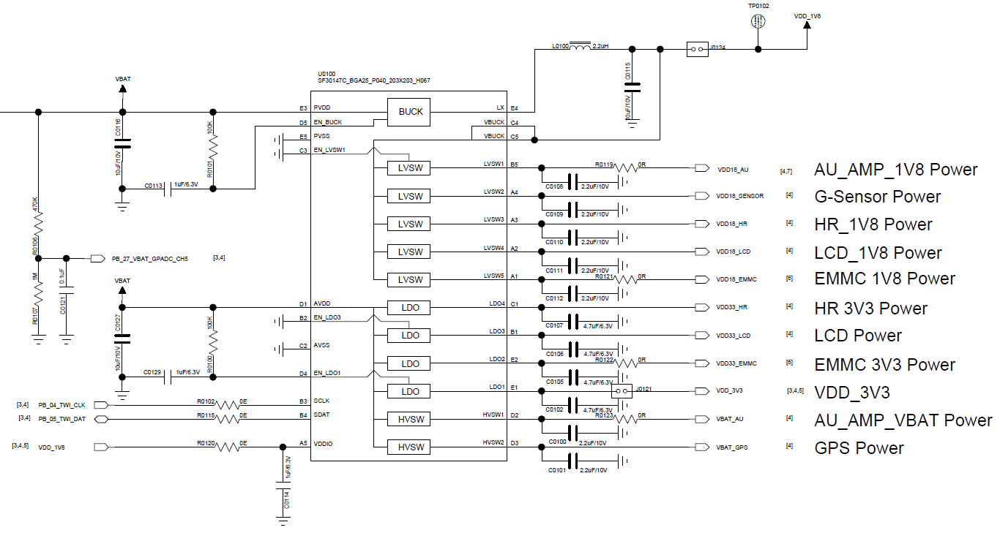 

<div align="center"> Figure 4-2 SF30147C Power Supply Diagram </div>  <br>  <br>  <br>

The SF32LB56xV series chips have one built-in BUCK output, as shown in Figure 4-3.

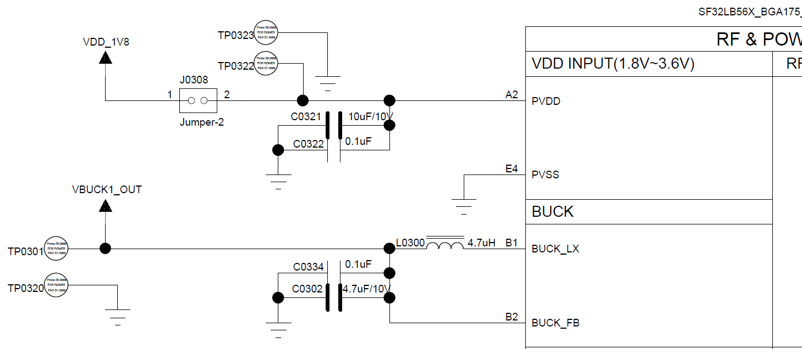 

<div align="center"> Figure 4-3 Built-in BUCK Circuit Diagram </div>  <br>  <br>  <br>

The SF32LB56xV series chips have four built-in LDOs, as shown in Figure 4-4.

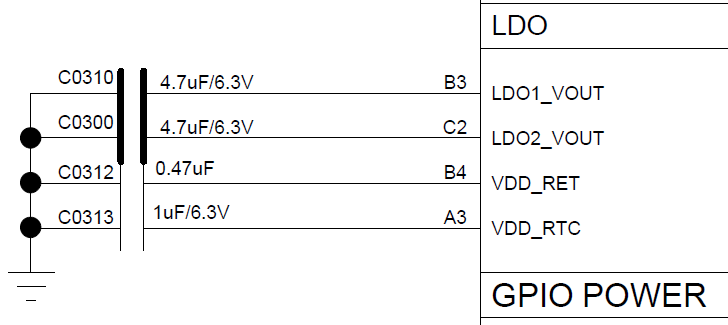 

<div align="center"> Figure 4-4 Built-in LDO Circuit Diagram </div>  <br>  <br>  <br>

#### Processor BUCK Inductor Selection Requirements

:::{important}
**Key Parameters of the Power Inductor**

L (inductance) = 4.7 uH ± 20%, DCR (DC resistance) ≦ 0.4 ohm, Isat (saturation current) ≧ 450 mA.
:::

#### Battery and Charging Control

A sports watch generally contains a polymer lithium battery pack, and the entire power system requires an additional charging circuit to charge the battery.

A typical charging circuit consists of a protection circuit (EOS, ESD, and OVP protection), a charging management chip, a battery, and other components. The charging management chip in the circuit shown in Figure 4-5 does not include a path management function, and the system power supply is tied directly to the battery VBAT. This solution has a lower cost, but its disadvantage is that downstream modules cannot be completely disconnected from VBAT, resulting in higher leakage power consumption and making the battery prone to over-discharge during long-term storage.

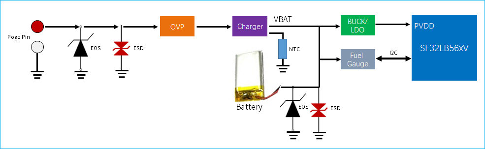 

<div align="center"> Figure 4-5 Typical Charging Circuit 1 </div>  <br>  <br>  <br>

As shown in Figure 4-6, the trickle charging current of the charging management chip must be greater than i1+i2 to charge an over-discharged battery. If the trickle charging current is less than i1+i2, the over-discharged battery cannot be charged.

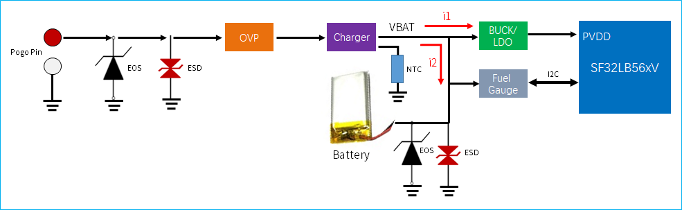 

<div align="center"> Figure 4-6 Schematic Diagram of Charging Circuit for an Overdischarged Battery </div>  <br>  <br>  <br>

The charging management chip in the circuit shown in Figure 4-7 includes a path management function. Because VSYS powering the system and VBAT charging the battery are separate, power supply to the downstream system is not affected even if the battery is over-discharged.

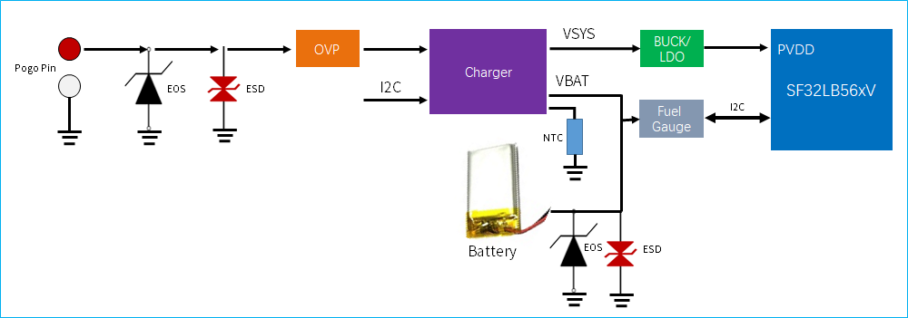 

<div align="center"> Figure 4-7 Typical Charging Circuit 2 </div>  <br>  <br>  <br>

### Boot Mode

The SF32LB56xV series chip provides a Mode pin for configuring the boot mode. It can be left floating when not used. The reference circuit is shown in Figure 4-8:

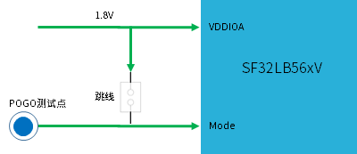 

<div align="center"> Figure 4-8 Recommended Circuit Diagram for the Mode Pin </div>  <br>  <br>  <br>

:::{attention}
**Mode pin definition:**

=1, the system enters download mode at startup and does not enter the user program;
=0, at system startup, rom checks whether a user program exists. If it exists, the system enters the user program; otherwise, it enters download mode.

**Notes:**

1. The voltage domain of Mode is the same as that of VDDIOA;
2. Mode must be connected externally through a 10K resistor to the power supply or GND to keep the level stable. It must not be left floating or be subject to toggle interference;
3. A test point must be reserved for the Mode pin on mass-production boards. It is used for program flashing or crystal calibration; a jumper does not need to be reserved;
4. It is recommended to reserve a jumper for the Mode pin on test boards, so that after a program crash, the board can be booted from download mode to download the program.
:::

### Processor Operating Modes and Wake-up Sources

Both the HCPU and LCPU of the SF32LB56xV series chip support the multiple operating modes listed in Table 4-4.

<div align="center"> Table 4-4 CPU Operating Mode List </div>

```{table}
:align: center
| Operating mode      | CPU   | Peripheral  | SRAM                              | IO       | LPTIM | Wake-up source                                    | Wake-up time         |
| ------------- | ----- | ----- | --------------------------------- | -------- | ----- | ----------------------------------------- | ---------------- |
| Active        | Run   | Run   | Accessible                            | Toggleable   | Run   |                                           |                  |
| WFI/WFE       | Stop  | Run   | Accessible                            | Toggleable   | Run   | Any interrupt                                  | < 0.5us          |
| DEEPWFI       | Stop  | Run   | Accessible                            | Toggleable   | Run   | Any interrupt                                  | < 5us            |
| Light sleep   | Stop  | Stop  | Not accessible,  fully retained                | Level held | Run   | RTC/GPIO/  LPTIM/LPCOMP/  cross-system interrupt/Bluetooth | < 100us          |
| Deep sleep    | Stop  | Stop  | Not accessible,  fully retained                | Level held | Run   | RTC/GPIO/  LPTIM/LPCOMP/  cross-system interrupt/Bluetooth | < 300us          |
| Standby       | Reset | Reset | Not accessible, LP fully retained, HP retains only 160KB | Level held | Run   | RTC/Buttons/LPTIM/  cross-system interrupt/Bluetooth          | 1.5ms  +recovery |
| Hibernate rtc | Reset | Reset | Data not retained                        | High-Z     | Reset | RTC/Buttons                                  | > 2ms            |
| Hibernate pin | Reset | Reset | Data not retained                        | High-Z     | Reset | Buttons                                      | > 2ms            |
```

:::{attention}
- Using Standby mode as power-off:
  * Because the GPIO levels can be retained, VDDIOSA and VDDIOSB can remain continuously powered, and there will be no leakage on the I/Os of the co-packaged memory.
  * The storage devices on MPI1 and MPI2 need to be set to low-power mode to reduce power consumption.
- Using Hibernate mode as power-off:
  * Because the GPIO levels cannot be retained, the power supplies for VDDIOSA and VDDIOSB must be turned off to avoid leakage on the I/Os of the co-packaged memory.
  * PBR0 is used as the control signal for the power switches of VDDIOSA and VDDIOSB.
- VDDIOSC must remain continuously powered. Before entering Hibernate mode, put the NOR Flash into deep power down mode.
:::

As shown in Table 4-5, the full series of chips supports 14 wake-up interrupt sources, which can wake up the big-core or small-core CPU.

<div align="center"> Table 4-5 Wake-Up Interrupt Source List </div>

```{table}
:align: center
| Interrupt Source     | Pin | Detailed Description   |
| ---------- | ---- | ---------- |
| WKUP_PIN0  | PB32 | Interrupt signal 0  |
| WKUP_PIN1  | PB33 | Interrupt signal 1  |
| WKUP_PIN2  | PB34 | Interrupt signal 2  |
| WKUP_PIN3  | PB35 | Interrupt signal 3  |
| WKUP_PIN4  | PB36 | Interrupt signal 4  |
| WKUP_PIN5  | PA50 | Interrupt signal 5  |
| WKUP_PIN6  | PA51 | Interrupt signal 6  |
| WKUP_PIN7  | PA52 | Interrupt signal 7  |
| WKUP_PIN8  | PA53 | Interrupt signal 8  |
| WKUP_PIN9  | PA54 | Interrupt signal 9  |
| WKUP_PIN10 | PBR0 | Interrupt signal 10 |
| WKUP_PIN11 | PBR1 | Interrupt signal 11 |
| WKUP_PIN12 | PBR2 | Interrupt signal 12 |
| WKUP_PIN13 | PBR3 | Interrupt signal 13 |
```

### Clock

The SF32LB56xV series chip requires two externally provided clock sources: a 48 MHz main crystal and a 32.768 kHz RTC crystal. For the specific crystal specification requirements and selection, see Table 4-6 and Table 4-7.

:::{important}
**Key Crystal Parameters**

<div align="center"> Table 4-6 Crystal Specification Requirements </div>

```{table}
:align: center
|Crystal|Crystal specification requirements   |Detailed description  |
|:--|:-------|:--------|
|48MHz |7pF≦CL≦12pF (recommended value 8.8pF) △F/F0≦±10ppm ESR≦30 ohms (recommended value 22ohms)|Crystal oscillator power consumption is related to CL and ESR. The smaller the CL and ESR, the lower the power consumption. For optimal power performance, it is recommended to use components with relatively smaller CL and ESR values within the required range. Reserve parallel matching capacitors next to the crystal. When CL<12pF, no capacitors need to be mounted|
|32.768KHz |CL≦12.5pF (recommended value 7pF) △F/F0≦±20ppm ESR≦80k ohms (recommended value 38Kohms)|Crystal power consumption is related to CL and ESR. The smaller the CL and ESR, the lower the power consumption. For optimal power consumption performance, it is recommended to use components with relatively small CL and ESR values within the required range. Reserve parallel matching capacitors next to the crystal. When CL<12.5pF, no capacitor needs to be soldered|
```

**Crystal Recommendation**

<div align="center"> Table 4-7 Recommended Crystal List </div>

```{table}
:align: center
| Model                | Manufacturer    | Parameters                                                         |
| ------------------- | ------- | ------------------------------------------------------------ |
| E1SB48E001G00E      | Hosonic | F0 = 48.000000MHz, △F/F0 = -6 ~ 8 ppm,  CL = 8.8 pF, ESR =  22 ohms Max  TOPR  = -30 ~ 85℃, Package = (2016 metric) |
| ETST00327000LE      | Hosonic | F0 = 32.768KHz, △F/F0  = -20 ~ 20 ppm,  CL = 7 pF, ESR =  70K ohms Max  TOPR  = -40 ~ 85℃, Package = (3215 metric) |
| SX20Y048000B31T-8.8 | TKD     | F0 = 48.000000MHz, △F/F0 = -10 ~ 10 ppm,  CL = 8.8 pF, ESR =  40 ohms Max  TOPR  = -20 ~ 75℃, Package = (2016 metric) |
| SF32K32768D71T01    | TKD     | F0 = 32.768KHz, △F/F0  = -20 ~ 20 ppm,  CL = 7 pF, ESR =  70K ohms Max  TOPR  = -40 ~ 85℃, Package = (3215 metric) |
```
Note: The ESR of SX20Y048000B31T-8.8 is slightly larger, and the static power consumption will also be slightly higher.
   When routing the PCB, remove at least the second-layer GND copper under the crystal to reduce the parasitic load capacitance on the Clock signal.
:::

For detailed material certification information, refer to:
[SIFLI-MCU-AVL Certification List](index)

### RF

The RF PCB trace for the SF32LB56xV series chip requires a 50-ohm characteristic impedance. If the antenna is properly matched, no additional RF components are required. It is recommended to reserve a π-type matching network during design for spurious filtering. Refer to the circuit shown in Figure 4-9.


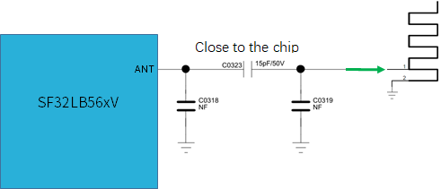 

<div align="center"> Figure 4-9 RF Circuit Diagram </div>  <br>  <br>  <br>

### How to Connect Peripherals to the Big-Core and Small-Core Processors

The SF32LB56xV series chip contains two processor systems. The PAx GPIOs are connected to the HCPU system, and the PBx GPIOs are connected to the LCPU system. The HCPU can access all peripheral resources of the LCPU, but it is not recommended for the LCPU to access HCPU resources. The HCPU can run at a maximum main frequency of 240 MHz and is used to provide high-performance computing, graphics processing, and high-resolution/frame-rate display. External memory, display interfaces, and other high-power devices must be connected to the HCPU.

The LCPU typically runs at 48 MHz @ 0.9 V and can run up to 96 MHz @ 1.1 V. It is used to process the BLE protocol stack, as well as heart-rate and accelerometer sensor control in low-power mode, charging and PMIC management, voltage monitoring, and power-on/off management.   

### Display

The SF32LB56xV series chip supports 3-Line SPI, 4-Line SPI, Dual data SPI, Quad data SPI, DBI 8080, DPI, and serial/parallel JDI interfaces. It supports 16.7M-color (RGB888), 262K-color (RGB666), 65K-color (RGB565), and 8-color (RGB111) color depth modes. The maximum supported resolution is 1024RGBx1024. The LCD driver support list is shown in Table 4-8.

<div align="center"> Table 4-8 LCD Driver Support List </div>

```{table}
:align: center
| Model     | Manufacturer       | Resolution  | Type   | Interface                                                         |
| -------- | ---------- | ------- | ------ | ------------------------------------------------------------ |
| RM69090  | Raydium    | 368*448 | Amoled | 3-Line SPI，4-Line  SPI，Dual data SPI，  Quad data SPI，MIPI-DSI |
| RM69330  | Raydium    | 454*454 | Amoled | 3-Line SPI，4-Line  SPI，Dual data SPI，  Quad data SPI，8-bits  8080-Series MCU ，MIPI-DSI |
| ILI8688E | ILITEK     | 368*448 | Amoled | Quad data SPI，MIPI-DSI                                      |
| SH8601A  | Shine World Technology   | 454*454 | Amoled | 3-Line SPI, 4-Line  SPI, Dual data SPI,  Quad data SPI, 8-bits  8080-Series MCU, MIPI-DSI |
| SPD2012  | Solomon    | 356*400 | TFT    | Quad data SPI                                                |
| GC9C01   | Galaxycore | 360*360 | TFT    | Quad data SPI                                                |
| ST77903  | Sitronix   | 400*400 | TFT    | Quad data SPI                                                |
```

#### SPI/QSPI Display Interface

The SF32LB56xV series chips support 3-/4-wire SPI and Quad-SPI interfaces for connecting LCD displays. The signal descriptions are shown in Table 4-9.

<div align="center"> Table 4-9 SPI/QSPI Display Signal Connection Method </div>

```{table}
:align: center
| SPI signal      | I/O  | Detailed description                                             |
| ------- | ---- | -------------------------------------------------------- |
| CSX     | PA36 | Enable signal                                                  |
| WRX_SCL | PA37 | Clock signal                                                  |
| DCX     | PA39 | Data/command signal in 4-wire SPI mode; data 1 in Quad-SPI mode    |
| SDI_RDX | PA38 | Data input signal in 3/4-wire SPI mode; data 0 in Quad-SPI mode   |
| SDO     | PA38 | Data output signal in 3/4-wire SPI mode; short together with SDI_RDX    |
| D[0]    | PA40 | Data 2 in Quad-SPI mode                                    |
| D[1]    | PA41 | Data 3 in Quad-SPI mode                                    |
| REST    | PA43 | Reset signal for the display                                            |
| TE      | PA33 | Tearing effect to MCU frame signal                       |
```

#### MCU8080 Display Interface

The SF32LB56xV series chips support the MCU8080 interface for connecting LCD displays, as shown in Table 4-10.

<div align="center"> Table 4-10 MCU8080 Display Signal Connection Method </div>

```{table}
:align: center
| MCU8080 Signal | I/O  | Detailed Description                            |
| :------ | :--- | :---------------------------------- |
| CSX     | PA36 | Chip  select                        |
| WRX     | PA37 | Writes  strobe signal to write data |
| DCX     | PA39 | Display  data / command selection   |
| RDX     | PA38 | Reads  strobe signal to write data  |
| D[0]    | PA40 | Data 0                              |
| D[1]    | PA41 | Data 1                              |
| D[2]    | PA28 | Data 2                              |
| D[3]    | PA29 | Data 3                              |
| D[4]    | PA30 | Data 4                              |
| D[5]    | PA31 | Data 5                              |
| D[6]    | PA32 | Data 6                              |
| D[7]    | PA34 | Data 7                              |
| REST    | PA43 | Reset                               |
| TE      | PA33 | Tearing effect to MCU frame signal  |
```

#### DPI Display Interface

The SF32LB56xV series chips support the DPI interface for connecting LCD displays, as shown in Table 4-11.

<div align="center"> Table 4-11 DPI Display Signal Connection Method </div>

```{table}
:align: center
| DPI Signal | I/O  | Detailed Description                               |
| ------- | ---- | -------------------------------------- |
| CLK     | PA45 | Clock signal                               |
| DE      | PA47 | Data enable signal                           |
| HSYNC   | PA44 | Horizontal sync signal                             |
| VSYNC   | PA42 | Vertical sync signal                             |
| SD      | PA50 | Controls display shutdown                        |
| CM      | PA51 | Switches between Normal Color and Reduced Color Mode |
| R0      | PA14 | Pixel signal                               |
| R1      | PA13 | Pixel signal                               |
| R2      | PA16 | Pixel signal                               |
| R3      | PA24 | Pixel signal                               |
| R4      | PA19 | Pixel signal                               |
| R5      | PA21 | Pixel signal                               |
| R6      | PA23 | Pixel signal                               |
| R7      | PA25 | Pixel signal                               |
| G0      | PA28 | Pixel signal                               |
| G1      | PA30 | Pixel signal                               |
| G2      | PA32 | Pixel signal                               |
| G3      | PA33 | Pixel signal                               |
| G4      | PA34 | Pixel signal                               |
| G5      | PA29 | Pixel signal                               |
| G6      | PA31 | Pixel signal                               |
| G7      | PA35 | Pixel signal                               |
| B0      | PA36 | Pixel signal                               |
| B1      | PA37 | Pixel signal                               |
| B2      | PA38 | Pixel signal                               |
| B3      | PA43 | Pixel signal                               |
| B4      | PA41 | Pixel signal                               |
| B5      | PA39 | Pixel signal                               |
| B6      | PA40 | Pixel signal                               |
| B7      | PA46 | Pixel signal                               |
```

#### JDI Display Interface

The SF32LB56xV series chips support parallel and serial JDI interfaces for connecting LCD displays. The parallel JDI interface is shown in Table 4-12, and the serial JDI interface is shown in Table 4-13.

<div align="center"> Table 4-12 Parallel JDI Display Signal Connection Method </div>

```{table}
:align: center
| JDI Signal      | I/O  | Detailed Description                                                     |
| ------------ | ---- | ------------------------------------------------------------ |
| JDI_VCK      | PA41 | Shift clock for the vertical driver                          |
| JDI_VST      | PA40 | Start signal for the vertical driver                         |
| JDI_XRST     | PA39 | Reset signal for the horizontal and  vertical driver         |
| JDI_HCK      | PA36 | Shift  clock for the horizontal driver                       |
| JDI_HST      | PA38 | Start signal for the horizontal driver                       |
| JDI_ENB      | PA43 | Write enable signal for the pixel memory                     |
| JDI_R1       | PA29 | Red image data (odd pixels)                                  |
| JDI_R2       | PA31 | Red image data (even pixels)                                 |
| JDI_G1       | PA34 | Green image data (odd pixels)                                |
| JDI_G2       | PA32 | Green image data (even pixels)                               |
| JDI_B1       | PA30 | Blue image data (odd pixels)                                 |
| JDI_B2       | PA28 | Blue image data (even pixels)                                |
| JDI_XFRP     | PBR1 | Liquid crystal driving signal  ("On" pixel)                  |
| JDI_VCOM/FRP | PBR2 | Common electrode driving signal/   Liquid crystal driving signal  ("Off" pixel) |
```

<div align="center"> Table 4-13 Serial JDI Display Signal Connection Method </div>

```{table}
:align: center
| JDI Signal      | Pin | Detailed Description                         |
| ------------ | ---- | -------------------------------- |
| JDI_SCS      | PA39 | Chip Select Signal               |
| JDI_SCLK     | PA41 | Serial Clock Signal              |
| JDI_SO       | PA40 | Serial  Data Output Signal       |
| JDI_DISP     | PA36 | Display  ON/OFF Switching Signal |
| JDI_EXTCOMIN | PA38 | COM Inversion Polarity Input     |
```

#### Touch and Backlight Interfaces

The SF32LB56xV series chips support an I2C-format touchscreen control interface and touchscreen status interrupt input, and also support one PWM signal to control backlight power enable and brightness, as shown in Table 4-14.

<div align="center"> Table 4-14 Touch and Backlight Control Connection Method </div>

```{table}
:align: center
| Touchscreen and Backlight Signal | Pin | Detailed Description                   |
| ---------------- | ---- | -------------------------- |
| Interrupt        | PA50 | Touch status interrupt signal (wake-up capable) |
| I2C1_SCL         | PA48 | Touchscreen I2C Clock signal        |
| I2C1_SDA         | PA49 | Touchscreen I2C data signal        |
| BL_PWM           | PA35 | Backlight PWM control signal            |
| Reset            | PA44 | Touch reset signal               |
```

### Storage

#### SF32LB56xV External Memory

SF32LB56xV supports SPI NOR/NAND Flash, SD NAND Flash, and eMMC peripherals. SPI NOR/NAND Flash uses the MPI interface, and SD NAND Flash uses the SD interface. These types of flash chips are fully compatible in terms of physical pins. The interface definitions are shown in Tables 4-15 and 4-16. The GPIO pins PA06~PA11 in the table are powered by VDDIOA2, which is independent of the voltage domain of the other GPIOs.

The MPI signal definitions are shown in Table 4-15, the SD signal definitions are shown in Table 4-16, and the eMMC signal definitions are shown in Table 4-17.

<div align="center"> Table 4-15 SPI Nor/Nand Flash Signal Connection </div>

```{table}
:align: center
| Flash Signal | I/O Signal | Detailed Description                                    |
| ---------- | ------- | ------------------------------------------- |
| CS#        | PA06    | Chip select, active low.                    |
| SO         | PA07    | Data Input (Data Input Output 1)            |
| WP#        | PA08    | Write Protect Output (Data Input Output  2) |
| SI         | PA09    | Data Output (Data Input Output 0)           |
| SCLK       | PA10    | Serial Clock Output                         |
| Hold#      | PA11    | Data Output (Data Input Output 3)           |
```
:::{note}
The Hold# pin of the SPI NAND Flash must be pulled up to the SPI NAND Flash power supply through a 10K resistor.
:::

<div align="center"> Table 4-16 SD Nand Flash Signal Connection </div>

```{table}
:align: center
| Flash Signal | I/O Signal | Detailed Description |
| ---------- | ------- | -------- |
| SD2_CMD    | PA09    | Command signal |
| SD2_D1     | PA11    | Data 1    |
| SD2_D0     | PA10    | Data 0    |
| SD2_CLK    | PA08    | Clock signal |
| SD2_D2     | PA06    | Data 2    |
| SD2_D3     | PA07    | Data 3    |
```

<div align="center"> Table 4-17 eMMC Signal Connection </div>

```{table}
:align: center
| eMMC Signal | I/O Signal | Detailed Description |
| --------- | ------- | -------- |
| SD1_CMD   | PA27    | Command signal |
| SD1_CLK   | PA26    | Clock signal |
| SD1_D0    | PA22    | Data 0    |
| SD1_D1    | PA15    | Data 1    |
| SD1_D2    | PA12    | Data 6    |
| SD1_D3    | PA20    | Data 3    |
| SD1_D4    | PA21    | Data 4    |
| SD1_D5    | PA19    | Data 5   |
| SD1_D6    | PA13    | Data 6    |
| SD1_D7    | PA14    | Data 7    |
```

### Buttons

PB32 on the SF32LB56xV series chips supports the long-press reset function. It is recommended to design PB32 as a button that supports both the short-press power on/off function and the long-press reset function. As shown in Figure 4-10, the design uses active-high signaling. For the long-press reset function, the chip automatically resets after the button is pressed and held for more than 10 s.

The SF32LB56xV series chips support function button inputs and rotary knob signal inputs. The button or rotary knob signals need to be pulled up. Button usage is shown in Figure 4-11. An optical tracking sensor is also supported; the I2C4 interface is recommended, and the signal connections are shown in Table 4-18.

<div align="center"> Table 4-18 Optical Tracking Sensors Signal Connection </div>

```{table}
:align: center
| I2C Signal | I/O  | Detailed Description                 |
| ------- | ---- | ------------------------ |
| SDA     | PA18 | Light-tracking SensorsI2C data signal |
| SCL     | PA17 | Light-tracking SensorsI2C Clock signal |
```

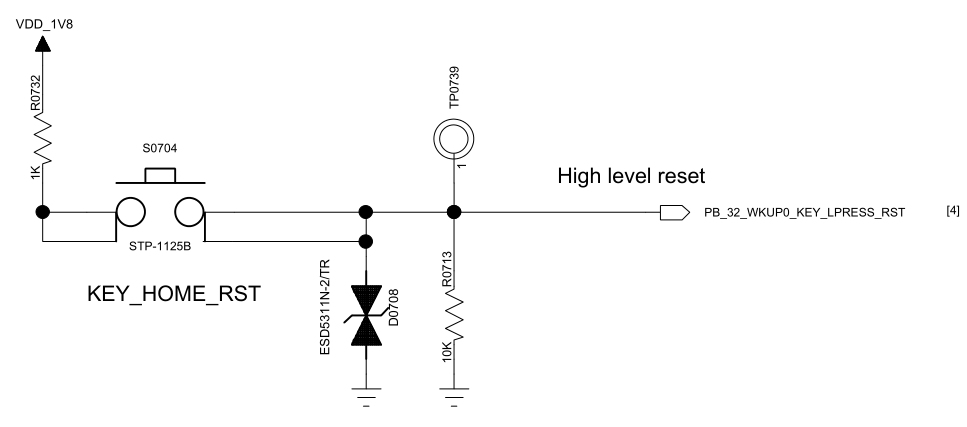 

<div align="center"> Figure 4-10 Power On/Off Buttons Circuit Diagram </div>  <br>  <br>  <br>


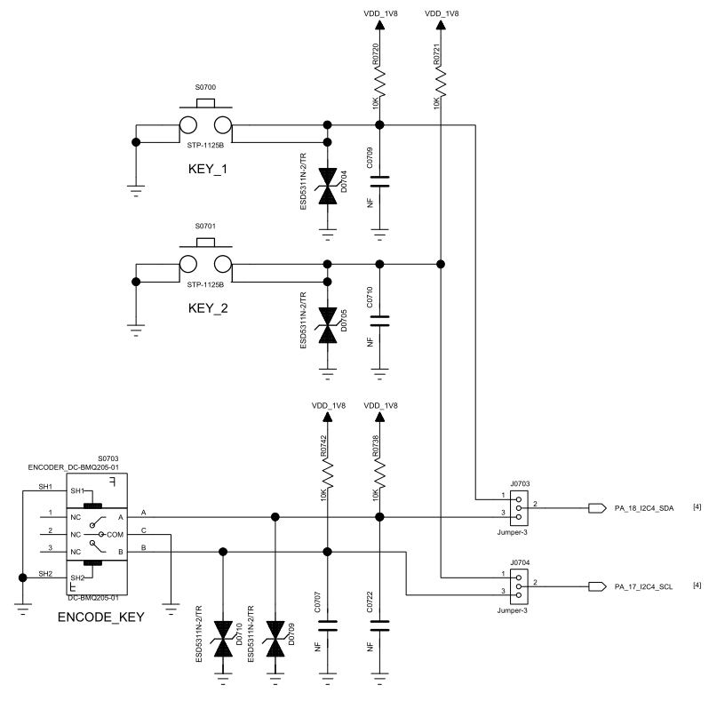 

<div align="center"> Figure 4-11 Function Buttons or Knob Circuit Diagram </div>  <br>  <br>  <br>

:::{note}
For a typical mechanical rotary encoder switch, the switch may not return to the off state after rotation. Therefore, the power supply connected to the pull-up resistor must be able to be turned off during standby to prevent leakage current.
:::

### Vibration Motor

The SF32LB56xV series chips support multiple PWM outputs, which can be used as drive signals for a vibration motor. Figure 4-12 shows the recommended circuit. If the current during motor vibration does not cause system instability, VBAT can also be used directly as the power supply.

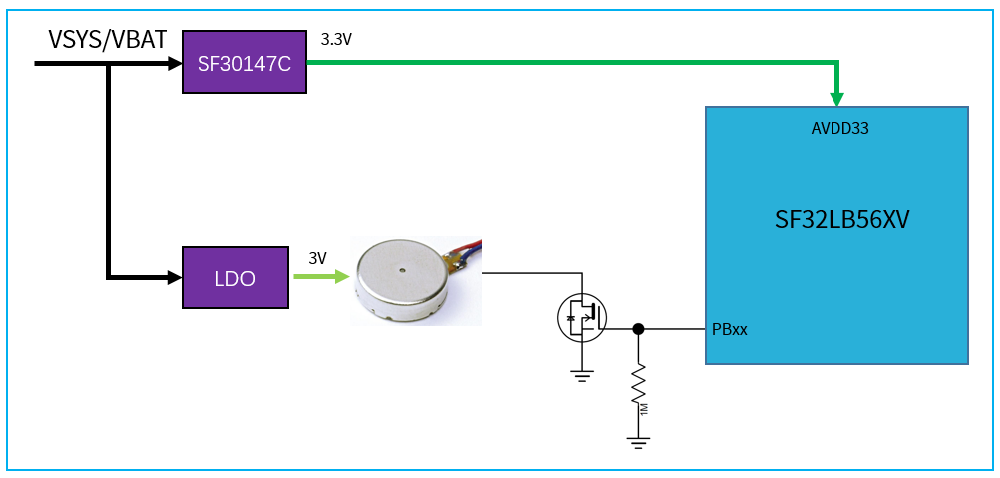 

<div align="center"> Figure 4-12 Vibration Motor Circuit Diagram </div>  <br>  <br>  <br>

:::{important}
If the software enables the HCPU main-frequency reduction macro definition `#define BSP PM FREQ SCALING 1`, after the HCPU enters the idle thread, the main frequency will decrease, and the PWM frequency of the corresponding Hcpu PA port will also change,
Therefore, it is recommended to use the PB interface to output the PWM signal.
:::

### Audio Interface

The audio-related interfaces of the SF32LB56xV series chips are shown in Table 4-19. The audio interface signals have the following characteristics:

- Supports one differential ADC input for connecting an external analog MIC. A DC-blocking capacitor with a capacitance of at least 2.2 uF must be added in between. The power supply of the analog MIC is connected to the chip's MIC_BIAS power output pin;
- Supports one differential DAC output for connecting an external analog audio PA. The DAC output traces should be routed as differential traces with proper ground shielding. Also note: trace capacitance < 10pF, length < 2cm. 

<div align="center"> Table 4-19 Audio Signal Connection Method </div>

```{table}
:align: center
| Audio Signal  | I/O  | Detailed Description               |
| --------- | ---- | ---------------------- |
| AU_ADC1P  | ADCP | Differential P or single-ended analog MIC input |
| AU_ADC1N  | ADCN | Differential analog MIC input N or GND  |
| AU_DAC1P  | DACP | Differential analog output P          |
| AU_DAC1N  | DACN | Differential analog output N          |
| I2S1_LRCK | PA71 | I2S2 frame clock             |
| I2S1_SDI  | PA69 | I2S2 data input           |
| I2S1_SDO  | PA64 | I2S2 data output           |
| I2S1_BCK  | PA73 | I2S2 bit clock             |
```

The recommended circuit for an analog MEMS MIC with the SF32LB56xV series chips is shown in Figure 4-13, the recommended single-ended circuit for an analog ECM MIC is shown in Figure 4-14, and the recommended differential circuit for an analog ECM MIC is shown in Figure 4-15. AU_ADC1P and AU_ADC1N are the ADC input pins connected to the SF32LB56xV.

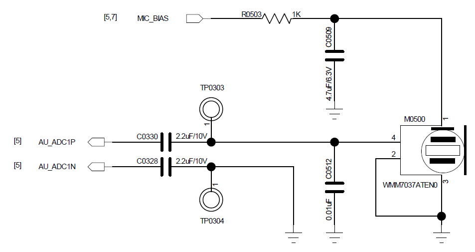 

<div align="center"> Figure 4-13 Analog MEMS MIC Input Circuit Diagram </div>  <br>  <br>  <br>


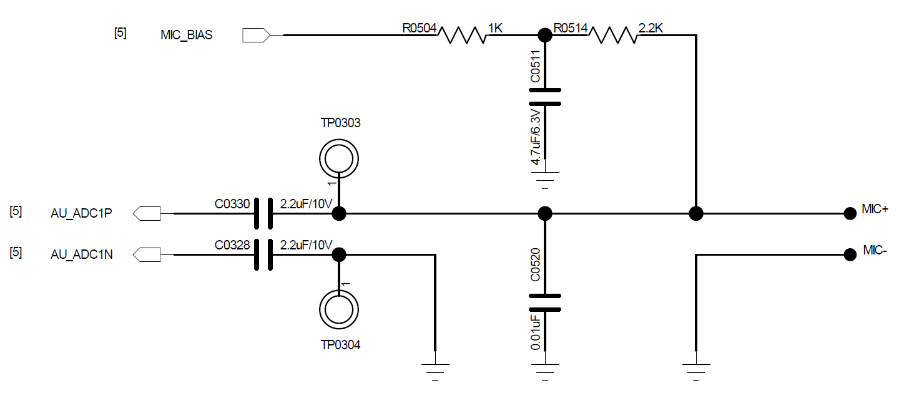 

<div align="center"> Figure 4-14 Analog ECM Single-Ended Input Circuit Diagram </div>  <br>  <br>  <br>


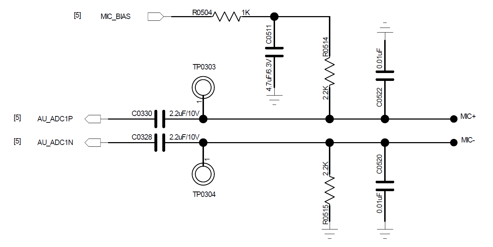 

<div align="center"> Figure 4-15 Analog ECM Differential Input Circuit Diagram </div>  <br>  <br>  <br>

The recommended circuit for analog audio output of the SF32LB56xV series chips is shown in Figure 4-16. Note that the differential low-pass filter inside the dashed box should be placed close to the chip.


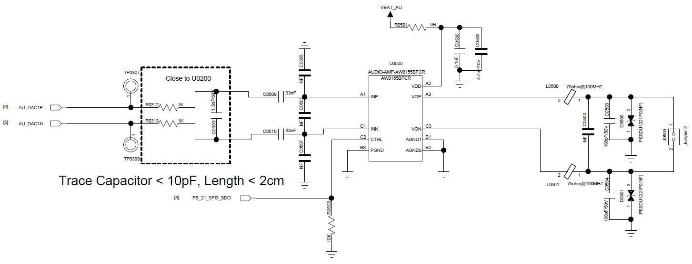 

<div align="center"> Figure 4-16 Analog Audio PA Circuit Diagram </div>  <br>  <br>  <br>

The I2S audio PA connection circuit is shown in Figure 4-17. I2C3 is used to configure the registers of the I2S audio PA.


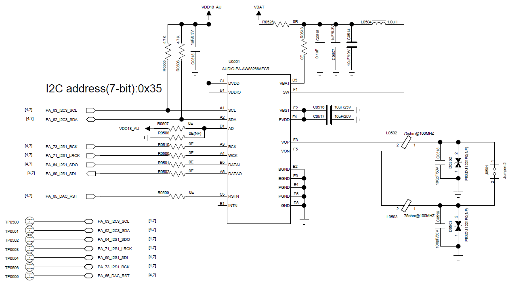 

<div align="center"> Figure 4-17 I2S Audio PA Circuit Diagram </div>  <br>  <br>  <br>

### PBR Interface Description

The SF32LB56xV series chips provide four PBR interfaces. Their main features are:

- PBR0 changes from 0 to 1 during the power-on stage and can be used for certain external LSW control. PBR1-PBR3 all output 0 by default;
- PBR0-PBR3 can be used as outputs in both standby and hibernate modes;
- PBR0-PBR3 can output LPTIM signals;
- PBR1-PBR3 can output 32K clock signals;
- PBR0-PBR3 can be configured as inputs for wake-up signal input. When the MCU is awake, no interrupt is received.

### Sensors

SF32LB56xV series chips support heart rate sensors, accelerometers, and other sensors. During design, attention should be paid to the I2C, SPI, control interface, interrupt wake-up, and other interfaces for the heart rate sensor and accelerometer. It is recommended to use the PB interface of the LCPU. The power supply for the heart rate sensor and accelerometer can use the LVSWx or LDO output of the SF30147C, enabling the power supply to be switched on or off as needed.

### UART and I2C Pin Settings

SF32LB56xV series chips support UART and I2C function mapping to any pin. All PA interfaces can be mapped as UART or I2C function pins. For the PB port, except for PB32~36 and PBR0~3, all IOs can be mapped as UART or I2C function pins.

### GPTIM Pin Settings

SF32LB56xV series chips support GPTIM function mapping to any pin. All PA interfaces can be mapped as GPTIM function pins. For the PB port, except for PB32~36 and PBR0~3, all IOs can be mapped as GPTIM function pins.

### Debug and Flashing Interface

SF32LB56xV series chips support the Arm® standard SWD debug interface, which can be connected to EDA tools for single-step debugging. As shown in Figure 4-18, when connecting a SEEGER® J-Link® tool, the power supply of the debug tool must be changed to an external interface input, with the SF32LB56xV circuit board supplying power to the J-Link tool.

The SF32LB56xV series provides one SWD interface for debug information output and one default UART port for flashing/downloading and printing logs. For details, refer to Table 4-20.

<div align="center"> Table 4-20 Debug Port Connection Method </div>

```{table}
:align: center
| Signal         | Pin | Detailed Description                       |
| ----------- | ---- | ----------------------------- |
| SWCLK       | PB15 | JLINK Clock signal, debug interface         |
| SWDIO       | PB13 | JLINK data signal, debug interface         |
| UART4_RXD   | PB16 | UART receive signal, download and log printing interface  |
| UART4_TXD   | PB17 | UART transmit signal, download and log printing interface  |
```

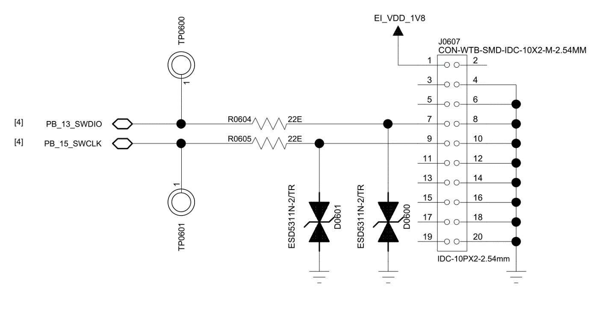 

<div align="center"> Figure 4-18 Debug Interface Circuit Diagram </div>  <br>  <br>  <br>

### Production Line Flashing and Crystal Calibration

SiFli Technology provides an offline downloader for production-line program flashing and crystal calibration.

During hardware design, make sure to reserve at least the following test points: VBAT, GND, VDDIOB, Mode, SWDIO, SWCLK, RXD4, TXD4, and one of PB20, PB21, or PB25.

For detailed flashing and crystal calibration, see the “**_Offline Downloader User Guide.pdf” document included in the development package.


### Schematic and PCB Drawing Checklist

See the “_Schematic checklist_.xlsx” and “_PCB checklist_.xlsx” documents, which are included in the development materials package.

## PCB Design Guidelines

### PCB Footprint Design

**Package Dimensions**

The SF32LB56xV chip uses a WBBGA package. Package dimensions: 6.5 mm x 6.1 mm x 0.94 mm; number of pins: 175; ball pitch: 0.4 mm. Detailed dimensions are shown in Figure 5-1.

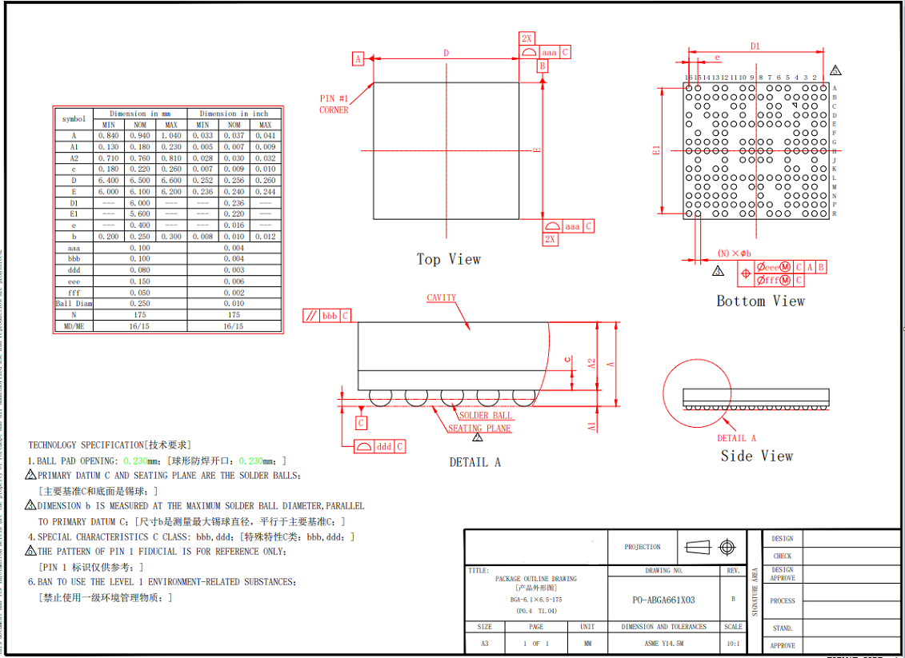  

<div align="center"> Figure 5-1 WBBGAPackage Dimensions </div>  <br> <br> <br>

**Package Shape**

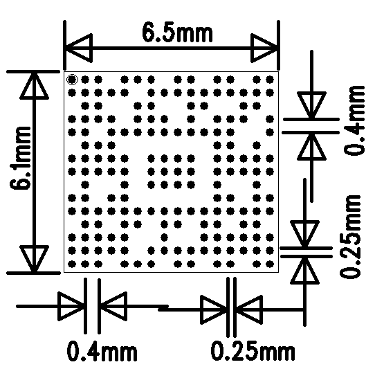  

<div align="center"> Figure 5-2 WBBGAPackage Outline </div>  <br> <br> <br>

**Pad Design**

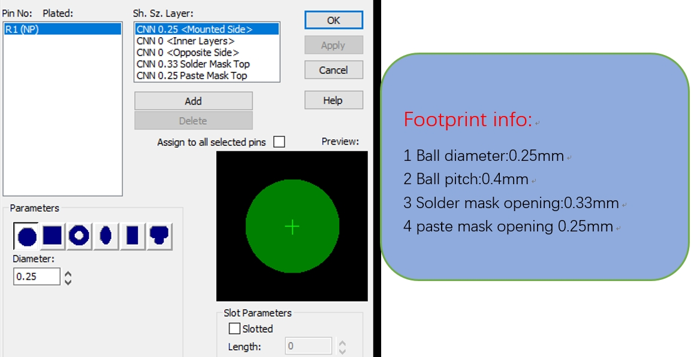  

<div align="center"> Figure 5-3 WBBGA PackagePCB Pad Design Reference </div>  <br> <br> <br>

**Package PINOUT/BALLMAP**

The WBBGA package PINOUT information for SF32LB56xV is shown in Figure 5-4.

  

<div align="center"> Figure 5-4 SF32LB56xVPackage PINOUT Information </div>  <br> <br> <br>

**Package Substrate**

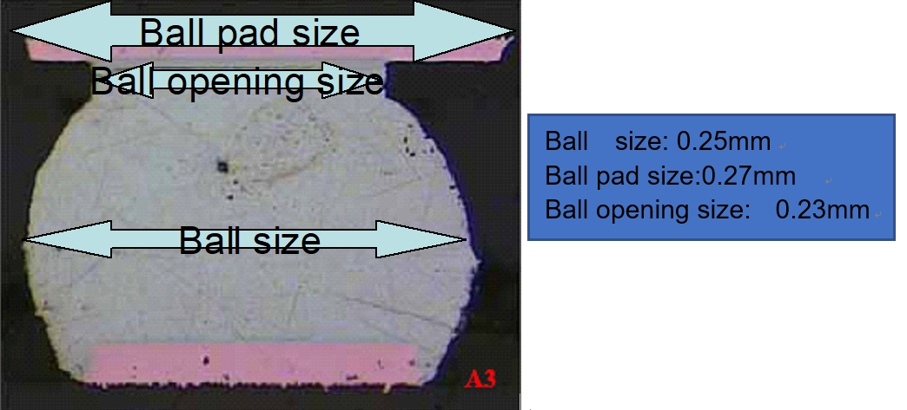  

<div align="center"> Figure 5-5 Package Substrate BALL Information </div>  <br> <br> <br>

### PCB Stack-up Design

The SF32LB56xV series chip layout supports single-sided and double-sided placement. The PCB does not support PTH boards and supports only HDI boards. The recommended reference stack-up is shown in Figure 5-6.

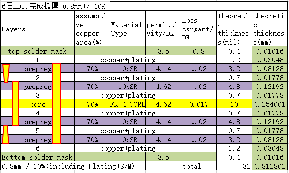  

<div align="center"> Figure 5-6 Reference Stackup Structure </div>  <br> <br> <br>

### General PCB Design Rules

The general PCB design rules for HDI boards are shown in Figure 5-7, with dimensions in mm.

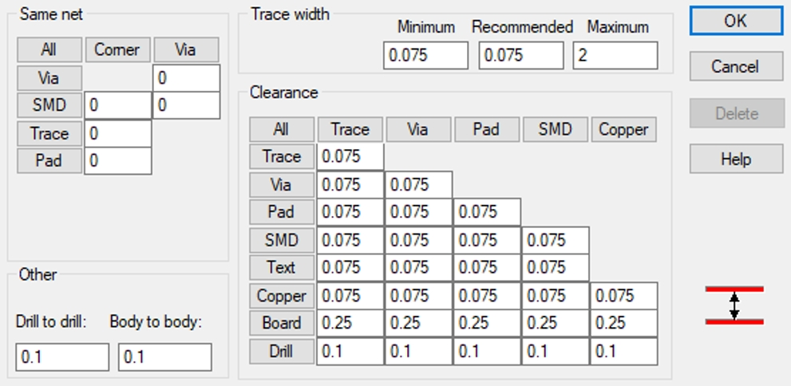  

<div align="center"> Figure 5-7 General Design Rules </div>  <br> <br> <br>

#### Blind Via Design

The PCB blind via design is shown in Figure 5-8, with dimensions in mm.

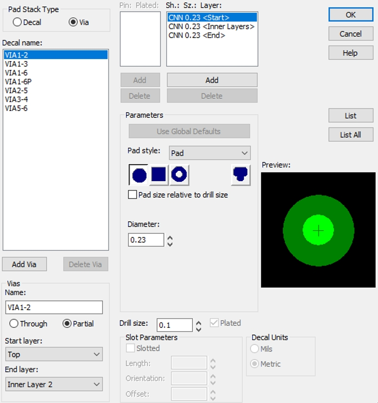  

<div align="center"> Figure 5-8 Blind Via Design </div>  <br> <br> <br>

#### Buried Via Design

The PCB buried via design is shown in Figure 5-9, with dimensions in mm.

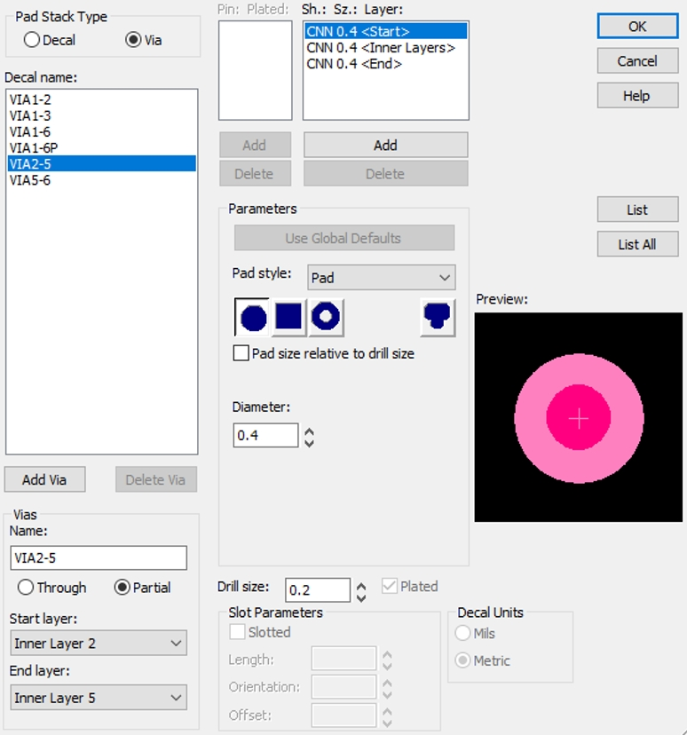  

<div align="center"> Figure 5-9 Buried Via Design </div>  <br> <br> <br>

### Chip Routing Fanout

For the WBBGA package, the first two rows and columns of balls are fanned out through the surface layer, as shown in Figure 5-10. The other balls are fanned out through the inner layers, as shown in Figure 5-11. 

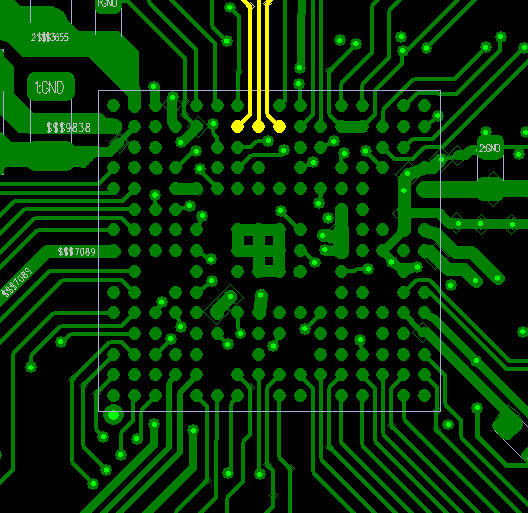  

<div align="center"> Figure 5-10 Top-Layer Fanout Reference Diagram </div>  <br> <br> <br>

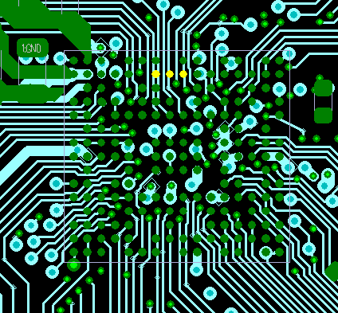  

<div align="center"> Figure 5-11 Inner-Layer Fanout Reference Diagram </div>  <br> <br> <br>

### Clock Interface Routing

The crystal must be placed inside the shielding cover, with a clearance of more than 1 mm from the PCB board outline. Keep it as far away as possible from components that generate significant heat, such as PA, Charge, PMU, and other circuit components; a distance greater than 5 mm is preferred to avoid affecting the crystal frequency deviation. The keep-out clearance for the crystal circuit should be greater than 0.25 mm to prevent other metals and components from being present, as shown in Figure 5-12.

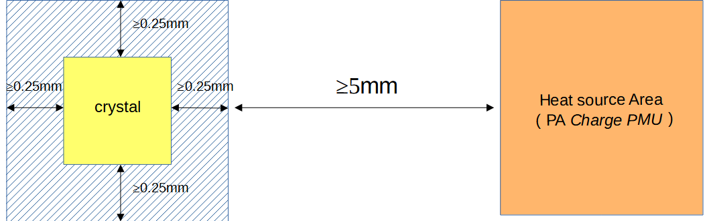  

<div align="center"> Figure 5-12 Crystal Layout Diagram </div>  <br> <br> <br>

It is recommended to route the 48 MHz crystal traces on the surface layer, with the length controlled within 3–10 mm and a trace width of 0.075 mm. Three-dimensional ground shielding must be applied, and the traces must be kept away from VBAT, DC/DC, and high-speed signal lines. The surface layer and adjacent layers under the 48 MHz crystal area must be treated as keep-out areas, and no other traces are allowed to pass through this area, as shown in Figures 5-13, 5-14, and 5-15.

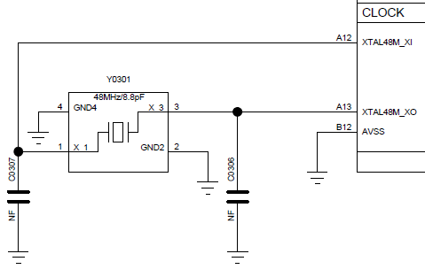  

<div align="center"> Figure 5-13 48MHz Crystal Schematic </div>  <br> <br> <br>

  

<div align="center"> Figure 5-14 48MHz Crystal Routing Model </div>  <br> <br> <br>

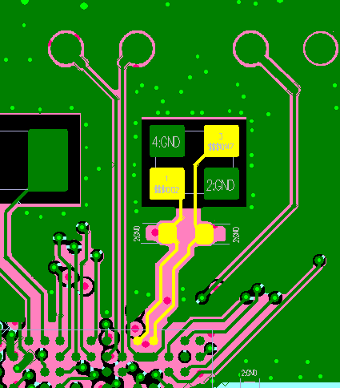  

<div align="center"> Figure 5-15 48MHz Crystal Routing Reference </div>  <br> <br> <br>

It is recommended to route the 32.768 kHz crystal traces on the surface layer, with the trace length controlled to ≤10 mm and a trace width of 0.075 mm. The spacing between the parallel 32K_XI/32_XO traces should be ≥0.15 mm. Three-dimensional ground shielding must be applied. The surface layer and adjacent layers under the crystal area must be treated as keep-out areas, and no other traces are allowed to pass through this area, as shown in Figures 5-16, 5-17, and 5-18.

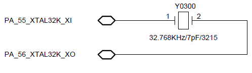  

<div align="center"> Figure 5-16  32.768KHz Crystal Schematic </div>  <br> <br> <br>

  

<div align="center"> Figure 5-17  32.768KHz Crystal Routing Model </div>  <br> <br> <br>

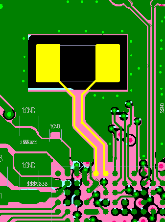  

<div align="center"> Figure 5-18  32.768KHz Crystal Routing Reference </div>  <br> <br> <br>

### RF Interface Routing

The RF matching circuit should be placed as close as possible to the chip side, not close to the antenna side. The filter capacitors for the AVDD_BRF RF power supply should be placed as close as possible to the chip pins. Vias should be placed at the capacitor ground pins to connect them directly to the main ground. The schematic and PCB layout of the π-type network for the RF signal are shown in Figures 5-19 and 5-20, respectively.

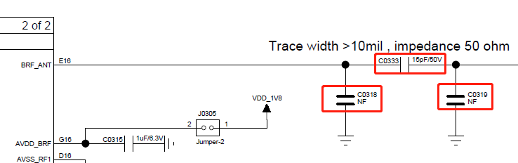  

<div align="center"> Figure 5-19 π-Type Network and Power Supply Circuit Schematic</div>  <br> <br> <br>

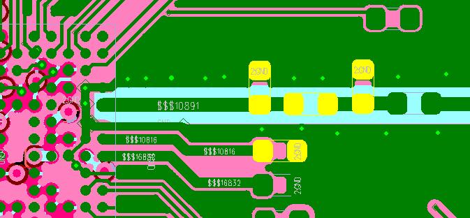  

<div align="center"> Figure 5-20 π-Type Network and Power SupplyPCB Layout </div>  <br> <br> <br>

RF traces are recommended to be routed on the surface layer to avoid vias and layer transitions that affect RF performance. The trace width should preferably be greater than 10 mil. Three-dimensional ground shielding is required. Avoid routing with sharp angles or right angles. Add more shielding ground vias on both sides of the RF trace. The RF trace must be controlled to 50-ohm impedance, as shown in Figures 5-21 and 5-22.

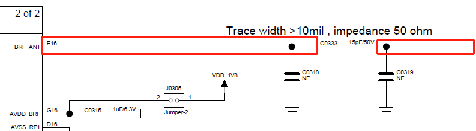  

<div align="center"> Figure 5-21 RF Signal Circuit Schematic </div>  <br> <br> <br>

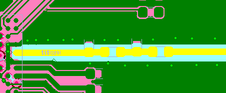  

<div align="center"> Figure 5-22 RF Signal PCB Routing </div>  <br> <br> <br>

Do not route DC-DC, VBAT, or high-speed digital signals through the RF circuit area, such as crystal oscillator signals, high-frequency clocks, and digital interface signals (I2C, SPI, SDIO, I2S, UART, etc.).

AVSS_RRF, AVSS_TRF, AVSS_TRF2, and AVSS_BB are RF circuit ground pins. They must be well grounded. It is recommended to place blind vias directly on their pads and connect them to the main ground, as shown in Figure 5-23.

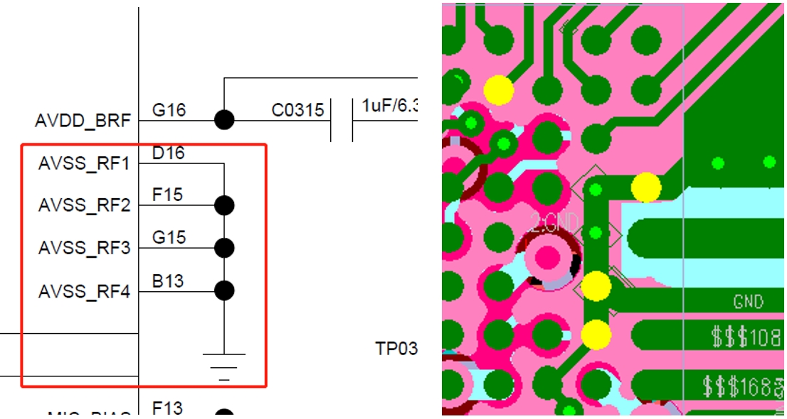  

<div align="center"> Figure 5-23 RF Circuit Grounding Reference Routing </div>  <br> <br> <br>


### Audio Interface Routing

AVDD33_AUD is the power supply pin for the audio interface. Its filter capacitor should be placed close to the corresponding pin, and the ground pin of the filter capacitor should be well connected to the main ground. MIC_BIAS is the microphone bias supply circuit for the audio interface. Its corresponding filter capacitor should be placed close to the corresponding pin, and the ground pin of the filter capacitor should be well connected to the main ground. The AUD_VREF filter capacitor should be placed close to the pin, as shown in Figure 5-24.

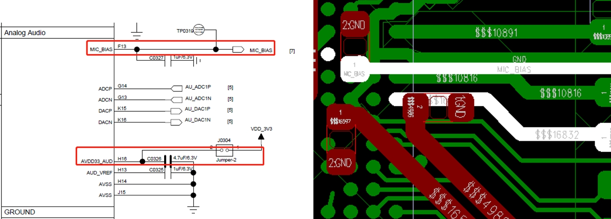  

<div align="center"> Figure 5-24  Audio Circuit Power Supply Reference Routing </div>  <br> <br> <br>

ADCP/ADCN are analog signal inputs. The corresponding circuit components should be placed as close as possible to the corresponding pins. The P/N pair of each channel must be routed as differential traces, with the trace length kept as short as possible. The differential pair traces should use three-dimensional ground shielding, and strong interference signals from other interfaces should be kept away from these traces, as shown in Figure 5-25.

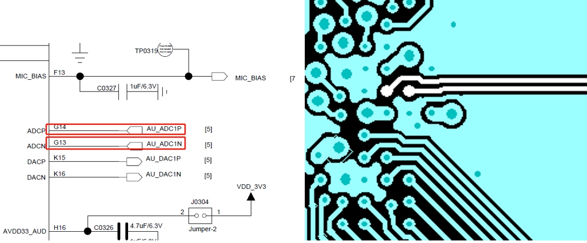  

<div align="center"> Figure 5-25  Analog Audio Input Reference Routing </div>  <br> <br> <br>


DACP/DACN are analog signal outputs. The corresponding circuit components should be placed as close as possible to the corresponding pins. The P/N signals of each channel must be routed as differential traces, with the trace length kept as short as possible. The trace parasitic capacitance should be less than 10 pF. The differential pair traces must use three-dimensional ground shielding, and strong interference signals from other interfaces should be kept away from these traces, as shown in Figure 5-26.

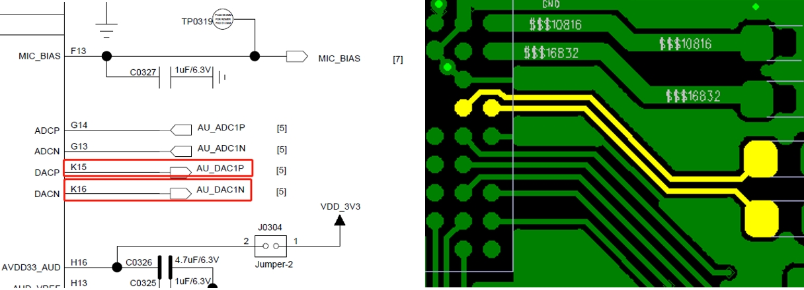  

<div align="center"> Figure 5-26  Analog Audio Input Reference Routing </div>  <br> <br> <br>


### USB Interface Routing

USB traces must first pass through the ESD device pins and then go to the chip side. Ensure that the ground pin of the ESD device is well connected to the main ground. PA17(USB DP)/PA18(USB_DN) should be routed as differential traces, controlled to 90-ohm differential impedance, and use three-dimensional ground shielding, as shown in Figure 5-27. Figure 5-28 is a reference diagram for USB signal component placement and a PCB routing model.

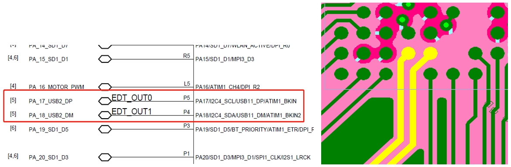  

<div align="center"> Figure 5-27  USB Signal PCB Design </div>  <br> <br> <br>


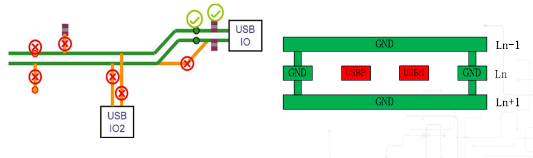  

<div align="center"> Figure 5-28  USB Signal Component Layout Reference Diagram and USBPCB Routing Model </div>  <br> <br> <br>


### SDIO Interface Routing

SF32LB56xV supports two SDIO interfaces, namely SDIO1 and SDIO2. All SDIO signal traces should be routed together and not separated. The total trace length should be ≤50 mm, and the length within the group should be controlled to ≤6 mm. The SDIO interface clock signal requires three-dimensional ground shielding, and the DATA and CM signals also require ground shielding, as shown in Figures 5-29a and 5-29b.

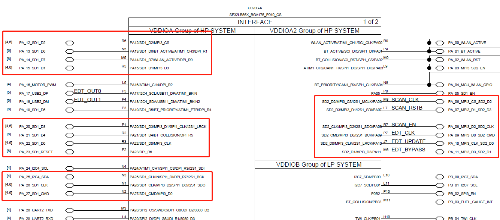  

<div align="center"> Figure 5-29a SDIO Interface Circuit Diagram </div>  <br> <br> <br>

  

<div align="center"> Figure 5-29b SDIO PCB Routing Model </div>  <br> <br> <br>

### DC-DC Circuit Routing

The power inductor and filter capacitors of the DC-DC circuit must be placed close to the chip pins. The BUCK_LX trace should be as short and wide as possible to ensure low loop inductance for the entire DC-DC circuit. Add multiple vias at the ground pins of all DC-DC output filter capacitors to connect them to the main ground plane. The BUCK_FB pin feedback trace must not be too narrow and must be greater than 0.25 mm. Copper pour is prohibited on the surface layer in the power inductor area, and the adjacent layer must be a complete reference ground. Avoid routing other traces through the inductor area, as shown in Figure 5-30.

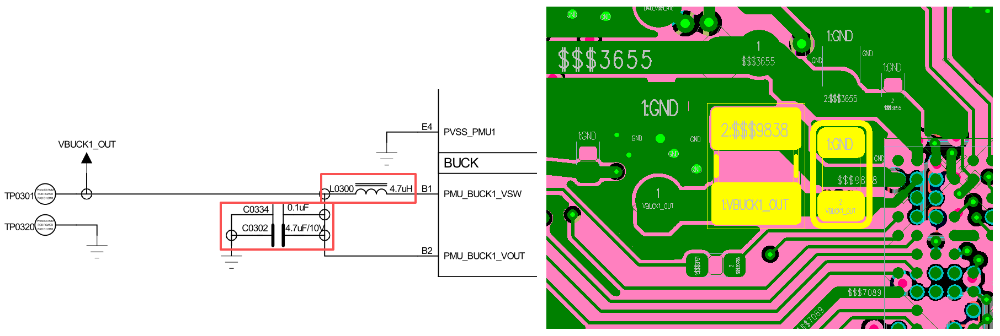  

<div align="center"> Figure 5-30 DC-DC Critical Components PCB Layout </div>  <br> <br> <br>

### Power Supply Routing

PVDD is the power input pin of the chip's built-in PMU module. The corresponding capacitor must be placed close to the pin, and the trace should be as wide as possible and not less than 0.5 mm. PVSS is the ground pin of the PMU module and must be connected to the main ground through vias to avoid floating, which would affect the performance of the entire PMU, as shown in Figure 5-31.

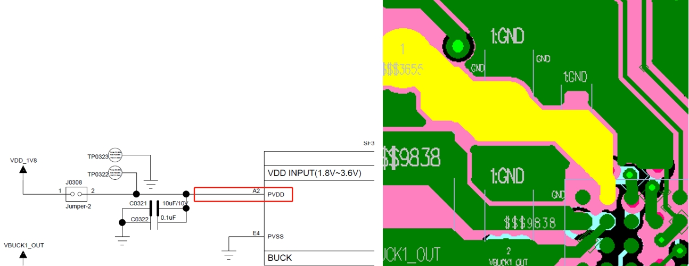  

<div align="center"> Figure 5-31 PVDD Input Routing </div>  <br> <br> <br>

### LDO and IO Power Input Routing

The filter capacitors for all LDO outputs and IO power input pins should be placed close to the corresponding pins. Their trace width must meet the input current requirements, and the traces should be as short and wide as possible to reduce power supply ripple and improve system stability, as shown in Figure 5-32.

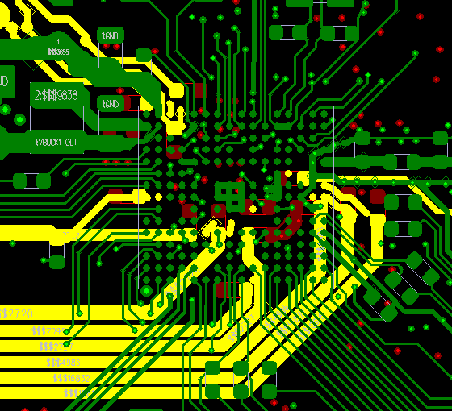  

<div align="center"> Figure 5-32 LDO and IO Input Power Supply Routing </div>  <br> <br> <br>

### Other Interface Routing

When a pin is configured as a GPADC signal pin, three-dimensional ground shielding is required, and it must be kept away from other interfering signals, such as the battery level circuit and temperature check circuit.

The PBR0~3 pins can all be configured as clock output pin signal nets. Three-dimensional ground shielding is required, and they should be kept away from other interference signals, such as 32K output.

### SF32LB56xV chip ground routing

The ground nets in the center area of the SF32LB56xV chip need to be fully connected with traces to ensure a sufficient ground plane, and they must be connected to the main ground plane through blind and buried vias, as shown in Figures 5-33a and 5-33b.

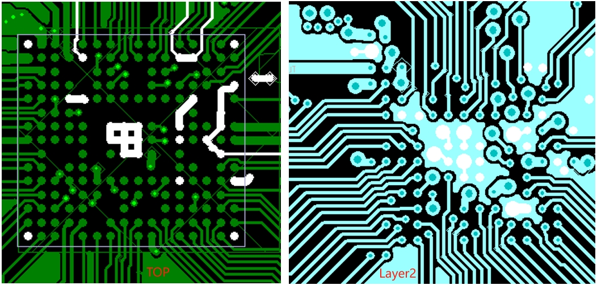  

<div align="center"> Figure 5-33a Ground Signals on Layers 1-2 Under the Chip </div>  <br> <br> <br>

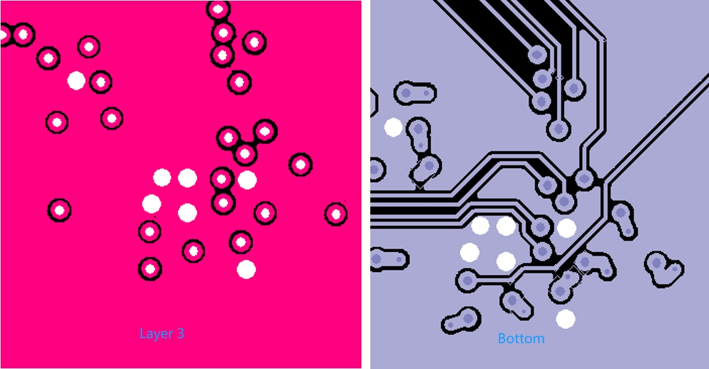  

<div align="center"> Figure 5-33b Ground Signals on Layers 3-4 Under the Chip </div>  <br> <br> <br>


### EMI&ESD routing

Avoid long-distance routing on the top layer outside the shielding cover. In particular, interfering signals such as clocks and power supplies should be routed on inner layers whenever possible and are prohibited from being routed on the top layer. ESD protection devices must be placed close to the corresponding connector pins. Signal traces should first pass through the pins of the ESD protection device to avoid signal branching that does not pass through the ESD protection pins. The ground pins of ESD devices must be connected to the main ground through vias. Ensure that the ground pad traces are short and wide to reduce impedance and improve the performance of the ESD devices.

### Other

The USB charging cable test point must be placed in front of the TVS diode. The battery connector TVS diode should be placed in front of the platform, and its routing must ensure that it first passes through the TVS and then goes to the chip side, as shown in Figure 5-34.


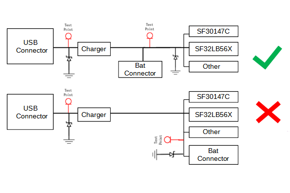  

<div align="center"> Figure 5-34 Power SupplyTVS Layout Reference </div>  <br> <br> <br>

For the ground pin of the TVS diode, avoid using a long trace before connecting to ground as much as possible, as shown in Figure 5-35.


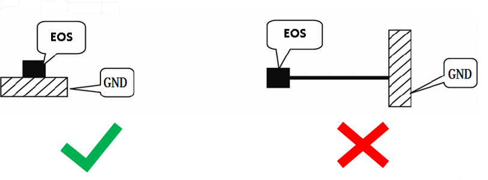  

<div align="center"> Figure 5-35 TVS Routing Reference </div>  <br> <br> <br>

## Q&A

Question 1: Why do some GPIO default states differ from the SPEC description when booting with Mode = 1?

Answer: Booting with Mode = 1 enters download mode, which changes the states of the MPI3-related GPIOs for the external Flash.

Question 2: Why might soldering the battery cause the system to hang? How can this be avoided?

Answer: Poor grounding of the soldering iron may cause a surge impact, resulting in a system hang. These issues can be avoided by adding surge and ESD protection to the battery interface and ensuring that the soldering iron is properly grounded.

##  Revision History

| Version  | Date   | Release Notes  |
| ----- | ------ | --------- |
| 0.0.1 | 9/2022 | Draft version |
|       |        |           |
|       |        |           |
