# SF32LB58x Hardware Design Guide


## Basic Introduction

The main purpose of this document is to help hardware engineers complete schematic and PCB designs based on the SF32LB58x series chips.

SF32LB58x is a series of highly integrated, high-performance system-on-chip (SoC) MCU chips for ultra-low-power artificial intelligence of things (AIoT) applications. The processor in the chip can effectively balance the high computing performance required for human-machine interaction with the ultra-low operating and sleep power consumption required for long standby time. It can be widely used in various application scenarios such as wristband wearable electronic devices, smart mobile terminals, and smart home products.

This chip integrates a world-class low-power Bluetooth 5.3 transceiver, featuring high receive sensitivity, high transmit power, and low power consumption.

The chip provides abundant internal and external storage resources. The fully packaged chip has multiple QSPI memory interfaces and SD/eMMC interfaces. In addition, for different models, the chip's internal SiP provides different-capacity combinations of NorFlash and PSRAM.

To better support display applications, the chip provides a comprehensive set of display interfaces, including MIPI-DSI, 3/4-wire SPI, Dual/Quad data SPI, DBI 8080, DPI, and parallel/serial JDI.

## Schematic Design Guidelines

### Power Supply

The SF32LB58x series chips integrate a PMU power unit and support two BUCK outputs, which require external inductors and capacitors before being routed back to the chip's internal power inputs. There are also three internal LDO power supplies that require capacitors outside the chip. For SF32LB58x watch solution designs, SiFli Technology's SF30147C PMIC chip can be connected externally to provide power not only to the SF32LB58x, but also to related peripherals.

#### SiFli PMIC chip power distribution

SF30147C is a highly integrated, high-efficiency, cost-effective power management chip for ultra-low-power wearable products. SF30147C integrates four LDOs, each with a wide input and output voltage range and capable of providing a maximum load current of 100 mA. For different peripherals, SF30147C integrates seven low-leakage, low on-resistance load switches: two high-voltage load switches, suitable for peripherals driven directly by the battery voltage, such as audio power amplifiers; and five low-voltage switches, suitable for peripherals powered by 1.8 V. SF32LB58x uses two GPIO interfaces to emulate TWI signals and control SF30147C. For the usage of each power output of SF30147C, see Table 2.1. For details about this chip, refer to the document DS0002-SF30147C-Chip Datasheet.

<div align="center"> Table 2.1 SF30147C Power Supply Allocation Table </div>

```{table}
:align: center
| SF30147C  Power Supply Pin | Minimum Voltage (V) | Maximum Voltage (V) | Maximum Current (mA) | Detailed Description                                                     |
| ------------------ | ----------- | ----------- | ------------ | ------------------------------------------------------------ |
| VBUCK              | 1.8         | 1.8         | 500          | 1.8 V Power Supply for SF32LB58x PVDD1, PVDD2, VDDIOA, VDDIOA2, VDDIOB, AVDD_BRF, AVDD18_DSI, etc. |
| LVSW1              | 1.8         | 1.8         | 100          | I2S Class-K PA logic power supply                         |
| LVSW2              | 1.8         | 1.8         | 100          | G-SENSOR 1.8V power supply                                |
| LVSW3              | 1.8         | 1.8         | 150          | Heart rate 1.8V power supply                              |
| LVSW4              | 1.8         | 1.8         | 150          | LCD 1.8V power supply                                     |
| LVSW5              | 1.8         | 1.8         | 150          | EMMC CORE power supply                                    |
| LDO1               | 2.8         | 3.3         | 100          | SF32LB58x AVDD33_USB, AVDD33_ANA, AVDD33_AUD, AVDDIOA2, etc. 3.3V Power Supply |
| LDO2               | 2.8         | 3.3         | 100          | EMMC or SD NAND power supply                              |
| LDO3               | 2.8         | 3.3         | 100          | LCD 3.3V power supply                                     |
| LDO4               | 2.8         | 3.3         | 100          | Heart rate 3.3V power supply                              |
| HVSW1              | 2.8         | 5           | 150          | Analog Class-K PA power supply                            |
| HVSW2              | 2.8         | 5           | 150          | GPS power supply                                          |
```
#### SF32LB58x Power Supply Requirements

The specifications of the PMU power supplies integrated in the SF32LB58x series chips are shown in Table 2.2.

<div align="center"> Table 2.2 PMU Power Supply Specifications </div>

```{table}
:align: center
| PMU Power Supply Pins      | Minimum Voltage (V) | Typical Voltage (V) | Maximum Voltage (V) | Maximum Current (mA) | Detailed Description                                                    |
| ------------------ | ----------- | ----------- | ----------- | ------------ | ----------------------------------------------------------- |
| PVDD1              | 1.71        | 1.8         | 3.6         | 100          | PVDD1 Power Supply input                                             |
| PVDD2              | 1.71        | 1.8         | 3.6         | 50           | PVDD2 Power Supply input                                             |
| BUCK1_LX  BUCK1_FB | -           | 1.25        | -           | 100          | BUCK1_LX output, connected to internal Power Supply input 1 of the inductor, connected to the other end of the inductor, and connected to an external capacitor |
| BUCK2_LX  BUCK2_FB | -           | 0.9         | -           | 50           | BUCK2_LX output, connected to internal Power Supply input 2 of the inductor, connected to the other end of the inductor, and connected to an external capacitor |
| LDO_VOUT1          | -           | 1.1         | -           | 100          | LDO output, connected to an external capacitor             |
| VDD_RET            | -           | 0.9         | -           | 1            | RET LDO output, connect an external capacitor                                       |
| VDD_RTC            | -           | 1.1         | -           | 1            | RTC LDO output, connect an external capacitor                                       |
| MIC_BIAS           | 1.4         | -           | 2.8         | -            | MIC Power Supply output                                               |
```

The specifications of other power supplies requiring external power for the SF32LB58x series chips are shown in Table 2.3.

<div align="center"> Table 2.3 Other Power Supply Specifications </div>

```{table}
:align: center
| Other Power Supply Pins | Minimum Voltage (V) | Typical Voltage (V) | Maximum Voltage (V) | Maximum Current (mA) | Detailed Description                     |
| ------------ | ----------- | ----------- | ----------- | ------------ | ---------------------------- |
| AVDD_BRF     | 1.71        | 1.8         | 3.3         | 1            | RF Power Supply input                |
| AVDD18_DSI   | 1.71        | 1.8         | 2.5         | 20           | MIPI DSI Power Supply input; leave floating if unused |
| AVDD33_ANA   | 3.15        | 3.3         | 3.45        | 50           | Analog Power Supply + RFPA Power Supply input      |
| AVDD33_AUD   | 3.15        | 3.3         | 3.45        | 50           | Analog audio Power Supply input             |
| AVDD33_USB   | 3.15        | 3.3         | 3.45        | 50           | USB Power Supply input                  |
| VDDIOA       | 1.71        | 1.8         | 3.45        | -            | PA12-PA93 I/O Power Supply input        |
| VDDIOA2      | 1.71        | 1.8         | 3.45        | -            | PA0-PA11 I/O Power Supply input         |
| VDDIOB       | 1.71        | 1.8         | 3.45        | -            | PB I/O Power Supply input               |
| VDDIOSA      | 1.71        | 1.8         | 1.98        | -            | SIPA Power Supply input                 |
| VDDIOSB      | 1.71        | 1.8         | 1.98        | -            | SIPB Power Supply input                 |
| VDDIOSC      | 1.71        | 1.8         | 1.98        | -            | SIPC Power Supply input                 |
| GPADC_VREFP  |      -      |      -      |      -      |      -       | GPADC reference voltage input; connect only an external capacitor, no external power supply required   |
| AUD_VREF     |      -      |      -      |      -      |      -       | Audio reference voltage input; connect only an external capacitor, no external power supply required     |
```

The recommended values for external capacitors on the power pins of the SF32LB58x series chips are shown in Table 2.4.

<div align="center"> Table 2.4 Recommended Capacitor Values </div>

```{table}
:align: center
| Power Supply pin           | Capacitor          | Detailed description                                       |
| ------------------ | ------------- | ---------------------------------------------- |
| PVDD1              | 0.1uF + 10uF  | Place at least two capacitors, 10uF and 0.1uF, close to the pin.  |
| PVDD2              | 0.1uF + 10uF  | Place at least two capacitors, 10uF and 0.1uF, close to the pin.  |
| BUCK1_LX  BUCK1_FB | 0.1uF + 4.7uF | Place at least two capacitors, 4.7uF and 0.1uF, close to the pin. |
| BUCK2_LX  BUCK2_FB | 0.1uF + 4.7uF | Place at least two capacitors, 4.7uF and 0.1uF, close to the pin. |
| LDO_VOUT1          | 4.7uF         | Place at least one 4.7uF capacitor close to the pin.            |
| VDD_RET            | 0.47uF        | Place at least one 0.47uF capacitor close to the pin.           |
| VDD_RTC            | 0.1uF         | Place at least one 0.1uF capacitor close to the pin.            |
| AVDD_BRF           | 1uF           | Place at least one 1uF capacitor close to the pin.              |
| AVDD18_DSI         | 4.7uF         | Place at least one 4.7uF capacitor close to the pin.            |
| AVDD33_ANA         | 1uF           | Place at least one 1uF capacitor close to the pin.              |
| AVDD33_AUD         | 4.7uF         | Place at least one 4.7uF capacitor close to the pin.          |
| AVDD33_USB         | 1uF           | Place at least one 1uF capacitor close to the pin.              |
| MIC_BIAS           | 1uF           | Place at least one 1uF capacitor close to the pin.              |
| VDDIOA             | 1uF           | Place at least one 1uF capacitor close to the pin.              |
| VDDIOA2            | 1uF           | Place at least one 1uF capacitor close to the pin.              |
| VDDIOB             | 1uF           | Place at least one 1uF capacitor close to the pin.              |
| VDDIOSA            | 1uF           | Place at least one 1uF capacitor close to the pin.              |
| VDDIOSB            | 1uF           | Place at least one 1uF capacitor close to the pin.              |
| VDDIOSC            | 1uF           | Place at least one 1uF capacitor close to the pin.              |
```

#### Power-On Sequence and Reset

The SF32LB58x series chips include internal POR (Power-on Reset) and BOR (Brownout Reset) functions, and also support an external hardware reset signal RSTN. The specific requirements are shown in Figure 2.1.

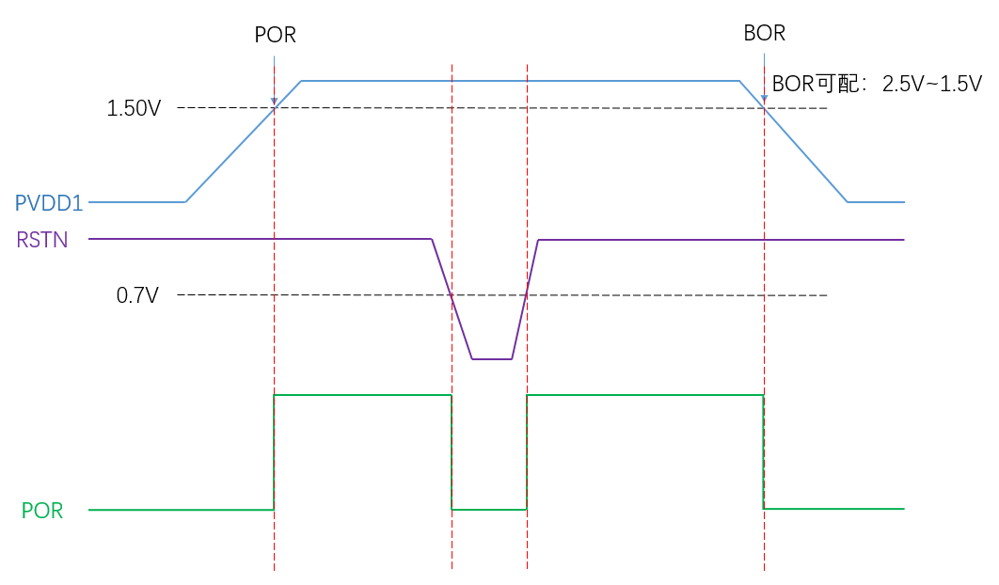

<div align="center"> Figure 2.1 Power-On/Power-Off Timing Diagram </div>  <br> <br> <br>

The RSTN reset signal of the SF32LB58x series chips must be pulled up to the PVDD1 input voltage domain and connected to ground through a 0.1 uF capacitor to implement an RC delayed reset, as shown in Figure 2.2.

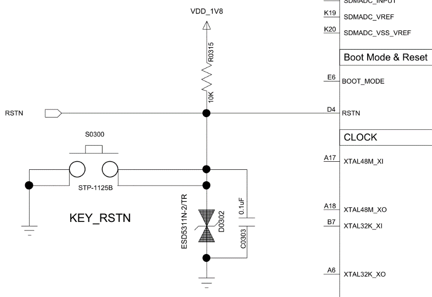

<div align="center"> Figure 2.2 Reset Circuit Diagram </div>  <br> <br> <br>

#### Typical Power Supply Circuit

The SF32LB58x series chips can use SiFli Technology's PMIC SF30147C to supply various power rails. The outputs are shown in Figure 2.3. For specific usage, see Table 2.1.

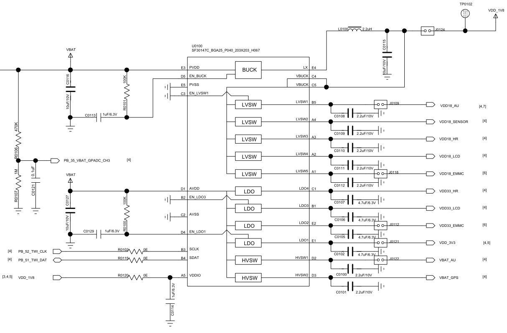

<div align="center"> Figure 2.3 SF30147C Power Supply Diagram </div>  <br> <br> <br>

 The SF32LB58x series chips have two BUCK outputs built into the package, as shown in Figure 2.4.

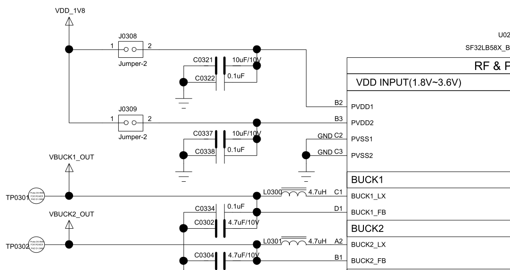

<div align="center"> Figure 2.4 Built-in DCDC Circuit Diagram </div>  <br> <br> <br>

#### BUCK Inductor Selection Requirements

:::{important}

**Key Parameters of the Power Inductor**

L (inductance) = 4.7 uH, DCR (DC resistance) ≦ 0.4 ohm, Isat (saturation current) ≧ 500 mA

:::

The SF32LB58x series chip package integrates three LDO outputs, as shown in Figure 2.5.

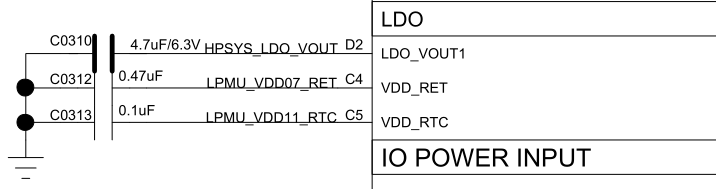 

<div align="center"> Figure 2.5 Built-in LDO Circuit Diagram </div>  <br> <br> <br>

### Boot Mode

The SF32LB58x series chips provide a Mode pin for configuring the boot mode, as shown in Table 2.5.

<div align="center"> Table 2.5 Mode Description </div>

```{table}
:align: center
| Mode configuration | Detailed description                             |
| -------- | ------------------------------------ |
| High       | After the chip powers on and starts up, it enters download mode         |
| Low       | After the chip powers on and starts up, it jumps to the user program area to start |
```

:::{note}
**Notes:**

1. The voltage domain of Mode is the same as that of VDDIOA;
2. Mode must be connected externally through a 10K resistor to the power supply or GND to keep the level stable. It must not be left floating or be subject to toggle interference;
3. A test point must be reserved for the Mode pin on mass-production boards. It is used for program flashing or crystal calibration; a jumper does not need to be reserved;
4. It is recommended to reserve a jumper for the Mode pin on test boards, so that after a program crash, the board can be booted from download mode to download the program.
:::

### Clock

The SF32LB58x series chip requires two externally supplied clock sources: a 48 MHz main crystal and a 32.768 kHz RTC crystal. The specific requirements are shown in Table 2.6.

<div align="center"> Table 2.6 Crystal Specification Requirements </div>

```{table}
:align: center
|Crystal|Crystal specification requirements   |Detailed description  |
|:--|:-------|:--------|
|48MHz |7pF≦CL≦12pF (recommended value 8.8pF) △F/F0≦±10ppm ESR≦30 ohms (recommended value 22ohms)|Crystal oscillator power consumption is related to CL and ESR. The smaller the CL and ESR, the lower the power consumption. For optimal power performance, it is recommended to use components with relatively smaller CL and ESR values within the required range. Reserve parallel matching capacitors next to the crystal. When CL<12pF, no capacitors need to be mounted|
|32.768KHz |CL≦12.5pF (recommended value 7pF) △F/F0≦±20ppm ESR≦80k ohms (recommended value 38Kohms)|Crystal power consumption is related to CL and ESR. The smaller the CL and ESR, the lower the power consumption. For optimal power consumption performance, it is recommended to use components with relatively small CL and ESR values within the required range. Reserve parallel matching capacitors next to the crystal. When CL<12.5pF, no capacitor needs to be soldered|
```

 **Crystal Recommendation**

<div align="center"> Table 2.7 Certified Crystal Models </div>

```{table}
:align: center
| Model                | Manufacturer    | Parameters                                                         |
| ------------------- | ------- | ------------------------------------------------------------ |
| E1SB48E001G00E      | Hosonic | F0 = 48.000000MHz, △F/F0 = -6 ~ 8 ppm,  CL = 8.8 pF, ESR =  22 ohms Max  TOPR  = -30 ~ 85℃, Package = (2016 metric) |
| ETST00327000LE      | Hosonic | F0 = 32.768KHz, △F/F0  = -20 ~ 20 ppm,  CL = 7 pF, ESR =  70K ohms Max  TOPR  = -40 ~ 85℃, Package = (3215 metric) |
| SX20Y048000B31T-8.8 | TKD     | F0 = 48.000000MHz, △F/F0 = -10 ~ 10 ppm,  CL = 8.8 pF, ESR =  40 ohms Max  TOPR  = -20 ~ 75℃, Package = (2016 metric) |
| SF32K32768D71T01    | TKD     | F0 = 32.768KHz, △F/F0  = -20 ~ 20 ppm,  CL = 7 pF, ESR =  70K ohms Max  TOPR  = -40 ~ 85℃, Package = (3215 metric) |
```

:::{note}
The ESR of the SX20Y048000B31T-8.8 is slightly higher, and its static power consumption will also be slightly higher.

When routing the PCB, remove at least the second-layer GND copper under the crystal to reduce the parasitic load capacitance on the clock signal.
:::

For detailed material certification information, refer to:
[SIFLI-MCU-AVL Certification List](index)

### RF

The RF section of the SF32LB58x series chip uses on-chip integrated broadband matching filter technology, so it is only necessary to ensure that the RF PCB trace has a 50-ohm characteristic impedance. During design, it is recommended to reserve a π-type matching network for spurious filtering and antenna matching. Refer to the circuit shown in Figure 2.6.

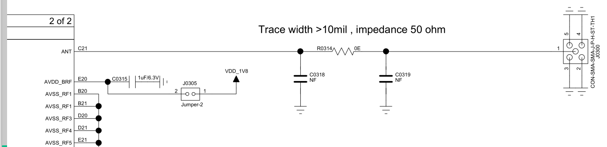 

<div align="center"> Figure 2.6 RF Schematic </div>  <br> <br> <br>

:::{note}
**Note:**

The component values of the matching network must be determined through testing based on the actual antenna and PCB layout.
:::

### External Memory Interface

The SF32LB58x series chip supports connecting external NOR FLASH and SPI NAND FLASH through the MPI3 or MPI4 interface, and connecting external SD NAND and EMMC through the SD1 interface.

#### QSPI NAND Flash Interface

The EVB validation board for the SF32LB58x series chip uses the 'MPI4' interface by default to connect to an external SPI NAND Flash device. For the signals used, see Table 2.8; for the specific circuit, refer to Figure 2.7.

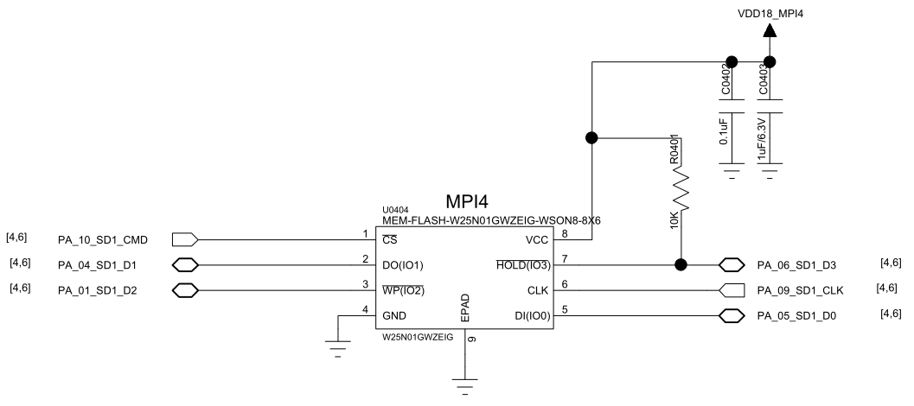

<div align="center"> Figure 2.7 SPI NAND Flash Connection Reference Circuit </div>  <br> <br> <br>


<div align="center"> Table 2.8 MPI4 Signal Connections </div>

```{table}
:align: center
| Flash Signal | I/O Signal (MPI4) | Detailed Description                                    |
| ---------- | --------------- | ------------------------------------------- |
| CS#        | PA10            | Chip select, active low.                    |
| SO         | PA04            | Data Input (Data Input Output 1)            |
| WP#        | PA01            | Write Protect Output (Data Input Output  2) |
| SI         | PA05            | Data Output (Data Input Output 0)           |
| SCLK       | PA09            | Serial Clock Output                         |
| Hold#      | PA06            | Data Output (Data Input Output 3)           |
```

:::{note}
**Note:**

1. If the production line needs to flash a program to the external FLASH, set the external FLASH power control pin PA43 high in the download tool software to turn on the external FLASH power.

2. The Hold# pin of the SPI NAND Flash must be pulled up to the SPI NAND Flash power supply through a 10K resistor.
:::

#### SDIO eMMC/Micro SD Interface

The SF32LB58x series chip supports two SDIO interfaces. On the EVB board, SD1 is connected to EMMC or SD NAND by default, and SD2 is connected to an SD card or WIFI chip. Refer to the circuits shown in Figures 2.8, 2.9, and 2.10.

The SD1 interface uses a total of 12 GPIOs, PA00–PA11. Their power domain is VDDIOA2, which supports 1.8 V and 3.3 V power supplies, and the input voltage can be set according to the interface level of the peripheral. It is recommended that SPI NAND FLASH and EMMC use a 1.8 V interface level. Since SD NAND FLASH dies support only a 3.3 V interface level, VDDIOA2 must be connected to 3.3 V.

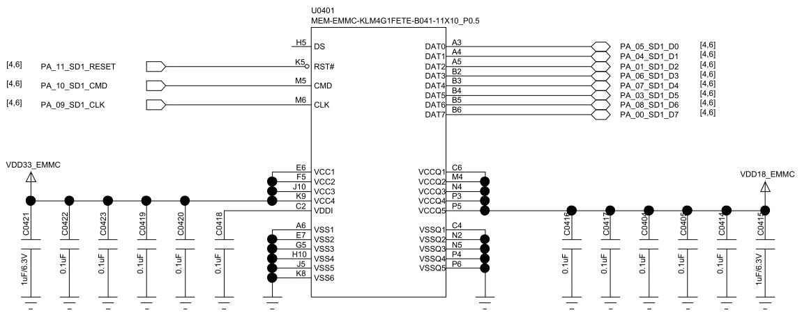  

<div align="center"> Figure 2.8 EMMC Connection Reference Circuit </div>  <br> <br> <br>


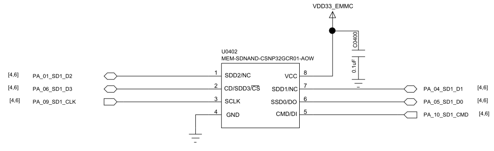 

<div align="center"> Figure 2.9 SD NAND Connection Reference Circuit </div>  <br> <br> <br>


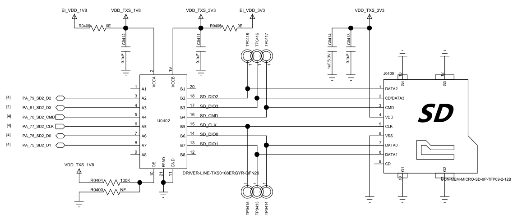  

<div align="center"> Figure 2.10 SD Card Connection Reference Circuit </div>  <br> <br> <br>


The SD1 and SD2 signal connections of the SF32LB58x series chip are shown in Tables 2.9 and 2.10.


<div align="center"> Table 2.9 SD1 Signal Connections </div>

```{table}
:align: center
| SD1 Signal | I/O Signal | Detailed Description |
| -------- | ------- | -------- |
| SD1_D7   | PA00    | Data 7    |
| SD1_D2   | PA01    | Data 6    |
| SD1_D5   | PA03    | Data 5   |
| SD1_D1   | PA04    | Data 1    |
| SD1_D0   | PA05    | Data 0    |
| SD1_D3   | PA06    | Data 3    |
| SD1_D4   | PA07    | Data 4    |
| SD1_D6   | PA08    | Data 6    |
| SD1_CLK  | PA09    | Clock Signal |
| SD1_CMD  | PA10    | Command Signal |
```

<div align="center"> Table 2.10 SD2 Signal Connections </div>

```{table}
:align: center 
| SD2 Signal | I/O Signal | Detailed Description |
| -------- | ------- | -------- |
| SD2_CMD  | PA70    | Command Signal |
| SD2_D1   | PA75    | Data 1    |
| SD2_D0   | PA76    | Data 0    |
| SD2_CLK  | PA77    | Clock Signal |
| SD2_D2   | PA79    | Data 2    |
| SD2_D3   | PA81    | Data 3    |
```

### Display

#### MIPI DSI Display Interface

The SF32LB58x series chip supports a 2-lane MIPI DSI display interface, as shown in Table 2.11. 

<div align="center"> Table 2.11 MIPI-DSI Signal Connections </div>

```{table}
:align: center 
| MIPI DSI signal | I/O        | Description                        |
| --------------- | ---------- | ---------------------------------- |
| CLKP            | DSI_CLKP   | MIPI Clock Signal+                     |
| CLKN            | DSI_CLKN   | MIPI Clock Signal-                     |
| D0P             | DSI_D0P    | MIPI Data Lane 0+                    |
| D0N             | DSI_D0N    | MIPI Data Lane 0-                    |
| D1P             | DSI_D1P    | MIPI Data Lane 1+                    |
| D1N             | DSI_D1N    | MIPI Data Lane 1-                    |
| -               | AVDD18_DSI | MIPI Power Supply Input                      |
| -               | DSI_REXT   | Connect an external 10K resistor to ground                    |
| -                | AVSS_DSI   | Ground                               |
| TE              | PB2        | Tearing effect to MCU frame signal |
| RESET           | PB5        | Display panel reset signal                     |
```

#### SPI/QSPI Display Interface

The SF32LB58x series chip supports 3/4-wire SPI and Quad-SPI interfaces for connecting LCD displays. The large core uses LCDC1 on PA, and the small core uses LCDC2 on PB, as shown in Table 2.12.

<div align="center"> Table 2.12 SPI/QSPI Signal Connection Methods </div>

```{table}
:align: center 
| SPI Signal | I/O (LCDC1) | I/O (LCDC2) | Detailed Description                                                  |
| ------- | ------------ | ------------ | --------------------------------------------------------- |
| CSX     | PA44         | PB08         | Enable signal                                                  |
| WRX_SCL | PA46         | PB10         | Clock Signal                                                  |
| DCX     | PA48         | PB03         | Data/command signal in 4-wire SPI mode; data 1 in Quad-SPI mode  |
| SDI_RDX | PA50         | PB09         | Data input signal in 3/4-wire SPI mode; data 0 in Quad-SPI mode |
| SDO     | PA50         | PB09         | Data output signal in 3/4-wire SPI mode; short it to SDI_RDX  |
| D[0]    | PA47         | PB04         | Data 2 in Quad-SPI mode                                    |
| D[1]    | PA45         | PB06         | Data 3 in Quad-SPI mode                                    |
| REST    | PA74         | PB05         | Display panel reset signal                                            |
| TE      | PA43         | PB02         | Tearing effect to MCU frame signal                        |
```

#### MCU8080 Display Interface

The SF32LB58x series chip supports an MCU8080 interface for connecting LCD displays, as shown in Table 2.13.

<div align="center"> Table 2.13 MCU8080 Display Signal Connection Methods </div>

```{table}
:align: center 
| MCU8080 Signal | I/O  | Detailed Description                            |
| ----------- | ---- | ----------------------------------- |
| CSX         | PA44 | Chip select                         |
| WRX         | PA46 | Writes strobe signal to  write data |
| DCX         | PA48 | Display data / command  selection   |
| RDX         | PA50 | Reads strobe signal to write  data  |
| D[0]        | PA47 | Data 0                              |
| D[1]        | PA45 | Data 1                              |
| D[2]        | PA26 | Data 2                              |
| D[3]        | PA27 | Data 3                              |
| D[4]        | PA42 | Data 4                              |
| D[5]        | PA51 | Data 5                              |
| D[6]        | PA52 | Data 6                              |
| D[7]        | PA58 | Data 7                              |
| REST        | PA24 | Reset                               |
| TE          | PA43 | Tearing effect to MCU frame signal  |
```

#### DPI Display Interface

The SF32LB58x series chip supports a DPI interface for connecting LCD displays, as shown in Table 2.14.


<div align="center"> Table 2.14 DPI Display Signal Connection Methods </div>

```{table}
:align: center
| DPI Signal | I/O  | Detailed Description                               |
| ------- | ---- | -------------------------------------- |
| CLK     | PA12 | Clock Signal                               |
| DE      | PA13 | Data enable signal                           |
| HSYNC   | PA14 | Horizontal sync signal                             |
| VSYNC   | PA15 | Vertical sync signal                             |
| SD      | PA18 | Controls Display shutdown                        |
| CM      | PA19 | Switches between Normal Color and Reduce Color Mode |
| R0      | PA22 | Pixel signal                               |
| R1      | PA23 | Pixel signal                               |
| R2      | PA24 | Pixel signal                               |
| R3      | PA25 | Pixel signal                               |
| R4      | PA26 | Pixel signal                               |
| R5      | PA27 | Pixel signal                               |
| R6      | PA43 | Pixel signal                               |
| R7      | PA44 | Pixel signal                               |
| G0      | PA45 | Pixel signal                               |
| G1      | PA46 | Pixel signal                               |
| G2      | PA47 | Pixel signal                               |
| G3      | PA48 | Pixel signal                               |
| G4      | PA50 | Pixel signal                               |
| G5      | PA53 | Pixel signal                               |
| G6      | PA54 | Pixel signal                               |
| G7      | PA55 | Pixel signal                               |
| B0      | PA56 | Pixel signal                               |
| B1      | PA57 | Pixel signal                               |
| B2      | PA58 | Pixel signal                               |
| B3      | PA61 | Pixel signal                               |
| B4      | PA62 | Pixel signal                               |
| B5      | PA63 | Pixel signal                               |
| B6      | PA65 | Pixel signal                               |
| B7      | PA67 | Pixel signal                               |
```

#### JDI Display Interface

The SF32LB58x series chip supports parallel and serial JDI interfaces for connecting LCD displays, and supports multiplexing the corresponding signals to LCDC1 on PA or LCDC2 on PB. LCDC2 on the PB interface is recommended, as shown in Tables 2.15 and 2.16.


<div align="center"> Table 2.15 Parallel JDI Display Signal Connection Methods </div>

```{table}
:align: center
| JDI Signal      | I/O (LCDC1) | I/O (LCDC2) | Detailed Description                                                     |
| ------------ | ------------ | ------------ | ------------------------------------------------------------ |
| JDI_VCK      | PA19         | PB15         | Shift clock for the vertical driver                          |
| JDI_VST      | PA22         | PB19         | Start signal for the vertical driver                         |
| JDI_XRST     | PA25         | PB16         | Reset signal for the horizontal and  vertical driver         |
| JDI_HCK      | PA43         | PB05         | Shift clock for the  horizontal driver                       |
| JDI_HST      | PA44         | PB10         | Start signal for the horizontal driver                       |
| JDI_ENB      | PA45         | PB12         | Write enable signal for the pixel memory                     |
| JDI_R1       | PA46         | PB09         | Red image data (odd pixels)                                  |
| JDI_R2       | PA47         | PB06         | Red image data (even pixels)                                 |
| JDI_G1       | PA48         | PB08         | Green image data (odd pixels)                                |
| JDI_G2       | PA50         | PB04         | Green image data (even pixels)                               |
| JDI_B1       | PA65         | PB02         | Blue image data (odd pixels)                                 |
| JDI_B2       | PA67         | PB03         | Blue image data (even pixels)                                |
| JDI_XFRP     | PBR1         | PBR1         | Liquid crystal driving signal  ("On" pixel)                  |
| JDI_VCOM/FRP | PBR2         | PBR2         | Common electrode driving signal/   Liquid crystal driving signal  ("Off" pixel) |
```
 

<div align="center"> Table 2.16 Serial JDI Display Signal Connection Methods </div>

```{table}
:align: center
| JDI Signal      | I/O (LCDC1) | I/O  (LCDC2) | Detailed Description                         |
| ------------ | ------------ | -------------- | -------------------------------- |
| JDI_SCS      | PA82         | PB03           | Chip Select Signal               |
| JDI_SCLK     | PA84         | PB02           | Serial Clock Signal              |
| JDI_SO       | PA86         | PB06           | Serial Data Output Signal        |
| JDI_DISP     | PA90         | PB04           | Display ON/OFF Switching  Signal |
| JDI_EXTCOMIN | PA91         | PB05           | COM Inversion Polarity Input     |
```

### Touch and Backlight Interfaces

The SF32LB58x series chip supports an I2C-format touchscreen control interface and touchscreen status interrupt input. It also supports one PWM signal to control the enable and brightness of the backlight power chip, as shown in Table 2.17.


<div align="center"> Table 2.17 Touch and Backlight Control Connection Methods </div>

```{table}
:align: center
| Touchscreen and Backlight Signals | I/O  | Detailed Description                   |
| ---------------- | ---- | -------------------------- |
| Interrupt        | PA69 | Touch status interrupt signal (wake-up capable) |
| I2C1_SCL         | PA17 | Clock signal for touchscreen I2C        |
| I2C1_SDA         | PA16 | Data signal for touchscreen I2C        |
| BL_PWM           | PB44 | Backlight PWM control signal            |
| Reset            | PA15 | Touch reset signal               |
| Power Enable     | PA12 | Touchscreen Power Supply enable signal         |
```

### Debug and Flashing Interface

The SF32LB58x series chip supports the Arm® standard SWD debug interface and can be connected to EDA tools for single-step debugging. As shown in Figure 2.11, when connecting a SEEGER® J-Link® tool, the power supply of the debug tool must be changed to external interface input, with the J-Link tool powered by the SF32LB58x circuit board.

SF32LB58x provides one SWD interface and six UART interfaces that can be selected for debug information output. For details, see Table 2.18.


<div align="center"> Table 2.18 Debug Port Connection Methods </div>

```{table}
:align: center
| UART Signal | I/O  | Detailed Description                       |
| -------- | ---- | ------------------------------ |
| TXD1     | PA31 | RXD signal of UART1, HCPU default print port |
| RXD1     | PA32 | TXD signal of UART1, HCPU default print port |
| TXD2     | PA28 | RXD signal of UART2                 |
| RXD2     | PA29 | TXD signal of UART2                 |
| TXD3     | PA21 | RXD signal of UART3                 |
| RXD3     | PA20 | TXD signal of UART3                 |
| TXD4     | PB37 | RXD signal of UART4, LCPU default print port |
| RXD4     | PB36 | TXD signal of UART4, LCPU default print port |
| TXD5     | PB18 | RXD signal of UART5                 |
| RXD5     | PB17 | TXD signal of UART5                 |
| TXD6     | PB14 | RXD signal of UART6                 |
| RXD6     | PB13 | TXD signal of UART6                 |
| SWCLK    | PB07 | JLINK Clock signal                  |
| SWDIO    | PB11 | JLINK data signal                  |
```

:::{note}
**Note**

The RXD signal of UARTx must not be left floating. Configure it as an internal pull-up during software initialization.
:::
 
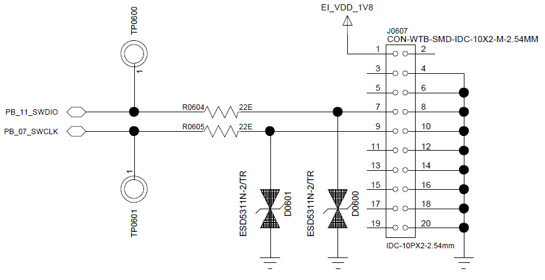 

<div align="center"> Figure 2.11 SWD Debug Interface Schematic </div>  <br> <br> <br> 


### Button Interface

#### Power On/Off and Long-Press Reset Button

For the power on/off signal of the SF32LB58x series chip, PB54 is recommended. This allows the short-press power on/off function and the long-press reset function to be combined on one button. As shown in Figure 2-12, the design uses an active-high method. For the long-press reset function, the chip automatically resets after the button is held for more than 10s.

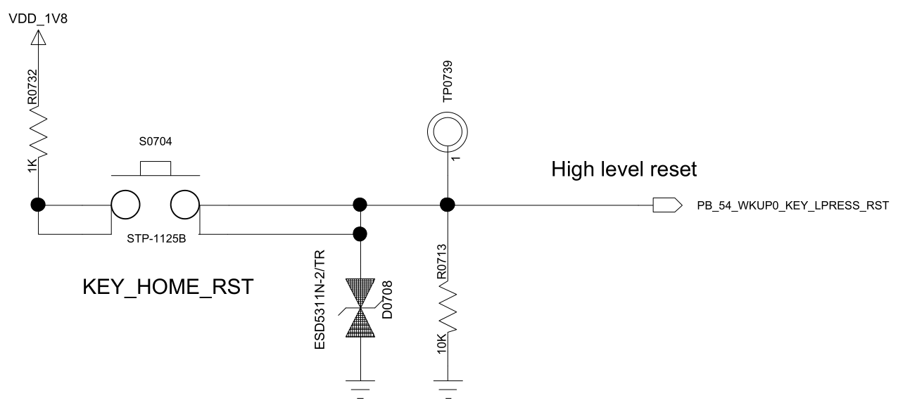  

<div align="center"> Figure 2.12 Power On/Off Button Circuit Diagram </div>  <br> <br> <br>


#### Function Button or Rotary Encoder

The SF32LB58x series chip supports function button inputs and rotary encoder signal inputs. The button or rotary encoder signal must be pulled up. The button usage is shown in Figure 2.13. Optical tracking sensors are also supported; the I2C4 interface is recommended. The signal connections are shown in Table 2.19.


<div align="center"> Table 2.19 Optical Tracking Sensor Signals </div>

```{table}
:align: center
| I2C Signal | I/O  | Detailed Description                 |
| ------- | ---- | ------------------------ |
| INT     | PA58 | Light tracking sensor interrupt signal input |
| SDA     | PA59 | Light tracking sensor I2C data signal |
| SCL     | PA60 | Light tracking sensor I2C Clock signal |
```


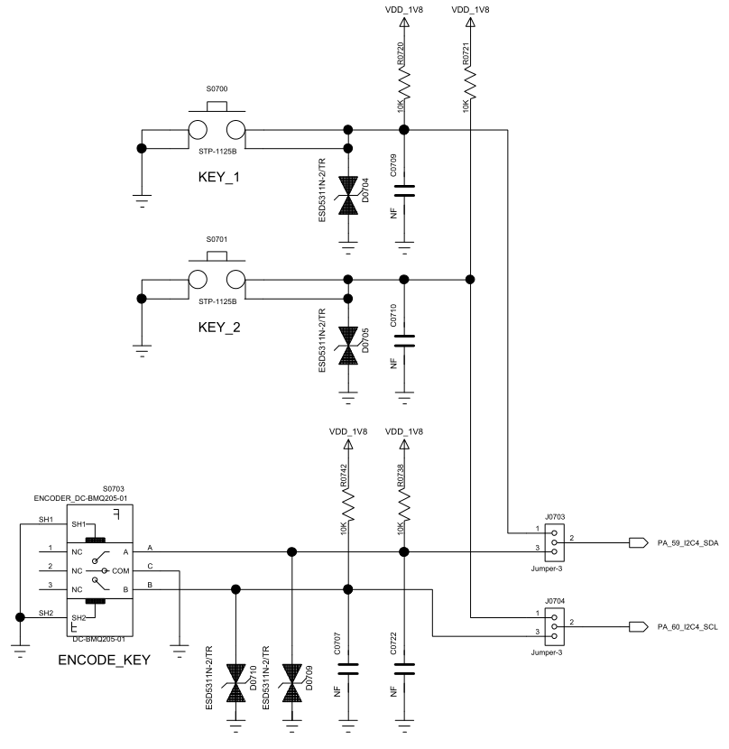  

<div align="center"> Figure 2.13 Function Button or Rotary Encoder Circuit Diagram </div>  <br> <br> <br>


### Vibration Motor Interface

The SF32LB58x series chip supports multiple PWM outputs, which can be used as drive signals for a vibration motor. Figure 2.14 shows the recommended circuit.

 
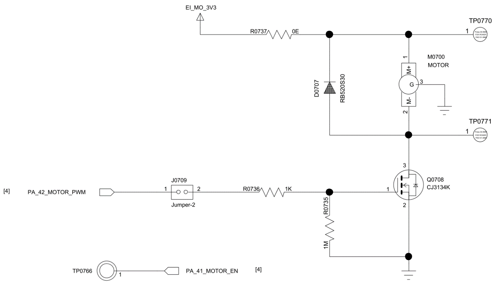  

<div align="center"> Figure 2.14 Vibration Motor Circuit Diagram </div>  <br> <br> <br>
 
:::{important}
If the software enables the HCPU main-frequency reduction macro definition `#define BSP PM FREQ SCALING 1`, after the HCPU enters the idle thread, the main frequency will decrease, and the PWM frequency of the corresponding Hcpu PA port will also change,
Therefore, it is recommended to use the PB interface to output the PWM signal.
:::

### PBR Interface Description

The SF32LB58x series chip provides six PBR interfaces, with the following main features:

1. During power-on, PBR0 changes from 0 to 1 and can be used for certain external LSW control; PBR1-PBR5 output 0 by default;

2. PBR0-PBR5 can be used as outputs in both standby and hibernate;

3. PBR0-PBR5 can output LPTIM signals;

4. PBR0-PBR5 can output 32K clock signals;

5. PBR0-PBR3 can be configured as inputs for wake-up signal input. When the MCU is awake, no interrupt is received.

### Wake-up Interrupt Sources

For the SF32LB58x series chip, all GPIOs support wake-up in light/deep sleep mode. In standby and Hibernate mode, 16 wake-up interrupt sources are supported, as shown in Table 2.20: 6 interrupt sources for PA and 10 interrupt sources for PB.


<div align="center"> Table 2.20 Interrupt Source Connection Methods </div>

```{table}
:align: center
| Interrupt Source    | I/O  | Detailed Description  |
| --------- | ---- | --------- |
| WKUP_PIN0 | PB54 | Interrupt signal 0 |
| WKUP_PIN1 | PB55 | Interrupt signal 1 |
| WKUP_PIN2 | PB56 | Interrupt signal 2 |
| WKUP_PIN3 | PB57 | Interrupt signal 3 |
| WKUP_PIN4 | PB58 | Interrupt signal 4 |
| WKUP_PIN5 | PB59 | Interrupt signal 5 |
| WKUP_PIN6 | PA64 | Interrupt signal 6 |
| WKUP_PIN7  | PA65 | Interrupt signal 7  |
| WKUP_PIN8  | PA66 | Interrupt signal 8  |
| WKUP_PIN9  | PA67 | Interrupt signal 9  |
| WKUP_PIN10 | PA68 | Interrupt signal 10 |
| WKUP_PIN11 | PA69 | Interrupt signal 11 |
| WKUP_PIN12 | PBR0 | Interrupt signal 12 |
| WKUP_PIN13 | PBR1 | Interrupt signal 13 |
| WKUP_PIN14 | PBR2 | Interrupt signal 14 |
| WKUP_PIN15 | PBR3 | Interrupt signal 15 |
```
 

### Audio Interface

The SF32LB58x series chip has various audio-related interfaces, as shown in Table 2.21. The audio interface signals have the following features:

1. Supports 3 sets of I2S. I2S1 can only be used for input, while I2S2 and I2S3 support both input and output. The 3 sets of I2S support only Master mode and do not support Slave mode;

2. I2S1 is recommended for connection to an I2S MIC input;

3. I2S2 is recommended for connection to an audio DAC;

4. I2S3 is recommended for connection to an audio codec;

5. Supports two PDM MIC inputs;

6. Supports two analog MIC inputs. A DC-blocking capacitor with a capacitance of at least 2.2 uF must be added in series, and the analog MIC power supply uses the SF32LB58x MIC_BIAS;

7. Supports an external analog audio PA. The traces for the two DAC outputs should both be routed as differential pairs with proper ground shielding. Also note: Trace Capacitance < 10 pF, Length < 2 cm. 

8. Supports stereo analog headphone connection.


<div align="center"> Table 2.21 Audio Signal Connection Methods </div>

```{table}
:align: center
| Audio Signal  | I/O  | Detailed Description     |
| --------- | ---- | ------------ |
| I2S1_LRCK | PA14 | I2S1 frame Clock   |
| I2S1_SDI  | PA18 | I2S1 data input |
| I2S1_BCK  | PA23 | I2S1 bit Clock   |
| I2S2_LRCK | PA84 | I2S2 frame Clock   |
| I2S2_SDI  | PA86 | I2S2 data input |
| I2S2_SDO  | PA82 | I2S2 data output |
| I2S2_BCK  | PA91 | I2S2 bit Clock   |
| I2S3_LRCK | PB31 | I2S3 frame Clock   |
| I2S3_SDI  | PB27 | I2S3 data input |
| I2S3_SDO  | PB24 | I2S3 data output |
| I2S3_BCK  | PB30 | I2S3 bit Clock   |
| I2S3_MCLK | PB34 | I2S3 master Clock   |
| PDM1_CLK  | PA23 | PDM1Clock     |
| PDM1_DATA | PA18 | PDM1 data     |
| PDM2_CLK  | PA25 | PDM2Clock     |
| PDM2_DATA | PA22 | PDM2 data     |
| AU_ADC1P | ADC1P | analog input 1P |
| AU_ADC1N | ADC1N | analog input 1N |
| AU_ADC2P | ADC2P | analog input 2P |
| AU_ADC2N | ADC2N | analog input 2N |
| AU_DAC1P | DAC1P | analog output 1P |
| AU_DAC1N | DAC1N | analog output 1N |
| AU_DAC2P | DAC2P | analog output 2P |
| AU_DAC2N | DAC2N | analog output 2N |
```


The SF32LB58x analog MIC supports single-ended and differential inputs, with a 2.2 uF capacitor connected in series in between. The differential input is shown in Figure 2.15, and the single-ended-to-differential input is shown in Figure 2.16. AU_ADC1P, AU_ADC1N, AU_ADC2P, and AU_ADC2N are connected to the SF32LB58x, and AU_ADC1P_IN and AU_ADC2P_IN are signals from the analog MIC or headphone audio input.

 
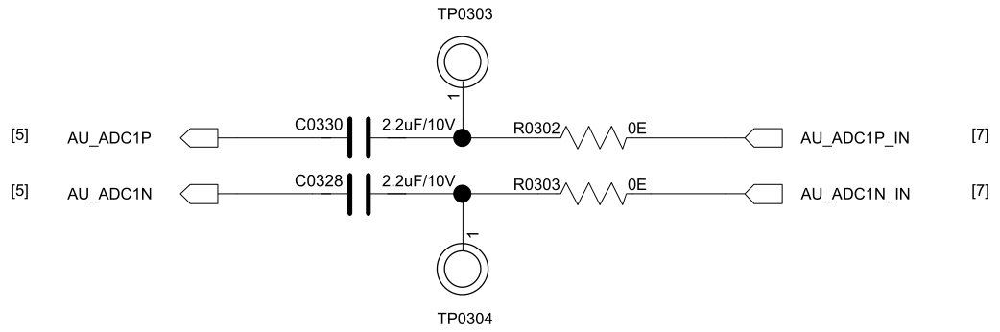  

<div align="center"> Figure 2.15 Differential Analog Audio Input Circuit Diagram </div>  <br> <br> <br>


 
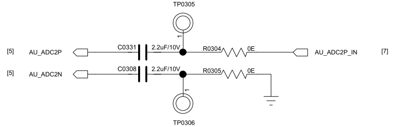  

<div align="center"> Figure 2.16 Single-Ended Analog Audio Input Circuit Diagram </div>  <br> <br> <br>


The SF32LB58x analog audio output circuit diagram is shown in Figure 2.17. AU_DAC1P, AU_DAC1N, AU_DAC2P, and AU_DAC2N are SF32LB58x output signals; HP_DAC1P_OUT, HP_DAC1N_OUT, HP_DAC2P_OUT, and HP_DAC2N_OUT are connected to the stereo headphone PA input pins; and SPK_DAC1P_OUT and SPK_DAC1N_OUT are connected to the analog audio PA input pins.

 
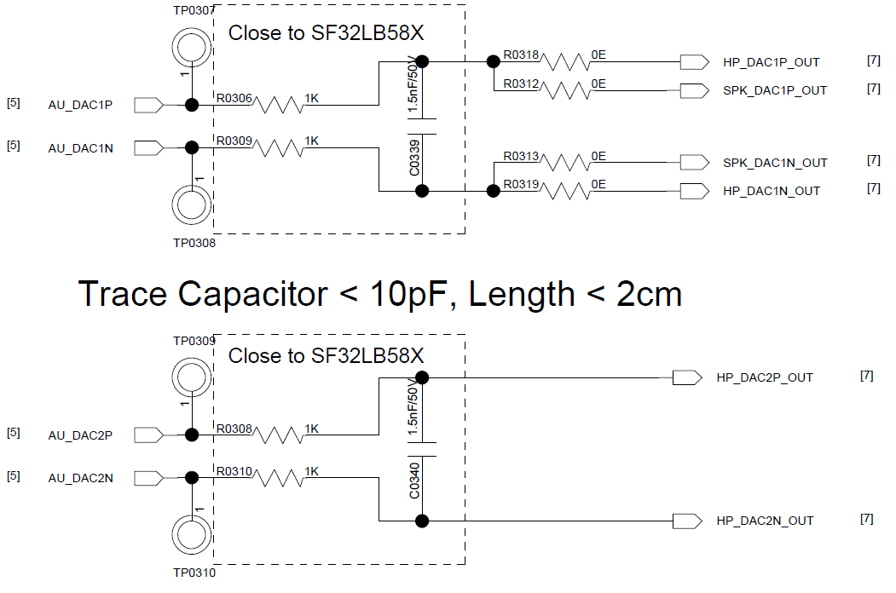  

<div align="center"> Figure 2.17 Analog Audio Output Circuit Diagram </div>  <br> <br> <br>
 


The circuit diagram for the analog MIC input connection is shown in Figure 2.18.

 
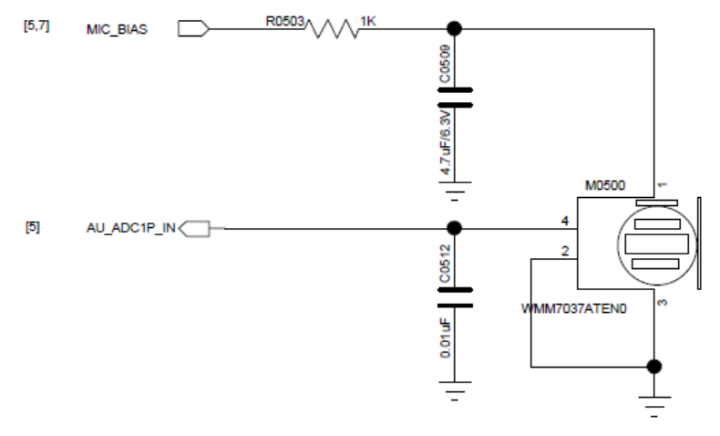  

<div align="center"> Figure 2.18 Analog MIC Circuit Diagram </div>  <br> <br> <br>

 

The stereo headphone connection circuit diagram is shown in Figure 2.19.

 
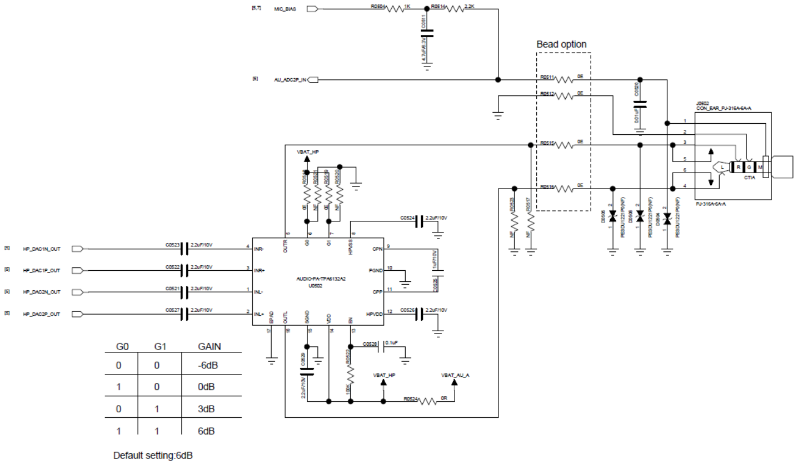  

<div align="center"> Figure 2.19 Stereo Headphone Circuit Diagram </div>  <br> <br> <br>

 
The analog audio PA connection circuit diagram is shown in Figure 2.20. I2C3 is used to configure the registers of the analog audio PA.

 
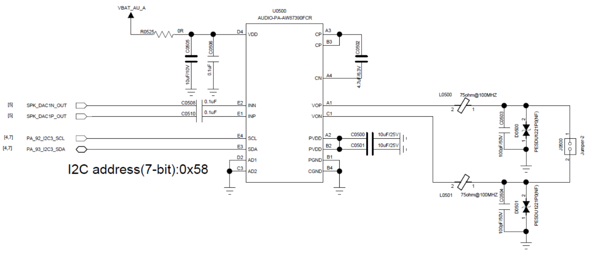  

<div align="center"> Figure 2.20 Analog Audio PA Circuit Diagram </div>  <br> <br> <br>


The I2S audio PA connection circuit diagram is shown in Figure 2.21. I2C3 is used to configure the registers of the I2S audio PA.

 
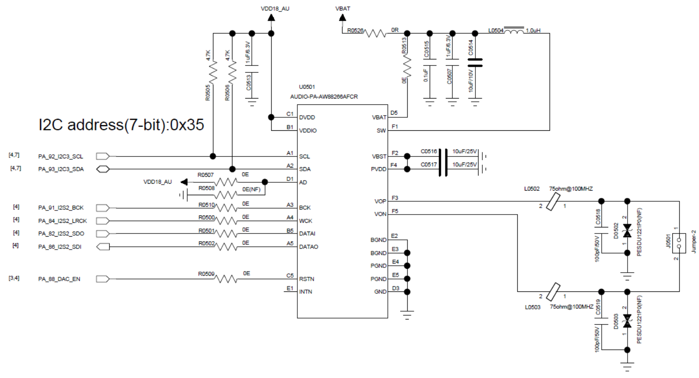  

<div align="center"> Figure 2.21 I2S Audio PA Circuit Diagram </div>  <br> <br> <br>
 

### USB Interface

The USB interface of the SF32LB58x series chip supports USB 2.0 HS and supports Host and Device modes. TVS diodes must be connected in parallel from USB DP and DM to ground, and the junction capacitance of the TVS diodes must be less than 5 pF. In addition, the DP and DM PCB traces must be impedance-controlled as a 90-ohm differential pair. The USB interface connection diagram is shown in Figure 2.22.

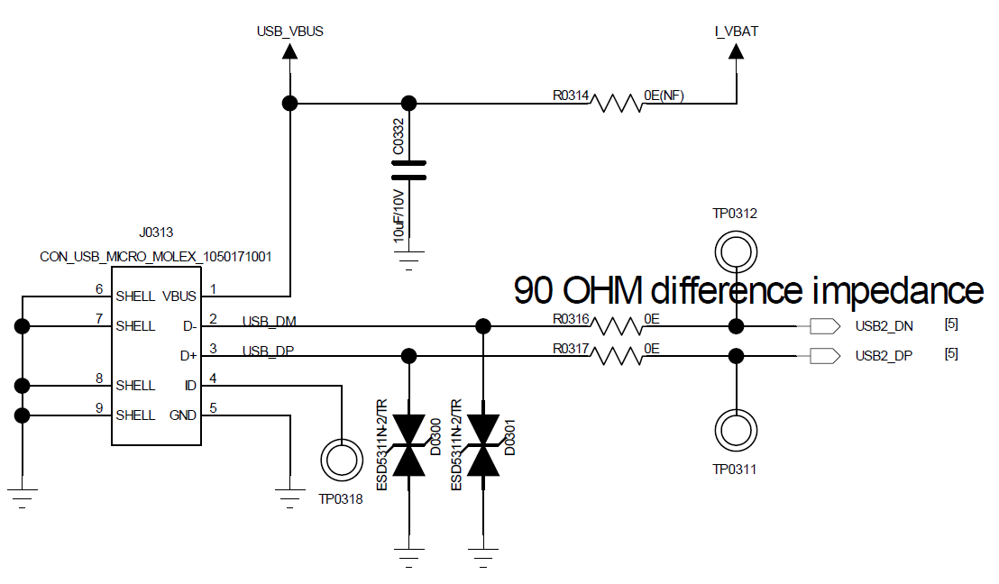  

<div align="center"> Figure 2.22 USB Interface Circuit Diagram </div>  <br> <br> <br>


## PCB Design Guidelines

### PCB Footprint Design

#### Package Dimensions

The SF32LB58x series chip is packaged in BGA256, 8.5 mm x 6.5 mm x 0.94 mm, with a 0.4 mm pitch. The detailed dimensions are shown in Figure 3.1.

 
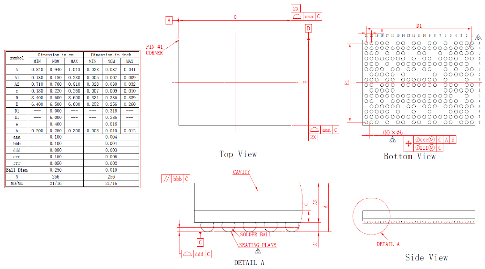  

<div align="center"> Figure 3.1 BGA256 Package Dimensions </div>  <br> <br> <br> 
 

#### Package Shape

The package outline is shown in Figure 3.2.


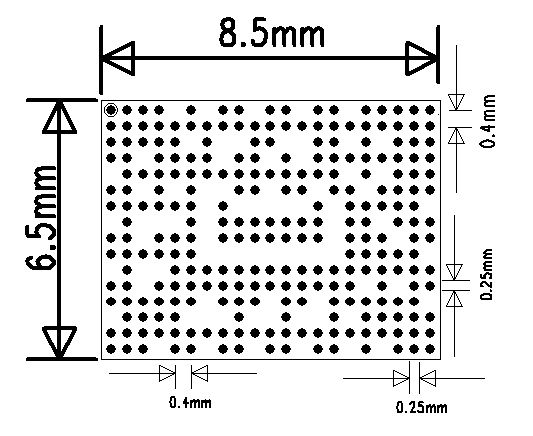  

<div align="center"> Figure 3.2 Package Outline Drawing </div>  <br> <br> <br> 


#### Pad Design

PCB pad design information is shown in Figure 3.3.


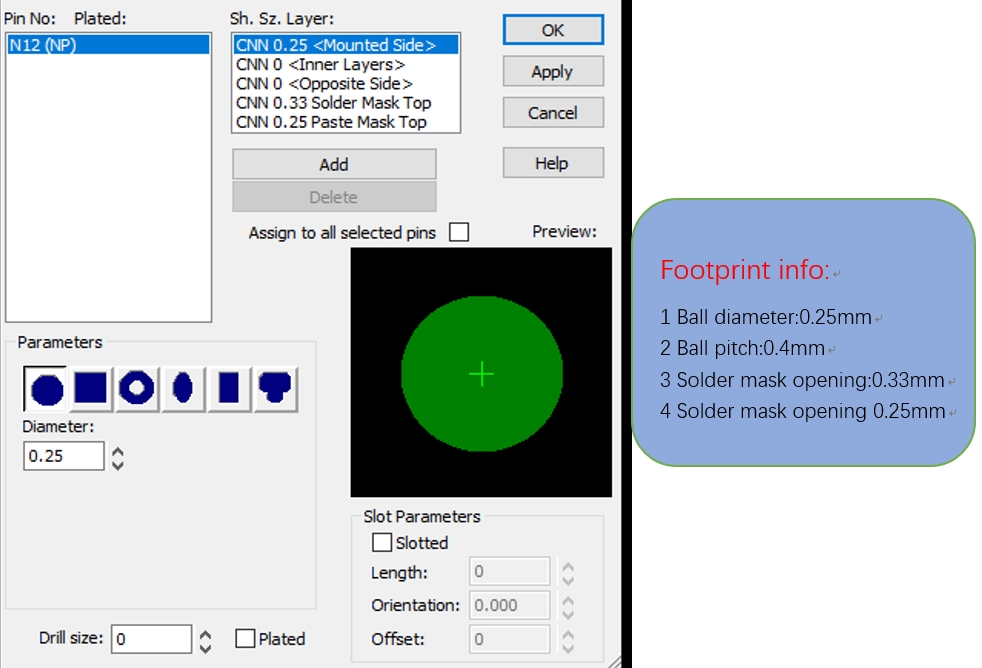   

<div align="center"> Figure 3.3 PCB Pad Design Reference </div>  <br> <br> <br>  


#### Package BALLMAP

 
Package BALLMAP information is shown in Figure 3.4.

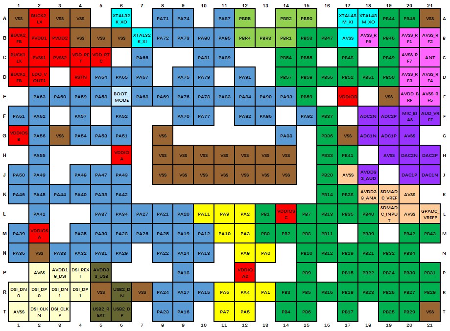  

<div align="center"> Figure 3.4 Package BALLMAP Information </div>  <br> <br> <br> 


#### Package Substrate


Package Substrate BALL Information is shown in Figure 3.5.
​       
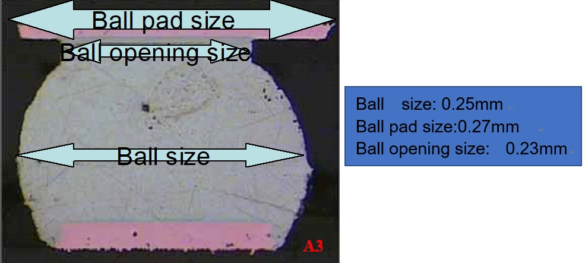  

<div align="center"> Figure 3.5 Package Substrate BALL Information </div>  <br> <br> <br>


### PCB Stackup Design

The SF32LB58x series chip layout supports single-sided and double-sided placement. The PCB supports only HDI boards and does not support PTH boards. 6HDI-2 is recommended. The recommended reference stack-up structure is shown in Figure 3.6.

 
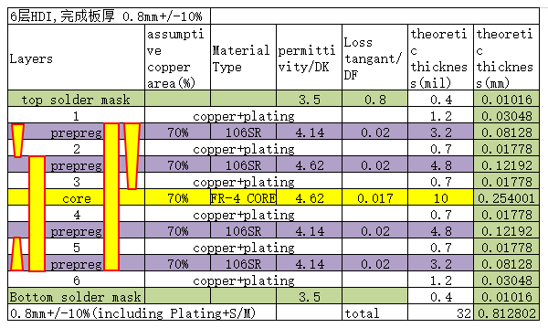  

<div align="center"> Figure 3.6 Reference Stack-up Structure Diagram </div>  <br> <br> <br>


### General PCB Design Rules

The general PCB design rules are shown in Figure 3.7, with units in mm.

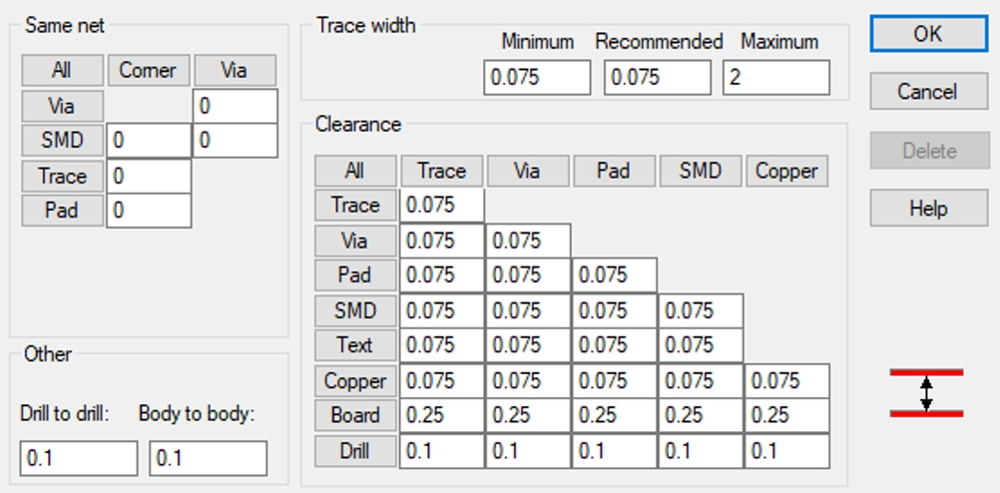  

<div align="center"> Figure 3.7 General Design Rules </div>  <br> <br> <br> 


#### Blind Via Design

The PCB blind via design is shown in Figures 3.8 and 3.9, with units in mm.

 
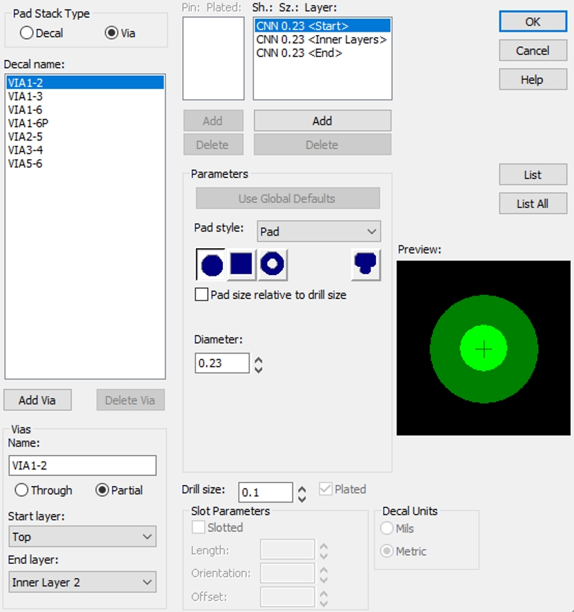  

<div align="center"> Figure 3.8 1-2 Blind Via Design </div>  <br> <br> <br> 


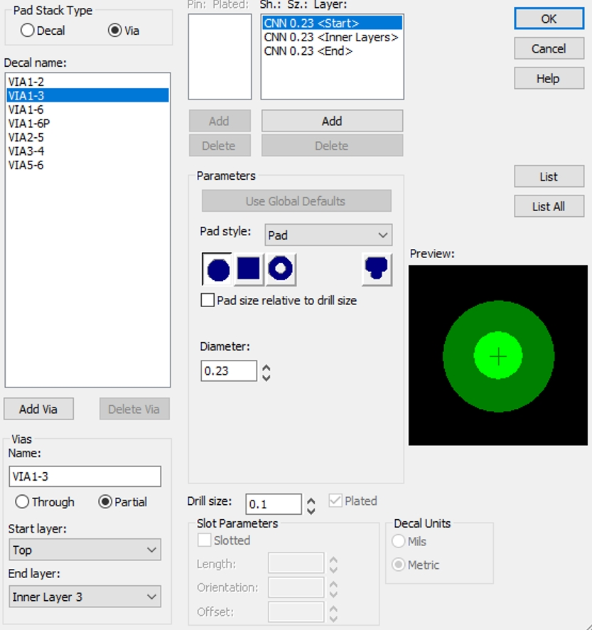  

<div align="center"> Figure 3.9 1-3 Blind Via Design </div>  <br> <br> <br>    


#### Buried Via Design

The PCB buried via design is shown in Figure 3.10, with units in mm.

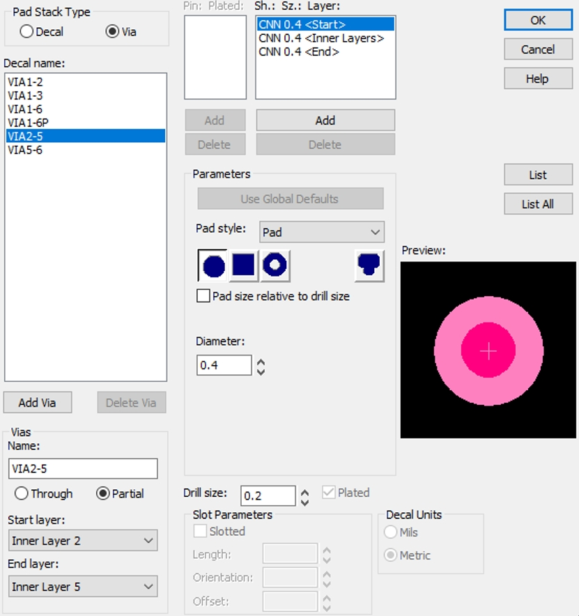  

<div align="center"> Figure 3.10 Buried Via Design </div>  <br> <br> <br> 


### SF32LB58x Chip Trace Fanout

The balls in the first two rows and columns of the BGA are fanned out on the surface layer, while the other balls are fanned out to inner layers through vias, as shown in Figures 3.11 and 3.12.


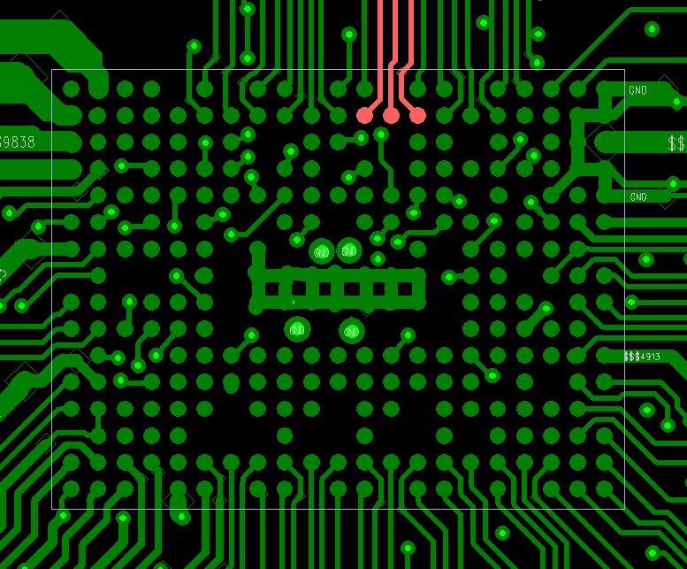  

<div align="center"> Figure 3.11 Surface-Layer Fanout Reference Diagram </div>  <br> <br> <br> 


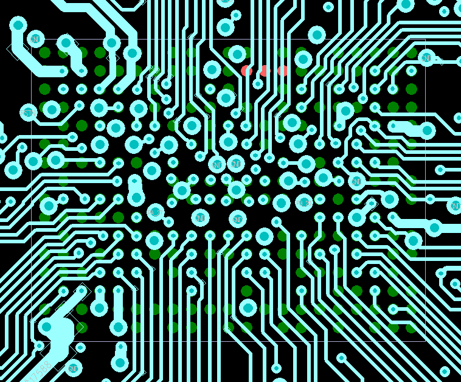  

<div align="center"> Figure 3.12 Inner-Layer Fanout Reference Diagram </div>  <br> <br> <br> 


### Clock Interface Routing

The crystal must be placed inside the shield can, with a clearance of more than 1 mm from the PCB board outline. Keep it as far away as possible from components that generate significant heat, such as PA, Charge, and PMU circuit components; a distance of more than 5 mm is preferred to avoid affecting the crystal frequency deviation. The keep-out clearance for the crystal circuit must be greater than 0.25 mm to avoid other metal and components, as shown in Figure 3.13.


  

<div align="center"> Figure 3.13 Crystal Layout Diagram </div>  <br> <br> <br> 


The 48 MHz crystal traces are recommended to be routed on the surface layer, with the trace length controlled within 3–10 mm and a trace width of 0.075 mm. Three-dimensional ground shielding must be applied, and the traces must be kept away from VBAT, DC/DC, and high-speed signal lines. Keep-out treatment must be applied to the surface layer and adjacent layers below the 48 MHz crystal area, and other traces are prohibited from passing through this area, as shown in Figures 3.14, 3.15, and 3.16.


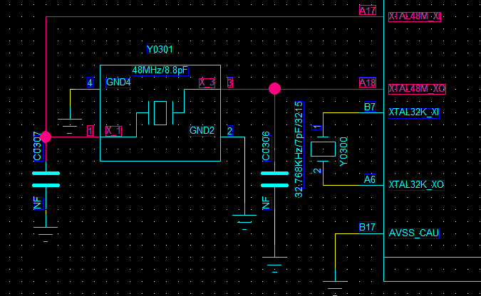  

<div align="center"> Figure 3.14 48 MHz Crystal Schematic </div>  <br> <br> <br> 


  

<div align="center"> Figure 3.15 48 MHz Crystal Routing Model </div>  <br> <br> <br> 


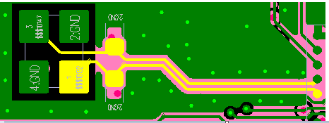  

<div align="center"> Figure 3.16 48 MHz Crystal Routing Reference </div>  <br> <br> <br> 


The 32.768 kHz crystal traces are recommended to be routed on the surface layer, with the trace length controlled to ≤10 mm and a trace width of 0.075 mm. The spacing between the parallel 32K_XI/32_XO traces must be ≥0.15 mm. Three-dimensional ground shielding must be applied. Keep-out treatment must be applied to the surface layer and adjacent layers below the crystal area, and other traces are prohibited from passing through this area, as shown in Figures 3.17, 3.18, and 3.19.


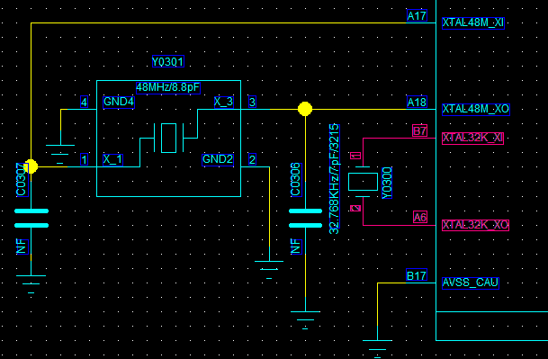  

<div align="center"> Figure 3.17 32.768 kHz Crystal Schematic </div>  <br> <br> <br> 


  

<div align="center"> Figure 3.18 32.768 kHz Crystal Routing Model </div>  <br> <br> <br> 


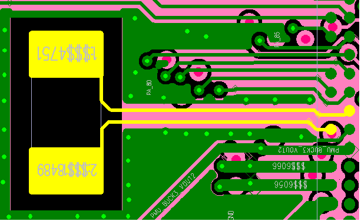  

<div align="center"> Figure 3.19 32.768 kHz Crystal Routing Reference </div>  <br> <br> <br> 


### RF Interface Routing

The RF matching circuit should be placed as close as possible to the chip side, not close to the antenna side. For the AVDD_BRF RF power supply, its filter capacitor should be placed as close as possible to the chip pin. The capacitor ground pin should be connected directly to the main ground through a via. The schematic and PCB layout of the π-type network for the RF signal are shown in Figures 3.20 and 3.21, respectively.


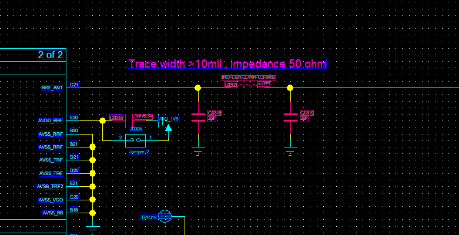  

<div align="center"> Figure 3.20 π-Type Network and Power Supply Circuit Schematic </div>  <br> <br> <br> 


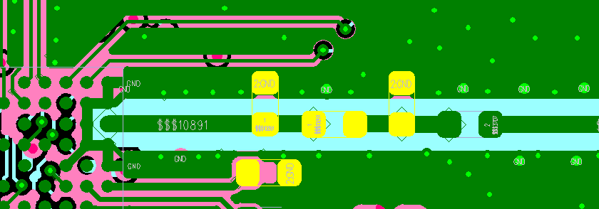  

<div align="center"> Figure 3.21 π-Type Network and Power Supply PCB Layout </div>  <br> <br> <br> 


The RF trace is recommended to be routed on the surface layer to avoid vias and layer transitions that could affect RF performance. The trace width should preferably be greater than 10 mil. 3D ground shielding is required. Avoid acute-angle and right-angle routing. Add multiple shielding ground vias on both sides of the RF trace. The RF trace requires 50-ohm impedance control, as shown in Figures 3.22 and 3.23.


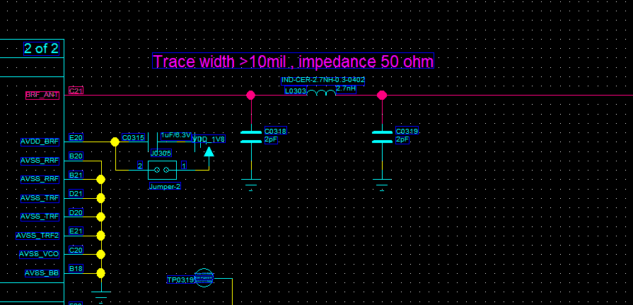  

<div align="center"> Figure 3.22 RF Signal Circuit Schematic </div>  <br> <br> <br> 


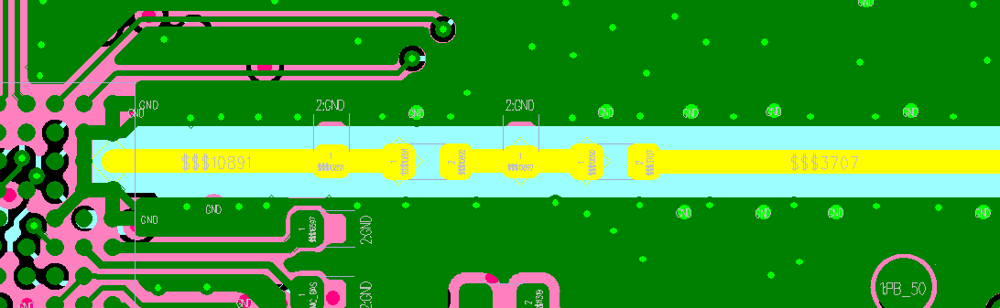  

<div align="center"> Figure 3.23 RF Signal PCB Routing </div>  <br> <br> <br> 


For RF circuit routing, DC-DC, VBAT, and high-speed digital signals are prohibited from passing through the RF area, such as crystal oscillators, high-frequency Clock, and digital interface signals (I2C,SPI,SDIO,I2S, UART, etc.).
AVSS_RRF, AVSS_TRF, AVSS_TRF2, AVSS_VCO, and AVSS_BB are the RF circuit ground pins. They must be well grounded. It is recommended to place blind vias directly on their pads and connect them to the main ground, as shown in Figure 3.24a and Figure 3.24b.


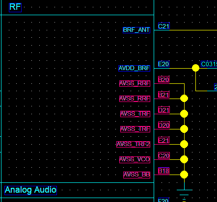

<div align="center"> Figure 3.24a RF Circuit Ground Signal Schematic </div>  <br> <br> <br>


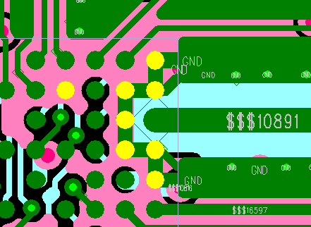

<div align="center"> Figure 3.24b PCB Diagram of RF Circuit Ground Signals </div>  <br> <br> <br>


### Audio Interface Routing

AVDD33_AUD is the pin that supplies power to the audio interface. Its filter capacitor should be placed close to the corresponding pin, and the ground terminal of the filter capacitor should be well connected to the main ground. MIC_BIAS is the power supply circuit for the microphone of the audio interface. Its corresponding filter capacitor should be placed close to the corresponding pin, and the ground terminal of the filter capacitor should be well connected to the main ground. The AUD_VREF filter capacitor should be placed close to the pin, as shown in Figures 3.25a and 3.25b.


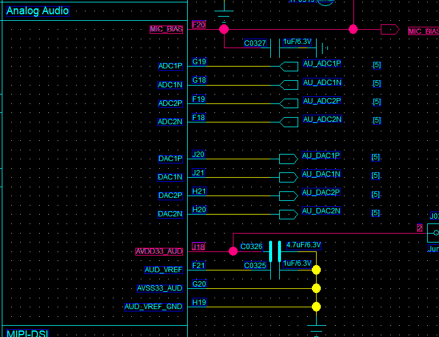

<div align="center"> Figure 3.25a Audio Circuit Power Supply Schematic </div>  <br> <br> <br>


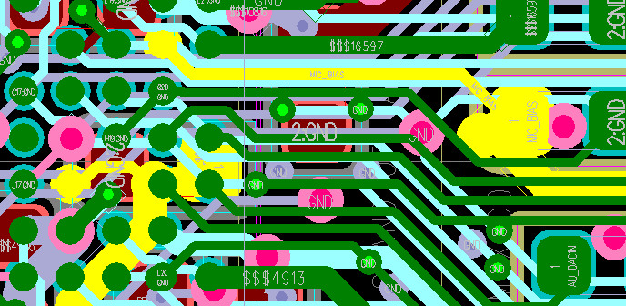

<div align="center"> Figure 3.25b PCB Design of the Audio Circuit Power Supply Filter Circuit </div>  <br> <br> <br>


AU_ADC1P/AU_ADC1N and AU_ADC2P/AU_ADC2N are two analog signal inputs. The corresponding circuit components should be placed as close as possible to the corresponding pins. The P/N pair of each channel should be routed as differential traces, with trace lengths kept as short as possible. The differential pair traces should use 3D ground shielding. Strong interference signals from other interfaces should be kept away from these traces, as shown in Figures 3.26a and 3.26b.


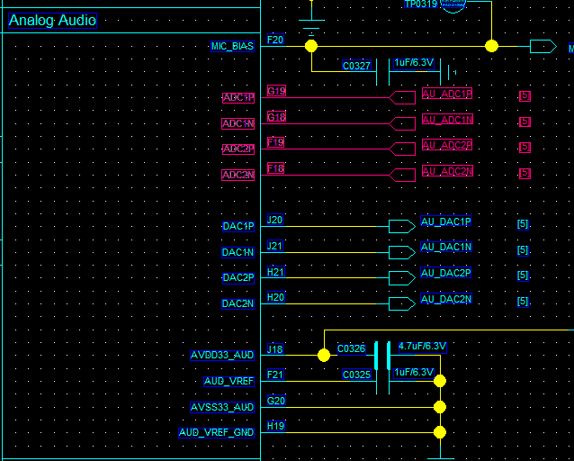

<div align="center"> Figure 3.26a Analog Audio Input Schematic </div>  <br> <br> <br>


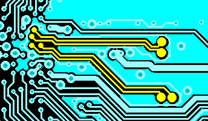

<div align="center"> Figure 3.26b Analog Audio Input PCB Design </div>  <br> <br> <br>


AU_DAC1P/AU_DAC1N and AU_DAC2P/AU_DAC2N are two analog signal outputs. The corresponding circuit components should be placed as close as possible to the corresponding pins. The P/N pair of each channel should be routed as differential traces, with trace lengths kept as short as possible and less than 2 mm, trace parasitic capacitance less than 10 pF, and differential trace width of 0.075 mm. The differential pair traces should use 3D ground shielding. Strong interference signals from other interfaces should be kept away from these traces, as shown in Figures 3.27a and 3.27b.


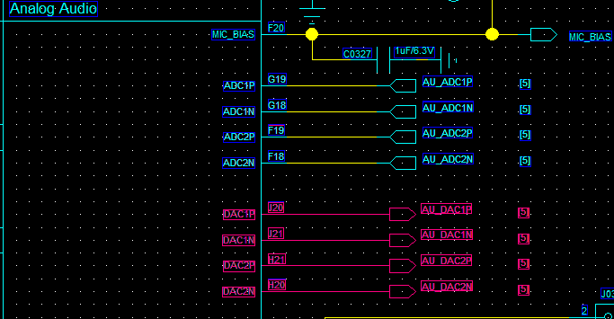

<div align="center"> Figure 3.27a Analog Audio Output Schematic </div>  <br> <br> <br>


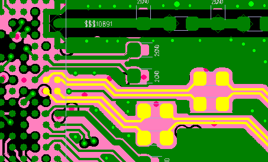

<div align="center"> Figure 3.27b Analog Audio Output PCB Design </div>  <br> <br> <br>


### USB Interface Routing

AVDD33_USB is the power supply pin for the USB interface. Its filter capacitor should be placed close to the pin, and the calibration resistor connected to USB2_REXT should be placed close to the pin. The USB traces must first pass through the ESD device pins and then go to the chip side. Ensure that the ground pin of the ESD device is well connected to the main ground. USB DP/DN should be routed as differential traces, controlled to a 90-ohm differential impedance, and provided with 3D ground shielding, as shown in Figures 3.28a and 3.28b. Figure 2.29a is a component placement reference diagram for USB signals, and Figure 3.29b is the PCB trace model.

   
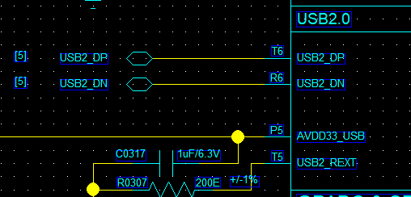

<div align="center"> Figure 3.28a USB Signal Schematic </div>  <br> <br> <br>


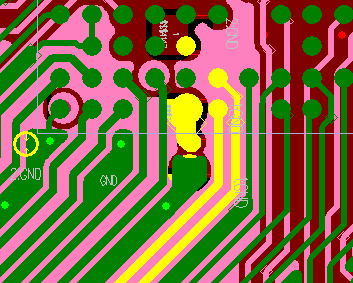

<div align="center"> Figure 3.28b USB Signal PCB Design </div>  <br> <br> <br>


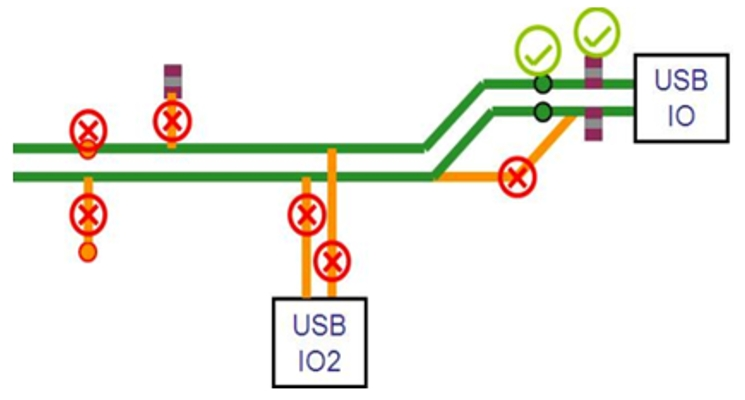

<div align="center"> Figure 3.29a USB Signal Component Placement Reference </div>  <br> <br> <br>


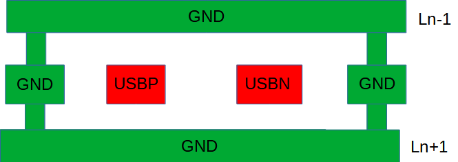

<div align="center"> Figure 3.29b USB Signal Trace Model </div>  <br> <br> <br>


### SDIO Interface Routing

The SF32LB58X provides two SDIO interfaces: SDIO1 and SDIO2. All SDIO signal traces should be routed together and should not be separated. The total trace length should be ≤50 mm, and the intra-group length mismatch should be controlled to ≤6 mm. The clock signal of the SDIO interface must use three-dimensional ground shielding, and the DATA and CM signals also require ground shielding, as shown in Figures 3.30a and 3.30b.


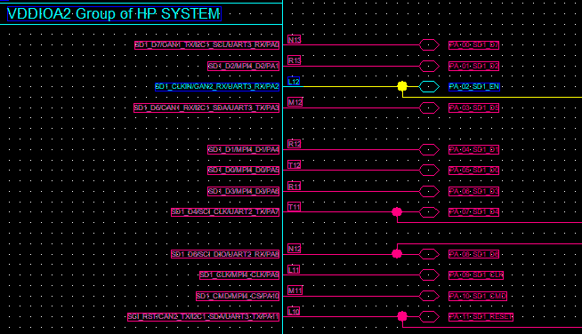

<div align="center"> Figure 3.30a SDIO1 Interface Circuit Diagram </div>  <br> <br> <br>


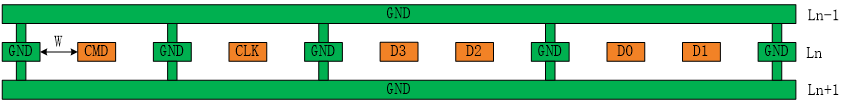

<div align="center"> Figure 3.30b SDIO1 PCB Trace Model </div>  <br> <br> <br>


### DSI Interface Routing

AVDD18_DSI is the power supply pin for the DSI interface. Its filter capacitor should be placed close to the pin, and the DSI_REXT calibration resistor should also be placed close to the pin. DSI interface traces should be routed as differential traces, with 100-ohm differential impedance control. The clock and data traces must be length-matched, with intra-pair length mismatch controlled to ≤0.5 mm and inter-pair length mismatch controlled to ≤2 mm. Each differential pair must use three-dimensional ground shielding, as shown in Figures 3.31a and 3.31b.


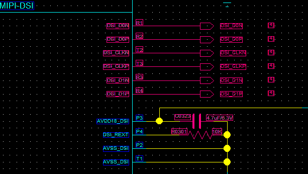

<div align="center"> Figure 3.31a DSI Signal Circuit Diagram </div>  <br> <br> <br>


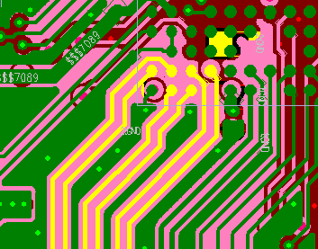

<div align="center"> Figure 3.31b DSI Signal PCB Routing </div>  <br> <br> <br>


### DC-DC Circuit Routing

The power inductor and filter capacitors of the DC-DC circuit must be placed close to the chip pins. The BUCK_LX trace should be as short and wide as possible to ensure low loop inductance for the entire DC-DC circuit. The ground terminals of all DC-DC output filter capacitors should be connected to the main ground plane with multiple vias. The feedback trace for the BUCK_FB pin must not be too narrow and must be greater than 0.25 mm. Copper pour is prohibited on the top layer in the power inductor area, and the adjacent layer must be a complete reference ground. Avoid routing other traces through the inductor area, as shown in Figures 3.32a and 3.32b.

   
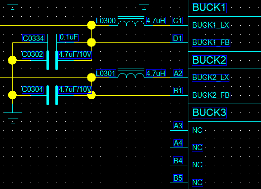

<div align="center"> Figure 3.32a Schematic of Key DC-DC Components </div>  <br> <br> <br>


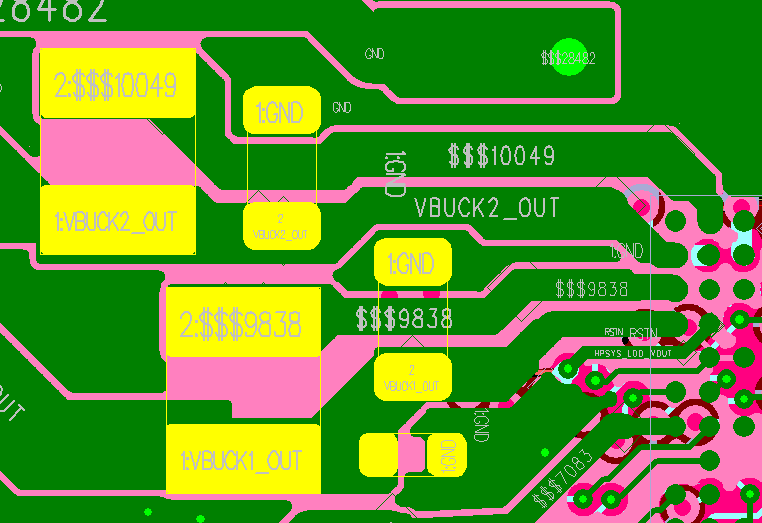

<div align="center"> Figure 3.32b PCB Layout of Key DC-DC Components </div>  <br> <br> <br>


### Power Supply Routing

PVDD1 and PVDD2 are the power input pins for the chip's built-in PMU module. The corresponding capacitors must be placed close to the pins, and the traces should be as wide as possible and no less than 0.5 mm. PVSS1 and PVSS2 are the ground pins for the PMU module and must be connected to the main ground through vias. Avoid leaving them floating, as this would affect the overall PMU performance, as shown in Figures 3.33a and 3.33b.

   
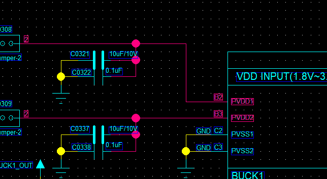

<div align="center"> Figure 3.33a DC-DC Circuit Diagram </div>  <br> <br> <br>


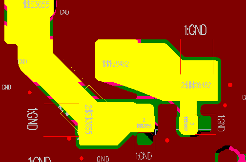

<div align="center"> Figure 3.33b DC-DC PCB Routing </div>  <br> <br> <br>


### LDO and I/O power input routing

The filter capacitors for all LDO outputs and IO power input pins should be placed close to the corresponding pins. Their trace width must meet the input current requirements, and the traces should be as short and wide as possible to reduce power supply ripple and improve system stability, as shown in Figure 3.14.


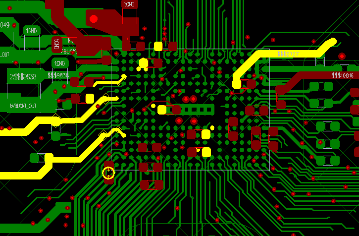

<div align="center"> Figure 3.34 LDO and I/O Input Power Routing Diagram </div>  <br> <br> <br>


### Other Interface Routing

For pins configured as GPADC signal pins, three-dimensional ground shielding is required, and they must be kept away from other interfering signals, such as battery level circuits and temperature detection circuits, as shown in Figure 3.35.


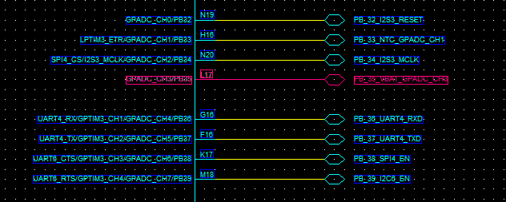

<div align="center"> Figure 3.35 GPADC Circuit Diagram </div>  <br> <br> <br>


For signal networks of pins configured as clock input/output pins, three-dimensional ground shielding is required, and they must be kept away from other interfering signals, such as the 32K output, as shown in Figure 3.36.


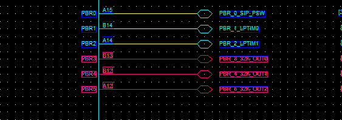

<div align="center"> Figure 3.36 32K Clock Output Circuit Diagram </div>  <br> <br> <br>


#### SF32LB58X Chip Ground Routing

The ground networks in the center area of the SF32LB58X chip must all be connected with traces to ensure a sufficient ground plane and must be connected to the main ground plane through blind and buried vias, as shown in Figures 3.37a, 3.37b, 3.37c, and 3.37d.

   
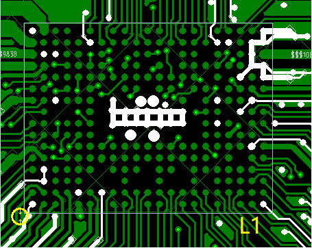

<div align="center"> Figure 3.37a Ground Signals on the TOP Layer Under the Chip </div>  <br> <br> <br>

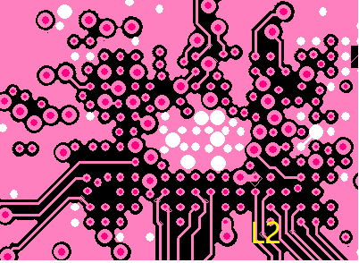

<div align="center"> Figure 3.37b Ground Signals on the Second Layer Under the Chip </div>  <br> <br> <br>

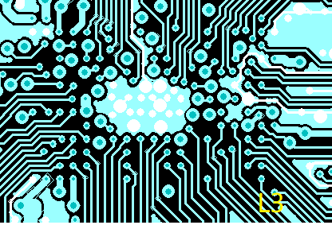

<div align="center"> Figure 3.37c Ground Signals on the Third Layer Under the Chip </div>  <br> <br> <br>


<div align="center"> Figure 3.37d Ground Signals on the Fourth Layer Under the Chip </div>  <br> <br> <br>


#### EMI&ESD routing

Avoid long-distance routing on the top layer outside the shielding cover. In particular, interfering signals such as clocks and power supplies should be routed on inner layers whenever possible and are prohibited from being routed on the top layer. ESD protection devices must be placed close to the corresponding connector pins. Signal traces should first pass through the pins of the ESD protection device to avoid signal branching that does not pass through the ESD protection pins. The ground pins of ESD devices must be connected to the main ground through vias. Ensure that the ground pad traces are short and wide to reduce impedance and improve the performance of the ESD devices.


#### Other

The test point for the USB charging line must be placed before the TVS diode. The TVS diode for the battery connector should be placed before the platform, and the routing must ensure that the trace passes through the TVS diode first and then goes to the chip end, as shown in Figure 3.38.

 
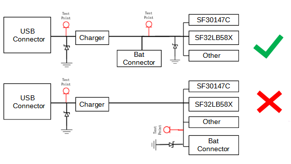

<div align="center"> Figure 3.38 Power Supply TVS Layout Reference </div>  <br> <br> <br>


Avoid routing a long trace from the ground pin of the TVS diode before connecting it to ground, as shown in Figure 3.39.


<div align="center"> Figure 3.39 TVS Routing Reference </div>  <br> <br> <br>


To prevent the solder mask from covering the pads and affecting soldering reliability, vias on BGA pads must be placed in the center area of the BGA balls. Avoid offset drilling, as shown in Figure 3.40.


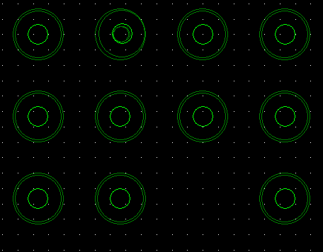

<div align="center"> Figure 3.40 BGA Via Placement Diagram </div>  <br> <br> <br>


To improve manufacturability and yield, optimize the PCB design with reference to Figures 3.41a and 3.41b.

 
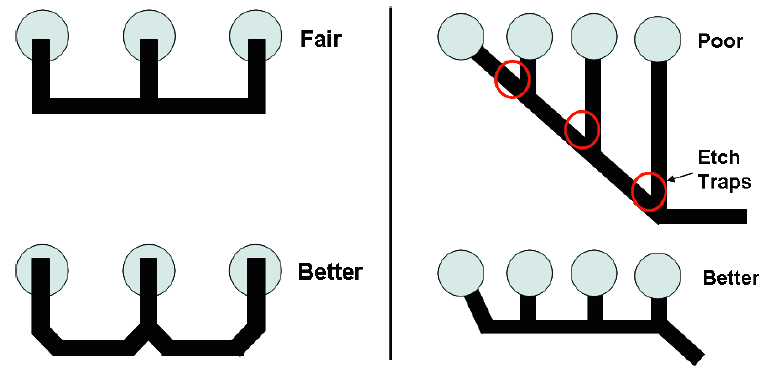

<div align="center"> Figure 3.41a BGA Ball Routing Reference Diagram 1 </div>  <br> <br> <br>


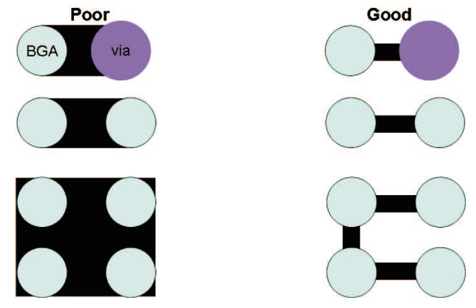

<div align="center"> Figure 3.41b BGA Ball Routing Reference Diagram 2 </div>  <br> <br> <br>


## Revision History

| Version   | Date   | Release Notes  |
| ----- | ------ | --------- |
| 0.0.1 | 1/2025 | Draft version  |
