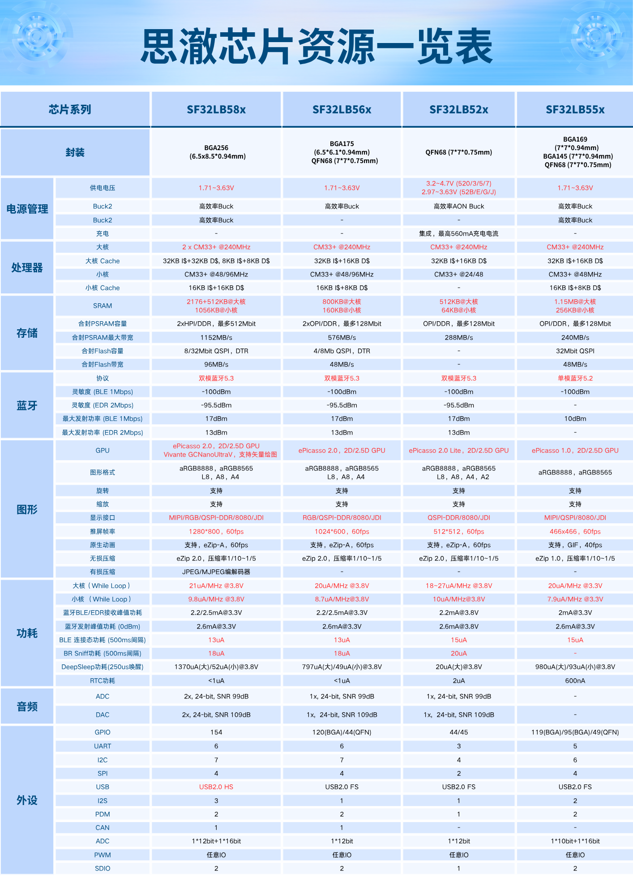

# SiFli Chip Model Guide

## Chip numbering rule: SF32LB5xyZxYx6

### Prefix: *SF32LB5xy*

- SF: Chip series
    - SiFli, company logo
    - There is also an SSxxxx series, which is not included here for now
- 32: Chip series
    - 32: 32-bit MCU series
    - 30: PMU series; subsequent models in this series are all digits, such as SF30147, and do not follow the numbering rules below
- LB: Series attribute
    - LB：Low-power Bluetooth MCU
    - VB: Bluetooth MCU using a RISC-V processor
- 5: Processor series
    - 5: Based on a 32-bit Arm Cortex-M33 Star-MC1 processor, or a RISC-V processor with similar computing performance
    - 0: Based on a 32-bit Arm Cortex-M0+ processor
- x: High-, mid-, and low-end positioning
    - 8: Flagship product in the 5x series
    - 6/5: Mid-range product in the 5x series
    - 2: Cost-effective product in the 5x series
- y: product positioning within the series
    - Generally determined based on the capacity of the internally packaged PSRAM; the specific number depends on the specific chip

### Suffix: *ZxYx6*
- Z: package
    - U: QFN package
    - V: BGA package
- xYx: capacity code for internally packaged NOR Flash or PSRAM; the number of characters and combinations depend on the specific package
    - x is a digit: internally packaged NOR Flash capacity
        - 1：2Mb
        - 2：4Mb
        - 3：8Mb
        - 4：16Mb
        - 5：32Mb
        - 6：64Mb
    - X is a letter: internally packaged PSRAM capacity
        - A：16Mb QPI-PSRAM
        - B：32Mb OPI-PSRAM
        - C：64Mb OPI-PSRAM
        - D：128Mb OPI/HPI-PSRAM
        - E：256Mb HPI-PSRAM
- 6: temperature range
    - 5：-20~70C
    - 6：-40~85C

 ```{important}
  Note that the company's official name is SiFli, with S and F uppercase and the rest lowercase, meaning Silicon Fli (Fly); Sifli, sifli, and SiFLi are all incorrect spellings.
 ```
```{note}
**Abbreviated Terms Used Below**
- NOR:  &ensp; QSPI NOR Flash
- QPI-P: &ensp; x4-PSRAM
- OPI-P: &ensp; x8-PSRAM
- HPI-P: &ensp; x16-PSRAM
```

## List of Key SF32LB52x/X Series Models
- SF32LB52x/X：
    - x is a digit, indicating the ***lithium-ion battery powered*** series, such as SF32LB520/3/5/7, which are pin-to-pin compatible with each other
    - X is certain letters, indicating the ***standard 3.3 V*** power supply series, including SF32LB52B/E/G/J, which are pin-to-pin compatible with each other
    - X is certain letters, indicating the ***special 1.8 V*** power supply series, including SF32LB52D, for ultra-low-power scenarios
    - The two series, one where x is a digit and the other where X is a letter, are independent of each other and are ***not*** pin-to-pin compatible. Although the 3.3 V models and 1.8 V models can be pin-to-pin aligned, their voltages are incompatible, so they are also incompatible. The correspondence in terms of co-packaged content is:
        - Li-ion &ensp;3.3 V &ensp;1.8 V
        - 520 -- 52B
        - 523 -- 52E&nbsp;-- 52D
        - 525 -- 52G
        - 527 -- 52J
- The SF32LB52x series supports the following display interfaces
    - SPI/DSPI/QSPI, including the SPI interface for e-paper displays
    - 8080-8bit

Part #       | 520U36      | 523UB6      | 525UC6      | 527UD6      | 52BU36      | 52BU56      | 52DUB6      | 52EUB6      | 52GUC6      | 52JUD6 
:-|-:|-:|-:|-:|-:|-:|-:|-:|-:|-:
Package      | QFN68L      | QFN68L      | QFN68L      | QFN68L      | QFN68L      | QFN68L      | QFN68L      | QFN68L      | QFN68L      | QFN68L 
Sizes        | 7x7x0.85 mm | 7x7x0.85 mm | 7x7x0.85 mm | 7x7x0.85 mm | 7x7x0.85 mm | 7x7x0.85 mm | 7x7x0.85 mm | 7x7x0.85 mm | 7x7x0.85 mm | 7x7x0.85 mm 
Pitch        | 0.35mm      | 0.35mm      | 0.35mm      | 0.35mm      | 0.35mm      | 0.35mm      | 0.35mm      | 0.35mm      | 0.35mm      | 0.35mm 
\# of GPIOs  | 44          | 44          | 44          | 44          | 45          | 45          | 45          | 45          |45           |45
MPI1  SiP    | 1MB NOR     | 4MB OPI-P   | 8MB OPI-P   | 16MB OPI-P  | 1MB NOR     | 4MB NOR     | 4MB OPI-P   | 4MB OPI-P   | 8MB OPI-P   |16MB OPI-P
Power Supply | 3.2~4.7V    | 3.2~4.7V    | 3.2~4.7V    | 3.2~4.7V    | **3.3V**    | **3.3V**    | **1.8V**    | **3.3V**    |**3.3V**     |**3.3V**
I/O Voltage  | 3.3V        | 3.3V        | 3.3V        | 3.3V        | 3.3V/1.8V   | 3.3V/1.8V   | 3.3V/1.8V   | 3.3V/1.8V   |3.3V/1.8V    |3.3V/1.8V
Temperature  | -40~85C     | -40~85C     | -40~85C     | -40~85C     | -40~85C     | -40~85C     | -40~85C     | -40~85C     |-40~85C      |-40~85C


## List of Key SF32LB56x Series Models

- The SF32LB56x series supports the following display interfaces
    - DPI/RGB888, RGB565 (566VCB36 and 567VND36)
    - SPI/DSPI/QSPI, including the SPI interface for e-paper displays
    - 8080-8bit (566VCB36 and 567VND36QFN68L only; not fully pinned out on QFN models)

Part #            | 560UNN26    | 561UBN26    | 563UCN26    | 56WUND26    | 566VCB36          | 567VND36
:-|-:|-:|-:|-:|-:|-:
Package           | QFN68L      | QFN68L      | QFN68L      | QFN68L      | BGA175            | BGA175
Sizes             | 7x7x0.75 mm | 7x7x0.75 mm | 7x7x0.75 mm | 7x7x0.75 mm | 6.1x6.5x0.94 mm   | 6.1x6.5x0.94 mm 
Pitch             | 0.35mm      | 0.35mm      | 0.35mm      | 0.35mm      | 0.4mm             | 0.4mm 
HCPU GPIOs        | 24          | 24          | 24          | 24          | 79                | 79 
LCPU GPIOs        | 20          | 20          | 20          | 20          | 41                | 41 
MPI5 Boot SiP     | 512KB NOR   | 512KB NOR   | 512KB NOR   | 512KB NOR   | 1MB NOR           | 1MB NOR 
MPI1 SiP          | n/a         | 4MB OPI-P   | 8MB OPI-P   | n/a         | 8MB OPI-P         | n/a 
MPI2 SiP          | n/a         | n/a         | n/a         | 16MB OPI-P  | 4MB OPI-P         | 16MB OPI-P 
Display Interface | QSPI        | QSPI        | QSPI        | QSPI        | DPI/QSPI/8080/JDI | DPI/QSPI/8080/JDI 
Power Supply      | 1.71~3.63V  | 1.71~3.63V  | 1.71~3.63V  | 1.71~3.63V  | 1.71~3.63V        | 1.71~3.63V
Temperature       | -40~85C     | -40~85C     | -40~85C     | -40~85C     | -40~85C           | -40~85C 

## List of Key SF32LB58x Series Models

- All SF32LB58x series models support the following display interfaces
    - MIPI-DSI, CMD mode or Video mode
    - DPI/RGB888，RGB565
    - SPI/DSPI/QSPI, including the SPI interface for e-paper displays
    - 8080-8bit
    - JDI MIP display interface
    - Supports dual displays with different content via MIPI-DSI + SPI/DSPI/QSPI

Part #        | 580VNN36        | 581VCN36        | 583VCC36        | 585V5E56        | 586VDD36        | 587VEE56
:-|-:|-:|-:|-:|-:|-:
Package       | BGA256          | BGA256          | BGA256          | BGA256          | BGA256          | BGA256
Sizes         | 6.5x8.5x0.94 mm | 6.5x8.5x0.94 mm | 6.5x8.5x0.94 mm | 6.5x8.5x0.94 mm | 6.5x8.5x0.94 mm | 6.5x8.5x0.94 mm 
Pitch         | 0.4mm           | 0.4mm           | 0.4mm           | 0.4mm           | 0.4mm           | 0.4mm 
HCPU GPIOs    | 94              | 94              | 94              | 94              | 94              | 94 
LCPU GPIOs    | 66              | 66              | 66              | 66              | 66              | 66 
MPI5 Boot SiP | 1MB NOR         | 1MB NOR         | 1MB NOR         | 4MB NOR         | 1MB NOR         | 4MB NOR 
MPI1 SiP      | n/a             | 8MB OPI-P       | 8MB OPI-P       | 4MB NOR         | 16MB HPI-P      | 32MB HPI-P 
MPI2 SiP      | n/a             | n/a             | 8MB OPI-P       | 32MB HPI-P      | 16MB HPI-P      | 32MB HPI-P 
Power Supply  | 1.71~3.63V      | 1.71~3.63V      | 1.71~3.63V      | 1.71~3.63V      | 1.71~3.63V      | 1.71~3.63V
Temperature   | -40~85C         | -40~85C         | -40~85C         | -40~85C         | -40~85C         | -40~85C 

## List of Key SF32LB55x Models

- Because the SF32LB55x series was defined relatively early, its suffix numbers do not fully follow the above rules. Only 557V3DA6 uses the above suffix naming rules.
- Models in the same package are pin-to-pin compatible.
- Depending on the package, the SF32LB55x series supports all or some of the following display interfaces.
    - MIPI-DSI，CMD mode
    - DPI/RGB888，RGB565
    - SPI/DSPI/QSPI, including the SPI interface for e-paper displays
    - 8080-8bit
    - JDI/Sharp MIP display interface (557VD3A6)
    - Supports MIPI-DSI + SPI/DSPI dual displays with different content (557VD3A6)

Part #            | SS6600A8    | 551U4O5     | 555V4O6        | 555V436        | 557VD3A6
-|-:|-:|-:|-:|-:
Package           | QFN68L      | QFN68L      | BGA145         | BGA145         | BGA169
Sizes             | 7x7x0.75 mm | 7x7x0.75 mm | 7x7x0.94 mm    | 7x7x0.94 mm    | 7x7x0.94 mm 
Pitch             | 0.35mm      | 0.35mm      | 0.5mm          | 0.5mm          | 0.5mm 
HCPU GPIOs        | 28          | 28          | 55             | 55             | 71 
LCPU GPIOs        | 21          | 21          | 40             | 40             | 42 
QSPI1-L Boot SiP  | 4MB NOR     | 4MB NOR     | 4MB NOR        | 4MB NOR        | 1MB NOR 
QSPI1-H SiP       | 4MB NOR     | n/a         | n/a            | n/a            | n/a 
PSRAM SiP         | n/a         | 4MB OPI-P   | 4MB OPI-P      | 8MB OPI-P      | 16MB OPI-P 
QSPI4 SiP         | n/a         | n/a         | n/a            | n/a            | 2MB QPI-P 
Display Interface | QSPI/8080   | QSPI/8080   | MIPI/QSPI/8080 | MIPI/QSPI/8080 | MIPI/QSPI/8080/JDI
Power Supply      | 2.97V~3.63V | 1.71~3.63V  | 1.71~3.63V     | 1.71~3.63V     | 1.71~3.63V
Temperature       | -20~70C     | -20~70C     | -40~85C        | -40~85C        | -40~85C 

```{note}
- SS6600A8 integrates two 4 MB QSPI-NOR devices and is configured to operate as a single 8 MB OSPI-NOR device.
```

## Chip Model Comparison Table



## Sample Availability

Retail samples and small quantities can be purchased directly on [Taobao](https://sifli.taobao.com/). Volume customers can email sales@sifli.com or contact customer service on Taobao to obtain sales contact information.

Participants in open source projects can apply for free samples. You can join QQ group 674699679 for discussion.
