# Flash Chipid and Type Configuration Guide

## 1 Quickly Generate a Flash Driver

### 1.1 Video Tutorials

#### 1.1.1 [Quick Start](https://www.bilibili.com/video/BV1i3USY8E3S/):

https://www.bilibili.com/video/BV1i3USY8E3S/

#### 1.1.2  [Full NAND Hands-on Procedure](https://www.bilibili.com/video/BV1v3USYbEYy/):

https://www.bilibili.com/video/BV1v3USYbEYy/

#### 1.1.3 Video Tutorial Netdisk Address

Netdisk shared file: [sifli_flash_driver_generate](https://pan.baidu.com/s/11dVuuK5giQqTr1hQqZ4OVQ?pwd=1234)

Link: https://pan.baidu.com/s/11dVuuK5giQqTr1hQqZ4OVQ?pwd=1234 Extraction code: 1234

### 1.2 UartburnEx.exe Tool

#### 1.2.1 Modifying the Driver Bin or elf

Download the latest [Impeller.exe](https://downloads.sifli.com//tools/Impeller_COMMON.7z) tool. It includes the Flash driver generation tool UartburnEx.exe<br>
- For the programming driver mapping in the Impeller tool, see
[3.4 Flash Download Driver Mapping](../../faq/peripherals/flash.md/#34Flash下载驱动对应关系)

Fill in the Flash chipid and Flash configuration parameters in the UartburnEx.exe interface shown below. If an IO pin needs to be added during download, or Flash must be powered through the SF30147 power chip, it can also be added. If it is not needed or not supported, no addition is required.

- Use UartburnEx.exe to modify the bin file and elf used for program download. If the programmed driver bin file is not configured and modified, the compiled program cannot be programmed into flash.

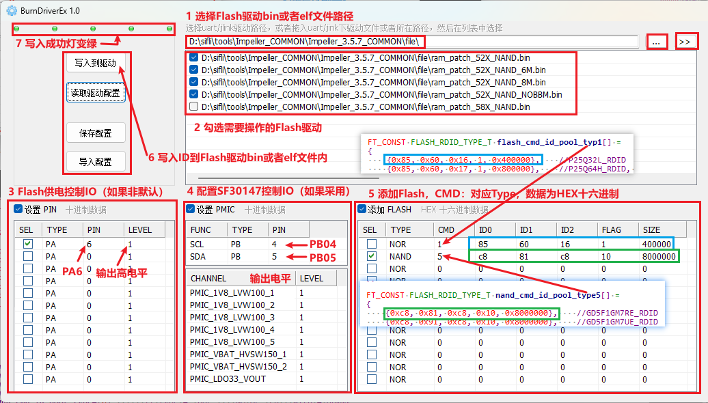<br>

#### 1.2.2 Download with the Newly Generated Driver

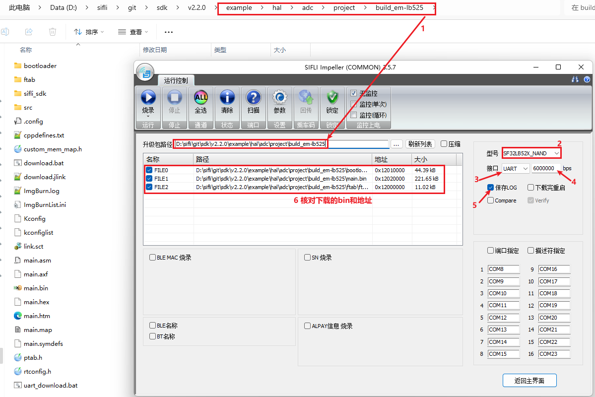<br>

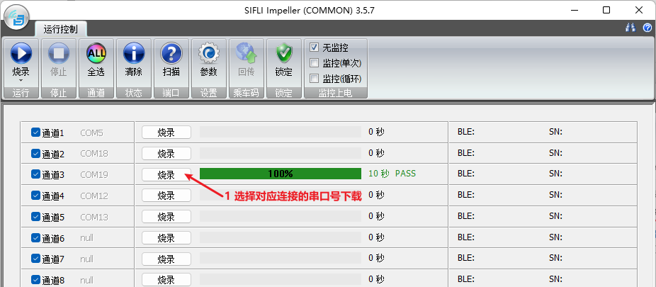<br>

### 1.3 Add the SDK Code Flash Driver to the Corresponding TYPE

The generated bin or elf only provides Flash download support. If the application code needs to read from or write to this Flash, add the corresponding Chipid in the code, then rebuild the Bootloader and user code before the code can run.

##### 1.3.1 How to Add NOR Flash

In flash_table.c, add the corresponding Chipid under the corresponding Type.

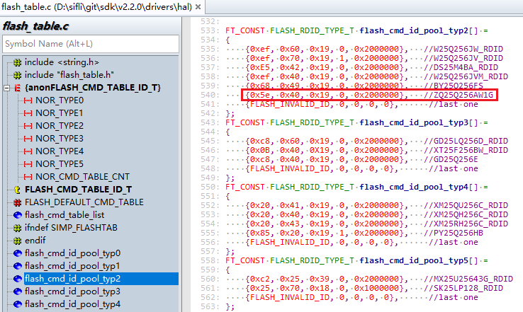<br>

##### 1.3.2 How to Add NAND Flash

In nand_table.c, add the corresponding Chipid under the corresponding Type.

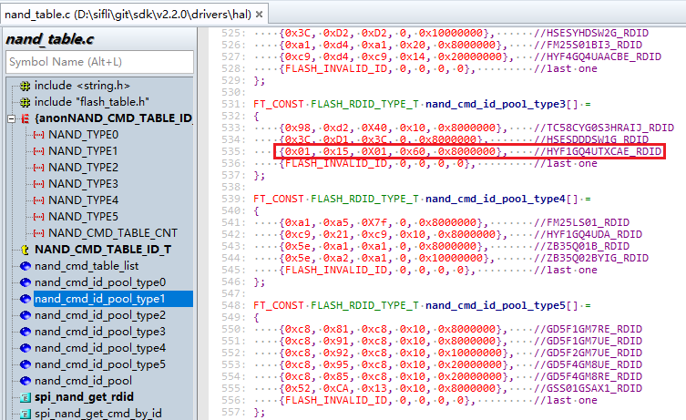<br>

## 2 Flash Type Selection

### 2.1 Nor Flash

#### 2.1.1 TYPE Selection Flowchart

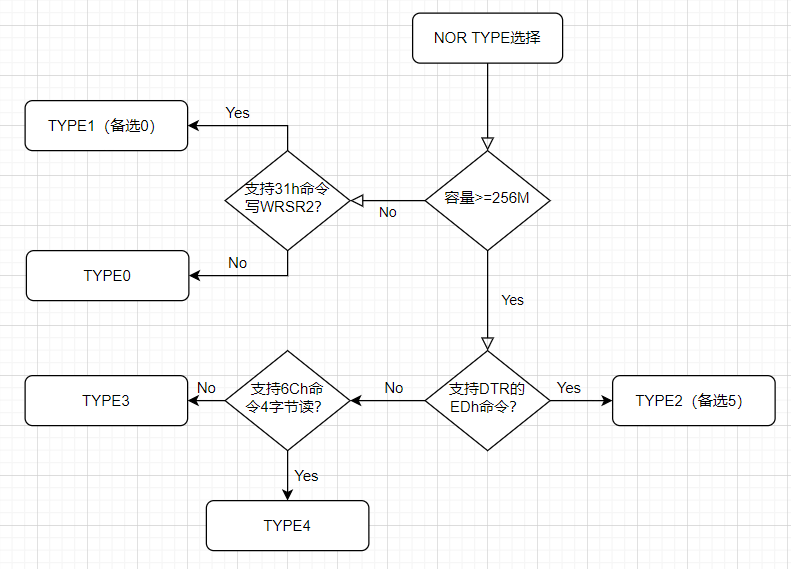<br>

#### 2.1.2 Introduction to Each TYPE
```c
typedef enum

{

NOR_TYPE0 = 0, // normal type 0, DTR, NO CMD_WRSR2, Max 128Mb, as default command table

NOR_TYPE1, // type 1, WRSR2 to write status register 2(QE), Max 128Mb

NOR_TYPE2, // type 2, 256Mb, DTR, 4 bytes address command diff with 3 bytes, OTP support 4-B mode

NOR_TYPE3, // type 3, 256Mb , NO DTR , 4 bytes command same to 3 bytes, only timing changed, OTP 3-B only

NOR_TYPE4, // type 4, 256Mb, NO DTR, 4B ADDR command diff with 3B addr , OTP support 4-B mode

NOR_TYPE5, // type 5, 256Mb, NO DTR, MXIC flash have too many diff with others

NOR_CMD_TABLE_CNT

} FLASH_CMD_TABLE_ID_T;
```
| NOR_TYPE0 | 128 Mbit and below, supports DTR, without the 31h command for writing the WRSR2 register |
| --- | --- |
| NOR_TYPE1 | 128 Mbit and below, supports DTR, with the 31h command for writing the WRSR2 register |
| NOR_TYPE2 | 256 Mbit and above, supports DTR, has a separate 6Ch command for 4-byte operations, and OTP supports 4Byte address access |
| NOR_TYPE3 | 256 Mbit and above, does not support DTR, has no separate 6Ch command for 4-byte operations, 3-byte or 4-byte addresses are both operated by the 6Bh command, and OTP supports only 3Byte address access |
| NOR_TYPE4 | 256 Mbit and above, does not support DTR, has a separate 6Ch command for 4-byte operations, and OTP supports 4Byte address access |
| NOR_TYPE5 | 256 Mbit and above, does not support DTR. This TYPE differs significantly for MXIC flash. |


#### 2.1.3 DTR Concept

Flash DTR mode is short for `Dual Transfer Rate`, meaning data transfer is triggered on both edges of the SCK clock signal to improve transfer efficiency. DTR mode is similar to `Double Data Rate (DDR)` mode because both trigger on both edges. However, DDR usually refers to the data transfer rate, while DTR focuses more on the concept of transfer rate.

**Whether the DTR function is supported**

**As shown below, directly search for EDh in the corresponding die driver. If you can see the following DTR 4-line IO read command, it indicates support**
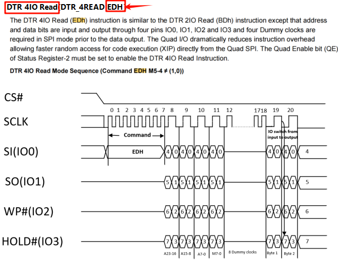<br>

#### 2.1.4 QE Flag Bit Concept

QE bit (Quad Enable bit) is short for Quad Enable and is an important concept in serial NOR Flash. In Chinese it is called four-line enable. In serial NOR Flash, the QE bit controls pin function multiplexing. Specifically, the QE bit determines the functions of Pin3 and Pin7: when the QE bit is enabled, these pins are used for data transfer; when the QE bit is not enabled, these pins are used for control functions such as WP# (write protect) and HOLD# (hold).

#### 2.1.5 WRSR2 Register

The WRSR2 register is short for **WR**ite **S**tatus **R**egister 2. Different NOR devices read and write the WRSR2 register in two ways, as follows:

- You can search for the corresponding 01H and 31H instructions directly in the flash device documentation to see which instruction is supported.

**Type0** has no separate 31h command for writing the WRSR2 register (rare)

It writes the WRSR2 register by writing 2 bytes with 01H, as shown below.

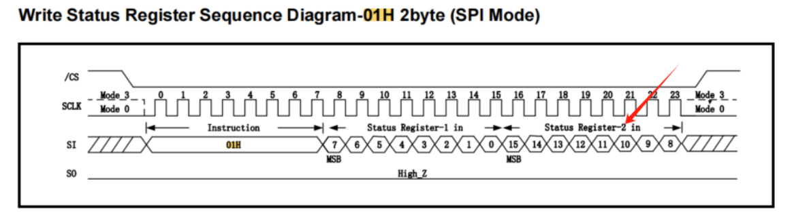<br>

**Type1** has a separate 31H command for writing the WRSR2 register (most devices)

**Note**: Some NOR devices that support the 31H command also support writing WRSR2 by continuously writing 2 bytes with 01H, so they can be placed in either Type0 or Type1. In this case, the default is still to place them in Type0.

Datasheet lookup method: search for the 31H command. If there is no 31H command, it can only be placed in Type0.

As shown in the following figure, the only difference between type0 and type1 is the 31H command.
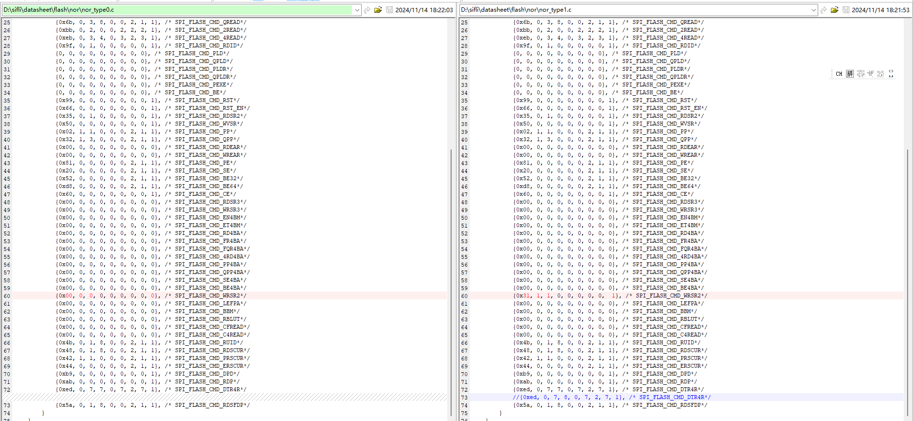<br>

As shown below, the BY25Q256FS device supports continuous writing of S15-S8 (that is, WRSR2) with 01H, and also supports separate writing of S15-8 with 31H. It can be placed in either Type0 or Type1. In this case, the default is still to place it in Type0.

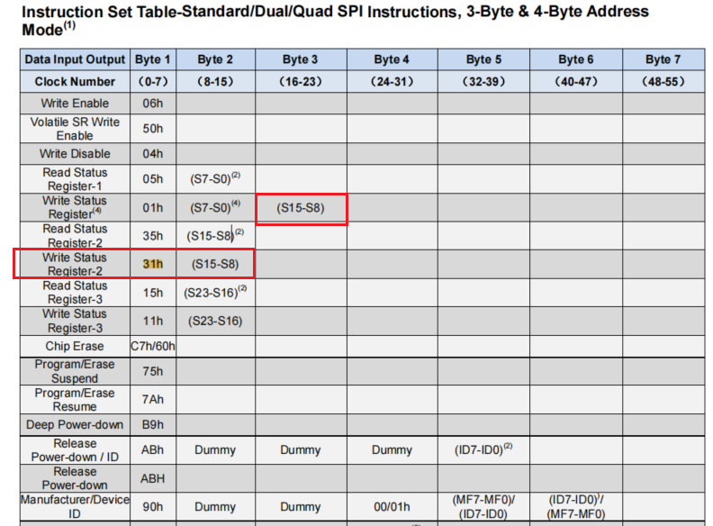<br>

#### 2 .1.6 Address MODE for Reading OTP

The TYPE selection mentions whether OTP commands use 3-byte or 4-byte addresses. This section provides a brief introduction.

NOR usually provides about 256 bytes of Security Registers, commonly called the OTP (One Time Program) area. This area can actually be erased and written multiple times, but it can also be configured with OTP protection and used to store secure or important information, such as Bluetooth (network) addresses, device names, serial numbers, Alipay encryption data, and other information.

For NOR devices larger than 128 Mbit, read and write commands also differ between 3-byte and 4-byte modes (the corresponding command in the program is SPI_FLASH_CMD_RDSCUR), as shown below:

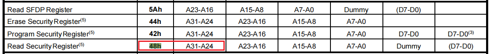<br>

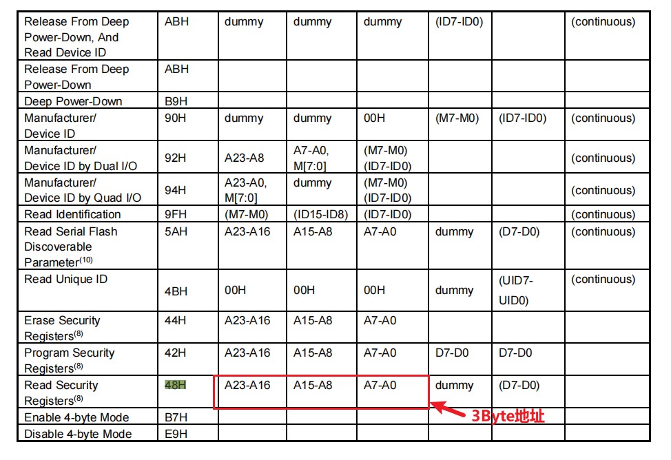<br>

#### 2.1.7 4-Byte Address Mode for NOR

**Background**

NOR devices below 16 MB (128 Mbit) usually use 3-byte address mode. The command format is cmd + addr[2] + addr[1] + addr[0] + ...

When using NOR flash larger than 16 M bytes, 4-byte address mode is required. The command format is cmd + addr[3] + addr[2] + addr[1] + addr[0] + ...

**Reason**

Because 3 bytes can represent only the address range 0x000000 - 0xffffff = 0 - 16M, addresses beyond 16M cannot be represented. Therefore, 4 bytes are required, and 4-byte addressing can support capacities from 256 Mbit to 32 Gbit.

**3-Byte/4-Byte Switching Issue**

For compatibility with existing MCU boot ROM code, flash devices larger than 128 Mbit leave the factory in 3-byte mode by default (allowing access within 128 Mbit). They enter 4-byte mode by sending the B7h command, and can also exit 4-byte mode by sending E9h.

**Whether a 4-Byte Mode Command 6Ch Exists**

**Some NOR vendors do not provide a dedicated 6Ch command for 4-byte addressing. In 3-byte address mode they use 6Bh, and in 4-byte address mode they still use the 6Bh command. This creates command differences, so the TYPE is different, as shown below**

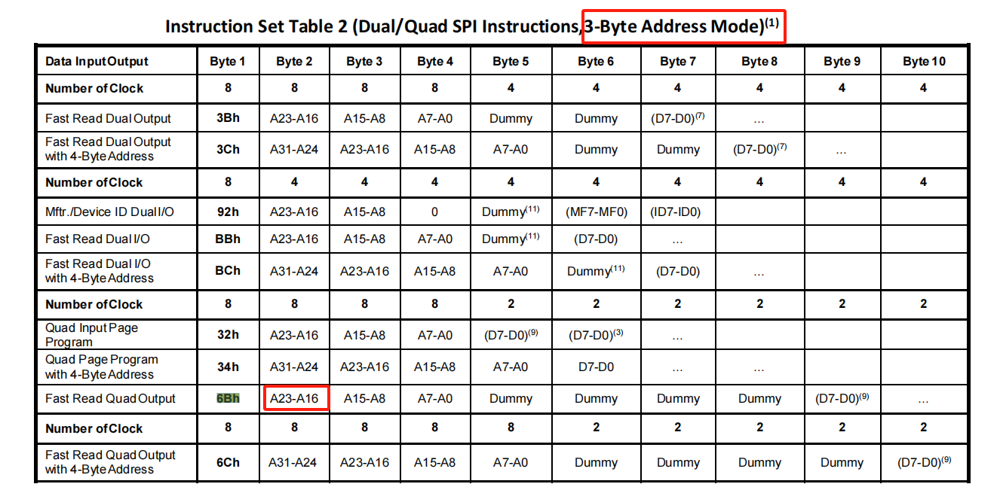<br>

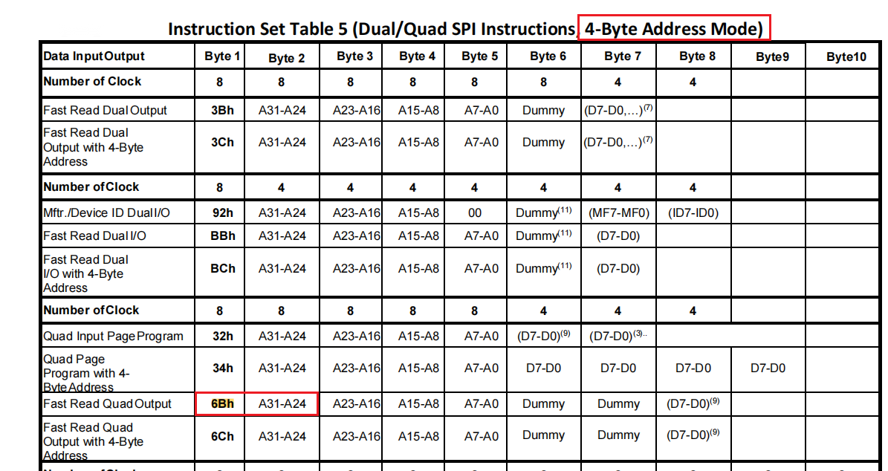<br>

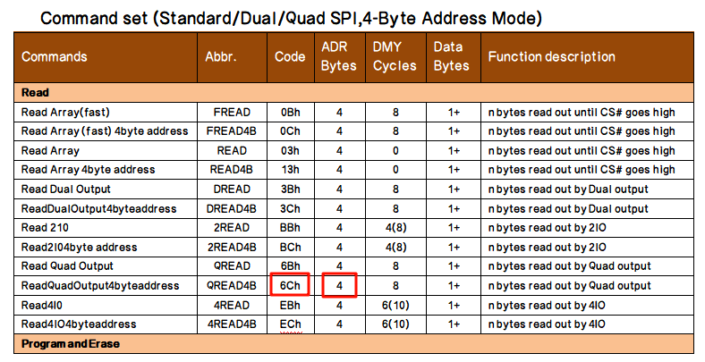<br>

### 2.2 Nand Flash

#### 2.2.1 TYPE Selection Flowchart

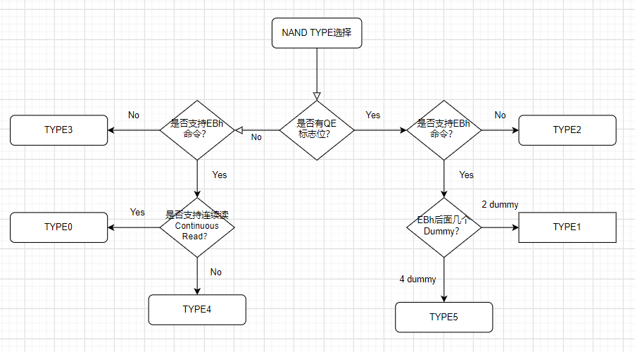<br>

#### 2.2.2 Introduction to Each TPYE
```c
typedef enum
{

NAND_TYPE0 = 0, // normal type, base on winbond w25n01gw, with NON-BUF, NO QE, EB with 4 dummy

NAND_TYPE1, // based on XT26G01D, BUF, QE, EB, EB with 2 dummy

NAND_TYPE2, // based on ds35x1gaxxx, BUF , QE, NO EB

NAND_TYPE3, // based on tc58cyg0s3hraij, BUF, NO QE, NO EB

NAND_TYPE4, // based on FM25LS01, BUF, NO QE, EB with 4 dummy

NAND_TYPE5, // based on GD5F1GM7RE, BUF, QE, EB, EB with 4 dummy

NAND_CMD_TABLE_CNT

} NAND_CMD_TABLE_ID_T;
```
| NAND_TYPE0 | Supports continuous read mode, has no QE flag bit, and the EBh command is followed by 4 dummy clocks |
| --- | --- |
| NAND_TYPE1 | Has a QE flag bit, and the EBh command is followed by 2 dummy clocks |
| NAND_TYPE2 | Has a QE flag bit and no EBh command |
| NAND_TYPE3 | Has no QE flag bit and no EBh command |
| NAND_TYPE4 | Has no QE flag bit, and the EBh command is followed by 4 dummy clocks |
| NAND_TYPE5 | Has a QE flag bit, and the EBh command is followed by 4 dummy clocks |


#### 2.2.3 QE Flag Bit Concept

QE bit (Quad Enable bit) is short for Quad Enable and is an important concept in serial NOR Flash. In Chinese it is called four-line enable. In serial NOR Flash, the QE bit controls pin function multiplexing. Specifically, the QE bit determines the functions of Pin3 and Pin7: when the QE bit is enabled, these pins are used for data transfer; when the QE bit is not enabled, these pins are used for control functions such as WP# (write protect) and HOLD# (hold)**.**

Many NAND devices support only 4-line mode by default and do not have a QE flag bit, so no switch from single-line to four-line mode is required.

**How to Check the QE Flag Bit**

Search for QE directly in the flash device documentation, or search for the B0h feature register (called the Bxh register on some NAND devices) to check whether a QE flag bit exists. As shown below, this device has a QE flag bit, so select a TYPE with a QE flag bit. If it cannot be found, QE switching is not required.

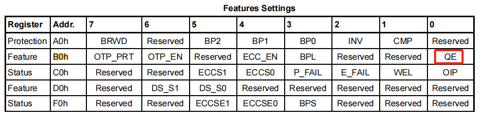<br>

#### 2.2.4 EBh Command Concept

Both EBh and 6Bh are fast 4-line read commands. The difference is that the page address sent by the EBh command is also transferred in 4-line mode, so it is faster. However, some NAND devices do not support it. The following is the 6Bh command. You can search directly for the EBh command in the flash device documentation. If it is absent, the device does not support it.

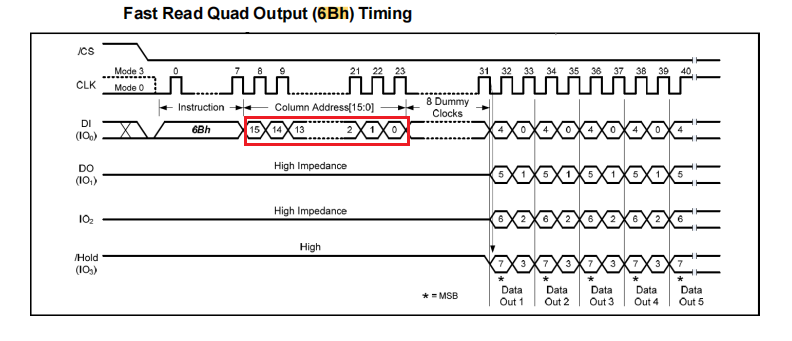<br>

When determining the TYPE, the number of dummy clocks after the EBh instruction is checked. This section explains how to distinguish them:

The 4-Dummy method is shown below. After the 16-bit page address is sent, it is followed immediately by 4 dummy clocks.

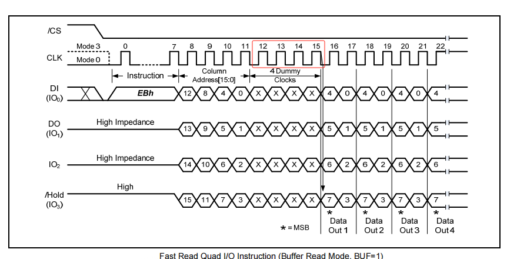<br>

The 2-Dummy method is shown below: after 16 bits of page address are sent, only 2 dummy clocks follow.

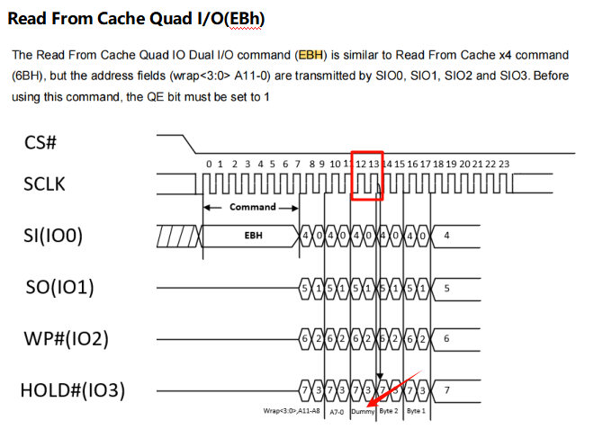<br>

#### 2.2.5 NAND Continuous Read Concept

The concepts of NAND buff read and continuous read are shown below. This device supports both buffer read and continuous read modes.

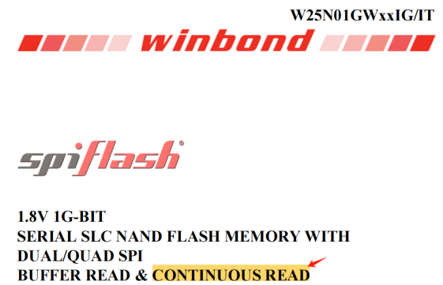<br>

**Buff Read Concept**

When reading data from QSPI NAND, the operation must be divided into two steps.

Step 1: Page Data Read (13h), which reads data from the cell into the data buffer. At this point the NAND reads cell data, calculates ECC, and performs error correction. If bit flips occur in the cell, the data written to the data buffer after ECC correction is already correct.

Step 2: Read Data (6Bh or EBh), which reads data from the data buffer.

As shown, the data buffer is mandatory for both read and write operations.

**Continuous Read Concept**

Buff read can read only one page with one command. To read the next page, the two steps above must be repeated.

At this point, some NAND vendors introduced continuous read.

When the BUF=0 flag bit is 0, the device is in continuous read mode and data is output.

Output starts from the first byte of the data buffer and automatically increments to the next higher address. After the data buffer of one page is read, the first byte of the next page follows immediately and the next page continues to be output until the entire NAND is read. This makes it possible to read the entire NAND with a single read instruction.

To determine whether continuous read is supported, search for Continuous Read, or check whether the 6Bh command has a description like the one shown below. BUF=1 indicates whether the continuous read function is used.

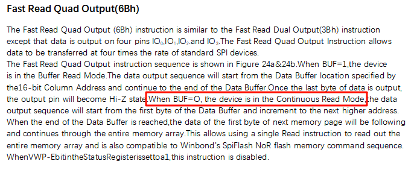<br>

## 3 Flash Device Driver Explanation

#### 3.1 Nor Flash

**ID Explanation**
```c
typedef struct FLASH_FULL_CHIP_ID
{
    uint8_t manufacture_id; /* 厂家型号，同一个厂家都一样的，0x52代表 联和存储 */
    uint8_t memory_type;  /* 区分同一厂商的不同存储芯片型号 */
    uint8_t memory_density; /* 区分同一厂商的不同存储芯片型号 */
    uint8_t ext_flags;    //8bit的意义，目前nor flash只用了bit 0，
    // bit 0: nor flash，该bit为1，表示该flash支持DTR（QSPI双沿送数），0: indicates unsupported. After this is set to 1, whether user code uses DTR mode is selected by the code.
    // bit 1: -  7  nor flash无意义，默认0
    uint32_t mem_size;  // flash 存储大小，单位（Byte）
} FLASH_RDID_TYPE_T;
```
**ID Example Description**

`{0x85, 0x20, 0x1a, 1, 0x4000000}, //PY25Q512HB_RDID`

`0x85:` represents a chip from Puya

`0x20:` represents the memory type

`0x1a:` represents the memory device ID

`1: ` indicates support for DTR dual-edge data transfer

### 3.2 Nand Flash
**ID Explanation**
```c
typedef struct FLASH_FULL_CHIP_ID

{

    uint8_t manufacture_id; /* 厂家型号，同一个厂家都一样的，0x52代表 联和存储 \*/

    uint8_t memory_type; /* 区分同一厂商的不同存储芯片型号 \*/

    uint8_t memory_density; /* 区分同一厂商的不同存储芯片型号 \*/

    uint8_t ext_flags; //8bit的意义，目前nand flash只用了bit 1 – bit7，

    // bit 0: for NAND flash, this bit has no meaning and must be set to 0.

    // bit 1: nand flash plane 标志位，1：两个plane；0：无双plane（常见）

    // bit 2: nand flash page（页）大小标识位, 0： 为常见默认的每个page为2048；1：为每个page为4096

    // bit 3: for NAND flash block（块）大小标识位, 0：为常见的每个block（块）为 64 pages（页）；1 ：为每个每个block（块）为 128 pages（页）

    // bit 4~7: for NAND ECC status mode as NAND_ECC_MODE_T, 为ECC标识位

    uint32_t mem_size; // flash 存储大小，单位（Byte）

} FLASH_RDID_TYPE_T;
```
**ID Example Description**

The 8 bits of Ext_flags contain meanings such as:

`{0xE5, 0x74, 0xE5, 0x22, 0x20000000}, //DS35X4GMXXX_RDID`

The binary representation of `0x22` is `0b0010 0010`

Bits 4-7 are 0b0010, so the ECC identifier is 2.

Bit3 is 0: each block has 64 pages, with a size of 64x2KB=128KB

Bit2 is 0: each page is 2048 bytes

Bit1 is 1: this Flash has 2 planes

Bit0 is 0: no meaning


## 4 How to Find the ChipID

### 4.1 Case 1: GSS01GSAX1

Using GSS01GSAX1-W8NMI0_Rev_1.1.pdf as an example, open it and search for the common flash read ID command: 9fh. As shown below, you can find the timing diagram for the 9fh read ID command and the order of the output chipid.

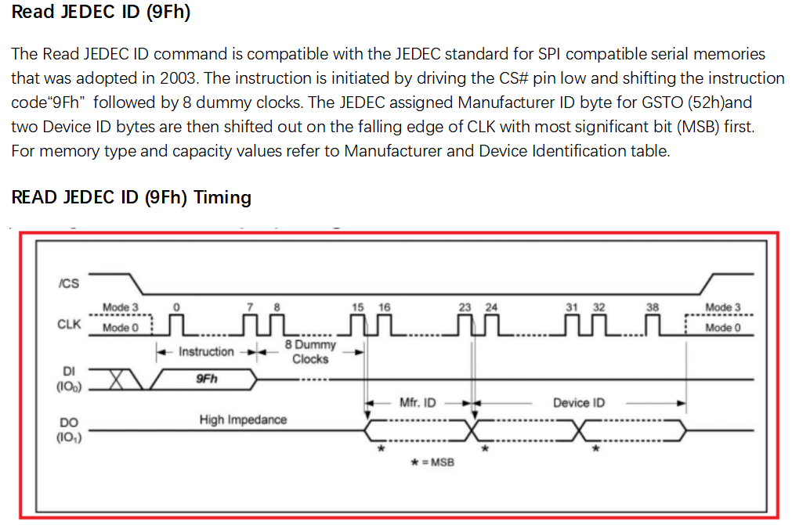<br>

The following is the ID that can be read by the 9fh command. After SPI sends the 9FH instruction and leaves 8 dummy clk cycles blank, it outputs 0x52, 0xca, 0x13.

The corresponding chipid table in the nand_table.c file is:
{0x52, 0xCA, 0x13, 0x10, 0x8000000}, //GSS01GSAX1_RDID

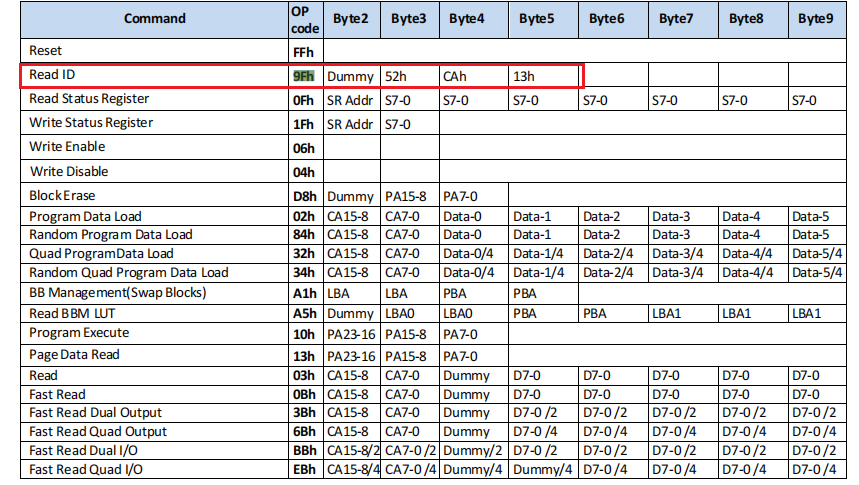<br>

### 4.2 Case 2: DS35X2GBXXX

For this part from Dosilicon, the 9Fh read chipid command returns only 2 bytes of chipid after the 8bit clk dummy. The software still reads 3 bytes by default. The chipid is usually output cyclically. If 3 bytes are read, the 1V8 model shown below will return 0xE5, 0xA2, 0XE5. Similarly, if 5 bytes are read, it will return 0xE5, 0xA2, 0XE5, 0xE5, 0xA2. The software uses only the first 3 bytes as the chipid, so the resulting chipid is:
{0xE5, 0xA2, 0XE5, 0x22, 0x10000000}, //DS35M2GBXXX_RDID

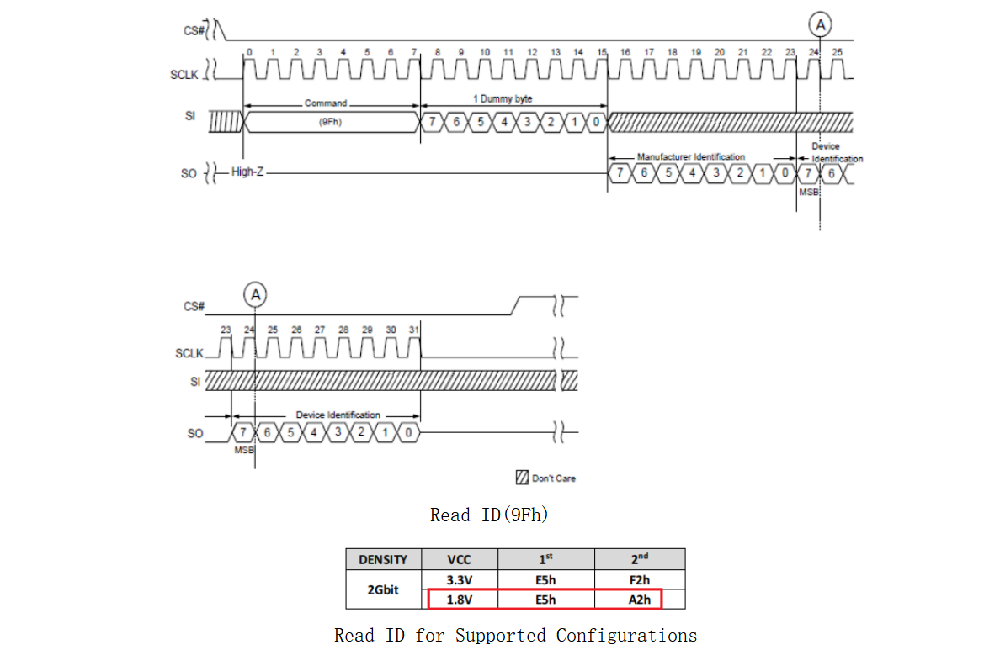<br>

### 4.3 Print the Chipid During Download

Download with Impeller.exe and check the log to view the Chipid. This example demonstrates only how to obtain the chipid through UART download.

As shown below: select the corresponding CPU model, uart/jlink, speed, and nor/nand category. After confirming the correct download address, return to the main interface.

<br>

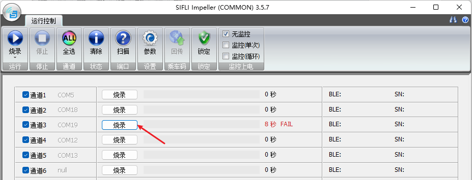<br>

After clicking Program, check the log generated during the failed download process at `Impeller_x.x.x_COMMON\log\channel\20xx_xx_xx\*.txt`. The readable Chipid is `{0xc8, 0x82, 0xc8, x, 0xxxxxxxxx},`

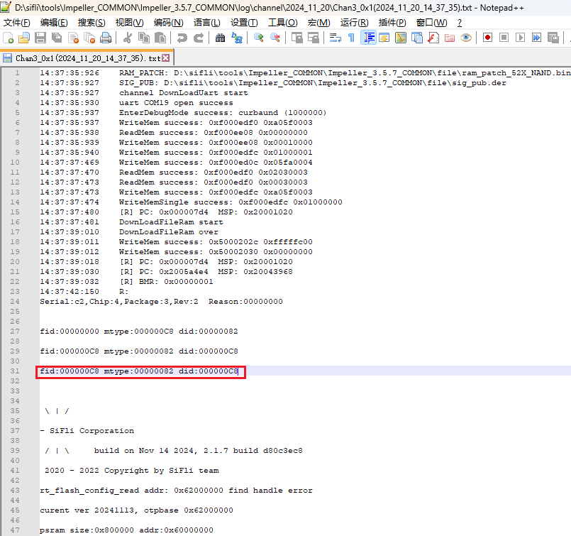<br>


## 5 How to Configure ext_flags

### 5.1 Nor Flash

**ext_flags:** Meaning of the 8 bits. Currently, NOR flash uses only bit 0.
- bit 0: for NOR flash, when this bit is 1, it indicates that the flash supports DTR (QSPI dual-edge data transfer)
    - 0: indicates unsupported. After this is set to 1, whether user code uses DTR mode is selected by the code.
- bit 1 - 7: no meaning for NOR flash, default 0

### 5.2 Nand Flash

**ext_flags:** Meaning of the 8 bits. Currently, NAND flash uses only bit 1 to bit 7.

- bit 0: for NAND flash, this bit has no meaning and must be set to 0.

- bit 1: NAND flash plane flag bit. 1: two planes; 0: no dual planes (common)

- bit 2: NAND flash page size flag bit. 0: the common default, each page is 2048; 1: each page is 4096

- bit 3: NAND flash block size flag bit. 0: the common value, each block is 64 pages; 1: each block is 128 pages

- bit 4 - 7: for NAND ECC status mode as NAND_ECC_MODE_T, used as the ECC identifier bits

#### 5.2.1 Configuration Method and Explanation

##### 5.2.1.1 Whether to Use Plane

**Plane Concept in NAND FLASH**

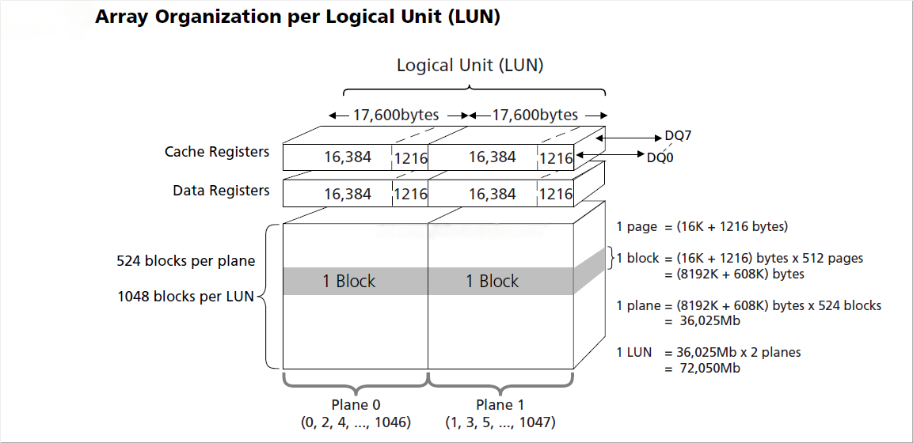<br>

NAND uses multi-plane design to improve performance. As shown above, a NAND device is divided into 2 planes, and the blocks in the 2 planes are numbered alternately as odd and even. Each plane can also be operated independently to implement ping-pong operation and improve performance. Therefore, the interleave algorithm is introduced. The interleave algorithm refers to accessing multiple planes on a single channel to improve NAND performance.

**You can search for plane directly in the flash device documentation. If it is not found, the device does not support it**

##### 5.2.1.2 Page Size

Concepts of page and block in NAND FLASH

In NAND flash, a page is the smallest unit for read/write operations, and a block is the smallest unit for erase operations. Each NAND address can be precise to the byte (address mapping), but R/W (read/write) operations still use pages as the minimum unit and require page alignment.

Page:

A page is the smallest programmable unit in NAND Flash memory and is usually 2KB, 4KB, or 8KB in size.

When writing data, the entire page must first be erased to 0xFF, and then the full page of data is written.

When reading data, it can be read by page or by byte.

A page is the basic operation unit in NAND Flash memory. Data must be written in integer multiples of pages.

As shown below: one page is 2024 (2K) + 64 bytes. The extra 64 bytes after each page are usually used for bad block markers and ECC checks.

**You can search directly for page size in the flash device documentation, or check the flash parameter table to quickly find the page size of the device**

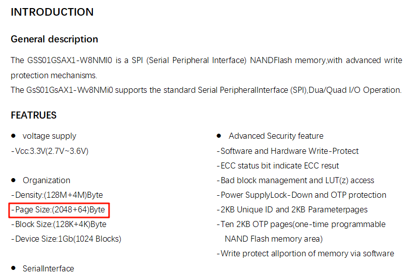<br>

##### 5.2.1.3 Block Size

Block:

A block is the smallest erase unit in NAND Flash memory and usually contains multiple pages.

The block size is usually 64KB, 128KB, or 256KB. The block size may vary between different NAND Flash memory models.

Erase operations are performed by block, meaning the entire block is erased to all 1s.

Once data is stored in a block, a single page in that block cannot be written or erased directly. The entire block must be erased before new data can be written.

**You can search directly for block size in the flash device documentation, or check the flash parameter table to quickly find the block size of the device**

As shown below: one block contains 64 pages (a total of 64x2K=128K Byte),
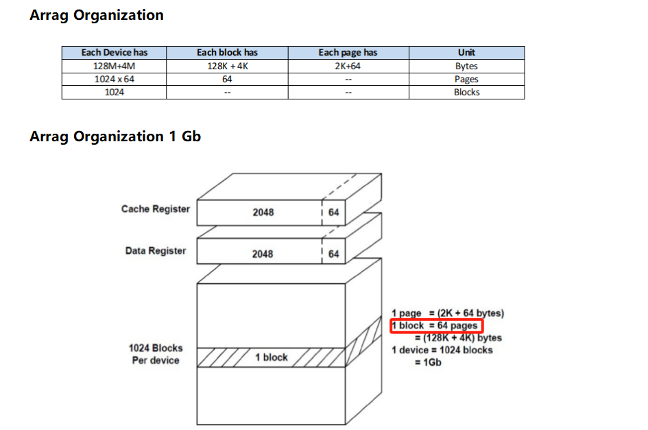<br>

Reference article:

NAND Flash memory typically organizes data by Page and Block. The following is a brief introduction to the Page and Block structure of NAND Flash:
[Original link](https://blog.csdn.net/gqd0757/article/details/140107931)(https://blog.csdn.net/gqd0757/article/details/140107931): https://blog.csdn.net/gqd0757/article/details/140107931

In practical applications, to reduce the number of erase/write cycles of NAND Flash memory and extend its lifetime, embedded file systems such as UBIFS, JFFS2, and FlashDB are usually used to manage NAND Flash pages and blocks. Bad block management and these file systems allocate and manage data properly, reducing the impact of erase/write operations on NAND Flash memory.

EMMC storage can also be used. EMMC storage already includes a NAND read/write controller and NAND flash, and the NAND controller includes bad block management and wear leveling operations.

#### 5.2.2 Configure ECC Parameters

##### 5.2.2.1 NAND and ECC Concepts

NAND is a non-volatile memory chip commonly used in flash storage and SSDs (solid-state drives). Because of its high density and low cost, NAND memory is widely used in many devices. However, due to its physical characteristics, NAND memory is susceptible to issues such as bit flips and data loss.

ECC (Error Correction Code) is an encoding technology used to detect and correct errors during data transmission. By adding redundant information to data, ECC helps identify and correct errors during data transmission. Common ECC algorithms include Hamming codes and BCH codes, which can detect and correct multiple bit errors.

##### 5.2.2.2 ECC Principle

In NAND memory, ECC checking is usually implemented in the memory controller hardware. It is enabled by default. When data is written to NAND memory, the controller calculates the ECC check code for the data and stores it together with the data. When data is read, the controller calculates the ECC check code again and compares it with the stored check code. If an error is found, the ECC check code can help the controller identify the erroneous bits and try to correct them.

##### 5.2.2.3 ECC Status Register

The NAND status register is shown below.

B0H register bit4: the ECC Enable bit is enabled by default.

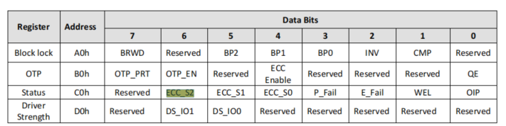<br>

C0H register bits 4-6 (2 bits or 4 bits on some NAND devices) are the ECC status register.

The data read from IO through the QSPI interface has already been corrected, but whether the read data is valid still depends on the ECC status register in the C0H register. The ECC status register is updated after each complete read operation. If the ECC status register indicates that the error exceeds the ECC correctable range, the data must be discarded. However, the meanings of bits 4-6 in the ECC status register C0H differ across NAND devices, so a selection is required to support different NAND devices.
```c
typedef enum __NAND_ECC_STATUS_MODE_

{

    BIT2_IN_C0_T1 = 0, // 有2位状态位, bit 4-5：00： ECC无错误; 01：出现1位错误但ECC可纠正，其他：提示超过1bit的错误且不能被ECC纠正

    BIT2_IN_C0_T2 = 1, // 有2位状态位, bit 4-5：00：ECC无错误，01或11：有错误但ECC可以纠正，10：有错误且ECC不能纠正

    BIT3_IN_C0_T1 = 2, // 有3位状态位, bit4-6，000：无错误，001或011或101有错误但ECC可以纠正，010：有超过8bit错误且不能ECC纠正

    BIT3_IN_C0_T2 = 3, //有3位状态位, bit4-6，000：无错误， 111：有错误且不能ECC纠正，其它：有错误但ECC可以纠正，

    BIT4_IN_C0_T1 = 4, // 有4位状态位, bit4-7，0000：无错误， xx10：有错误且不能ECC纠正，其它：有错误但ECC可以纠正

    BIT4_IN_C0_T2 = 5, // 有4位状态位, bit4-7，0000：无错误， 大于1000：有错误且不能ECC纠正，其它：有错误但ECC可以纠正

    BIT2_IN_C0_T3 = 6 // 有2位状态位, bit 4-5：00：ECC无错误; 01：出现了1-2位错误但ECC可纠正，10：出现了1-2位错误但ECC可纠正，11：有错误且不能被ECC纠正

} NAND_ECC_MODE_T;
```
##### 5.2.2.4 ECC Configuration Examples

**You can search directly for ECC in the flash device documentation to quickly find the ECC parameters of the device**

**ECC Configuration Example 1**

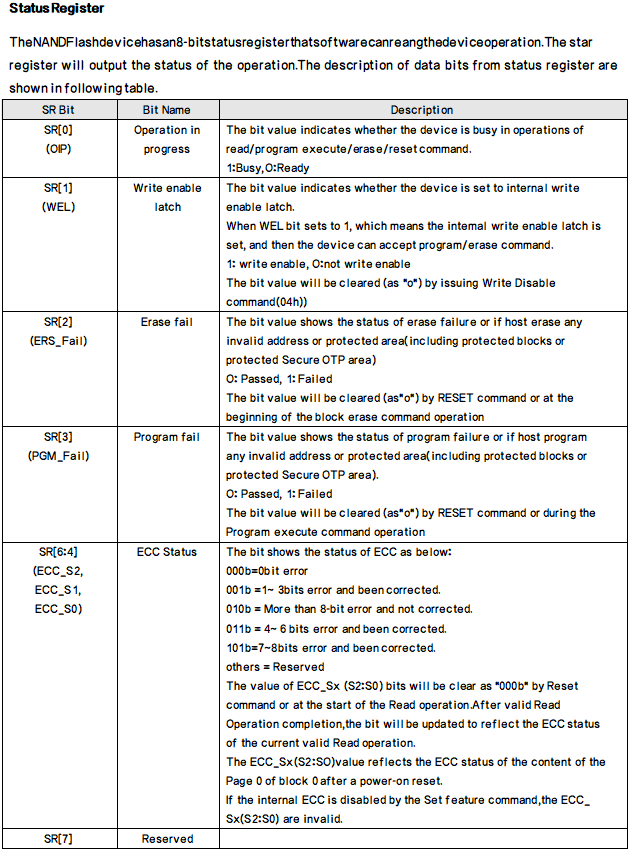<br>

`{0xE5, 0x74, 0xE5, 0x22, 0x20000000}, //DS35X4GMXXX_RDID`

As shown above, C0H has three status bits ECC_S0-S2, matching description 2 (010 means an error exists and cannot be corrected). The ECC parameter bits in ext_flags are 0x22, where bits 4-7 are 2.

**ECC Configuration Example 2**

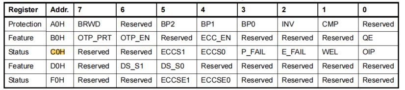<br>

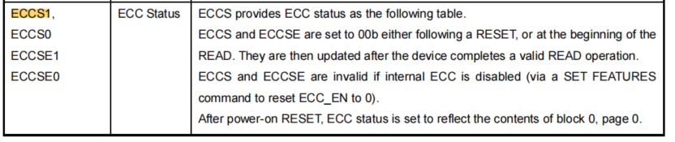<br>

`{0xc8, 0xd9, 0xc8, 0x10, 0x8000000}, //GD5F1GQ4UxxH_RDID`

As shown above, C0H has two status bits ECCS0-S1 (ECCSE0-1 are in the F0H register and are not handled by the code), matching description 1 (10 means an error exists and cannot be corrected). The ECC parameter bits in ext_flags are 0x10, where bits 4-7 are 1.

**ECC Configuration Example 3**

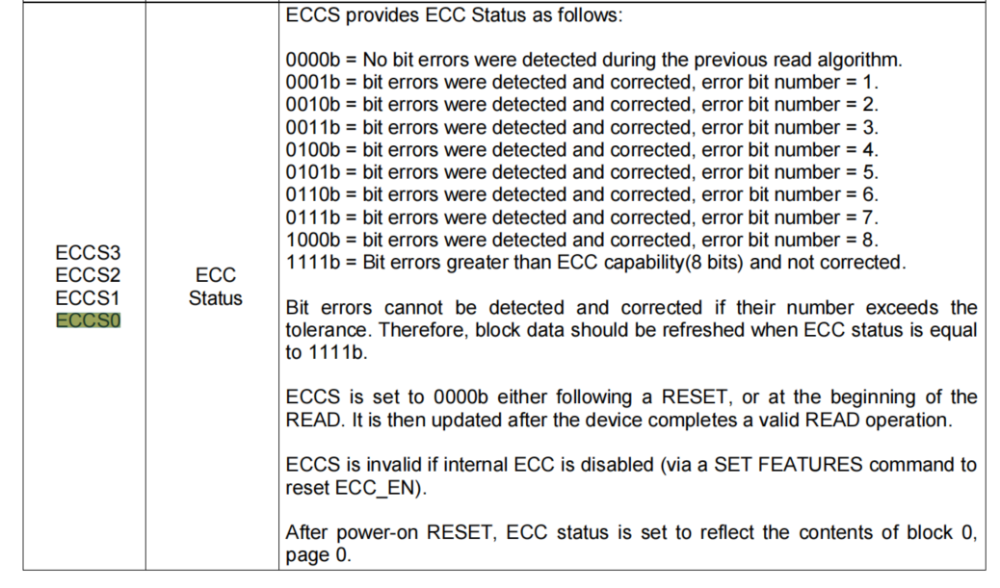<br>

`{0x0B, 0x11, 0X00, 0x50, 0x8000000}, //XT26G01CXXX_RDID`

As shown above, C0H has four status bits `ECCS0-S3`, matching description 5 (greater than 1000: an error exists and cannot be corrected). The ECC parameter bits in `ext_flags` are 0x50, where bits 4-7 are 5.


## 6 FAQ

### 6.1 Flash Download Principle

#### 6.1.1 UART Download

Through the UART interface, load the corresponding Flash programming bin, such as ram_patch_52X_NAND.bin, into the specified RAM address of the 52 MCU, jump to that RAM address, and then execute the operation code that programs the external NOR or NAND Flash.

#### 6.1.2 Jlink Download

When Jlink connects to the MCU through the SWD interface and executes the command line:

When running the command Loadbin d:\1.bin 0x62000000, Jlink.exe selects Devices/SiFli/SF32LB52X_EXT_NAND2.elf from the JLinkDevices.xml configuration according to the corresponding 0x62000000 address, loads it into the RAM of the 52 MCU, and calls the corresponding programming interface in the elf file to perform programming.

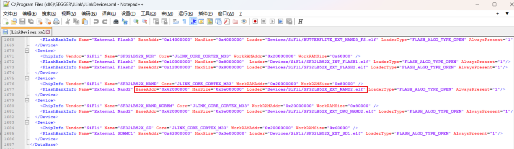<br>

### 6.2 UART Download Log Analysis

#### 6.2.1 ChipID Cannot Be Read

As shown below, download with Impeller.exe and check the log to view the Chipid. This example demonstrates only how to obtain the chipid through UART download, and the Chipid cannot be read.

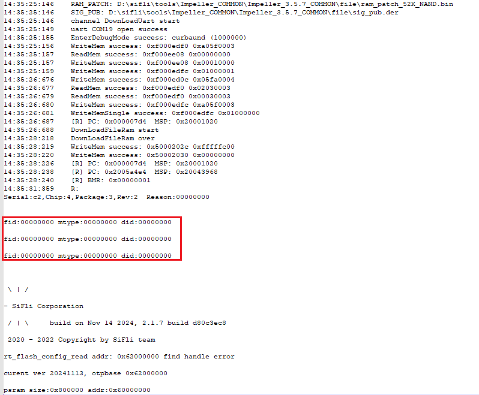<br>

**Common causes:**

1. Flash power is absent or the supply voltage does not match. Pay special attention to the difference between 1.8V and 3.3V Flash.
2. The Flash is poorly soldered or mounted in the wrong orientation.
3. If Flash power is absent when measured after programming fails, and hardware issues have been ruled out, the common cause is that Flash power was not enabled in the programming driver. Configure the corresponding Flash power-on method in the generation tool if the power supply is not the default supply.

#### 6.2.2 The Programming BIN Does Not Run

See Section 5.1 for the introduction to the Flash programming principle.

See the printout below.
```
16:18:48:151 uart COM19 open success //这个提示表示下载的串口19打开成功了，

16:18:54:499 DownLoadUart() fail //这个表示烧录BIN，没有通过Uart成功下载到MCU的RAM中运行起来

16:18:54:499 FINAL_FAIL 500bf
```
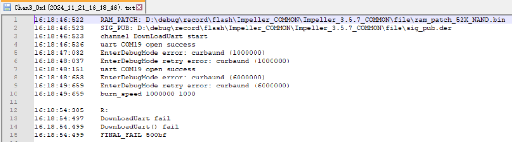<br>

**Common causes:**

1. The MCU power supply is abnormal, so the MCU does not run.
2. The MCU is running the user program, but the corresponding UART port or Jlink is not communicating, or the MCU has crashed.

Solution:

Let the MCU enter Boot mode and confirm from the serial port that the Boot mode entry message is printed.

1) For 55, 56, and 58 series MCUs, there is a dedicated Boot_Mode pin. After it is pulled high, the Boot mode printout is as follows:

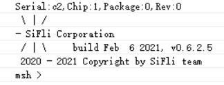<br>

2) For 52 series chips, there is no dedicated Boot_Mode pin. Entering a command within 3 seconds after power-on can enter Boot mode. The corresponding printout is as follows:

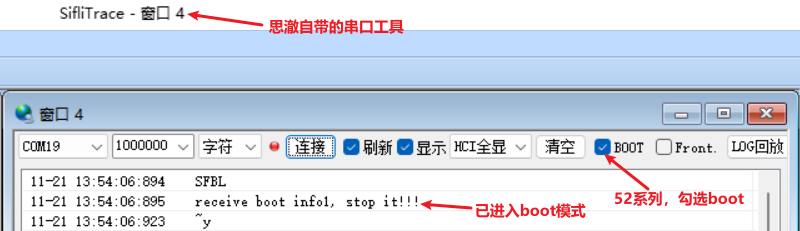<br>

#### 6.2.3 Log Indicates Verification Failure

The following Log
```
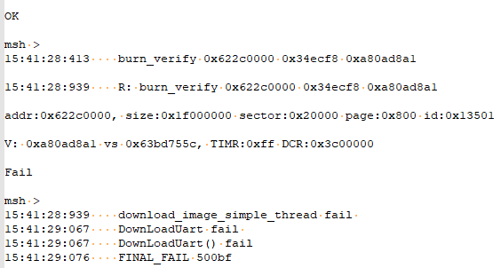<br>

15:41:28:413 burn_verify 0x622c0000 0x34ecf8 0xa80ad8a1

15:41:28:939 R: burn_verify 0x622c0000 0x34ecf8 0xa80ad8a1

addr:0x622c0000, size:0x1f000000 sector:0x20000 page:0x800 id:0x13501

V: 0xa80ad8a1 vs 0x63bd755c, TIMR:0xff DCR:0x3c00000

Fail
```
**Common causes**

1. Poor soldering on chip D2-D3<br>
Because reading the Flash ID only requires the D0-D1 data lines, being able to read the ID does not mean all IOs have good contact. Therefore, when the ID can be read but verification fails, if the Flash chip was not mounted by an SMT machine, pay special attention to checking whether D2-D3 are soldered or making proper contact (this often occurs with manual soldering or poor contact in the Flash socket).<br>
2. The QSPI trace is too long or flying wires introduce interference, causing individual bit errors.<br>

#### 6.2.4 Garbled Data Received on the UART Serial Port

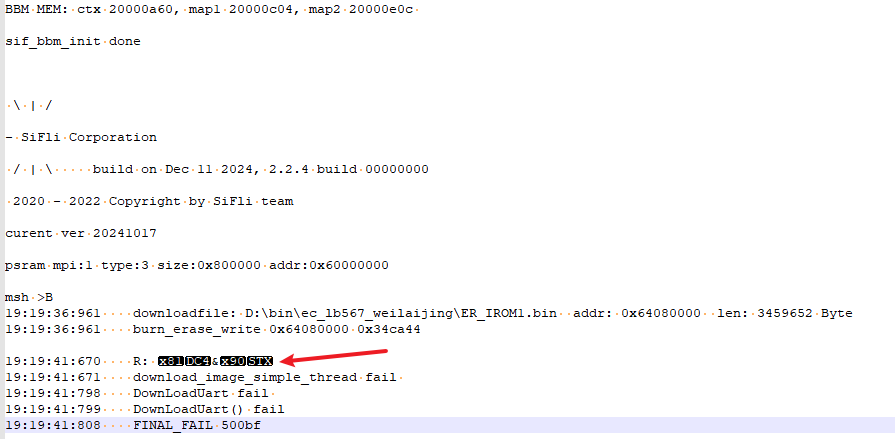<br>
```
msh >B

19:19:36:961 downloadfile: D:\bin\ec_lb567_weilaijing\ER_IROM1.bin addr: 0x64080000 len: 3459652 Byte

19:19:36:961 burn_erase_write 0x64080000 0x34ca44

19:19:41:670 R: ?&?

19:19:41:671 download_image_simple_thread fail

19:19:41:798 DownLoadUart fail

19:19:41:799 DownLoadUart() fail

19:19:41:808 FINAL_FAIL 500bf
```
As shown above: garbled data is received on RX during download.

**Common causes**

1) The device restarts during download

### 6.3 QSPI Flash Frequency Issue

The recommended default QSPI CLK frequency for Flash read/write is about 60Mhz. Some NOR/NAND datasheets state support for 108Mhz or higher. A higher frequency improves data read/write speed, but requires better PCB routing and can introduce more EMI interference. This is especially true after SDK code enables DRT dual-edge CLK sampling, which imposes stricter routing requirements.

The method for modifying Flash CLK is usually in the HAL_PreInit function of the bsp_init.c file for the corresponding project. It depends on which MPI interface the Flash is connected to, which clock source is used, and what the divider coefficient is. As shown below, to increase the frequency, change mpi2_div from 5 to 4, making it 288Mhz/4 = 72Mhz. After modification, you can also use the serial command sysinfo to view the CLK clock change.
```c
HAL_RCC_HCPU_EnableDLL2(288000000);

mpi2_div = 5;

HAL_RCC_HCPU_ClockSelect(RCC_CLK_MOD_FLASH2, RCC_CLK_FLASH_DLL2);
```
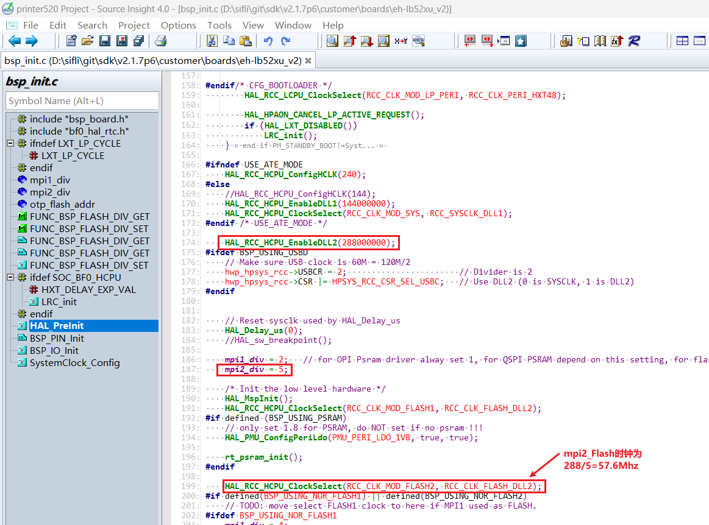<br>

### 6.4 NAND Page/Block Issue

Sections 5.2.1.2 and 5.2.1.3 mention that the Page and Block sizes of large-capacity NAND also tend to increase. When managing Flash in an APP application, the corresponding Page/Block operation method must also be considered.
