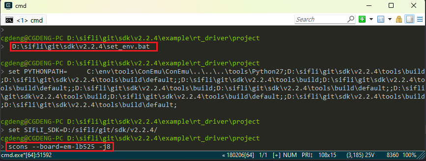
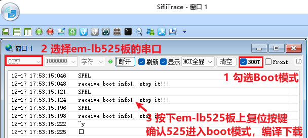
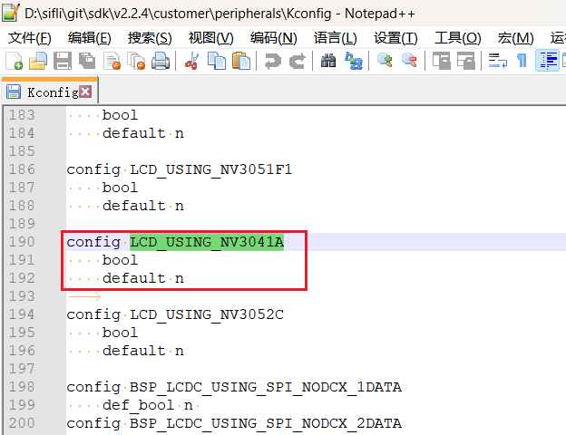
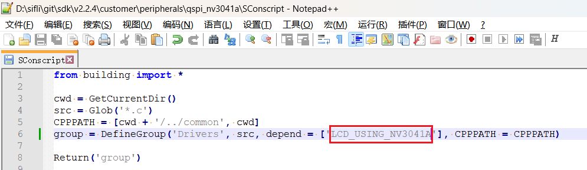
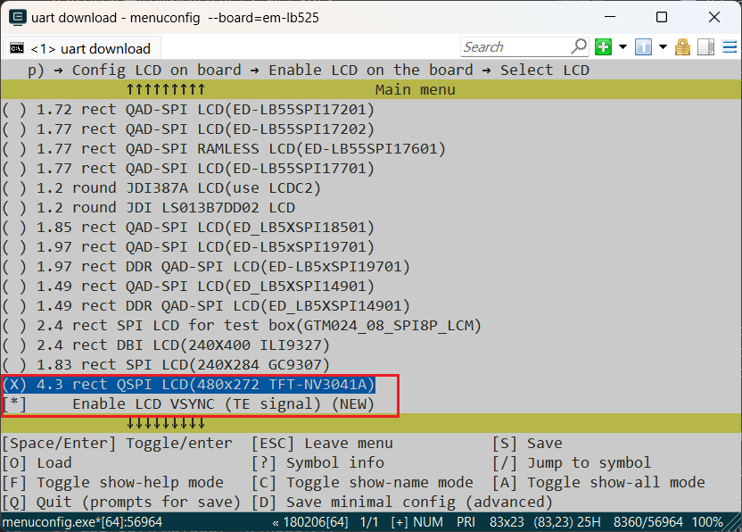
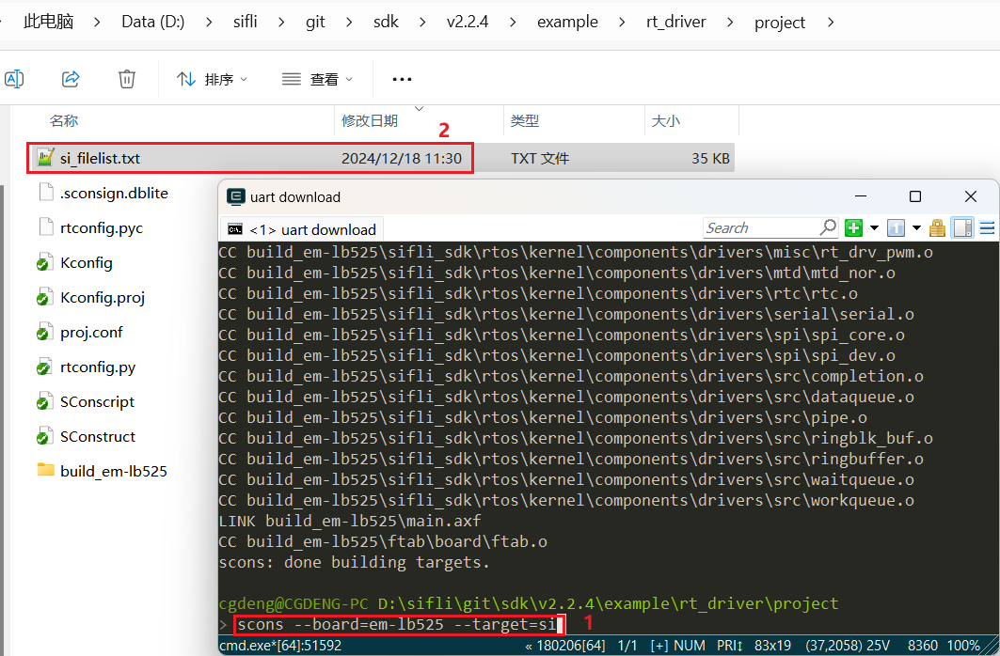
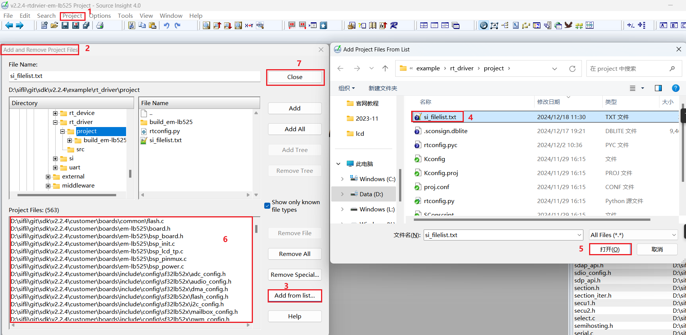
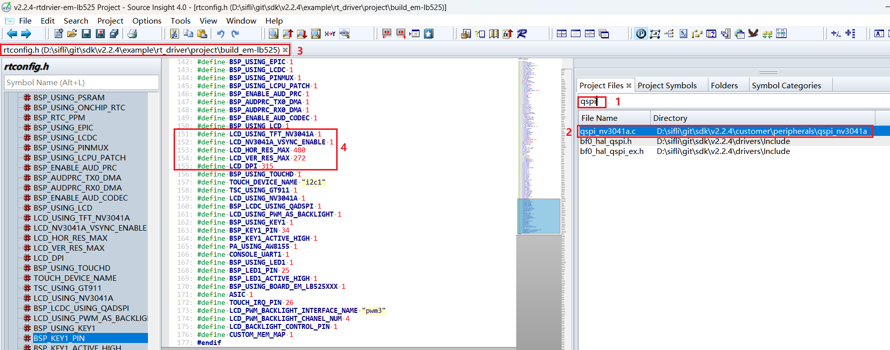
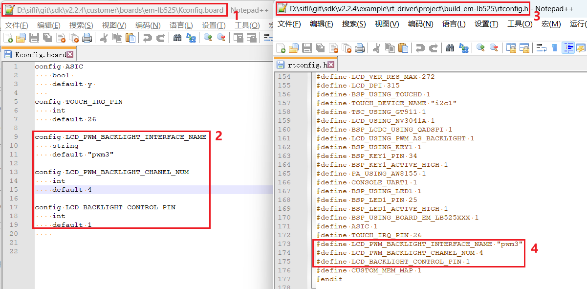
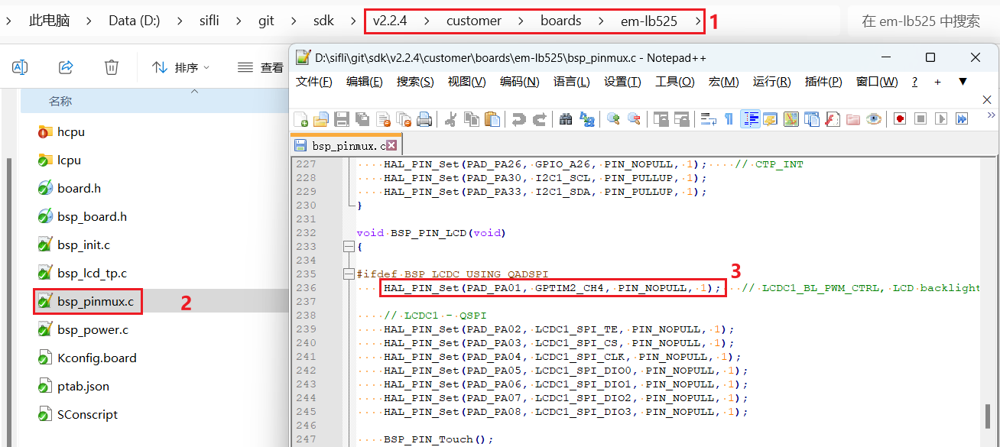

# Example: adding a QSPI-LCD on 525 (built-in)

### 1 Confirm that the rt-driver project runs normally
It is recommended to use the rt-driver project for screen debugging. Before debugging, confirm that the rt-driver project can run normally and print logs.
#### 1.1 Build
Enter the `example\rt_driver\project` directory, right-click and select `ComEmu_Here` to open a build command terminal, then execute the commands in sequence<br>
```
> D:\sifli\git\sdk\v2.2.4\set_env.bat   #设置编译环境路径
> scons --board=em-lb525 -j8   #指定em-lb525模块编译rt-driver工程
```
<br>
#### 1.2 Enter BOOT mode
Confirm that the 525 `em-lb525` module board enters `boot` mode for downloading, as shown below.<br>
<br>
#### 1.3 Download
```
> build_em-lb525\uart_download.bat

     Uart Download

please input the serial port num:7 #然后选择em-lb525模块连接的串口号进行下载 
```
#### 1.4 Confirm normal logs
As shown below, to run the user program, uncheck the option to enter `BOOT`. After confirming that the board is running, you can proceed to the next step to add a new screen module.<br>

### 2 Add the NV3041A screen driver
#### 2.1 Create the NV3041A driver
1) Display driver location
The display driver is located in the `sdk\customer\peripherals` directory.<br>
2) Copy the driver
Copy another driver for the `qspi` interface and rename it to `qspi_nv3041a`.<br>
#### 2.2 Add NV3041A in Menuconfig
1) Modify Kconfig to generate an option for this screen in menuconfig.<br>
Open sdk\customer\boards\Kconfig_lcd with a text editor, and add the option and resolution for this qspi screen as follows:<br>
<br>
```
# menuconfig 生成菜单呈现的选项
        config LCD_USING_TFT_NV3041A
            bool "4.3 rect QSPI LCD(480x272 TFT-NV3041A)" #menuconfig中显示的字符
            select TSC_USING_GT911 if BSP_USING_TOUCHD #如果有TP可以打开，对应TP的驱动是否编译依赖此宏
            select LCD_USING_NV3041A #spi_nv3041a文件夹内文件是否的编译依赖于此宏
            select BSP_LCDC_USING_QADSPI #选择QSPI接口
            select LCD_USING_PWM_AS_BACKLIGHT #是否打开屏的PWM背光，有背光的屏需要打开
            if LCD_USING_TFT_NV3041A
               config LCD_NV3041A_VSYNC_ENABLE #是否打开屏的TE，打开TE后如果屏无TE信号输出,送屏会出现Timeout死机
                    bool "Enable LCD VSYNC (TE signal)" #menuconfig中显示的字符
                    def_bool y #默认值
            endif 
# LCD_HOR_RES_MAX 为屏的水平分辨率 
        default 480 if LCD_USING_TFT_NV3041A
# LCD_VER_RES_MAX 为屏的垂直分辨率        
        default 272 if LCD_USING_TFT_NV3041A
# LCD_DPI 像素密度，为屏一英寸多少个像素点，不知道就填默认315
        default 315 if LCD_USING_TFT_NV3041A
```
2) Add LCD_USING_NV3041A<br>
Open the file `sdk\customer\peripherals\Kconfig` with a text editor, and add the following:<br>
```
config LCD_USING_NV3041A #添加该配置，Kconfig中才能select上
    bool
    default n
```
<br>
3) Modify SConscript<br>
Open the file `customer\peripherals\qspi_nv3041a\SConscript` with a text editor and modify the macro `LCD_USING_NV3041A`. This allows the *.c and *.h files in this directory to be included in the build.<br>
<br>
#### 2.3 Select NV3041A in Menuconfig
After completing the preceding steps, enter the following command in the build window and select the newly added nv3041a screen<br>
> `menuconfig --board=em-lb525` (open the menuconfig window)
Under the path `(Top) → Config LCD on board → Enable LCD on the board → SelecCD`, select the screen that was just added. An example is shown below. Save and exit. This selects the screen driver in the qspi_nv3041a directory to participate in the build.<br>
<br>
### 3 Generate the Source Insight project  
To make it easier to view the code included in the build, you can generate a file list for the entire rt-driver project and import it into Source Insight. You can skip this section.
#### 3.1 Generate the file list
Run the command `scons --board=em-lb525 --target=si` to generate `si_filelist.txt`.<br>
<br>
#### 3.2 Import the file list
Open Source Insight and import `si_filelist.txt` into the project.<br>  
<br>
#### 3.3 Check whether the screen driver has taken effect
In the SI (Source Insight) project, you can check whether the corresponding macro has been generated in `rtconfig.h` and whether `qspi_nv3041a.c` has been included in the build.  
<br>
### 4 Screen hardware connection
#### 4.1 FFC connection
If you purchased a matching screen module, simply connect the ribbon cable to the connector, as shown below.<br>
<br>
#### 4.2 Fly-wire connection
If the FPC pin arrangement of the new screen module is inconsistent, you need to design an FPC adapter board yourself or debug using jumper wires from the pin headers.  
For the adapter board design, refer to [SF32LB52-DevKit-LCD Adapter Board Fabrication Guide](../../board/sf32lb52x/SF32LB52-DevKit-LCD-Adapter.md#sf32lb52-devkit-lcd转接板制作指南)  
### 5 Screen driver configuration
#### 5.1 Default IO configuration
If the default IO is used, you can skip this section
##### 5.1.1 IO mode settings
The LCD uses the LCDC1 hardware to output waveforms and must be configured to the corresponding FUNC mode.<br>
For the Funtion options available on each IO, refer to the hardware documentation [Download SF32LB52X_Pin_config](./assets/EH-SF32LB52X_Pin_config_V1.3.0_20241114.xlsx).<br>
<br>
The RESET pins of both the LCD and TP use GPIO mode, so they are already configured as GPIO mode by default.
```c
 HAL_PIN_Set(PAD_PA00, GPIO_A0,  PIN_NOPULL, 1);     // #LCD_RESETB
 HAL_PIN_Set(PAD_PA09, GPIO_A9,  PIN_NOPULL, 1);     // CTP_RESET
```
##### 5.1.2 IO power-on/off operations
The following is the LCD initialization process after power-on:<br>
`rt_hw_lcd_ini->api_lcd_init->lcd_task->lcd_hw_open->BSP_LCD_PowerUp-find_right_driver->LCD_drv.LCD_Init->LCD_drv.LCD_ReadID->lcd_set_brightness->LCD_drv.LCD_DisplayOn`<br>
You can see that `BSP_LCD_PowerUp` after power-on occurs before display driver initialization `LCD_drv.LCD_Init`.<br>
Therefore, before initializing the LCD, ensure that the LCD power supply has been enabled in BSP_LCD_PowerUp.<br>
<br>
##### 5.1.3 Backlight PWM configuration
There is a default configuration in the pwm software, configured in `customer\boards\em-lb525\Kconfig.board`. After compilation, this `Kconfig.board` configuration generates the following three macros in `rtconfig.h`<br>
```c
//PWM3需要打开GPTIM2，PWM和TIMER对应关系，可以查看FAQ的PWM部分或者文件`pwm_config.h`
#define LCD_PWM_BACKLIGHT_INTERFACE_NAME "pwm3" //pwm设备名
#define LCD_PWM_BACKLIGHT_CHANEL_NUM 4 //Channel 4
#define LCD_BACKLIGHT_CONTROL_PIN 1 //PA01
```
Using PWM3 requires GPTIM2 (located in Hcpu) for output. Also confirm whether the following macros in `rtconfig.h` take effect<br>
```c
#define BSP_USING_GPTIM2 1 //如果用PWM3，需要menuconfig --board=em-lb525打开
#define RT_USING_PWM 1
#define BSP_USING_PWM 1
#define BSP_USING_PWM3 1 //如果没有，需要menuconfig --board=em-lb525打开
```
The following shows the correspondence between `pwm3` and `GPTIM2` in `pwm_config.h`<br>
```c
#ifdef BSP_USING_PWM3
#define PWM3_CONFIG                             \
    {                                           \
       .tim_handle.Instance     = GPTIM2,         \
       .tim_handle.core         = PWM3_CORE,    \
       .name                    = "pwm3",       \
       .channel                 = 0             \
    }
#endif /* BSP_USING_PWM3 */
```
<br>
By default, the software outputs the PWM waveform on PA01 from the `"pwm3"` device of `GPTIM2`. The default configuration is in<br>
<br>
```c
HAL_PIN_Set(PAD_PA01, GPTIM2_CH4, PIN_NOPULL, 1);   // LCDC1_BL_PWM_CTRL, LCD backlight PWM
```
**Note:**<br>
After configuration through the function `HAL_PIN_Set`, the mapping between GPTIM2_CH4 and PA01 is established. This is specifically reflected in the register configuration `hwp_hpsys_cfg->GPTIM2_PINR`, as shown below:<br>
<br>
You can see that it can be configured as CH1-CH4 output, and it must be on ports PA00-PA44.<br>
#### 5.2 Screen driver reset timing
The following delays are critical. Modify them carefully according to the initialization timing in the relevant screen driver IC documentation.
```c
    BSP_LCD_Reset(1);
    rt_thread_mdelay(1);    //延时1ms
    BSP_LCD_Reset(0);       //Reset LCD
    rt_thread_mdelay(10);   //延时10ms
    BSP_LCD_Reset(1);

    /* Wait for 200ms */
    rt_thread_mdelay(120);  //延时120ms

```
#### 5.3 Screen driver register modification
The initialization register configuration varies significantly between screen driver ICs. Write to the screen driver IC through QSPI in sequence according to the register parameters provided by the screen vendor and their SPI timing. Pay special attention to the required delay length after registers 0x11 and 0x29<br>
```c
    parameter[0] = 0x16;
    LCD_WriteReg(hlcdc, 0x92, parameter, 1);

    parameter[0] = 0x16;
    LCD_WriteReg(hlcdc, 0xB2, parameter, 1);

    parameter[0] = 0x00;
    LCD_WriteReg(hlcdc, 0xff, parameter, 1);

    LCD_WriteReg(hlcdc, 0x11, parameter, 0); // internal reg enable
    rt_thread_mdelay(60);

    LCD_WriteReg(hlcdc, 0x29, parameter, 0); // internal reg enable
    rt_thread_mdelay(120);
```
#### 5.4 Screen driver parameter configuration
- .lcd_itf: select LCDC_INTF_SPI_DCX_4DATA to indicate QSPI 4-line mode<br>
- .freq: select 36000000, indicating that the QSPI clk main frequency is 36 MHz. Choose this clock according to the maximum clock supported by the screen driver IC. A higher value shortens the data transfer time per frame and increases the frame rate<br>
- .color_mode: select RGB565 or RGB888 format<br>
- .syn_mode: select whether to enable the TE anti-tearing function. If TE is enabled but the screen driver IC has no TE signal, no data will be sent to the screen and a Timeout crash will occur. It is recommended to disable TE during early debugging<br>
- .vsyn_polarity: select the polarity of TE<br>
- .vsyn_delay_us: select how long after the TE waveform arrives LCDC1 starts sending data to the screen driver IC<br>
- .readback_from_Dx: select which D0-D3 signal line outputs data from the screen driver IC when QSPI reads the Chipid (refer to the screen driver IC manual)<br>
```c
static LCDC_InitTypeDef lcdc_int_cfg_qadspi =
{
    .lcd_itf = LCDC_INTF_SPI_DCX_4DATA,
    .freq = 36000000,                          // 实际频率为Hcpu的整数分频后频率，240Mhz(HCLK)/7 = 34.28Mhz
    .color_mode = LCDC_PIXEL_FORMAT_RGB565,    // RGB565 format

    .cfg = {
        .spi = {
            .dummy_clock = 1,
#ifndef DEBUG
            .syn_mode = HAL_LCDC_SYNC_VER,     //Enable TE, Prevent tearing
#else
            .syn_mode = HAL_LCDC_SYNC_DISABLE, //Disable TE, For debugging
#endif /* LCD_LCD_VSYNC_ENABLE */
            .vsyn_polarity = 1,
            .vsyn_delay_us = 0,
            .hsyn_num = 0,
            .readback_from_Dx = 0,             //qspi read from d0, ( 0-3: d0-d3 ) 
        },
    },
};
```
### 6 Build, program, download, and results
#### 6.1 Display result
As shown below, if the display is normal, 6 images will be displayed in sequence, looping every 3 seconds.<br>
<br>
