# Example: adding a DPI-LCD on 566 (built-in)
## 1 Confirm that the rt-driver project runs normally
It is recommended to use the rt-driver project for screen debugging. Before debugging, confirm that the rt-driver project can run normally and print logs.
### 1.1 Build
Enter the `example\rt_driver\project` directory, right-click and select `ComEmu_Here` to open a build command terminal, then execute the commands in sequence<br>
```
>  D:\sifli\git\sdk\v2.2.6\set_env.bat   #设置编译环境路径
> scons --board=em-lb566 -j8  #指定em-lb566模块编译rt-driver工程
```
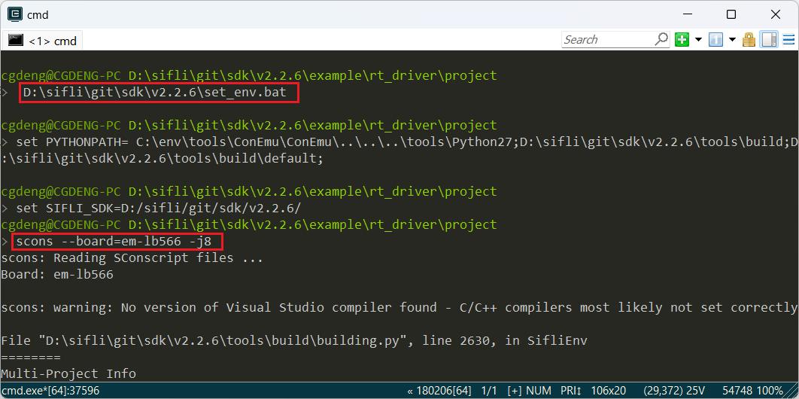<br>
### 1.2 Enter BOOT mode
Pull BOOT_MODE high to 3.3V, and the 566 enters `boot` mode for downloading. As shown below, short BOOT_MODE to pull it up to 3.3V.<br>
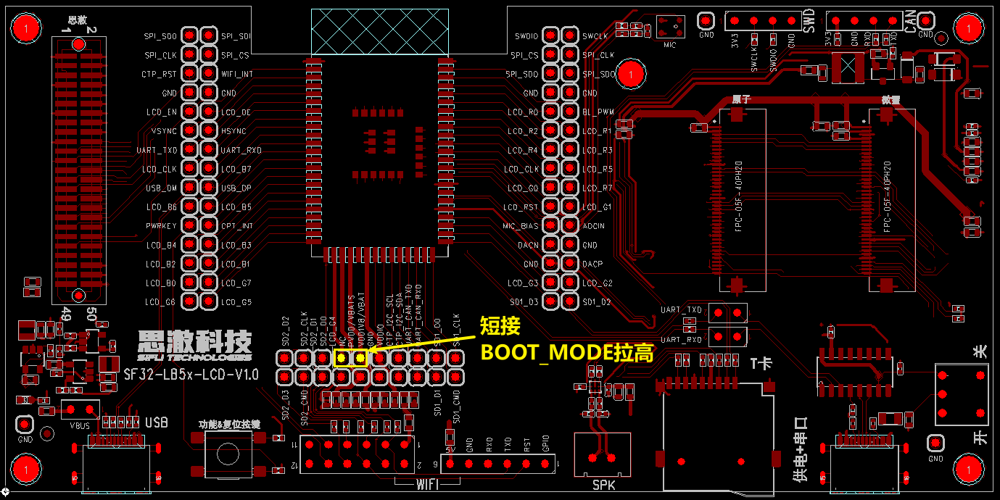<br>
After entering boot mode, the serial port will output the following Log. Entering the command `help` will also produce Log output, indicating that the serial MCU is running normally and serial communication is normal. Click to disconnect the serial port and prepare for downloading.<br>
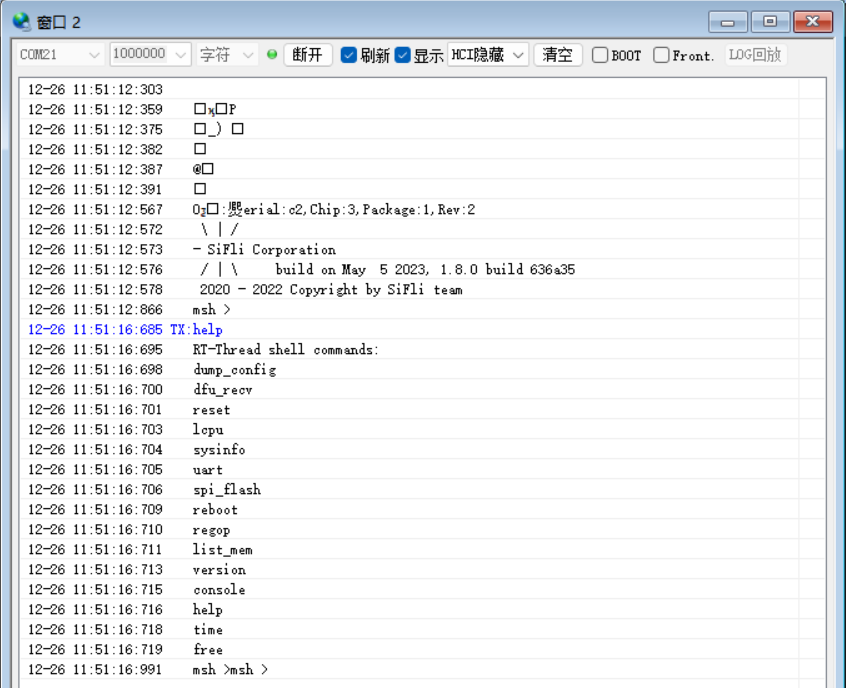<br>
### 1.3 Download
```
> build_em-lb566\uart_download.bat

     Uart Download

please input the serial port num:21 #然后选择1.2步骤中验证可以输出Log的串口号进行下载 
```
### 1.4 Confirm normal logs
Remove the shorting jumper used in step 1.2, power on and reset the board, and let the MCU run the user program. If the following Log is output, it indicates that the development board is running normally. You can then proceed to the next step to add a new screen module.<br>
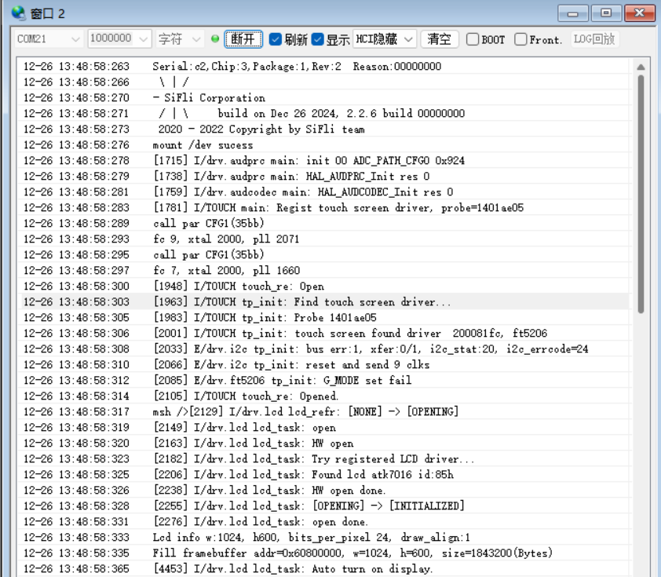
## 2 Add the NV3052C screen driver
### 2.1 Create the NV3052C driver
1) Display driver location<br>
The display driver is located in the `sdk\customer\peripherals` directory.<br>
2) Copy the driver<br>
Copy another driver for the `dpi` interface and rename it to `dpi_nv3052c`.<br>
### 2.2 Add NV3052C in Menuconfig
1) Modify Kconfig to generate an option for this screen in menuconfig.<br>
Open sdk\customer\boards\Kconfig_lcd with a text editor, and add an option and resolution for a DPI screen as follows:<br>
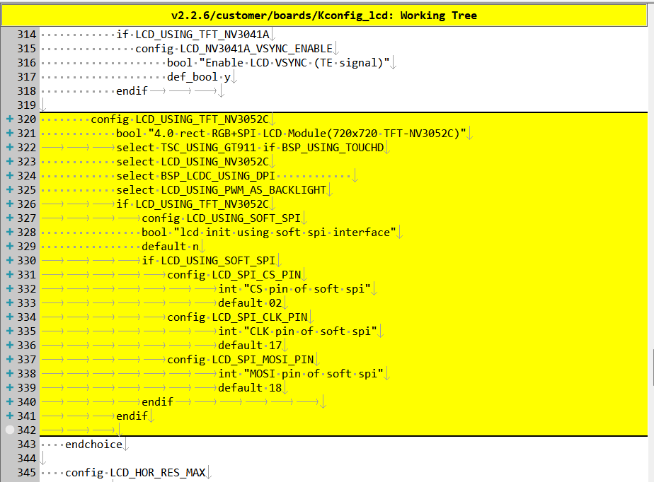<br>
```
# menuconfig 生成菜单呈现的选项
        config LCD_USING_TFT_NV3052C
            bool "4.0 rect RGB+SPI LCD Module(720x720 TFT-NV3052C)"     #menuconfig中显示的字符
			select TSC_USING_GT911 if BSP_USING_TOUCHD      #如果有TP可以打开，对应TP的驱动是否编译依赖此宏
            select LCD_USING_NV3052C        #spi_nv3052c文件夹内文件是否的编译依赖于此宏
            select BSP_LCDC_USING_DPI       #选择DPI接口      
            select LCD_USING_PWM_AS_BACKLIGHT #是否打开屏的PWM背光，有背光的屏需要打开
			if LCD_USING_TFT_NV3052C
				config LCD_USING_SOFT_SPI #选择DPI屏是否需要SPI进行初始化
                bool "lcd init using soft spi interface" #menuconfig中显示的字符
                default n
				if LCD_USING_SOFT_SPI
					config LCD_SPI_CS_PIN # 软件SPI中CS脚
							int "CS pin of soft spi" #menuconfig中显示的字符
							default 02 #默认PA02
					config LCD_SPI_CLK_PIN  # 软件SPI中CLK脚
							int "CLK pin of soft spi" #menuconfig中显示的字符
							default 17 #默认PA17,如果PB口+96,例如PB02这里配置为98
					config LCD_SPI_MOSI_PIN # 软件SPI中MOSI脚
							int "MOSI pin of soft spi" #menuconfig中显示的字符
							default 18 #默认PA18
				endif						
			endif
# LCD_HOR_RES_MAX 配置为该屏的水平分辨率 
        default 720 if LCD_USING_TFT_NV3052C
# LCD_VER_RES_MAX 配置为该屏的垂直分辨率        
        default 720 if LCD_USING_TFT_NV3052C
# LCD_DPI 像素密度，为屏一英寸多少个像素点，不知道就填默认315
        default 315 if LCD_USING_TFT_NV3052C
```
2) Add LCD_USING_NV3052C<br>
Open the file `sdk\customer\peripherals\Kconfig` with a text editor, and add the following:<br>
```
config LCD_USING_NV3052C #添加该配置，Kconfig中才能select上
    bool
    default n
```
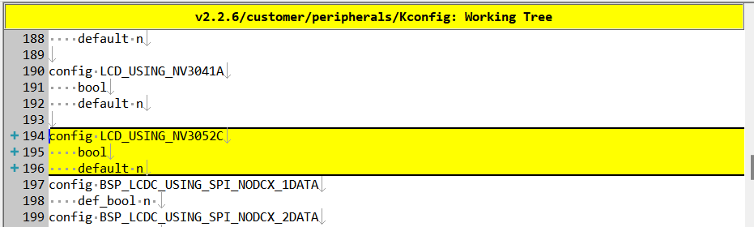<br>
3) Modify SConscript<br>
Open the file `customer\peripherals\dpi_nv3052c\SConscript` in a text editor and modify the macro `LCD_USING_NV3052C`, so that the *.c and *.h files in this directory can be included in the build<br>
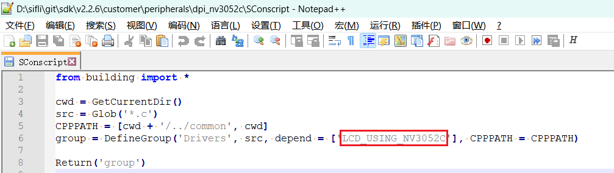<br>
### 2.3 Select NV3052C in Menuconfig
After completing the preceding steps, enter the following command in the build window and select the newly added nv3052c screen<br>
> `menuconfig --board=em-lb566` (open the menuconfig window)
Under this path `(Top) → Config LCD on board → Enable LCD on the board → Select LCD`, select the newly added screen. An example is shown below. If this DPI screen has an SPI interface that needs to be initialized, then select `lcd init using soft spi interface` and configure the three IO ports used by SPI. After saving and exiting, the screen driver in the dpi_nv3052c directory is selected to participate in the build<br>
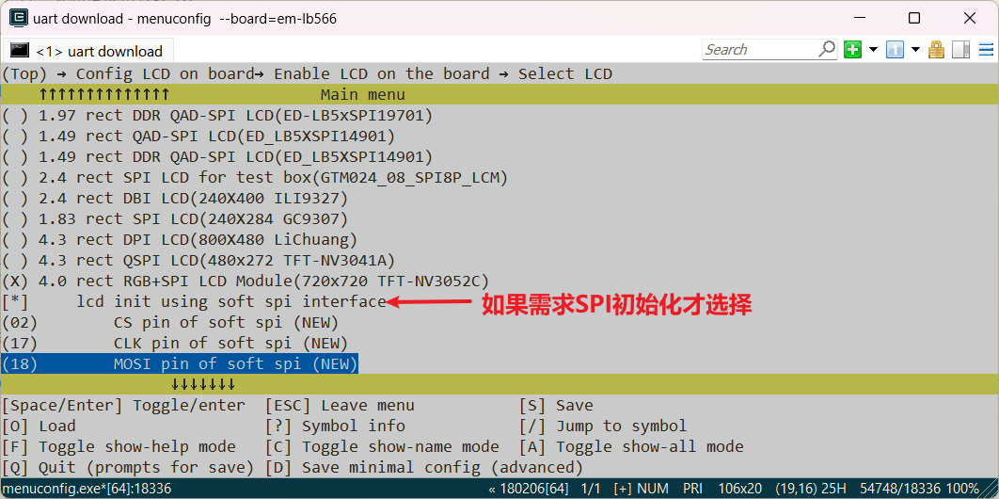<br>
## 3 Generate the Source Insight project  
To make it easier to view the code included in the build, you can generate a file list for the entire rt-driver project and import it into Source Insight. You can skip this section.
### 1 Generate the file list
Run the command `scons --board=em-lb566 --target=si` to generate `si_filelist.txt`<br>
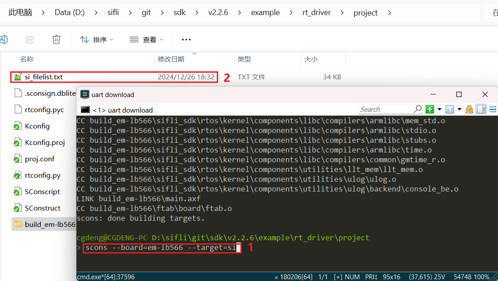<br>
### 2 Import the file list
Open Source Insight and import `si_filelist.txt` into the project.<br>  
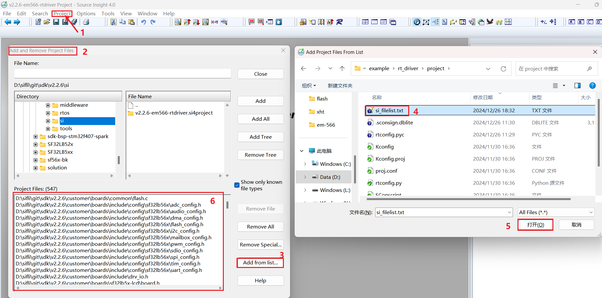<br>
### 3 Check whether the screen driver has taken effect
You can check in the SI (Source Insight) project whether the corresponding macro in `rtconfig.h` has been generated and whether `dpi_nv3052c.c` has been included in the build  
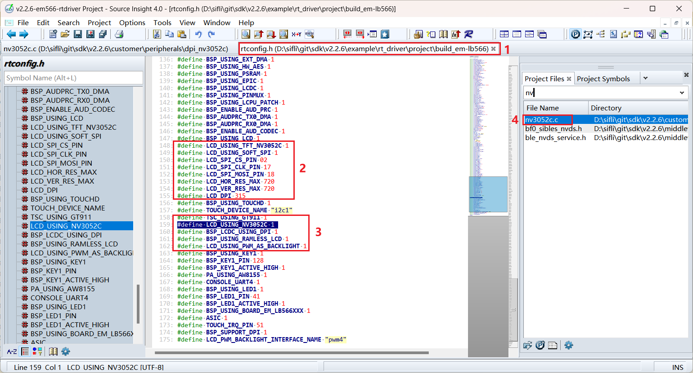<br>
## 4 Screen hardware connection
### 4.1 FFC connection
If you purchased a matching screen module, connect the FFC directly to the connector<br>
### 4.2 Fly-wire connection
If the FPC pin arrangement of the new screen module is inconsistent, you need to design an FPC adapter board yourself or debug using jumper wires from the pin headers.  
For the adapter board design, refer to [SF32LB52-DevKit-LCD Adapter Board Fabrication Guide](../../board/sf32lb52x/SF32LB52-DevKit-LCD-Adapter.md#qspi-lcd接口转接板)  
## 5 Screen driver configuration
### 5.1 Default IO configuration
If the default IO is used, you can skip this section
#### 5.1.1 IO mode settings
The LCD uses the LCDC1 hardware to output waveforms and must be configured to the corresponding FUNC mode.<br>
For the available Funtion of each IO, refer to the hardware document [Download SF32LB56X_Pin_config](./assets/SF32_LB56_MOD_pinconfig_20240717.xlsx)<br>
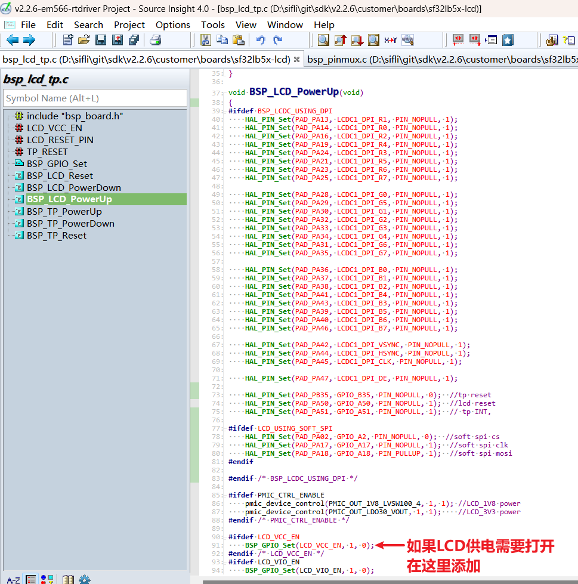<br>
The RESET pins of both the LCD and TP use GPIO mode, so they are already configured as GPIO mode by default. If the LCD power supply needs to be turned on separately, it also needs to be turned on here.
```c
void BSP_LCD_PowerUp(void)
{
#ifdef BSP_LCDC_USING_DPI
    HAL_PIN_Set(PAD_PA13, LCDC1_DPI_R1, PIN_NOPULL, 1);
    HAL_PIN_Set(PAD_PA14, LCDC1_DPI_R0, PIN_NOPULL, 1);
    HAL_PIN_Set(PAD_PA16, LCDC1_DPI_R2, PIN_NOPULL, 1);
    HAL_PIN_Set(PAD_PA19, LCDC1_DPI_R4, PIN_NOPULL, 1);
    HAL_PIN_Set(PAD_PA24, LCDC1_DPI_R3, PIN_NOPULL, 1);
    HAL_PIN_Set(PAD_PA21, LCDC1_DPI_R5, PIN_NOPULL, 1);
    HAL_PIN_Set(PAD_PA23, LCDC1_DPI_R6, PIN_NOPULL, 1);
    HAL_PIN_Set(PAD_PA25, LCDC1_DPI_R7, PIN_NOPULL, 1);

    HAL_PIN_Set(PAD_PA28, LCDC1_DPI_G0, PIN_NOPULL, 1);
    HAL_PIN_Set(PAD_PA29, LCDC1_DPI_G5, PIN_NOPULL, 1);
    HAL_PIN_Set(PAD_PA30, LCDC1_DPI_G1, PIN_NOPULL, 1);
    HAL_PIN_Set(PAD_PA32, LCDC1_DPI_G2, PIN_NOPULL, 1);
    HAL_PIN_Set(PAD_PA33, LCDC1_DPI_G3, PIN_NOPULL, 1);
    HAL_PIN_Set(PAD_PA34, LCDC1_DPI_G4, PIN_NOPULL, 1);
    HAL_PIN_Set(PAD_PA31, LCDC1_DPI_G6, PIN_NOPULL, 1);
    HAL_PIN_Set(PAD_PA35, LCDC1_DPI_G7, PIN_NOPULL, 1);

    HAL_PIN_Set(PAD_PA36, LCDC1_DPI_B0, PIN_NOPULL, 1);
    HAL_PIN_Set(PAD_PA37, LCDC1_DPI_B1, PIN_NOPULL, 1);
    HAL_PIN_Set(PAD_PA38, LCDC1_DPI_B2, PIN_NOPULL, 1);
    HAL_PIN_Set(PAD_PA41, LCDC1_DPI_B4, PIN_NOPULL, 1);
    HAL_PIN_Set(PAD_PA43, LCDC1_DPI_B3, PIN_NOPULL, 1);
    HAL_PIN_Set(PAD_PA39, LCDC1_DPI_B5, PIN_NOPULL, 1);
    HAL_PIN_Set(PAD_PA40, LCDC1_DPI_B6, PIN_NOPULL, 1);
    HAL_PIN_Set(PAD_PA46, LCDC1_DPI_B7, PIN_NOPULL, 1);

    HAL_PIN_Set(PAD_PA42, LCDC1_DPI_VSYNC, PIN_NOPULL, 1);
    HAL_PIN_Set(PAD_PA44, LCDC1_DPI_HSYNC, PIN_NOPULL, 1);
    HAL_PIN_Set(PAD_PA45, LCDC1_DPI_CLK, PIN_NOPULL, 1);

    HAL_PIN_Set(PAD_PA47, LCDC1_DPI_DE, PIN_NOPULL, 1);

    HAL_PIN_Set(PAD_PB35, GPIO_B35, PIN_NOPULL, 0);    // tp reset
    HAL_PIN_Set(PAD_PA50, GPIO_A50, PIN_NOPULL, 1);    // lcd reset
    HAL_PIN_Set(PAD_PA51, GPIO_A51, PIN_NOPULL, 1);    // tp INT,

#ifdef LCD_USING_SOFT_SPI
    HAL_PIN_Set(PAD_PA02, GPIO_A2, PIN_NOPULL, 0);     // soft spi cs
    HAL_PIN_Set(PAD_PA17, GPIO_A17, PIN_NOPULL, 1);    // soft spi clk
    HAL_PIN_Set(PAD_PA18, GPIO_A18, PIN_PULLUP, 1);    // soft spi mosi
#endif

#endif /* BSP_LCDC_USING_DPI */

#ifdef PMIC_CTRL_ENABLE
    pmic_device_control(PMIC_OUT_1V8_LVSW100_4, 1, 1); // LCD_1V8 power
    pmic_device_control(PMIC_OUT_LDO30_VOUT, 1, 1);    // LCD_3V3 power
#endif /* PMIC_CTRL_ENABLE */

#ifdef LCD_VCC_EN
    BSP_GPIO_Set(LCD_VCC_EN, 1, 0);                    //如果LCD供电需要打开，在这里添加
#endif /* LCD_VCC_EN */
#ifdef LCD_VIO_EN
    BSP_GPIO_Set(LCD_VIO_EN, 1, 0);
#endif
}
```
#### 5.1.2 IO power-on/off operations
The following is the LCD initialization process after power-on:<br>
`rt_hw_lcd_ini->api_lcd_init->lcd_task->lcd_hw_open->BSP_LCD_PowerUp-find_right_driver->LCD_drv.LCD_Init->LCD_drv.LCD_ReadID->lcd_set_brightness->LCD_drv.LCD_DisplayOn`<br>
You can see that `BSP_LCD_PowerUp` after power-on occurs before display driver initialization `LCD_drv.LCD_Init`.<br>
Therefore, before initializing the LCD, ensure that the LCD power supply has been enabled in BSP_LCD_PowerUp.<br>
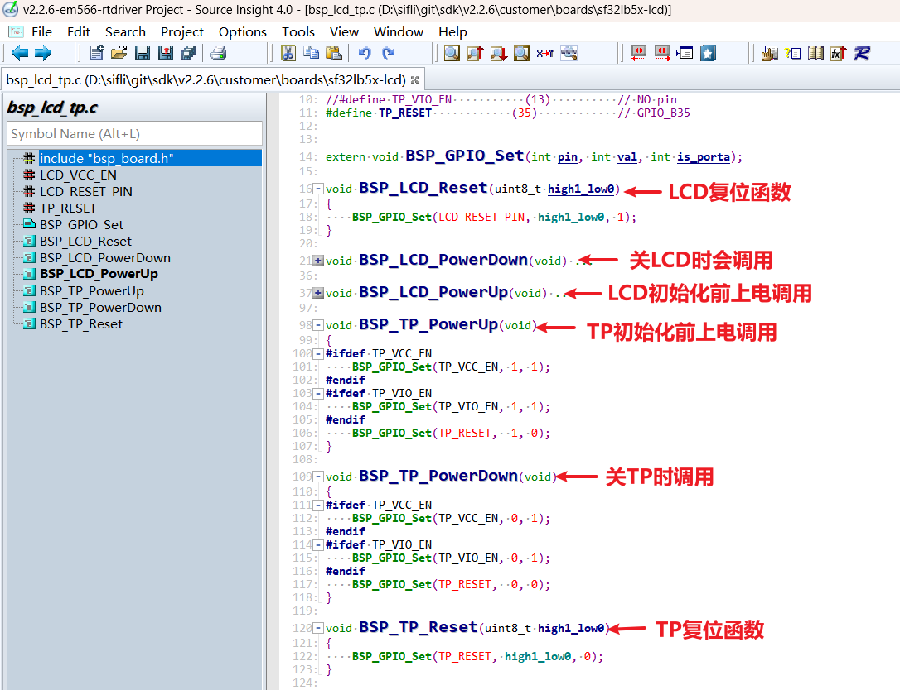<br>
#### 5.1.3 Backlight PWM configuration
There is a default configuration in the pwm software, configured in `customer\boards\sf32lb5x-lcd\Kconfig.board`. After compilation, this `Kconfig.board` configuration generates the following three macros in `rtconfig.h`<br>
```c
//PWM4需要打开GPTIM3，PWM和TIMER对应关系，可以查看FAQ的PWM部分或者文件`pwm_config.h`<br>
#define LCD_PWM_BACKLIGHT_INTERFACE_NAME "pwm3" 
#define LCD_PWM_BACKLIGHT_CHANEL_NUM 4 //Channel 4
#define LCD_BACKLIGHT_CONTROL_PIN 119 //PB23: 96+23 
```
Using PWM4 requires enabling GPTIM3, and it must also be enabled in Lcpu (otherwise Lcpu may disable GPTIM3). Also confirm whether the following macros in `rtconfig.h` take effect<br>
```c
#define BSP_USING_GPTIM3 1 //如果用PWM3，需要menuconfig --board=em-lb566打开
#define RT_USING_PWM 1
#define BSP_USING_PWM 1
#define BSP_USING_PWM4 1 //如果没有，需要menuconfig --board=em-lb566打开
```
The following shows the correspondence between `pwm4` and `GPTIM3` (located in Lcpu) in `pwm_config.h`<br>
```c
#ifdef BSP_USING_PWM4
#define PWM4_CONFIG                             \
    {                                           \
       .tim_handle.Instance     = GPTIM3,         \
       .tim_handle.core         = PWM4_CORE,    \
       .name                    = "pwm4",       \
       .channel                 = 0             \
    }
#endif /* BSP_USING_PWM4 */
```
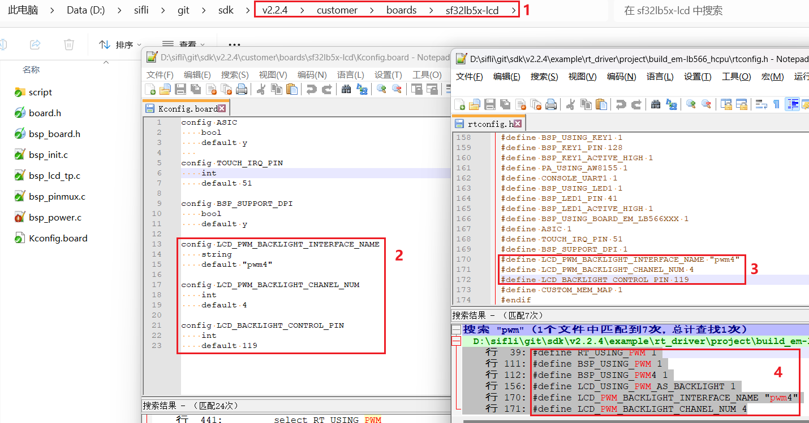<br>
By default, the software outputs the PWM waveform from PB23 through the `"pwm4"` device of `GPTIM3`. The default configuration is in<br>
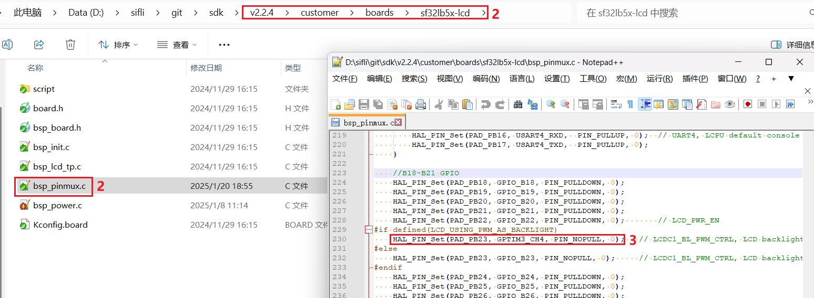<br>
```c
HAL_PIN_Set(PAD_PB23, GPTIM3_CH4, PIN_NOPULL, 0);   // LCDC1_BL_PWM_CTRL, LCD backlight PWM
```
**Note:**<br>
After configuration through the function `HAL_PIN_Set`, the mapping between GPTIM3_CH4 and PB23 is established. This is specifically reflected in the register configuration `hwp_lpsys_cfg->GPTIM3_PINR`, as shown below:<br>
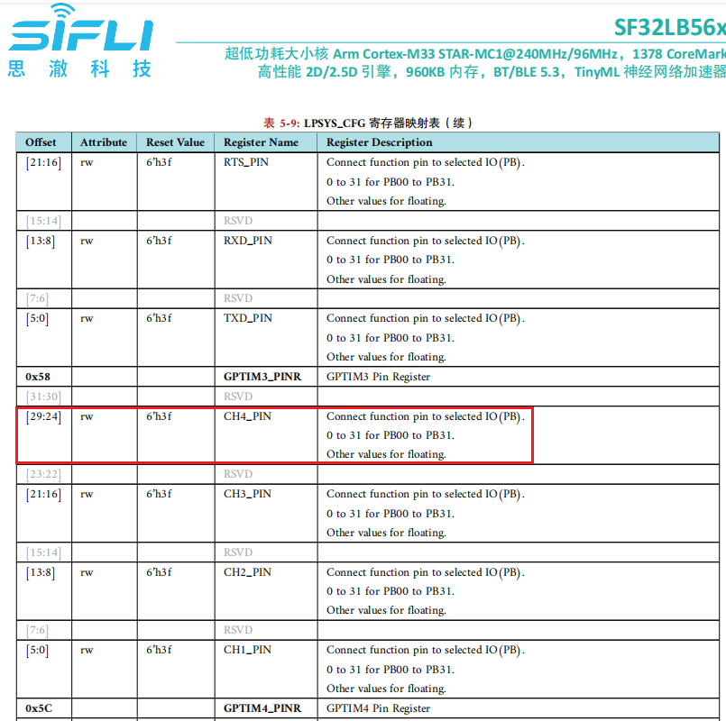<br>
It can be seen that CH1-CH4 output can be configured, and the pins must be PB00-PB31. In addition, when Hcpu uses the TIMER resource of Lcpu, Lcpu also needs to enable `#define BSP_USING_GPTIM3 1`; otherwise, in earlier SDK code `drv_common.c`, `RCC_MOD_GPTIM3` will be disabled, causing PWM4 to have no output<br>
```c
#if !defined(BSP_USING_GPTIM3) && !defined(BSP_USING_PWM4)
    HAL_RCC_DisableModule(RCC_MOD_GPTIM3); //关闭GPTIM3的时钟
#endif /* !BSP_USING_GPTIM3 */
```
### 5.2 Screen driver reset timing
The following delays in the LCD_Init function in nv3052c.c are critical. Modify them carefully according to the initialization timing in the relevant screen driver IC documentation.
```c
    BSP_LCD_Reset(1);
    rt_thread_delay(10);
    BSP_LCD_Reset(0);       //Reset LCD
    rt_thread_delay(5);
    BSP_LCD_Reset(1);
    rt_thread_delay(80);
```
### 5.3 Screen driver register modification
Some DPI-interface screens do not require SPI initialization and do not need the `LCD_USING_SOFT_SPI` macro enabled. After the screen driver IC is powered on and reset, RGB data can be sent to the data lines. Some DPI screens require the SPI interface to initialize register configuration parameters first. The initialization register configuration varies between screen driver ICs. Write to the screen driver IC in sequence according to the register parameters provided by the screen vendor and their SPI timing. Pay special attention to the required delay length after registers 0x11 and 0x29<br>
```c
static void LCD_Init(LCDC_HandleTypeDef *hlcdc)
{
...
#ifdef LCD_USING_SOFT_SPI

    rt_kprintf("LCD_Init soft spi\n");

    lcd_spi_config();

    uint8_t i = 0;
    init_config *init = (init_config *)&lcd_init_cmds[0];

    for (i = 0; i < buf_size; i++)   //init LCD reg
    {
        send_config(init->cmd, init->len, init->data);
        init++;
    }
    rt_thread_delay(60);
    spi_io_comm_write(0x29);         //Display on
    rt_thread_delay(60);
#endif
    rt_kprintf("LCD_Init end\n");
}
```
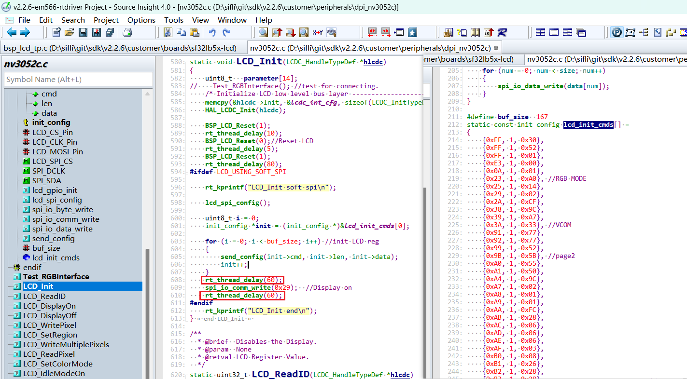<br>
### 5.4 Screen driver parameter configuration
- .lcd_itf: select LCDC_INTF_DPI_AUX to indicate DPI interface mode<br>
- .freq: select 35 * 1000 * 1000, indicating that the DPI clk main frequency is 35 MHz. Choose this clock according to the maximum clock supported by the screen driver IC. A higher value shortens the data transfer time per frame and increases the frame rate<br>
- .color_mode: select RGB565 or RGB888 format<br>
```c
static LCDC_InitTypeDef lcdc_int_cfg =
{
    .lcd_itf = LCDC_INTF_DPI_AUX,
    .freq = 35 * 1000 * 1000,
    .color_mode = LCDC_PIXEL_FORMAT_RGB888,

    .cfg = {
        .dpi = {
            .PCLK_polarity = 0,
            .DE_polarity   = 0,
            .VS_polarity   = 1,
            .HS_polarity   = 1,
            .PCLK_force_on = 0,

            .VS_width      = 5,    // VLW
            .HS_width      = 2,    // HLW

            .VBP = 15,             // VBP
            .VAH = 720,
            .VFP = 16,             // VFP

            .HBP = 44,             // HBP
            .HAW = 720,
            .HFP = 44,             // HFP

            .interrupt_line_num = 1,
        },
    },
};
```
### 5.4 RGB interface fly-wire test function
When debugging with fly wires, there are many RGB data lines. Incorrect wiring may cause no display or abnormal display. You can use the following RGB interface test function to output waveforms in the order R0-R7, G0-G7, B0-B7, and capture the waveforms with a logic analyzer to check whether the fly-wire connections are correct<br>
```c
Test_RGBInterface(); //test for connecting.
```
## 6 Build, program, download, and results
### 6.1 Display result
As shown below, if the display is normal, 6 images will be displayed in sequence, looping every 3 seconds.<br>
<br>
