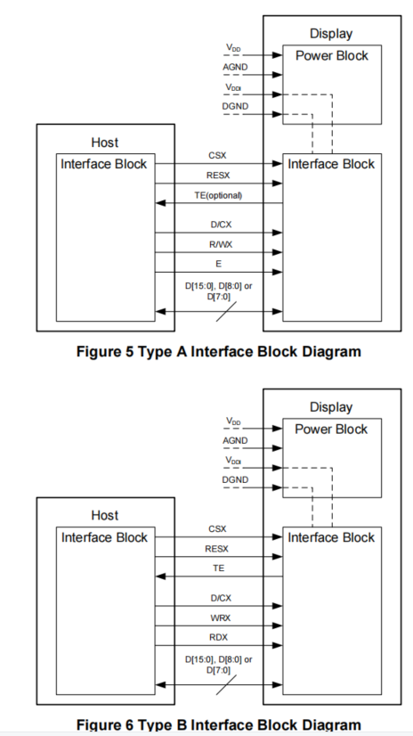
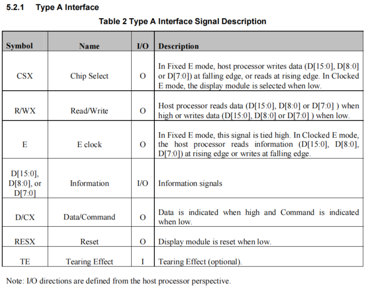
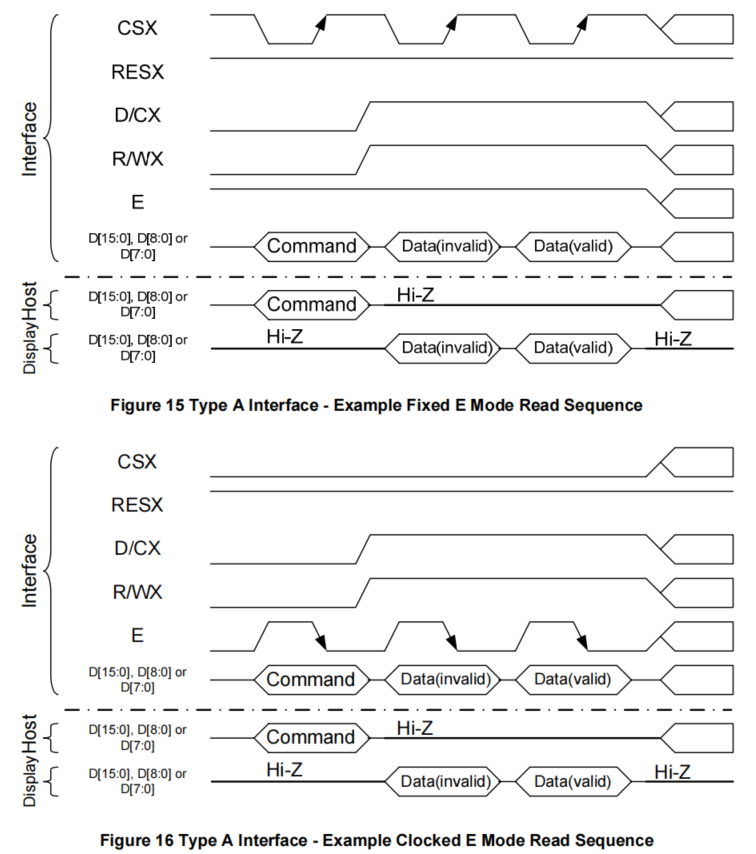
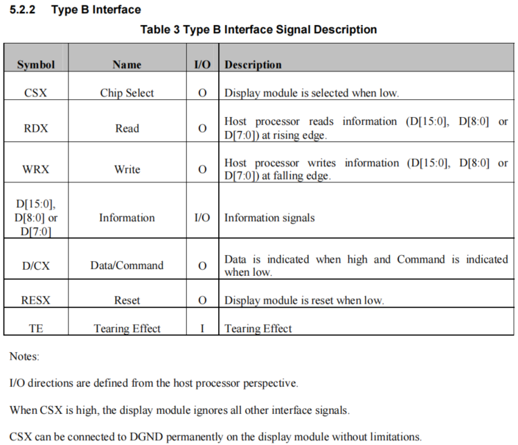

# DBI screen parameter configuration
## Screen parameter configuration explanation

### **MCU/8080 interface**
 * The MCU/8080 interface is also the DBI (Display Bus Interface) mode, which is divided into TYPE A and TYPE B. The figure below shows the connection methods for the two different interfaces,
 The main difference is that TYPE A mode combines the read and write signals into a single R/WX signal and adds an E signal. Mode A is further divided into Fixed E mode and Clocked E mode,
 In Fixed E mode, the E signal is fixed at high level 1, and sampling is controlled by the CS signal,
 In Clocked E mode, sampling is controlled by the E signal. The platform is currently configured to this mode by default

  
* The following describes the ports of the two interfaces
1. TYPE A



2. Difference between Fixed E and Clocked E in TYPE A mode



The following is the configuration for DBI TYPE A mode
```c
static const LCDC_InitTypeDef lcdc_int_cfg =
{
    .lcd_itf = LCDC_INTF_DBI_8BIT_A, /* DBI type A Clocked E模式 */
    .color_mode = LCDC_PIXEL_FORMAT_RGB565,
};
```

3. TYPE B



The following is the configuration for DBI TYPE B mode
```c
static LCDC_InitTypeDef lcdc_int_cfg_dbi =
{
    .lcd_itf = LCDC_INTF_DBI_8BIT_B, /* DBI type B 模式 */
    .freq = 36000000,
    .color_mode = LCDC_PIXEL_FORMAT_RGB565,

    .cfg = {
        .dbi = {
            .RD_polarity = 0, /* RD 极性选择*/
            .WR_polarity = 0, /* RD 极性选择*/
            .RS_polarity = 0, /* RD 极性选择*/
            .CS_polarity = 0, /* RD 极性选择*/
#ifdef LCD_RM69330_VSYNC_ENABLE
            .syn_mode = HAL_LCDC_SYNC_VER,
#else
            .syn_mode = HAL_LCDC_SYNC_DISABLE,
#endif /* LCD_RM69330_VSYNC_ENABLE */
            .vsyn_polarity = 1, /* Vsnc场同步信号，极性选择（TE打开后才生效）*/
            //default_vbp=2, frame rate=82, delay=115us,
            //TODO: use us to define delay instead of cycle, delay_cycle=115*48
            .vsyn_delay_us = 0, /* （Vsync）TE信号来后，延时多久才是送屏（TE打开后才生效） */
            .hsyn_num = 0,  /* （Vsync）TE信号来后，几个clk脉冲后，延时几个clk后再送屏（TE打开后才生效） */
        },
    },

};
```
