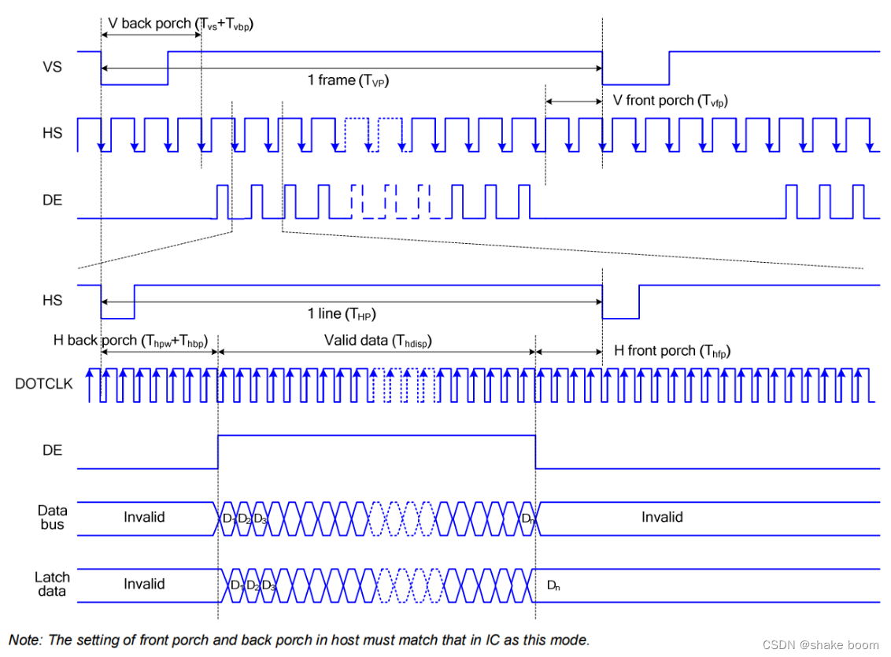
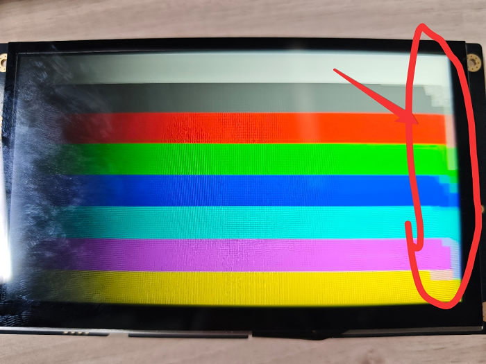

# DPI screen parameter configuration

## Screen parameter configuration explanation
### **DPI/RGB interface**
RGB LCD screens generally have two data synchronization methods: one is the horizontal/vertical synchronization mode (HV Mode), and the other is data enable
synchronization mode (DE Mode). When the horizontal/vertical synchronization mode is selected, the horizontal synchronization signal (HSYNC) and the vertical synchronization signal (VSYNC) are used as the data synchronization
signal. At this time, the data enable signal (DE) must be at a low level.
When DE synchronization mode is selected, the LCD's DE signal is used as the data valid signal, as shown by DE in the example figure
signal. The DE signal is valid (high level) only when both the active frame display area and the active line display area are being scanned. When DE
synchronization mode is selected, the horizontal and vertical synchronization signals VS and HS must be high level.
Because RGB LCD screens generally support DE mode, but not all RGB LCD screens support HV mode, this chapter
introduces how to drive an LCD screen using DE synchronization.
                        
```c
static LCDC_InitTypeDef lcdc_int_cfg =
{
    .lcd_itf = AUTO_SELECTED_DPI_INTFACE,
/*
    DPI的clk频率选择，频率为hcpu主频分频后的频率，比如hcpu主频240Mhz，能够得到的频率只能为40/48/60/80,如果设置62Mhz，实际会设置为60Mhz
*/    
    .freq = 48 * 1000 * 1000,
/*
DPI接口输出的颜色格式
1. LCDC_PIXEL_FORMAT_RGB565为常见的RGB565色
2. LCDC_PIXEL_FORMAT_RGB888为常见的RGB888色 
*/    
    .color_mode = LCDC_PIXEL_FORMAT_RGB888,

    .cfg = {
        .dpi = {
            .PCLK_polarity = 0, /* 选择DPI波形中Pclk（像素时钟信号线）的极性 */
            .DE_polarity   = 0, /* 选择DPI波形中DE（数据使能信号）的极性 */
            .VS_polarity   = 1, /* 选择DPI波形中VS（V sync 场同步信号）的极性 */
            .HS_polarity   = 1, /* 选择DPI波形中HS（H sync 行同步信号）的极性 */

            .VS_width      = 2,  /* 选择VS（场同步信号）持续的宽度，单位为（几个HS波形） */
            .HS_width      = 2, /* 选择HS（行同步信号）持续的宽度，单位为（几个Pclk波形） */
            .VBP = 23,   /* VBP（V back porch 帧显示后沿或后肩）的宽度，单位为（几个HS波形） */
            .VAH = 600, /* 选择屏的垂直高度，单位为（行） */
            .VFP = 12,   /* VFP（V front proch 帧显示前沿或前肩）的宽度，单位为（几个HS波形）*/

            .HBP = 160,  /* HBP（H back porch 行显示后沿或后肩）的宽度，单位为（几个Pclk波形）*/
            .HAW = 1024, /* 选择屏的水平宽度，单位为（列） */
            .HFP = 160,  /*  HFP（H front porch 行显示前沿或前肩）的宽度，单位为（几个Pclk波形）*/

            .interrupt_line_num = 1,
        },
    },
};
```

According to the polarity configuration of PCLK,DE,VS,HS above, the corresponding waveform shown in the figure below can be output:

[Reference article:](https://blog.csdn.net/weixin_50965981/article/details/134496428)(https://blog.csdn.net/weixin_50965981/article/details/134496428)https://blog.csdn.net/weixin_50965981/article/details/134496428
***


## Bandwidth requirements
DPI screen refresh has requirements on the read stability of the RAM where the framebuffer resides. Therefore, try to ensure that this RAM is used only for screen refresh and not for other operations, such as frequently accessed global variables, thread stacks, or buffers accessed by other DMA engines. Otherwise, display abnormalities may occur, including black lines or jitter on the right side of the screen.

Generally, SRAM bandwidth is sufficient and does not need to be specified separately, but PSRAM bandwidth may be insufficient. Therefore, if the refresh buffer is in PSRAM, it is best to meet the conditions described above.

As shown in the figure, this is the flashing screen that appears when the buffer is placed in PSRAM and the bandwidth is insufficient (the bandwidth is insufficient because the CPU is filling the next frame's framebuffer in PSRAM).



## Usage restrictions of DPI_AUX mode
If your screen width is ≤512 pixels, this mode will not be used, so you do not need to consider this section.

If your screen width is ≤1024 pixels and you are using a 58x chip, you also do not need to consider this section.


### What is DPI_AUX
For the DPI screen interface, the macro `AUTO_SELECTED_DPI_INTFACE` automatically selects one of the following two modes according to the chip and screen width:

- **DPI mode**<br>
In the LCD controller native mode, the maximum supported screen width is 1024 on 58x, and 512 on others.

- **DPI_AUX mode**<br>
An auxiliary mode designed for screens that exceed the width of the LCD controller native mode.

### Usage restrictions
When using DPI_AUX mode, the following restrictions apply:

#### 1. Do not enable automatic system frequency reduction (BSP_PM_FREQ_SCALING)
Automatic frequency reduction affects the operation of the hardware refresh mechanism. Frequency reduction is allowed only after the screen is turned off.
#### 2. The framebuffer must be full-screen and have an even number of lines
#### 3. The following arrays must be placed in SRAM, but not in the retention-SRAM section

ramless_code, sram_data0, and sram_data1 in drv_lcd.c
* 55x: avoid placing them in 0x00020000 ~ 0x00030000
* 56x: avoid placing them in 0x20000000 ~ 0x20020000

:::{note}
After SDK 2.2.4, these arrays are changed to automatically allocate non-retention-SRAM memory from the system heap.
:::
#### 4. The following hardware modules must remain occupied during screen refresh:

56x:
1. One regular DMA channel (configurable, default DMA1-CH5)
2. EXTDMA
3. PTC module
4. BUSMONITOR
5. BTIM2

55x:
1. One regular DMA channel (configurable, default DMA1-CH8)
2. EXTDMA
3. PTC module
4. BUSMONITOR
5. BTIM1, BTIM2

Code earlier than SDK 2.5 does not automatically allocate an available DMA channel; you need to allocate it manually.
In bf0_hal_lcdc.c, two macros determine which channel in DMA1 is used (for example, using channel7 of DMA1):
```c
#define  p_DMACH0  DMA1_Channel7
#define PTC_DMACH0_TC PTC_HCPU_DMAC1_DONE7
```

```{caution}
1. For NAND systems, enable PSRAM_CACHE_WB to avoid EXTDMA usage conflicts
2. Avoid using lvgl lv_scheme0 (LV_FRAME_BUF_SCHEME_0) to avoid EXTDMA usage conflicts
3. Avoid using sifli_memcpy and sifli_memset to avoid EXTDMA usage conflicts
4. In dma_config.h, avoid DMA channel conflicts according to the current DMA channel usage of modules such as SPI\UART\I2C\I2S
```
