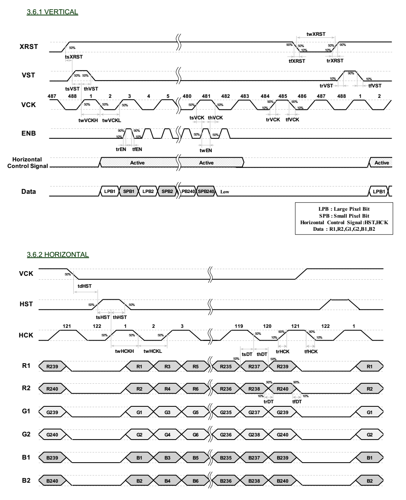

# JDI screen parameter configuration
JDI screens have two interfaces: parallel (JDI_PARALLEL) and serial (JDI_SERIAL).


## Parallel (JDI_PARALLEL)
The parallel interface is currently more common. It generally requires LCDC to work together with one LP-PWM:

1. LP-PWM (Low power PWM, supports PWM waveform output while the system is sleeping) is used to output the refresh clock XFRP/FRP/VCOM. After 58x, one LP-PWM can control two pins to output opposite waveforms
1. LCDC (LCD Controller) is used to output pixel data and other control signals


### Parameter configuration explanation
Take the timing diagram of the screen shown in the figure below as an example. This is a 240x240 screen, and the parameter configuration required for this timing diagram is as follows:

```c
static LCDC_InitTypeDef lcdc_int_cfg =
{
    .lcd_itf = LCDC_INTF_JDI_PARALLEL,
    .freq = 746268, //HCK frequency

    /* 
        Useless parameter for JDI PARALLEL interface, 
        used to pass the format checking here. 
    */ 
    .color_mode = LCDC_PIXEL_FORMAT_RGB565, 

    .cfg = {
        .jdi = {
            .bank_col_head = 0, //Vertical Blanking pixles at the head
            .valid_columns = 240, //Vertical valid pixles
            .bank_col_tail = 4, //Vertical Blanking pixles at the tail

            .bank_row_head = 0, //Horizontal Blanking rows at the head
            .valid_rows = 240, //Horizontal valid rows
            .bank_row_tail = 4, //Horizontal Blanking rows at the tail

            /* 
                ENB will be active during column [64~190]
            */
            .enb_start_col = 32, 
            .enb_end_col = 95,
        },
    },

};
```

- `bank_col_head`, `valid_columns`, `bank_col_tail`, `bank_row_head`, `valid_rows`, `bank_row_tail` are all specified in pixels. Note that on the timing diagram, every 2 VCK edges in the vertical direction make up one pixel, while every 1 HCK edge in the horizontal direction corresponds to two pixels.
- `enb_start_col` and `enb_end_col` are the start and end columns of the ENB signal divided by 2. This configuration is not strictly specified in most datasheets, but their range is [0, (bank_col_head+valid_columns+bank_col_tail)/2]


### Refresh clock
Inside the [LCD_DisplayOn](lcd-cb-func-LCD-DisplayOn) and [LCD_DisplayOff](lcd-cb-func-LCD-DisplayOff) functions, an externally defined rt_device name (`JDI_FRP_LPPWM_INTERFACE_NAME`) is used to start and stop the PWM device output. The purpose is to switch the FRP/XFRP/VCOM output on and off.

The PWM clock frequency is set through the `rt_pwm_set` interface. The following code shows a 60 Hz, 50% duty cycle output setting:
```c

/**
  * @brief  Enables the Display.
  * @param  None
  * @retval None
  */
static void LCD_DisplayOn(LCDC_HandleTypeDef *hlcdc)
{
    /* Display On, enable the FRP&XFRP output */
#ifdef JDI_FRP_LPPWM_INTERFACE_NAME
    struct rt_device_pwm *device = (struct rt_device_pwm *)rt_device_find(JDI_FRP_LPPWM_INTERFACE_NAME);
    if (!device)
    {
        LOG_E("Can not find FRP LPPWM device:%s", JDI_FRP_LPPWM_INTERFACE_NAME);
    }
    else
    {
        if (0 == (device->parent.open_flag & RT_DEVICE_OFLAG_OPEN))
        {
            rt_device_open((struct rt_device *)device, RT_DEVICE_OFLAG_RDWR);
            rt_pwm_set(device, 1, 16 * 1000 * 1000, 8 * 1000 * 1000); // Set period to 16ms, pulse to 8ms
            rt_pwm_enable(device, 1); //Enable PWM output
        }
    }
#endif
}

/**
  * @brief  Disables the Display.
  * @param  None
  * @retval None
  */
static void LCD_DisplayOff(LCDC_HandleTypeDef *hlcdc)
{
    /* Display Off, disable the FRP&XFRP output */
#ifdef JDI_FRP_LPPWM_INTERFACE_NAME
    struct rt_device_pwm *device = (struct rt_device_pwm *)rt_device_find(JDI_FRP_LPPWM_INTERFACE_NAME);
    if (!device)
    {
        LOG_E("Can not find FRP LPPWM device:%s", JDI_FRP_LPPWM_INTERFACE_NAME);
    }
    else
    {
        if (device->parent.open_flag & RT_DEVICE_OFLAG_OPEN)
        {
            rt_pwm_disable(device, 1); //Disable PWM output
            rt_device_close((struct rt_device *)device);
        }
    }
#endif
}
```

## Serial (JDI_SERIAL)
We have not tested serial JDI so far, although it is supported by hardware.
