# SF32LB52x-DevKit-LCD example: adding an SPI-LCD (external)
### 1 Confirm that the rt-driver project runs normally  
It is recommended to use the rt-driver project for screen debugging. Before debugging, confirm that the rt-driver project can run normally and print logs<br>
#### 1.1 Build  
Enter the `example\rt_driver\project` directory, right-click and select `ComEmu_Here` to open a build command terminal, then execute the commands in sequence<br>
```
> D:\sifli\git\sdk\v2.2.4\set_env.bat   #设置编译环境路径
> scons --board=sf32lb52-lcd_n16r8 -j8   #指定sf32lb52-lcd_n16r8模块编译rt-driver工程
```
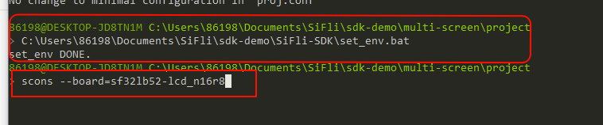<br>
#### 1.2 Enter BOOT mode
Confirm that the `sf32lb52-lcd_n16r8` module board enters `boot` mode for downloading. Operate as shown below<br>
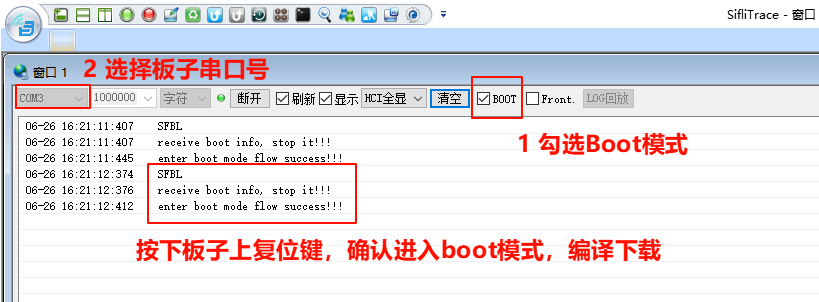<br>
#### 1.3 Download
```
> build_sf32lb52-lcd_n16r8\uart_download.bat

     Uart Download

please input the serial port num:7 #然后选择sf32lb52-lcd_n16r8模块连接的串口号进行下载 
```
#### 1.4 Confirm normal logs
As shown below, to run the user program, uncheck the option to enter `BOOT`. After confirming that the board is running, you can proceed to the next step to add a new screen module.<br>
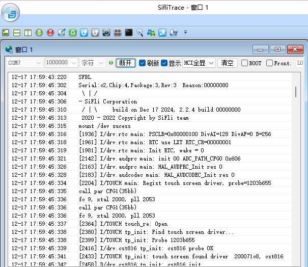
### 2 Add the gc9107 screen driver
#### 2.1 Create the gc9107 driver  
1) Add the project and modify the Kconfig.proj file in the new screen driver folder `sdk-demo`  <br>
Copy `SDK\example\rt_driver` (if you already have an external project, you can modify and add directly in the project), rename it with the screen driver name `multi_screen`, and place it outside the SDK. Then modify the `Konfig.proj` file in `project` to add the following content<br>
```
#APP specific configuration.

comment "------------Project configuration-----------"  

if !BSP_USING_BUILT_LCD
    ···
endif
```
2) Modify the `proj.conf` file  <br>
* Add `# CONFIG_BSP_USING_BUILTIN_LCD is not set` to `project\proj.conf` to use an external screen driver and disable the SDK built-in screen driver.<br>
If you want only a specific board to use an external screen driver, or to use the built-in screen driver, create a new file under the project directory, such as `sf32lb52-lcd_n16r8/proj.conf`, and add `# CONFIG_BSP_USING_BUILTIN_LCD is not set` or `CONFIG_BSP_USING_BUILTIN_LCD=y` to it
3) Copy the driver  <br>
The screen drivers in the SDK are located in `sdk\customer\peripherals`. Copy another driver with a `spi` interface into the newly created screen driver folder `sdk-demo` and rename it to `qspi_gc9107`<br>
#### 2.2 Add gc9107_Multi_screen in Menuconfig
1) Modify Kconfig to generate an option for this screen in menuconfig.<br>
Open `project\Kconfig.proj` in a text editor and add the option and resolution for this spi screen, as follows<br>
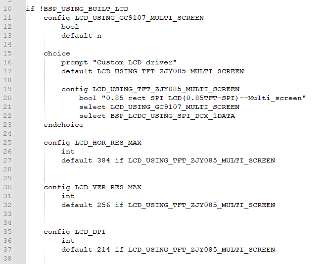<br>
```
# menuconfig 生成菜单呈现的选项
    choice
        prompt "Custom LCD driver"
        default LCD_USING_TFT_ZJY085_MULTI_SCREEN
		
        config LCD_USING_TFT_ZJY085_MULTI_SCREEN
            bool "0.85 rect SPI LCD(0.85TFT-SPI)--Multi_screen"   #menuconfig中显示的字符
            select LCD_USING_GC9107_MULTI_SCREEN   #spi_gc9107文件夹内文件是否的编译依赖于此宏
            select BSP_LCDC_USING_SPI_DCX_1DATA    #选择SPI接口
	endchoice

    config LCD_HOR_RES_MAX  #为屏的水平分辨率 
        int
        default 384 if LCD_USING_TFT_ZJY085_MULTI_SCREEN

    config LCD_VER_RES_MAX  #为屏的垂直分辨率
        int
        default 256 if LCD_USING_TFT_ZJY085_MULTI_SCREEN

    config LCD_DPI     #像素密度，为屏一英寸多少个像素点，不知道就填默认315
        int
        default 214 if LCD_USING_TFT_ZJY085_MULTI_SCREEN
```
2) Add LCD_USING_GC9107_MULTI_SCREEN<br>
Open the file `project\Kconfig.proj` in a text editor and add the following<br>
```
if !BSP_USING_BUILT_LCD

	config LCD_USING_GC9107_MULTI_SCREEN  #添加该配置，Kconfig中才能select上
		bool
		default n

endif
```
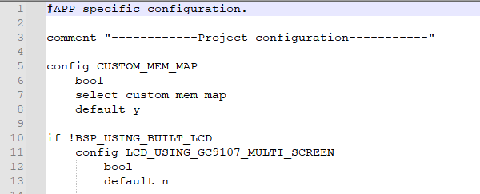<br>
3) Modify SConscript<br>
Open the file `gc9107_Multi_screen\SConscript` in a text editor and modify the macro `LCD_USING_GC9107_MULTI_SCREEN`, so that the *.c and *.h files in this directory can be included in the build<br>
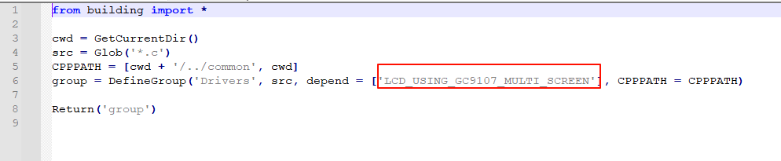<br>
#### 2.3 Select gc9107_Multi_screen in Menuconfig
After completing the above steps, enter the following command in the build window and select the newly added gc9107_Multi_screen screen<br>
 `menuconfig --board=sf32lb52-lcd_n16r8` (open the menuconfig window)
Under this path `(Top) →Custom LCD driver`, select the newly added screen. An example is shown below. Save and exit, and the screen driver in the spi_gc9107_Multi_screen directory will be selected to participate in the build<br>
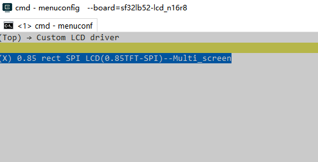<br>

### 3 Screen hardware connection
#### 3.1 FFC connection
If you purchased a matching screen module, simply connect the ribbon cable to the connector, as shown below.<br>
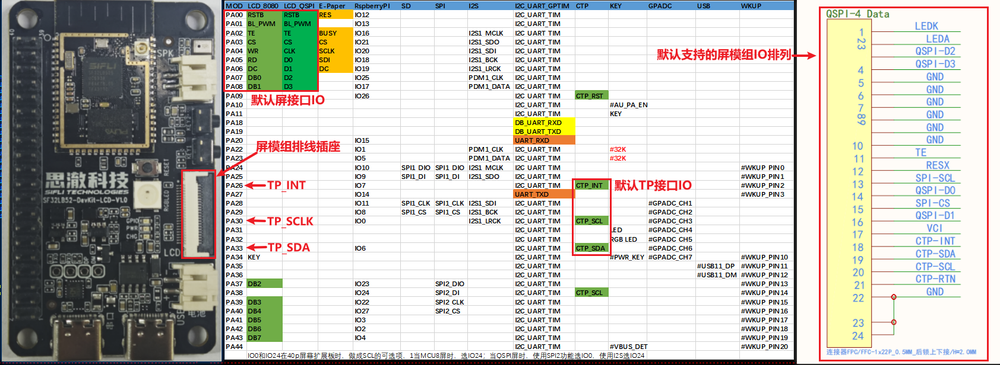<br>
#### 3.2 Fly-wire connection
If the FPC pin arrangement of the new screen module is inconsistent, you need to design an FPC adapter board yourself or debug using jumper wires from the pin headers.  
For the adapter board design, refer to [SF32LB52-DevKit-LCD Adapter Board Fabrication Guide](../../board/sf32lb52x/SF32LB52-DevKit-LCD-Adapter.md#sf32lb52-devkit-lcd转接板制作指南)  
### 4 Screen driver configuration
#### 4.1 Default IO configuration
If the default IO is used, you can skip this section
##### 4.1.1 IO mode settings
The LCD uses the LCDC1 hardware to output waveforms and must be configured to the corresponding FUNC mode.<br>
For the Funtion options available on each IO, refer to the hardware documentation [Download SF32LB52X_Pin_config](./assets/EH-SF32LB52X_Pin_config_V1.3.0_20241114.xlsx).<br>
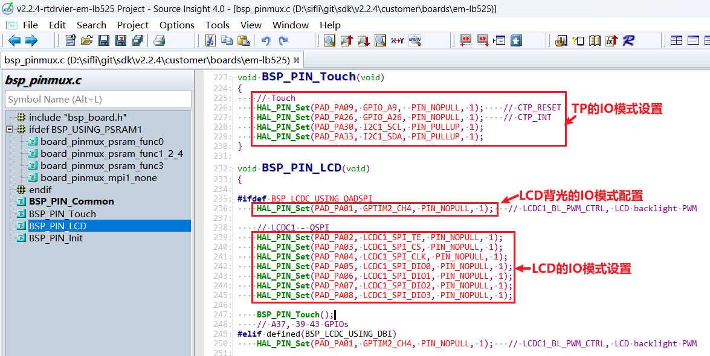<br>
The RESET pins of both the LCD and TP use GPIO mode, so they are already configured as GPIO mode by default.
```c
 HAL_PIN_Set(PAD_PA00, GPIO_A0,  PIN_NOPULL, 1);     // #LCD_RESETB
 HAL_PIN_Set(PAD_PA09, GPIO_A9,  PIN_NOPULL, 1);     // CTP_RESET
```
##### 4.1.2 IO power-on/off operations
The following is the LCD initialization process after power-on:<br>
`rt_hw_lcd_ini->api_lcd_init->lcd_task->lcd_hw_open->BSP_LCD_PowerUp-find_right_driver->LCD_drv.LCD_Init->LCD_drv.LCD_ReadID->lcd_set_brightness->LCD_drv.LCD_DisplayOn`<br>
You can see that `BSP_LCD_PowerUp` after power-on occurs before display driver initialization `LCD_drv.LCD_Init`.<br>
Therefore, before initializing the LCD, ensure that the LCD power supply has been enabled in BSP_LCD_PowerUp.<br>
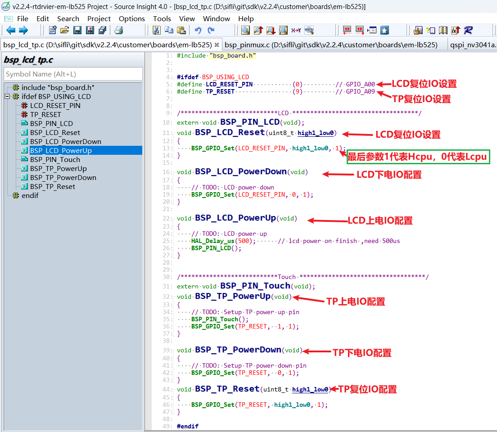<br>
##### 4.1.3 Backlight PWM configuration
There is a default configuration in the pwm software, configured in `customer\boards\sf32lb52-lcd_n16r8\Kconfig.board`. After compilation, this `Kconfig.board` configuration generates the following three macros in `rtconfig.h`<br>
```c
//PWM3需要打开GPTIM2，PWM和TIMER对应关系，可以查看FAQ的PWM部分或者文件`pwm_config.h`
#define LCD_PWM_BACKLIGHT_INTERFACE_NAME "pwm3" //pwm设备名
#define LCD_PWM_BACKLIGHT_CHANEL_NUM 4 //Channel 4
#define LCD_BACKLIGHT_CONTROL_PIN 1 //PA01
```
Using PWM3 requires GPTIM2 (located in Hcpu) for output. Also confirm whether the following macros in `rtconfig.h` take effect<br>
```c
#define BSP_USING_GPTIM2 1 //如果用PWM3，需要menuconfig --board=sf32lb52-lcd_n16r8打开
#define RT_USING_PWM 1
#define BSP_USING_PWM 1
#define BSP_USING_PWM3 1 //如果没有，需要menuconfig --board=sf32lb52-lcd_n16r8打开
```
The following shows the correspondence between `pwm3` and `GPTIM2` in `pwm_config.h`<br>
```c
#ifdef BSP_USING_PWM3
#define PWM3_CONFIG                             \
    {                                           \
       .tim_handle.Instance     = GPTIM2,         \
       .tim_handle.core         = PWM3_CORE,    \
       .name                    = "pwm3",       \
       .channel                 = 0             \
    }
#endif /* BSP_USING_PWM3 */
```
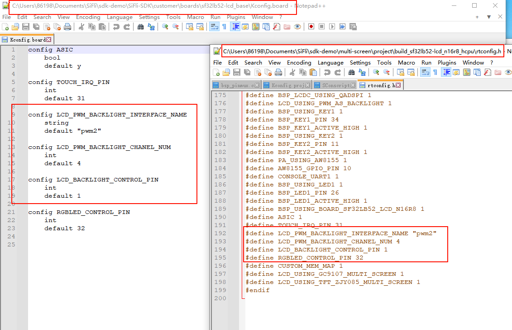<br>
By default, the software outputs the PWM waveform on PA01 from the `"pwm3"` device of `GPTIM2`. The default configuration is in<br>
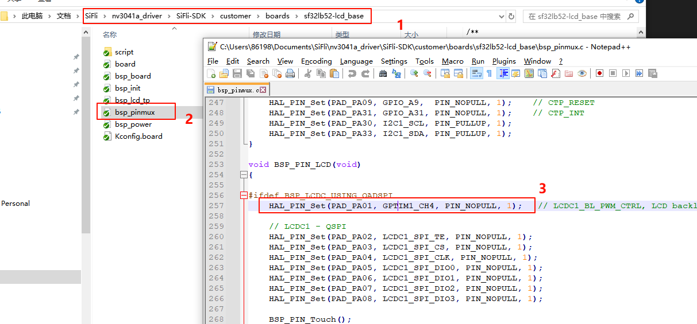<br>
```c
HAL_PIN_Set(PAD_PA01, GPTIM2_CH4, PIN_NOPULL, 1);   // LCDC1_BL_PWM_CTRL, LCD backlight PWM
```
**Note:**<br>
After configuration through the function `HAL_PIN_Set`, the mapping between GPTIM2_CH4 and PA01 is established. This is specifically reflected in the register configuration `hwp_hpsys_cfg->GPTIM2_PINR`, as shown below:<br>
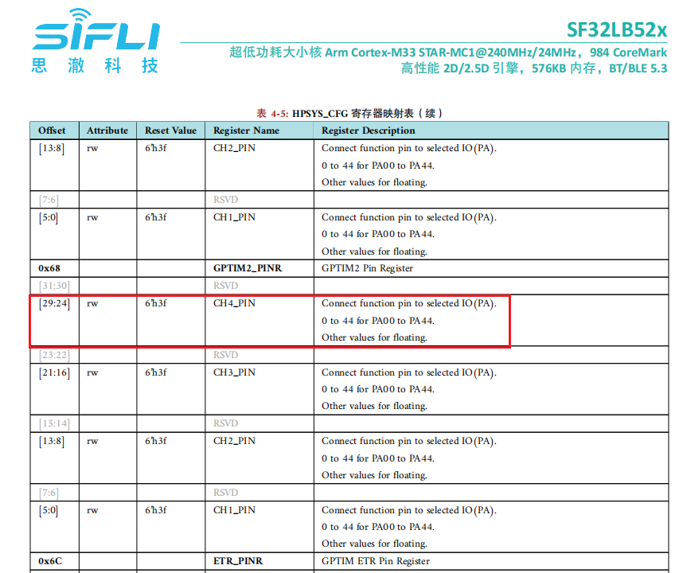<br>
You can see that it can be configured as CH1-CH4 output, and it must be on ports PA00-PA44.<br>
#### 4.2 Screen driver reset timing
The following delays are critical. Modify them carefully according to the initialization timing in the relevant screen driver IC documentation.
```c
    BSP_LCD_Reset(0);//Reset LCD
    HAL_Delay_us(20);
    BSP_LCD_Reset(1);

```
#### 4.3 Screen driver register modification
The initialization register configuration varies significantly between screen driver ICs. Write to the screen driver IC through SPI in sequence according to the register parameters provided by the screen vendor and their SPI timing. Pay special attention to the required delay length after register 0x11<br>
```c
    LCD_WriteReg_More(hlcdc, 0x11, parameter, 1);
    LCD_DRIVER_DELAY_MS(120);

    LCD_WriteReg_More(hlcdc, 0xFE, parameter, 0); // internal reg enable
    LCD_WriteReg_More(hlcdc, 0xEF, parameter, 0); // internal reg enable
```
#### 4.4 Screen driver parameter configuration
- .lcd_itf: select LCDC_INTF_SPI_DCX_1DATA to indicate SPI 1-line mode<br>
- .freq: select 48000000, indicating that the SPI clk main frequency is 48 MHz. Choose this clock according to the maximum clock supported by the screen driver IC. A higher value shortens the data transfer time per frame and increases the frame rate<br>
- .color_mode: select RGB565 or RGB888 format<br>
- .syn_mode: select whether to enable the TE anti-tearing function. If TE is enabled but the screen driver IC has no TE signal, no data will be sent to the screen and a Timeout crash will occur. It is recommended to disable TE during early debugging<br>
- .vsyn_polarity: select the polarity of TE<br>
- .vsyn_delay_us: select how long after the TE waveform arrives LCDC1 starts sending data to the screen driver IC<br>
- .readback_from_Dx: select which D0-D3 signal line outputs data from the screen driver IC when QSPI reads the Chipid (refer to the screen driver IC manual)<br>
```c
static LCDC_InitTypeDef lcdc_int_cfg =
{
    .lcd_itf = LCDC_INTF_SPI_DCX_1DATA,
    .freq = 48000000,
    .color_mode = LCDC_PIXEL_FORMAT_RGB565,
    .cfg = {
        .spi = {

            .dummy_clock = 0,
            .syn_mode = HAL_LCDC_SYNC_DISABLE,
            .vsyn_polarity = 0,
            .vsyn_delay_us = 0,
            .hsyn_num = 0,
        },
    },

};
```
### 5 Build, program, download, and results
#### 5.1 Display result
As shown below, if the display is normal, 6 images will be displayed in sequence, looping every 3 seconds.<br>
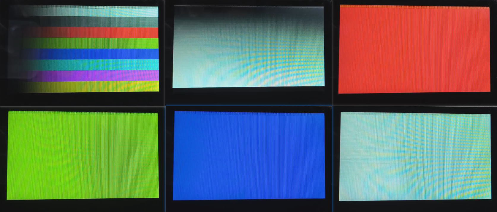<br>
