# Screen module introduction

## Screen module composition
A screen module usually includes a screen driver IC, LCD panel, backlight panel (not present on AMOLED screens), FPC flexible flat cable, and so on. For screens that support touch, there is also a separate touch panel (TP) driver IC.

Accordingly, debugging a screen module also involves debugging the driver for the screen driver chip, the driver for the backlight panel or power supply, and, for touch screens, the driver for the touch controller.

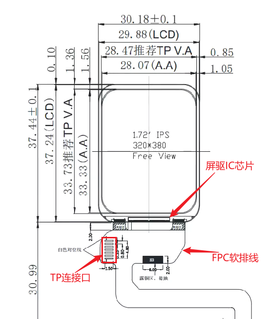 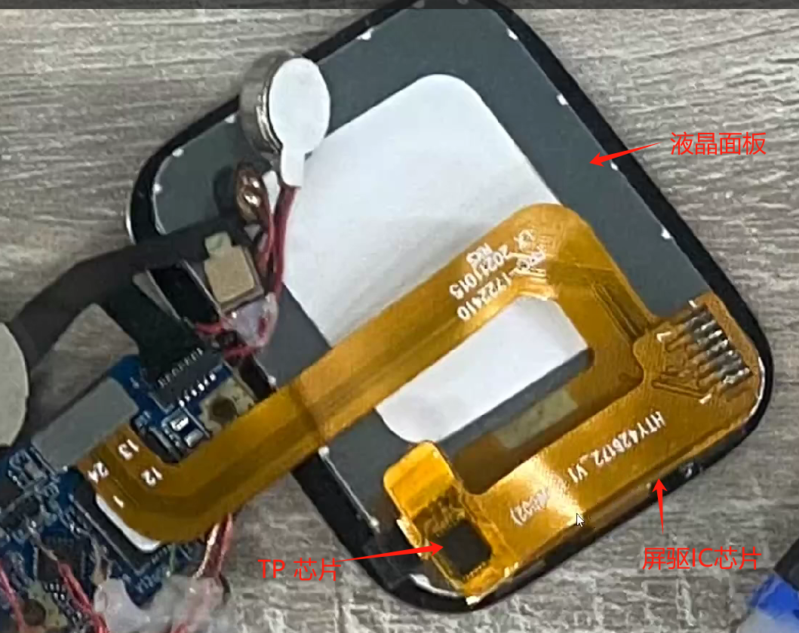

## Common interfaces of screen driver chips
Generally, a screen driver IC can support multiple interfaces. Which interface is used is selected on the screen module through the pull-up/pull-down configuration of the IM[2:0] signals on the screen driver IC IO pins. Some screen driver ICs can also select the interface through internal registers. Refer to the documentation of the screen module for details.
Common screen interfaces include the following types:
1. [SPI](#spi_link)
2. [DPI/RGB](#dpi_link)
3. [MIPI-DSI](#dsi_link)
4. [MCU/8080](#8080_link)  

(spi_link)=
### SPI interface  

The SPI interface is widely used in screen modules. Because it uses few interface pins and provides high transmission bandwidth, it can be used both as a screen driver configuration interface and directly for transmitting image data. Especially in low-resolution scenarios, a fairly high refresh frame rate can be achieved through the SPI interface.  
The method for configuring the screen driver through the SPI interface is no different from traditional SPI, so it is not described in detail here. The following content mainly focuses on the SPI interface used for image data transmission (hereinafter referred to as the image SPI interface).\
\
\
**Image SPI interface classification:**  
**The image SPI interface is divided into 3-wire SPI and 4-wire SPI according to the transmission protocol.**  
- **3-wire SPI**  
    As the name implies, there are three signal lines: chip select CS, clock SCLK, and bidirectional data line SDIO. During transmission, a Data/Command identifier bit is sent first, followed by the transfer. As shown below:
    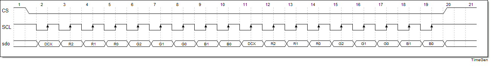 
    As shown in the figure, after CS is pulled low for selection, the DCX signal is sent first on SDO to indicate whether the following transmission is data or a command, and then the transmission is performed. Therefore, during 3-wire SPI transmission, the actual effective bandwidth is 8/9 of the theoretical bandwidth.

- **4-wire SPI**  
    Compared with 3-wire SPI, 4-wire SPI adds an extra DC signal line to identify transmitted data and commands. The transmission process is shown below:
    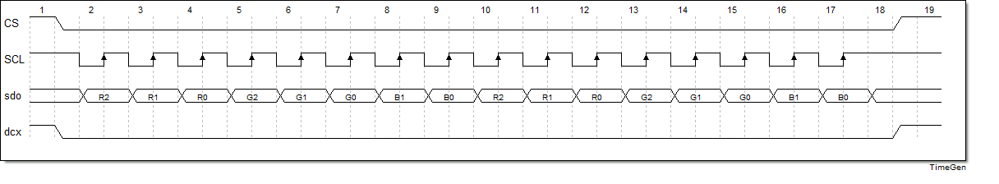 
    During the transmission process, the DCX signal in the figure remains stable to indicate whether the current transmission is data or a command. Because an additional DCX signal line is introduced, the actual effective bandwidth of 4-wire SPI is higher than that of 3-wire SPI and is equal to the theoretical bandwidth.  

**In addition to classification by transmission protocol, image SPI interfaces can also be classified by data line width. Common data line widths include 1-bit (single-data-line SPI), 2-bit (dual-data-line DSPI), and 4-bit (quad-data-line QSPI).**  

- **Single-data-line SPI**  
    Single-data-line SPI transmits 1-bit of data in each clock cycle. The 3-wire SPI and 4-wire SPI mentioned above are both single-data-line SPI, so they are not described further here.  
     
- **Dual-data-line DSPI**  
    Dual-data-line SPI transfers 2-bit data in each clock cycle, doubling the transmission bandwidth compared with single-data-line SPI.  
    \
    The DSPI transmission corresponding to 3-wire SPI is shown below:
    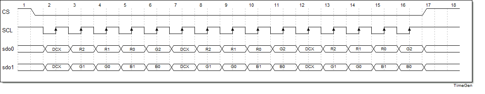
    As shown in the figure, similar to the 3-wire SPI protocol, a separate cycle is used to send the DCX identifier bit before each transfer, and then the subsequent signal transfer is performed. In the figure, each 8-bit transfer corresponds to one DCX identifier bit, so the actual bandwidth is 4/5 of the theoretical bandwidth. In actual use, to obtain higher bandwidth, many display drivers support one DCX identifier bit for every 16-bit or 24-bit transfer. In this way, bandwidth utilization can be improved to 8/9 and 12/13.  
    \
    The DSPI transfer corresponding to 4-wire SPI is shown in the following figure:  
    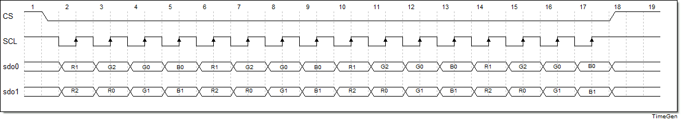
    As shown in the figure, the DSPI corresponding to 4-wire SPI does not have a separate DCX identifier bit. In actual display driver ICs, some display driver ICs enter data transfer mode through commands on a single data line, so the DCX identifier bit is not required in subsequent transfers. This maximizes the use of DSPI bandwidth, making the actual DSPI bandwidth consistent with the theoretical bandwidth. Compared with single-data-line 4-wire SPI, dual-data-line DSPI uses the same number of signals while doubling the bandwidth.  
     

- **Four-data-line QSPI**  
    Compared with dual-data-line DSPI, four-data-line QSPI adds two additional signal lines for data transmission.  
    \
    The QSPI transfer corresponding to 3-wire SPI is shown in the following figure:
    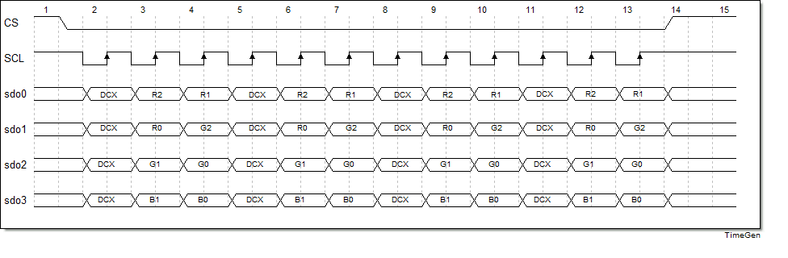
    As shown in the figure, QSPI first sends a DCX before each transfer and then performs the subsequent transfer. In the figure, each 8bit transfer corresponds to one DCX identifier bit, so the actual bandwidth is 2/3 of the theoretical bandwidth. Actual screen driver chips support transmitting 16bit or 24bit of data for each DCX identifier bit, which can improve bandwidth utilization to 4/5 or 8/9.  
    \
    The QSPI transfer corresponding to 4-wire SPI is shown in the following figure:
    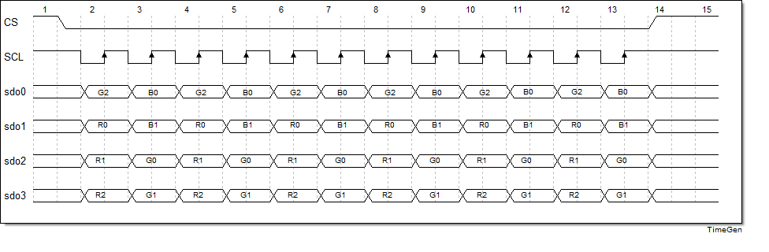
    In the figure, when QSPI transmits data, it has no DCX identifier bit, the same as DSPI, which ensures that the actual bandwidth reaches the theoretical bandwidth. Similarly, most screen driver chips enter data transmission mode through single-data-line commands, thereby maximizing the use of QSPI bandwidth capability during data transmission.  

\
The above are the most common SPI interfaces. In terms of protocol, they are divided into 3-wire and 4-wire modes; in terms of data width, they are divided into single-data-line, dual-data-line, and four-data-line modes. The combination of the two gives a total of six modes. Users need to determine the mode used in the actual scenario according to the actual display driver documentation. For an SPI interface, the external display driver generally needs to have GRAM, so the requirements for the external display driver are higher.
\
To further improve transmission bandwidth, recently some screen driver chips have also begun to support DDR-mode data transmission. Compared with SDR mode, the bandwidth can be doubled again.
\
 
 

(dpi_link)=
### DPI/RGB interface

The DPI interface is also commonly referred to as the RGB interface. A DPI interface generally consists of 16–24-bit data signals, as well as clock and control signals such as PCLK, HSYNC, VSYNC, and DE. The display driver IC for a DPI interface usually does not have internal GRAM, so the host must continuously send image data and continuously refresh the screen content. Therefore, it places higher performance requirements on the host.  
DPI signal interface diagram:  
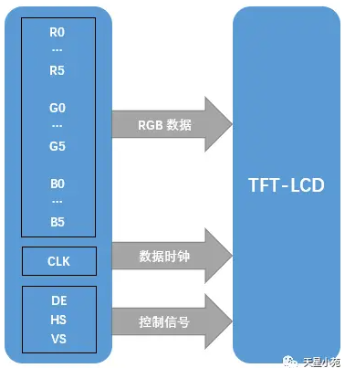
DPI interface signals must meet DPI-specific timing requirements. You can roughly refer to the figure below:  
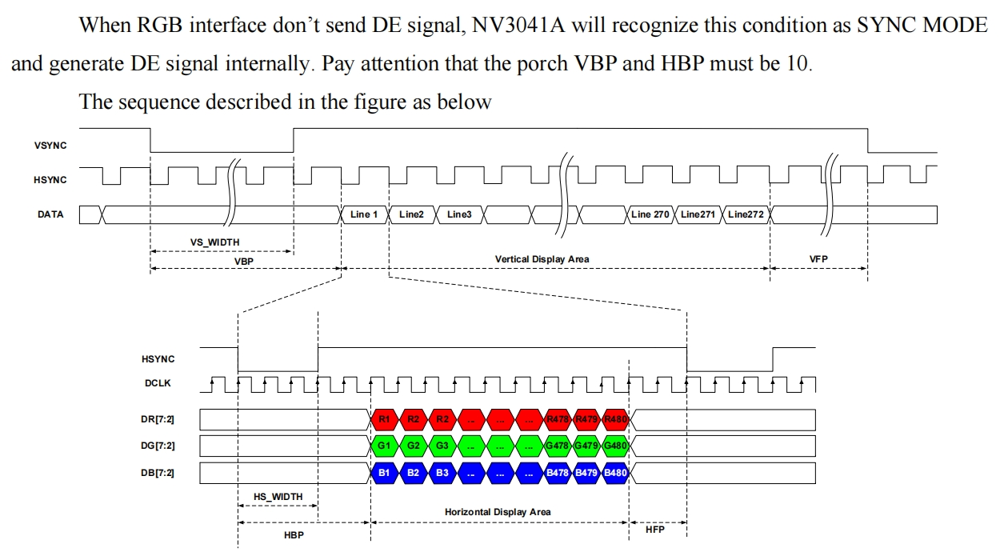
As shown in the figure, when configuring the DPI screen interface, users need to refer to the display driver IC documentation and configure the timing parameters in the figure. The parameters include: VS_WIDTH, HS_WIDTH, HBP, HFP, VBP, VFP, Vertical Display Area, and Horizontal Display Area.
 
 

(dsi_link)=
### MIPI-DSI interface
The MIPI-DSI interface, commonly referred to as the MIPI display interface, consists of one pair of clock differential signal lines and 1/2/4 pairs of data differential signal lines. Because both the clock and data are differential signals, the MIPI interface has a higher rate and stronger interference immunity. It also causes less interference to peripheral circuits, making it well suited for highly integrated scenarios, such as wearable devices.  
The MIPI-DSI interface usually has two operating modes: Command mode and Video mode. Command mode is intended for display driver ICs with relatively small resolutions and internal GRAM. Most SPI interface screens also use this type of display driver IC. Video mode is intended for display driver ICs without GRAM and requires continuous screen refresh, with a mechanism similar to the DPI interface. This mode also has higher requirements on the MCU host side.  
The following figure shows a DSI interface with a single Data Lane:  
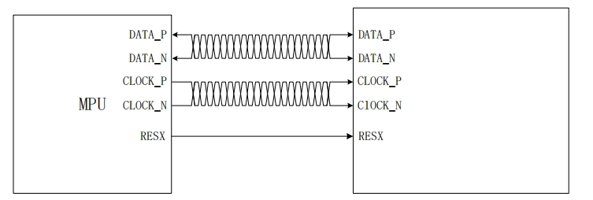
 
 

(8080_link)=
### MCU/8080 interface

The MCU/8080 interface has many other names. Because it originally came from Intel's interface, it is also called the Intel interface. Another commonly used name is the DBI interface, which comes from the DBI interface protocol in the MIPI standard. This interface consists of independent read/write control signals and 8/16 data buses.  
The following figure shows a typical MCU/8080 interface diagram:  
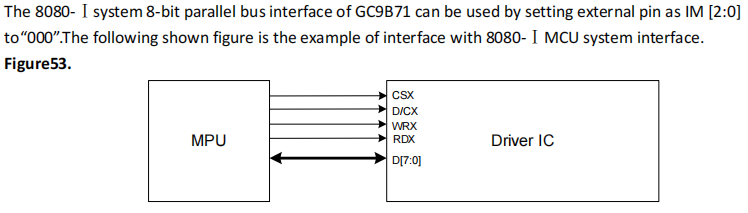
The MCU/8080 interface in the figure consists of the chip select signal CSX, write control WRX, read control RDX, Data/Command selection D/CX, and 8 data lines. During writing, data is sent by toggling WRX; during reading, data is read by toggling RDX. Its access method is similar to memory access.  
The advantage of the MCU/8080 interface is that it is simple to control and easy to implement. However, its disadvantages are also obvious: as a parallel interface, it uses more signals and has a relatively low rate. In addition, the MCU/8080 interface requires GRAM on the display driver side, which also increases the cost of the display driver.
