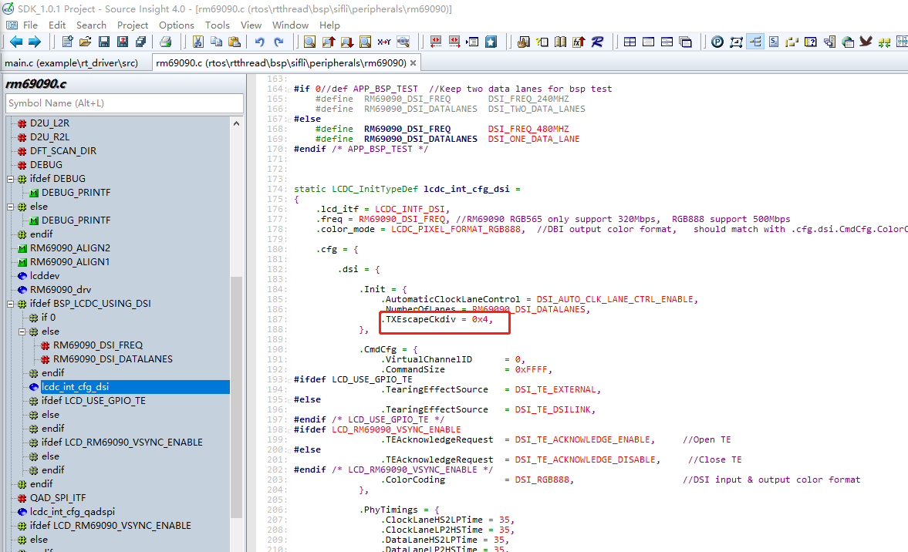
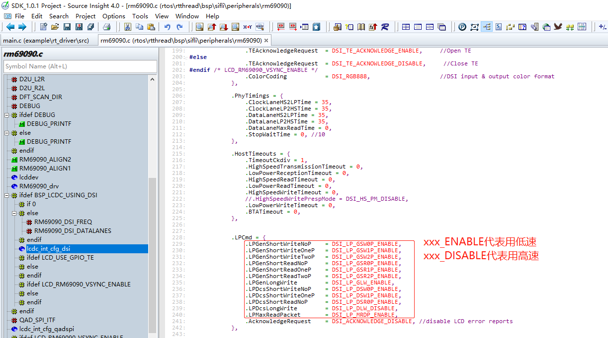
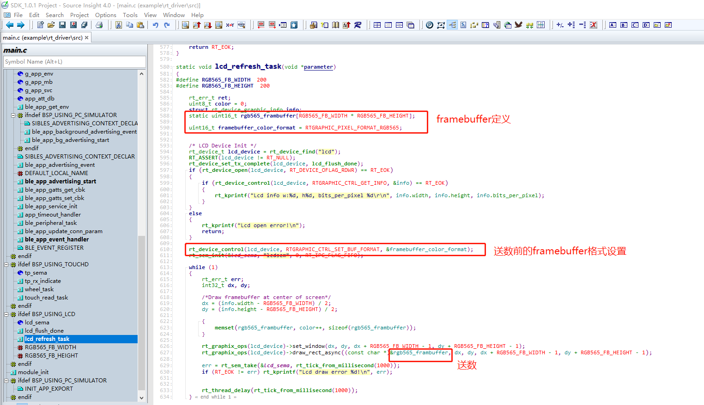
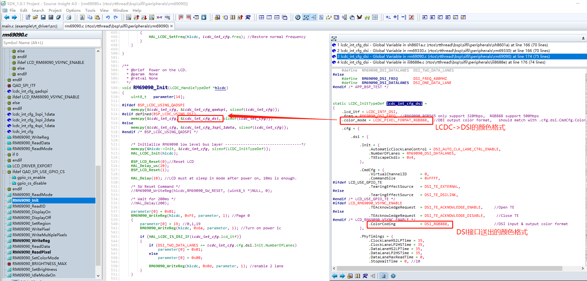
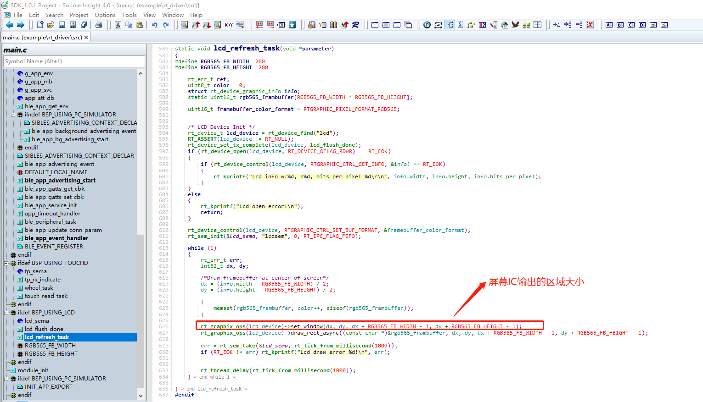
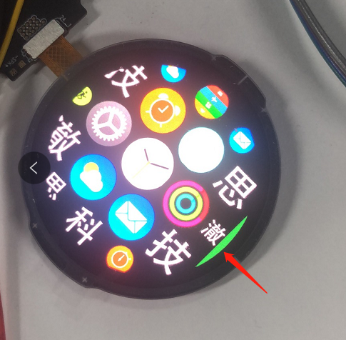
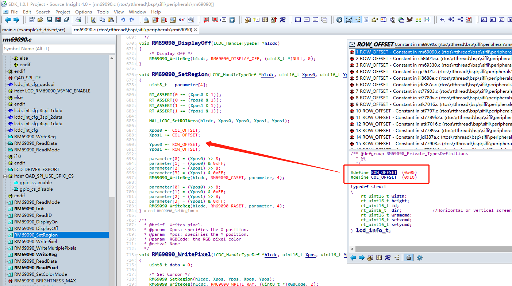
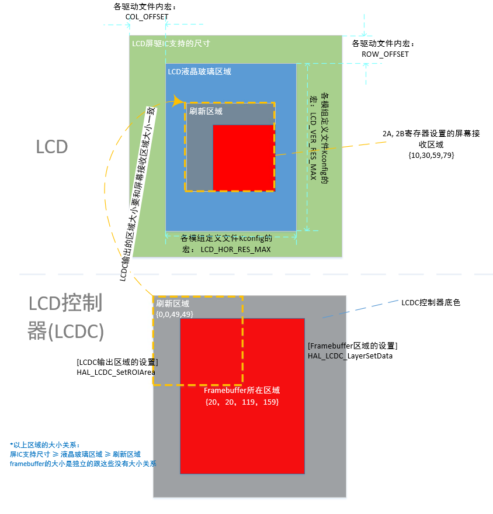
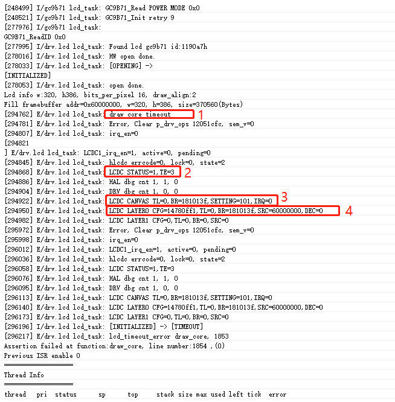

## FAQ

### Failed to read the display ID
* Check whether the power supply is correct.
* Check whether the IO voltage matches (our chip supports 1.8 V IO, while many LCDs are 3.3 V).
* Check whether the display reset time is sufficient.
* Try lowering the interface frequency.
* Check the timing.

### Switch the DSI display to low-speed mode.
1. Reduce the system clock to 48M
In drv_io.c, change HAL_RCC_HCPU_ClockSelect(RCC_CLK_MOD_SYS, XXX); where XXX is the system clock frequency, to RCC_SYSCLK_HXT48 (crystal clock 48MHz).
This is to reduce the speed at which the LCDC sends data to the DSI

2. Adjust the frequency of DSI LP mode to a range supported by the screen (generally 6~20Mbps), 
With the following configuration, the LP mode frequency = 480MHz / 16 / 4 = 7.5Mbps (where 480MHz is freq, 16 is a fixed value, and 4 is TXEscapeCkdiv).

3. Change all commands to be sent in LP mode (low-speed mode)

### The display does not light up.
* Check whether the ID can be read.
* Disable TE first to prevent the LCD controller from not sending data because there is no TE signal.
* Check whether the data being sent is all black.

### Display color format settings
Our LCD controller can convert framebuffers in different formats to the LCD output interface. Make sure the configurations at both the framebuffer side and the LCD output side are correct.

Example of setting the framebuffer color format (framebuffer in RGB565 format)

Example of the color format output by the LCD controller (DSI output RGB888)

*After the framebuffer is sent to the LCDC controller, it is first converted to RGB888 data, then sent to the DSI link controller, and finally output as RGB888 data.

### The display shows distorted colors.

* Check whether the framebuffer color format and the color format sent by the LCD controller are correct (refer to the preceding FAQ "Display color format settings").
* Check whether the screen area output by the IC is consistent with the resolution of the LCD glass. Refer to the section "Relative relationship among the display driver IC, LCD glass, refresh area, and framebuffer".
    
* Check whether no data is being sent and the default GRAM data is displayed (change the framebuffer and check whether the display changes).

### The display shows a green background in whole or in part.
One example is shown in the following figure:

* Check whether the offset for setting the LCD data receiving area is correct.

* Check whether the data being sent is correct.

### Crash caused by mismatch between alignment requirements and display resolution
Crash cause:
Some customer screens have a resolution such as 320x385, but their alignment requirement is 2. According to the alignment requirement, the resolution must be even in both dimensions (for example, 320x386). When the upper layer or driver refreshes the screen, it automatically aligns to an even number, causing the refresh area to exceed the resolution, which triggers an assertion.

Solution approach:
	Still provide the upper layer with a display resolution that meets the alignment requirements, and modify only the driver code.

Solution:
* When defining the display resolution in Kconfig, configure it according to the aligned resolution and virtualize a display that satisfies the alignment requirement.
    * The corresponding Kconfig macros are LCD_HOR_RES_MAX and LCD_VER_RES_MAX.
    * For example, the preceding case should be configured as 320x386.
* In the xxxx_SetRegion function of the LCD driver, check whether the incoming parameters exceed the actual resolution, and consult the display manufacturer on how to handle this.
    * For some displays, the area is clipped directly. For example, in the preceding case, check Ypos1 and change it directly to 385 if it exceeds 385.
    * Some displays can be refreshed directly and will not overwrite the first row.

### Keep the upper-level graphics library unchanged and only replace the display.
For this type of issue, refer to the approach in "Crash caused by mismatch between alignment requirements and display resolution". Only clip at the driver layer, while still exposing a display that satisfies the requirements to the upper layer.

(lcd-lcdc-coordinates-relationship)=
### Relative relationship among the display driver IC, LCD glass, refresh area, and framebuffer

### Crash
As shown in the following figure, this is a common screen refresh timeout crash. The cause is that the display TE signal was not received, resulting in a timeout crash. The timeout duration is defined by `MAX_LCD_DRAW_TIME`, and the default is 500 ms.

| Labels in the image | Register meaning description|
| ---- | ---- |
| 1 | "draw core timeout" indicates that the screen refresh did not receive TE, causing a timeout crash.|
| 2 | STATUS=1 indicates that the LCDC controller remains busy (for example, waiting for the TE signal). For TE=3, only bit0 needs to be checked. If bit0 is 1, it means LCDC needs to wait for the TE signal before refreshing; if it is 0, it does not need to wait for the TE signal. The log prints the TE register value twice, so you can observe whether a TE signal arrives during this period. |
| 3 | The TL and BR of CANVAS are the coordinates of the refresh area. The high 16 bits of TL are y0 and the low 16 bits are x0; the high 16 bits of BR are y1 and the low 16 bits are x1; together they form the refresh area {x0,y0,x1,y1}. |
| 4 | The TL and BR of LAYER0 are the coordinates of the area where the framebuffer is located, in a format similar to the TL and BR of CANVAS above;   SRC is the data address of the framebuffer. |

Solution:
1. If this crash occurs immediately after boot, it is very likely that the display driver has a problem. Check the display power-on, reset, display initialization code, and so on.
2. If this crash occurs after sleep wake-up, the initialization reset time may be insufficient, or the process for turning off the display during sleep may not meet the requirements.
3. If this crash occurs suddenly during screen refresh, the display driver may be unstable (for example, IO levels do not match or the rate is too high), or ESD may have caused the display driver IC to hang.
