# Display module framework introduction
## Overview

SiFli's display framework is based on the [rt_device framework](https://www.rt-thread.org/document/site/#/rt-thread-version/rt-thread-standard/programming-manual/device/device?id=%e8%ae%bf%e9%97%ae-io-%e8%ae%be%e5%a4%87) and has the following features:
- The same display driver, TP driver, and backlight driver can be reused across different development boards.
- The same development board can select different display modules through menuconfig.
- Supports compatibility with multiple display drivers and TP drivers at the same time, distinguished by ID.

<br/>
<br/>
This design does improve reuse, but it also introduces the issue of dispersion in display module driver configuration:

- The display module power-on/power-off, reset interface, pinmux settings, PWM used by the backlight, and other code are associated with the development board (similar to the BIOS of the display driver module).
- Display driver, TP driver, and backlight driver implementations must be based on the macro definitions and IO interfaces provided above.
- Finally, consolidate the implemented display driver, TP driver, and backlight driver into one menuconfig menu for board selection.
<br/>
<br/>
<br/>
<br/>

## Display section
### Display framework diagram
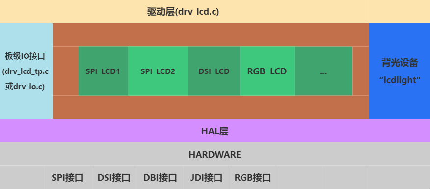

**Explanation of each item in the figure:**
- Driver layer (drv_lcd.c) --- implements an rt_device named "lcd" for the upper layer to operate the display.
- Specific driver code in the middle green section (the main code for adding a display driver for customers)
- Board-level IO interface file (bsp_lcd_tp.c, or drv_io.c) --- provides unified power-on, power-off, and reset interfaces for the display driver.
- Backlight device "lcdlight" --- provides a unified backlight control interface for the display driver.
- HAL layer (bf0_hal_lcdc.c) --- provides basic unified interfaces for parameter configuration, LCD register read/write, and other operations for the display driver.

<br/>
<br/>
<br/>
<br/>

(lcd-driver-register)=
### Register the screen driver to the system
SiFli's display driver framework supports registering multiple display drivers to the system at the same time. The macro `LCD_DRIVER_EXPORT2` generates variables with a special section name and links them together.

In nv3051f1.c, `LCD_DRIVER_EXPORT2` is used to register the callback functions of the display driver to the system. For detailed analysis of each function, refer to [Display driver callback functions](./屏驱回调函数.md):
```
static const LCD_DrvOpsDef LCD_drv =
{
	LCD_Init,    			  //【必选】，屏驱初始函数(包括复位，初始化程序等) 
	LCD_ReadID,    			  //【必选】，Display presence detection函数 
	LCD_DisplayOn,   		  //【必选】，屏幕打开 
	LCD_DisplayOff,  		  //【必选】，屏幕关闭 
	LCD_SetRegion,    		  //【必选】，设置屏幕接受数据时的区域（2A,2B 的区域）
	LCD_WritePixel,   		  // 可选，写一个像素点到屏幕上
	LCD_WriteMultiplePixels,  //【必选】，写批量像素点到屏幕上
	LCD_ReadPixel,    		  // 可选，读屏幕上的一个像素点数据，返回像素的RGB值
	LCD_SetColorMode,    	  // 可选，切换输出给屏幕的颜色格式
	LCD_SetBrightness,   	  // 可选，设置屏幕的亮度 
	LCD_IdleModeOn,    		  // 可选，进入待机显示模式（低功耗模式） 
	LCD_IdleModeOff,   		  // 可选，退出待机显示模式（低功耗模式） 
	LCD_Rotate,  			  // 可选，旋转屏幕一定角度 
	LCD_TimeoutDbg, 		  // 可选，批量送数超时后，屏幕自检 
	LCD_TimeoutReset,  		  // 可选，批量送数超时后，屏幕复位 
	LCD_ESDCheck,  		      // 可选，屏幕定时ESD检测 
};

LCD_DRIVER_EXPORT2(nv3051f1, LCD_ID, &lcdc_int_cfg, &LCD_drv,2);
```
<br/>
<br/>
<br/>
<br/>

(lcd-driver-detect-method)=
### Display presence detection
When multiple display drivers are registered in the system, determining which display driver should drive the current display requires display presence detection. The method is to first call the [LCD_Init](lcd-cb-func-lcd-init) function of each display driver to initialize it, and then call the [LCD_ReadID](lcd-cb-func-lcd-readid) function. If the value returned by [LCD_ReadID](lcd-cb-func-lcd-readid) is the same as the LCD_ID value, the display is considered present and that display driver is used. Otherwise, continue calling [LCD_Init](lcd-cb-func-lcd-init) and [LCD_ReadID](lcd-cb-func-lcd-readid) of the next display driver.
- _[LCD_Init](lcd-cb-func-lcd-init) and [LCD_ReadID](lcd-cb-func-lcd-readid) are callback functions registered by each [display driver](lcd-driver-register)_
-  _LCD_ID is a parameter passed through LCD_DRIVER_EXPORT2_
- You can directly return LCD_ID if you want to force use of this display driver. This is suitable when there is only one display driver or the display does not support ID reading.

(lcd-ic-pixel-alignment)=
### Pixel alignment for screen refresh
Some display drivers have pixel alignment requirements for the refresh area. SiFli's display driver framework supports setting pixel alignment (if a display has different row and column alignment requirements, use the larger value. For example, if a display requires row alignment of 2 and column alignment of 4, use 4).

The update-area pixel alignment requirements of a display driver IC are generally described in the 0x2A (start/end column) and 0x2B (start/end row) registers. For the IC shown below, both rows and columns require 2-pixel alignment:

```{figure} assets/LCD_IC_pixel_alignment.png
:scale: 30 %
```

<br/>
<br/>
<br/>
<br/>

## Touch section
### Touch (TP) framework diagram
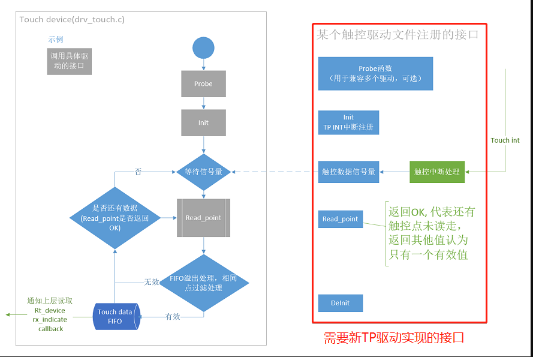

<br/>
<br/>
<br/>
<br/>

### Interface for registering a TP driver to the system
In gt911.c, the initialization function rt_tp_device_init is registered through INIT_COMPONENT_EXPORT. Then, in rt_tp_device_init, the TP driver is registered to the system through the function rt_touch_drivers_register.

```c
static struct touch_drivers driver;

static struct touch_ops ops =
{
    read_point, //TP数据读取回调函数
    init,       //TP初始化回调函数
    deinit      //TP去初始化回调函数
};


static int rt_tp_device_init(void)
{

    driver.probe = probe;  //TP在位检测回调函数
    driver.ops = &ops;
    driver.user_data = RT_NULL;
    driver.isr_sem = rt_sem_create("gt911", 0, RT_IPC_FLAG_FIFO); //TP数据读取信号量

    rt_touch_drivers_register(&driver);  //注册到系统TP驱动框架
    return 0;

}
INIT_COMPONENT_EXPORT(rt_tp_device_init); //注册初始化函数
```


## Backlight section
Non-self-emissive displays generally require a backlight. At present, display backlight drivers all implement an rt_device device named "lcdlight" through various methods, and it is used uniformly in the display driver callback function [LCD_SetBrightness](lcd-cb-func-LCD-SetBrightness).

Two modes are currently supported:
- PWM direct-drive backlight, where the chip directly outputs a PWM waveform to directly drive the backlight.
- External backlight driver, where a GPIO controls an external backlight driver chip to output a PWM waveform to drive the backlight.


### PWM direct-drive backlight
  This device has already registered an rt_device device named "lcdlight" in drv_lcd.c. See the rt_hw_lcd_backlight_init function.

  The PWM frequency used is 1 KHz by default.

  It uses two macros, `LCD_PWM_BACKLIGHT_INTERFACE_NAME` and `LCD_PWM_BACKLIGHT_CHANEL_NUM`, which specify the PWM device name and channel number respectively. These two macros are generally defined in [Kconfig.board](lcd_driver_folder_strcuture).

  Note: The pwm rt_device specified by `LCD_PWM_BACKLIGHT_INTERFACE_NAME` must be enabled in menuconfig. For example, when "pwm2" is specified, select:    
  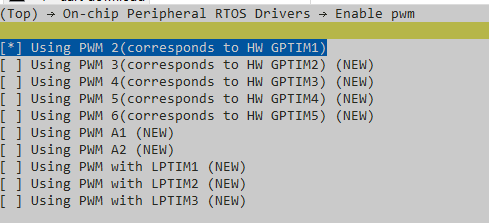

  Use this type of backlight by selecting the macro [LCD_USING_PWM_AS_BACKLIGHT](lcd_menuconfig_select_backlight_type) in the display module.

### External backlight driver
   For example, aw9364.c registers an rt_device device named "lcdlight" in the sif_aw9364_init function.

   The macro `LCD_BACKLIGHT_CONTROL_PIN` specifies which GPIO is used to control aw9364. This macro is also defined in [Kconfig.board](lcd_driver_folder_strcuture).


   Use this type of backlight by selecting the macro [BL_USING_AW9364](lcd_menuconfig_select_backlight_type) in the display module.


<!--


----

## General Settings for LCD&TP Projects
Typically, one hardware PCB corresponds to one project, and one project can be compatible with multiple LCD&TP modules at the same time. These modules are connected through the same hardware interface, so the LCD&TP configurations that are not related to specific modules are described here.

These common configurations provide board-level IO APIs and macro definitions for all LCD&TP drivers:

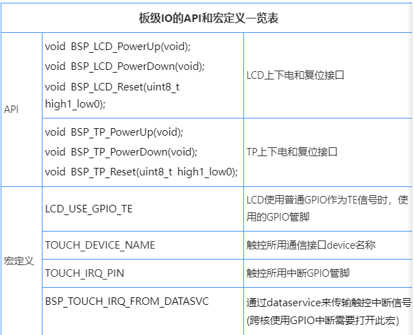

Here, the ec-lb555xxx series EVB is used as an example

SDKrelease\drivers\boards\ec-lb555xxx\drv_io.c board-level API interface provider
SDKrelease\drivers\boards\ec-lb555xxx\pinmux.c board-level pinmux definition file

### General Screen Settings
1. Power-on

For versions earlier than SDK1.0.4, power-on at startup or wake-up from sleep follows the IO power-on.

For SDK1.0.4 and later versions, power-on is handled inside the LCD device.

2. Power-off


3. Reset


4. PINMUX


5. Board-level configuration of the screen TE

The display TE needs to connect the hardware signal. There are three interface types:
1. The screen TE signal of the DSI interface supports routing through the DSI bus, and no extra line is required.
2. For interfaces such as SPI/8080, you only need to set the pinmux of the TE pin to the TE pin.
3. If neither of the first two solutions is supported by the hardware, any GPIO can be used as the TE signal. In this method, TE relies on the GPIO ISR interrupt, so the real-time performance is slightly worse.

The operating mechanisms of the above TE types are as follows:
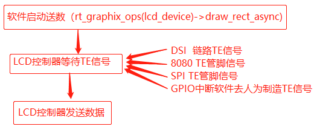
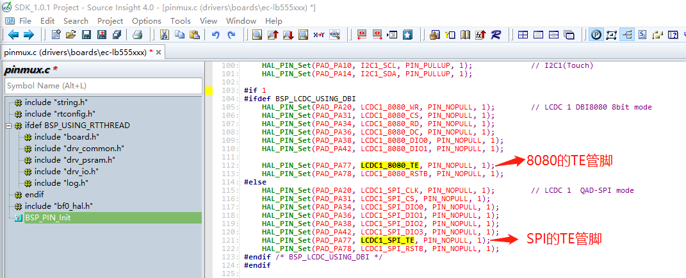
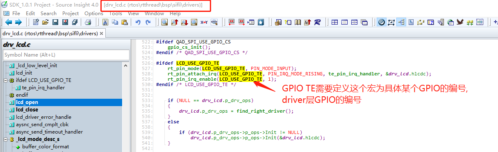


### General Touch Settings

#### 1. TOUCH_DEVICE_NAME

The rt-device name of the touch communication interface. It can be an I2C or SPI interface. The specific communication interface is called inside the driver
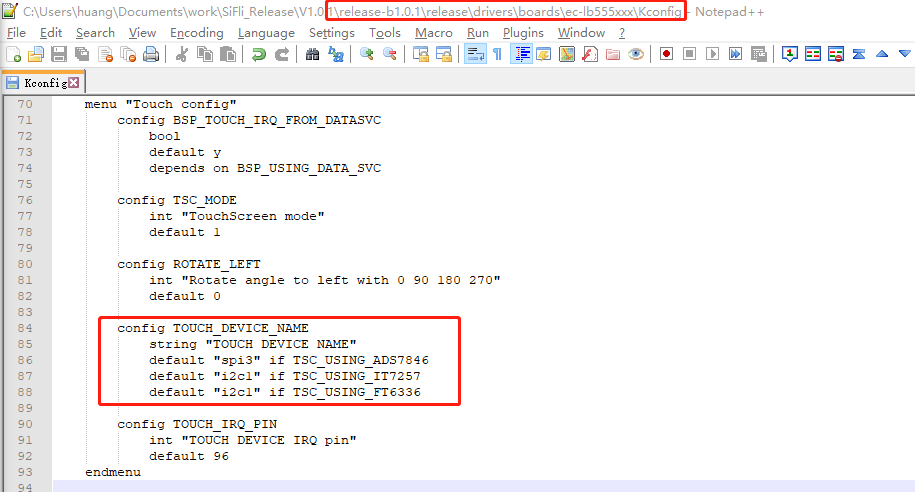

#### 2. Power-on

For versions earlier than SDK1.0.4, power-on at startup or wake-up from sleep follows the IO power-on.
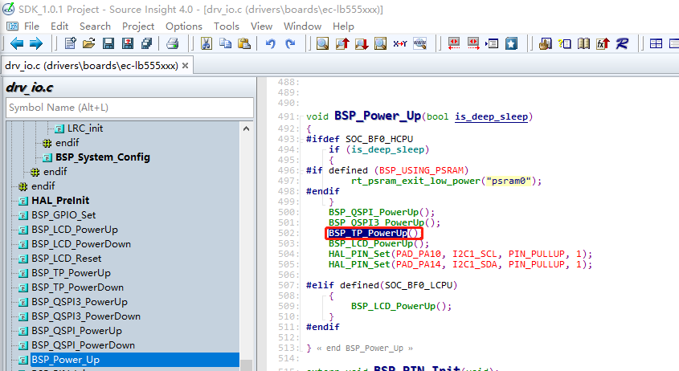

For SDK1.0.4 and later versions, power-on is handled inside the Touch device.

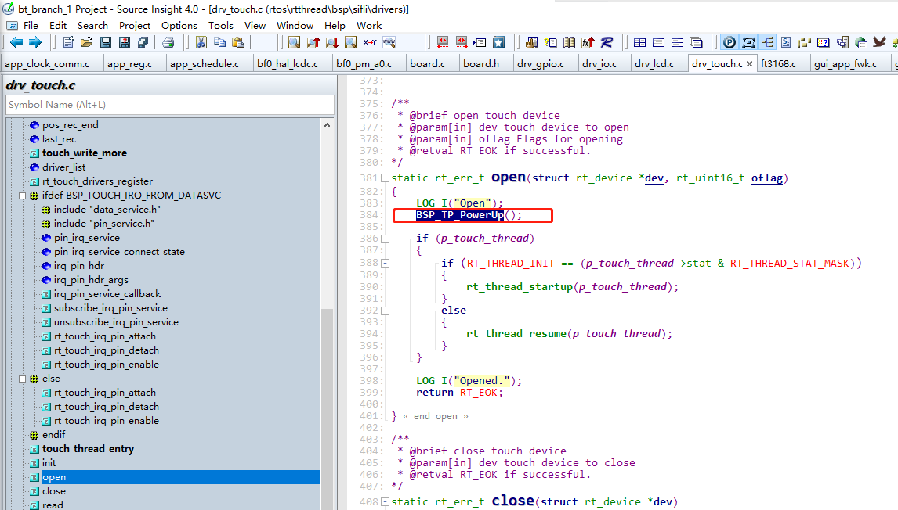

#### 3. Power-off

For versions earlier than SDK1.0.4, power-down during shutdown or sleep follows IO power-down
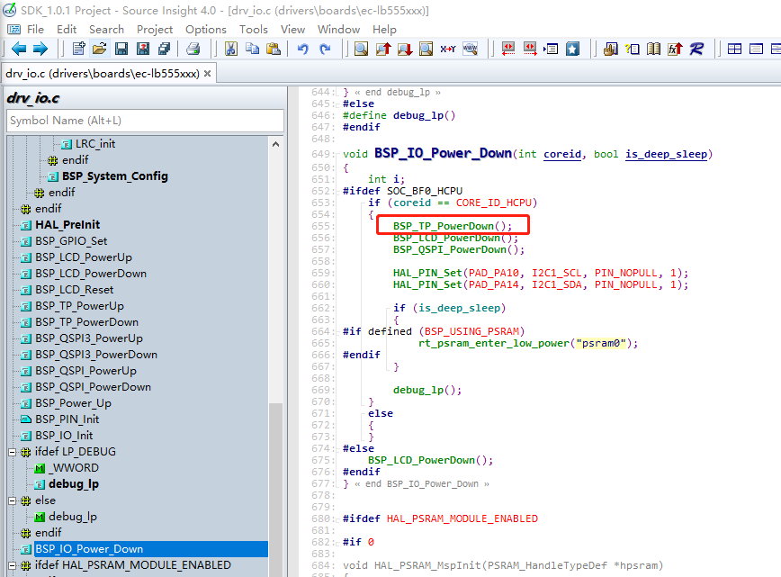

For SDK1.0.4 and later versions, power-off is handled inside the Touch device.
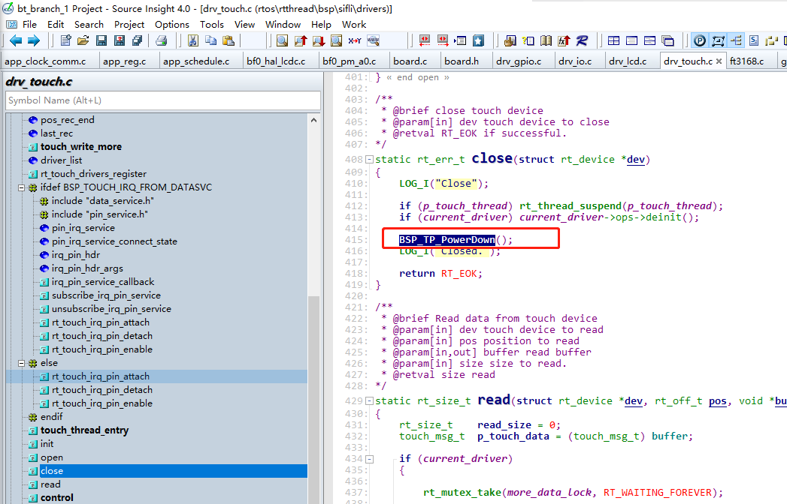

#### 4. Reset

In many versions earlier than SDK1.0.4, the reset interface was not called. In later versions, if touch requires it, reset can be added at the beginning of the probe function and init function inside the driver
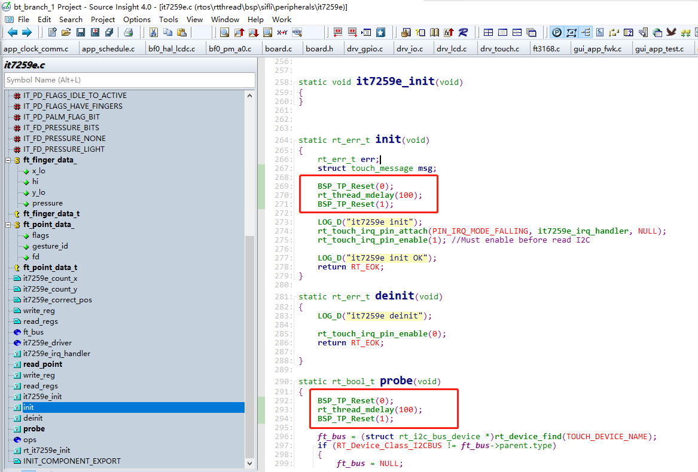

#### 5. Interrupt

TOUCH_IRQ_PIN  - Interrupt GPIO pin used by touch
BSP_TOUCH_IRQ_FROM_DATASVC  - If the touch interrupt GPIO uses a cross-core pin, this macro must be enabled.
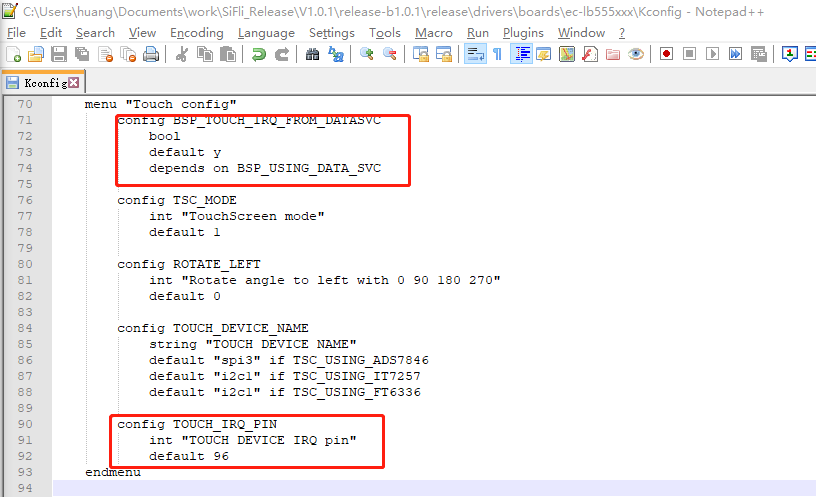


### Debug Project Selection

The SDKrelease\example\rt_driver project is a project specifically used to debug rt_driver devices. In it, we provide an example for LCD that displays a color-changing rectangular area:
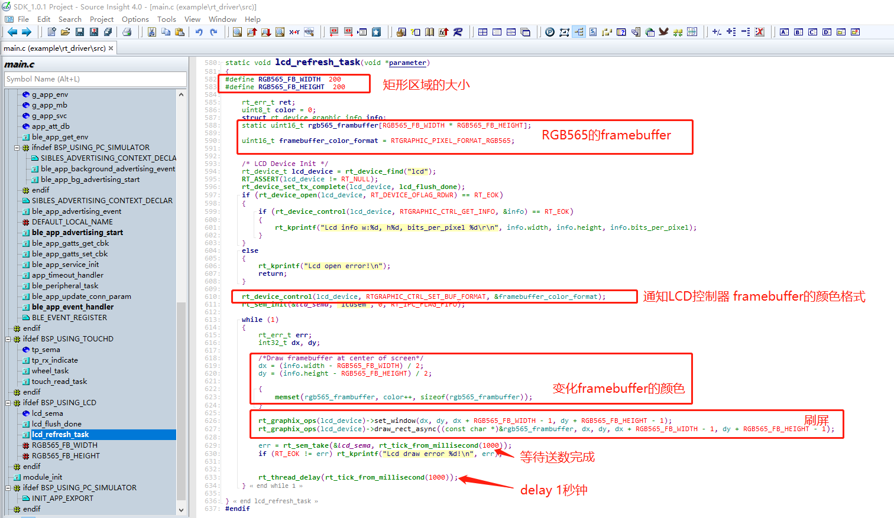

A thread for reading touch data and printing it is also added for touch:

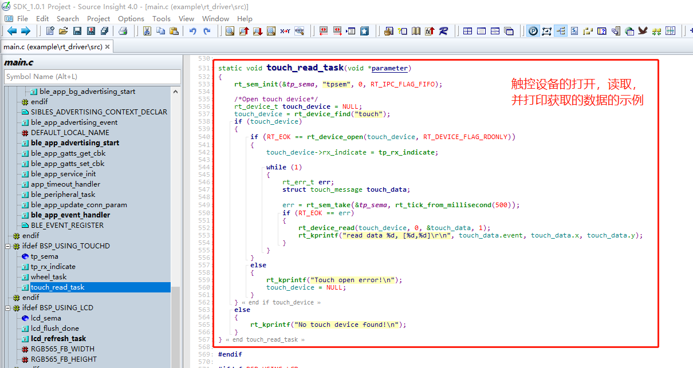

In the current example, we select the ec-lb555 project
SDKrelease\example\rt_driver\project\ec-lb555
After the project is compiled and programmed, the device refreshes the screen and reads touch data directly after power-on

*It is recommended that after the customer lights up the screen, the framebuffer be replaced with a full-screen image and checked again to ensure there are no issues such as offset, color format, or exceeding the LCD glass range.

Example of displaying an image:
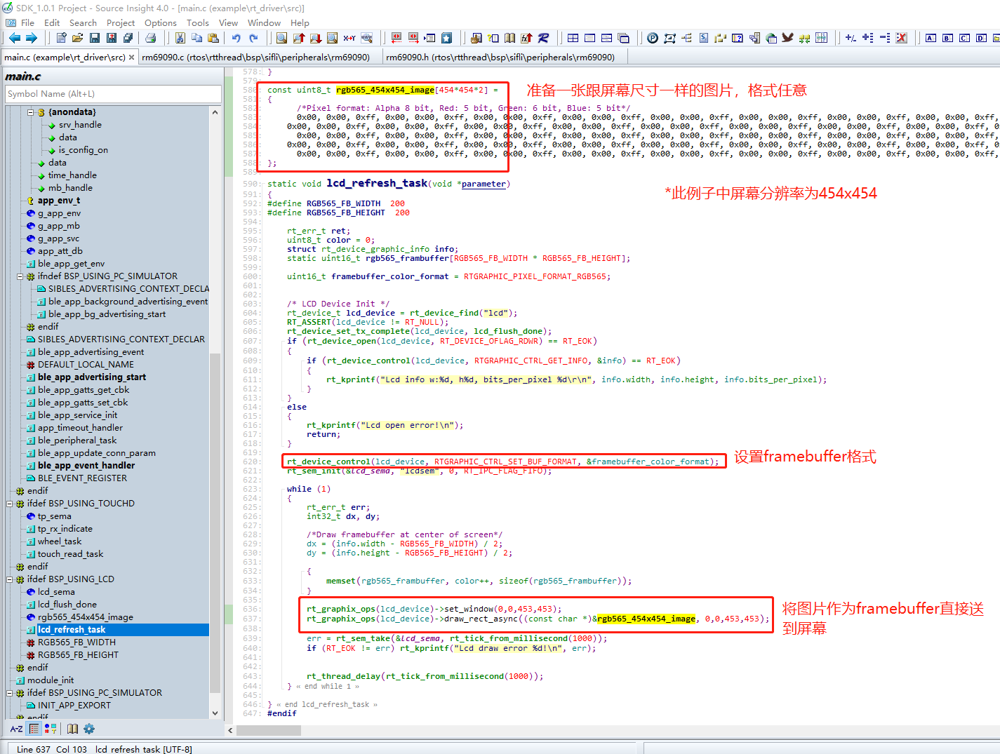


-->
