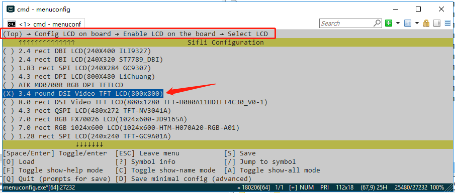

# Built-in

The display module menuconfig option is an integrated menu option that combines the display driver IC, backlight IC, and touch IC. It specifies which display IC and touch IC the module uses, what type of backlight is used, and also specifies information such as the resolution, DPI, and form factor of the module's LCD glass. After adding it, you can [use this new menuconfig menu option](add_lcd_menuconfig) in the project.

There are the following steps in total:
1. Add driver macro definitions
2. Open the Kconfig_lcd file
3. Add display module options
4. Configure the display module LCD resolution and DPI
5. Use the new display (select through Menuconfig)

## 1 Add Driver Macro Definitions
### Add macro definitions for the driver IC in the Kconfig file
Open the SDK\customer\peripherals\Kconfig file, which contains many configs similar to LCD_USING_XXX, and add a new config after them:
```
config LCD_USING_NV3051F1
    bool
    default n
```
Note: If a display driver IC with the same name already exists, it means you only need to modify the initialization code of the existing driver.
### Add macro definitions for the driver IC in the Kconfig file

Open the SDK\customer\peripherals\Kconfig file, find where other backlight definitions are located, such as the config for `BL_USING_AW9364`, and add a new config after it (for example, if the added IC name is NW9527):
```
config BL_USING_NW9527
    def_bool n
```
### Add macro definitions for the driver IC in the Kconfig file
Open the SDK\customer\peripherals\Kconfig file, which contains many configs similar to TSC_USING_XXX, and add a new config after them:
```
config TSC_USING_GT911
    bool
    default n
```

## 2 Open the SDK\customer\boards\Kconfig_lcd file
## 3 Add Display Module Options
- The macro for a new display module is generally in the form `LCD_USING_AAA_BBB_CCC`, where AAA is the module manufacturer, BBB is the module model, and CCC is information such as the module number and production date. This information is available in the display module information provided by the module manufacturer.
- For the display module name, include as much information as possible, such as the size, interface type, module manufacturer, module number, resolution, etc.
```
        config LCD_USING_TFT_AH034A01ZJINV4C30            <<<<<<新的屏幕模组的宏,不能跟其他的有重名
            bool "3.4 round DSI Video TFT LCD(800x800)"   <<<<<<屏幕模组的名称,在menuconfig中显示的名称
            select TSC_USING_GT911 if BSP_USING_TOUCHD    <<<<<<<模组使用的TP的IC宏
            select LCD_USING_NV3051F1                     <<<<<<模组使用的屏驱IC宏
            select BL_USING_AW9364                        <<<<<<可选项，选择背光驱动 见注3 
            select BSP_USING_ROUND_TYPE_LCD               <<<<<<可选项，建议圆形屏幕添加,方形屏幕可删除这行
            select BSP_LCDC_USING_DSI_VIDEO               <<<<<<见注1
            depends on BSP_SUPPORT_DSI_VIDEO              <<<<<<可选项,见注2
```

**Note 1**: 
Specify which interface type this display uses. The following options are supported:
| Macro Definition | Display Driver Interface Type |
| :---- | :----|
| BSP_LCDC_USING_SPI_NODCX_1DATA | 3SPI 1DATA (represents 3-wire SPI using 1 data line; same below) |
| BSP_LCDC_USING_SPI_NODCX_2DATA | 3SPI 2DATA  |
| BSP_LCDC_USING_SPI_DCX_1DATA   | 4SPI 1DATA  |
| BSP_LCDC_USING_SPI_DCX_2DATA   | 4SPI 2DATA  |
| BSP_LCDC_USING_QADSPI          | 4SPI 4DATA, the currently common QSPI interface  |
| BSP_LCDC_USING_DDR_QADSPI      | 4SPI 4DATA DDR (uses dual-edge communication based on the QSPI interface)  |
| BSP_LCDC_USING_DBI             |  DBI |
| BSP_LCDC_USING_DSI             |  DSI Command |
| BSP_LCDC_USING_DSI_VIDEO       |  DSI Video |
| BSP_LCDC_USING_DPI             |  DPI(RGB) |
| BSP_LCDC_USING_JDI_PARALLEL    |  JDI parallel interface |
| BSP_LCDC_USING_EPD_8BIT        |  8BIT (e-paper display)  |

**Note 2**: 
Optional. Determines whether to display this menuconfig option based on whether the current development board supports this type of interface.
The supported options are as follows (other interfaces are supported by default and do not need to be set):
| Macro Definition | Display Driver Interface Type |
| :---- | :----|
| BSP_SUPPORT_DSI             |  DSI Command |
| BSP_SUPPORT_DSI_VIDEO       |  DSI Video |
| BSP_SUPPORT_DPI             |  DPI(RGB) |

(lcd_menuconfig_select_backlight_type)=
**Note 3**: 
Optional. The backlight driver is only for display modules equipped with a backlight. If an AMOLED display does not require a backlight, this can be left unset
The supported options are as follows:
| Macro Definition | Display Driver Interface Type |
| :---- | :----|
| BL_USING_AW9364             |  Use the AW9364 backlight chip |
| LCD_USING_PWM_AS_BACKLIGHT  |  Directly use the chip's PWM to drive the backlight |


## 4 Configure the Display Module LCD Resolution and DPI
- The resolution is relatively easy to find in the module manual
- The DPI (Dot Per Inch; some call it PPI - Pixel Per Inch) value may need to be calculated based on the physical size and resolution of the display. However, this value does not affect lighting up the display; it is generally only used at the UI layer.
```py
    config LCD_HOR_RES_MAX
        int
        default 368 if LCD_USING_ED_LB55DSI17801
        default 368 if LCD_USING_ED_LB55DSI17801_QADSPI
        ...
	    default 800 if LCD_USING_TFT_AH034A01ZJINV4C30  <<<<<<新增项,前面的数字代表水平分辨率是800

    config LCD_VER_RES_MAX
        int
        default 448 if LCD_USING_ED_LB55DSI17801
        default 448 if LCD_USING_ED_LB55DSI17801_QADSPI
        ...
        default 800 if LCD_USING_TFT_AH034A01ZJINV4C30   <<<<<<新增项,前面的数字代表垂直分辨率是800

config LCD_DPI
        int
        default 315 if LCD_USING_ED_LB55DSI17801
        default 315 if LCD_USING_ED_LB55DSI17801_QADSPI
        ...
        default 235 if LCD_USING_TFT_AH034A01ZJINV4C30  <<<<<<新增项,前面的数字代表DPI值是235

```

<br>
<br>
<br>

(add_lcd_menuconfig)=
## 4 Use the New Display (Select Through Menuconfig)
After the final step of adding the display module is completed, the display module can be selected through the menuconfig option on all boards that support this display interface.

As shown in the figure, this is the option added earlier,

<br>
<br>
<br>
