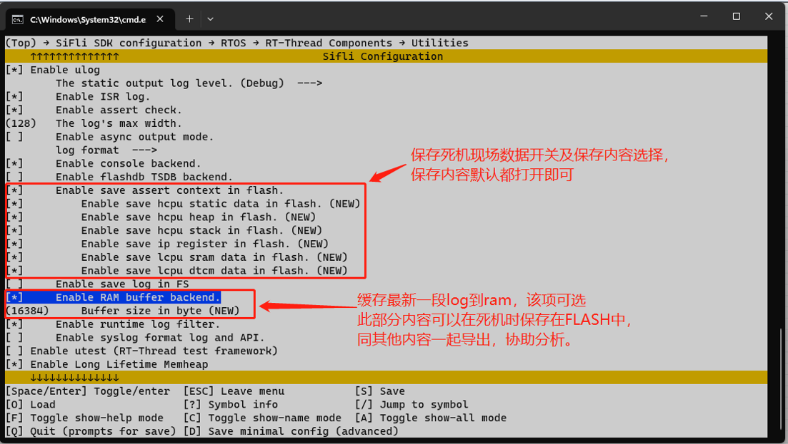
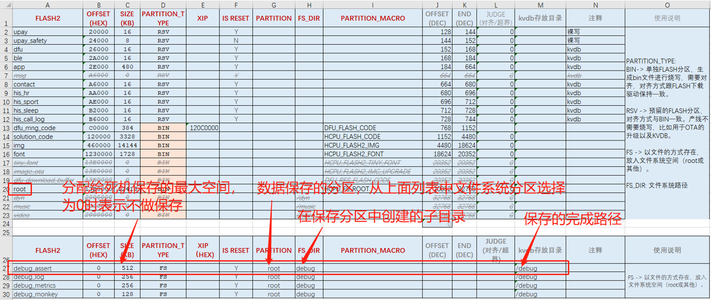
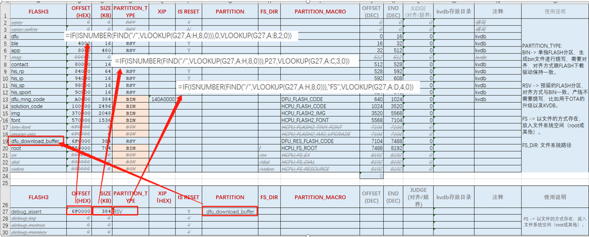
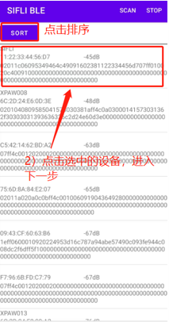
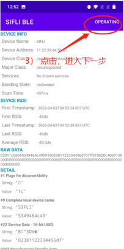
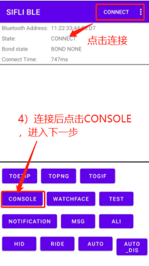
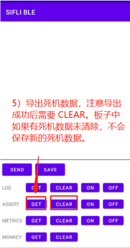
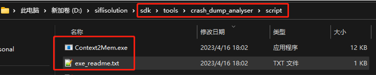
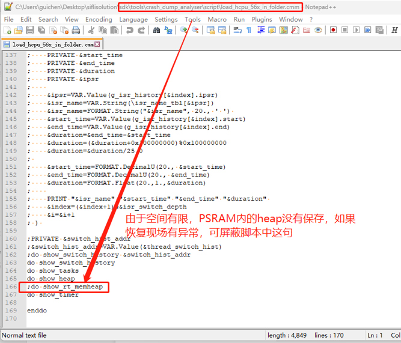

# 4 Methods for Saving Crash Dump
## 4.1 Saving Crash Dump to FLASH
1. menuconfig Configuration 
 `(Top) → RTOS → RT-Thread Components → Utilities → Enable save assert context in flash. ` 
  

2. Space Allocation (File System) 
Configure the space and partition for crash dump in the flash_map excel table. For file-based saving, you can directly specify SIZE/partition/subdirectory (for reference, the flash_map excel table is currently supported only by solution schemes). You can also create your own file storage.
  
In the flash_map excel table, configure the space and partition for crash dump. You can use a shared buffer by specifying the partition name of the shared buffer in the partition field. The address/SIZE/partition type can be automatically obtained using the formula shown in the following image.
  

3. Data Export 
After a terminal crash, the data will be saved to the configured location. After rebooting, you can export the data using the `SiFli_BLE` mobile app. The installation package (apk) and source code for the SiFli app can be downloaded from GitHub: 
[SiFli APP Demo Release](https://github.com/OpenSiFli/SiFli_OTA_APP/releases/tag/1.0.10) 
[SiFli_OTA_APP Demo](https://github.com/OpenSiFli/SiFli_OTA_APP)

The steps are as follows:
  

4. Data Parsing 
Use the following tool to parse the exported file, and you can then analyze the crash dump using the trace32 tool.
  
  
For analysis methods, refer to the section: 
[6.2 Using Trace32 to Restore Hcpu Crash Dump](../tools/trace32.md#Mark_Using_Trace32_to_Restore_Hcpu_Crash_Dump)