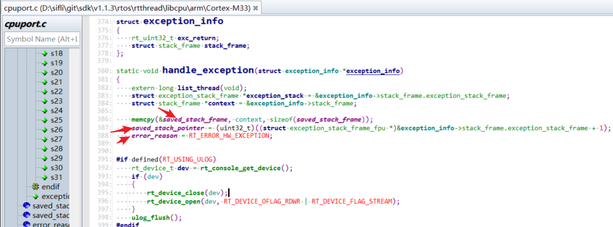
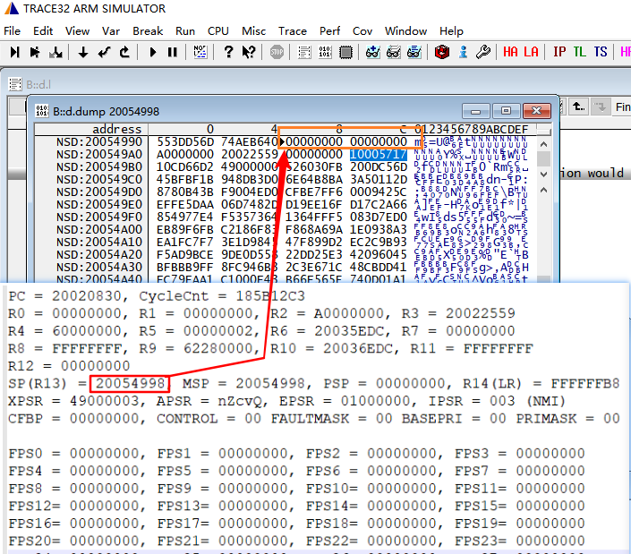
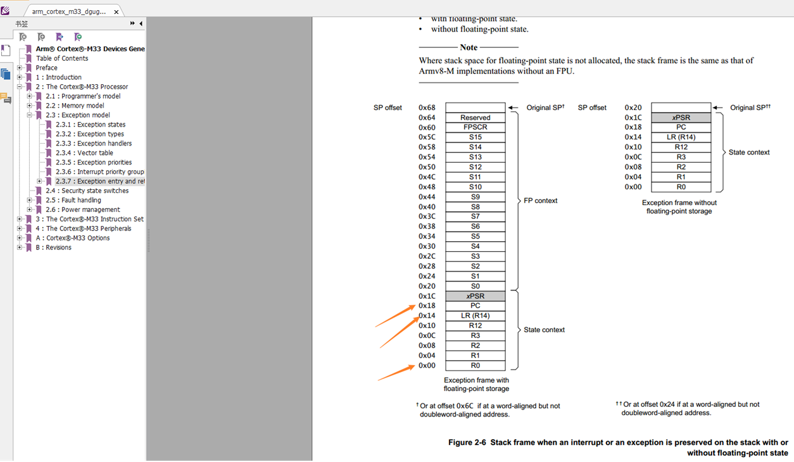

# 3 Dump Memory to Recover Crash Scene
## 3.1 Dump Memory Method
Refer to section [5.8 Dump Memory Method](../tools/sifli.md#Mark_Dump内存方法) to dump the crash memory scene<br>
## 3.2 Automatic Crash Scene Recovery Using Trace32
Refer to section [6.2 Recover Hcpu Crash Scene Using Trace32](../tools/trace32.md#Mark_用Trace32恢复Hcpu死机现场)<br>
<a name="33Trace32手动恢复死机现场方法"></a>
## 3.3 Manual Crash Scene Recovery Using Trace32
When automatic recovery fails, you can manually fill in the register values based on the crash scene to recover the crash scene<br>
When an interrupt occurs (hardfault is also an interrupt), the interrupt function is:<br>
```
HardFault_Handler->rt_hw_hard_fault_exception->handle_exception
```
Within the function, registers R0-R4, R12, R14(LR), and PC are pushed onto the stack into the `saved_stack_frame` and `saved_stack_pointer` variables,
<br><br>    
The pushed registers can be seen in the second figure. In the crash scene shown in the first figure, R0 is at address 0x20054998, LR is at address 0x200549AC, and PC is at address 0x200549B0:0x10CD6602,<br>
Register PC: stores the program counter pointer before the crash<br>
Register LR: stores the program counter pointer to return to after execution<br>
These registers can be used to recover the crash scene,<br>
The global variable `saved_stack_pointer` stores the base address of the stack push<br>
The global variable `saved_stack_frame` stores the data pushed onto the stack<br>
<br><br>
<br><br>