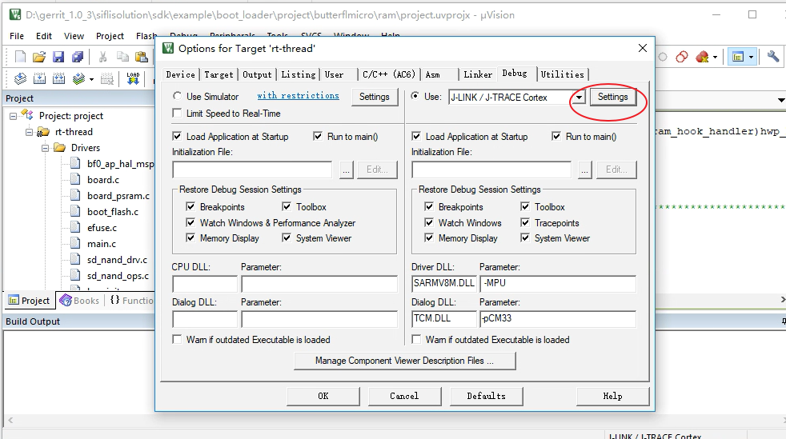
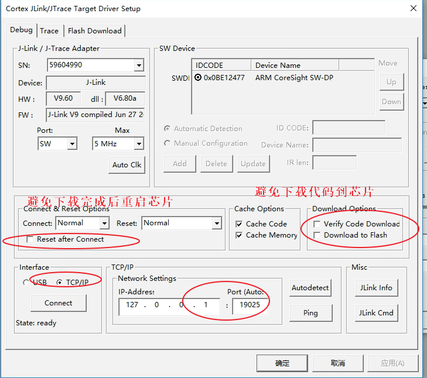
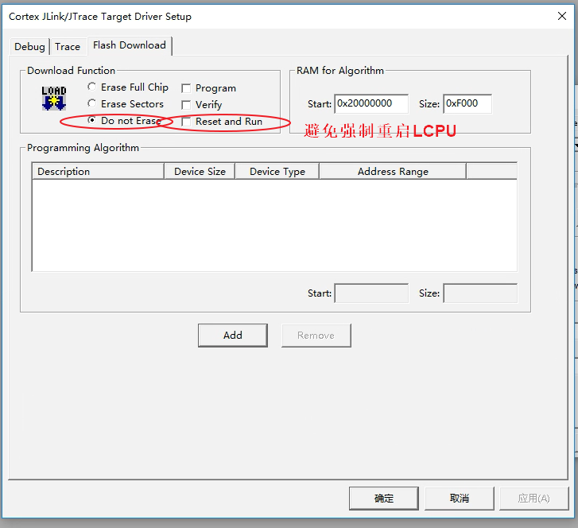
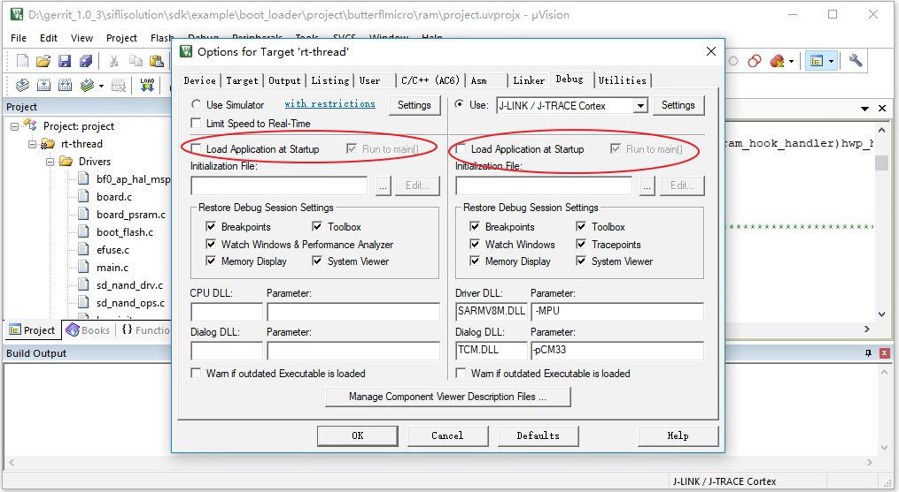
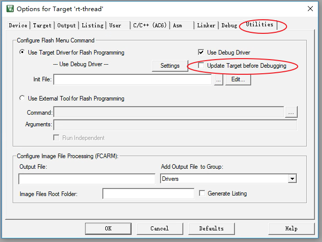
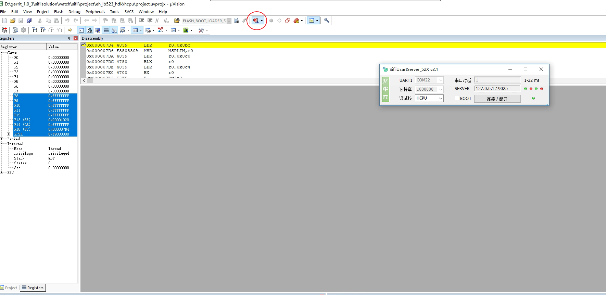
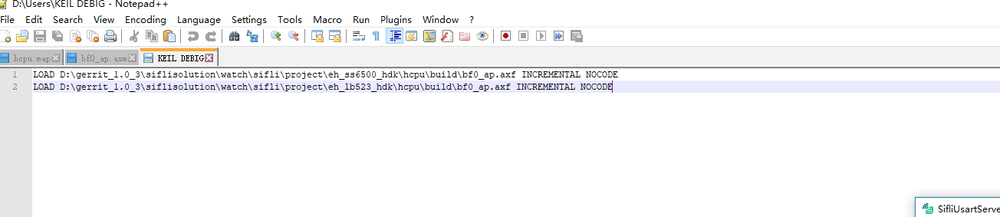
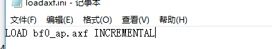
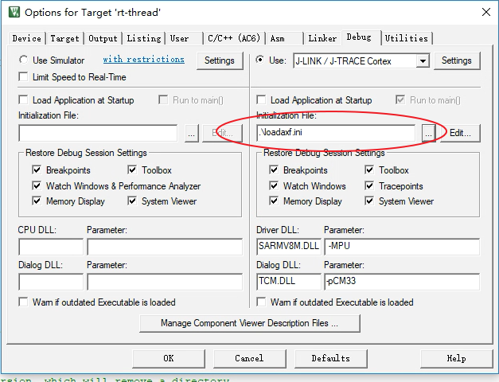

# 2 Online Debugging Methods
## 2.1 Breakpoint Debugging Method
In the bootloader code, system startup, and during wake-up from sleep, the system may crash, and Jlink or serial port communication may be lost. It is often difficult to pinpoint the crash. You can add breakpoints at code locations where the system is confirmed to be still running, and then connect online via SifliUsartServer or Jlink to step through the code and locate the issue. You can add a breakpoint at the very beginning of the system reset:

HCPU startup assembly code is located at `drivers/cmsis/sf32lb55x/Templates/arm/startup_bf0_hcpu.S`
LCPU startup assembly code is located at `drivers/cmsis/sf32lb55x/Templates/arm/startup_bf0_lcpu.S`

Remove the comment ';' from the first instruction in `Reset_Handler`, changing it to `B .`
```c
; Reset Handler
Reset_Handler   PROC
                EXPORT   Reset_Handler             [WEAK]
                IMPORT   SystemInit
                IMPORT   __main

                B        . ;// First instruction executed after MCU reset, add breakpoint here

                LDR      R0, =__stack_limit
                MSR      MSPLIM, R0                          ; Non-secure version of MSPLIM is RAZ/WI

                LDR      R0, =SystemInit ;// Corresponds to C function void SystemInit(void)
                BLX      R0
                LDR      R0, =__main ;// Corresponds to C function int $Sub$$main(void)->rtthread_startup();
                BX       R0
                ENDP
```

This will cause the MCU to stop at the first instruction upon startup. Once Jlink is successfully connected, you can use Ozone or Keil to change the PC register (+2) and set the required breakpoints to debug the initialization process.

You can also add the assembly instruction `__asm("B .");` in the C files `SystemInit()` or `rtthread_startup()`.
```c
__ROM_USED int rtthread_startup(void)
{
    rt_hw_interrupt_disable();

    /* Board level initialization
     * NOTE: please initialize heap inside board initialization.
     */
#ifdef RT_USING_PM
    rt_application_init_power_on_mode();
#endif // RT_USING_PM
    __asm("B ."); // Set breakpoint
    rt_hw_board_init();
```
This will cause the system to stop at this instruction. At this point, connect Jlink and use Ozone or Keil to change the PC register (+2) and continue debugging step-by-step or with breakpoints.

## 2.2 Ozone Step-by-Step Debugging Configuration
Please refer to the relevant sections of the Ozone tool:
[4.3 Ozone Step-by-Step Debugging Debug](../tools/ozone.md/#43Ozone单步调试Debug)
## 2.3 Keil Step-by-Step Debugging Configuration
<br><br>
- Method to import axf files:
1. Import via command
<br><br>
2. Import via script file
Add a script file `loadaxf.ini` to the Keil root directory, with the following content:
<br><br>
Note: The axf file `bf0_ap.axf` needs to be placed in the Keil root directory.
Add `loadaxf.ini` to the configuration interface:
<br><br>