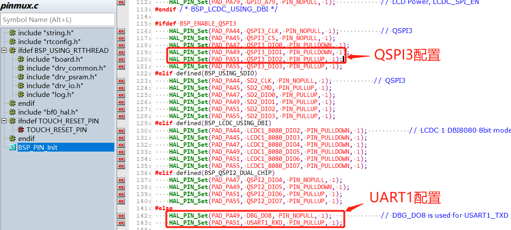
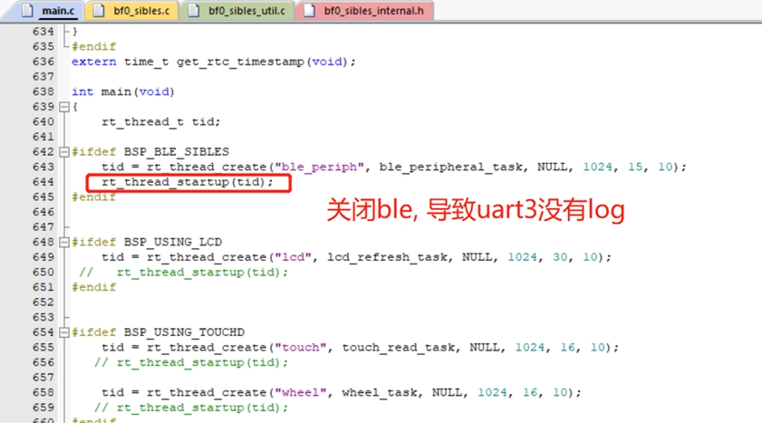
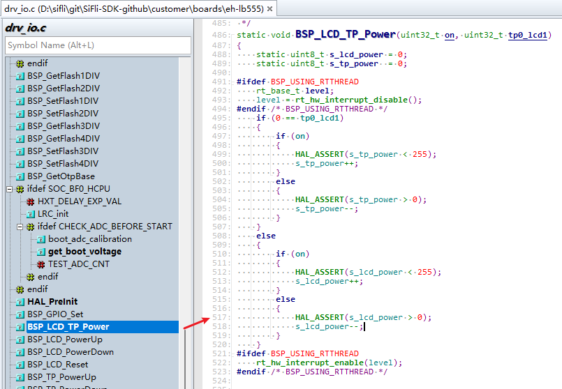

# 1 Log Debugging
## 1.1 Hcpu Not Outputting Log
1. menuconfig → RTOS → RT-Thread Kernel → Kernel Device Object → Configure uart1 as uart1
2. menuconfig → RTOS → RT-Thread Components → Utilities → Enable ulog
TIPS: You can search for "ulog" in menuconfig by entering "/"
3. Check if UART1 is correctly configured in `pinmux.c` as UART1. A common issue is enabling BSP_ENABLE_QSPI3, as shown in the following figure:
<br><br>    

## 1.2 Lcpu Not Outputting Log
After the following configurations, there is still no output:
  1. menuconfig → RTOS → RT-Thread Kernel → Kernel Device Object → Configure uart3 as uart3
  2. menuconfig → RTOS → RT-Thread Components → Utilities → Enable ulog
  3. Ensure that in menuconfig → RTOS → RT-Thread Kernel → Kernel Device Object → uart1, it is not configured as uart3 to avoid conflicts.
  4. Confirm that the UART3 mode configuration for PB45 and PB46 in `pinmux.c` is correct. The default configuration is correct, as follows:
  ```c
    HAL_PIN_Set(PAD_PB45, USART3_TXD, PIN_NOPULL, 0);           // USART3 TX/SPI3_INT
    HAL_PIN_Set(PAD_PB46, USART3_RXD, PIN_PULLUP, 0);           // USART3 RX
```
Other Reason 1:
Using the V0.9.9\example\rt_driver\project\ec-lb551 project, the BLE thread is not enabled, causing the Lcpu program to not load.
<br><br>       
Solution:
Enable the BLE thread or call the function `lcpu_power_on();` to start the Lcpu code.
Other Reason 2:
```
example\multicore\ipc_queue\
example\pm\coremark\
```
For these projects, you need to send the command `lcpu on` in the HCPU console to start the LCPU. After a successful start, you can see the startup log on the LCPU console.
Solution:
In the corresponding project, there is a `readme.txt` file. Refer to its content to send the command to start the Lcpu.

## 1.3 Methods for Printing Registers in Code
Direct Address Read Operation:
```c
static uint32_t pinmode19;
pinmode19 = *(volatile uint32_t *)0x4004304c; // Read the value of register 0x4004304c
uint32_t reg_printf = *(volatile uint32_t *)0x50016000; // Print the value of register 0x50016000
rt_kprintf("0x50016000:0x%x\n", reg_printf);
```
Direct Address Write Operation:
```c
#define _WWORD(reg, value) \
{ \
    volatile uint32_t * p_reg = (uint32_t *) reg; \
    *p_reg = value; \
}
_WWORD(0x40003050, 0x200);  // Write the value 0x00000200 to the PA01 pinmux register
```
Register Definition Read Operation:
```c
rt_kprintf("hwp_hpsys_rcc->CFGR:0x%x\n", hwp_hpsys_rcc->CFGR);
uint32_t reg_printf = hwp_hpsys_rcc->CFGR; // Print the register value
rt_kprintf("hwp_hpsys_rcc->CFGR:0x%x\n", reg_printf);
```
Register Definition Write Operation:
```c
hwp_hpsys_rcc->CFGR = 0x40003050; // Directly write the value
MODIFY_REG(hwp_pmuc->LPSYS_SWR, PMUC_LPSYS_SWR_PSW_RET_Msk,
           MAKE_REG_VAL(1, PMUC_LPSYS_SWR_PSW_RET_Msk, PMUC_LPSYS_SWR_PSW_RET_Pos)); // Only modify the value of PMUC_LPSYS_SWR_PSW_RET_Msk to 1, leaving other parts unchanged;
```
## 1.4 Methods for Locating System Hangs
1. Indicate that the other core has crashed
The following log indicates that the Lcpu has crashed, and the Hcpu has triggered an Assert. You need to determine where the Lcpu has hung.
```
07-11 10:31:55:616    [351767] E/mw.sys ISR: LCPU crash
07-11 10:31:55:617    Assertion failed at function:debug_queue_rx_ind, line number:221 ,(0)
07-11 10:31:55:617    Previous ISR enable 0
```
**Note**: In dual-core development, when one CPU has hung, the other CPU is in an unknown state and may continue to run for a long time, making it difficult to identify the issue. Currently, the software is designed to notify the other core when one CPU encounters a known assert or hard fault. The other core will then trigger its own assert to facilitate problem identification.

2. Assert Line Number Indication<br>
The following log indicates that the Assert occurred at line 517 of the `drv_io.c` file:
```
07-10 16:41:16:382    [572392] I/drv.lcd lcd_task: HW close
07-10 16:41:16:385    HAL assertion failed in file:drv_io.c, line number:517 
07-10 16:41:16:388    Assertion failed at function:HAL_AssertFailed, line number:616 ,(0)
07-10 16:41:16:389    Previous ISR enable 1
```
The corresponding line 517 of the `drv_io.c` file is shown in the following figure:<br>
`RT_ASSERT(0);` or `HAL_ASSERT(s_lcd_power > 0);` will cause a system crash if the value inside the parentheses is 0 (False);<br>
A crash at this point indicates that `s_lcd_power > 0` is false (s_lcd_power is not greater than 0)
<br><br>  

3. Log Indication of Crash PC Pointer Information<br>
The following log, in the case of a hard fault, shows that the PC pointer has already jumped to the exception handler `HardFault_Handler` or `MemManage_Handler` inside the `rt_hw_mem_manage_exception` or `rt_hw_hard_fault_exception` function. The PC pointer seen when connected may no longer be the first crash scene. The PC and other addresses printed in the log represent the first crash scene and can be used to recover the initial crash scene. For example, the crash occurred at the address `0x0007ef00`. You can check the corresponding `*.asm` file generated by the compiler to determine why this instruction caused a crash, which is usually due to accessing an invalid memory or address, leading to an exception and a crash.<br> 
**Note**: In the function `handle_exception`, the variables `saved_stack_frame`, `saved_stack_pointer`, and `error_reason` will also store the stack, stack address, and reason for the crash when the above exceptions occur. These can be used to analyze the cause of the crash by referring to the source code data structures.
```
06-24 15:48:41:031     sp: 0x200195c8
06-24 15:48:41:037    psr: 0x80000000
06-24 15:48:41:041    r00: 0x00000000
06-24 15:48:41:042    r01: 0x2001960c
06-24 15:48:41:043    r02: 0x00000010
06-24 15:48:41:044    r03: 0x0007ef00
06-24 15:48:41:045    r04: 0x00000000
06-24 15:48:41:046    r05: 0x00000010
06-24 15:48:41:046    r06: 0x00000000
06-24 15:48:41:047    r07: 0x00000010
06-24 15:48:41:047    r08: 0x2001960c
06-24 15:48:41:048    r09: 0x2001965c
06-24 15:48:41:049    r10: 0x60000000
06-24 15:48:41:049    r11: 0x00000000
06-24 15:48:41:050    r12: 0x200001cd
06-24 15:48:41:051     lr: 0x12064845
06-24 15:48:41:052     pc: 0x0007ef00
06-24 15:48:41:052    hard fault on thread: mbox
06-24 15:48:41:053    
06-24 15:48:41:053    =====================
06-24 15:48:41:054    PSP: 0x20019534, MSP: 0x2001419c
06-24 15:48:41:055    ===================
```