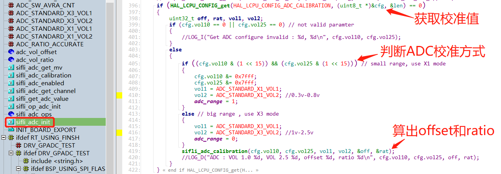
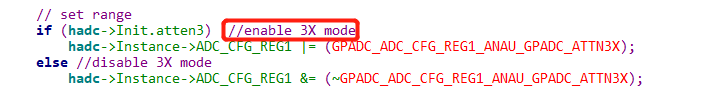
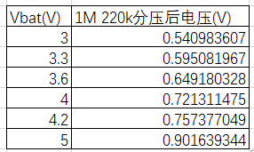
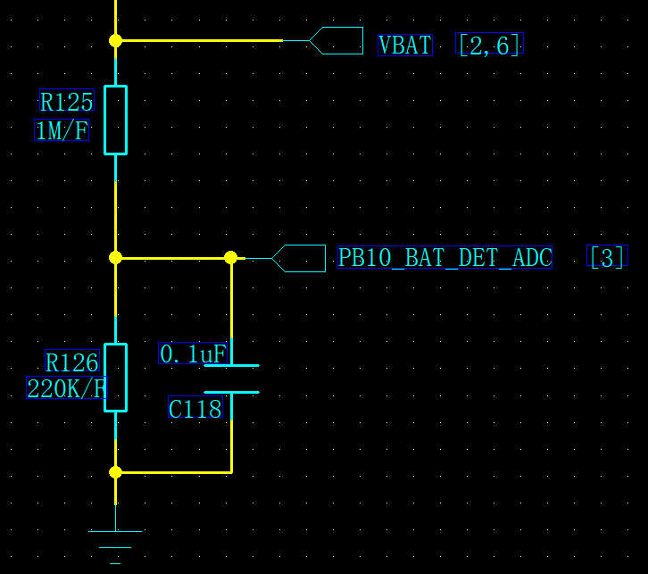
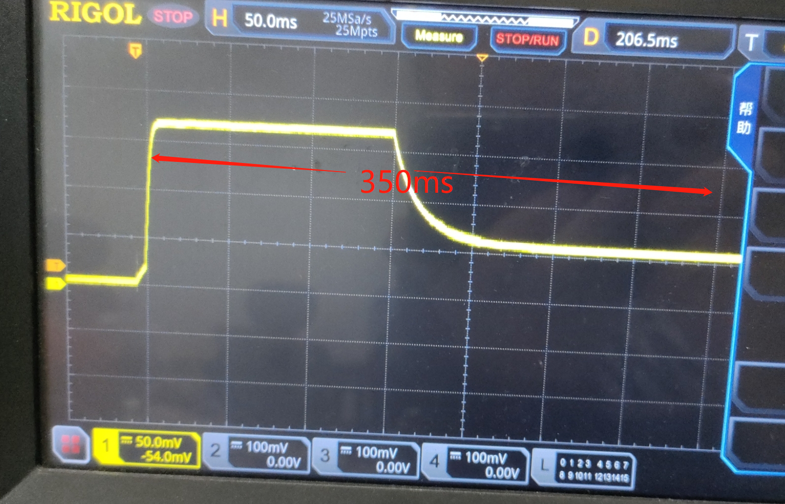
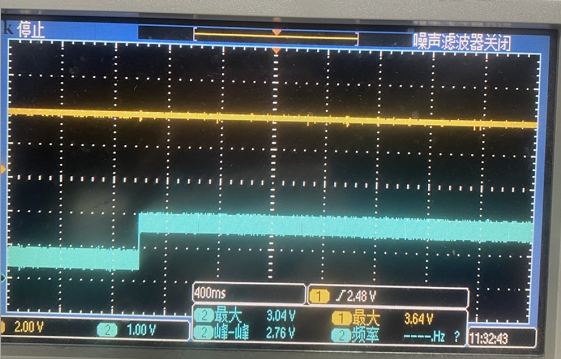
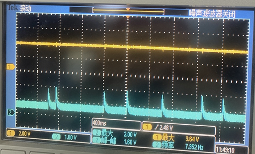
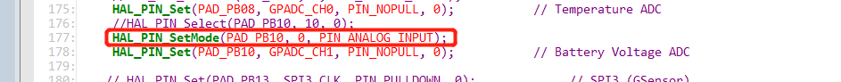

# 6 ADC Related
## 6.1 55 Series ADC Calibration Principle
The sf32lb55x chip is a 10-bit ADC, and to ensure the accuracy of ADC sampling:
Calibration principle:
When the chip is manufactured, the ADC values at 1.0V and 2.5V are measured for each chip and written to the factory area of the flash, with the ID being FACTORY_CFG_ID_ADC.
During ADC initialization with `sifli_adc_init`, these two values, `vol10` and `vol25`, corresponding to the voltages 1.0V and 2.5V, are read from the factory area of the flash.
Through the function
```c
sifli_adc_calibration(cfg.vol10, cfg.vol25, vol1, vol2, &off, &rat);
#define ADC_STANDARD_X3_VOL1           (1000)
#define ADC_STANDARD_X3_VOL2           (2500)
```
a linear line between the ADC register values and the voltage values is calculated.
The offset and linear ratio of this line are obtained, where the offset value is the calculated register value corresponding to 0V.

Subsequently, the values read by the ADC are converted to the corresponding voltage values using this offset and ratio.
**Note:**
In early versions, the ADC calibration points were 1V and 2.5V
```c
#define ADC_STANDARD_X3_VOL1           (1000)
#define ADC_STANDARD_X3_VOL2           (2500)
```
In the new version, the calibration points are 0.3V and 0.8V
```c
#define ADC_STANDARD_X1_VOL1           (300)
#define ADC_STANDARD_X1_VOL2           (800)
```
The calibration method using 0.3V and 0.8V sets the highest bit of these calibration values to 1, as follows:
<br><br>
```c
if ((cfg.vol10 & (1 << 15)) && (cfg.vol25 & (1 << 15))) // small range, use X1 mode
``` 
The corresponding `sifli_adc_get_mv` calculation method will differ based on the two calibration ranges, `adc_range`.

When using 0.3V and 0.8V as calibration points, the accuracy is insufficient for voltages close to 0V and above 1V. Additionally, in this mode, the software register `ADC_CFG_RE` disables the `GPADC_ADC_CFG_REG1_ANAU_GPADC_ATTN3X` mode, which turns off the internal voltage divider resistors. Therefore, the ADC test point should not be directly connected to voltages exceeding 1.1V, as it may damage the chip.
 <br><br>
When using 1V and 2.5V as calibration points, the `GPADC_ADC_CFG_REG1_ANAU_GPADC_ATTN3X` mode is enabled in the register configuration, which activates the internal voltage divider resistors, attenuating the input voltage by a factor of 3. The input voltage should not exceed 3.3V.

## 6.2 Debugging Methods for Inaccurate Vbat Battery Voltage Sampling
a. Measure the voltage at the sampling point with a multimeter. The recommended voltage divider circuit uses 1M/220k resistors with 1% precision.
Therefore, the voltage at the sampling point should fall within the corresponding range. If it does not, verify the resistor values and precision.
(Note: Measuring the voltage at the sampling point with a multimeter or oscilloscope can introduce an input impedance, causing a 30mV voltage drop.)
<br><br>
<br><br>
b. After power-on and wake-up from sleep, the first 300ms of ADC sampling may be inaccurate, as shown in the following figure:
<br><br>
Using an oscilloscope to capture the ADC sampling waveform at startup, you can observe that the ADC waveform, apart from the initial high level, is affected by the RC circuit's charging and discharging, leading to a stabilization period of about 350ms. In practical applications, you may need to add a delay before sampling or filter out the initial unstable samples.
c. After entering standby, the sampling point waveform may appear as follows:
<br><br>
Upon waking from standby, the sampling point waveform appears as follows:
<br><br>
The reason is that PB10 is internally pulled up by default when not initialized and is used as an ADC input. In `pinmux.c`, it should be configured as `PIN_NOPULL` and set to `PIN_ANALOG_INPUT` mode.
As shown in the figure, the missing setting in the red box, which should be `PIN_ANALOG_INPUT` mode, causes the internal pull-up resistor of PB10 to be enabled, resulting in occasional high sampling voltages.
<br><br>
d. The 55x chip has not been calibrated.
All chips are calibrated at the factory, and the ADC calibration parameters are stored in the factory area of the flash. Refer to the ADC calibration principle chapter for more details.
<br>

## 6.3 ADC Precautions
a. The maximum sampling voltage for the 55x series is 1.1V, for the 56x and 52x series it is 3.3V. The sampling voltage should not exceed these values, as it can easily damage the ADC module.
b. When connecting the log UART of the 56x series to an external PC, the reference level of the external hardware serial tool should match the IO level to avoid affecting the accuracy of ADC sampling. For example, if the IO level is 3.3V and the external hardware serial tool's reference level is 5V, the sampled ADC value will be significantly lower than normal, and a 4V battery might be detected as only 3.3V.
c. When measuring the voltage at the sampling point with a multimeter, the measured value may be slightly lower than the actual value due to the introduction of resistance.