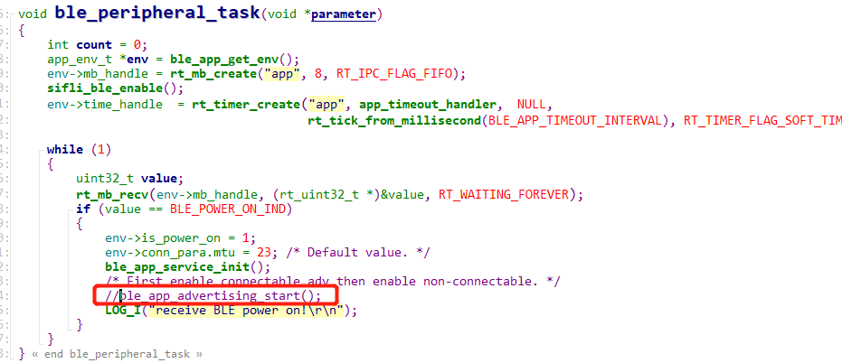
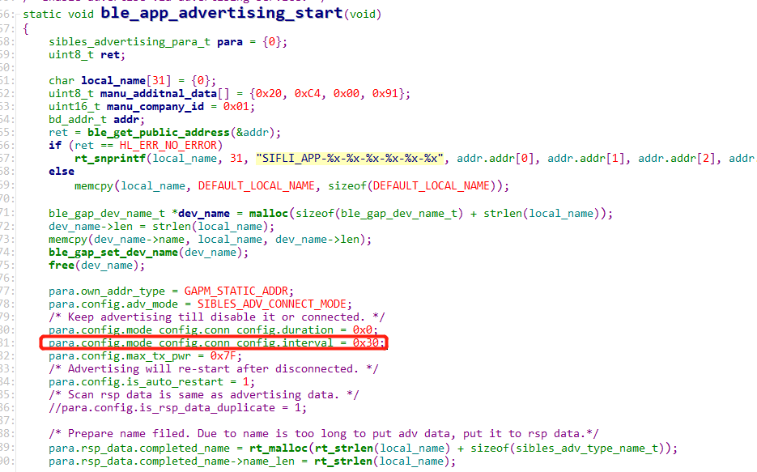

# 11 Bluetooth
## 11.1 BLE Advertising Disable and BLE Advertising Interval Modification
Remove the call to `ble_app_advertising_start();` in the `ble_peripheral_task` function, as shown in the following figure:
    
To modify the BLE advertising interval:
    
In the `ble_app_advertising_start` function,
 para.config.mode_config.conn_config.interval = 0x30; // 0x30 * 0.625 = 30ms advertising interval 
0x30 is 48 in decimal * 0.625 = 30ms advertising interval. 
To change the interval to 500ms, modify it to 800, 