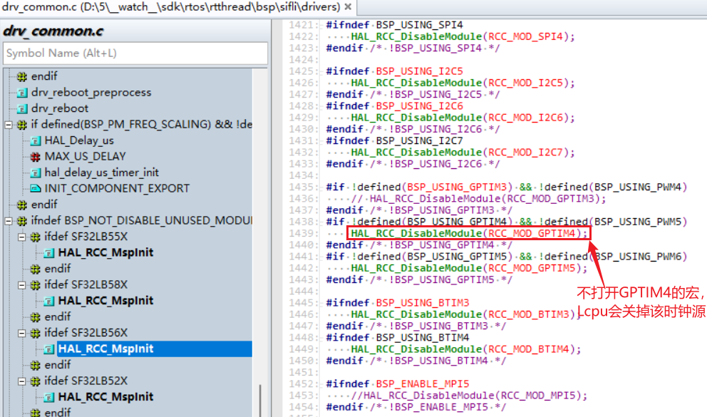
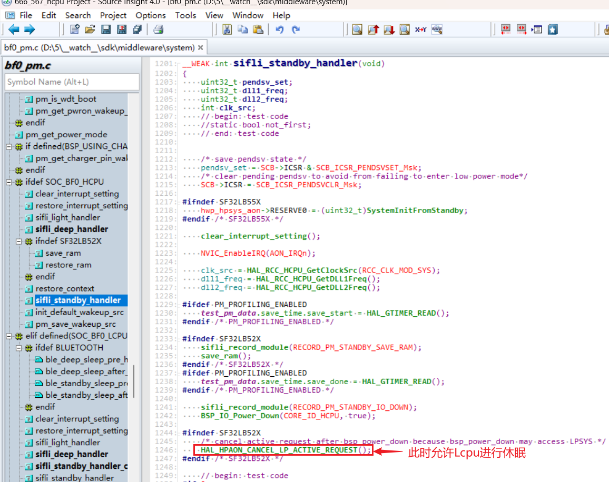
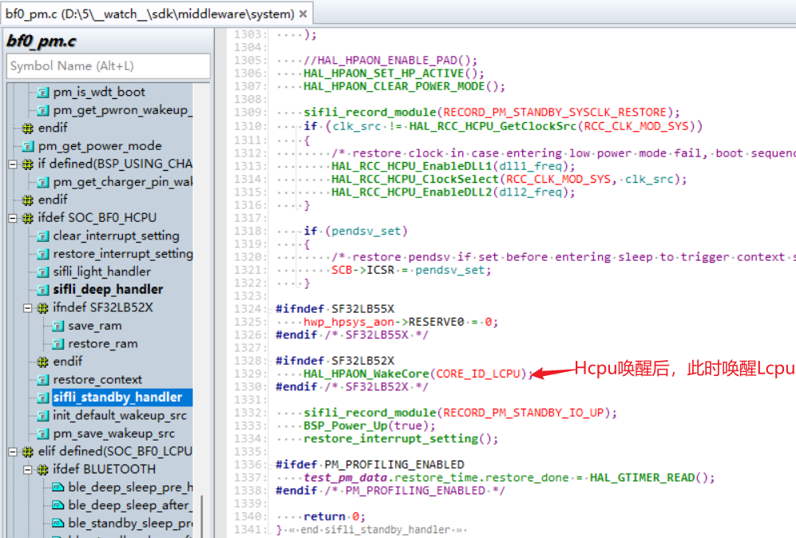
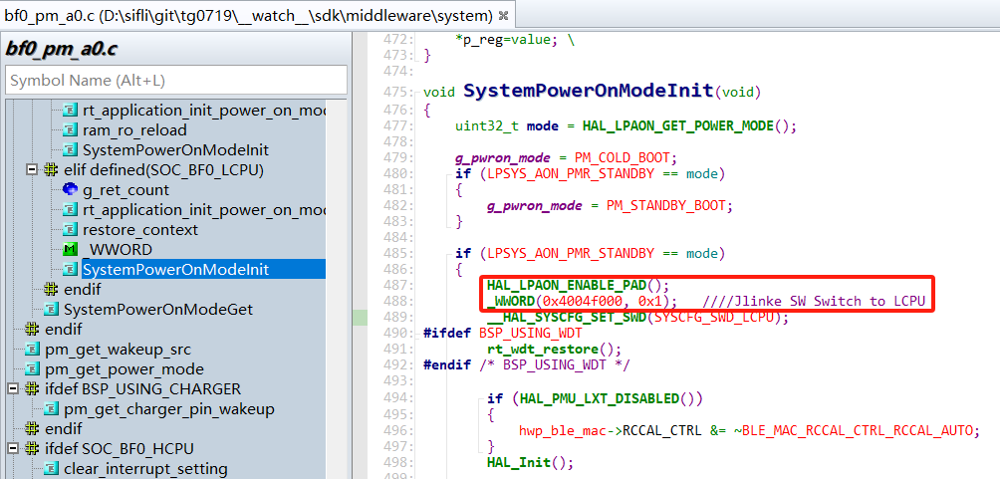
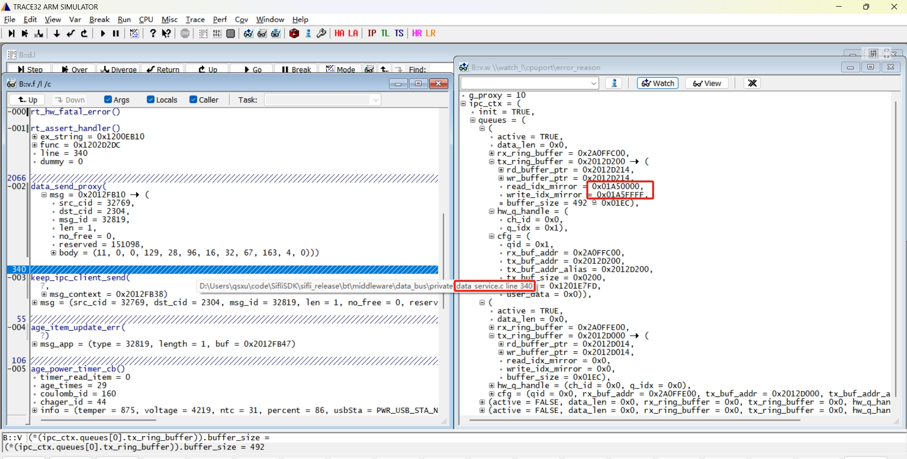

# 14 Dual-Core Related
## 14.1 Dual-Core Resource Access Rules
1) When Hcpu is in the awake state, it can use all peripheral resources of Lcpu, including PB port, I2C, UART, etc.;<br>
2) When Hcpu uses Lcpu peripherals, the corresponding macro definitions for Lcpu peripherals must also be enabled. For example, if Hcpu needs to use Lcpu PWM5 to drive a motor, and GPTIM4 and PWM5 are not enabled in the code, the existing SDK code will turn off this module after initialization to save power, causing Hcpu to fail in operating GPTIM4 to output PWM5; <br>
```c
 HAL_RCC_DisableModule(RCC_MOD_GPTIM4);// Disable GPTIM4 module
```
<br><br>   
Similarly, when Hcpu uses Lcpu's I2C, UART, SPI resources, the same operation is required; <br>
3) In the 56x and 52x series, each core's IO can only be configured as resources owned by that core. <br>
For example, the PA05_I2C_UART function of PA05 can be configured to use any I2C or UART group, but it must follow the rule that PA port can only be configured with I2C resources owned by Hcpu, such as i2c1-i2c4 for 56x, and cannot be configured with resources owned by Lcpu, such as i2c5-i2c7. <br>
Similarly, PB port can only be configured with resources owned by that core, and the same principle applies to PWM configurations like PA05_TIM. <br>
4) Lcpu cannot use Hcpu's PA port or other peripheral resources, nor can it access Hcpu's registers, as this will result in a Hardfault and system crash; <br>
For example, in the bsp_pinmux.c and bsp_power.c files, functions such as BSP_PIN_Init, BSP_Power_Up, and BSP_IO_Power_Down, which are shared by Hcpu and Lcpu, must place operations on PA port within the #ifdef SOC_BF0_HCPU macro definition to prevent Lcpu from calling PA IO operation functions. <br>
5) In the 55x, 58x, and 56x series SDK configurations, the software is designed to wake up Lcpu whenever Hcpu is awakened. After Hcpu wakes up, it will use the HAL_HPAON_WakeCore(CORE_ID_LCPU); function to wake up Lcpu (in the 52x series, Hcpu and Lcpu are independently put to sleep). In the Hcpu sleep functions sifli_standby_handler or sifli_deep_handler, the function HAL_HPAON_CANCEL_LP_ACTIVE_REQUEST(); is used to allow Lcpu to enter sleep mode; <br>
After allowing Lcpu to sleep, Hcpu accessing Lcpu's peripheral resources will also result in a Hardfault, so careful handling is required during the sleep process. The code is as follows:
<br><br>
<br><br>   

## 14.2 Communication Interface for Big and Little Cores
Refer to the SiChes Technology Software Development Kit documentation and the two dual-core communication examples ipc_queue and data_service in the example\multicore\ directory.<br>
### 14.2.1 Communication Using Data Service Registration and Subscription
```c
datas_register(btn_service_name, &button_service_cb); // Register button publish
sensors_service_handle = datas_register("SENSORS_APP", &sensors_service_cb); // Register sensor publish
datas_push_data_to_client(service, sizeof(action), &action); // Publish message to client
datac_subscribe(key2_button_handle, "btn1", button_service_callback_key2, 0); // Register subscription
```

### 14.2.2 Direct Communication through Existing Sensor or BLE IPC Mechanism
Through the existing sensor channel:<br>
```c
ipc_send_msg_from_sensor_to_app(SENSOR_APP_EVENT_BATTERY_IND, sizeof(event_remind_t), &remind_ind); // Send message to Hcpu
ipc_send_msg_from_app_to_sensor(&msgx); // Hcpu sends to Lcpu's sensor
```
Through the existing BLE channel:<br>
```c
ipc_send_msg_from_ble_to_app(BLE_APP_OTA_RECV_IND, len, (uint8_t *)param); // Send message to Hcpu
ipc_send_msg_from_app_to_ble(&msgx); // Hcpu sends to Lcpu
```
To debug dual-core communication issues, you can check the contents of the global structure variable `ipc_cxt`<br>
```c
typedef struct
{
    bool active;                          /**< whether the queue is opened, true: opened  */
    uint32_t data_len;                    /**< len of data in rx_ring_buffer */
    struct circular_buf *rx_ring_buffer;
    struct circular_buf *tx_ring_buffer;
    ipc_hw_q_handle_t hw_q_handle;        /**< handle of hw queue */
    ipc_queue_cfg_t cfg;                  /**< queue configuration */
} ipc_queue_t;
```

## 14.3 Switching Jlink(SWD) to Debug Different Cores
Use Case: Debugging Lcpu with Jlink when Hcpu is already in sleep mode or using Ozone to debug Lcpu online<br>
Operation Method: Modify the SWSEL bit in the SWCR register of hwp_lpsys_cfg
- SWSEL
- 0: SWD connected to HCPU
- 1: SWD connected to LCPU
Method 1: Execute the corresponding batch file in the SDK directory \tools\segger when Hcpu is connected to Jlink
- 55 series: jlink_lcpu_a0.bat
- 55 series: jlink_lcpu_pro.bat
Method 2: Modify in the code<br>
```c
// Direct physical address operation of the register
#define _WWORD(reg,value) \
{ \
    volatile uint32_t * p_reg=(uint32_t *) reg; \
    *p_reg=value; \
}
_WWORD(0x4004f000, 0x1);   // 55X Jlink SW Switch to LCPU
_WWORD(0x4004f000, 0x0);   // 55X Jlink SW Switch to HCPU
_WWORD(0x5000f000, 0x1);   // 56X, 58X Jlink SW Switch to LCPU
_WWORD(0x5000f000, 0x0);   // 56X, 58X Jlink SW Switch to HCPU
```
Or specify the register operation
```c
hwp_lpsys_cfg->SWCR = 1; // Jlink SW Switch to LCPU
hwp_lpsys_cfg->SWCR = 0; // Jlink SW Switch to HCPU
```
If the Lcpu crash occurs early after waking up, it is recommended to add the following at the entry point of Lcpu wake-up, refer to the 56X standby process, but note that the GPIO configuration needs to be enabled in advance:<br>
```c
HAL_LPAON_ENABLE_PAD();// Enable Lcpu's GPIO configuration
```
<br><br>    

## 14.4 How to Determine a Crash Caused by a Full Dataservice Queue in Dual-Core Communication
1) As shown in the figure, the Assert occurs within the `data_send_proxy` function of Lcpu.<br>
2) Check if the `read_idx_mirror` and `write_idx_mirror` in the `tx_ring_buffer` have the same high 16 bits and the low 16 bits are either all 0 or all 1. Conversely, if the high 16 bits are the same and the low 16 bits are also the same, it indicates that the buffer is empty.<br>
As shown in the figure, the first 16 bits are all 0x01AF, and the last 16 bits are one all 0 and one all 1, indicating that the buffer is full, causing the crash.<br>
3) Such crashes are usually due to the other core (in this case, Hcpu) crashing or being busy, leading to the inability to process dataservice messages in time. You need to investigate the reason for the crash or the busy state of the other core.<br>
<br><br>