# 1 GPIO Related
## 1.1 GPIO Operation and Debugging Methods
### 1.1.1 RTT Driver Layer Operation Methods
The SiChes series MCUs have a dual-core architecture, where Hcpu includes the PA port, and Lcpu includes the PB port. The 58,56 series also include low-power IO: the PBR port.<br>
To facilitate unified GPIO operations in the RTT operating system, the PA, PB, and PBR ports in the RTThread operating system's pin device operations are currently arranged in a unified GPIO manner:<br>
PA01 corresponds to 1, PA78 corresponds to 78,<br>
PB ports are offset by 96, so PB0 corresponds to 96, PB1 corresponds to 97, PB40 corresponds to 136<br>
PBR0 ports are offset by 160, so PBR0 corresponds to 160, PBR1 corresponds to 161, PBR2 corresponds to 162<br>

PA, PB, and PBR can be obtained using the `GET_PIN` or `GET_PIN_2` functions,<br>
The first parameter of the `GET_PIN` function is 0, 1, 2, corresponding to PBR, GPIO1 (PA), and GPIO2 (PB), respectively,<br>
For example<br>
```
pin_number = GET_PIN(0, 0); // PBR0 corresponds to 160
PBR1 is GET_PIN(0, 1) = 161,
PB1 is GET_PIN(2, 1) = 97,
PA1 is GET_PIN(1, 1) = 1
```
The first parameter of `GET_PIN_2` is `hwp_pbr`, `hwp_gpio1`, `hwp_gpio2`,<br>
```c
pin_number = GET_PIN_2(hwp_pbr, 1);  // PBR1 value is 161
pin_number = GET_PIN_2(hwp_gpio2, 1); // PB1 value is 97
pin_number = GET_PIN_2(hwp_gpio1, 1); // PA1 value is 1
```
After unifying the GPIO arrangement, the IO can be operated using a generic interface. The operation code is as follows:<br>
```c
rt_pin_mode(160, PIN_MODE_OUTPUT);  /* Configure PBR0 as output */
rt_pin_write(160, PIN_LOW);  /* PBR0 outputs low level */
rt_pin_mode(160, PIN_MODE_INPUT_PULLUP); /* Configure PBR0 as input, note that the pull-up/pull-down configuration is not effective in the current code, and must be configured using HAL functions */
if (1 == rt_pin_read(160)) /* Read PBR0 status */
//
rt_pin_mode(78, PIN_MODE_OUTPUT);  /* Configure PA78 as output */
rt_pin_write(78, 0); /* PA78 outputs low */
//
rt_pin_mode(79, PIN_MODE_INPUT_PULLUP); /* Configure PA79 as input, note that the pull-up/pull-down configuration is not effective in the current code, and must be configured using HAL functions */
if (1 == rt_pin_read(79)) /* Read PA79 status */
```
Configure as interrupt input:
```c
rt_pin_mode(144, PIN_MODE_INPUT_PULLUP); // Configure PB48 as input (48 + 96 = 144), note that the pull-up/pull-down configuration is not effective in the current code, and must be configured using HAL functions
curr_state = rt_pin_read(144); /* Read PB48 status */
rt_pin_attach_irq(144, PIN_IRQ_MODE_FALLING, chsc5816tp_irq_handler, RT_NULL); /* Configure as falling edge trigger, interrupt function is chsc5816tp_irq_handler */
rt_pin_irq_enable(144, 1); /* Enable PB48 GPIO interrupt */
//
rt_pin_mode(160, PIN_MODE_INPUT); // Configure PBR0 as input, note that the pull-up/pull-down configuration is not effective in the current code, and must be configured using HAL functions
rt_pin_attach_irq(160, PIN_IRQ_MODE_FALLING, (void*)bt5376a_wakeup_event_handle, (void*)(rt_uint32_t)160); // Configure as falling edge interrupt and interrupt handler function bt5376a_wakeup_event_handle
rt_pin_irq_enable(160, 1); // Enable interrupt
```

**Note:**
1. DRV layer functions cannot modify the GPIO function; HAL layer functions must be used. By default, the pin initialization is set in the `BSP_PIN_Init` function during chip power-on or wake-up from standby;<br>
2. Hcpu can fully operate Lcpu's resources, including the PB port, but Lcpu cannot directly read or write the PA port, otherwise a Hardfault will occur;<br>
3. Before performing device read/write operations on a pin, the mode must be set using `rt_pin_mode`. Setting the input/output mode using the HAL layer is also not effective;<br>
4. When using RTT layer to operate GPIO, the IO state is automatically backed up and restored after entering Standby sleep. The backup function is `pm_pin_backup();` and the restore function is `pm_pin_restore();`. After executing `HAL_HPAON_DISABLE_PAD();`, the GPIO output level will remain unchanged when operating the GPIO. After executing `HAL_HPAON_ENABLE_PAD();`, the GPIO and pinmux register configurations will be output to the external GPIO. The GPIO state will be maintained during deep sleep and will not change;<br>
5. For more information on RTT layer GPIO operations, refer to the RTT official website:<br> [PIN Device (rt-thread.org)](https://www.rt-thread.org/document/site/#/):
<br>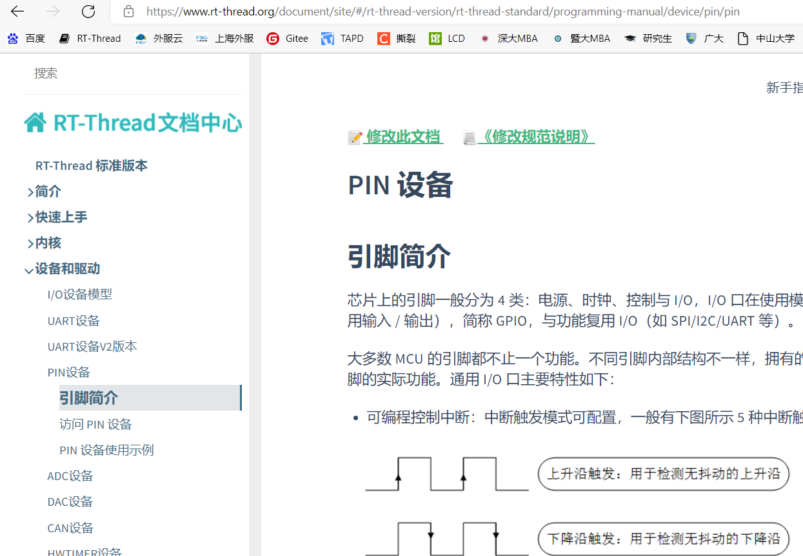<br>

### 1.1.2 HAL Layer Operation Methods
When the RTT operating system is not yet up and running, for example, the underlying layer of `drv_io.c` can directly call the HAL interface's GPIO functions to read and write GPIO ports<br>
* PA/PB Port Operation Methods:<br>
Set the PA/PB function and pull-up/pull-down settings, PA/PB need to be distinguished by a parameter:<br>
```c
HAL_PIN_Set(PAD_PA03, GPIO_A3, PIN_NOPULL, 1); // Set PA03 to GPIO mode, no pull-up/pull-down
```
Output high/low:<br>
```c
BSP_GPIO_Set(3, 0, 1); // PA03 outputs low
BSP_GPIO_Set(3, 0, 0); // PB03 outputs low
```
Configure GPIO as input/output, PA24 is configured as input mode as shown in the figure below:<br>
```c
GPIO_InitTypeDef GPIO_InitStruct;           
GPIO_InitStruct.Mode = GPIO_MODE_INPUT;                
GPIO_InitStruct.Pin = 24;                 
GPIO_InitStruct.Pull = GPIO_NOPULL;         
HAL_GPIO_Init(hwp_gpio1, &GPIO_InitStruct); 
```
Read IO value:<br>
```c
int value;
value = HAL_GPIO_ReadPin((GPIO_TypeDef *)hwp_gpio1, 48); // Read the value of PA48:
value = HAL_GPIO_ReadPin((GPIO_TypeDef *)hwp_gpio2, 48); // Read the value of PB48:
```
**Note:**<br> 
1. When operating GPIO at the HAL layer, parameters are needed to distinguish between hcpu and lcpu, so the DRV layer cannot be used to operate PB48 as 96+48;<br>
2. When operating GPIO at the HAL layer, after entering Standby sleep mode, the IO state is automatically backed up and restored. The backup function is `pm_pin_backup();` and the restore function is `pm_pin_restore();`. After executing `HAL_HPAON_DISABLE_PAD();`, the GPIO output level will remain unchanged. After executing `HAL_HPAON_ENABLE_PAD();`, the GPIO and pinmux registers will be output to the external GPIO;<br>

* PBR Port Operation Methods:<br>
```c
HAL_PBR_ConfigMode(2, 1); // Configure PBR2 as output mode, the first parameter 0 corresponds to PBR0, 2 corresponds to PBR2; the second parameter, 1 for output, 0 for input;
HAL_PBR_WritePin(2, 1); // Configure PBR2 to output high
value = HAL_PBR_ReadPin(0); // Read the value of PBR0, returns 0 or 1, a return value less than 1 indicates an error, such as an invalid input pin
HAL_PIN_Set_Analog(PAD_PBR1, 0); // Set PBR1 to analog input, high impedance state externally
HAL_PIN_Set(PAD_PBR1, PBR_GPO, PIN_NOPULL, 0); // Configure PBR1 to GPIO mode
```
For specific functions supported by each IO, refer to the file `bf0_pin_const.c` in `pin_pad_func_hcpu` or the hardware documentation `SF32LB5XX_Pin config_X.xlsx`<br>
<br>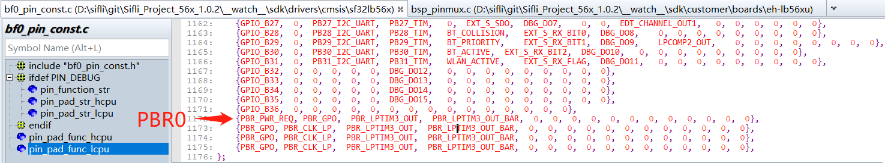<br>   

**Note:**<br>
PBR0 is by default in PWR_REQ mode, where the hardware automatically controls the output level high and low. When the LCPU is awake, it outputs high, and when it is sleeping, it outputs low. Therefore, when some boards use this PIN to control the power supply of the large core PSRAM or NOR, it needs to be forced to output high to prevent the PSRAM from losing power when the small core is sleeping. The operation is as follows:<br>
HAL_PBR0_FORCE1_ENABLE();

### 1.1.3 Register Operation GPIO Method
Below is the direct operation of GPIO register PA24 to output high, low, and toggle (the GPIO output state must be configured in advance), refer to the chip manual for register meanings<br>
```c
#define PM_DEBUG_PIN_HIGH()      ((GPIO1_TypeDef *)hwp_gpio1)->DOSR0 |= (1UL << 24)//PA00 - PA31
#define PM_DEBUG_PIN_LOW()       ((GPIO1_TypeDef *)hwp_gpio1)->DOCR0 |= (1UL << 24)
#define PM_DEBUG_PIN_TOGGLE()    ((GPIO1_TypeDef *)hwp_gpio1)->DOR0  ^= (1UL << 24)
```
Below is an example of register operation for IO initialization and read/write operations:<br>
`pin_test` is the test program:<br>
```c
#ifdef SOC_BF0_HCPU
#define PA_HIGH(port) (port > 31) ? (((GPIO1_TypeDef *)hwp_gpio1)->DOR1 |= (1UL << (port-32))) : (((GPIO1_TypeDef *)hwp_gpio1)->DOR0 |= (1UL << port))
#define PA_LOW(port) (port > 31) ? (((GPIO1_TypeDef *)hwp_gpio1)->DOR1 &= (~(1UL << (port-32)))) : (((GPIO1_TypeDef *)hwp_gpio1)->DOR0 &= (~(1UL << port)))
#define PA_TOGGLE(port) (port > 31) ? (((GPIO1_TypeDef *)hwp_gpio1)->DOR1 ^= (1UL << (port-32))) : (((GPIO1_TypeDef *)hwp_gpio1)->DOR0 ^= (1UL << port))
#define PA_VALUE(port) (port > 31) ? (((GPIO1_TypeDef *)hwp_gpio1)->DIR1 &= (1UL << (port-32))) : (((GPIO1_TypeDef *)hwp_gpio1)->DIR0 &= (1UL << port))
#define PA_INIT(port,mode)                              \
        do                                              \
        {                                               \
            GPIO_InitTypeDef GPIO_InitStruct;           \
            GPIO_InitStruct.Mode = mode;                \
            GPIO_InitStruct.Pin = port;                 \
            GPIO_InitStruct.Pull = GPIO_NOPULL;         \
            HAL_PIN_Set(PAD_PA00+port, GPIO_A0+port, PIN_NOPULL, 1); \
            HAL_GPIO_Init(hwp_gpio1, &GPIO_InitStruct); \
        }                                               \
        while (0)
            
#ifndef SF32LB52X
#define PB_HIGH(port) (port > 31) ? (((GPIO2_TypeDef *)hwp_gpio2)->DOR1 |= (1UL << (port-32))) : (((GPIO2_TypeDef *)hwp_gpio2)->DOR0 |= (1UL << port))
#define PB_LOW(port) (port > 31) ? (((GPIO2_TypeDef *)hwp_gpio2)->DOR1 &= (~(1UL << (port-32)))) : (((GPIO2_TypeDef *)hwp_gpio2)->DOR0 &= (~(1UL << port)))
#define PB_TOGGLE(port) (port > 31) ? (((GPIO2_TypeDef *)hwp_gpio2)->DOR1 ^= (1UL << (port-32))) : (((GPIO2_TypeDef *)hwp_gpio2)->DOR0 ^= (1UL << port))
#define PB_VALUE(port) (port > 31) ? (((GPIO2_TypeDef *)hwp_gpio2)->DIR1 &= (1UL << (port-32))) : (((GPIO2_TypeDef *)hwp_gpio2)->DIR0 &= (1UL << port))
#define PB_INIT(port,mode)                              \
                do                                              \
                {                                               \
                    GPIO_InitTypeDef GPIO_InitStruct;           \
                    GPIO_InitStruct.Mode = mode;                \
                    GPIO_InitStruct.Pin = port;                 \
                    GPIO_InitStruct.Pull = GPIO_NOPULL;         \
                    HAL_PIN_Set(PAD_PB00+port, GPIO_B0+port, PIN_NOPULL, 0); \
                    HAL_GPIO_Init(hwp_gpio2, &GPIO_InitStruct); \
                }                                               \
                while (0)
#endif
```

```c
int pin_test(int argc, char **argv)
{
    char i;
    uint8_t pin, value;
    if (argc > 1)
    {
        pin = strtoul(argv[3], 0, 10);
        value = strtoul(argv[4], 0, 10);
        rt_kprintf("pin:%d,value:%d,\n", pin, value);
        if ((strcmp("pa", argv[1]) == 0) || (strcmp("PA", argv[1]) == 0))
        {
            if (strcmp("-w", argv[2]) == 0)
            {
                if (value == 1)
                {
                    PA_HIGH(pin);
                    rt_kprintf("PA%d set high\n", pin);
                }
                else if (value == 0)
                {
                    PA_LOW(pin);
                    rt_kprintf("PA%d set low\n", pin);
                }
                else
                {
                    PA_TOGGLE(pin);
                    rt_kprintf("PA%d toggle\n", pin);
                }
            }
            else if (strcmp("-r", argv[2]) == 0)
            {
                if (PA_VALUE(pin))
                    rt_kprintf("PA%d is high, %x\n", pin, PA_VALUE(pin));
                else
                    rt_kprintf("PA%d is low, %x\n", pin, PA_VALUE(pin));
            }
            else if (strcmp("-init", argv[2]) == 0)
            {
                if (value == 0)
                {
                    PA_INIT(pin, GPIO_MODE_INPUT);
                    rt_kprintf("PA%d INIT set input\n", pin);
                }
                else
                {
                    PA_INIT(pin, GPIO_MODE_OUTPUT);
                    rt_kprintf("PA%d INIT set output\n", pin);
                }
            }
        }
#ifndef SF32LB52X
        else if ((strcmp("pb", argv[1]) == 0) || (strcmp("PB", argv[1]) == 0))
        {
            if (strcmp("-w", argv[2]) == 0)
            {
                if (value == 1)
                {
                    PB_HIGH(pin);
                    rt_kprintf("PB%d set high\n", pin);
                }
                else if (value == 0)
                {
                    PB_LOW(pin);
                    rt_kprintf("PB%d set low\n", pin);
                }
                else
                {
                    PB_TOGGLE(pin);
                    rt_kprintf("PA%d toggle\n", pin);
                }
            }
            else if (strcmp("-r", argv[2]) == 0)
            {
                if (PB_VALUE(pin))
                    rt_kprintf("PB%d is high, %x\n", pin, PB_VALUE(pin));
                else
                    rt_kprintf("PB%d is low, %x\n", pin, PB_VALUE(pin));
            }
            else if (strcmp("-init", argv[2]) == 0)
            {
                if (value == 0)
                {
                    PB_INIT(pin, GPIO_MODE_INPUT);
                    rt_kprintf("PB%d INIT set input\n", pin);
                }
                else
                {
                    PB_INIT(pin, GPIO_MODE_OUTPUT);
                    rt_kprintf("PB%d INIT set output\n", pin);
                }
            }
        }
#endif
    }
    else
    {
        rt_kprintf("example:\npin_test pa -init 29 0  #set PA29 to input \n");
        rt_kprintf("pin_test pa -init 29 1  #set PA29 to output\n");
        rt_kprintf("pin_test pa -w 29 1  #write PA29 to high level\n");
        rt_kprintf("pin_test pa -w 29 0  #write PA29 to low level\n");
        rt_kprintf("pin_test pa -r 29  #read PA29\n");
        rt_kprintf("pin_test pb -init 29 1  #set PB29 to output\n");
    }
    return 0;
}
```

MSH_CMD_EXPORT(pin_test, forward pin_test command); /* Export to msh command list */
#endif

```
Call method:<br>
```c
PA_INIT(29,GPIO_MODE_OUTPUT); // Initialize PA29 as output
PA_HIGH(29); // Set PA29 high
PA_TOGGLE(29); // Toggle PA29
PA_INIT(33,GPIO_MODE_INPUT); // Configure PA33 as input
uint8_t value = PA_VALUE(33); // Read PA33, non-zero value represents high, 0 represents low level
PB_INIT(2,GPIO_MODE_OUTPUT); // Initialize PB02 as output
```

### 1.1.4 GPIO Debugging Methods
* Method 1:<br>
Use the serial finsh command, the corresponding implementation function is: `int cmd_pin(int argc, char **argv)`
After Hcpu/Lcpu enable the finsh function (Hcpu is enabled by default), in the serial console platform, you can use the pin command line to check the GPIO status, set GPIO to high or low level, for example:
```
pin // Check command prompt
pin status all // Check the status of all GPIOs
pin status 120 // Check the status of PB24 (120-96=24)
pin mode 120 0 // Set PB24 to output mode
pin write 78 1 // Set PA78 to high
pin mux 106 2 // Set PB10 (106-96=10) to function 2 I2C4_SDA
pin status 160 // Get the status of PBR0 (160-160=0)
```
<br>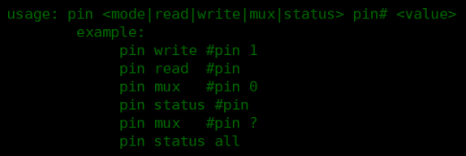<br>  

* Method 2:<br>
Use tools like Ozone, Jlink to connect to the MCU, read the pinmux and GPIO registers, and compare with the user manual to check if the configuration is correct;<br>
* Pinmux register address mapping:<br>
In `register.h`, PA port corresponds to `PINMUX1_BASE` or `hwp_pinmux1`, PB port corresponds to `PINMUX2_BASE` or `hwp_pinmux2`,<br>
For example, the pinmux register address for PA03 is: `hwp_pinmux1->PAD_PA03`<br>
* GPIO register address mapping:<br>
PA port corresponds to `GPIO1_BASE` or `hwp_gpio1`, PB port corresponds to `GPIO2_BASE` or `hwp_gpio2`
The input enable, output enable, pull-up/pull-down resistors, etc., of the PBR port IO (PBR) can be configured through the RTC's PBRxR registers, for example, the address of PBR0 is `hwp_rtc->BKP0R`


## 1.2 55X Series PA Port Level Fluctuation After Sleep and Wake-Up
    After HCPU PA port wakes up from sleep, it will first restore to the default pull-up/pull-down of the chip, as shown in the following figure: <br>
<br>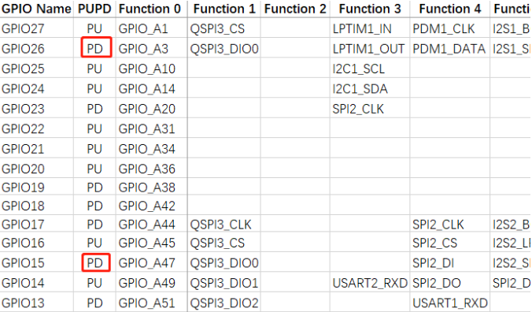<br>  
At this point, the user program has not yet started running, and then the values set in the `pinmux.c` file `BSP_IO_Init` will be executed,
Therefore, if the level of the HCPU GPIO is inconsistent with the default pull-up/pull-down during sleep, there may be a level transition of about 10ms after wake-up;<br>
For the LCPU PB port, the value before wake-up can be retained until the `BSP_IO_Init` function is executed, so as long as the GPIO port state is set in `BSP_IO_Init`, the value of the LCPU GPIO can be maintained during sleep.<br>
For example, if you want PA03 to remain high after power-on, but PA03 is default pull-down, there will be a low level of about 10ms after wake-up. In actual use, you should find a pin with default pull-up to replace PA03, such as PA10.<br>

**Note:** <br>
The 56X, 52X series PA ports do not have this issue.

## 1.3 How to Configure the TP Driver IRQ Interrupt
1, Menuconfig Configuration <br>
After configuration, the following will be generated in `rtconfig.h`: <br>
```c
#define TOUCH_IRQ_PIN 79
```
<br>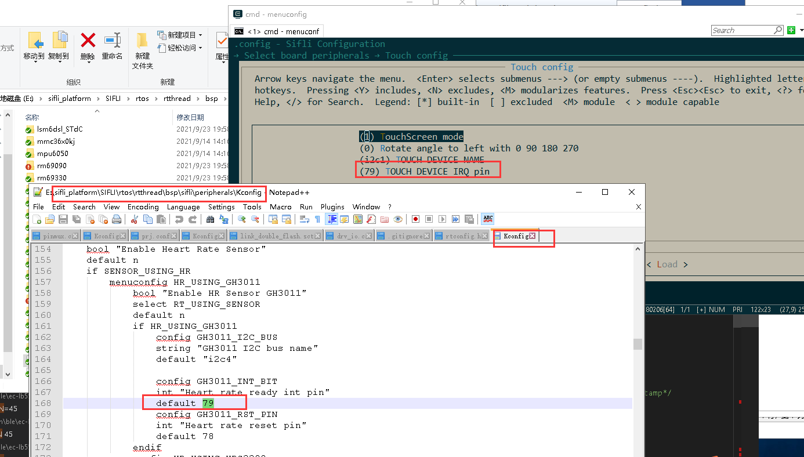<br>  
2, In `pinmux.c`, you need to confirm the mode and pull-up/pull-down status of the IO port:<br>
```c
HAL_PIN_Set(PAD_PA79, GPIO_A79, PIN_NOPULL, 1); // GPIO mode, no pull-up
```
3, In `drv_touch.c`, the driver can directly use the two functions:<br>
```c
    rt_touch_irq_pin_attach(PIN_IRQ_MODE_FALLING, cst816_irq_handler, NULL);
    rt_touch_irq_pin_enable(1);
```
Or you can define the interrupt in the initialization function:<br>
```c
    rt_pin_mode(TOUCH_IRQ_PIN, PIN_MODE_INPUT); // Configure as input
    rt_pin_attach_irq(TOUCH_IRQ_PIN, PIN_IRQ_MODE_FALLING, (void *) cst816_irq_handler, (void *)(rt_uint32_t)TOUCH_IRQ_PIN); // Configure falling edge interrupt and interrupt callback function
    rt_pin_irq_enable(TOUCH_IRQ_PIN, 1); // Enable interrupt
```
4, Hcpu serial input command: `pin status 79` to confirm the configuration is correct.<br>

## 1.4 How to Detach Touch IRQ
In the touch driver deinit function, before detaching the irq, the interrupt of the pin needs to be disabled first:
```c
static rt_err_t deinit(void)
{
    rt_pin_irq_enable(TOUCH_IRQ_PIN, 0); // disable irq
    rt_pin_detach_irq(TOUCH_IRQ_PIN);
...
```

## 1.5 Why is PA55, which is set as a default pull-down PD, high when I power on without any operation?
The root cause: In the customer's OTA code, there is an operation to pull PA55 high.
Ask the customer to add the breakpoint command `__asm("B .");` in the user program `pinmux.c`,
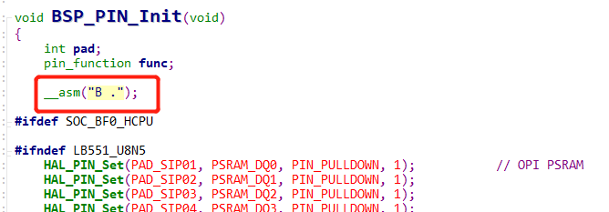  
Test PA55, it is high,
```
mem32 0x50000038 20 read the corresponding register, there is an operation to output high,
```
Input `r` in JLink to reset the chip,
After reading the register value, it returns to normal, and the PA55 level also returns to normal,
Since the user program starts running from 0x10060000, after reset, it starts running from 0x10020000, which is the OTA code, then jumps to the user's 0x1006000 code, and the OTA code `drv_io.c` operates PA55, causing this phenomenon.
<a name="16_55 series MCU multiplexing USB on PA01"></a>
## 1.6 55 Series MCU Multiplexing USB on PA01/PA03 Leakage Risk
In general, it is recommended that customers do not use PA01,
Since PA01 and PA03 are multiplexed for USB functionality, when used as GPIO, extra caution is required;
1. PA01 has an internal 18K pull-down resistor in active and light_sleep modes, which outputs a high level; otherwise, there is a risk of leakage. The 18K pull-down resistor does not take effect in standby and deep_sleep modes.
2. In standby mode, the output levels of PA01 and PA03 are inconsistent, which can cause leakage through the USB circuit.
Specifically, leakage of about 20uA will occur when the following conditions are met:
a. Enter standby sleep
b. PA01 and PA03 are configured with inconsistent levels (one outputs high or pull-up, the other outputs low or pull-down). The leakage current is an uncertain value and may vary with the board or environment.
c. Patch to eliminate leakage: When entering sleep, make the levels of the two IOs consistent, or at least set one to a high-impedance state (no pull-up or pull-down).
d. Some additional details: 1. The pull-down resistor of PA01 does not leak in standby and deep_sleep modes, but only in active or light_sleep modes. 2. High impedance not only involves our configuration but also requires no pull-up or pull-down on the board.
You can use the following method to output a high-impedance state:
```c
HAL_PIN_Set_Analog(PAD_PA01,1); /* Analog input is Func10, GPIO output is disabled, and input enable IE is off, i.e., high-impedance state */
HAL_PIN_Set_Analog(PAD_PA03,1);
```

## 1.7 55 Series MCU - PB47/PB48 Configuration for 32768 Clock Output

Before use, ensure that a 32768 crystal is mounted on the MCU and that `#define LXT_DISABLE 1` is disabled.
Additionally, two modifications are required:
1. Enable the flag, for example, for PB47:
```c
#define LPSYS_AON_DBGMUX_PB47_SEL_LPCLK  (0x1UL << LPSYS_AON_DBGMUX_PB47_SEL_Pos)
MODIFY_REG(hwp_lpsys_aon->DBGMUX, LPSYS_AON_DBGMUX_PB47_SEL_Msk, LPSYS_AON_DBGMUX_PB47_SEL_LPCLK);
```
2. If you need to maintain the 32k output during sleep, you need to disable the part shown in the screenshot below.
   Because if `LPSYS_AON_ANACR_PB_AON_ISO` is set to 1, the wake-up pins PB43~PB48 will maintain their levels during sleep, but the cost is that 32k or lptim3-controlled waveforms cannot be output. After disabling, the wake-up pins PB43~PB48 will not maintain their levels during sleep, so they cannot be used as GPIO output pins.
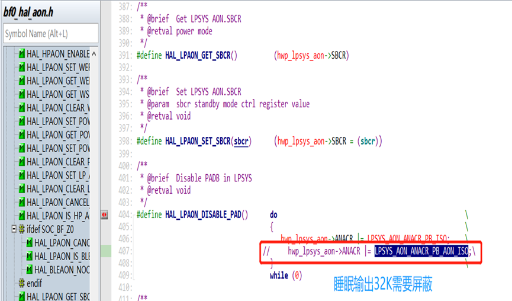  
3. Note:
   Because step 2 disables the IO retention function during standby for PB, the wake-up pins PB43-48 will not have internal pull-up or pull-down during standby. Therefore, the external circuit must provide a definite level or set the output high or low to prevent leakage of PB43-PB48 during standby.

## 1.8 Add PB25 as Key2
1. In Lcpu, `menuconfig` → `Sifli middleware` → `Enable button library` set the number of buttons to 2
2. In Lcpu, `menuconfig` → `Select board peripherals` → `Key config` set KEY2 to correspond to GPIO 121 (96+25)
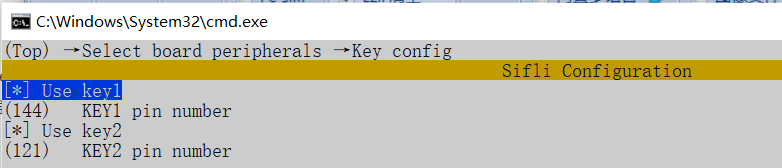  
3. In Lcpu, `menuconfig` → `Sifli middleware` → `Enable button library` set the number of buttons to 2
4. In Lcpu, `menuconfig` → `Select board peripherals` → `Key config` set KEY2 to correspond to GPIO 121 (96+25)
5. In Lcpu, in the `sensor_service.c` function `init_pin`, configure the initialization and wake-up source for KEY2
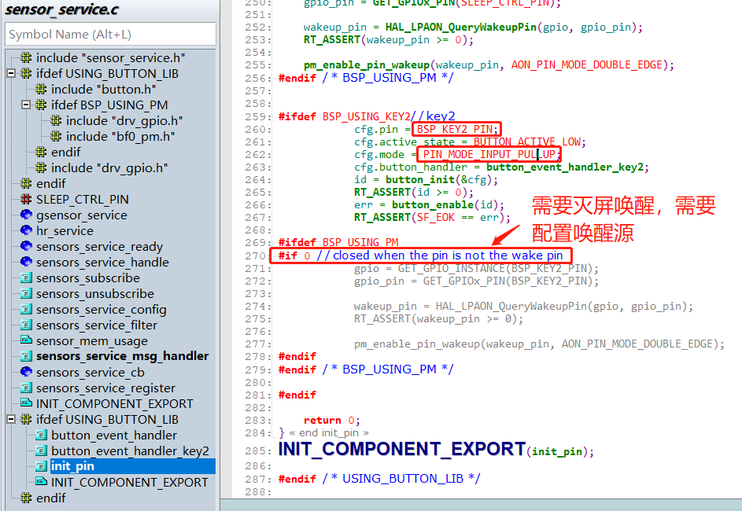  
6. In Hcpu, in the `watch_demo.c` function `init_pin`, configure the message subscription for KEY2
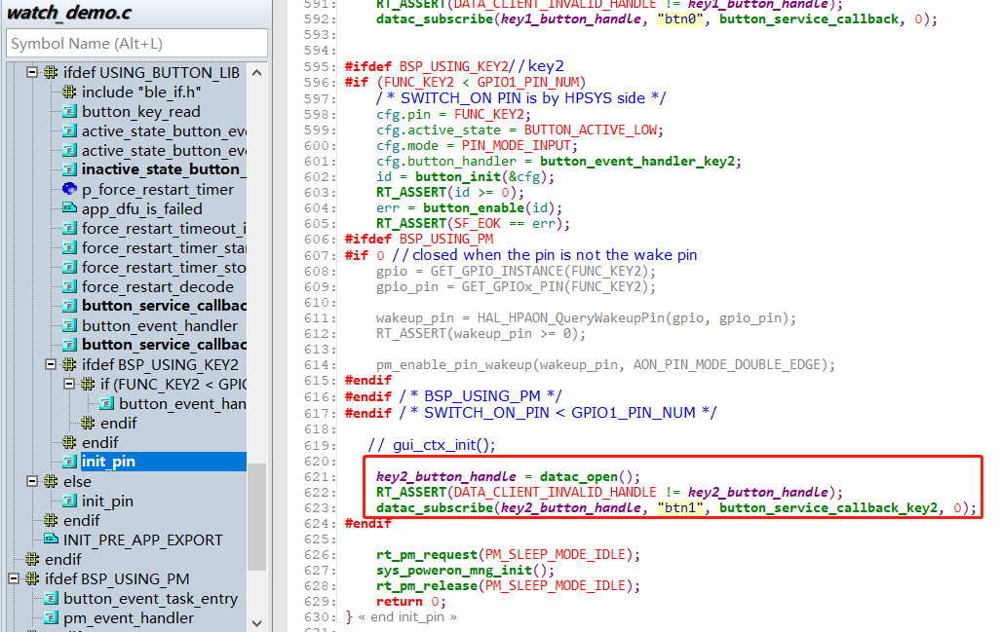  

## 1.9 Increase GPIO Drive Capability
Set both DS0 and DS1 bits to 1 for the strongest drive capability
```c
HAL_PIN_Set_DS0(PAD_PA10,1,1); // Set DS0 of PA10 to 1
HAL_PIN_Set_DS1(PAD_PA10,1,1); // Set DS1 of PA10 to 1
HAL_PIN_Set_DS1(PAD_PB16,0,1); // Set DS1 of PB16 to 1
```

## 1.10 GPIO Configuration as High-Z Mode
As follows, set the IO to analog input mode, which makes the IO pin high-impedance externally.<br>
```c
HAL_PIN_Set_Analog(PAD_PA17, 1); // PA17 set to analog input, high-impedance externally
HAL_PIN_Set_Analog(PAD_PB27, 0);  // PB27 set to analog input, high-impedance externally
```
To restore the IO from high-impedance mode to its original state, as follows:<br>
```c
HAL_PIN_Set(PAD_PA17, GPIO_A17, PIN_NOPULL, 1);
HAL_PIN_Set(PAD_PB27, GPIO_B27, PIN_NOPULL, 0);
HAL_PIN_SetMode(PAD_PA17, 1, PIN_DIGITAL_IO_PULLDOWN);  // Not required after SDK version v2.2.0
HAL_PIN_SetMode(PAD_PB27, 0, PIN_DIGITAL_IO_PULLUP); // Not required after SDK version v2.2.0
```
`HAL_PIN_Set_Analog` sets the IO's IE bit to 0. If only the `HAL_PIN_Set` function is called for configuration, this function does not operate the IE bit, so the input cannot be used. To restore the IO to an input state, the `HAL_PIN_SetMode` function must be called to set the IE bit back to 1 (not required after SDK version v2.2.0).<br>

**Note:**<br>
After SDK version v2.2.0, the `HAL_PIN_Set` function has added the operation to set the IE bit back to 1, so the `HAL_PIN_SetMode` function is no longer needed.

## 1.11 52X PA22/PA23 32K Crystal Multiplexed IO, I2C Cannot Output Waveform Issue
Reason:<br>For 52X, the default IE bit for other IOs is 1, while the IE bit for the two 32K IOs is 0 by default,<br>
By default, the `HAL_PIN_Set` function does not set the IE bit to 1, and since the IE bit for PA22 and PA23 is 0 by default, they cannot output a waveform.
<br>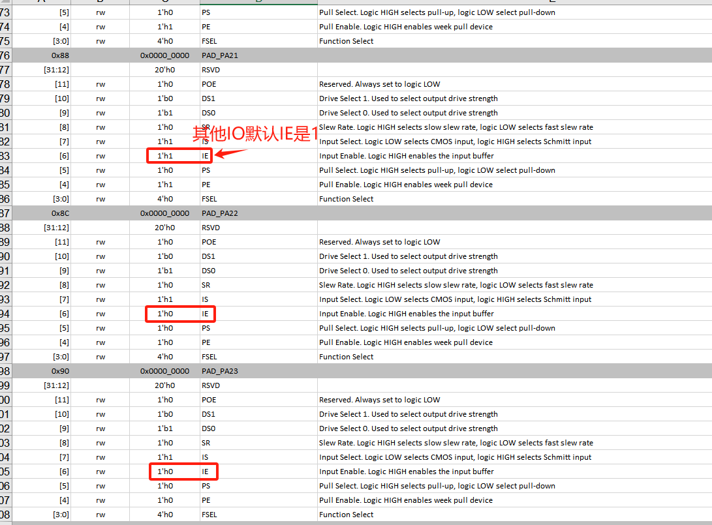<br>   
Solution:<br>
Add the `HAL_PIN_SetMode` function to set the IO to a normal IO, which will set the IE bit to 1, allowing I2C to output normally.
<br>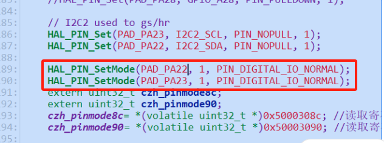<br>  

**Note:**<br>
For 56X, the IE bit for PA55 and PA56, the two 32K IOs, is 1 by default, so this issue does not exist.<br>
After SDK version v2.2.0, the `HAL_PIN_Set` function has added the operation to set the IE bit back to 1, so the `HAL_PIN_SetMode` function is no longer needed.

## 1.12 PAXX_I2C_UART and PAXX_TIM Configuration Methods
For the 55 and 58 series MCUs, each IO is a fixed I2C, UART, or PWM output port. Starting from the 56 and 52 series MCUs, to increase the flexibility of the IOs, as shown in the following figure, the configuration has become more flexible:
<br>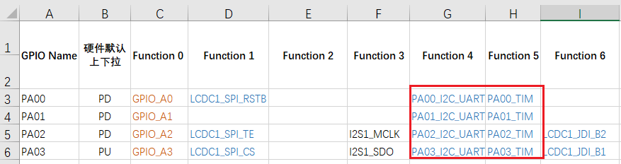<br>  
This is because the I2CX_PINR, USART1_PINR, and GPTIMX_PINR registers have been introduced in HPSYS_CFG and LPSYS_CFG, as shown in the following figure:
<br>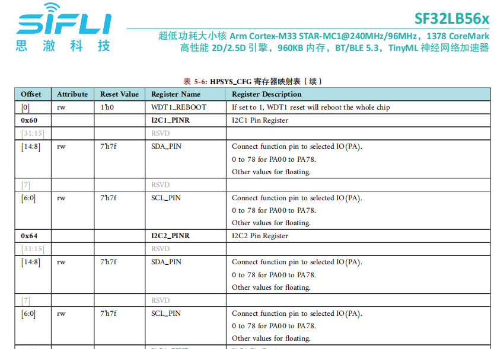<br> 
As described in the above register, I2C1 and I2C2 can be configured to output on PA00-PA78. The specific PA ports that can be configured for I2C, UART, and TIMER outputs depend on which I2C, UART, and TIMER channels the HCPU has. Note that you cannot configure channels that only the LCPU has (e.g., I2C5, UART5) to the PA port, and similarly, you cannot configure channels that only the HCPU has (e.g., I2C1, UART1) to the PB port of the LCPU. For detailed information on which resources the HCPU has, refer to the chip user manual, the `HPSYS_CFG_TypeDef` in `hpsys_cfg.h`, and the `LPSYS_CFG_TypeDef` in `lpsys_cfg.h`. Additionally, the `bf0_pin_const.h` file lists all the functions that the MCU can configure, as shown in the following figure:
<br>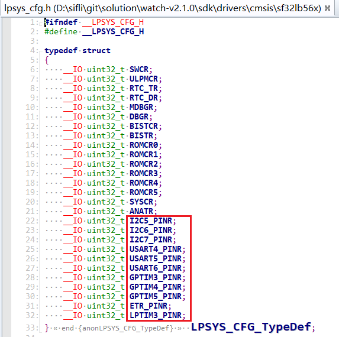<br>  
For example, correct configuration (example for the 56 series MCU):
```c
HAL_PIN_Set(PAD_PA32, USART1_RXD, PIN_PULLUP, 1);
HAL_PIN_Set(PAD_PA32, I2C1_SCL, PIN_PULLUP, 1);
HAL_PIN_Set(PAD_PA42, GPTIM2_CH4, PIN_NOPULL, 1);// GPTIM2_CH1-GPTIM2_CH4 are all valid, GPTIM2_CH5 is not, refer to the corresponding register in the chip manual: hwp_hpsys_cfg->GPTIM2_PINR
```
Incorrect configuration:
```c
HAL_PIN_Set(PAD_PA42, USART4_TXD, PIN_NOPULL, 1);// Incorrect, UART4 is on the Lcpu, cannot be configured to the Hcpu's PA port
HAL_PIN_Set(PAD_PB37, GPTIM2_CH4, PIN_NOPULL, 0);// Incorrect, GPTIM2 is on the Hcpu, cannot be configured to the Lcpu's PB port
```