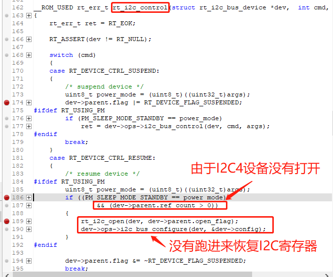
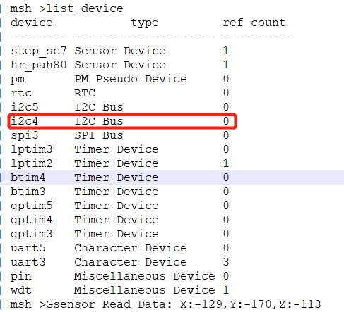
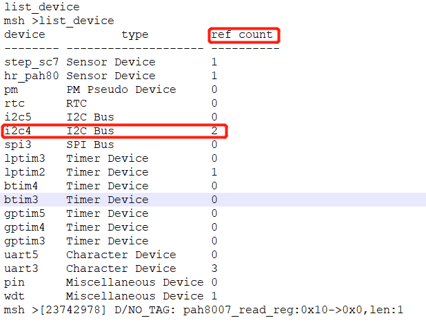
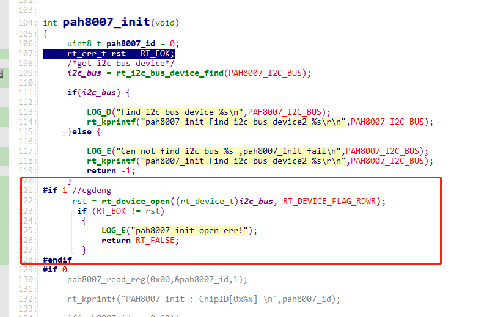
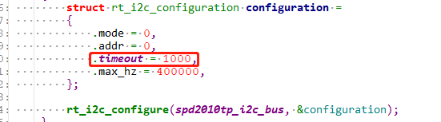
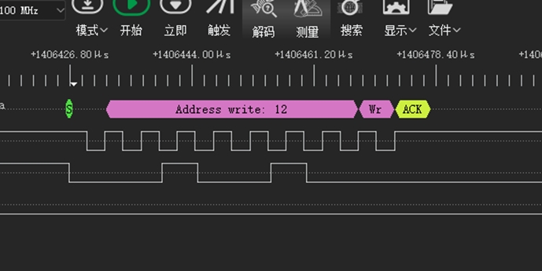
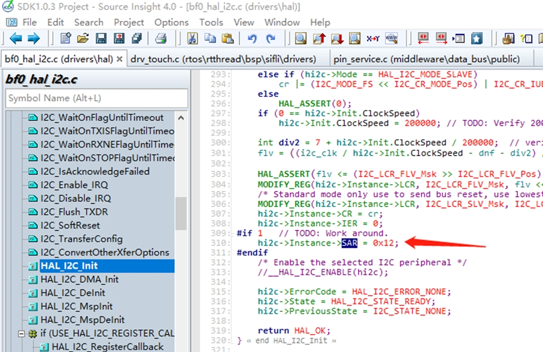
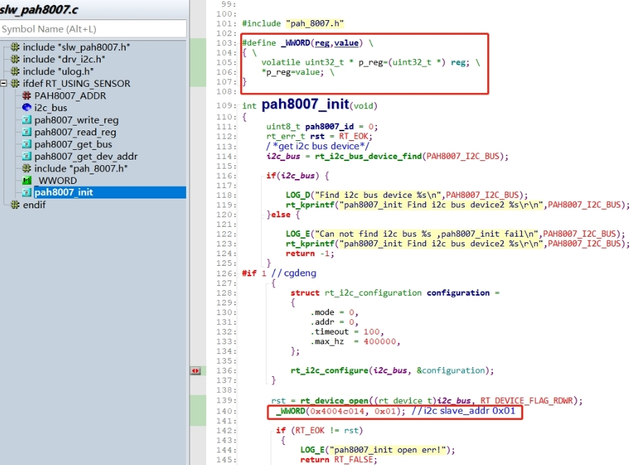
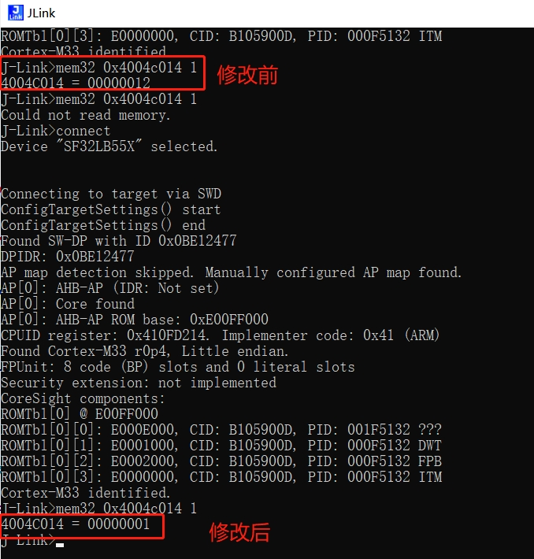

# 7 I2C Related
## 7.1 Correct I2C Initialization Method
To use I2C, it is essential to strictly follow the following three steps for initialization and usage; otherwise, there may be issues with I2C recovery after sleep and wake-up:
```
rt_i2c_bus_device_find /* Step 1: Find I2C device */
rt_device_open /* Step 2: Open I2C device */
rt_i2c_configure /* Step 3: Configure I2C device */
```
```c
static struct rt_i2c_bus_device *i2c_bus = RT_NULL;     /* I2C bus device handle */
int sc7a20_i2c_init()
{
/* Step 1: Find I2C device */
   i2c_bus = rt_i2c_bus_device_find("i2c4");
    if (i2c_bus)
    {
        LOG_D("Find i2c bus device I2C4\n");
/* Step 2: Open I2C device */
rt_device_open((rt_device_t)i2c_bus, RT_DEVICE_FLAG_RDWR);
/* Or use the rt_i2c_open function, but the I2C will not show the open status when listing devices */
	   	//rt_i2c_open(i2c_bus, RT_DEVICE_FLAG_RDWR);
 
		struct rt_i2c_configuration configuration =
        {
            .mode = 0,
            .addr = 0,
            .timeout = 500, // Timeout (ms)
            .max_hz  = 400000, // I2C speed (Hz)
        };
/* Step 3: Configure I2C device */
        rt_i2c_configure(i2c_bus, &configuration);
    }
    else
    {
        LOG_E("Can not found i2c bus I2C4, init fail\n");
        return -1;
    }
    return 0;
   }
```   
## 7.2 I2C Communication Error After I2C4 Enters Sleep Standby and Wakes Up
Root Cause: When operating the I2C device, only `rt_i2c_bus_device_find` was used to find the I2C4 device, and `rt_device_open` was not used to open the device. In our software architecture, after waking up from standby, the system checks if the I2C device is in an open state to determine whether to restore the I2C configuration. Since I2C4 was not opened, the I2C4 configuration was not restored after waking up from standby, making I2C4 unusable.
As shown in the following figures:
<br><br>  
<br><br>   
Solution:
Adding the following operation to open I2C4 resolves the issue.
<br><br>    
<br><br>  

## 7.3 Probabilistic I2C Errors
1. The timeout time set in `rt_i2c_configure` is too short. Due to thread switching, the I2C thread may not get executed, leading to timeouts. A timeout of 150ms is recommended. Setting it too long can cause the system to hang in the I2C thread when an I2C error occurs, as shown in the following figure where 1000 represents 1 second:
<br><br>   
2. The I2C speed and pull-up resistor are mismatched, causing the I2C waveform rise and fall times to be too slow. For 400Kbps, a pull-up resistor of 1.5K-2.2K is recommended.<br>
3. When debugging I2C devices such as touch chips with flying wires, a long bus can cause interference and glitches in the I2C waveform, leading to waveform recognition errors.<br>
4. In some cases, when an I2C device encounters an error, the SDA line may be pulled low by the I2C peripheral and held low. When SDA is low, the I2C controller detects the bus as busy, and SDA cannot generate a waveform. The log will print an error. In such cases, the peripheral can be reset using the following methods:<br>
A. Power cycle the peripheral or reset the reset pin.<br>
B. Send an I2C bus reset (9 idle clocks) to reset the I2C peripheral bus. (In the SDK, the I2C controller and 9 idle clocks are reset at the HAL layer when an I2C error occurs).<br>

## 7.4 I2C Waveform Cannot Be Generated When I2C Device Address is 0x12
After SDA is pulled low, the I2C controller can no longer generate a waveform, as shown in the following figure:
<br><br>   
Root Cause:
The SF32LB55x chip supports I2C slave mode, and the address for this slave mode is configured in the driver as 0x12, causing the chip to enter I2C slave mode when it detects 0x12.
Driver configuration:
<br><br>   
Solution 1:
The Lcpu code is in ROM, and direct modification will not take effect. Remove the ROM function `HAL_I2C_Init` from `rom.sym` and modify the address here.
Solution 2:
After initializing the I2C4 device, directly reconfigure the register:
<br><br> 
```c
#define _WWORD(reg,value) \
{ \
    volatile uint32_t * p_reg=(uint32_t *) reg; \
    *p_reg=value; \
}
_WWORD(0x4004c014, 0x01);   // I2C slave_addr 0x01
``` 
<br><br>