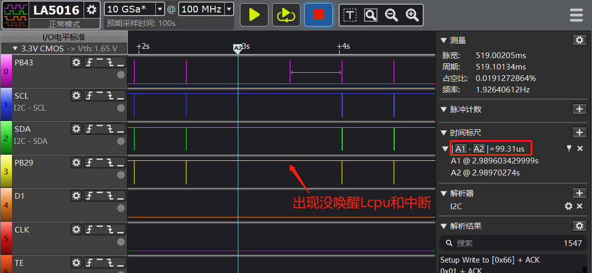

# 3 Interrupt Related
## 3.1 Pulse Width Requirements for Interrupt Wake-up from Standby Sleep
As shown in the figure below, there is a probability that the Lcpu cannot be awakened and the interrupt will not be generated.<br>
Root cause:<br>
When the heart rate interrupt pulse width on PB43 is only 99us, the customer uses an RC10K oscillator in standby mode, with a frequency range of 8k-10k, corresponding to a maximum clock cycle of 125us. Therefore, there is a possibility that the 99us pulse cannot wake up the Lcpu in standby mode.
Solution:<br>
Modify the peripheral registers or firmware to ensure that the interrupt pulse width is greater than the clock cycle. Under the RC10K oscillator, the pulse width should be at least greater than 125us.
<br><br>  

## 3.2 Global Interrupt Control Functions
```c
uint32_t mask;
mask = rt_hw_interrupt_disable(); /* Disable interrupts */
rt_hw_interrupt_enable(mask);  /* Enable interrupts */
```