# 8 Low Power Related
## 8.1 Debug Methods for Hcpu Not Entering Standby Sleep
For the CPU to enter sleep mode, the following conditions must be met. If it fails to enter sleep, you can troubleshoot using the methods below:

a. Confirm that the following macros have been generated in `rtconfig.h`:
```c
#define RT_USING_PM 1
#define BSP_USING_PM 1 // Enable low power mode
#define PM_STANDBY_ENABLE 1 // Enter standby mode low power,
//#define PM_DEEP_ENABLE 1  // For 52 series, it is recommended to disable the above standby and use deep sleep instead
#define BSP_PM_DEBUG 1 // Enable low power mode debug log
```
Enable method: Select the following in `menuconfig`:
<br>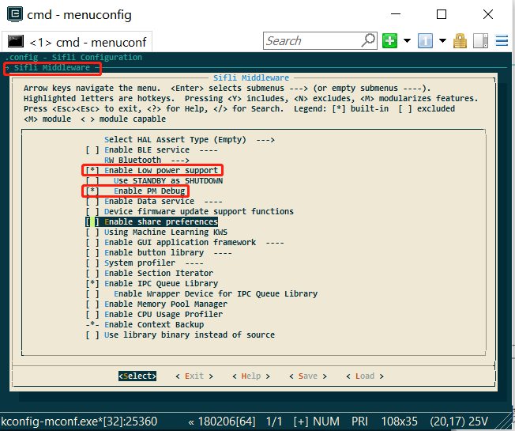<br>  
<br>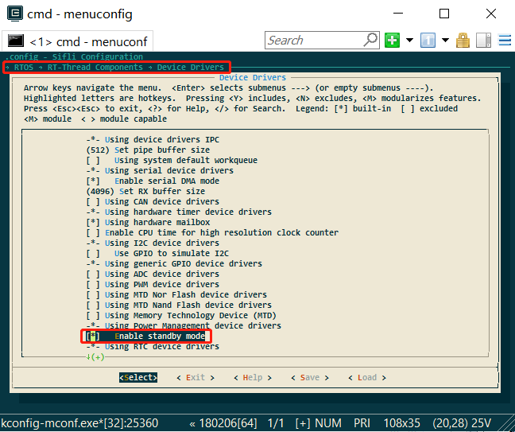<br>   

b. Sleep mode is not disabled:
If the function `rt_pm_request(PM_SLEEP_MODE_IDLE);` is called in the program, sleep will be disabled. You can check this by entering the command `pm_dump` via the serial port. If the value is 1 or greater than 1, sleep is disabled; if it is 0, sleep is allowed.
<br>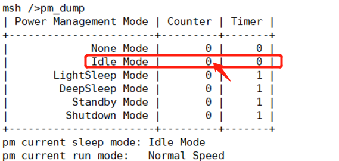<br> 

**Note:**
`rt_pm_request(PM_SLEEP_MODE_IDLE);` and `rt_pm_release(PM_SLEEP_MODE_IDLE);` must be used in pairs.

c. The operating system's timer timeout is greater than the sleep threshold:
See the configuration of `const pm_policy_t pm_policy[]` as shown below. If `hcpu` is set to 100, i.e., 100ms,
if there is a timer in the program that needs to wake up in less than 100ms, it will not enter sleep.
<br>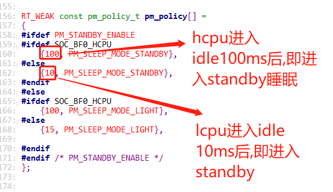<br> 
For example, in the following task, `rt_thread_mdelay(90);` is used, where 90 < 100, so it will not sleep. You can also use the serial port command `list_timer` to check the timer status.
<br><br> 

d. Wakeup sources exist:
If there are wakeup sources that have not been cleared, it will not enter sleep because it will be woken up anyway.
Common issues include incorrect levels on wakeup pins, such as setting a low level wakeup, but the wakeup pin level is always low.
You can use serial port commands, Jlink, or log voltage to read the WSR registers of `hcpu` and `lcpu`. The addresses and bit definitions of the WSR registers vary by series, so refer to the corresponding chip manual and match the specific wakeup sources in the WSR.
```c
regop unlock 0000
regop read 4007001c 1
regop read 4003001c 1
```
<br>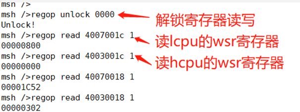<br> 

e. Data sent to another core has not been read:
Here, you can use Ozone to connect or use trace32 to dump memory and check the `ipc_ctx` variable's transmit buffer to see if there is any data that has not been read.
As shown in the following figure, `read_idx_mirror` and `write_idx_mirror` should normally be equal or empty. If they are not equal, it means there is data that has not been read, which will prevent entering sleep. The following is an example where non-empty data has not been read, preventing sleep:
<br>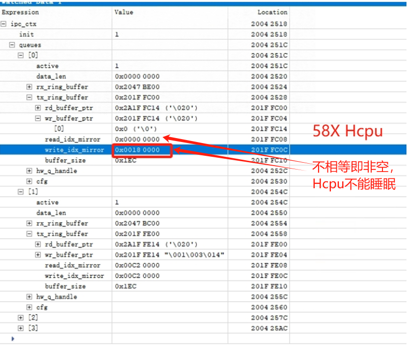<br> 
The following is a normal situation:
<br><br> 
The following is an example where `Hcpu` does not enter sleep because `Lcpu` has not started the data service, and the `qid=1` channel is missing. Data sent from `Hcpu` has not been read by `Lcpu`, preventing `Hcpu` from entering sleep.
<br><br> 

f. The CPU has not entered the idle process:
You can use the serial port command `list_thread` to check the status of all threads. Only `tshell` and `tidle` should be in the ready state; all others should be in the suspend state. Otherwise, it will prevent entering sleep.
As shown in the following figure, I added a `__asm("B .");` infinite loop instruction in the `app_watch_entry()` function, causing the `app_watch` thread to not enter the suspend state, preventing sleep.
<br><br> 
The following are some command screenshots for checking:
<br>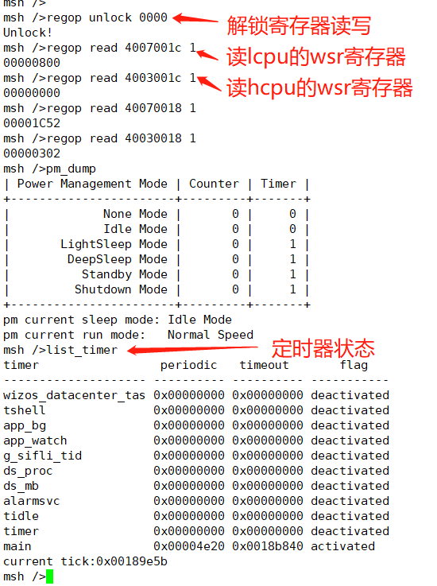<br> 

Explanation of `list_timer` status:
- The first column "timer" is the timer name.
- The second column "periodic" is the timer period (in hexadecimal).
- The third column "timeout" is the timestamp for the next timer event.
- The fourth column "flag" indicates whether the timer is active.
As shown in the above figure, the only active timer is the "main" timer (the delay function is also a timer), with a wakeup period of 0x4e20 (20000ms).

## 8.2 Hcpu is Sleeping but Lcpu is Not
The reasons for `Lcpu` not entering sleep are basically the same as those in section ## 8.1. Refer to ## 8.1. Here, we only discuss a few details for debugging `Lcpu` without using serial port commands:

a. Since Jlink cannot connect at this time, you can execute `SDK\tools\segger\jlink_lcpu_a0.bat` to switch Jlink to connect to `Lcpu` before `Hcpu` enters sleep, and then proceed with debugging.
b. Check for any wakeup sources: After connecting Jlink to `Lcpu`, read the WSR register using `mem32 0x4007001c 1`.
c. Data sent to `Hcpu` has not been read:
You can find the `ipc_ctx` variable in the compiled map file and read it using `jlink mem32`, or use Ozone.exe to connect and read the variable to check if the data has not been read by `Hcpu`.

Common Cause 1:<br>
Jlink reads the WSR register value through `mem32 0x4007001c 1` as: 0x200, indicating that there is a wakeup source on PB47 that has not been cleared, as shown in the following figure for 55X devices:<br>
<br>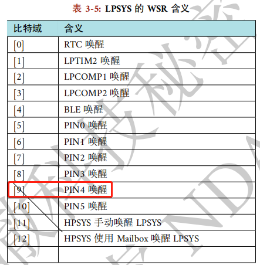<br> 
This is because the wakeup edge is configured as a double-edge trigger, as follows:<br>
```c
pm_enable_pin_wakeup(4, AON_PIN_MODE_DOUBLE_EDGE);  /* PB47 */
```
However, the GPIO interrupt is configured as a falling-edge trigger:<br>
```c
rt_pin_attach_irq(BATT_USB_POW_PIN, PIN_IRQ_MODE_FALLING, battery_device_calback, RT_NULL);
```
The clearing of the wakeup source is done within the GPIO interrupt callback function, which can lead to the rising-edge wakeup source not being cleared, causing the Lcpu to not enter sleep mode.<br>

## 8.3 Shutdown Charging Wakeup Issue
Reference Example: `SDK\example\rt_device\pm\project`
Note that wakeup can be divided into two scenarios: standby/deep sleep wakeup and hibernate shutdown wakeup.
IOs that support hibernate shutdown wakeup usually also support sleep wakeup; refer to the chip manual to see which IOs support shutdown wakeup;
<br>
Standby wakeup is configured by the AON register, as follows:<br>
```
HAL_HPAON_EnableWakeupSrc(HPAON_WAKEUP_SRC_PIN3, AON_PIN_MODE_LOW); //55x PA80 #WKUP_A3
HAL_LPAON_EnableWakeupSrc(LPAON_WAKEUP_SRC_PIN5, AON_PIN_MODE_NEG_EDGE);//55x PB48 #WKUP_PIN5
```
Shutdown wakeup is configured by the PMU and RTC registers, as follows:<br>
```
HAL_PMU_EnablePinWakeup(5, AON_PIN_MODE_NEG_EDGE); //55x PB48 #WKUP_PIN5
```
For charging wakeup, both shutdown and standby modes typically require charging wakeup, so both AON and PMU wakeup configurations are needed. Refer to the following configuration method:<br>
1. Configure the charging detection pin as a wakeup source, and ensure it can wake up in both hibernate and standby modes, as follows:<br>
```c
// This function includes both AON and PMU wakeup configurations; pay attention to the specific implementation within the function
pm_enable_pin_wakeup(4, AON_PIN_MODE_NEG_EDGE); //4-> corresponds to PB47, which can be found through the GPIO mapping table
```
As shown in the following figure:<br>
<br>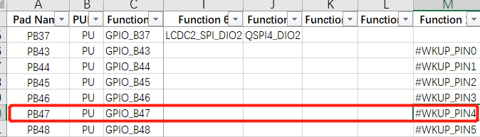<br> 
2. Set the interrupt for the wakeup pin:<br>
```c
#define PIN_CHG_DET (47 + 96) /* PB47 */
    rt_pin_mode(PIN_CHG_DET, PIN_MODE_INPUT); /* Set to input mode */
    rt_pin_attach_irq(PIN_CHG_DET, PIN_IRQ_MODE_FALLING, (void *) battery_charger_input_handle, (void *)(rt_uint32_t) PIN_CHG_DET); /* Configure PB47 as a falling-edge interrupt */
    rt_pin_irq_enable(PIN_CHG_DET, 1); /* Enable the interrupt */
```
3. Register the interrupt function for the pin; after waking up, the following interrupt function will be entered:<br>
```c
void battery_charger_input_handle(void)
{
    rt_sem_release(&charger_int_sem);
}
```
The following is an explanation of the charging detection initialization code:<br>
```c
#define PIN_CHG_DET (47 + 96) /* PB47, add 96 */
int battery_charger_pin_init(void)
{
#ifdef BSP_USING_PM
#ifdef BSP_USING_CHARGER
    GPIO_TypeDef *gpio = GET_GPIO_INSTANCE(PIN_CHG_DET);
    uint16_t gpio_pin = GET_GPIOx_PIN(PIN_CHG_DET);
    int8_t wakeup_pin = HAL_LPAON_QueryWakeupPin(gpio, gpio_pin); /* Query which wakeup source PB47 is */
    RT_ASSERT(wakeup_pin >= 0); /* Assert if not a wakeup pin */
    //rt_kprintf("HAL_LPAON_QueryWakeupPin :%d\n", wakeup_pin);
    pm_enable_pin_wakeup(wakeup_pin, AON_PIN_MODE_NEG_EDGE); /* Configure the wakeup source, wakeup_pin values 0-5 correspond to #WKUP_PIN0 - 5 in the table above */
#endif
#endif /* BSP_USING_PM */
    _batt_filter_init(&batt_inf);
    rt_pin_mode(PIN_CHG_EN, PIN_MODE_INPUT);
    rt_pin_mode(PIN_CHG_DET, PIN_MODE_INPUT); /* Set PB47 to input mode */
    rt_pin_attach_irq(PIN_CHG_DET, PIN_IRQ_MODE_FALLING, (void *) battery_charger_input_handle, (void *)(rt_uint32_t) PIN_CHG_DET); /* Configure PB47 as a falling-edge interrupt */
    rt_pin_irq_enable(PIN_CHG_DET, 1); /* Enable the interrupt */
    return 0;
}
```
<br>**Note:**<br>
a. If the wakeup source is configured as `AON_PIN_MODE_NEG_EDGE` or `AON_PIN_MODE_POS_EDGE` edge-triggered mode,<br>
then the `AON_PIN_MODE_NEG_EDGE` and `PIN_IRQ_MODE_FALLING` wakeup trigger methods must be consistent with the pin interrupt trigger method (both must be falling-edge triggered or both must be rising-edge triggered),<br>
because the clearing of the WSR is performed in the pin interrupt function `HAL_GPIO_EXTI_IRQHandler`. Otherwise, the WSR register will not be cleared after a single wakeup, preventing the system from entering sleep mode.<br>
b. If the wakeup source is configured as `AON_PIN_MODE_HIGH` or `AON_PIN_MODE_LOW` level-triggered mode, the WSR flag does not need to be cleared by software; it will be automatically cleared when the level changes.<br>

## 8.4 Machine Reboots After Entering Hibernate
Common Cause 1:<br>
The wake-up pin configured before entering hibernate has an abnormal level. For example, PB44 is configured as a low-level wake-up key pin, but PB44 does not have a pull-up power supply, causing the pin to remain at a low level. Once the system enters hibernate, it will power on.<br>
Common Cause 2:<br>
For example, the Lcpu sensor interrupt wake-up uses the `pm_enable_pin_wakeup` function to configure interrupt wake-up. This function also configures wake-up from hibernate by default.<br>
However, the sensor's interrupt level changes during shutdown, causing the system to wake up again.<br>
<br>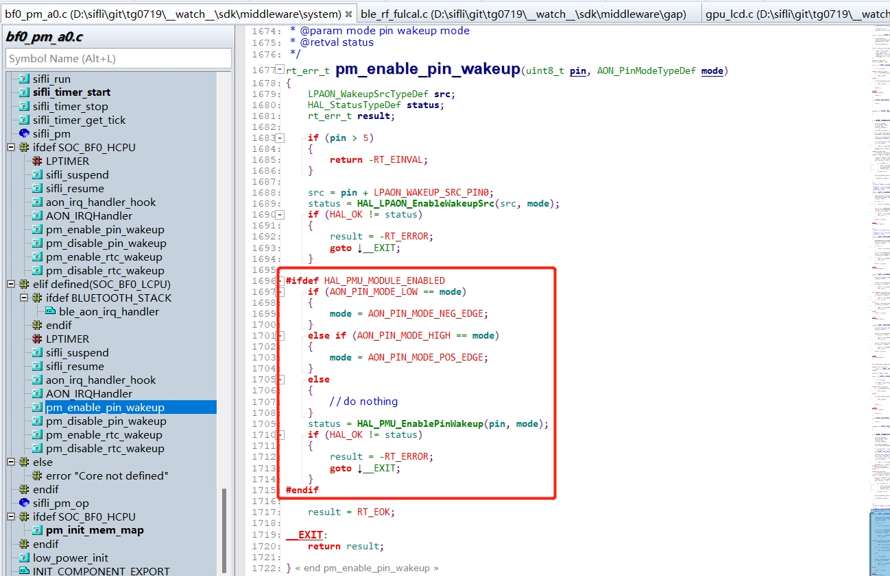<br> 
Solution:<br>
Replace the `pm_enable_pin_wakeup` wake-up function call with `HAL_LPAON_EnableWakeupSrc(src, mode);` to configure only the interrupt wake-up, not the shutdown wake-up. This resolves the issue.<br>
Common Cause 3:<br>
For example, wake-up from charging or a button press sets the WSR flag in the PMU, but the user program does not clear this WSR flag, causing the system to wake up again after sleeping.<br>
Solution:<br>
Before entering shutdown, in the `pm_shutdown` function, call `HAL_PMU_CLEAR_WSR(hwp_pmuc->WSR);` to clear the WSR flag before entering sleep.<br>
```c
void pm_shutdown(void)
{
#ifdef BSP_PM_STANDBY_SHUTDOWN
    rt_err_t err;
    s_sys_poweron_mng.is_poweron = false;
    gui_pm_fsm(GUI_PM_ACTION_SLEEP);
#else
   HAL_PMU_CLEAR_WSR(hwp_pmuc->WSR); // Clear PMU_WSR
    rt_hw_interrupt_disable();
    HAL_PMU_EnterHibernate();
    while (1) {};
#endif
}
```
Common Cause 4:<br>
Not following the standard procedure, i.e., after `HAL_PMU_EnterHibernate();` is executed, the machine does not immediately enter Hibernate mode and continues to run.<br>
It must be done as shown in the following figure: first disable interrupts, then execute `HAL_PMU_EnterHibernate();` and add `while(1);` to create a dead loop. This prevents the execution of subsequent code, which can cause issues such as a system crash or reboot. As shown in the following figure:
<br>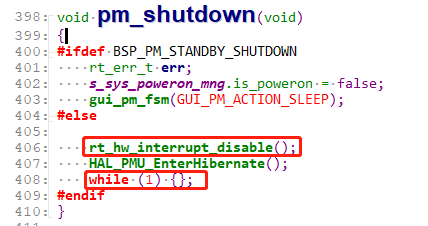<br> 

## 8.5 Hibernate Wake-Up Boot Process
After entering hibernate sleep mode, the RTC, WDT, and Lcpu wake-up pins can wake up the entire system, but the Hcpu wake-up pin cannot wake up from hibernate sleep.<br>
After waking up, the boot process is similar to a cold start, and the program starts running from the Hcpu.<br>
To configure the wake-up source, the Hcpu cannot wake up from hibernate sleep, and the Lcpu uses the `HAL_LPAON_EnableWakeupSrc` function to configure the wake-up source.<br>
The corresponding wake-up sources can be found in the SF32LB55X_Pin config_xxx.xlsx document, as shown in the following figure:<br>
<br>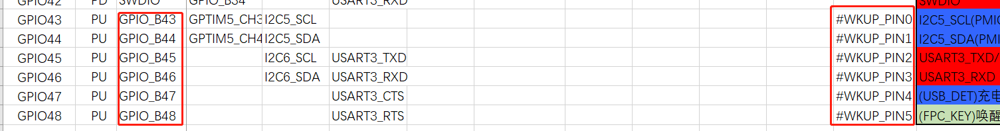<br> 
The cold start method can be determined in the `rt_application_init_power_on_mode` function, as shown in the following figure:
<br>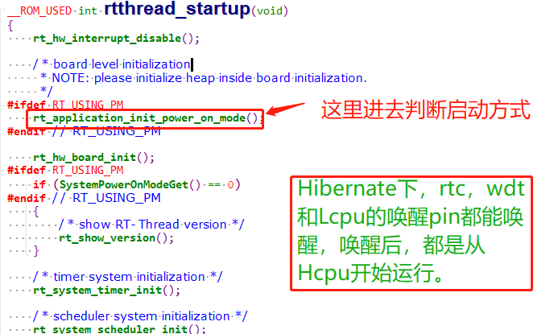<br> 
The boot method is stored in the variable `g_pwron_mode`, and the wake-up source is saved in `g_wakeup_src`.<br>
<br>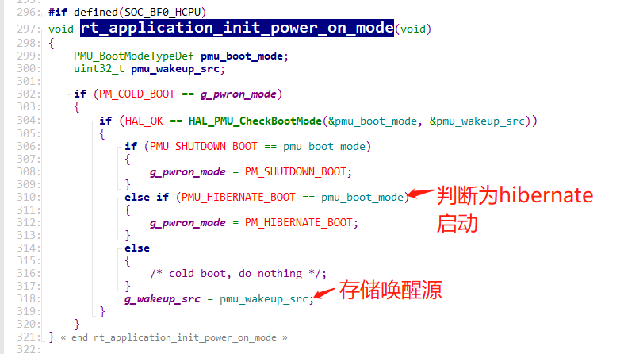<br> 
The `sys_pwron_fsm_handle_evt_init` function handles the wake-up events.<br>
<br>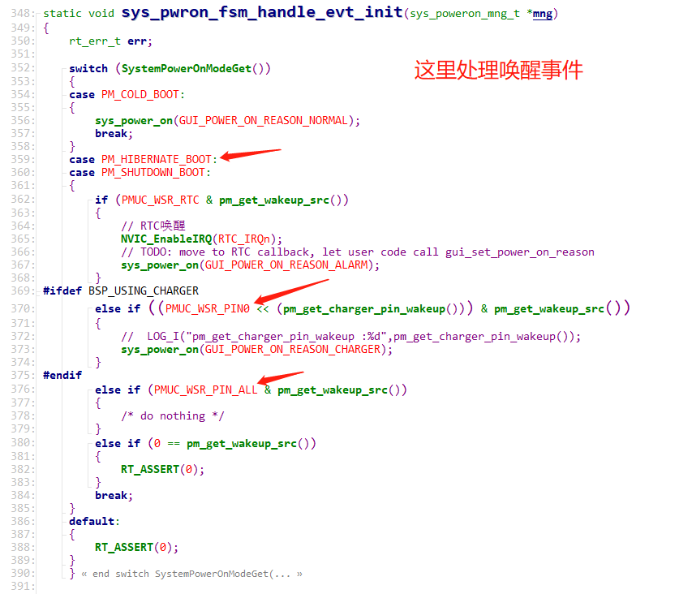<br>
You can manually read the PMU's WSR register to check the status, using the following command (the WSR register address may differ for different series, please refer to the corresponding chip manual):<br>
```c
regop unlock 0000
regop read 4007a008 1
```
In the code, it corresponds to: `*wakeup_src = hwp_pmuc->WSR;`<br>
<br>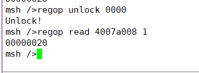<br> 
The bits of the register correspond to:<br>
<br>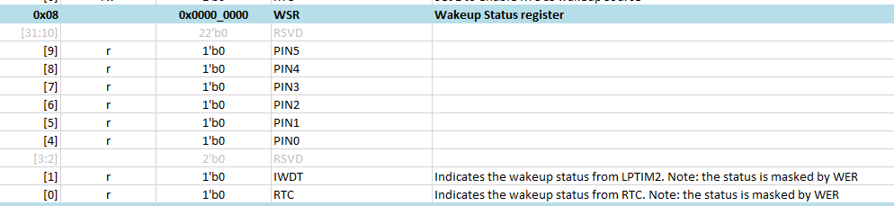<br>

## 8.6 Serial Command Control to Enter Sleep
1. In the `main` function, add the call `rt_pm_request(PM_SLEEP_MODE_IDLE);` to disable sleep by default.<br>
<br>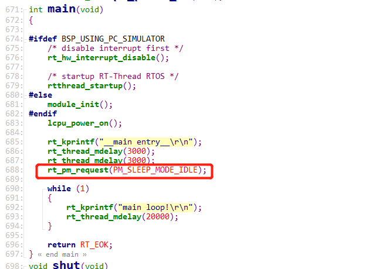<br> 
2. Add the control command `sleep`<br>
```c
int sleep(int argc, char **argv)
{
    char i;
    if (argc > 1)
    {
        if (strcmp("standby", argv[1]) == 0)
        {
            rt_kprintf("sleep on\r\n");
            rt_pm_release(PM_SLEEP_MODE_IDLE);
        }
        else if (strcmp("off", argv[1]) == 0)
        {
            rt_kprintf("sleep off\r\n");   
            rt_pm_request(PM_SLEEP_MODE_IDLE);
        }
        else if (strcmp("down", argv[1]) == 0)
        {
            rt_kprintf("entry_hibernate\r\n");
            rt_hw_interrupt_disable();
            HAL_PMU_EnterHibernate(); 
            while (1) {};
        }		
        else
        {
            rt_kprintf("sleep err\r\n");
        }
    }
    return 0;
}
MSH_CMD_EXPORT(sleep, forward sleep command); /* Export to the msh command list */
```
3. In the serial shell, input `sleep standby` to allow sleep, input `sleep off` to disallow entering sleep, and input `sleep down` to enter hibernate shutdown mode.<br>
<a name="87_Standby待机和Standby关机IO内部常见的漏电模型"></a>
## 8.7 Common Leakage Models for Standby and Standby Shutdown IO
### 8.7.1 Standard IO Port Model
<br><br> 
Function description:<br>
|DS | driving strength|
| --- | ------ |
|OE | output enable|
|O| output|
|I| input|
|IE| input enable|
|PE | pull enable|
|PS | pull select|
<br>Combination control can achieve the functions used in daily operations;<br>
Push-pull output (push-pull)<br>
*	OE = 1, O = 0/1
<br>Open-drain output (open-drain)<br>
*	OE = 0/1, O = 0

### 8.7.2 IO Leakage Model One
OE=1, O=1, PE = 1, PS= 0;<br>
OE=1, O=1 indicates high output;<br>
PE=1, PS=0 indicates a pull-down resistor;<br>
Current flow is as follows:<br>
Current value: I = Vo/Rpd; Rpd is the pull-down resistor;<br>
<br>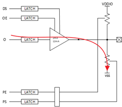<br> 
The corresponding leakage model is as follows<br>
```c
HAL_PIN_Set(PAD_PA31, GPIO_A31, PIN_PULLDOWN, 1);  //PA31 configured as pull-down
BSP_GPIO_Set(31, 1, 1); //PA31 outputs high level
```
The correct configuration should be<br>
```c
HAL_PIN_Set(PAD_PA31, GPIO_A31, PIN_NOPULL, 1);  //PA31 configured as no pull-up or pull-down
BSP_GPIO_Set(31, 1, 1); //PA31 outputs high level
```

### 8.7.3 IO Leakage Model Two
OE=1, O=0, PE = 1, PS= 1;<br>
OE=1, O=0 indicates low output;<br>
PE=1, PS=1 indicates a pull-up resistor;<br>
Current flow is as follows:<br>
Current value: I = VDDIO/Rpu; Rpu is the pull-up resistor;<br>
<br>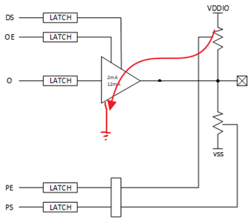<br> 
The corresponding leakage model is as follows<br>
```c
HAL_PIN_Set(PAD_PA31, GPIO_A31, PIN_PULLUP, 1);  //PA31 configured as pull-up
BSP_GPIO_Set(LCD_VCC_EN, 0, 1); //PA31 outputs low level
```
The correct configuration should be
```c
HAL_PIN_Set(PAD_PA31, GPIO_A31, PIN_NOPULL, 1);  //PA31 configured as no pull-up or pull-down
BSP_GPIO_Set(LCD_VCC_EN, 0, 1); //PA31 outputs low level
```

### 8.7.4 IO Leakage Model Three
IE= 1, OE=0, O=0, PE = 0, PS= 0;<br>
If the output voltage is between 0 and VDDIO, it can cause the NMOS and PMOS of the input IO unit to be in a semi-conductive state, leading to leakage. According to this leakage model, the internal leakage of the IO can range from 0uA to 200uA (varies by board)<br>
<br>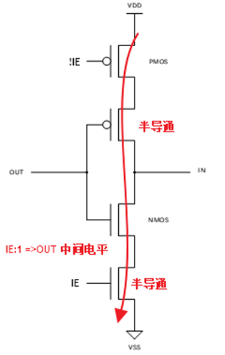<br> 
Current value: I = VDD / (Rnmos + Rpmos) <br>
* The corresponding leakage model is as follows<br>
```c
HAL_PIN_Set(PAD_PA31, GPIO_A31, PIN_NOPULL, 1);  //PA31 configured as no pull-up or pull-down
```
It must meet the following two conditions:<br>
A. No call to `BSP_GPIO_Set` or `rt_pin_write` to output high or low level<br>
B. The external IO is in a floating state, with no corresponding pull-up or pull-down fixed level<br>

* The correct configuration can be any of the following:
* IO port is NC, unused IO, do not initialize, IO will have built-in pull-up or pull-down by default, no configuration needed, the following is the default pull-up or pull-down state of the IO
 <br>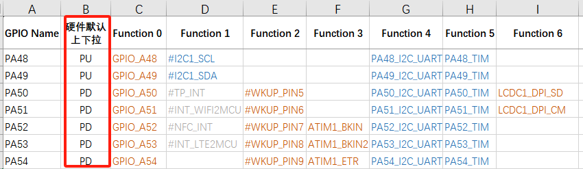<br>

* IO as an output port, output high or low level
```c
HAL_PIN_Set(PAD_PA31, GPIO_A31, PIN_NOPULL, 1);  //PA31 configured as no pull-up or pull-down
BSP_GPIO_Set(LCD_VCC_EN, 0, 1); //PA31 outputs low level
```

* IO as input, with external pull-up or pull-down resistors or peripherals that can provide a stable level
```c
    HAL_PIN_Set(PAD_PB45, USART3_TXD, PIN_NOPULL, 0);           // USART3 TX/SPI3_INT
    HAL_PIN_Set(PAD_PB46, USART3_RXD, PIN_NOPULL, 0);           // USART3 RX
```
Or:
```c
    HAL_PIN_Set(PAD_PB45, USART3_TXD, PIN_PULLUP, 0);           // USART3 TX/SPI3_INT
    HAL_PIN_Set(PAD_PB46, USART3_RXD, PIN_PULLUP, 0);           // USART3 RX
```    
External pull-up exists
<br>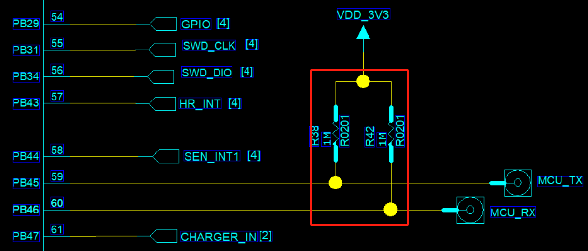<br> 
* IO as input, without external pull-up or pull-down resistors or peripherals that can provide a stable level<br>
Based on the external circuit, configure as internal pull-up or pull-down (applicable to all IOs)<br>
```c
    HAL_PIN_Set(PAD_PB45, USART3_TXD, PIN_PULLUP, 0);        // USART3 TX
    HAL_PIN_Set(PAD_PB46, USART3_RXD, PIN_PULLUP, 0);        // USART3 RX
```    
For non-wakeup IOs, configure as high impedance, the corresponding PAD's IE bit will be disabled<br>
```c
	HAL_PIN_Set_Analog(PAD_PB45, 0);  // Set to high impedance
	HAL_PIN_Set_Analog(PAD_PB46, 0);  // Set to high impedance
```    
For IOs with wakeup functionality, there is another input channel for wakeup. When configured as high impedance, the wakeup input channel has a leakage risk and must have internal or external pull-up, as shown in the figure below. Different chips have different wakeup source IOs, and the corresponding Pin_config documentation should be consulted.<br>
<br>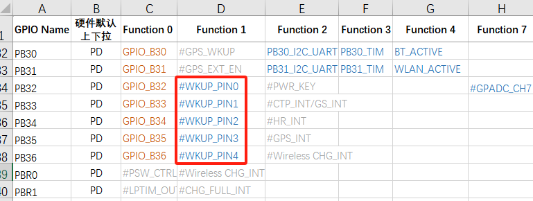<br> 
<a name="88_Common_Internal_Leakage_Model_of_Wakeup_IO_in_Hibernate_Shutdown"></a>
## 8.8 Common Internal Leakage Model of Wakeup IO in Hibernate Shutdown
### 8.8.1 IO Status in Hibernate Shutdown
	Ordinary IOs (without wakeup functionality)<br>
After entering hibernate shutdown, they are all in high impedance state, with no internal leakage, and are high impedance externally.<br>
	IOs with wakeup functionality<br>
These have an additional wakeup input circuit, which is required to wake up the MCU during hibernate. An external or internal pull-up or pull-down level must be present to ensure that the wakeup IO does not leak.<br>
	For 55X hibernate shutdown, the pinmux pull-up and pull-down will lose power, and the wakeup IO does not have internal PMU pull-up or pull-down, so it can only rely on external pull-up or pull-down.<br>
	For 56X and 52X hibernate shutdown, the pinmux pull-up and pull-down will lose power, but the wakeup IO has configurable non-power-down PMU pull-up and pull-down.<br>
### 8.8.2 Leakage Model of 55X Wakeup IO in Hibernate Shutdown
For 55X hibernate shutdown, the pinmux pull-up and pull-down lose power, and the wakeup IO does not have internal PMU pull-up or pull-down, so it can only rely on external pull-up or pull-down.<br>
In the case of external floating, based on this leakage model, the internal leakage of the wakeup IO is approximately 0uA - 200uA (varies between different boards).<br>
<br><br>
 
### 8.8.3 Leakage Model of 52X Wakeup IO in Hibernate Shutdown (Model 1)
For 52X hibernate shutdown, the wakeup IO has configurable non-power-down PMU pull-up and pull-down. Before hibernate shutdown, if configured as PMU without pull-up or pull-down and there is no external pull-up or pull-down, based on this leakage model (see Figure 8.7.2), the internal leakage of the wakeup IO is approximately 0uA - 200uA (varies between different boards).<br>
```c
HAL_PIN_Set(PAD_PA24, GPIO_A24, PIN_NOPULL, 1);// Wakeup IO PA24 configured as no pull-up or pull-down, and no external pull-up or pull-down
```
Correct configuration is as follows:<br>
In the `pm_shutdown` function, the unified configuration for wakeup IOs PA28-PA44 is as follows:<br>
```c
hwp_rtc->PAWK1R = 0x0001ffff;; // Enable pull-up or pull-down for wakeup IOs PA28-PA44, bit0: PA28, bit1: PA29
hwp_rtc->PAWK2R = 0x0000; // Configure all wakeup IOs PA28-PA44 as pull-down, corresponding bits, 0: pull-down, 1: pull-up 
```
The following figure shows that PE corresponds to the pull-up or pull-down enable bit, and PS corresponds to the pull-up or pull-down selection bit.<br>
<br><br> 

PA24~PA27 share the same PAD with PBR0~3, and PA24~PA44 can all be configured for PMU pull-up and pull-down using the `HAL_PIN_Set` function, for example:<br>
```c
HAL_PIN_Set(PAD_PA24, GPIO_A24, PIN_PULLDOWN, 1); // Wakeup IO PA24 configured for both pinmux pull-down and PMU pull-down
HAL_PIN_Set(PAD_PA25, GPIO_A25, PIN_PULLDOWN, 1); 
HAL_PIN_Set(PAD_PA26, GPIO_A26, PIN_PULLDOWN, 1); 
HAL_PIN_Set(PAD_PA27, GPIO_A27, PIN_PULLDOWN, 1); 
```
When `HAL_PIN_Set` operates on wakeup pins PA24~PA44, it configures the IO pinmux for pull-up or pull-down, and the internal PMU pull-up or pull-down is also configured simultaneously.<br>
During hibernate shutdown, the pinmux pull-up and pull-down will lose power, but the PMU pull-up and pull-down will not lose power and will still exist.<br>
<br>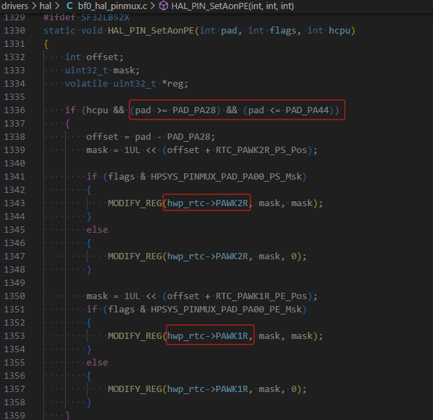<br> 

### 8.8.4 Leakage Model of 52X Wakeup IO in Hibernate Shutdown (Model 2)
For 52X hibernate shutdown, the wakeup IO has configurable non-power-down PMU pull-up and pull-down. Before hibernate shutdown, if configured as PMU pull-up or pull-down opposite to the external level:<br>
```c
HAL_PIN_Set(PAD_PA24, GPIO_A24, PIN_PULLUP, 1);// Wakeup IO PA24 configured as PMU internal pull-up, causing external leakage
```
## 8.9 Low Power Debugging Experience Sharing

**Power Consumption in Hibernate Mode**<br>
55 Series MCU:<br>
The software does not need to perform any processing, as all IOs are already in high-impedance state. Since the wake-up PIN has no internal pull-up or pull-down, external pull-up or pull-down is required to ensure the wake-up PIN does not leak current;<br>
58, 56, 52 Series MCU:<br>
All IOs except the wake-up PIN are already in high-impedance state. The software only needs to ensure that the corresponding correct PIN pull-up or pull-down is configured before entering Hibernate mode;<br>
For the 52 series, the three internal LDOs also need to be turned off;<br>
Hibernate mode typically consumes less than 5uA, and any other power consumption comes from the peripheral hardware circuits;<br>
**Deep/Standby Power Consumption**<br>
First, ensure that Hcpu/Lcpu have both entered low power mode, and the log has printed `pm[s]`, and can be woken up by `pm[w]` to ensure the system does not crash during the sleep-wake process;<br>
You can also determine if the system has entered low power mode by measuring the voltage of the hpsys and lpsys LDOs; the voltage will drop during sleep and recover upon wake-up;<br>
The main focus for power consumption is on three aspects:<br>
```
1. Peripheral leakage, including leakage due to differences in IO voltage levels between the MCU and peripherals<br>
2. Internal IO leakage of the MCU, refer to the IO leakage model in the FAQ,<br>
Common issues include output high with pull-down, internal pull-up with external pull-down, and input pins without pull-up or pull-down,<br>
3. Internal or external storage units (Flash, Psram, EMMC) not entering low power mode,<br>
```
* Regarding the first point: It is best to remove all peripherals to reduce the system to a minimal configuration, and then eliminate peripheral leakage one by one;<br>
* Regarding the second point, see the code below, where ordinary IOs are set to high impedance during sleep, and wake-up pins are configured with pull-up or pull-down based on the external circuit;<br>
**Note:**<br>
1. After configuring the IOs to high impedance, they need to be reconfigured upon wake-up to avoid affecting functionality;<br>
2. Some peripherals, such as NOR flash or QSPI CS, need to be configured as high, and configuring them as high impedance can result in more leakage;<br>
```c
    HAL_PIN_Set_Analog(PAD_PA44, 1);
    HAL_PIN_Set(PAD_PA24, GPIO_A24, PIN_PULLDOWN, 1); // set pulldown or pullup all wakesrc pin
```    
* Regarding the third point, power down (corresponding IO pull-down or high impedance) or sleep operations should be performed on the internal and external flash, psram, and EMMC based on their power supply and IO configuration;<br>
The specific choice of whether to power down or sleep each storage device should be based on whether the data will be lost or retained after waking up from sleep, the time cost of entering and exiting sleep, and the current parameters specified in the memory datasheet to select the optimal solution that meets the functional requirements;<br>
Below are some operation interfaces for entering and exiting sleep mode for psram and flash;<br>
```c
#ifdef BSP_USING_PSRAM1
    rt_psram_enter_low_power("psram1");
#endif
#ifdef BSP_USING_PSRAM1
    rt_psram_exit_low_power("psram1");
#endif
#if defined(BSP_USING_NOR_FLASH1)
        FLASH_HandleTypeDef hflash;
        hflash.Instance = FLASH1;
        HAL_FLASH_RELEASE_DPD(&hflash);
        HAL_Delay_us(8);
#endif /* BSP_USING_NOR_FLASH2 */
```