# 9 PWM
## 9.1 Configuring PB24 as a Motor PWM Pin
1. Find that PB24 corresponds to GPTIM5 and Channel 2<br>
<br>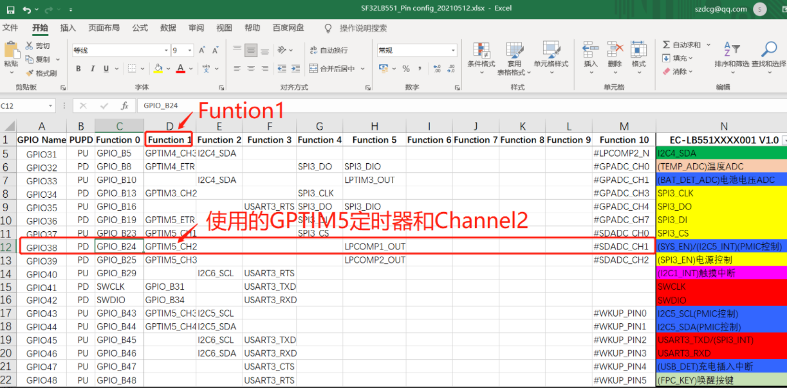<br>  
2. In `pinmux.c`, configure PB24 as the GPTIM5_CH2 function pin<br>
```c
HAL_PIN_Set(PAD_PB24, GPTIM5_CH2, PIN_NOPULL, 0);             // Motor PWM
```
3. Check the configuration in `pwm_config.h` to see that GPTIM5 corresponds to pwm6,<br>
<br>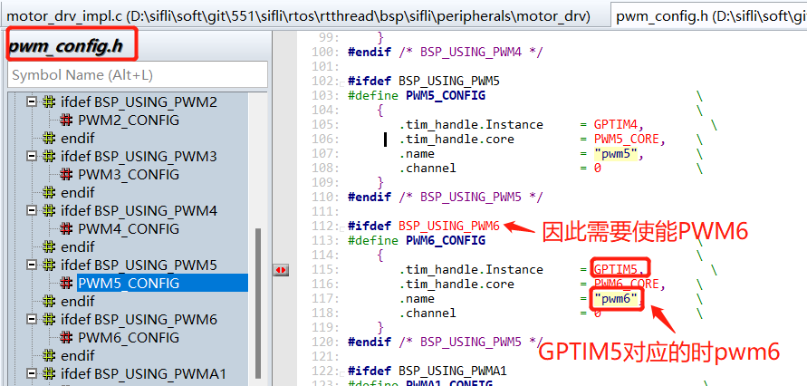<br>  
4. → RTOS → On-chip Peripheral Drivers → Enable pwm and select PWM6, enable the following macro:<br>
```c 
#define BSP_USING_PWM6 1
```
5. Modify the configuration for PB24 corresponding to pwm6 and channel 2<br>
```c
#define PORT_MOTO        (96+24)
#ifndef  MOTOR_DRV_MODE_GPIO
#define PWM_DEV_NAME      "pwm6"  /* PWM device name */
#define PWM_DEV_CHANNEL     2    /* PWM channel */
#endif
```
<br><br>  
6. To enable PWM output configuration, refer to the motor code and modify it to your corresponding PWM output configuration, as shown in the following figure:
<br>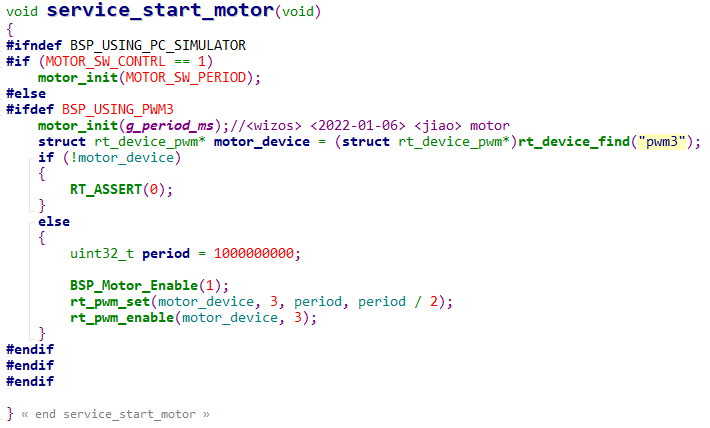<br>

## 9.2 PA47 as LCD Backlight, How to Configure?
1. Find the corresponding GPTIM1 and Channel4 for PA47<br>
<br>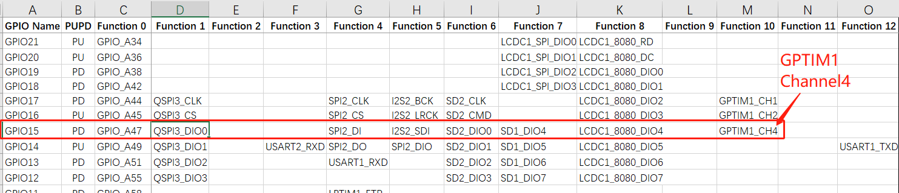<br>  
2. In the `pinmux.c` file, configure it as the GPTIM1_CH4 function, as follows:<br>
```c
#define LCD_BACKLIGHT_USING_PWM
#ifdef LCD_BACKLIGHT_USING_PWM
    HAL_PIN_Set(PAD_PA47, GPTIM1_CH4, PIN_NOPULL, 1);  //backlight pwm  
#else
    HAL_PIN_Set(PAD_PA47, GPIO_A47, PIN_NOPULL, 1);  //GPIO backlight
#endif 
```
3. Check the configuration in `pwm_config.h` to see that GPTIM1 corresponds to pwm2,
<br>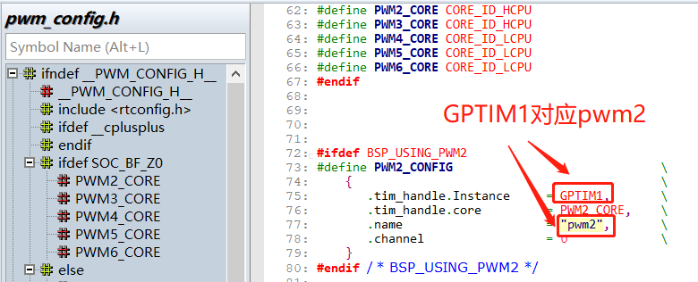<br>  
4. In `menuconfig`<br>
`→ RTOS → On-chip Peripheral Drivers → Enable pwm` Select PWM2 and enable the following macro: <br>
```c
#define BSP_USING_PWM2 1
```
5. In the corresponding screen driver `SPD2010_SetBrightness` function, configure pwm2 and channel 4 for PA47, as follows:<br>
```c
#define LCD_BACKLIGHT_USING_PWM
#ifdef LCD_BACKLIGHT_USING_PWM
#define LCD_BACKLIGHT_PWM_DEV_NAME "pwm2"
#define LCD_BACKLIGHT_PWM_PERIOD (1 * 1000 * 1000)
#define LCD_BACKLIGHT_PWM_CHANNEL 4
#endif
void SPD2010_SetBrightness(LCDC_HandleTypeDef *hlcdc, uint8_t br)
{
    uint8_t bright = (uint8_t)((int)SPD2010_BRIGHTNESS_MAX * br / 100);
    SPD2010_WriteReg(hlcdc, SPD2010_WBRIGHT, &bright, 1);
//	rt_kprintf("SPD2010_SetBrightness val=%d \n",br);
#ifndef LCD_BACKLIGHT_USING_PWM // If not using PWM, directly control GPIO to turn on the backlight
	/* PA70 Backlight ,PA47 1V8_EN*/
		uint8_t bright = (uint8_t)((int)SPD2010_BRIGHTNESS_MAX * br / 100);
		GC9B71_WriteReg(hlcdc, SPD2010_WBRIGHT, &bright, 1);
		rt_pin_mode(LCD_BACKLIGHT_POWER_PIN, PIN_MODE_OUTPUT);
		rt_pin_write(LCD_BACKLIGHT_POWER_PIN, 1);
		LOG_I("SPD2010_SetBrightness,br:%d\n",br);	
	/* PA70 Backlight */
#else
	/* PA47 Backlight PWM,PA70_NC*/
		rt_uint32_t pulse = br * LCD_BACKLIGHT_PWM_PERIOD / 100;
		struct rt_device_pwm *device = RT_NULL;
		device = (struct rt_device_pwm *)rt_device_find(LCD_BACKLIGHT_PWM_DEV_NAME);
		if (!device)
		{
			LOG_I("find pwm:LCD_BACKLIGHT_PWM_DEV_NAME err!",br,pulse);
			return;
		}
		rt_pwm_set(device,LCD_BACKLIGHT_PWM_CHANNEL,LCD_BACKLIGHT_PWM_PERIOD,pulse);
		rt_pwm_enable(device, LCD_BACKLIGHT_PWM_CHANNEL);
		LOG_I("SPD2010_SetBrightness,br:%d,pulse:%d\n",br,pulse);
	/* PA47 Backlight PWM */	
#endif	
}
```
**Note:**<br>
When using PA port to output PWM, if the `#define BSP_PM_FREQ_SCALING 1` macro for Hcpu frequency scaling is enabled,<br>
the Hcpu frequency will decrease when it enters the idle thread, and the PWM frequency on Hcpu's PA31 port will also change.<br>
Solution 1:<br>
Disable the `#define BSP_PM_FREQ_SCALING 1` macro, sacrificing Hcpu screen brightness power consumption.<br>
Fundamental Solution 2:<br>
Use PB port to output PWM.<br>

## 9.3 Method for Outputting PWM in Sleep Mode
Application scenario: Continue outputting PWM in sleep mode, which requires using Lcpu lptim3 to control the PWM<br>
Usage method:<br>
1. Enable Lcpu's lptim3 timer and PWM in menuconfig
<br>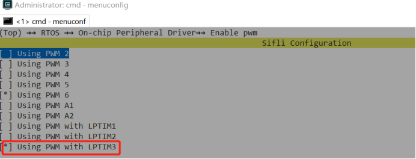<br>
<br>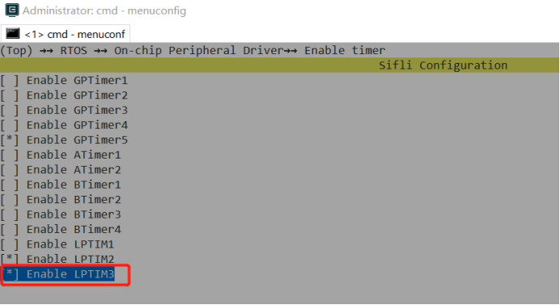<br>    
2. Set the corresponding pin to lptim3_pwm mode, for example, PB44. Commonly used pins are PB43~PB46<br>
```c
HAL_PIN_Set(PAD_PB44, LPTIM3_OUT, PIN_NOPULL, 0);
MODIFY_REG(hwp_lpsys_aon->DBGMUX, LPSYS_AON_DBGMUX_PB44_SEL_Msk, 
           MAKE_REG_VAL(1, LPSYS_AON_DBGMUX_PB44_SEL_Msk, LPSYS_AON_DBGMUX_PB44_SEL_Pos));
```
3. Define the macro `PM_WAKEUP_PIN_AS_OUTPUT_IN_SLEEP` to continue outputting in sleep mode
<br>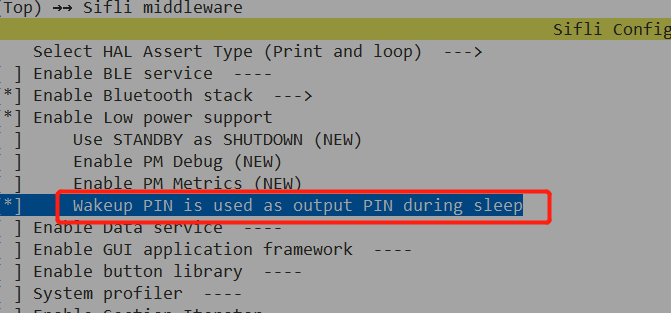<br> 
4. Fix the bug present in SDK 1.1.3 and earlier; subsequent SDKs will be updated<br>
<br>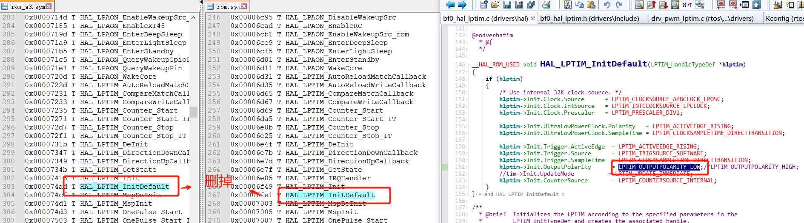<br>  
<br>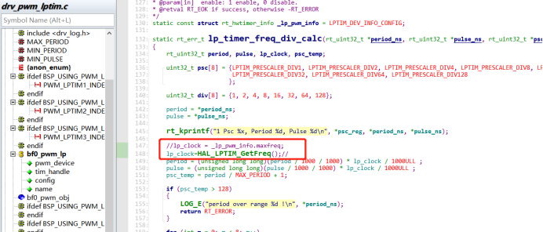<br>
 
5. Example code: Use PB44 as PWM output<br>
<br>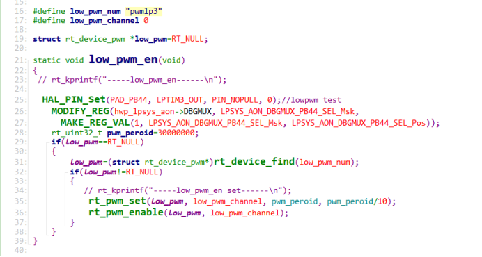<br>      
6. Usage notes:<br>
Since PB44 continues to output a waveform in sleep mode, other wake-up pins on PB must be connected to fixed pull-up or pull-down resistors to prevent leakage.<br>

## 9.4 Differences in PWM for 55X Series, 56X Series, and 52X Systems
1. For the 55X series, the IO pins that can output PWM are fixed; refer to ## 9.2. For the 56X and 52X series, any pin with the PXXX_TIM function can output PWM.
 <br>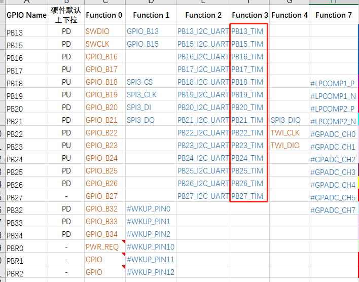<br>
2. For the 56X, 55X, and 52X series, if Hcpu is used to output PWM and the Hcpu frequency scaling function is enabled with `#define BSP_PM_FREQ_SCALING 1`, the Hcpu frequency will decrease when it enters the idle thread, and the PWM frequency on the Hcpu's PA port will also change.<br>
Solution:<br>
For the 55X and 56X series, use the PB port, or sacrifice the screen-on power consumption by disabling the `BSP_PM_FREQ_SCALING` frequency scaling function.<br>
For the 52X series, use GPTIM2 to output PWM, as it is specifically designed to be unaffected by system frequency changes.<br>

3. For the 56X and 52X series, any IO pin that can output PWM can be configured to any TIM and channel.<br>
Refer to `pwm_config.h` for the supported TIM and channel configurations for PWM on the corresponding CPU, for example:<br>
```c
HAL_PIN_Set(PAD_PA31, GPTIM1_CH3, PIN_NOPULL, 1);
HAL_PIN_Set(PAD_PA31, GPTIM1_CH1, PIN_NOPULL, 1); 
```

## 9.5 Precautions for Connecting Different Channels of the Same PWM to Different Devices
1. For the 52X series, different channels of the same PWM can be connected to different devices, such as backlight and motor.<br>
For different channels of the same PWM, the period must be the same, but the duty cycle can be different.<br>
The following figure shows the waveforms of the respective channels when both the backlight and motor are configured to 1kHz:
<br>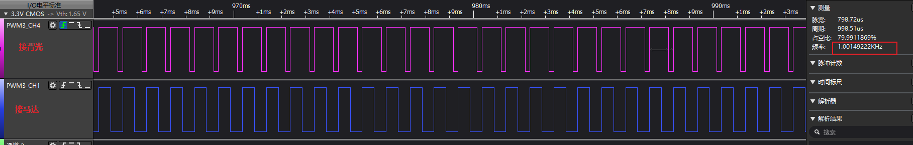<br> 
2. When the backlight and motor must be configured with different periods, the backlight is always in use when the screen is on and cannot be time-shared with the motor. Therefore, the backlight and motor must be configured to different PWMs.<br>
In the HDK52X, only PWM3 is unaffected by automatic frequency scaling, so the backlight typically uses PWM3, and the motor can only use PWM2.<br>
Since the output waveform period of PWM2 changes with automatic frequency scaling, it is best to avoid frequency scaling during motor usage.<br>
Refer to the following implementation:<br>
<br>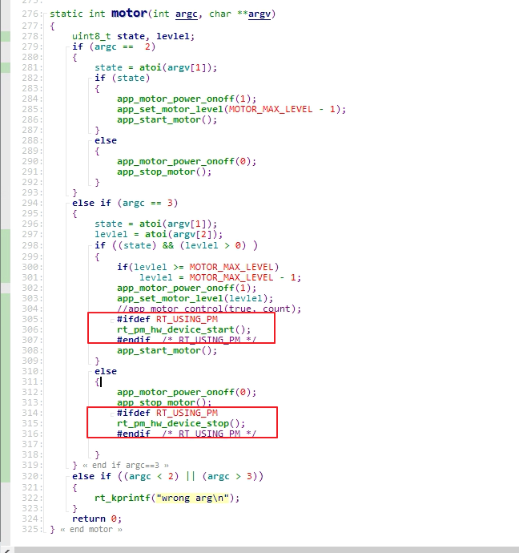<br>