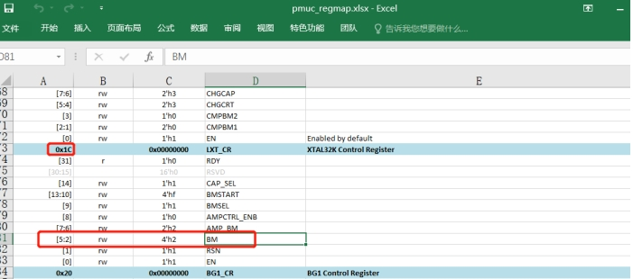
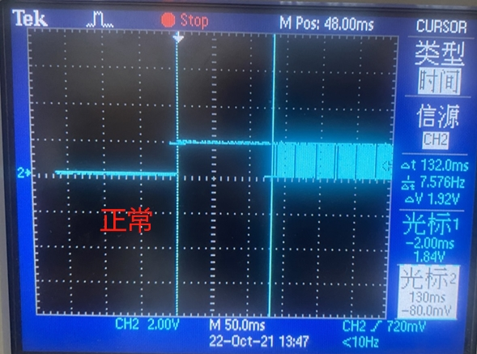
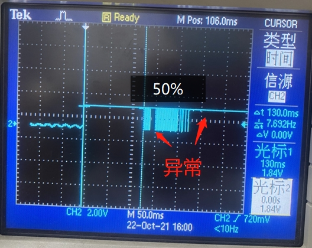
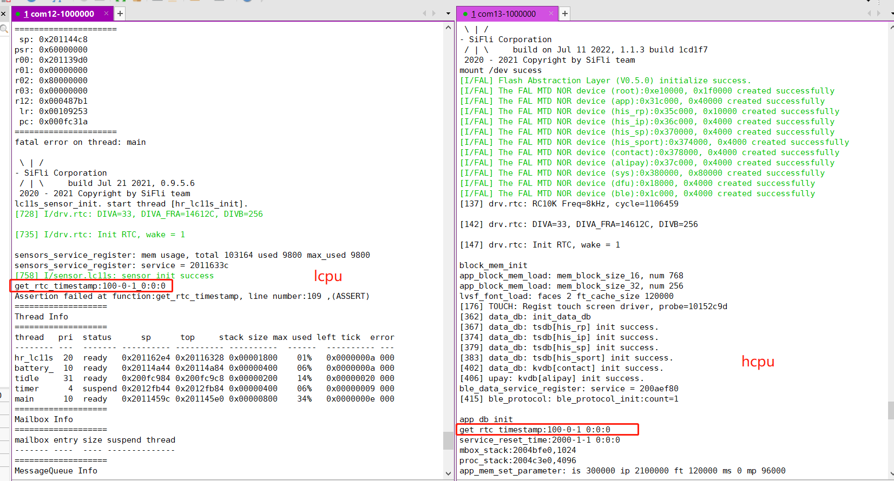
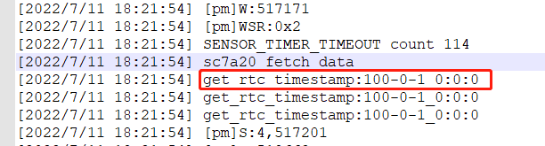
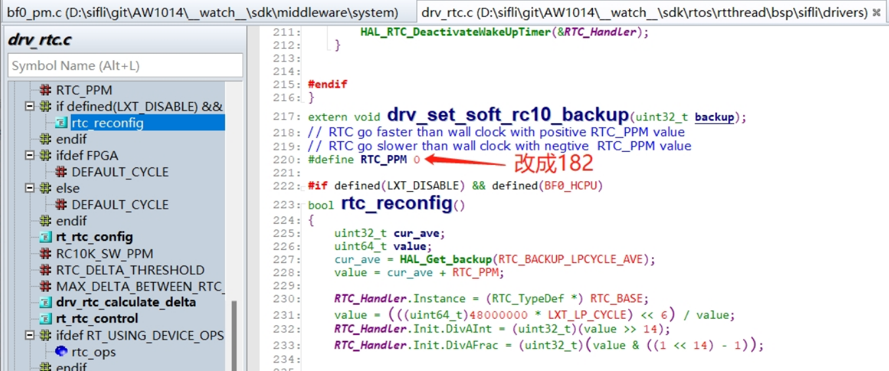

# 5 RTC Related
## 5.1 RTC Clock Fails to Start
Phenomenon: <br>
One customer reported that 4 out of 5 boards had their RTC not running. The boards are 2-layer boards. After replacing the crystal with the one from our EVB, the crystal occasionally started but ran slowly and then stopped.  
Experiments conducted:<br>
1. In the register `0x4007a01c`, the default BM bias current is 2. In the JLink interface, rewriting the BM value to 2 allowed the RTC to start;<br>
2. In the code `HAL_PMU_EnableXTAL32`, the BM bias current was changed from the default 0x2 to 0x03 by increasing the crystal drive current through the PMU register. The RTC started slowly, and changing it to 0x6 allowed it to start after 10 seconds. Changing it to 0x9 allowed it to start after 4 seconds, and changing it to 0xA allowed it to start immediately, but there was a 2-second repetition in the middle;<br>
3. Changing it to 0xB resulted in the RTC running completely normally;<br>
<br><br> 
Since increasing the BM value from 2 to 3 in register `0x4007a01c` increases the current by 80nA, and increasing it directly to 0xB increases the current by 9 times. Since setting it to less than 0xB results in a long startup time for the RTC;<br>
Today, further experiments were conducted to identify the root cause;<br>
a, First, configure PB01 to output the 32768 clock for observation,<br>
After connecting JLink<br>
```
a), Command input: w4 0x40043004 0x2f9 to switch PB01 to function 9,
b), Command input: w4 0x4004F018 0x8 to set bit3 CLK_EN of LSYSCFG to 1,
```
<br><br>  
The command `mem32 0x40043004 1` can be used to read back and confirm if the value has been written.
If the configuration is added in the code, the PB01 mode can be modified to 9 DBG_CLK in `pinmux.c`,<br>
```c
HAL_PIN_Set(PAD_PB01, DBG_CLK, PIN_NOPULL, 0);
_WWORD(0x4004F018, 0x8);   // PB01 output 32768 clk
```
b, The 32768 waveforms of the normal and abnormal boards are as follows:<br>
<br><br>  
<br><br>  

b, Swapping the 32768 crystals between the normal and abnormal boards, the issue followed the main board, indicating it was not related to the crystal;<br>
c, Supplying 1.25V to Vbuck1, the RTC clock ran normally;<br>
d, Therefore, it is suspected that there is an issue with the Vbuck1 power supply. Replacing the DCDC 4.7uH inductor did not improve the situation, but adding a 10uF capacitor in parallel with the 4.7uF capacitor of the Vbuck DCDC resolved the RTC issue;<br>
Root cause: <br>
The DCDC inductor and capacitor on the large board are too far from the CPU, and the 0402 package capacitors feel insufficient in capacity.
Previously, many issues were encountered due to insufficient DCDC inductor Isat current.
Therefore, it is hoped that hardware engineers will pay more attention to the selection and layout of DCDC inductors and filtering capacitors.<br>

## 5.2 Method to Output 32768 Crystal Clock via IO
1. Method to output 32768 clock on 52/56<br>

PA24-PA27 on 52 and PBR0-PBR3 on 56 are low-power IOs that can continuously output a 32768Hz clock during deep/standby sleep. The specific configuration method is as follows:<br>
```c
#if defined(SF32LB52X)
    HAL_PIN_Set(PAD_PA24, PBR_CLK_RTC,  PIN_NOPULL, 1); //output 32768 clk
    HAL_PIN_Set(PAD_PA25, PBR_CLK_RTC,  PIN_NOPULL, 1); //output 32768 clk
    HAL_PIN_Set(PAD_PA26, PBR_CLK_RTC,  PIN_NOPULL, 1); //output 32768 clk
    HAL_PIN_Set(PAD_PA27, PBR_CLK_RTC,  PIN_NOPULL, 1); //output 32768 clk
#elif defined(SF32LB56X)
    HAL_PIN_Set(PAD_PBR1, PBR_CLK_LP,  PIN_NOPULL, 0); //output 32768 clk
    HAL_PIN_Set(PAD_PBR2, PBR_CLK_LP,  PIN_NOPULL, 0); //output 32768 clk
    HAL_PIN_Set(PAD_PBR3, PBR_CLK_LP,  PIN_NOPULL, 0); //output 32768 clk
#endif
```
2. Method to output 32768 clock on PB port of 55 series<br>
For example, to output the 32768 clock via PB01, the specific method is:<br>
After connecting JLink<br>
```
A, Command input: w4 0x40043004 0x2f9 to switch PB01 to function 9,
B, Command input: w4 0x4004F018 0x8 to set bit3 CLK_EN of LSYSCFG to 1,
```
<br><br>  
The command `mem32 0x40043004 1` can be used to read back and confirm if the value has been written.
If the configuration is added in the code, the PB01 mode can be modified to 9 DBG_CLK in `pinmux.c`,<br>
```c
HAL_PIN_Set(PAD_PB01, DBG_CLK, PIN_NOPULL, 0);
_WWORD(0x4004F018, 0x8);	// PB01 output 32768 clk
```
**Note:**<br>
The prerequisite for outputting the 32768Hz clock via IO is that the board must have a 32768 crystal, and the macro `#define LXT_DISABLE 1` must not be enabled.<br>

## 5.3 32768 Crystal Solution Using Internal RC Clock
1. Enable Method:
Hcpu project menuconfig, select `(Top) → Board Config →  Lower crystal disabled`  
In rtconfig.h, after generating the following macros, Hcpu will write the configuration to the registers, and Lcpu will obtain the register status through the function `HAL_LXT_DISABLED`. By default, the bootloader uses the RC10k clock, so no modification is needed;
```
#define LXT_DISABLE 1
#define LXT_LP_CYCLE 200
```
Here, 200 represents the measurement duration, in units of RC10k cycles. It measures how many 48M cycles occur within 200 RC10k cycles to determine the actual frequency of RC10k;  
To solve the issue of inaccurate RTC time after switching to the RC clock, the solution is to start a 15-second period timer named “rc10” or “rtc” on lcpu, and a 5-minute timer on hcpu (52 has only one 15-second period timer on Hcpu). After the timers start, they will calibrate the clock based on the 48M crystal to correct the current RTC time accuracy;  
2. After modifying to the internal RC10K oscillator, the oscillation frequency changes from 32768 to 8000-10000. The RC oscillation will vary with temperature, and each board has differences, so the timestamp calculation method is:  
From 601272/32.768 to 601272/9 (ms)
```
[160579] TOUCH: Power off done.
[pm]S:4,160586
[pm]W:601272
```
As shown above, the duration calculation from sleep to wake:
```
(601272-160586)/9=48965(ms)
```
3. The advantages and disadvantages of using RC10k and external 32768 crystal are as follows:
||rc10k|32768 Crystal|
| ----- | --------------- | ---- |
|Accuracy|Depends on the accuracy of the 48M crystal and the calibration algorithm|High|
|Power Consumption|Approximately 15uA additional wake-up cost every 15 seconds|Low|
|Cost|Low|High|
|IO Output 32K|Cannot output 32768 through IO|Can configure to output 32768 to external devices like WiFi/GPS|

## 5.4 Reason for RTC Timestamp Being 0000-01-01 00:00:00
1. First Scenario: System reset or Lcpu reset before writing the clock to RTC  
As shown in the figure below:  
  
2. Second Scenario: CPU wakes up from Standby and immediately reads the RTC, with insufficient delay of 1/256 seconds (approximately 4ms).
  
Since Hcpu wakes up from standby in more than 4ms, it can directly read the RTC after waking up.  
Lcpu, when waking up from standby, immediately reading the RTC will cause this issue. Therefore, it is not recommended to frequently read the RTC after waking up from standby. If frequent reading is required, the provided soft time method can be used instead of directly reading the RTC.
```c
#ifdef SOC_BF0_LCPU	
	timestamp = service_lcpu_get_current_time();
#else
   	timestamp = time(RT_NULL);
#endif
```
And use a timer every 30 seconds to synchronize the RTC and soft RTC time with the `service_lcpu_soft_timestamp_reset()` function.

## 5.5 How to Set the Default RTC Time (Solution)
The initial time is set in `app_set_default_system_time` in app_comm.c. Modify the corresponding macro definitions as needed:
```c
int app_set_default_system_time(void)
{
    if (PM_COLD_BOOT == SystemPowerOnModeGet())
    {
        setting_time_t default_time = {0};
        default_time.year = SIFLI_DEFAULT_YEAR;
        default_time.month = SIFLI_DEFAULT_MON;
        default_time.day = SIFLI_DEFAULT_DAY;
        default_time.hour = SIFLI_DEFAULT_HOUR;
        default_time.min = SIFLI_DEFAULT_MIN;
        default_time.second = SIFLI_DEFAULT_SECOND;
        default_time.zone = SIFLI_DEFAULT_TIMEZONE;
        app_update_system_time(&default_time);
    }
    return 0;
}
```

## 5.6 Adjustment Method for Inaccurate Time with 32768 Crystal Solution (Internal RC10K Clock)
1. Ensure that the 48MHz clock is calibrated to guarantee the accuracy of the 48M crystal;  
2. Adjust the calibration compensation as follows:
```c
#define RTC_PPM 75 // Can be a negative number
```
  
Calculation Algorithm:  
For example, a customer reported that the RTC was 21 seconds slow after 32 hours. Since it is slow, the clock needs to run faster, which means increasing `RTC_PPM`. `RTC_PPM` represents how many more clock cycles per 1M seconds.
The calculation formula is:
```
21 / (32 *60*60)  *1000000=182
```
32 hours is approximately 32*60*60 = 115200 seconds. Being 21 seconds slow means 1M seconds are 21/115200 * 1000000 = 182 seconds slow.  
Following the above method, after calculating the compensation of 182, testing for 40 hours showed a 2-second delay, meeting the customer's requirements.