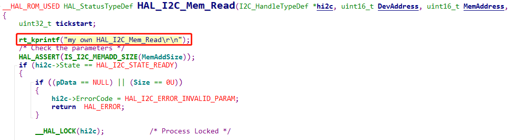
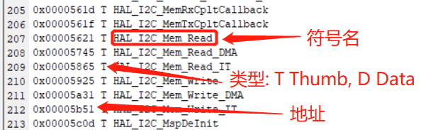
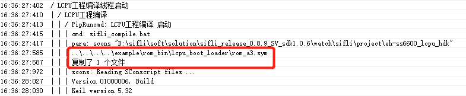
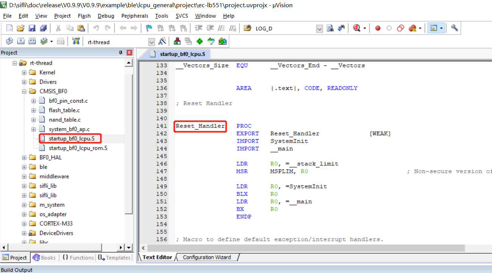
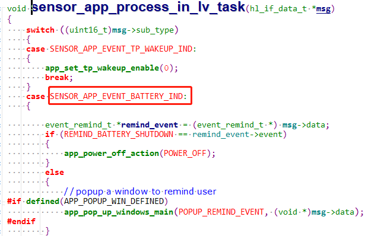
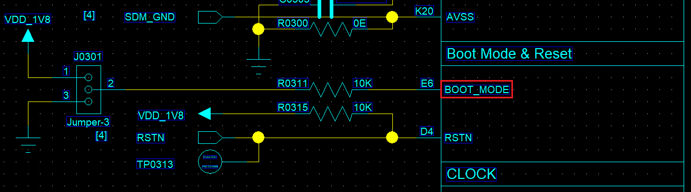
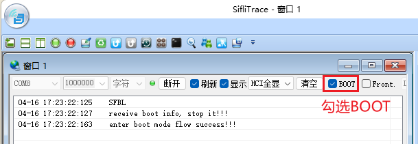
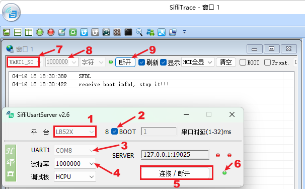

# 10 System
## 10.1 How to Call and Replace Functions and Variables in the ROM of Lcpu?
To save Lcpu RAM space, the BLE protocol stack, RTT OS, complete HAL code, and some driver code are固化 in the ROM. <br>
In Lcpu, functions and variables available for customer use are placed in the following file via a symbol file:<br>
`SDK\example\ble\lcpu_general\project\ec-lb551\rom.sym` and are declared as strong functions without the __weak parameter.<br>

Therefore, when writing code, the ROM code will be called whenever possible.
For example:<br>
In the file `bf0_hal_i2c.c` in the SDK, the function `HAL_I2C_Mem_Read` is included in the compilation, but during linking, it is defined as a weak function:
```c
#define __HAL_ROM_USED __weak 
```
<br><br>
In the corresponding `example\ble\lcpu_general\project\ec-lb551\rom.sym` file, as shown in the following figure:<br>
<br><br>

There is a function with the same name, and it is not a __weak weak function, so it will link to the strong function code in the ROM. Therefore, the `rt_kprintf` above will not print anything.
If you want to run the `HAL_I2C_Mem_Read` function and replace the function in the ROM, first delete the `example\ble\lcpu_general\project\ec-lb551\rom.sym` file (the path may vary depending on the project, you can check the compilation process log to locate it, as shown in the following figure):<br>
<br><br>
Then run the command `scons -c` to clean the Lcpu compilation results and recompile. In the corresponding line `0x00005621 T HAL_I2C_Mem_Read` in the file, during compilation and linking, since there is only one `HAL_I2C_Mem_Read` weak function, it will link to this __weak function.
At this point, the `rt_kprintf("my own HAL_I2C_Mem_Read\r\n");` you added in the figure above will print.
To confirm whether the function in the ROM or the code is being used, you can search for the function's corresponding address in the Lcpu's compiled map file.

## 10.2 Interface to Get the Current Restart Method
The SF32LB55X chip can distinguish the following boot states:<br>
```
/** power on mode */
typedef enum
{
    PM_COLD_BOOT = 0,  /**< cold boot */
    PM_STANDBY_BOOT,   /**< boot from standby power mode */
    PM_HIBERNATE_BOOT, /**< boot from hibernate mode, system can be woken up by RTC and PIN precisely */
    PM_SHUTDOWN_BOOT,   /**< boot from shutdown mode, system can be woken by RTC and PIN, but wakeup time is not accurate */
} pm_power_on_mode_t;
```
You can call the following function to get the boot mode:
```c
pm_power_on_mode_t SystemPowerOnModeGet(void)
{
    return g_pwron_mode;
}
```
Note: Power-on, WDT, button reset, and HAL_PMU_Reboot are four cold roots that cannot be distinguished.

## 10.3 Is the main Function the Entry Point of Lcpu?
The reset address of Lcpu is:
<br><br>
The `main` function is the entry point of one of the threads after initialization is complete.

## 10.4 How to Wake Up Hcpu from Lcpu
a. Lcpu can send a message to Hcpu using `ipc_send_msg_from_sensor_to_app` as follows, which can wake up Hcpu:
```c
static void battery_send_event_to_app(event_type_t type)
{
    event_remind_t remind_ind;

    rt_kprintf("battery_send_event_to_app: event %d\n", type);
    remind_ind.event = type;
    ipc_send_msg_from_sensor_to_app(SENSOR_APP_EVENT_BATTERY_IND, sizeof(event_remind_t), &remind_ind);
}
```
b. After Hcpu wakes up, add the code to handle this message in the task, as follows:
<br><br>

## 10.5 Methods to Enter Boot_Mode for MCU

The SiFli series MCU has a boot code固化 in its internal ROM. The MCU will enter the boot code upon power-on without any code being flashed. The boot code already includes common flash storage drivers and determines how to jump the code by reading the configuration at a fixed address in external storage (Flashtable). If the boot code reads an incorrect Flashtable, it will remain in the boot_mode code. You can determine whether the MCU is in the boot_mode code by comparing the PC pointer address with the `HPSYS address mapping` in the chip manual. The ROM address range for the boot code is typically as follows:<br>
Memory|Address space|Starting Address|Ending Address
:--|:--|:--|:--
ROM|64KB|0x0000_0000|0x0000_FFFF

Uses of entering boot_mode:<br>
1. Hardware debugging, to determine whether the MCU is running normally without flashing any program;<br>
2. In case the user program crashes or other issues cause Jlink or UART to fail, entering boot_mode ensures normal program download.

### 10.5.1 Methods to Enter Boot Mode for 55/58/56 Series MCUs
<br><br>   
The 55, 58, and 56 series MCUs all have a BOOT_MODE pin. When BOOT_MODE is pulled high and the MCU is reset or powered on, it will enter boot mode. The following log will appear on the default debug serial port of Lcpu, which is also the default UART download port:
```
   Serial:c2,Chip:2,Package:0,Rev:0
    \ | /
   - SiFli Corporation
    / | \     build on Mar 20 2022, 1.2.0 build dbebac
    2020 - 2022 Copyright by SiFli team
   msh >
```
In boot mode, before performing UART download, you can input the `help` command to verify if the serial port is working, as shown below:
```
   Serial:c2,Chip:2,Package:0,Rev:0
    \ | /
   - SiFli Corporation
    / | \     build on Mar 20 2022, 1.2.0 build dbebac
    2020 - 2022 Copyright by SiFli team
   msh >
TX:help
   help
   RT-Thread shell commands:
   list_mem 
   uart 
   spi_flash 
   reboot 
   regop 
   dump_config 
   dfu_recv 
   reset 
   lcpu 
   sysinfo 
   version 
   console 
   help 
   time 
   free 
   msh >
```  
<br>**Note**<br> 
The log output after pulling BOOT_MODE high comes from the internal ROM code and does not depend on external code. If this log is not present, please check the serial port connection and whether the MCU operating conditions are met.<br> 
### 10.5.2 Methods to Enter Boot Mode for 52 Series MCUs
<br><br> 
As shown in the figure above, the tool `SiFli-SDK\tools\SifliTrace\SifliTrace.exe` is required to connect via serial port and select the BOOT option, then restart the machine. In the 52 series' boot code, it will wait for 2 seconds. After selecting the BOOT option, the tool SifliTrace will send a command to enter boot mode. If you only see the `SFBL` log and not the subsequent two logs, it may indicate that the UART connection from the PC's TX to the MCU's RX is not working;
```
SFBL
receive boot info, stop it!!!
enter boot mode flow success!!!
```
You can also use the tool `SiFli-SDK\tools\SifliUsartServer.exe` together with SifliTrace.exe, as shown in the figure below:
<br><br> 

<br>**Note**<br>
The `SFBL` log does not depend on the software. If this log is not present, please check the serial port connection and whether the MCU operating conditions are met.<br>

## 10.6 Modifying the Long Press Reset Time for PA34 on 52 Series MCUs
The 58, 56, and 52 series MCUs all support long-press power key (PWRKEY) reset. If the power key PB54 (58 series), PB32 (56 series), PA34 (52 series) remains high for more than 10 seconds, a PWRKEY reset will occur, resetting all modules except the RTC and IWDT. The `PWRKEY` flag in the PMUC register WSR can be used to check if a PWRKEY reset has occurred, and the `PWRKEY` flag in the PMUC register WCR can be used to clear this flag.<br> 
Among these, the 52 series can modify the long-press reset time (58 and 56 series do not have this register and do not support modification). The default value of `PWRKEY_HARD_RESET_TIME` is 10 seconds, and it can be modified as needed. The internal RC32 counter is used, and it does not depend on the external 32768 Hz crystal clock. Additionally, the polarity of the key cannot be modified;
```c
#ifndef PWRKEY_HARD_RESET_TIME
    #define PWRKEY_HARD_RESET_TIME     (10)   /* unit:s */
#endif
```
The corresponding code configuration is in the initialization function `HAL_PreInit`:
```c
hwp_pmuc->PWRKEY_CNT = PWRKEY_CNT_CLOCK_FREQ * PWRKEY_HARD_RESET_TIME ;  //set pwrkey hard reset time time*32768
```