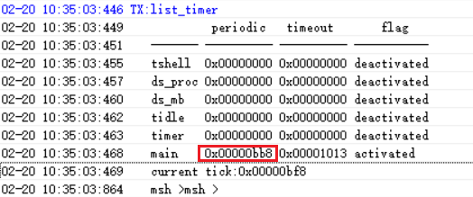

# 2 Timer-Related
## 2.1 Delay Functions
1, HAL layer delay functions: (equivalent to instruction loops in while, the delay will not switch to other threads)<br> 
```c
HAL_Delay(10); /* Delay 10ms */
HAL_Delay_us(10); /* Delay 10us */
```
2, RTT interface delay functions:<br> 
When the RTT interface delay functions are executed, they will switch to other threads, such as the idle thread. If the sleep threshold is lower than the delay duration, it will enter Standby sleep<br>
```c
rt_thread_delay(100); /* Delay 100ms */
```
## 2.2 Get Timestamp, Tick Value, and RC10K Oscillation Frequency
1, Get timestamp:<br> 
```c
/* 32768 crystal clock, the register value increments by 1 every 1/32768 seconds */
/* RC10K clock, the register value increments by 1 approximately every 1/9000 seconds */
uint32_t start_time = HAL_GTIMER_READ(); 
```
2, Get the Tick value that increments every 1ms:<br> 
```c
rt_tick_t start_timer = rt_tick_get(); /* RTT system function, the return value increments by 1 every 1ms */
uint32_t tickstart = HAL_GetTick();  /* HAL layer function, the return value increments by 1 every 1ms */
```
3, Get the current clock frequency:<br> 
```c
/* 32768 crystal clock, returns 32768 */
/* RC10K clock, returns a value between 8k-10k */
uint32_t mcuOscData = HAL_LPTIM_GetFreq(); 
```
## 2.3 View Existing Timer Commands via UART
```c
list_timer
```
 <br><br> 
Explanation of `list_timer` status:<br> 
The first column "timer" is the timer name;<br> 
The second column "periodic" is the timer period (hexadecimal, unit: ms);<br> 
The third column "timeout" is the timestamp for the next timer event;<br> 
The fourth column "flag" indicates whether the timer is active,<br> 
As shown in the figure, the only active timer is the "main" timer (the delay function is also a timer), with a wake-up period of 0xbb8 (3000ms).<br>