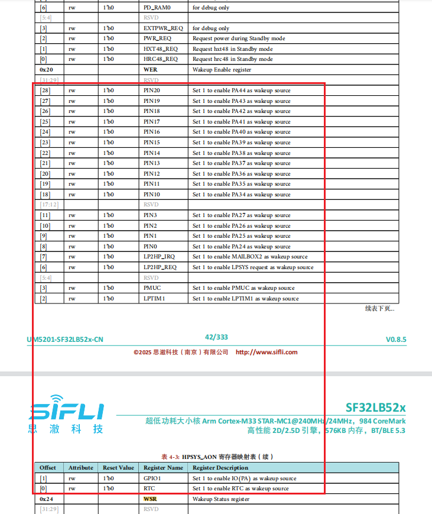

# 13 UART Related
## 13.1 How to wake up MCU via UART RX
The following are wake-up sources when MCU is in sleep mode:
<br><br>  

If you want to wake up from Deep/Standby sleep mode, you can see there is no UART wake-up function available. Therefore, you need to configure UART RX as GPIO mode and enable wake-up capability on this IO. Please refer to the example `\example\rt_device\pm\project\hcpu`, as shown below:  
```c
HAL_PIN_Set(PAD_PA26, USART2_TXD, PIN_PULLUP, 1); // uart2 default setting
HAL_PIN_Set(PAD_PA27, USART2_RXD, PIN_PULLUP, 1); // uart2 default setting 

static void gpio_wakeup_handler(void *args)
{
    rt_kprintf("gpio_wakeup_handler!\n");
    HAL_PIN_Set(PAD_PA27, USART2_RXD, PIN_PULLUP, 1); // switch to uart function
    rt_pm_request(PM_SLEEP_MODE_IDLE); // set MCU not to sleep
}
#if defined(SF32LB52X)
{
    HAL_PIN_Set(PAD_PA27, GPIO_A27, PIN_PULLUP, 1); // set PA27 to GPIO function

    HAL_HPAON_EnableWakeupSrc(HPAON_WAKEUP_SRC_PIN3, AON_PIN_MODE_POS_EDGE); // Enable #WKUP_PIN3 (PA27)

    rt_pin_mode(27, PIN_MODE_INPUT);

    rt_pin_attach_irq(27, PIN_IRQ_MODE_RISING, (void *) gpio_wakeup_handler,\
                (void *)(rt_uint32_t) 27); // PA34 GPIO interrupt
    rt_pin_irq_enable(27, 1);
}
#endif
```
It is recommended to use a separate GPIO to wake up the MCU (most customers do this). If you want the wake pin and uart rx2 to share the same GPIO, you need to do more software work as shown above. You must wait until the wake-up is complete (see the print [pm]W:) before receiving UART data and keep the MCU awake until RX operations finish.

## 13.2 UART1 fails to enter RX interrupt callback function
Root causes:  
1. UART FIFO has only one byte. If the system is busy, a one-byte length (approximately 10 bits) at 115200 baud rate takes about 1us. If the FIFO is not cleared within 1us after receiving an interrupt, it will overflow.  
2. USART1_IRQHandler can be triggered, but due to errors, no upper-layer callback occurs. The upper-layer callback only triggers when data is received correctly. Since UART1 is used to control audio Bluetooth, switching to Segger logging and using system polling may result in failing to clear the RX interrupt in time.  

Solutions:  
Switch to DMA RX interrupt.  
Change  
rt_device_open(g_bt_uart, RT_DEVICE_FLAG_INT_RX);  
to  
rt_device_open(g_bt_uart, RT_DEVICE_FLAG_DMA_RX);

## 13.3 How to print logs via UART without rt_kprintf

1. rt_kprintf  
```c
rt_kprintf("app_cache_alloc: size %d failed!\n", size);
```
rt_kprintf output is not affected by other switches and will always print, suitable for short-term debugging. It can be deleted afterward. Too many such logs may affect system performance.  

2. Ulog printing  
Ulog allows level-based output. When DBG_LEVEL is set to DBG_ERROR, lower-level messages such as `DBG_WARNING`, `DBG_INFO`, and `DBG_LOG` will not be printed.  
```c
#define DBG_LEVEL          DBG_ERROR  // DBG_LOG //
#define LOG_TAG              "drv.it7259e"
#include <drv_log.h>
void init(void)
{
    LOG_D("it7259e touch_init\n");
}
```

3. Printing by operating UART registers  
In some cases, such as during `bootloader` stage or before the RTT operating system starts, log debugging may be required. You can use the following method. The prerequisite is that hwp_usart1 has already been initialized. Refer to the example `example\uart\src` for UART initialization.  
```c
char *boot_tag = "0x";
void boot_uart_tx(USART_TypeDef *uart, uint8_t *data, int len)
{
    int i;

    for (i = 0; i < len; i++)
    {
        while ((uart->ISR & UART_FLAG_TXE) == 0);
        uart->TDR = (uint32_t)data[i];
    }
}
void main()
{
    boot_tag = "tag0\n";
    boot_uart_tx(hwp_usart1, (uint8_t *)boot_tag, strlen(boot_tag));
}
```
