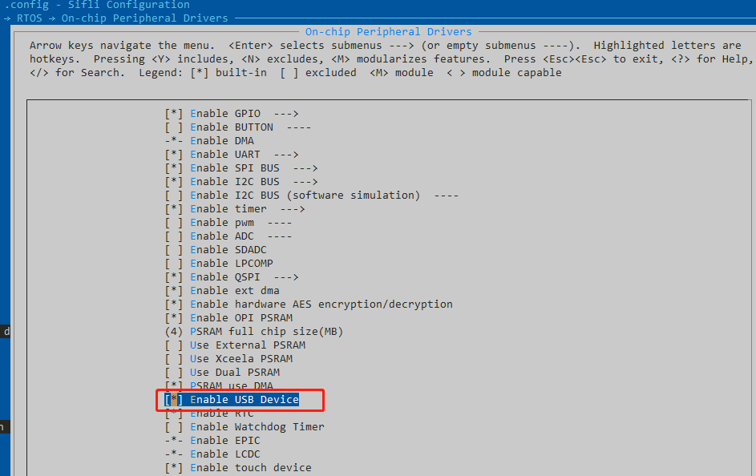
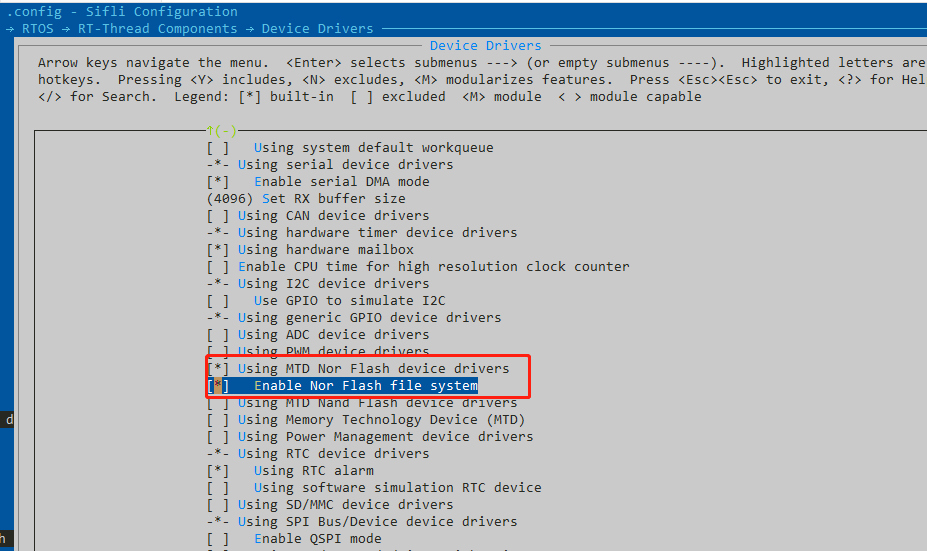
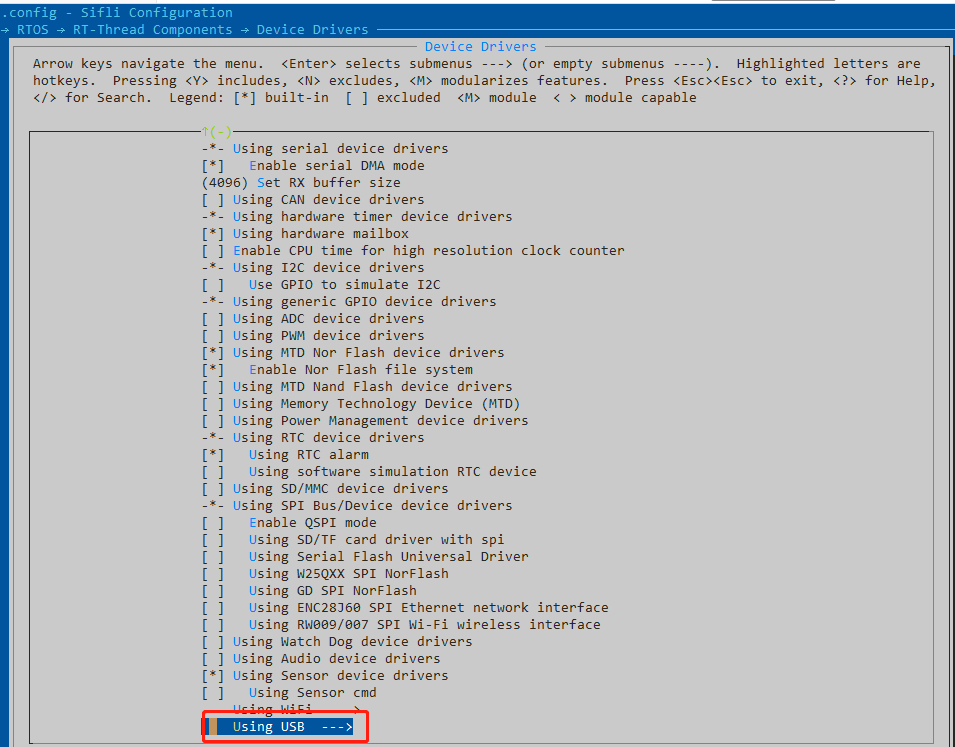
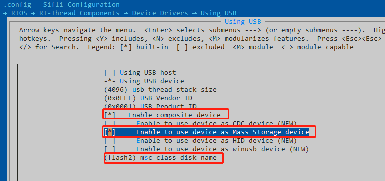

# 12 USB Related
## 12.1 USB as Device Storage
USB can be used as a device storage function, meaning that when the device is inserted into a PC, a USB drive will be displayed on the PC, and files can be copied, etc.<br>
1. In the project, open `menuconfig` and set the following:<br>
Enable USB device function:<br>
<br><br>   
Enable flash support and enable the flash file system:
<br><br>   
Open USB-related specific configurations:
<br><br>   
Perform detailed USB configuration, select Mass Storage device, and since flash1 has limited space and also contains code, flash2 is typically chosen as the USB drive space.
<br><br>   
After configuring the relevant definitions, compile the software, download it, and connect the device to the PC via the USB port. Upon startup, you need to enter the following commands in the PC serial port:
```
mkfs -t elm flash2    --- format
mountfs -t elm flash2 /  --- mount
ls /dev      --- check if the USB device is present
mkdir abc    --- if the USB device is detected, create a folder using mkdir, and you can see the USB drive icon on the PC and click to copy files
```
PS: The SDK supports the device storage function, but related configurations are required, and customers may need to debug according to their own needs. Sometimes, a reboot and re-mounting are necessary to see the USB drive.