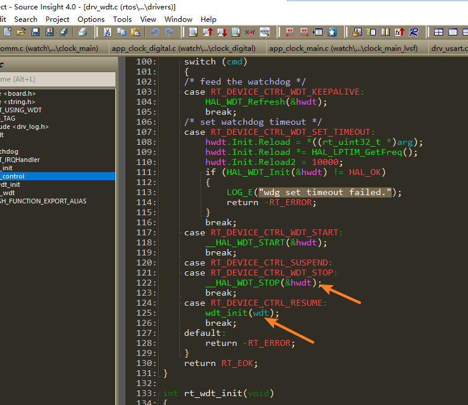

# 4 Watchdog Related
## 4.1 Watchdog WDT Status After Standby
<br><br>   
As shown in the code above, the current SDK does not power down the watchdog after entering standby, but the code will stop the WDT. Regardless of how long the sleep duration is, the watchdog will not trigger a reset.<br> 
When waking up from standby, the resume case will be executed, and the WDT will be reinitialized, effectively restarting the countdown.<br> 

## 4.2 Methods to Disable WDT Using Jlink
1. **Scenario 1**: If both Hcpu and Lcpu have watchdogs enabled, and the machine repeatedly restarts, making it impossible to dump memory to diagnose the issue, you can disable the watchdog using Jlink:
   Execute:
   <br> 
   ```
   tools\segger\halt_all_cpu_and_disable_all_wdt_a0.bat
   ```
   This will disable the WDT for both Hcpu and Lcpu, and halt both CPUs, facilitating memory dumping.<br> 
2. **Scenario 2**: If you only want to disable the log for Hcpu and allow Hcpu to continue running:
   Modify the commands in `halt_all_cpu_and_disable_all_wdt_a0.jlink` corresponding to `halt_all_cpu_and_disable_all_wdt_a0.bat` as follows:
   <br> 
   ```
   connect # Connect Jlink
   w4 0x4004f000 0 # Switch Jlink to Hcpu
   connect # Connect Jlink
   h # Halt Hcpu
   w4  0x40014018  0x51ff8621
   w4  0x4001400C  0x34
   w4  0x40014018  0x58ab99fc
   w4  0x4007c018  0x51ff8621
   w4  0x4007c00C  0x34
   w4  0x4007c018  0x58ab99fc
   g # After the above operations on the WDT registers, continue running Hcpu
   exit
   ```
3. **Scenario 3**: If you only want to disable the log for Lcpu and allow Lcpu to continue running, you can extract and modify a portion of the commands in `halt_all_cpu_and_disable_all_wdt_a0.jlink`:
   <br> 
   ```
   connect
   w4 0x4004f000 1
   connect
   w4 0x40070000 0 
   h
   w4  0x40055018  0x51ff8621
   w4  0x4005500C  0x34
   w4  0x40055018  0x58ab99fc
   g
   exit
   ```

## 4.3 Where to Clear the WDT
1. The `rt_hw_watchdog_init` initialization function registers `rt_hw_watchdog_pet` as a hook function via `rt_hw_watchdog_hook`;<br> 
2. When the system enters the idle thread `rt_thread_idle_entry` due to no tasks being processed, the hook function registered in `idle_hook_list` will be executed;<br> 
```c
__ROM_USED void rt_hw_watchdog_init(void)
{
    extern int rt_wdt_init(void);
    rt_wdt_init();
    wdt_dev = rt_device_find("wdt");
    if (wdt_dev)
    {
        rt_err_t err = rt_device_open(wdt_dev, RT_DEVICE_FLAG_RDWR);
        if (err == RT_EOK)
        {
            uint32_t count = WDT_TIMEOUT;
            rt_device_control(wdt_dev, RT_DEVICE_CTRL_WDT_SET_TIMEOUT, &count);
        }
    }
    rt_hw_watchdog_hook(1); // Register the WDT hook function, which will automatically clear the watchdog in the idle thread
}

__ROM_USED void rt_hw_watchdog_pet(void) // Manual function to clear the watchdog, can be called
{
    if (wdt_dev)
    {
        rt_device_control(wdt_dev, RT_DEVICE_CTRL_WDT_KEEPALIVE, NULL);
    }
}
```