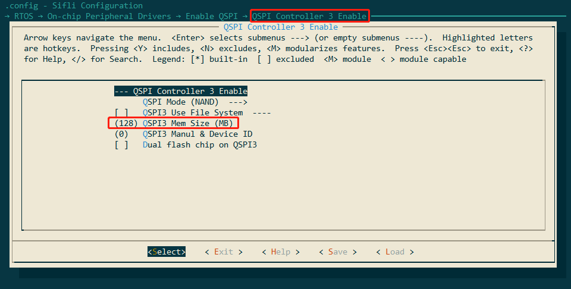
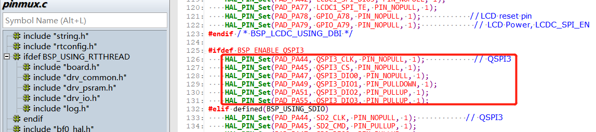
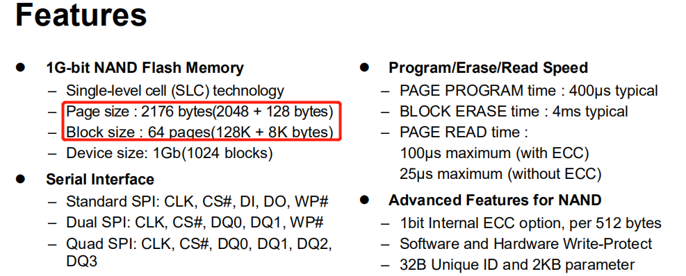
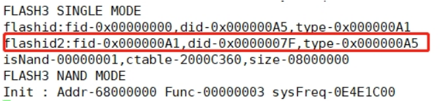
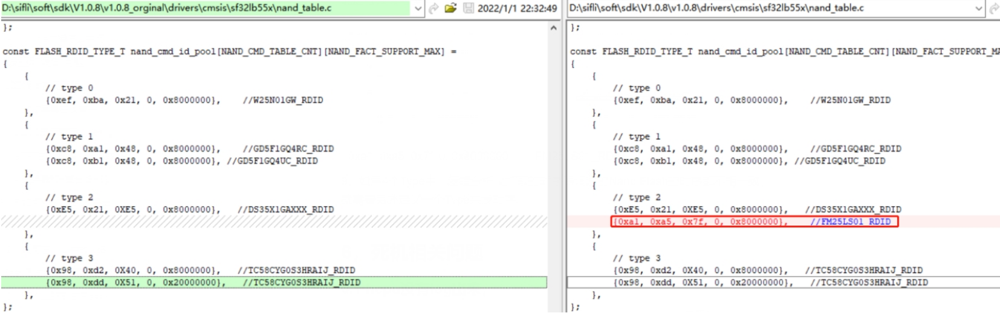
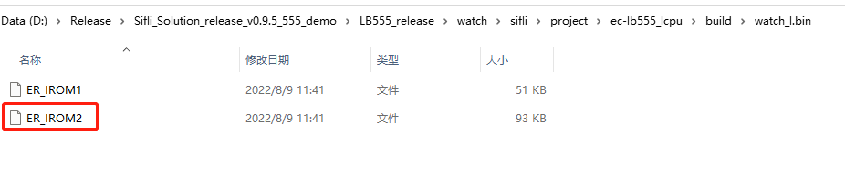

# 3 Common Issues in Flash Debugging
## 3.1 SF32LB551 Flash3 Debugging Process for Nand Flash?
SF32LB551 Flash3 is connected to QSPI3. Points to note when debugging Nand flash:
1. Ensure that QSPI Controller 3 Enable is turned on and the memory size is set correctly, as shown in the figure below for 128MB (1G bit/).
     
2. Since QSPI3 will occupy PA49 and PA51, the hcpu log must be changed to Segger output. Refer to section 2.2.1 for the specific method.
3. Check the mode settings for PA44, PA45, PA47, PA49, PA51, and PA55 used by QSPI3. Ensure that these pins are not used elsewhere. The method to confirm this is to use the `pin status 44` command in the Hcpu shell platform to check the status of each pin.
     
4. Enable the macro `#define DRV_SPI_FLASH_TEST` to support the test shell commands for reading and writing to the SPI flash.
5. Use the following commands to test whether the Flash read and write operations are correct.
   Refer to the function `int cmd_spi_flash(int argc, char *argv[])` for specific commands.
   ```
   spi_flash -id 0 2 /* Display the ID of flash3, read operation occurs during power-on initialization, need to capture the waveform on power-up */
   spi_flash -read 0 2048 2 /* Read 2048 bytes of data from the decimal address 0 of flash3 */
   spi_flash -read 4096 4096 2 /* Read 4096 bytes of data from the decimal address 4096 of flash3 */
   spi_flash -write 4096 4096 0 2 /* Write 4096 bytes of data to the decimal address 4096 of flash3 */
   spi_flash -erase 0x20000 0x20000 2 /* Erase 0x20000 bytes of data from the hexadecimal address 0x20000 of flash3, note that erasure can only be done in blocks, and the address and size must be multiples of 0x20000 */
   ```
   **Note:**
   Modern NAND Flash read/write operations must be performed page by page, but erasure must be done in block sizes, as shown in the figure below:
     
   Each page has 2176 units, so each page is 2048 bytes + 128 bytes (SA).
   Each block consists of 64 pages, so each block has a capacity of 2048x64 = 131,072 (0x20000), i.e., 131,072 bytes + 8K bytes (SA).
6. For new flash not in the `nand_cmd_id_pool` list, the `spi_flash -id 0 2` command to read the ID of flash3 will return 0xff.
   Note: If the logic analyzer captures the read ID timing, it needs to be done during power-on. The read ID operation occurs during power-on, and the `spi_flash -id 0 2` command only prints the ID read during power-on initialization.
7. The ID read back by the `spi_flash -id 0 2` command is as follows:
   ```
   msh >spi_flash -id 0 2
   spi_flash -id 0 2
   rt_flash_read_id_addr: 0x68000000, id:2, value:7fa5a1
   ```
   For the new JLink ELF driver, there is currently a log added to print the ID when downloading to address 0x68000000 in uart3, as shown in the figure below:
     
   Add the corresponding group to the `nand_cmd_id_pool` list in `nand_table.c` based on the command method, as shown in the figure below:
     
   {0xa1, 0xa5, 0x7f, 0, 0x8000000}, //FM25LS01_RDID
   If the command is the same as type2, read and write operations can be performed normally. Usually, modifying the `nand_cmd_id_pool` and `nand_cmd_table_list` in the `nand_table.c` file allows for read, erase, and write operations.
8. If the timing captured by the logic analyzer does not match any of the type timing sequences for the Nand Flash being debugged, a new type needs to be defined to send the timing sequence.

## 3.2 SF32LB555 Lcpu Mounting Flash4 Process
For example, the `ec-lb555_lcpu` project in the `A3` chip's `\watch\sifli\project\` directory supports mounting flash4. Refer to the following differential package, and all relevant modifications have been added:
- Remove the flash-related functions from the relevant ROM lib files in `\middleware\sifli_lib\lib` (for A3 chip, use `sifli_rom_a3.lib`; for other versions A0\A1\A2, use `sifli_rom.lib`). Do not use the functions in the ROM, but use the functions in the code. The version of the ROM lib file in the customer's possession may vary, so it is important to check the FLASH-related functions inside.
- Modify the `bf0_pm_a0.c` file in `\middleware\system`.
- Modify the `drv_spi_flash.c` file in `\rtos\rtthread\bsp\sifli\drivers`.
- Modify the `link_lcpu_ram.sct` partition file in `\watch\sifli\project\ec-lb555_lcpu\linker_scripts` to place some algorithms in flash4.
- Modify the `menuconfig` in `\watch\sifli\project\ec-lb555_lcpu` to enable QSPI FLASH4 support.
- Modify the `postbuild.bat` file in `\watch\sifli\project\ec-lb555_lcpu` to add new compilation files `bin`.
- Modify the `SConstruct` file in `\watch\sifli\project\ec-lb555_lcpu` to add new compilation files `bin`.
- PS: When compiling, manually delete the `build` directory in `ec-lb555_lcpu` if it already exists. If the `bin` file already exists, it may cause compilation issues. After successful compilation, check whether the `ER_IROM2` file has been added to `\watch\sifli\project\ec-lb555_lcpu\build\watch_l.bin`.
   

## 3.3 Read SN/MAC from Flash
The SN and MAC are written to the device during the production line version download, stored in TLV format. TLV is a common data encoding format consisting of three parts: Tag (Type), Length, and Value, i.e., arranged as ID+LEN+DATA.<br>
For the data format, refer to the section:
[5.6 55X Viewing Chip Factory Calibration Area OTP/Flash Data Method](../tools/sifli.md#5655X查看芯片工厂校准区OTP)

type | length | value
:--|:--|:--
1byte| 1byte| <=256byte

The type number for SN is: FACTORY_CFG_ID_SN, with a corresponding value of 2.<br>
Value composition: descriptor + serial number (8 bytes), e.g., sifli_00000001<br>
Example code to obtain SN:<br>
```c
{
int res = 0;
char sn[300] = {0};
res = rt_flash_config_read(FACTORY_CFG_ID_SN, (uint8_t) *)&sn[0], 256);
} 
rt_flash_config_read(FACTORY_CFG_ID_SN, (uint8_t *)mac, sizeof(mac));
// Method to obtain MAC address
rt_flash_config_read(FACTORY_CFG_ID_MAC, (uint8_t *)&mac[0], 6);
```
<a name="34Flash下载驱动对应关系"></a>
## 3.4 Flash Download Driver Correspondence

**Uart Download Driver Files** <br>
Uart download driver files are *.bin files, as follows:<br>
ram_patch_52X.bin -- corresponds to the driver for internal or external Nor Flash of 52X<br>
ram_patch_52X_NAND.bin -- corresponds to the driver for external Nand Flash of 52X when the serial port baud rate is below 6M<br>
ram_patch_52X_NAND_6M.bin -- corresponds to the driver for external Nand Flash of 52X when the serial port baud rate is 6M<br>
ram_patch_52X_NAND_8M.bin -- corresponds to the driver for external Nand Flash of 52X when the serial port baud rate is 8M<br>
ram_patch_52X_NAND_NOBBM.bin -- corresponds to the driver for external Nand Flash of 52X without BBM (no Bad Block Management area)<br>
ram_patch_52X_SD.bin -- corresponds to the download driver for sdio interface sd-nand/sd-emmc<br>
- The correspondence between Impeller download selection and bin files is configured in `Impeller.ini`
```ini
[UART_DRIVER]
SF32LB55X=ram_patch.bin
SF32LB55X_SD=ram_patch_SD.bin
SF32LB56X=ram_patch_56X.bin
SF32LB56X_NAND=ram_patch_56X_NAND.bin
SF32LB56X_SD=ram_patch_56X_SD.bin
SF32LB52X=ram_patch_52X.bin
SF32LB52X_NAND=ram_patch_52X_NAND.bin
SF32LB52X_SD=ram_patch_52X_SD.bin
SF32LB58X_NAND=ram_patch_58X_NAND.bin
SF32LB58X=ram_patch_58X.bin
SF32LB58X_SD=ram_patch_58X_SD.bin
```

[UART_DRIVER_8M]
SF32LB56X_NAND=ram_patch_56X_NAND_8M.bin
SF32LB52X_NAND=ram_patch_52X_NAND_8M.bin
SF32LB58X_NAND=ram_patch_58X_NAND_8M.bin
```
**Jlink Download Driver Files** <br>
Jlink download driver files are in the *.elf format<br>
Located in the Jlink installation directory `C:\Program Files\SEGGER\JLink\Devices\SiFli` or `C:\Users\yourname\AppData\Roaming\SEGGER\JLinkDevices\Devices\SiFli`, open the `cmd.exe` command line window, and type `jlink.exe`, which is the Jlink configured in the Windows system environment variables. The Impeller uses the default Jlink version.
- The Jlink burn-in driver correspondence is specified in the configuration file `JLinkDevices.xml`<br>
```xml
  <Device>
    <ChipInfo Vendor="SiFli" Name="SF32LB52X_NOR" Core="JLINK_CORE_CORTEX_M33" WorkRAMAddr="0x20000000" WorkRAMSize="0x60000" />
    <FlashBankInfo Name="Internal Flash1" BaseAddr="0x10000000" MaxSize="0x8000000"  Loader="Devices/SiFli/SF32LB52X_INT_FLASH1.elf" LoaderType="FLASH_ALGO_TYPE_OPEN" AlwaysPresent="1"/>
    <FlashBankInfo Name="External Flash2" BaseAddr="0x12000000" MaxSize="0x8000000" Loader="Devices/SiFli/SF32LB52X_EXT_FLASH2.elf" LoaderType="FLASH_ALGO_TYPE_OPEN" AlwaysPresent="1"/>
  </Device>
 
  <Device>
    <ChipInfo Vendor="SiFli" Name="SF32LB52X_NAND" Core="JLINK_CORE_CORTEX_M33" WorkRAMAddr="0x20000000" WorkRAMSize="0x80000" />
    <FlashBankInfo Name="External Nand2" BaseAddr="0x62000000" MaxSize="0x3e000000" Loader="Devices/SiFli/SF32LB52X_EXT_NAND2.elf" LoaderType="FLASH_ALGO_TYPE_OPEN" AlwaysPresent="1"/>
  </Device>
```
**uart_download.bat Download Driver**<br>
When running the batch file `uart_download.bat` in the SDK, the Flash driver used for downloading is the `ImgDownUart.exe` file located in `\tools\uart_download\`. The serial port driver is integrated into `ImgDownUart.exe`. The current version of the driver is not modularized, so the burn-in driver cannot be modified.