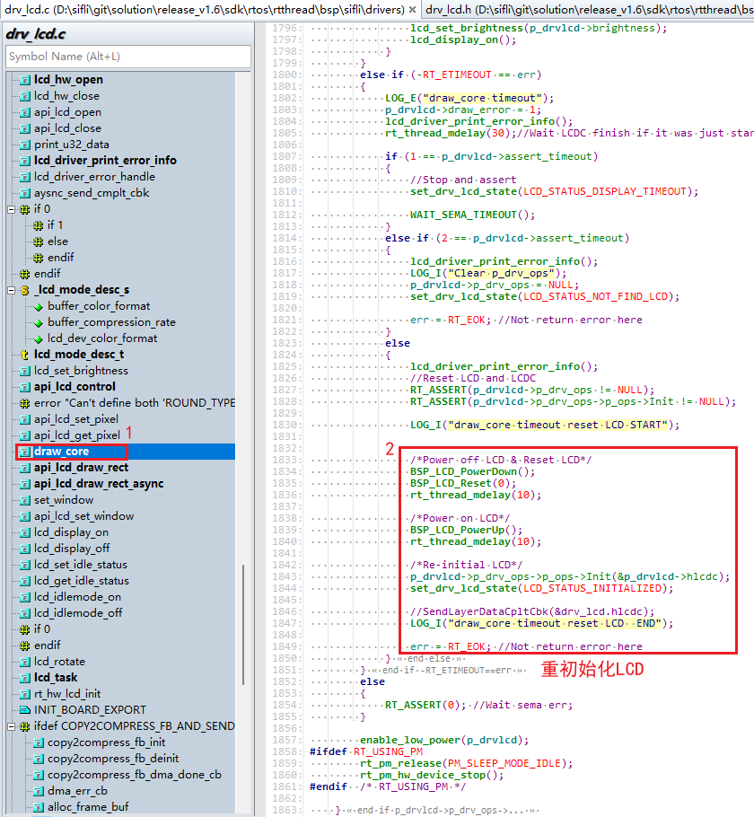

# 1 Common Issues in LCD Debugging
## 1.1 Green Stripe on the Right Side of the LCD Screen
As shown in the following figure:<br>
<br><br> 
Please confirm and modify as shown in the following figure:<br>
<br><br> 

## 1.2 LCD Displaying Garbled Screen
Debugging method, as shown in the following figure:
<br><br>   
1. After connecting J-Link, type `h` to stop the CPU,<br>
2. In the command window, execute `\release\tools\crash_dump_analyser\script\save_ram_a0.bat` to save memory information<br>
3. The dumped memory information is as follows:<br>
<br><br> 
4. Run the `release\tools\crash_dump_analyser\simarm\t32marm.exe` tool to restore the hcpu's context, and select `load_memory_butterfli_hcpu.cmm` for the restoration operation,<br>
<br><br>
Then, when prompted to select the bin file at address `0x20000000`, choose `hcpu_ram.bin`<br>
<br><br> 
When prompted to select the bin file at address `0x60000000`, choose `psram.bin`, as shown in the following figure:<br>
<br><br> 
When prompted to select the `*.axf` file, choose the `*.axf` file of the hcpu you compiled,<br>
The path for the Wachdemo project is: `example\watch_demo\project\ec-lb551\build\bf0_ap.axf`<br>
As shown in the following figure:<br>
<br><br> 
After restoring the context, open the Var->watch window, enter the `drv_lcd` variable to search for it, and add it to the watch window to view,<br>
<br><br> 
In the watch window, expand the `drv_lcd` variable and find that the window size settings for the LCD do not match the LCD driver,<br>
<br><br> 
Modify the `rtconfig.h` file and configure it accordingly to resolve the garbled screen issue.<br>
```c
#define LCD_HOR_RES_MAX 454
#define LCD_VER_RES_MAX 454
```
Also, modify the macros for the littleVGL screen settings to match the LCD size<br>
```c
#define LV_HOR_RES_MAX 454
#define LV_VER_RES_MAX 454
#define LV_DPI 315
#define LV_FB_LINE_NUM 454
```

## 1.3 Garbled Screen on the First Frame When the TFT Screen is Turned On or Woken Up
The garbled screen occurs when the data in the screen's GRAM is incorrect during the display startup. From the display startup logic, it should first send the correct data, then turn on the display, and finally turn on the backlight. If the sequence is incorrect, it will cause the first frame to be garbled. Alternatively, after initialization, you can send black screen data. If the screen driver IC supports writing registers to output a black screen, prioritize using the screen register write method,<br>
Or use the following method:<br>
Refer to the approach used in the SPD2012 driver code, before turning on the screen, send black screen data through the LCDC background to clear the internal GRAM of the screen.<br>
<br><br> 

## 1.4 Screen Does Not Light Up Despite Normal Initialization and Read/Write Operations
Each screen IC has a different delay between power-on and register initialization. If the delay in the `BSP_Power_Up` function between powering on the screen and initializing the LCD registers is insufficient, it can prevent the registers from being configured properly, leading to the LCD driver not working;<br>
Solution:<br>
Add a delay at the beginning of the LCD register initialization based on the requirements of the screen driver IC.<br>
<br><br>  
The following lists three delay durations that need attention during screen initialization. Too long a delay can slow down the screen lighting up, and when reducing the delay, always refer to the screen IC specification.<br>
```c
static void SPD2010_Init_SPI_Mode(LCDC_HandleTypeDef *hlcdc)
{
    uint8_t   parameter[14];
    int i, j;

    memcpy(&hlcdc->Init, &lcdc_int_cfg, sizeof(LCDC_InitTypeDef));
    HAL_LCDC_Init(hlcdc);

    BSP_LCD_Reset(0); // Reset LCD
    rt_thread_delay(1);  // Configure this delay based on the screen driver IC specification
    BSP_LCD_Reset(1);

    /* Wait for 50ms */
    rt_thread_delay(50); // Configure this delay based on the screen driver IC specification

    for (i = 0; i < sizeof(lcd_init_cmds) / MAX_CMD_LEN; i++)
    {
        SPD2010_WriteReg_I(hlcdc, lcd_init_cmds[i][0], (uint8_t *)&lcd_init_cmds[i][2], lcd_init_cmds[i][1]);
        HAL_Delay_us(10);
    }
    rt_thread_delay(50); // Configure this delay based on the screen driver IC specification
	
    SPD2010_WriteReg(hlcdc, 0x29, (uint8_t *)NULL, 0);

}
```

## 1.5 How to Export from Framebuffer to Check if the Image is Normal?
a, Find the address of the global variable `buf1_1` in the `*.map` file in the build directory, as shown in the figure below:<br>
Or you can also find the address of the global variable `buf1_1` under Ozone,<br>
<br><br> 
b, Save the memory values as a bin file using JLink,<br>
`savebin <path> <address> <length>`<br>
For example: `savebin D:\sifli\customer\weizhang\lcd\1.bin 0x20036940 0x52e20`<br>
This screen is in rgb565 format, occupying 2 bytes, with a resolution of 412x412, so the length is 412x412x2=339488=0x52E20<br>
c, Use the Python tool `tools\bin2bmp\bin2bmp.py` to convert the bin file to a bmp image format<br>
The command is as follows:<br>
Old command:<br>
`python bin2bmp.py <file path> <screen height> <screen width> <bits per pixel> <bin offset address>`<br>
For example: The screen is 412x412, and `1.bin` is saved from the base address, so no offset is needed<br>
```
python bin2bmp.py 1.bin 412 412 16 0
```
New command:<br>
`python bin2bmp.py <file path> <color format> <screen height> <screen width> <bin offset address>`<br>
```
python bin2bmp.py 1.bin rgb565 412 412 0
```
Supported color formats: a8/rgb565/rgb888/argb8888/rgba8888<br>
d, A new script `jlinkbin2bmp.py` has been added. When connected to JLink, it can export a bmp image in one step from `savebin` to conversion, as shown in the command below:<br>
```
python jlinkbin2bmp.py SF32LB55X rgb565 412 412 2004E3E0
```
e, For the latest usage instructions, please refer to the `tools\bin2bmp\readme.txt` file.<br>

## 1.6 Common Assert Crashes in LCD Driver
Assert occurred:<br>
```
Assertion failed at function:async_send_timeout_handler, line number:876 ,(0) 
```
<br><br> 
Root cause:<br>
The macro `LCD_GC9B71_VSYNC_ENABLE` is enabled, which activates the TE (Tearing Effect) function. After the LCD sends data, it waits for the TE signal before refreshing the screen. If the TE signal from the LCD is not received, a timeout assert occurs.<br>
Common scenario 1:<br>
The assert occurs during the OTA (Over-The-Air) process. The default IO for the motor is PA44, and in this project, PA44 is the reset signal for the LCD. When entering DFU (Device Firmware Update) mode, the motor is started, causing the LCD to be mistakenly reset. As a result, the LCD no longer outputs the TE signal, leading to a crash during the DFU screen refresh.<br>
Common scenario 2:<br>
Crash when waking up from a screen-off state using a button<br>
Symptoms: After the screen turns off, pressing a button to wake up the device results in an assert, crashing while waiting for the TE signal during the screen refresh.<br>
Root cause:<br>
After initializing the LCD screen, there is a long delay (100ms) during the initialization of the TP (Touch Panel). The customer uses the `rt_thread_mdelay(100);` delay function, which causes the Hcpu to enter the IDLE process and go to sleep.<br>
When the timer expires, the system wakes up from standby, but the LCD has lost power and has not been reinitialized, so there is no TE signal. Continuing to refresh the screen results in a crash.<br>
Solution:<br>
In the driver, do not use the `rt_thread_mdelay(10);` delay function,<br>
Instead, use `HAL_Delay(100);` or `HAL_Delay_us(10);` functions,<br>
The `rt_thread_mdelay` function performs a thread switch and goes to sleep in the Idle process,<br>
The `HAL_Delay` function is a busy loop and does not switch to the Idle process.<br>

## 1.7 ESD Issues Causing LCD Screen Distortion and Freezing
Solution Approach: Determine if the screen display is normal using the TE output signal from the screen driver IC or the register value. If it is abnormal, reinitialize the LCD.<br>
1. If the LCD screen distorts or freezes and there is no TE signal output,<br>
Solution:<br>
In the `drv_lcd.c` file, in the `async_send_timeout_handler` function for waiting for TE timeout:<br>
Use the following code block to reinitialize the LCD:<br>
```c
    drv_lcd.assert_timeout = 3; // Configure whether to assert, do nothing, or reinitialize the LCD in case of screen refresh timeout
```
<br><br> 
2. If the LCD screen distorts and there is a TE signal output, the LCD register value needs to be read to determine the distortion status.<br>
Solution:<br>
- Follow the solution in 1, first enable the screen refresh timeout reinitialization code for the LCD.<br>
- In the `XXXX_WriteMultiplePixels` function of the LCD driver that sends the screen data,<br>
add code to read the LCD register value. If the register value is incorrect, return without refreshing the screen.<br>
Since the screen data sending operation is not executed, it will result in a screen refresh timeout, and the LCD will be reinitialized based on the configuration `drv_lcd.assert_timeout`, as shown in the following figure:<br>
Three checks are performed on the LCD register. If the register value is incorrect three times, the LCD is considered abnormal, and the function returns, triggering a screen refresh timeout and reinitializing the LCD.<br>
<br><br>  
```c
void SH8601Z_WriteMultiplePixels(LCDC_HandleTypeDef *hlcdc, const uint8_t *RGBCode, uint16_t Xpos0, uint16_t Ypos0, uint16_t Xpos1, uint16_t Ypos1)
{
    uint32_t size;
	static uint32_t err_num=0;
	//DEBUG_PRINTF("SH8601Z: WriteMultiplePixels %d,%d,%d,%d \n",Xpos0, Ypos0, Xpos1, Ypos1);
    SH8601Z_ALIGN2(Xpos0);
    SH8601Z_ALIGN2(Ypos0);
    SH8601Z_ALIGN1(Xpos1);
    SH8601Z_ALIGN1(Ypos1);
    uint32_t data;
    data = SH8601Z_ReadData(hlcdc, 0x0A, 1) & 0xff;
	if(0x9c != data)
	{
		if(err_num<3)
		{
			err_num++;
			rt_kprintf("\nSH8601Z_Read0A:0x%x,err_num:%d \n", data,err_num);
		}
		else
		{
			rt_kprintf("reinit SH8601Z \n");
			err_num=0;
			return; //return To trigger drv_lcd timeout and reinit lcd
		}
	}
	else
	{
		err_num=0;
	}
    HAL_LCDC_LayerSetData(hlcdc, HAL_LCDC_LAYER_DEFAULT, (uint8_t *)RGBCode, Xpos0, Ypos0, Xpos1, Ypos1);
    HAL_LCDC_SendLayerData2Reg_IT(hlcdc, SH8601Z_WRITE_RAM, 1);
}
```

## 1.8 Boot Animation or Charging Image Display Distortion
Abnormal display as shown in the following figures:<br>
<br><br>  
<br><br>  
Root Cause:<br>
Pixel alignment issue, the screen requires a multiple of 4 pixels, as indicated in the screen driver IC datasheet, which specifies that the number of pixels sent to the screen must be a multiple of 4:<br>
<br><br>  
Solution:<br>
1. Image correction: Ensure that the resolution of the boot animation and charging images sent to the entire screen is an even number, for example, change the size from 161x80 to 160x80 to resolve the image distortion issue.
<br><br>  
2. In the code, perform 4-pixel alignment, for example, change the image size from 161x80 to 164x80 and fill the additional 3 pixels with the background color, or drop one pixel to make it 160x80.<br>

## 1.9 Issue with QSPI Not Reading the Screen ID
Currently, the QSPI of the screen driver in the 55x and 56x series chips only supports reading QSPI/SPI data from IO0 and does not support reading SPI data from IO1, where the screen ID is output (the 52x series chips support configuring any of IO0-IO3 to read data), as shown in the following figure:
<br><br>  
Interface-II mode output is not supported, as shown in the following figure:<br>
<br><br>  
Screen ID output from IO0 is supported, as shown in the following figure:<br>
<br><br>  
Solution:<br>
Simulate SPI read chip ID using GPIO<br>

**Note:**
Currently, the 52x series chips support reading and writing QSPI/SPI data from any of the IO0-IO3 data lines of the screen driver QSPI.<br>
Configuration method:<br>
```c
.readback_from_Dx= 0,  /* 0 corresponds to IO0, 1 corresponds to IO1, 2 corresponds to IO2, 3 corresponds to IO3,*/
```
<br><br>

## 1.10 Dynamic Adjustment of Screen QSPI Read/Write Register CLK Rate
Some display driver ICs have upper limits on the CLK frequency for reading and writing registers during initialization, for example, it cannot exceed 20MHz, but the display can go up to 50MHz. The following method can be used to modify this:

The default display frequency is `.freq = 48000000, //48MHz`

<br><br> 

When reading registers, change it to 2MHz, as follows:

<br><br> 

```c
void GC9B71_ReadMode(LCDC_HandleTypeDef *hlcdc, bool enable)
{
    if (HAL_LCDC_IS_SPI_IF(lcdc_int_cfg.lcd_itf)){
        if (enable){
            HAL_LCDC_SetFreq(hlcdc, 2000000); //read mode min cycle 300ns
        }
        else {
            HAL_LCDC_SetFreq(hlcdc, lcdc_int_cfg.freq); //Restore normal frequency
        }
    }
}
```

When writing to the register `GC9B71_WriteReg`, the same method can be used to adjust the CLK rate. <br>