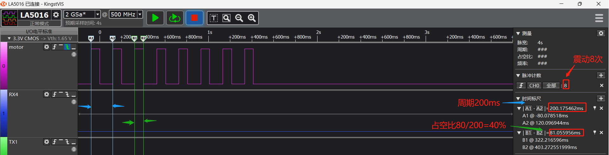

# 4 Common Issues in Motor Debugging
## 4.1 Configuration for GPIO Simulating Motor Vibration
Considering the use of any IO port to drive the motor, the solution code implements the GPIO-driven motor code. The macro definitions in `rtconfig.h` after menuconfig configuration are as follows:
```c
#define MOTOR_ENABLED 1 // Enable motor
/* MOTOR_USE_PWM is not set */
#define MOTOR_PERIOD 200  // Motor vibration period
#define MOTOR_POWER_IO -1 // Motor power on, set to -1 if no power control is configured
#define MOTOR_SW_CONTRL 1 // Enable software control of the motor
#define MOTOR_CTRL_IO 121  // Configure as 121-96 = PB25 as the motor drive port
```
You can use the following test code to test the motor function:
finsh serial command: `motor set 1 8 4`
Parameters: 1 represents starting the motor, 8 represents vibrating 8 times, 4 represents 40% duty cycle.
The actual drive waveform is shown in the following figure:
<br><br>   
```c
#ifdef RT_USING_FINSH
int motor(int argc, char **argv)
{
    char i;
    if (argc > 1)
    {
        if (strcmp("on", argv[1]) == 0)
        {
            rt_kprintf("motor on!\n");
            app_start_motor();
            app_set_motor_level(MOTOR_TEN_LEVEL);
        }
        else if (strcmp("off", argv[1]) == 0)
        {
            rt_kprintf("motor off!\n"); 
            app_stop_motor();
        }
        else if (strcmp("set", argv[1]) == 0)
        {
            uint32_t mode = strtoul(argv[2], 0, 16);
            uint32_t time = strtoul(argv[3], 0, 16);
            uint32_t level = strtoul(argv[4], 0, 16); 
            rt_kprintf("turn on mode:%d,time:%d,level:%d\n", mode, time, level);
            app_set_motor_level(level); 
            app_motor_control(mode, time);
        } 
        else
        {
            rt_kprintf("command is err!\n");
            rt_kprintf("example:\n motor on\n motor off\n motor set 1 50\n");
        }
    }
    return 0;
}
MSH_CMD_EXPORT(motor, forward motor command); /* Export to msh command list */
#endif
```
The corresponding duty cycle levels are:
```c
const app_motor_grade_t g_motor_level[MOTOR_MAX_LEVEL - 1] =
{
    {MOTOR_PERIOD, MOTOR_PERIOD / 10},
    {MOTOR_PERIOD, (MOTOR_PERIOD / 10) * 2},
    {MOTOR_PERIOD, (MOTOR_PERIOD / 10) * 3},
    {MOTOR_PERIOD, (MOTOR_PERIOD / 10) * 4},
    {MOTOR_PERIOD, (MOTOR_PERIOD / 10) * 5},
    {MOTOR_PERIOD, (MOTOR_PERIOD / 10) * 6},
    {MOTOR_PERIOD, (MOTOR_PERIOD / 10) * 7},
    {MOTOR_PERIOD, (MOTOR_PERIOD / 10) * 8},
    {MOTOR_PERIOD, (MOTOR_PERIOD / 10) * 9},
    {MOTOR_PERIOD, (MOTOR_PERIOD / 10) * 10},
};
```