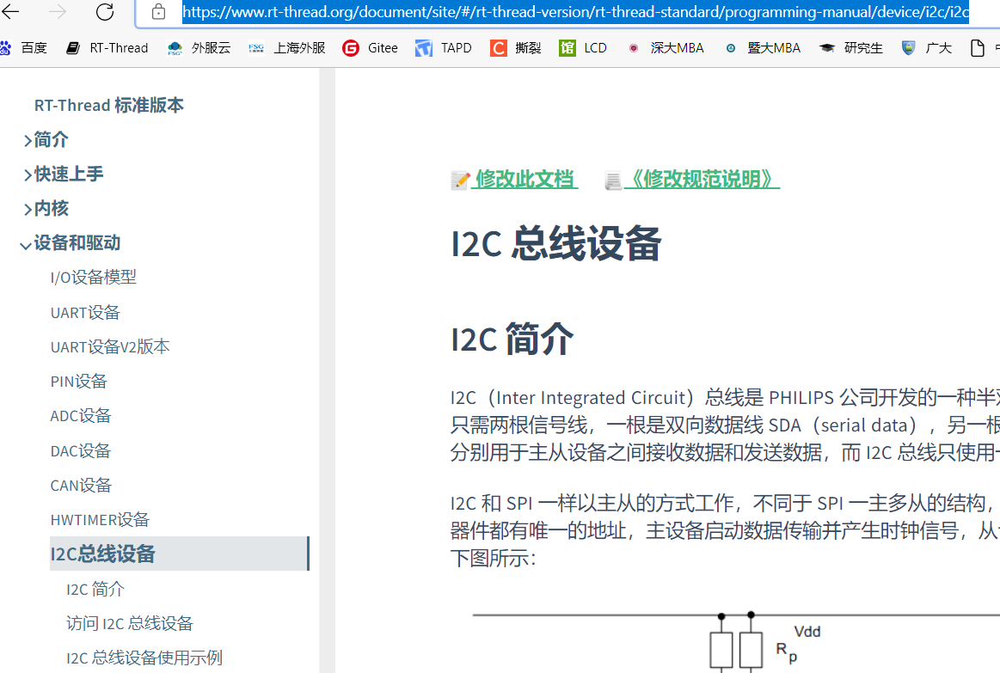
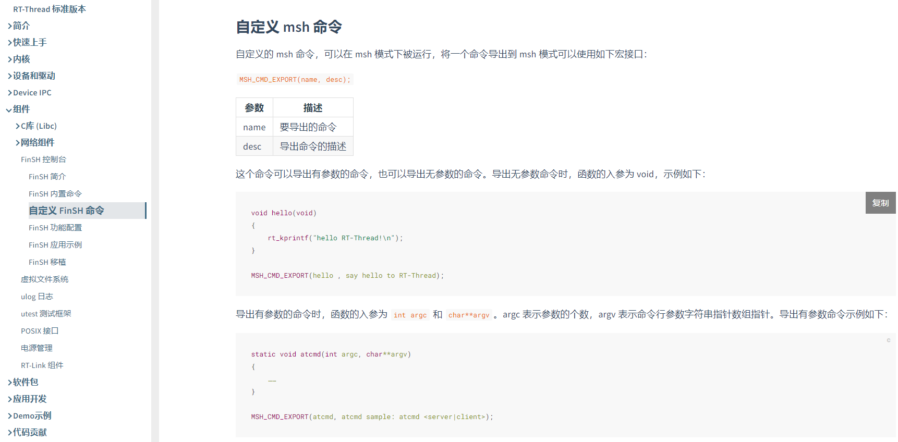
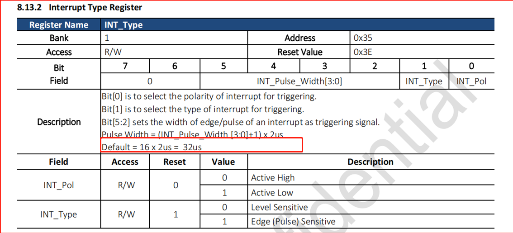

# 2 Common Issues in Sensor Debugging
## 2.1 Adding a Gsensor Driver Method on I2C5 in Lcpu
a, Please create a directory under `SDK\rtos\rtthread\bsp\sifli\peripherals\` by referring to other Gsensor directories, for example:
Copy and create the directory: `stk8321`, and modify the `SConscript` file in the corresponding directory to:
```python
group = DefineGroup('Drivers', src, depend = ['ACC_USING_STK8321'], CPPPATH = CPPPATH),
```
The `ACC_USING_STK8321` macro depends on the Kconfig configuration in the `menuconfig` of lcpu. You need to refer to other peripherals for the addition.

b, In the `menuconfig` of the lcpu project, enable the Gsensor device and I2C5:
` → RTOS → On-chip Peripheral Drivers → Enable I2C BUS-> Enable I2C5 BUS`
To confirm the configuration is correct, check the `rtconfig.h` file in the corresponding project directory of lcpu to ensure it contains:
```c
#define ACC_USING_STK8321
#define STK8321_BUS_NAME "i2c5"
#define RT_USING_I2C
#define BSP_USING_I2C
#define BSP_USING_I2C4
```
c, Please confirm that the I2C configuration in `pinmux.c` is set to I2C function and pull-up state.
```c
    HAL_PIN_Set(PAD_PB43, I2C5_SCL, PIN_PULLUP, 0);               //i2c5
    HAL_PIN_Set(PAD_PB44, I2C5_SDA, PIN_PULLUP, 0);
```
d, The I2C peripheral has been encapsulated into a standard rt_thread I2C device. You can refer to the usage method of I2C devices on the rt_thread official website:
Refer to the I2C bus device documentation (rt-thread.org):
<br><br>
e, If the log from lcpu shows that the I2C cannot read the device ID,
Please troubleshoot in the following order:
Test the power supply and operating conditions of the I2C, including RESET, LDO_ON, etc.,
Use an oscilloscope or logic analyzer to check if the I2C read/write waveforms meet the device's expectations, if the I2C device address is correct, and if there is an ACK,
f, You can define custom msh commands to test if the Gsensor is working properly.
For details, refer to the rtthread official documentation: FinSH Console (rt-thread.org)
<br><br>

## 2.2 Sensor Cannot Trigger GPIO Interrupt After System Enters Sleep Mode
Root Cause:
The heart rate sensor provides a wake-up pulse width of up to 32us, which is a small pulse width. After the system enters sleep mode, using a 32k frequency, AON cannot guarantee stable detection.
<br><br>
Solution:
Modify the peripheral registers or firmware to ensure the interrupt pulse width is greater than the clock period. Under the RC10K oscillator, the pulse width should be at least 125us. Refer to the common FAQ interrupt section.