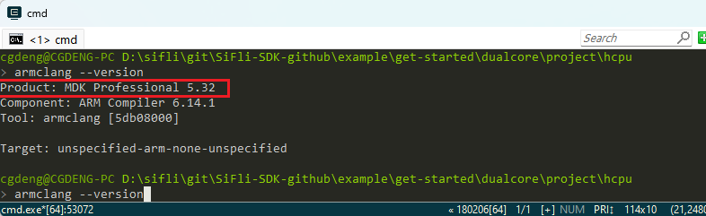

# 1 Compilation Related
## 1.1 How to Disassemble axf Files to asm Assembly or bin Files
Use the `fromelf.exe` tool from Keil to place the axf file that needs to be disassembled in `C:\Keil_v5\ARM\ARMCC\bin`,
then enter the following commands in the cmd window:
```
c:\Keil_v5\ARM\ARMCC\bin\fromelf.exe lcpu_rom.axf --text -c >lcpu_rom.asm
c:\Keil_v5\ARM\ARMCC\bin\fromelf.exe hcpu.axf --text -c >hcpu.asm
```
To output a bin file from the axf file:
```
c:\Keil_v5\ARM\ARMCC\bin\fromelf.exe --bin --output=./lcpuaxf.bin ./lcpu.axf
```
## 1.2 Supported Compilers and Versions
Keil, recommended version:
<br>
GCC, recommended version:
<br>
## 1.3 Default Lcpu Project Path in the SDK
Please refer to the screenshot during compilation, which shows a copy operation:
<br>
The file `..\..\..\rom_bin\lcpu_general_ble_img\lcpu_lb551.c` is compiled from the project `sdk\example\ble\lcpu_general\project\ec-lb551`.
The specific code copy operations are performed in the `prebuild.bat` batch file before compilation and the `postbuild.bat` batch file after compilation in the corresponding project directory.
<br>
<br>
`scons --target=mdk5` will run the following:
<br>
When compiling with Keil, the following prompt appears:
<br>
The batch file configurations for pre- and post-compilation with Keil are detailed in issue 2.3.1.
## 1.4 How to Prevent Unused Global Variables from Being Optimized
To facilitate debugging, certain values are placed in global variables for easy viewing. However, unused variables may be optimized.
To prevent this, add the `volatile` keyword before the variable definition, as follows:
```
volatile uint32_t flash_dev_id=0xffffffff;
```
## 1.5 How to Resolve Compilation Issues Caused by Windows TMP Directory Files
Sometimes, when compiling a project, issues may arise with the bootloader or other components on certain Windows PCs.
In such cases, check if the issue is due to cache files in the Windows temporary directory. You can clear the contents of the temporary directory by using the command line: "echo %TMP%", and then delete all files and directories in the corresponding path.
## 1.6 Common Compilation Errors
(1) The code size of this image (xxx bytes) exceeds the maximum allowed for this version of the linker. How to resolve?
When this error occurs, check if the Keil license is valid.
## 1.7 How to Force a Function to Not Be Inlined
When tracking code in Ozone, some functions may be inlined, causing the code to be displayed in assembly language, which is not convenient for tracking. To force a function to not be inlined, add the `__attribute__ ( (noinline) )` or `__NOINLINE` declaration before the function:
```c
#define __NOINLINE __attribute__ ( (noinline) )
```
For example:
```c
__attribute__ ( (noinline) ) uint8_t _pm_enter_sleep(struct rt_pm *pm)
```
## 1.8 How to Compile Source Files into a Lib
Some customers may need to keep their source code confidential or for other reasons, and prefer to provide a compiled lib file to their clients. The SDK provides an example for packaging source files into a lib in `example\misc\generate_lib`. For detailed instructions, refer to the `README.md` document in the project directory.