# 2 Jlink
## 2.1 How to Print Log Information Using JLINK RTT?
Currently, by default, the log of the Hcpu software is output from uart1 PA17/PA19 (SF32LB555), PA49/51 (SF32LB551)<br>
The log of the Lcpu is output from uart3,<br>
The customer only exposed uart3 PB45/PB46, or uart1 is occupied.<br>
Solution:<br>
Considering that uart3 is connected to the lcpu, and the lcpu also needs to output logs,
you can change the configuration to use SWD for log output via menuconfig.<br>
Method to modify Jlink SWD to print Hcpu logs:<br>
1) Navigate to the directory SDK\example\rt_driver\project\ec-lb555<br>
2) menuconfig -> Third party packages -> Select Segger RTT package
 <br>
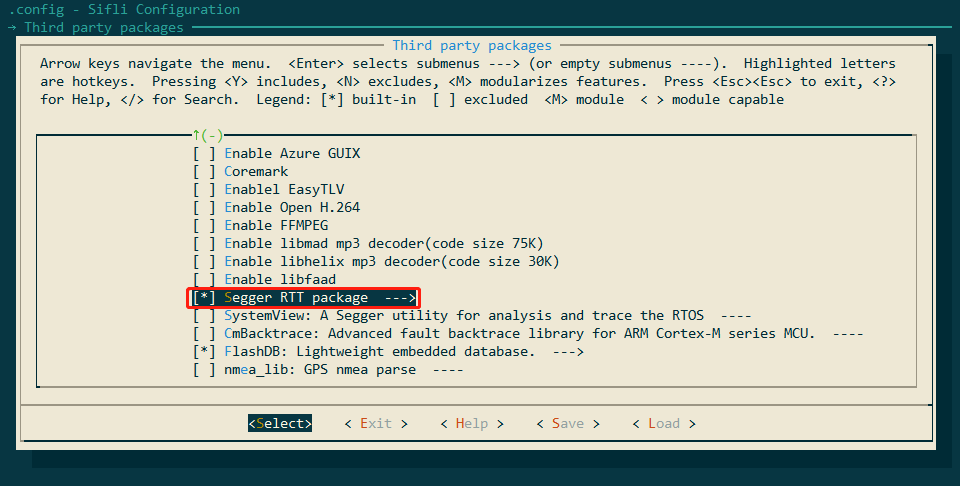<br>
3) menuconfig -> RTOS -> RT-Thread Kernel -> Kernel Device Object -> Change the device name for console to segger<br>
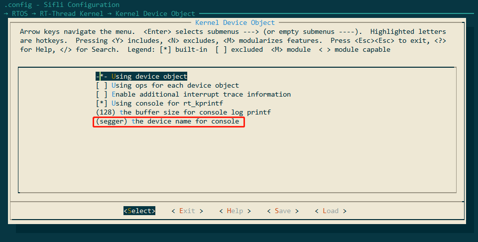<br> 
4) Connect the Jlink.
Method 1: Open C:\Program Files (x86)\SEGGER\JLink\jlink.exe -> connect ->? -> s -> default 4000kHz -> connection successful, as shown in the following figure:<br>
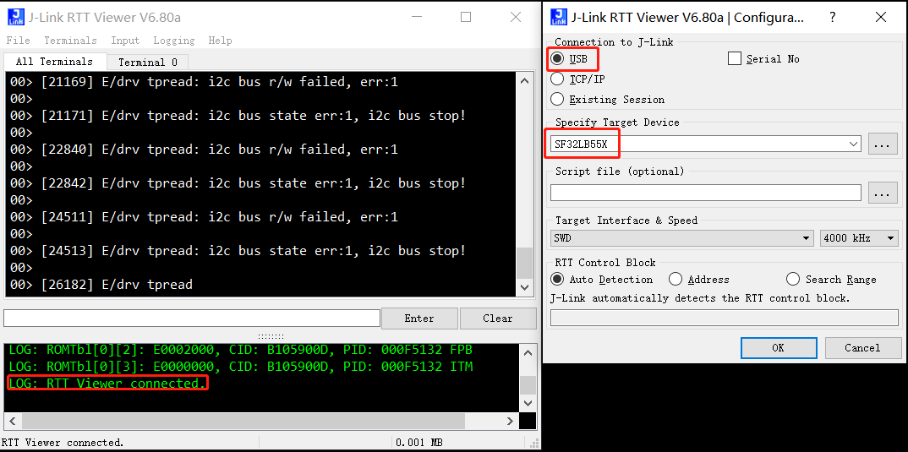<br> 
Method 2: Open C:\Program Files (x86)\SEGGER\JLink\JLinkRTTViewer.exe and configure the menu File -> Connect,
connection successful will show the following prompt: LOG: RTT Viewer connected.<br>
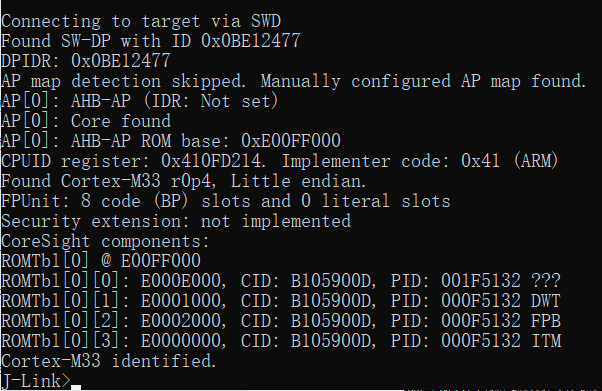<br> 
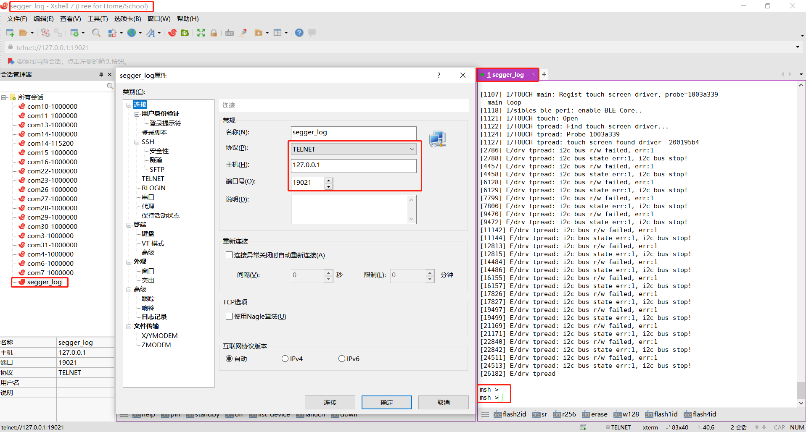<br>   
5) Run Xshell, SecureCRT, etc., and connect to the Jlink RTT viewer via telnet (hostname: 127.0.0.1 port: 19021) to view the logs; supports input and output, as shown in the following figure:<br>
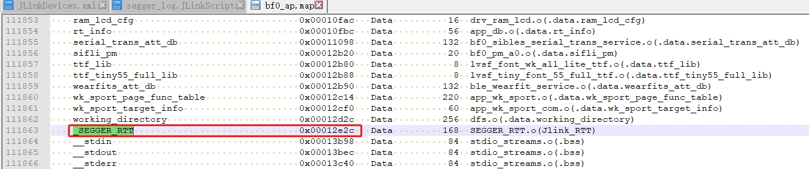<br> 
**Note** If the Hcpu wakes up from standby or restarts, you need to reconnect the Jlink RTT viewer.<br>
If the above configuration still does not work, refer to #2.2 for troubleshooting.
## 2.2 Hcpu Log Not Printed via Jlink Segger
Root cause:<br>
In the new version of the SDK, to optimize memory, the Jlink Control block address: _SEGGER_RTT variable was moved from HPSYS SRAM 0x20000000 to the memory region HPSYS ITCM RAM 0x00010000 0x0001FFFF 64*1024, as shown in the following figure:<br>
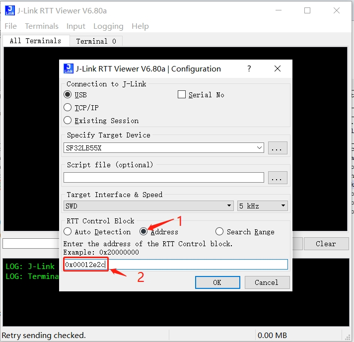<br>  
By default, Jlink searches memory starting from 0x20000000, so it cannot find the address, and the connection fails.<br>
In the old version 0.9.7, the compiled address was after 0x20000000, and Jlink could automatically connect and find it.<br>
Solution 1:<br>
Specify the address in J-Link RTT Viewer.exe, which can be found in the map file, as shown in the following figure:<br>
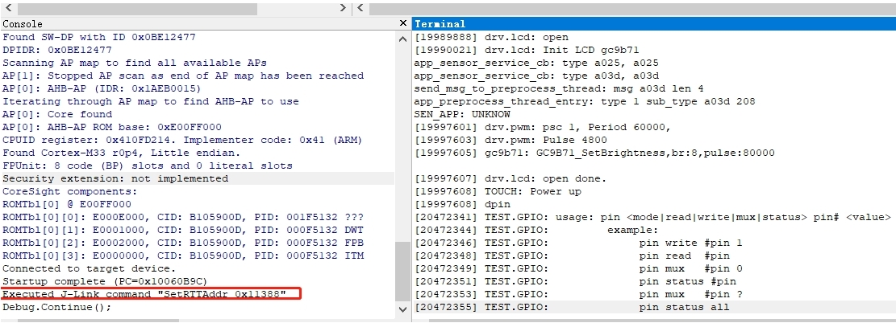<br> 
Solution 2:<br>
Use Ozone.exe, which can find the address in the axf file, as shown in the following figure, with the SetRTTAddr address command:<br>
<br>  
Solution 3:<br>
Create a JLinkScript command to automatically set or search for the Control block address range when Jlink starts, as shown in the following command:<br>
You can modify and choose as needed:<br>
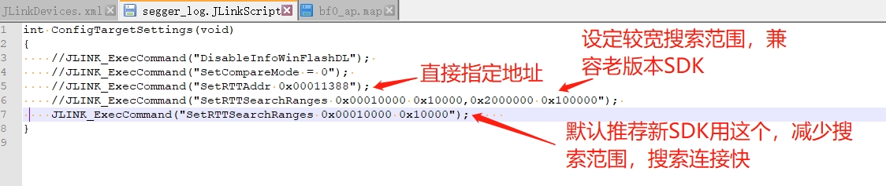<br>  
Corresponding: xml file modification:<br>
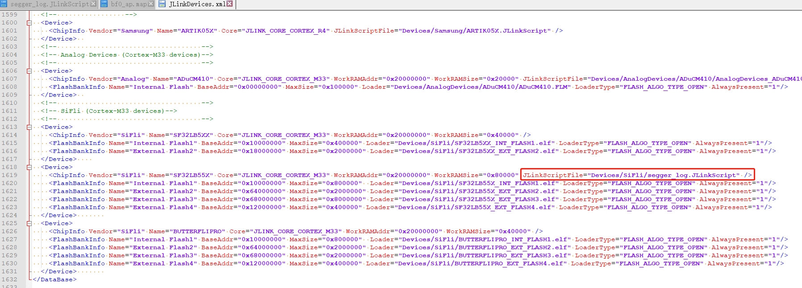<br>  
JLink.exe, J-Link RTT Viewer.exe, and others can still connect automatically as before, making it much more convenient.<br>
Recommended to use rttview.exe and telnet 127.0.0.1 to view logs!
The patch file is attached, copy it to the corresponding Jlink installation directory:<br>
Program Files (x86).7z

## 2.3 Jlink Read and Write Flash Content
1) After successfully connecting with Jlink, use mem32 to read, w4 to write, and erase to erase and write
```
mem32 0x40014000 1 # read 1 32-bit register value
mem32 0x64000000 10 # read 10 bytes starting from flash2 address 0x64000000
w4 0x64000000 0x2f 0x2f 0x2f 0x2f 0x2f 0x2f # write memory or register values starting from flash2 address 0x64000000, write the subsequent data
```
1) Use jflash to read and write
In the same directory as jlink.exe, there is a jflash tool, as shown in the menu below to read flash content,
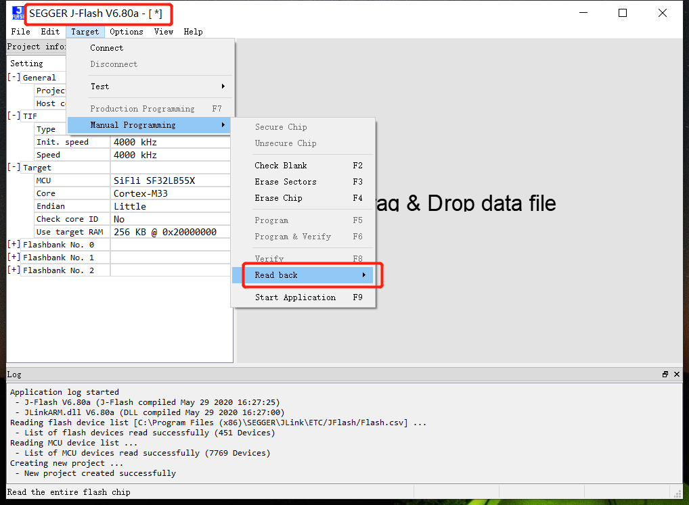<br>  
1) Use savebin command to read
```
savebin d:\1.bin 0x101b4000 0x100000 
```
As shown above, 0x101b4000 is the memory address, and 0x100000 is the read/write memory size in bytes.
To save the bin and then reprogram it:
```
loadbin  d:\1.bin 0x101b4000
```
## 2.4 Other Common Jlink Commands
1) halt, go commands
Entering the command h will stop the CPU and allow you to check the position of the PC pointer
Entering the command g will resume the CPU's operation,
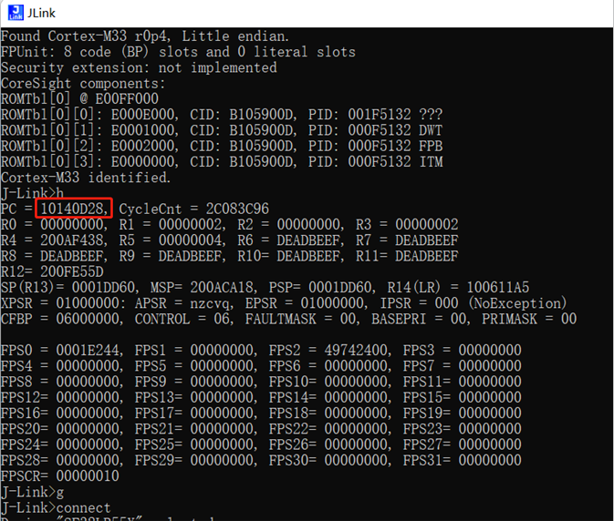<br>  
1) Set the PC pointer
Often used in conjunction with the __asm("B ."); instruction. When the code executes this instruction, it will pause.
As shown in the figure, if the PC pointer is at 0x10140D28, adding 2 to the PC pointer and entering setpc 0x10140D2A will skip the __asm("B ."); instruction and continue running.
1) Other commands
erase 0x00000000.0x0000FFFF
loadbin <filename> <address> -- download the filename file to the address
usb--------connect to the target board
r---------reset the target board
halt-------stop the program running on the CPU
loadbin----load an executable binary file
g-------jump to the code segment address and execute
s-------single-step execution (for debugging)
setpc-----set the value of the PC register (for debugging)
setbp-----set a breakpoint, after the breakpoint stops, you can continue running with the g command
Regs-------read the register organization
wreg-------write to a register
mem--------read memory
w4--------write memory
## 2.5 Connecting Jlink Using SiFliUsartServer Without SWD Port
After the 52 series, MCUs no longer have an SWD interface. If you want to debug using Jlink or Ozone, you can use the SiFliUsartServer.exe tool. The Jlink usage method is set as shown in the figure below:
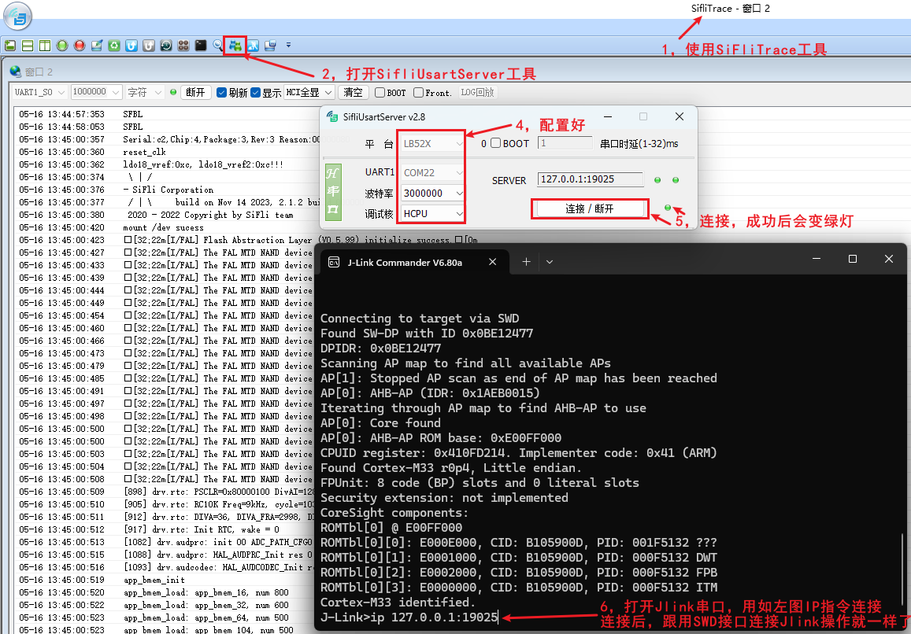<br>