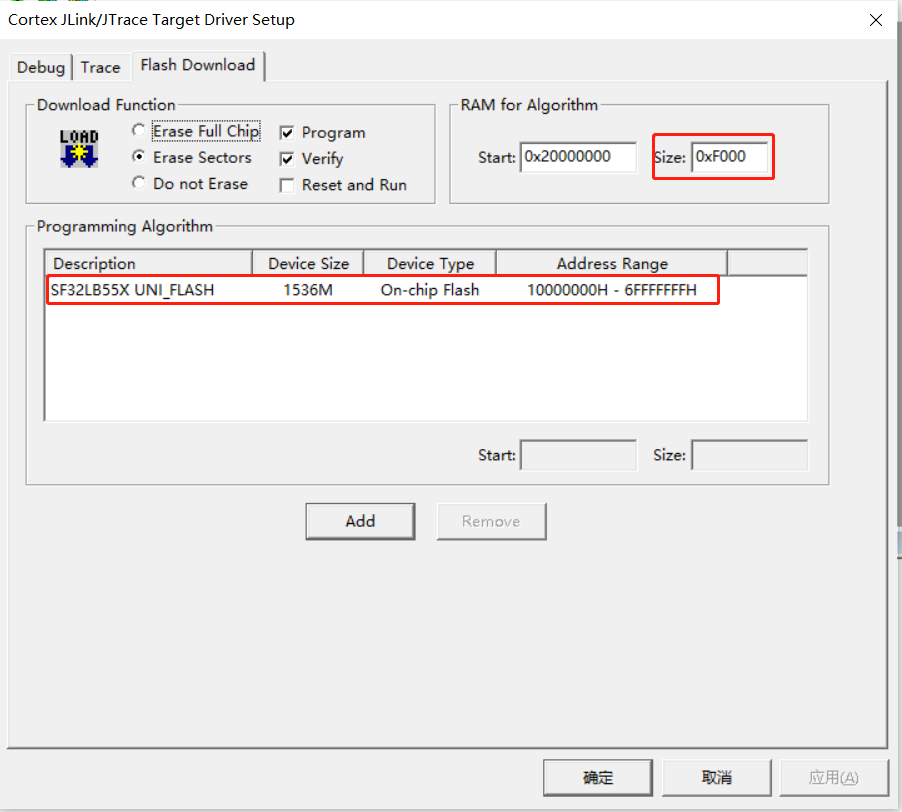
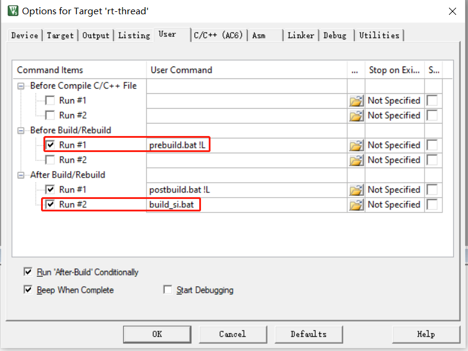

# 3 KEIL
## 3.1 Modify Configuration File
The `scons --target=mdk5` command generates the current `project.uvprojx` based on the project in `sdk\tools\build\template\template.uvprojx`. When you open `template.uvprojx` in KEIL, make your modifications, save, and exit, the next time you run the `scons --target=mdk5` command, it will default to the modifications made in `template.uvprojx`.  
Using this correctly can reduce repetitive work and improve efficiency.  
Recommended Modification 1:  
  
Recommended Modification 2:  
Customize pre-build and post-build batch operations, which commonly include:  
1) Copying `lcpu_img.c` in the `prebuil.bat` batch file,  
2) Disassembling the `axf` file into an `asm` assembly file,  
