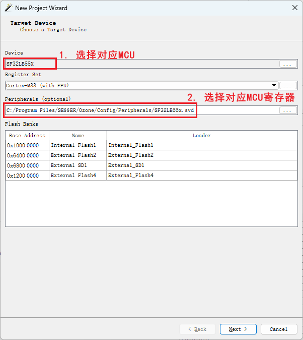
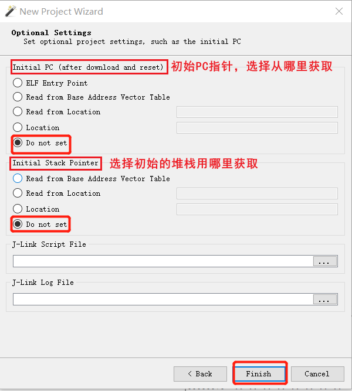

# 4 Ozone
## 4.1 Ozone Download and Configuration Method
1. Download Ozone<br>
You can download it directly from the Segger company website. If you are using a Windows system, choose the Windows version. You can select the latest version of Ozone.
<br> 
Segger's online debugging tool download address<br>
[Ozone - The J-Link Debugger Windows 64-bit Installer](https://www.segger.cn/downloads/jlink/#Ozone) [[Debugging Hang Method](../tools/ozone.md#43Ozone Single-step Debugging Debug)]<br>
**Note:**<br>
After version V7.6, higher versions of Ozone and J-Link have checks for counterfeit J-Link debuggers. For developers using it for learning purposes, we recommend [Ozone_Windows_V320d_x64.exe](https://www.segger.cn/downloads/jlink/Ozone_Windows_V320d_x64.exe) and [JLink_Windows_V758a_x86_64.exe](https://www.segger.cn/downloads/jlink/JLink_Windows_V758a_x86_64.exe)
 2. Configure Device, MCU Peripheral Registers, and RT-Thread OS Script<br> 
 A. Replace the `SiFli-SDK\tools\flash\jlink_drv\JLinkDevices.xml` file with the Ozone configuration file `C:\Users\yourname\AppData\Roaming\SEGGER\JLinkDevices\JLinkDevices.xml`. Additionally, in the directory `C:\Users\yourname\AppData\Roaming\SEGGER\JLinkDevices\Devices\`, create a directory named SiFli and copy the `SiFli-SDK-i\tools\flash\jlink_drv\sf32lb52x\SF32LB52X_*.elf` files into it. The corresponding directories and files are as follows:<br> 
 <br>
 The Jlink programming driver correspondence is found in the content of the JLinkDevices.xml file:<br>
 ```xml
<Device>
    <ChipInfo Vendor="SiFli" Name="SF32LB52X_NOR" Core="JLINK_CORE_CORTEX_M33" WorkRAMAddr="0x20000000" WorkRAMSize="0x60000" />
    <FlashBankInfo Name="Internal Flash1" BaseAddr="0x10000000" MaxSize="0x8000000"  Loader="Devices/SiFli/SF32LB52X_INT_FLASH1.elf" LoaderType="FLASH_ALGO_TYPE_OPEN" AlwaysPresent="1"/>
    <FlashBankInfo Name="External Flash2" BaseAddr="0x12000000" MaxSize="0x8000000" Loader="Devices/SiFli/SF32LB52X_EXT_FLASH2.elf" LoaderType="FLASH_ALGO_TYPE_OPEN" AlwaysPresent="1"/>
</Device>
 ```
 B. Copy the peripheral register configuration files `D:\sifli\git\SiFli-SDK-i\tools\svd_external\SF32LB52X\SF32LB52x.*` to the directory `C:\Program Files\SEGGER\Ozone\Config\Peripherals`;<br> 
 C. Copy the `SiFli-SDK\tools\segger\RtThreadOSPlugin.js` file to the directory `C:\Program Files\SEGGER\Ozone\Plugins\OS\`. The corresponding directories and files are as follows:<br> 
<br> 
 After configuring items A/B/C, when you open Ozone, you can select the required Devices and MCU peripheral registers<br> 
<br>

After configuring the MCU peripheral registers and the RT-Thread OS script, enter the Ozone interface to view the corresponding MCU peripheral registers and OS threads.<br>
<br>
## 4.2 Ozone Debug Connection Failure
Prompt:<br>
<br>
You need to add the flash driver and XML configuration file as you would for J-Link, so that Ozone supports the SF32LB55X chip.<br>
```xml
C:\Program Files\SEGGER\Ozone\Devices\SiFli\SF32LB55X****.elf
C:\Program Files\SEGGER\Ozone\JLinkDevices.xml
# The paths for different J-Link or Ozone versions may be as follows:
C:\Users\yourname\AppData\Roaming\SEGGER\JLinkDevices.xml
C:\Users\yourname\AppData\Roaming\SEGGER\JLinkDevices\Devices\SF32LB55X****.elf
```
<a name="43Ozone单步调试Debug"></a>
## 4.3 Ozone Step-by-Step Debugging
1. By default, J-Link connects to the HCPU. If you are debugging the HCPU, you can skip this step and directly debug the HCPU. If you need to debug the LCPU, you can execute the batch file `SDK\tools\segger\jlink_lcpu_a0.bat` (55), `jlink_lcpu_pro.bat` (58), or `jlink_lcpu_56x.bat` (56) in the Windows command prompt. The batch file executes the following commands in `\tools\segger\jlink_lcpu_xxx.jlink`:
```
w4 0x4004f000 1
connect
w4 0x40070000 0 
exit
```
You can also enter these commands sequentially in the J-Link window to switch to the LCPU.<br>
<br>
Alternatively, you can write to the registers in the code to switch the SWD J-Link to the LCPU for debugging.<br>
2. Now, using 55 as an example, we will demonstrate step-by-step debugging of the LCPU. First, create a new project.<br>
<br>
3. Select the debugging chip. If it is not found, you need to add the 55x chip model configuration to:
`C:\Program Files\SEGGER\Ozone\JLinkDevices.xml`
and the four flash programming files to:
`C:\Program Files\SEGGER\Ozone\Devices\SiFli\SF32LB55X_****.elf`<br>
<br>
4. Select the J-Link device connected to the PC. If it is not found, check the J-Link connection and power supply.<br>
5. Select the compiled `*.axf` or `*.elf` file. For the `watch_demo` project, the LCPU `axf` path is:
```
\release\example\rom_bin\lcpu_general_ble_img\lcpu_general_551.axf
```
<br>
6. Select the J-Link or the IP address virtualized by `SifliUsartServer.exe`. By default, UART is used for debugging, and `SifliUsartServer.exe` must be connected to use the IP `127.0.0.1:19025`.<br>
<br>
52 defaults to UART as the debugging port, which requires `SifliUsartServer.exe` to connect using the IP `127.0.0.1:19025`.<br>
<br>
7. The next step is to choose where to get the initial PC pointer and stack. You can choose the default or the "Do not set" option, then finish.<br>
<br>
8. "Attach and Halt Program" connects J-Link to the LCPU and stops at the current PC pointer. "Attach and Run Program" connects J-Link to the LCPU and continues running the program from the current PC.<br>
<br>
9. After clicking the run program arrow icon, you can see that the LCPU is running step-by-step. You can add breakpoints, view stack information, and check the register status.<br>
<br>

## 4.4 Ozone Connection Dropout Issues
The connection often drops after a while, displaying the "Target Connection Lost" dialog box, and then the connection is lost.<br>
<br>
If you encounter this issue, before connecting Ozone for debugging, close the Memory window and other unnecessary windows in Ozone. These windows may read non-existent memory addresses or uninitialized PSRAM memory, causing the connection to drop.<br>
<br>
Ozone reads these memory contents during connection. If the read fails, the connection will drop.<br>

## 4.5 Enabling RTThread RTOS Online Debugging in Ozone
Copy the `sdk\tools\segger\RtThreadOSPlugin.js` file to the Ozone installation directory:
`C:\Program Files\SEGGER\Ozone\Plugins\OS\RtThreadOSPlugin.js`<br>
Open the file and follow the steps below to enable Ozone to switch RTThread threads for viewing and debugging.<br>
<br>
After connecting Ozone and enabling `Project.SetOSPlugin("RtThreadOSPlugin");`, the scene will look like this:<br>
<br>

## 4.6 Redefining File Paths in Ozone
When the bin file path is not locally compiled, using Ozone for debugging will prompt "File not found," making it impossible to locate the corresponding C source code and track issues line by line.<br>
<br>
Solution:
- For a single file not found: Right-click the file and use "Locate File" to navigate to the corresponding C source file.
- For incorrect base addresses of multiple files: Use the `Project.AddPathSubstitute` command to re-map the paths, for example, replacing the Linux path in the ELF file with a Windows path.<br>
