# 5 SiFli
## 5.1 Impeller Download Prompt Failure, Is There Any Configuration Missing?
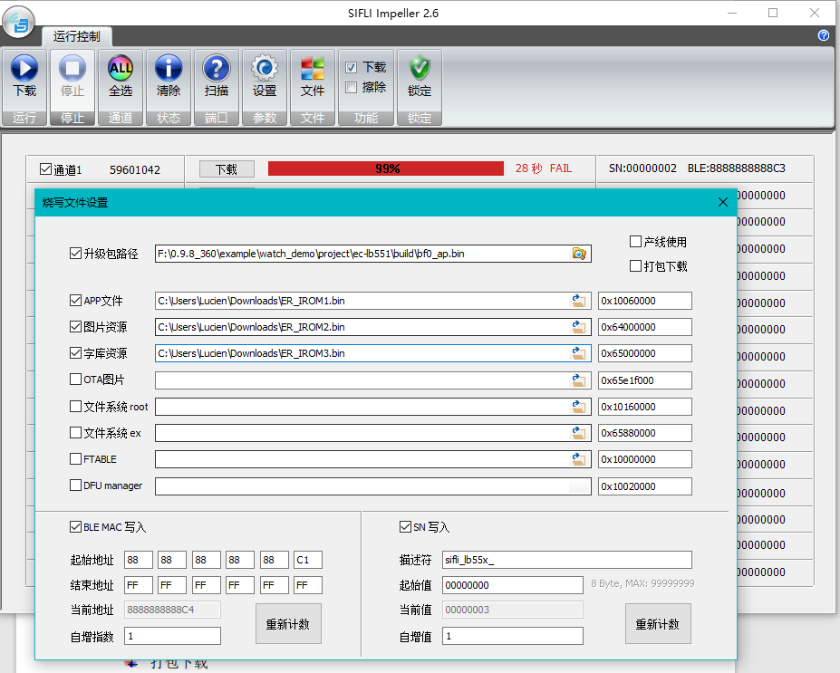<br>
Root Cause: 16M flash, the address specified for ER_IROM3 exceeds the 16M flash address range 0x00000-0xFFFFFF,<br> 
Solution: 1, Trim the watchdemo in the SDK to fit 16M flash as shown in the following figure:<br> 
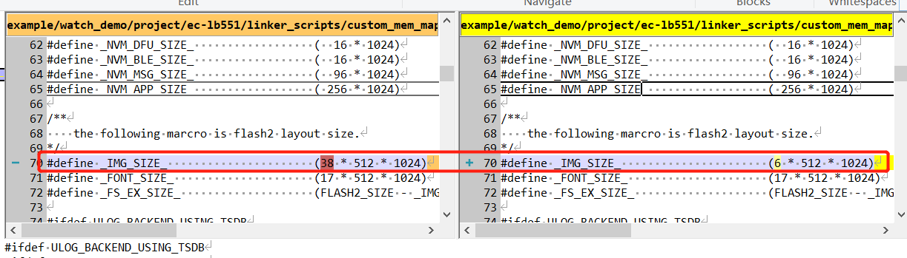<br> 
After compilation, find the download address from the hex file format as shown in the following figure:<br> 
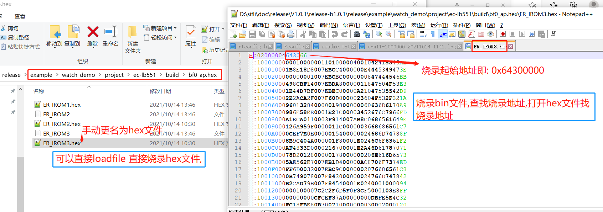<br> 
## 5.2 Solution: Double-Clicking butterfli.exe Fails to Open the Compilation Tool
a、Open the display settings on your PC or laptop and set the percentage to 100%. (Other resolution percentages may also work, but ensure that the butterfli.exe interface displays correctly)<br> 
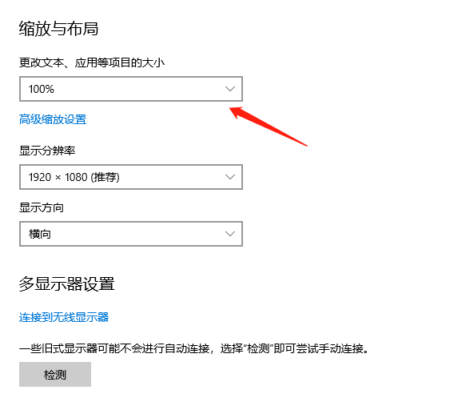<br> 
b、Ensure that the following option is enabled in Display --- Advanced Scaling Settings, otherwise, the page size may change, but some tools may still display at the original size, and butterfli.exe may still fail to open:<br> 
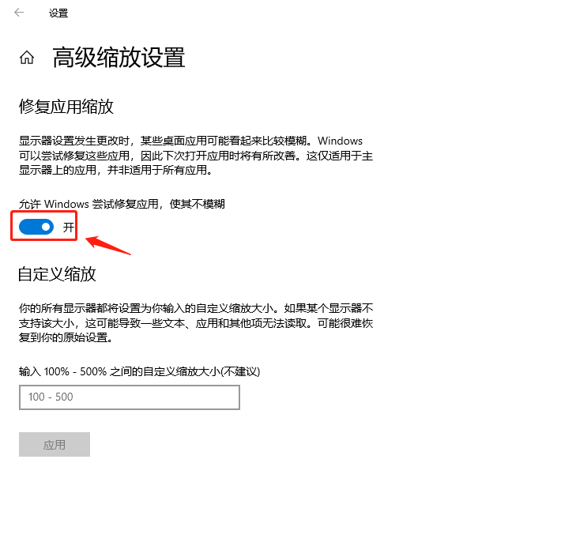<br> 
c、The normal butterfli.exe tool interface should look like the following. If there are display issues, adjust the resolution and display percentage.<br> 
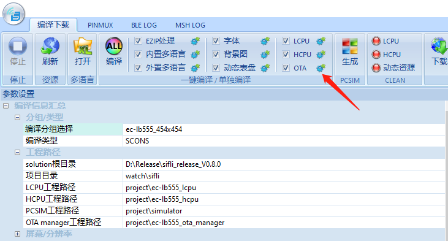<br> 
## 5.3 How to Use regop to Read and Write Register Values in the Console finsh Shell?
```
regop unlock 0000 # Need to unlock first
regop read 40070018 2  # Hexadecimal values should not have the 0x prefix
regop read 4007001c 1
regop write 40007100 200 # Hexadecimal values should not have the 0x prefix
```
## 5.4 Method to Check if the 48M Crystal Has Been Calibrated
1, In the hcpu serial command line, input the `crystal_get` command. If it returns a non-zero or non-0xFF value, it indicates that the board has been calibrated, as shown in the following figure:<br> 
<br>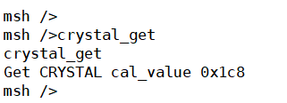<br>
If it has not been calibrated, it returns the following:<br> 
```
msh />crystal_get
FACTORY_CFG_ID_CRYSTAL read fail with 0
```
Corresponding code:
```c
int32_t crystal_get(int32_t argc, char **argv)
{
    int res;
    uint32_t cal_value;

    res = rt_flash_config_read(FACTORY_CFG_ID_CRYSTAL, (uint8_t *)&cal_value, sizeof(cal_value));
    if (res <= 0)
    {
        rt_kprintf("FACTORY_CFG_ID_CRYSTAL read fail with %d\n", res);
        return -1;
    }
    else
    {
        rt_kprintf("Get CRYSTAL cal_value 0x%x\n", cal_value);
    }

    return 0;
}
MSH_CMD_EXPORT(crystal_get, crystal_get);
```
2, For the 56x series solution code, use `otp_factory_read` to read all OTP partition data, as shown in the following figure:<br> 
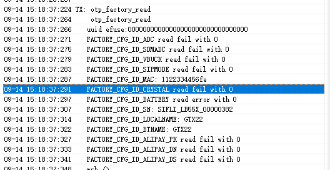<br> 


## 5.5 Method to Generate a Source Insight Project File List
1, After SDK v1.1.3, the `scons --target=si` command was added to generate a file list `si_filelist.txt` that only participates in compilation<br> 
In the compilation command that specifies `--board=em-lb525`, the board parameter needs to be added, as follows:<br> 
```
scons --target=si 
scons --board=em-lb525 --target=si 
```
2, After creating a new project in SourceInsight, you can choose `Menu: Project -> Add and Remove Project Files -> Add from list...` to import the generated `si_filelist.txt` into the project for easier code viewing<br> 
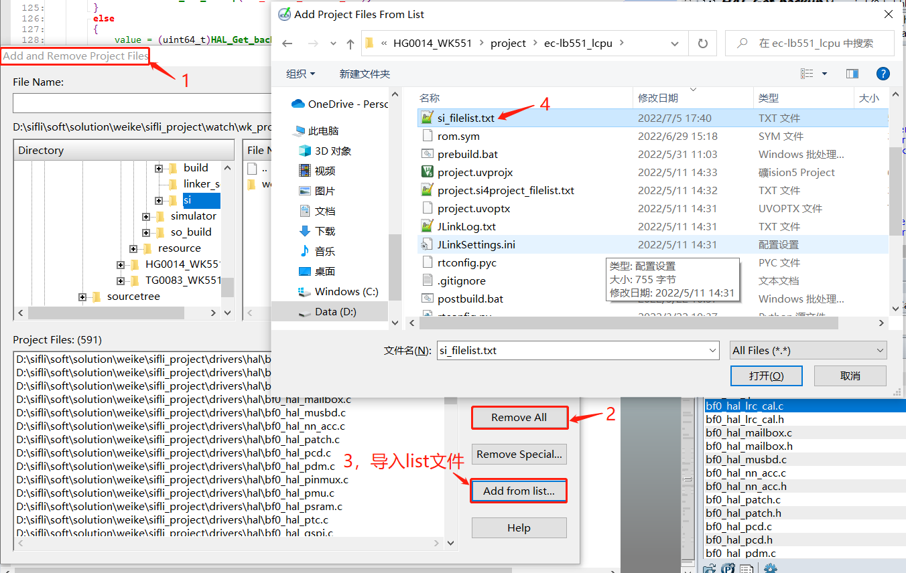<br> 
<a name="5655X查看芯片工厂校准区OTP"></a>
## 5.6 Method to View 55X Chip Factory Calibration Area OTP/Flash Data
1, This can be used to check if the ADC and crystal have been calibrated, if they have been overwritten, and to view the serial number, Bluetooth address, name, etc.<br> 
Below are the steps:<br> 
otp_debug_0922.7z<br> 
a, Ensure that JLink can connect to the sifli machine. If not, pull MODE high and reset the machine.<br> 
b, Run the test.bat batch command in otp_debug_0922.7z. This will program the factory_cali.bin file to RAM and jump to the RAM address to run, without affecting the original flash program.<br> 
c, Run JLinkRTTViewer.exe, select Auto Detection for the connection method, and input `help` to see the commands. Then you can input commands to read the chip OTP data.<br> 
d, `otp_read 0 1` /* This command reads all OTP data */<br>

Please follow the operation procedure below:<br> 
```
00> Serial:c2,Chip:1,Package:0,Rev:80
00>  \ | /
00> - SiFli Corporation
00>  / | \     build on Aug 18 2022, 1.1.1 build 4df1cb
00>  2020 - 2021 Copyright by SiFli team
00> debug: main thread run
00> msh >
  < help
00> help
00> RT-Thread shell commands:
00> list_mem         - list memory usage information
00> memcheck         - check memory data
00> memtrace         - dump memory trace information
00> pin              - pin gpio functions
00> uart             - uart setting
00> reboot           - Reboot System
00> regop            - Register read / write
00> pwr_ctrl         - BLE TX power adjust
00> crystal_cali     - crystal_cali 8 5 20(PB08 5ppm 20s)
00> crystal_cali_get - crystal_cali_get
00> crystal_cali_set - crystal_cali_set 0x1EA
00> otp_reset        - otp_reset 0
00> otp_read         - otp_read 0 1
00> battery_get      - battery_get
00> battery_r_set    - battery_r_set 1000 220
00> battery_cali_set - battery_cali_set 10000 0
00> battery_cali_get - battery_cali_get
00> battery_cali     - battery_cali 4000 400 10 1000 220(4000mV +-400mV +-10mv 1000k 220k)
00> efuse_uid_read   - efuse_uid_read
00> otp_fwenc_read   - otp_fwenc_read
00> fw_enc_wr        - fw_enc_wr
00> hcpu_jump_run    - hcpu_jump_run addr (eg: hcpu_jump_run 0x10020000)
00> lcpu             - forward lcpu command
00> sysinfo          - Show system information
00> adc              - adc function
00> version          - show RT - Thread version information
00> list_event       - list event in system
00> list_mailbox     - list mail box in system
00> list_msgqueue    - list message queue in system
00> list_memheap     - list memory heap in system
00> exit             - return to RT - Thread shell mode.
00> console          - Change MSH / FINSH console device.
00> help             - RT - Thread shell help.
00> time             - Execute command with time.
00> free             - Show the memory usage in the system.
00> 
00> msh >
  < otp_read 0 1
00> otp_read 0 1
00> READ otp addr 0x1000 with res 256
00> 0x06  0x04  0x0d  0x6b  0x07  0x06  0x04  0x04  
00> 0x9f  0x81  0xfb  0x82  0xff  0xff  0xff  0xff  
00> 0xff  0xff  0xff  0xff  0xff  0xff  0xff  0xff  
00> 0xff  0xff  0xff  0xff  0xff  0xff  0xff  0xff  
00> 0xff  0xff  0xff  0xff  0xff  0xff  0xff  0xff  
00> 0xff  0xff  0xff  0xff  
00> ULOG_WARN: trace loss 97,521
```
2, OTP Data Interpretation:<br>
The data in OTP is stored in TLV format (Tag-Length-Value), which means it is stored as ID + LEN + DATA.<br> 
The TLV format (Tag-Length-Value) is a common data serialization format, primarily used for encoding the payload of data packets or messages. The TLV format divides data into three main parts: Tag (label), Length (length), and Value (value).<br> 
a, The ID occupies one byte and is defined in the header file; LEN also occupies one byte, which limits the content of an ID to no more than 255 bytes;
DATA is the actual data, stored in the format defined by the ID, and OTP does not care about the actual data. <br> 
Each ID is tightly packed without any synchronization bytes, so queries must start from the beginning and search for each ID one by one.<br> 
b, When modifying existing ID data, you must start from the beginning, find the corresponding ID, check the length, and if the new length is the same as the previous length, the data is saved in the same position.
If the length changes, the subsequent ID data is moved forward, and the modified ID is placed at the end.<br> 
```c
#define FACTORY_CFG_ID_INVALID          0       /*!< Invalid ID */
#define FACTORY_CFG_ID_MAC              1       /*!< BLE MAC address */
#define FACTORY_CFG_ID_SN               2       /*!< Serial Number */
#define FACTORY_CFG_ID_CRYSTAL          3       /*!< Crystal tuning information */
#define FACTORY_CFG_ID_ADC              4       /*!< ADC tuning information*/
#define FACTORY_CFG_ID_SDMADC           5       /*!< SDMADC tuning information*/
#define FACTORY_CFG_ID_VBUCK            6       /*!< VBUCK /LDO information*/
#define FACTORY_CFG_ID_SECCODE          7       /*!< Security Code or something like this*/
#define FACTORY_CFG_ID_LOCALNAME        8       /*!< BLE localname*/
#define FACTORY_CFG_ID_BATTERY          9       /*!< Battery verify value*/
#define FACTORY_CFG_ID_FWVERIFY         10      /*!< FW verify code generated based in uid*/
#define FACTORY_CFG_ID_ALIPAY_PK        11      /*!< for alipay product key  code*/
#define FACTORY_CFG_ID_ALIPAY_DN        12      /*!< for alipay device name code*/
#define FACTORY_CFG_ID_ALIPAY_DS        13      /*!< for alipay device secret code*/
#define FACTORY_CFG_ID_UNINIT           0xFF    /*!< Uninitialized ID */
```
The following is the interpretation of the figure:<br> 
The red box ID: 0x06 is FACTORY_CFG_ID_VBUCK, the data length 0x04 is the length of the data, and the following 0x0d, 0x6b, 0x05, 0x06 are the data.<br> 
The blue box ID is 0x04, corresponding to ADC calibration data, which is saved by ATE before the chip leaves the factory. ID 0x09 is the battery calibration data saved during the second calibration on the production line (not shown in the figure), and these two are used together when calculating the battery voltage.<br> 
The green box ID is 0x03, which is the crystal calibration data.<br> 
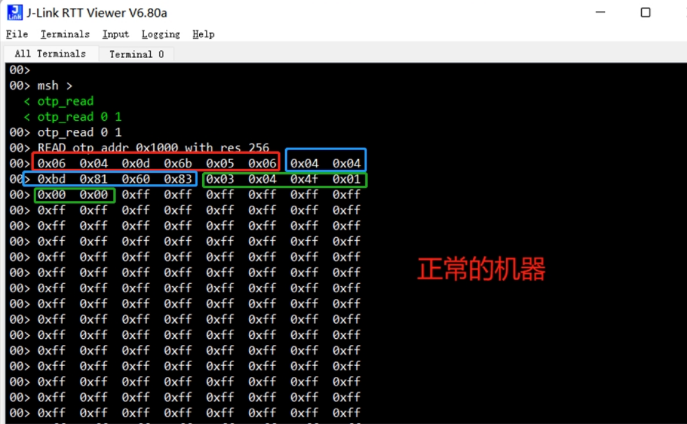<br>  
The following is an example of problematic OTP data:<br> 
As shown in the figure, only the data with ID=0x07 is present, and the other ADC calibration and crystal calibration data have been overwritten.<br> 
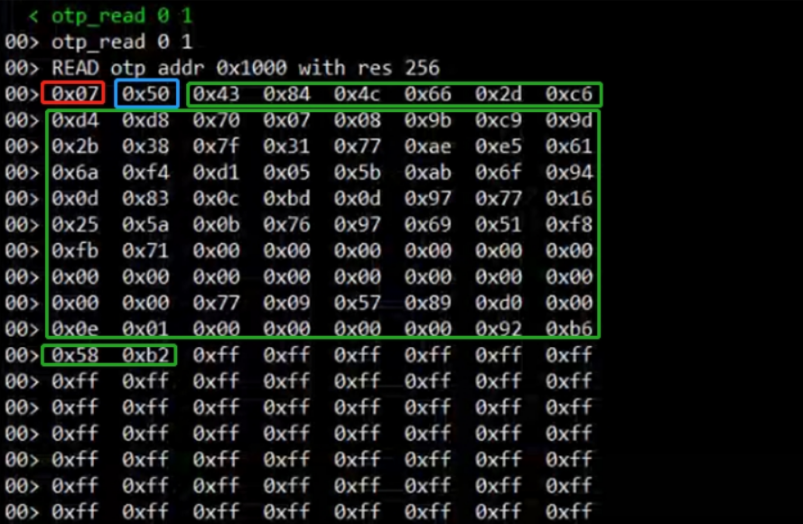<br>   
## 5.7 Method to Check if the 52X Chip is Calibrated
The AON_BG register of the PMU will be updated from the EFUSE during software initialization. If this register is not the default value 0x18, it can be considered that the chip has been calibrated. The specific method is as follows:<br> 
1, After normal startup, the code executes to BSP_System_Efuse_Config();<br> 
2, Use the jlink.exe command `mem32 0x500ca000 20`<br> 
Check the value of the 0x24 register:<br> 
As shown below, the 0x500ca024 register is 0x39, which is not the default 0x18, proving that it has been calibrated.<br> 
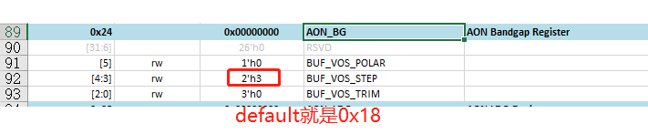<br>   
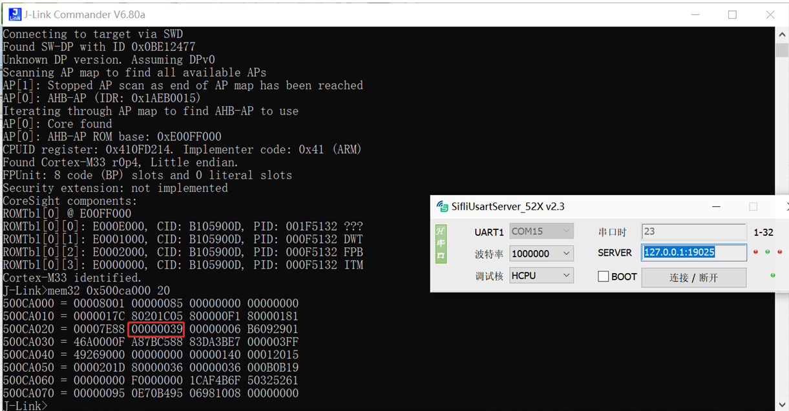<br>   
<a name="Mark_Dump Memory Method"></a>
## 5.8 Dump Memory Method
## 5.8.1 Method to Dump Memory via Serial Port for 52x, 56x
Open the `sdk\tools\crash_dump_analyser\script` directory, execute AssertDumpUart.exe, select the path to save the bin file, memory configuration, chip model (supports 52x, 56x), serial port, click export, and start saving the memory content as a bin file,
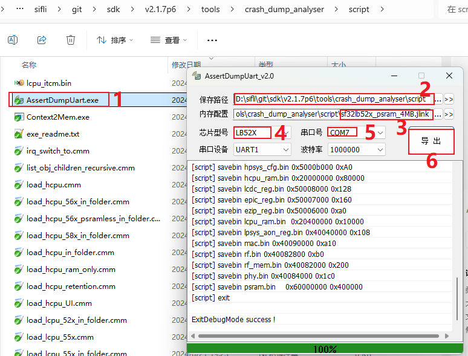<br>   
After a successful prompt, place all generated *.bin, *.txt, and the axf file generated by the compilation in one directory, then use the Trace32 tool for analysis.
## 5.8.2 Method to Dump Memory via JLink for 55x, 56x, 58x
Open the `sdk\tools\crash_dump_analyser\script` directory, as shown in the figure, the *.bat files are the corresponding dump batch commands, which can be opened with a text editor to see the specific operations.
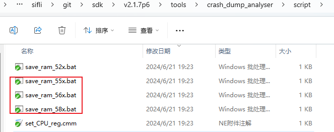<br>   
These three batch files all use jlink for dumping. When jlink can connect to the device, the corresponding *.bat file for the memory to be dumped can be executed, for example: save_ram_55x.bat opens to the following content:
```
JLink.exe -Device CORTEX-M33 -CommanderScript sf32lb55x.jlink >log.txt
```
After connecting jlink, it will call a series of commands in sf32lb55x.jlink (which can be opened and edited) to save the registers and memory as bin files, and the log of the dump process will be saved in log.txt. If the dump fails, the failure reason can be checked by opening log.txt.<br> 
After completion, the `*.bin, *.txt` files will be generated in the directory of the *.bat file. Place all `*.bin, *.txt`, and the axf files generated by the compilation of `hcpu/lcpu/bootloader` in one directory, then use the Trace32 tool for analysis.