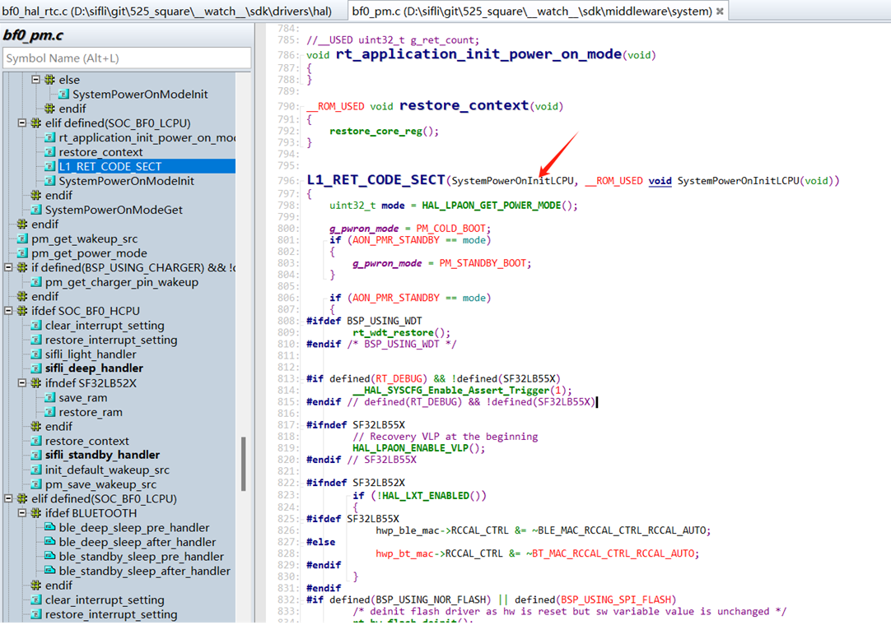
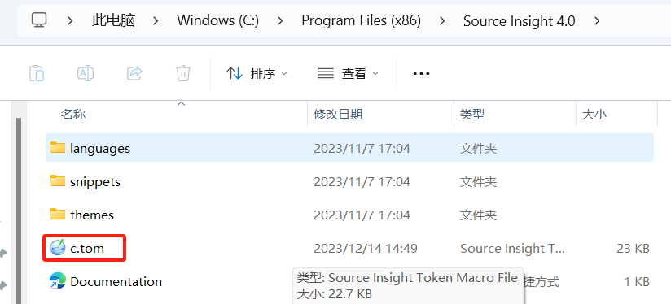
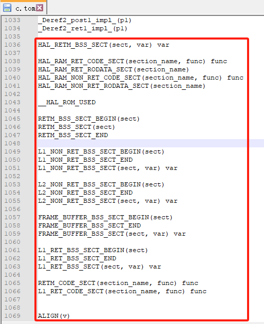
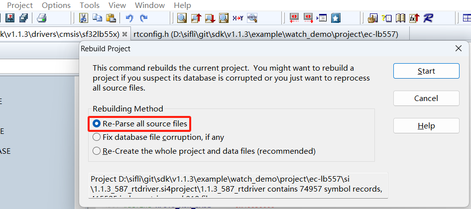

# 9 Source Insight Related

## 9.1 Source Insight Partial Symbol Parsing Issue
As shown in the figure below, functions cannot be recognized, making code search and browsing inconvenient.
<br><br>  
Solution:<br>
1. Modify the file c.tom located in the Source Insight installation directory: C:\Program Files (x86)\Source Insight 4.0\c.tom
<br><br>   
2. Add the following macro definitions at the end of the file
<br><br>  
```c 
HAL_RETM_BSS_SECT(sect, var) var
HAL_RAM_RET_CODE_SECT(section_name, func) func
HAL_RAM_RET_RODATA_SECT(section_name)
HAL_RAM_NON_RET_CODE_SECT(section_name, func) func
HAL_RAM_NON_RET_RODATA_SECT(section_name)
__HAL_ROM_USED
RETM_BSS_SECT_BEGIN(sect)
RETM_BSS_SECT(sect)
RETM_BSS_SECT_END
L1_NON_RET_BSS_SECT_BEGIN(sect)
L1_NON_RET_BSS_SECT_END
L1_NON_RET_BSS_SECT(sect, var) var
L2_NON_RET_BSS_SECT_BEGIN(sect)
L2_NON_RET_BSS_SECT_END
L2_NON_RET_BSS_SECT(sect, var) var
FRAME_BUFFER_BSS_SECT_BEGIN(sect)
FRAME_BUFFER_BSS_SECT_END
FRAME_BUFFER_BSS_SECT(sect, var) var
L1_RET_BSS_SECT_BEGIN(sect)
L1_RET_BSS_SECT_END
L1_RET_BSS_SECT(sect, var) var
RETM_CODE_SECT(section_name, func) func
L1_RET_CODE_SECT(section_name, func) func
ALIGN(v)
```
3. To take effect:<br>
a. Restart Source Insight,<br>
b. Close all files via menu: File->Close All<br>
c. Re-parse all files in the project<br>
<br><br>  
