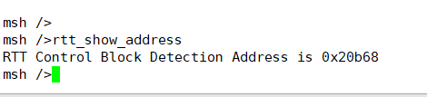
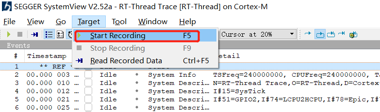
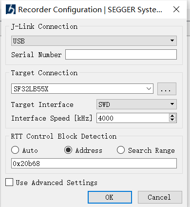
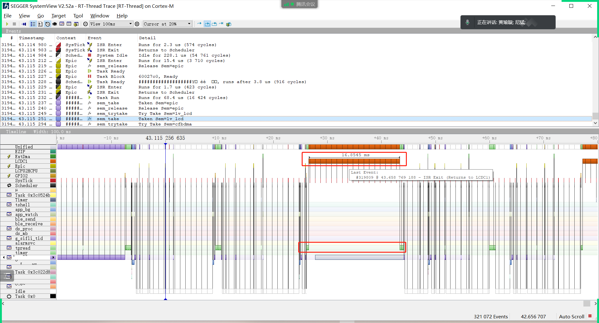
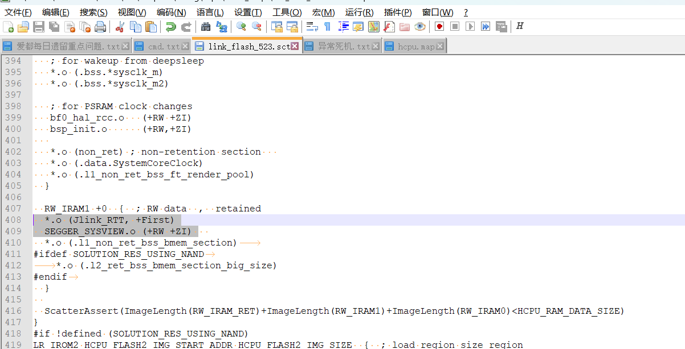

# 7 SystemView
## 7.1 What Issues Can SystemView Analyze?
SystemView is a visualization and analysis tool. As the performance of MCUs continues to improve and the functions of embedded products become increasingly complex, new challenges arise in system debugging and analysis. Debugging a specific function or issue often requires a significant amount of effort. SystemView is a powerful tool that helps users debug and analyze their systems, significantly reducing development and debugging time and improving development efficiency.<br>  RT-Thread provides the SystemView tool for system debugging and analysis.<br> 
This tool can provide detailed insights into each thread and each interrupt, showing the CPU time they occupy. It is particularly useful for identifying CPU resource bottlenecks. Here are two examples of issues identified using SystemView:<br> 
1. Occasional tearing in LCD image display. SystemView identified that the issue was caused by the interruption being disabled during Flash read/write operations, leading to a frame of data being split into two frames due to the disabled interrupt.<br> 
2. The I2C data transmission of the TP was interrupted for 16ms. SystemView identified that this 16ms delay was due to the LCD controller (LCDC) interrupt being active during two data transmissions, causing the interrupt routine to run for an extended period.<br> 
For more details, refer to the RT-Thread official documentation:<br> 
[SystemView Analysis Tool (rt-thread.org)](https://www.rt-thread.org/document/site/#/rt-thread-version/rt-thread-standard/application-note/debug/systemview/an0009-systemview?id=systemview-%e4%bd%bf%e7%94%a8%e6%8c%87%e5%8d%97):

## 7.2 How to Enable SystemView
1. SDK Configuration: Hcpu's menuconfig → Third party packages → SystemView: A Segger utility for analysis and trace the RTOS. Use default settings for all other configurations.<br> 
2. Enter the command `rtt_show_address` in the Hcpu serial console to get the address of the RTT Control Block, as shown in the following figure:
<br><br> 
3. Open the SystemView.exe software, go to Menu → Target → Start Recording,
<br><br>  
4. Select the options and enter the address obtained in step 2.
<br><br>  
5. After starting the recording, you will see the following window:
<br><br>  
6. Add Segger print to the SystemView serial port by adding the following code in the SDK:
```
extern void SEGGER_SYSVIEW_Print(const char* s);
SEGGER_SYSVIEW_Print("A");
```
For more usage, refer to the RT-Thread official documentation or the documents in the DOC directory.

## 7.3 How to Enable SystemView on 52X
Refer to section ## 7.2. For 52X, the default is UART_DGB, and using SifliUsartServer.exe to convert jlink is very slow and cannot connect to SystemView normally. Therefore, PA18 and PA19 need to be configured as jlink interface mode. Modify as follows:<br> 
1. In the `bsp_pinmux.c` file, in the `BSP_PIN_Init` function, configure PA18 and PA19 as jlink interface:
```
#if 0
    // UART1
    HAL_PIN_Set(PAD_PA19, USART1_TXD, PIN_PULLUP, 1);
    HAL_PIN_Set(PAD_PA18, USART1_RXD, PIN_PULLUP, 1);
#else
    //SWD
    HAL_PIN_Set(PAD_PA18, SWDIO, PIN_PULLDOWN, 1);
    HAL_PIN_Set(PAD_PA19, SWCLK, PIN_PULLDOWN, 1);
    HAL_PIN_SetMode(PAD_PA18, 1, PIN_DIGITAL_IO_PULLDOWN);
    HAL_PIN_SetMode(PAD_PA19, 1, PIN_DIGITAL_IO_PULLDOWN);
#endif 
```
2. Change the log print to jlink's Segger print in the hcpu.
3. You can search for the `_SEGGER_RTT` variable in the `bf0_ap.map` file of the compiled hcpu project:
```
_SEGGER_RTT     0x603c3258   Data    168  SEGGER_RTT.o(Jlink_RTT)
```
3. Enter the `_SEGGER_RTT` address `0x603c3258` obtained from the above query.
4. When 52X connects to SystemView, it may crash if the data is placed in PSRAM, as it can cause PSRAM cache anomalies leading to crashes. Place the following in SRAM:
```
*.o (Jlink_RTT, +First)
SEGGER_SYSVIEW.o (+RW +ZI)
```
<br><br>