# 6 Trace32
## 6.1 Trace32 Download and Configuration Method
**1. Download Trace32** <br>
You can directly download it from the Lauterbach company's official website, as shown in the following figure:<br>
Choose the ARM version [simarm.zip](https://repo.lauterbach.com/download_demo.html). The free version has limitations on online debugging and script length. Currently, SiFli's entire series of MCUs only use the offline debugging feature;
<br>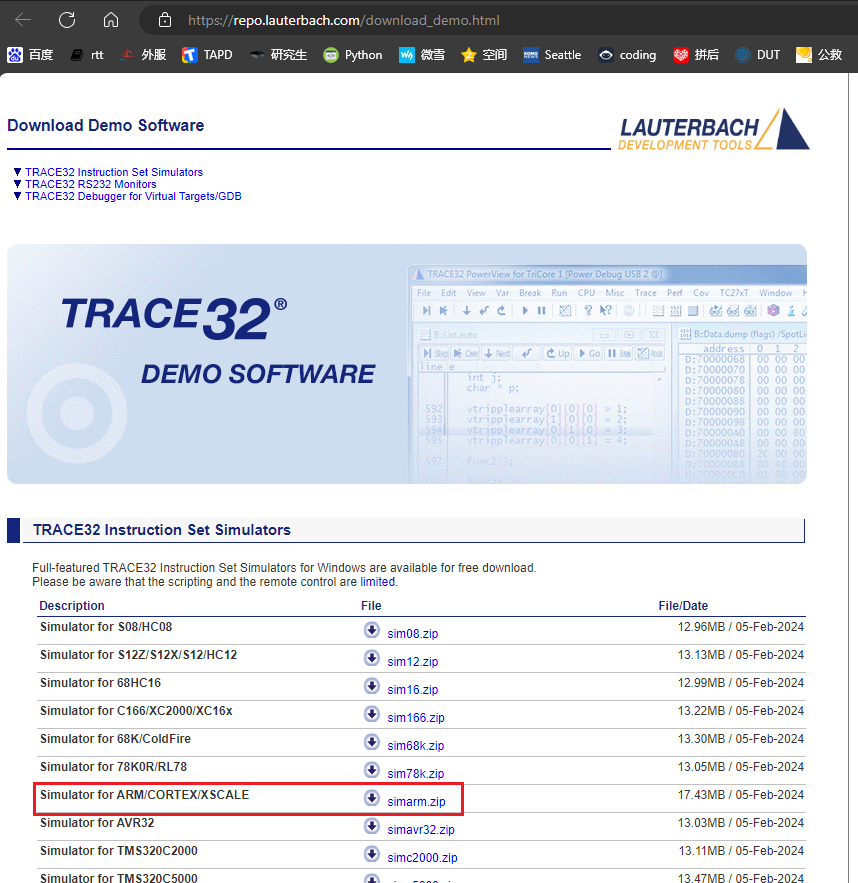<br>
Lauterbach's offline debugging tool download address:<br>
[Simulator for ARM/CORTEX/XSCALE
  simarm.zip](https://repo.lauterbach.com/download_demo.html) [[Usage](#Mark_Using_Trace32_to_Recover_Hcpu_Crash_Scene)]<br>
**2. Configuration Method**<br>
Open the installation guide file `SiFli-SDK\tools\crash_dump_analyser\INSTALL.md`
```
# Installation Guide

- Download simarm from the link below: https://www2.lauterbach.com/download/simarm.zip
- Extract all files in `simarm.zip` to `simarm` folder, `simarm` folder should be in `crash_dump_analyser` folder
- Replace t32.cmm and t32.men in `simarm` folder with the ones in `patch` folder
```
Extract the downloaded zip file to the `SiFli-SDK\tools\crash_dump_analyser\` directory, then copy the contents of the `patch` directory to the newly extracted `simarm` directory, as shown in the following figure:
<br>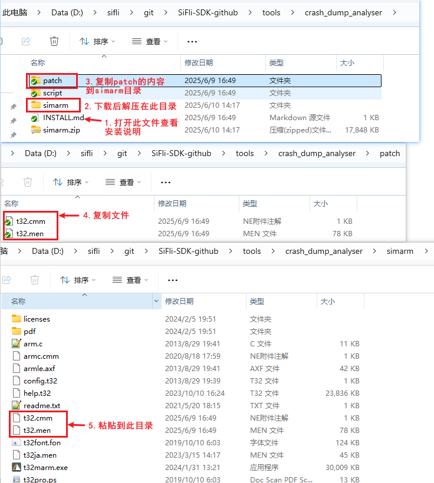<br>
**3. Running Trace32** <br>
This software does not require installation. Double-click the `t32marm.exe` executable file in the `simarm` directory to open Trace32<br>
<a name="Mark_Using_Trace32_to_Recover_Hcpu_Crash_Scene"></a>
## 6.2 Using Trace32 to Recover Hcpu Crash Scene
1. Refer to section [5.8 Dump Memory Method](../tools/sifli.md#Mark_Dump_Memory_Method) for the method to dump memory. Place the dumped memory and the compiled axf file in the same directory<br>
2. Run `sdk\tools\crash_dump_analyser\simarm\t32marm.exe`<br>
3. To view the Hcpu crash, click the HA button (HCPU assertion). If some bin files are missing (e.g., some dumps do not have PSRAM2), you can uncheck them.
<br>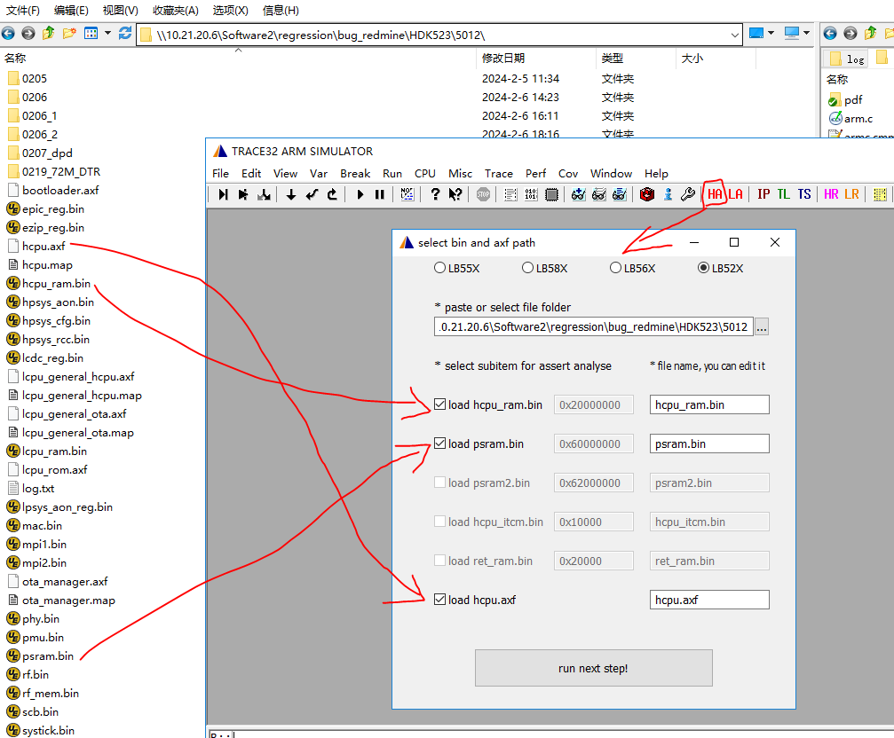<br>
Click the “run_next_step” button to load<br>
After successful loading, the scene information will be displayed as shown in the following figure,<br>
<br>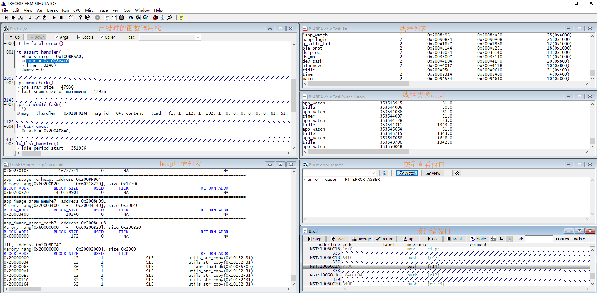<br> 
4. If all memory-related bin files are successfully saved, the memory and related address relationships will be established. You can refer to the memory address space in the chip manual. If the scene is not recovered, check if the dumped bin files are normal and verify if the PC and other registers in `log.txt` are correctly read. In specific cases, such as when PSRAM is not ready, you can modify the corresponding dump script, for example, the dump content in `sf32lb52x.jlink` to add or reduce the address space to be dumped.
<br>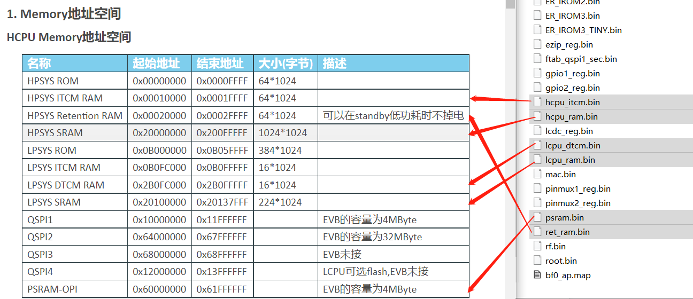<br> 
5. You can switch the displayed windows via the Window menu<br>
<br>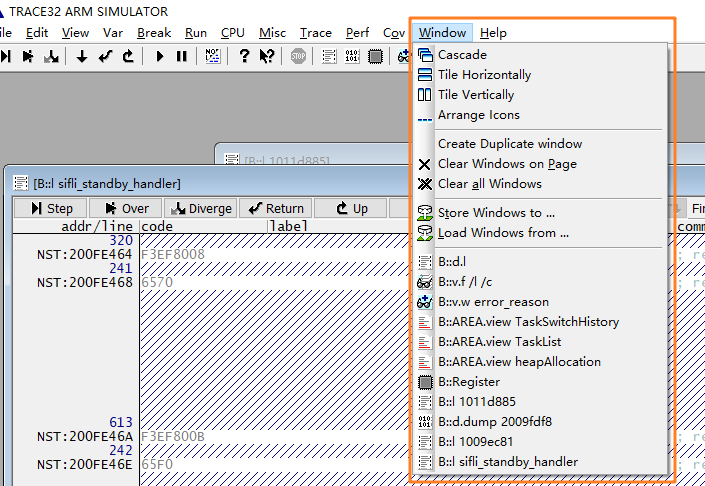<br> 
The heapAllocation window displays the allocation status of all heap pools in the system, including the system heap and memheap_pool:<br>
system heap: the pool used by `rt_malloc` and `lv_mem_alloc`<br>
various memheap_pool: pools created using `rt_memheap_init`, with allocation and release using `rt_memheap_alloc` and `rt_memheap_free`<br>
The fields in the allocation information list are as follows:<br>
```
BLOCK_ADDR: The starting address of the allocated memory block, including the management item
BLOCK_SIZE: The requested memory size, excluding the management item length
USED: Whether the block is allocated, 1 indicates allocated, 0 indicates not allocated
TICK: The allocation time, in units of OS tick, i.e., 1ms
RETURN ADDR: The address of the requester
```
6. Handling the absence of exception stack display<br>
After completing the previous steps, sometimes the crash scene stack may not be displayed, possibly due to the dump content not being saved or saved incorrectly. You can try the following three methods:
<br>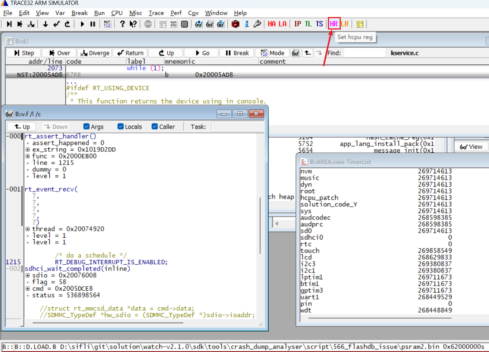<br>
1) Load the scene stack from the Jlink halt log information. The HR (HCPU Registers) button is used to restore CPU registers that did not reach the exception handler. Click the button and select the `log.txt` file containing the scene, which will restore the 16 registers of HCPU to Trace32.
<br>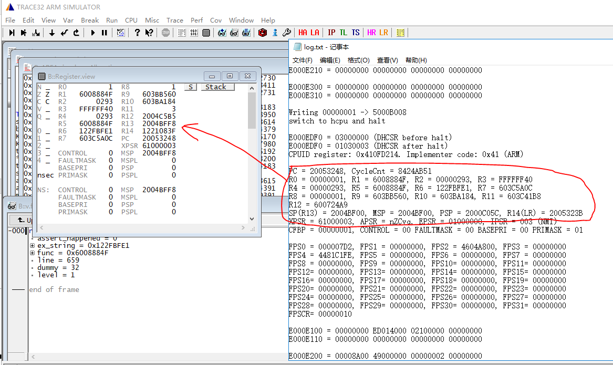<br> 
2) Manually restore the 16 registers from the log and input them into the register window in Trace32.
```
# Note: The register correspondence in the ARM core is as follows:
SP <-> R13
LR <-> R14
PC <-> R15
```
<br>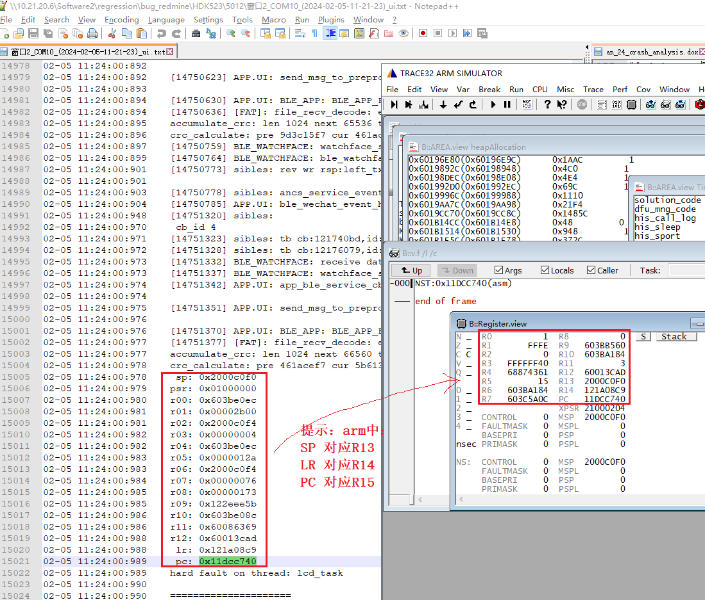<br> 
3) Another method is to manually recover the scene from the hardfault. Refer to [Trace32 Manual Recovery of Crash Scene](../debug/dump.md#33Trace32_Manual_Recovery_of_Crash_Scene) <br>
4) In the case of a `RT_ERROR_HW_EXCEPTION` crash, pay special attention to the problematic PC assembly instruction. Consider why the exception address and instruction occurred, as shown in the following figure:
<br>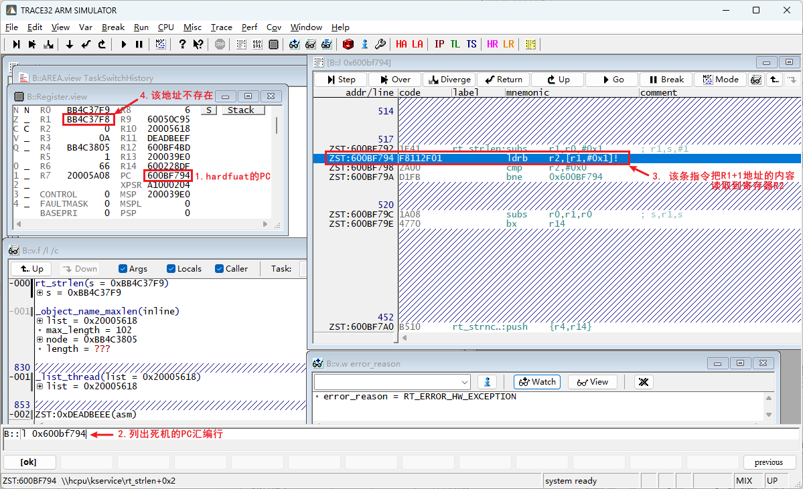<br>  
## 6.3 Using Trace32 to Recover LCPU Crash Scene
Similar to recovering the HCPU scene, select the LA button and follow the prompts. Note that LCPU includes the synchronous loading of the rom axf file, which can be selected as needed.
<br>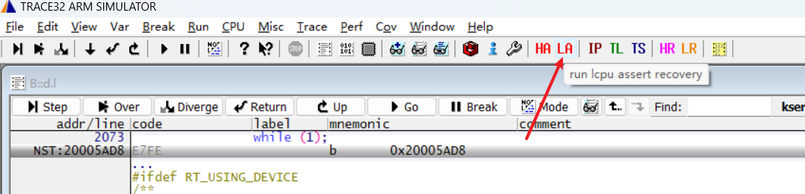<br>

## 6.4 Common Trace32 Commands
1. Menu: View->List Source, to open the source code viewing window, or use the command `L 10063c` or `l 0x10063c`, to view the code at the PC pointer 0x10063c.<br>
2. Menu: VarT->View, or command: `v.v *`, to open the variable viewing window, which can be used to search for variables, functions, and supports the `*` wildcard, as shown in the following figure:
<br>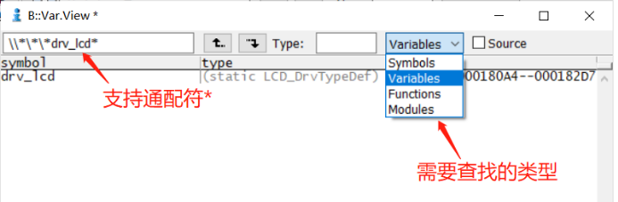<br>  
3. Menu: CPU->CPU Registers, or command: `r`, to open the register window and modify register values.<br>
4. Menu: View->Dump..., or command: `data.dump`, to open the memory address viewing window. For example, entering `0x200c0000` in the input box will display the memory at 0x200c0000, or use the command `data.dump 0x200c0000` to view the memory at 0x200c0000.<br>
5. Menu: View->StackFrame with locals, or command: `frame /locals /caller`, to view the call stack and local variables.<br>
6. You can execute the scripts under `tools\crash_dump_analyser\script`, as shown in the following figure:
```
show_app_pages.cmm
show_heap.cmm
show_heap_lcpu.cmm
show_heap2.cmm
show_isr_history.cmm
show_reg.cmm
show_rt_memheap.cmm
show_running_app.cmm
show_switch_history.cmm
show_tasks.cmm
show_timer.cmm
switch_task.cmm
switch_to.cmm
``` 
Corresponding commands:<br> 
`do show_tasks` # Display all threads, showing their running status, stack address, and priority, as shown in the following figure:
<br>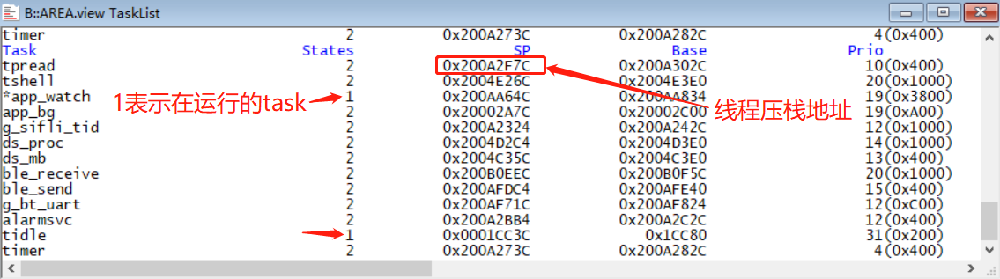<br> 
`do switch_to 0x200A2F7C` # Switch to another thread using the command, as shown in the following figure, switching to the TP thread:
<br>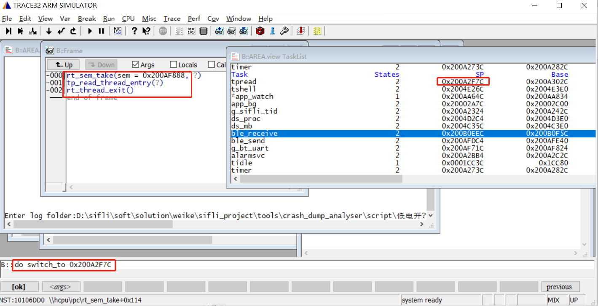<br> 
`do show_switch_history` # View the thread switch history.<br>
`do show_timer` # View the timer usage.<br>

7. Method to cast a memory address to a structure:<br>
Structure `struct rt_pm _pm;`<br>
Conversion command: `(struct rt_pm *)0x101fa2b9 `<br>
As shown in the following figure:<br>
<br>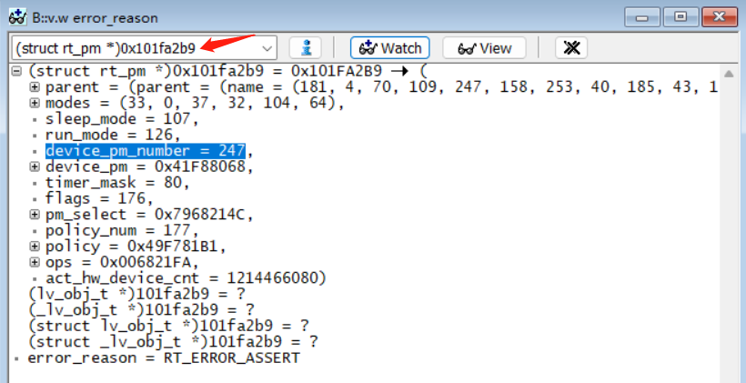<br>  
8. Method to cast a memory address to `uint8`, `uint16`, etc. variables:<br>
`(uint16_t *)0x101fa2b9`
<br>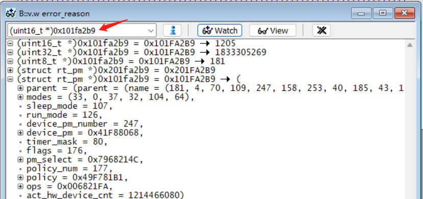<br>  

## 6.5 Trace32 Project Path Relocation
1. When restoring a memory dump file from Trace32 on a different computer, you may encounter the issue where only assembly code is displayed and C language code is not shown:<br>
The reason is that the path of the memory dump project executed by `save_ram_a0.bat` is different from the path of the Trace32 project used for reproduction.<br>
<br>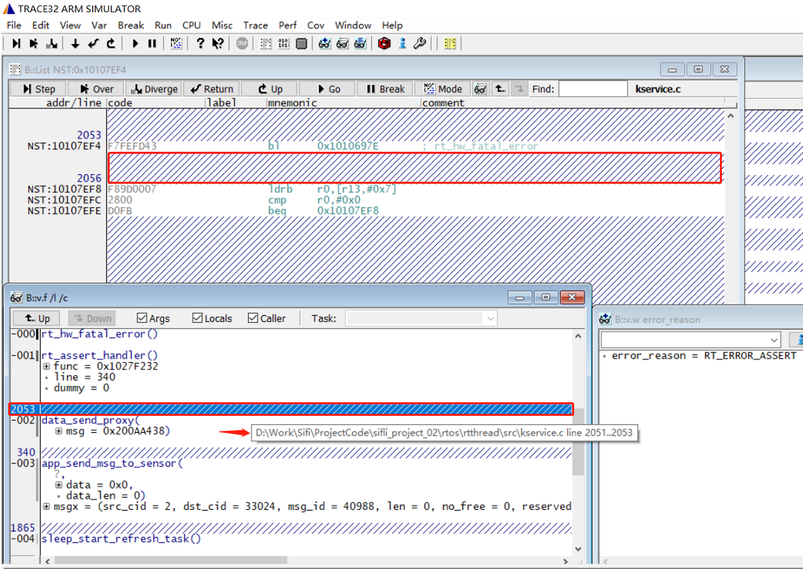<br>  
2. You can resolve this issue by relocating the project path, as shown in the following figure:
<br>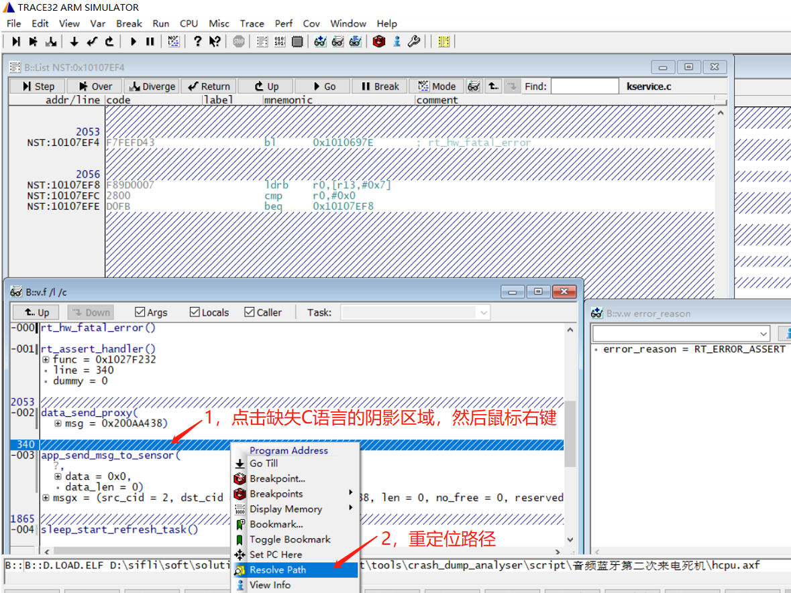<br>  
Select the project path where the corresponding C file is located. After selecting this file, all project paths will be relocated, as shown in the following figure:
<br>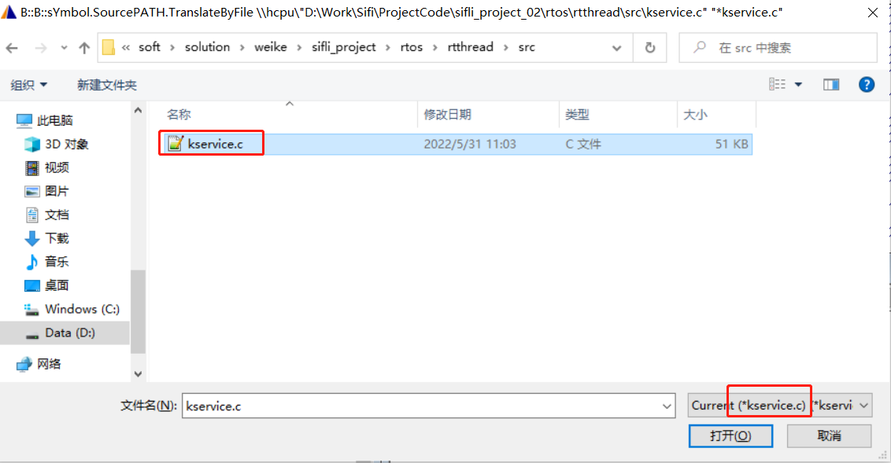<br>  
3. The relocated Trace32 interface is shown below: C language code is displayed for all code except those in the `lib` directory.
<br>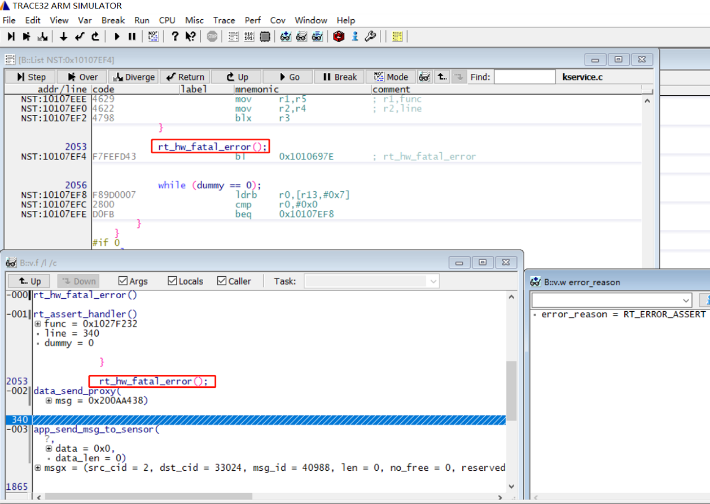<br>