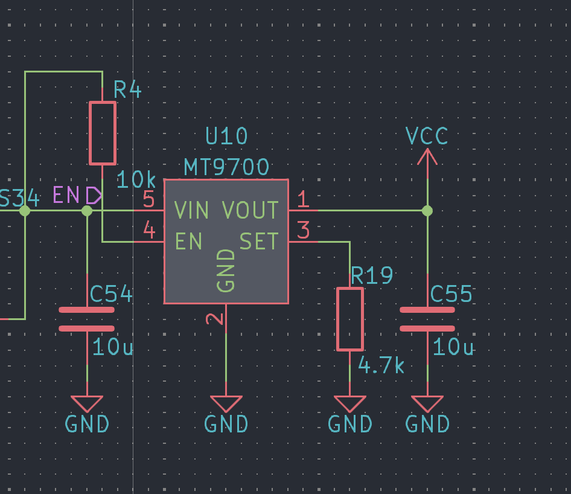
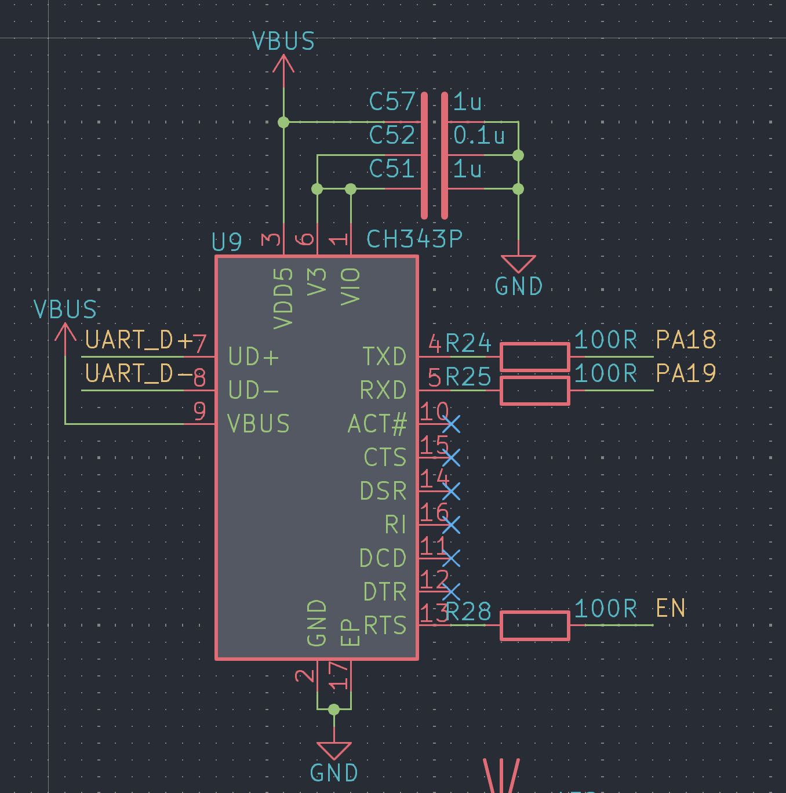
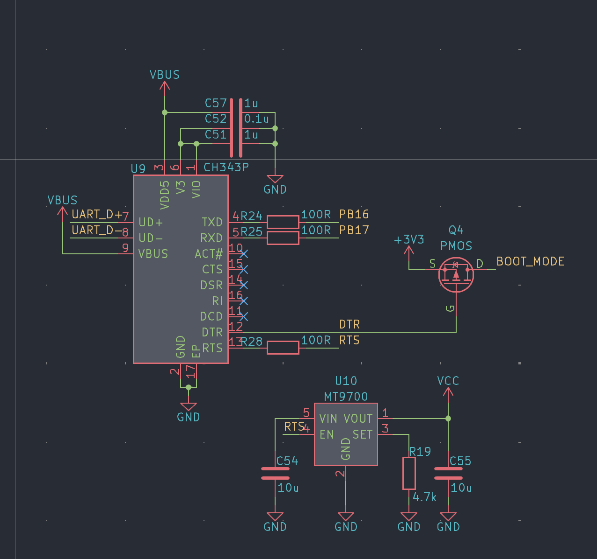
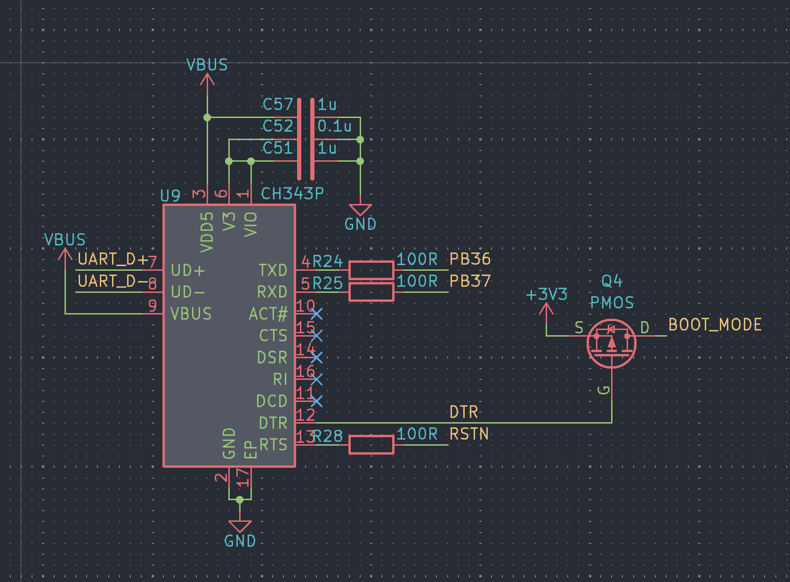

# SF32 系列串口自动下载设计

在开发和调试过程中免不了要频繁下载程序，如果每次都需要手动复位、进入下载模式，操作起来非常麻烦。因此 sftool 工具在设计之初就考虑到了这个问题，提供了自动下载，在开发和调试阶段建议预留相关电路设计。

## 52 系列

52 系列没有预留出 RST/EN 引脚，因此复位需要关断芯片电源（对于 52x 系列来说是 VCC，对于 52X 系列来说是 PVDD）。因此我们一般需要单独外接一个负载开关用于控制芯片电源。

52 系列在启动的时候会停留在 bootrom 中大约 2000ms，在这段时间内可以使用 uart debug 进入下载模式。sftool 在下载的时候会通过`RTS`进行复位。因此在设计的时候只需要将`RTS`引脚连接到负载开关的使能引脚上即可。

## 56 系列

56 系列和 52 系列类似，也拥有uart debug用于调试。因此在软件未屏蔽的情况下也可以通过 uart debug 进入下载模式。但是在软件被屏蔽的时候需要进入 `下载模式`之后才能进行操作，进入下载模式的调试为复位的时候`BOOT_MODE`引脚保持高电平。

## 58 系列

58 系列没有uart debug，因此需要下载时必须进入下载模式。进入下载模式的方式是复位的时候`BOOT_MODE`引脚保持高电平。并且58系列存在`RSTN`的复位引脚，因此无需单独外接负载开关。

