# SF32LB52-MOD-1模组EPD屏幕设计指南

本文的主要目的是帮助开发人员完成基于SF32LB52-MOD-1模组的墨水屏方案开发。本文重点介绍方案开发过程中的硬件设计相关注意事项，尽可能的减少开发人员工作量，缩短产品的上市周期。

## SF32LB52-MOD-1模组资源介绍

SF32LB52-MOD-1模组有下表中的两个型号

模组代码| 芯片 | Flash容量 | PSRAM容量 | 环境温度 | 模组尺寸（mm）
:- | :-| :-|:-|:-|:-
SF32LB52-MOD-1-N16R8 | SF32LB525UC6 | 16MB QSPI-NOR | 8MB OPI-PSRAM | -40~85C | 18*27.9
SF32LB52-MOD-1-A128R16 | SF32LB527UD6 | 128MB SPI-Nand | 16MB OPI-PSRAM | -40~85C | 18*27.9

## SF32LB52-MOD-1模组封装

SF32LB52-MOD-1系列模组，采用3边LCC半孔和底部LGA焊盘，板载PCBA蓝牙天线的设计，尺寸：18*27.9*3.1mm。

### 模组管脚布局

 
<br> <br>

详细模组的管脚信息请参考模组规格书。

### 模组尺寸图

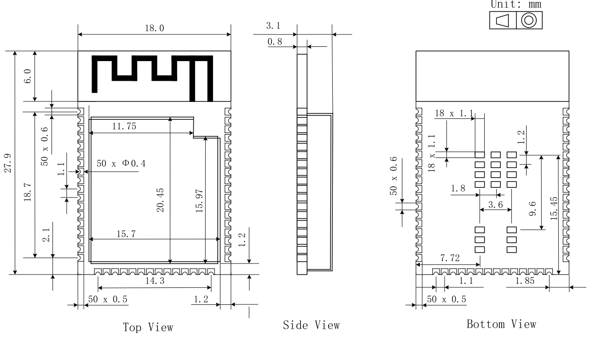 
<br> <br>

## 墨水屏介绍

从驱动方式上区分，常见的墨水屏接口有`SPI`串行和`Source/Gate`并行驱动两种接口。
- SPI串口屏，内部集成了TCON显示控制模块，MCU通过SPI接口给屏幕送显示数据，屏幕内TCON控制墨水屏的刷新。
- 并口屏，内部没有集成TCON显示控制模块，需要MCU直接发送特定TCON控制时序来刷新墨水屏。

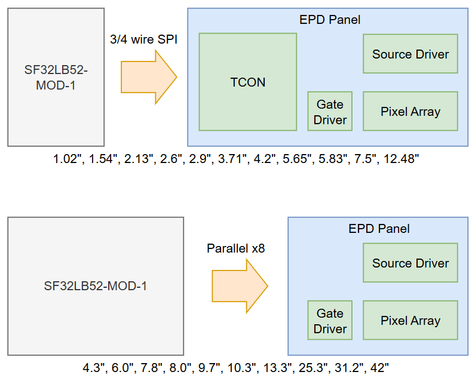 
<br> <br>
SF32LB52-MOD-1模组的CPU集成了墨水屏的TCON控制模块，可以直接驱动`x8`数据位宽的并口墨水屏。

## 典型墨水屏方案应用框图

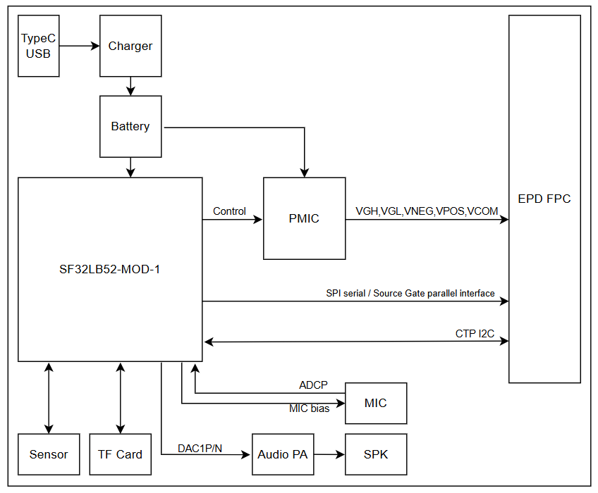 
<br> <br>

## 原理图设计指导

### 显示

#### SPI串行驱动接口

```{table}
:align: center
|管脚|	模组信号  |  管脚名称    |   功能     |
|:--|:------- |:----------------|:-----------|
|1  | NC      | NC       | NO Connection                     
|2  | Boost   | GDR      | N-MOS gate control,for booster circuit output   
|3  | Boost   | RESE     | Current sense input for control loop 
|4  | NC      | NC       | NO Connection 
|5  | CAP     | VSH2     | Positive source driver voltage，Connect to CAP
|6  | NC      | NC       | NO Connection
|7  | NC      | NC       | NO Connection
|8  | VSS     | BS       | Bus selection pin，for 3-wire(H active) or 4-wire(L active) SPI interface
|9  | PA_02   | BUSY     | Busy state output
|10 | PA_00   | RES#     | Reset signal input         
|11 | PA_06   | DC#      | Data/Cammand control input             
|12 | PA_03   | CS#      | SPI chip select
|13 | PA_04   | SCL      | SPI clock input 
|14 | PB_05   | SDA      | SPI data input/output         
|15 | 3.3V    | VDDIO    | IO power supply              
|16 | 3.3V    | VCI      | Chip power supply，3.3V  
|17 | VSS     | VSS      | Ground
|18 | CAP     | VDD      | Power supply，Connect to CAP
|19 | NC      | VPP      | Power Supply for OTP Programming  
|20 | CAP     | VSH1     | Positive source driver voltage，Connect to CAP  
|21 | Boost   | VGH      | Power Supply pin for Positive Gate driving voltage and VSH 
|22 | CAP     | VSL      | Negative Source driving voltage，Connect to CAP
|23 | Boost   | VGL      | Power Supply pin for Negative Gate driving voltage, VCOM and VSL
|24 | CAP     | VCOM     | VCOM driving voltage，Connect to CAP
```

#### 并行Source和Gate驱动接口

```{table}
:align: center
|管脚|	模组信号  |  管脚名称    |   功能     |
|:--|:------- |:----------------|:-----------|
|1  | PMIC    | VNEG     | Negative power supply source driver                     
|2  | PMIC    | VGL      | Negative power supply gate driver    
|3  | VSS     | VSS      | Ground 
|4  | NC      | NC       | NO Connection 
|5  | NC      | NC       | NO Connection
|6  | PMIC    | VDD      | Digital power supply driver
|7  | VSS     | VSS      | Ground
|8  | PA_04   | CLK      | Clock source driver
|9  | VSS     | VSS      | Ground
|10 | PA_09   | LE       | Latch enable source driver          
|11 | PA_05   | OE       | Output enable source dirver             
|12 | PA_06   | SPH      | Start pulse source driver
|13 | PA_07   | D0       | Data signal source driver 
|14 | PB_08   | D1       | Data signal source driver          
|15 | PA_37   | D2       | Data signal source driver              
|16 | PA_39   | D3       | Data signal source driver  
|17 | PA_40   | D4       | Data signal source driver  
|18 | PA_41   | D5       | Data signal source driver 
|19 | PA_42   | D6       | Data signal source driver  
|20 | PA_43   | D7       | Data signal source driver  
|21 | PMIC    | VCOM     | Common connection 
|22 | NC      | NC       | NO Connection    
|23 | NC      | NC       | NO Connection
|24 | NC      | NC       | NO Connection
|25 | NC      | NC       | NO Connection
|26 | VSS     | VSS      | Ground
|27 | PA_03   | MODE     | Output mode selection gate driver
|28 | PA_01   | CPV      | Shift clock input
|29 | PA_00   | STV      | Start pulse gate driver
|30 | NC      | NC       | NO Connection
|31 | NC      | VBORDER  | Border connection
|32 | VSS     | VSS      | Ground
|33 | PMIC    | VPOS     | Positive power supply source driver
|34 | PMIC    | VGH      | Positive power supply gate driver

```

### 电源

#### 串口屏电源

SPI串口墨水屏除了3.3V VDD电源外，还需提供`VGH`(大约+20V)和`VGL`(大约-20V)电源。

SPI串口墨水屏可以输出booster pwm信号`GDR`来产生`VGH`和`VGL`。

如下图所示，由`GDR`和`RESE`来产生`VGH`和`VGL`，元器件的具体值请参考屏幕规格书的要求。

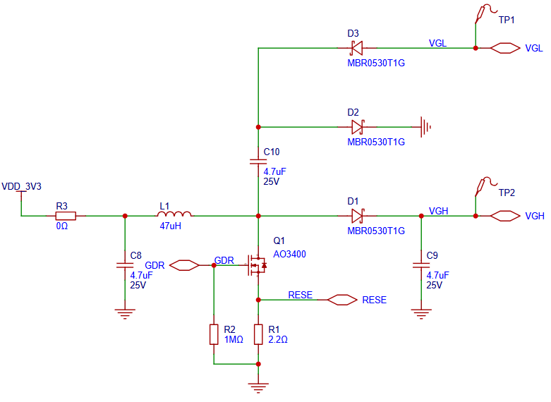 
<br> <br>

#### 并口屏电源

并口墨水屏除了3.3V VDD电源外，还需提供`VGH`(大约+20V)、`VGL`(大约-20V)、`VPOS`(大约+15V)、`VNEG`(大约-15V)和`VCOM`(大约-2.5 ~ -1.5V)电源。

并口墨水屏对于`VGH`、`VGL`、`VPOS`、`VNEG`和`VCOM`这些偏置电源是有特定的上下电时序要求的。

参考上电时序：
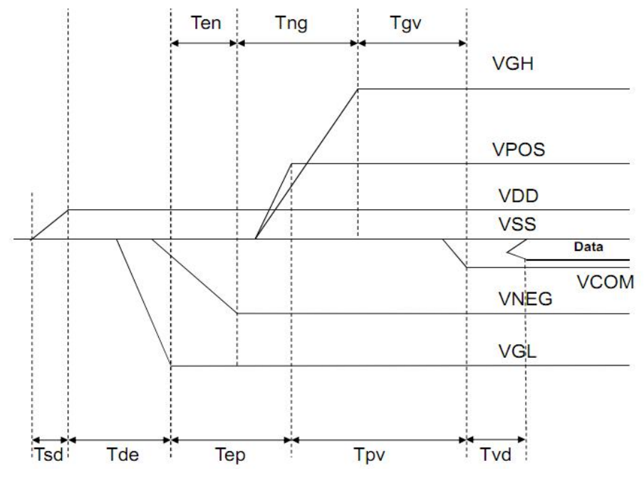 
<br> <br>

参考下电时序：
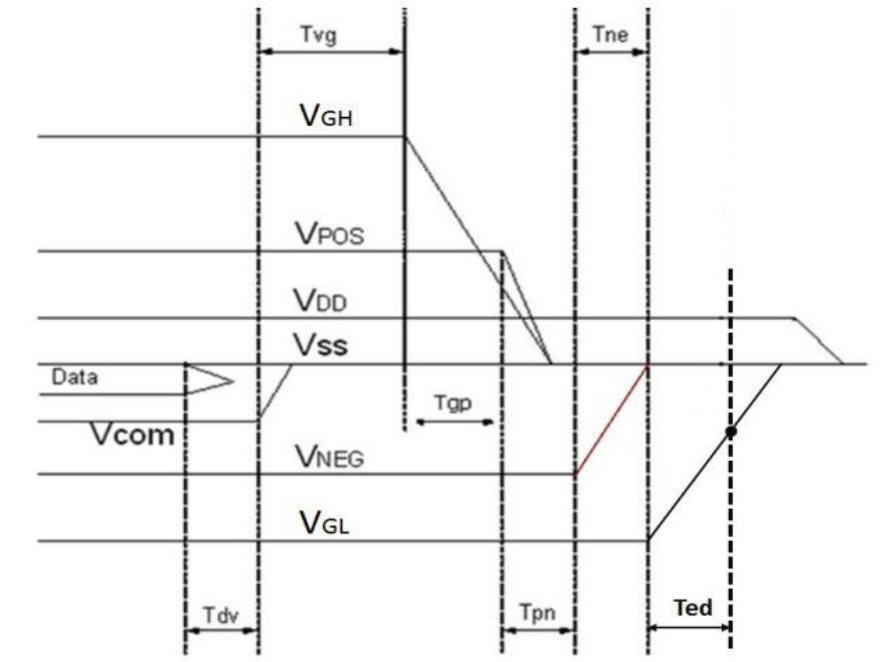 
<br> <br>

各种型号的墨水屏偏置电源的上下电时序可能不尽相同，设计时以实际屏的规格书要求为准。

墨水屏偏置电源可以用boost开关电源来供，可以参考[Glider](https://github.com/Modos-Labs/Glider)开源工程里的供电原理图进行设计。

墨水屏偏置电源也可以专用PMIC芯片来供，常见的PMIC芯片有：
- TPS6518x，VCOM精度±1.5%，静态电流5.5mA，关闭电流3.5uA
- FP9931，  VCOM精度±1.5%，静态电流1.5mA，关闭电流0.1uA
- SY7636A， VCOM精度±1.5%，静态电流1.5mA，关闭电流最大3uA

TPS6518x的典型应用原理图：
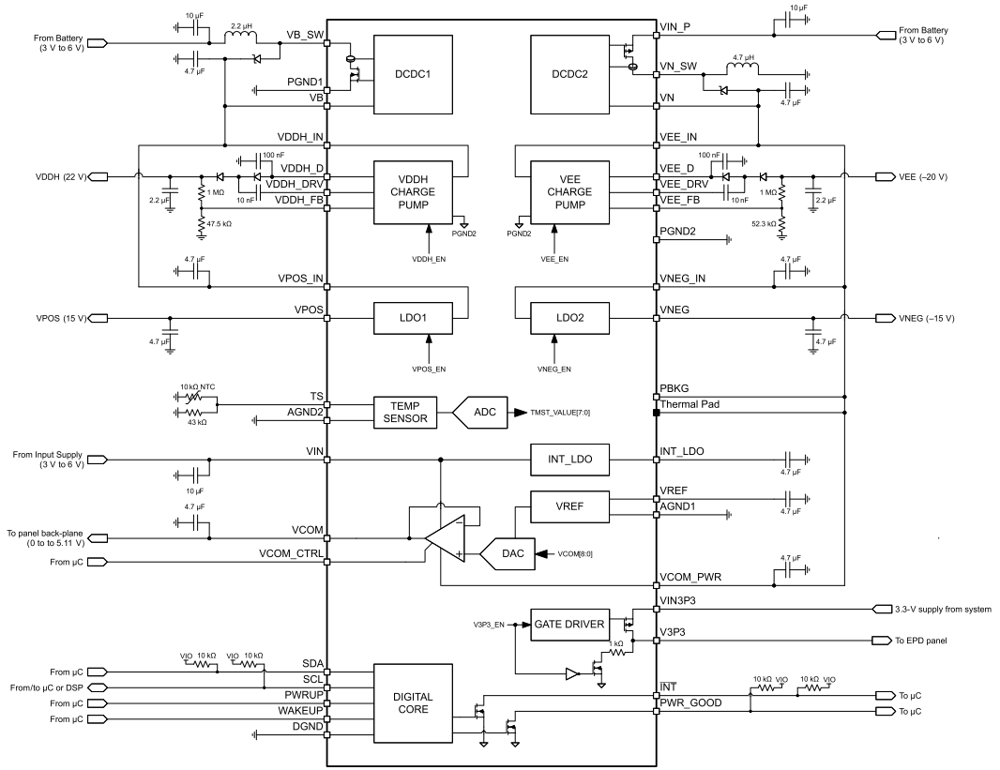 
<br> <br>
TPS6518x需要最多7个IO(SDA、SCL、INT、WAKEUP、PWRUP、VCOM_CTRL和PWR_GOOD)，最少5个IO(SDA、SCL、WAKEUP、PWRUP和VCOM_CTRL)和模组相连。

FP9931的典型应用原理图：
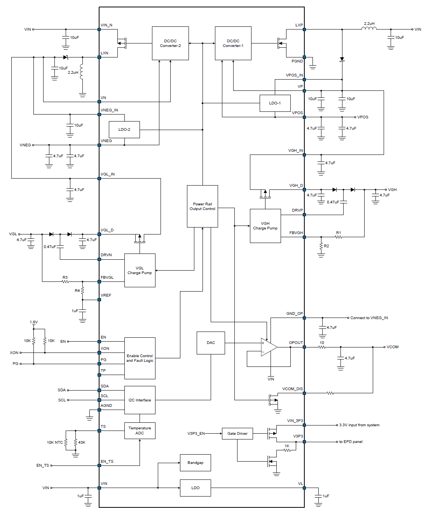 
<br> <br>
FP9931需要最少3个IO(SDA、SCL、和EN)和模组相连。

SY7636A的接线方法和FP9931类似。

### 射频

模组自带PCBA蓝牙天线，无需再单独设计天线。

### TF卡

模组支持SPI模式TF卡接口，信号连接方式见下表：

```{table}
:align: center
|管脚名称 | TF卡管脚名称 |  功能                   |
|:--------|:------------|:-------------------------|
| PA_24   |CMD          | SPI1_DO，SPI TF卡接口信号                   
| PA_25   |DAT0         | SPI1_DI，SPI TF接口信号 
| PA_27   |CD           | DET，SPI TF接口信号 
| PB_28   |CLK          | SPI1_CLK，SPI TF接口信号         
| PA_29   |CD/DAT3      | SPI1_CS，SPI TF接口信号             
```
<br> <br>

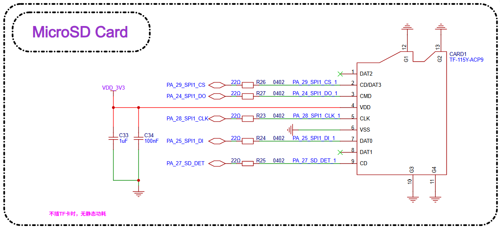 
<br> <br>

### 按键
模组支持GPIO按键和GPADC按键。PA34支持长按10s左右重启功能，推荐用做开关机按键。
- PA34用来设计按键输入时，必须是高电平有效。
- 其他GPIO用来设计按键输入时，高/低电平有效都可以。
- PA34上支持GPADC功能，可以用来设计GPADC按键。
- GPADC按键功能，要求输入电压要大于2.1V，各按键值之间电压不能有重叠，值本身的范围大于100mV。

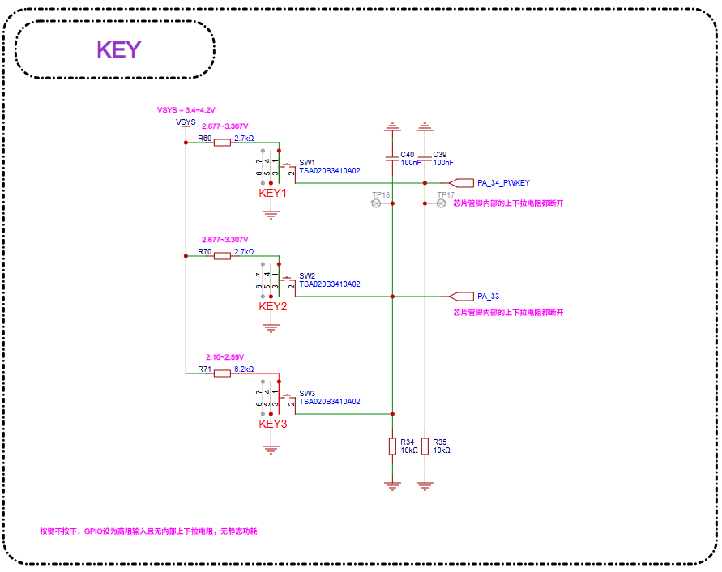 
<br> <br>

### 传感器
传感器采用I2C接口连接，CPU轮询方式来获取数据，省去中断信号。

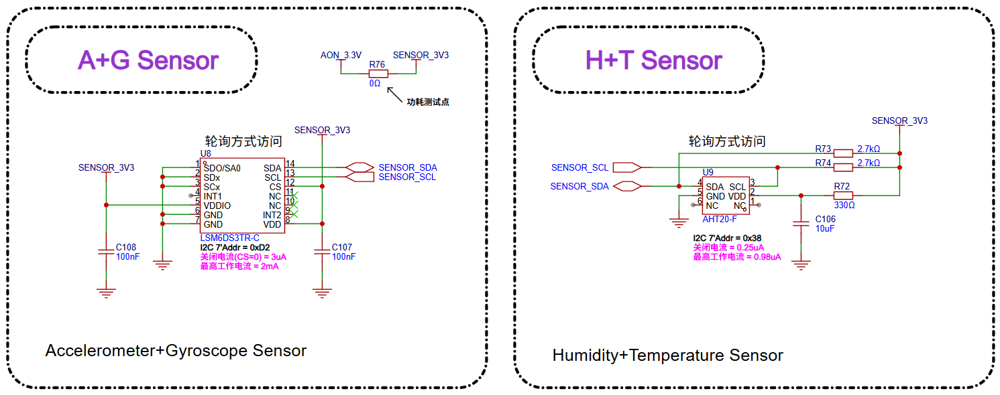 
<br> <br>

### 音频
模组支持1路单端模拟mic输入和1路差分音频输出。
- 模拟MIC的电源用模组micbias输出供电。
- 音频输出需要外加功率放大器。

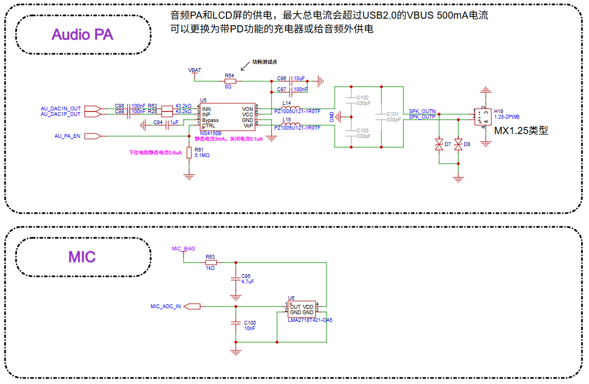 
<br> <br>

### 调试和下载

模组支持DBG_UART接口用于下载和调试，通过3.3V接口的UART转USB Dongle板接PC机。

```{table}
:align: center
|DBG信号 |管脚   |详细描述 |
|:---|:---|:---|
|DBG_UART_RXD |PA18 |Debug UART 接收 |
|DBG_UART_TXD |PA19 |Debug UART 发送 |
```

## PCB设计指导

### PCB封装设计

下图为推荐的PCB封装尺寸，单位mm。

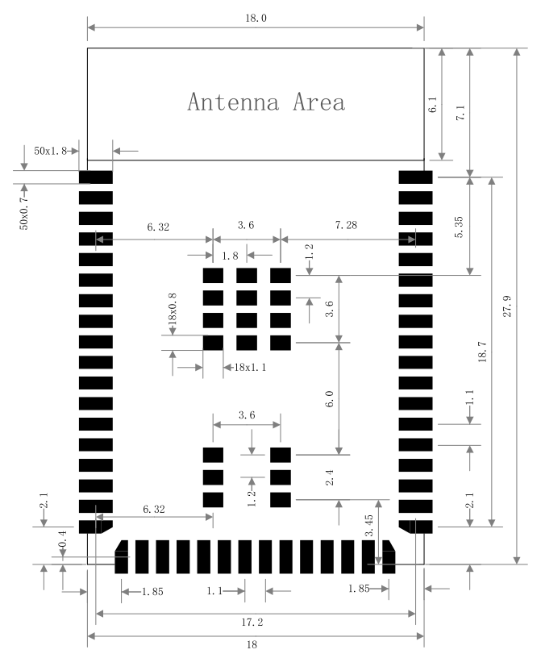 
<br> <br>

### PCB叠层设计

模组可以支持2层通孔板设计:
 - 第一层（顶层），主要用于摆放元器件和走线。
 - 第二层（底层），不要摆放元器件，走线越少越好，保证音频下面有完整的地平面，其他信号线地回路最短。

### PCB设计中模组位置摆放

如产品采用模组进行 on-board 设计，则需要预留好模组 PCB 天线的位置，保证天线区域上没有其他器件和金属区域，避免影响天线辐射效率，考虑好模组在底板的布局，应尽可能地减小对模组 PCB 天线性能的影响。

建议将模组天线区域伸出板边，馈点靠近底板板边位置。

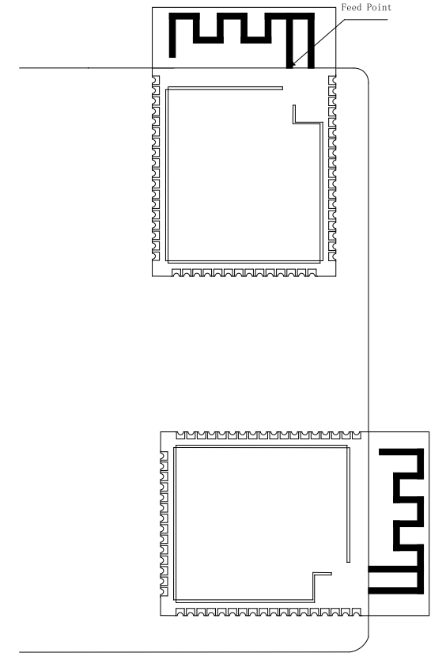 
<br> <br>

如果天线无法伸出板边，请保证给PCB天线一个足够大的净空区域(严禁铺铜、走线、摆放元件)，该净空区域建议至少 15mm，PCB天线下方区域的底板请切割掉，以尽可能地减少底板板材对PCB天线的影响。馈点还是尽量靠近板边位置，如图下图所示，馈点在模组的右侧，画出了建议的净空区。

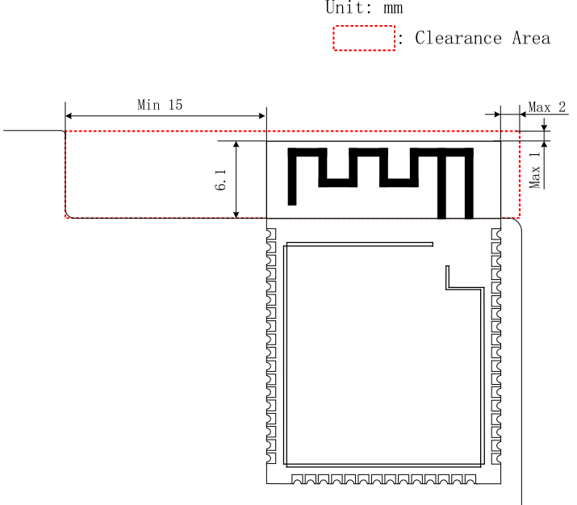 
<br> <br>

涉及整机设计时，请注意考虑外壳对天线的影响，并进行RF验证。

请注意最终仍需要对整机产品进行通讯距离等测试来确保产品的射频性能。

### 显示接口走线

EPD显示接口，信号并行走线时，尽量满足3W原则，避免信号线之间的串扰。2层板走线时，如果信号参考层地平面被分割导致不完整，信号线间尽量插一些GND，保证地回路尽量短。

### 音频接口走线

模拟MIC对应电路器件尽量靠近模组管脚放置，走线线长尽量短，做立体包地处理，远离其它强干扰信号。

模拟信号输出DACP/DACN管脚，对应电路器件尽量靠近芯片管脚放置，每一路P/N需要按照差分线形式走线，走线线长尽量短，需做立体包地处理，远离其它强干扰信号。

## 参考资料

[DS5203-SF32LB52-MOD-1技术规格书](index)

[SF32-OED-6'-EPD开源硬件资料](https://oshwhub.com/sifli/sf32-oed-6-epd-v110)

[SiFli EPD_Reader开源软件](https://github.com/OpenSiFli/EPD_Reader)
