# SF32LB52x - Hardware Design Guide

:::{attention}
This document is applicable to chips with suffixes 0, 3, 5, 7, which are powered by a lithium battery and support USB charging.

For chips with suffixes B, E, G, J, H, which belong to the SF32LB52X series and are powered by 3.3V, refer to the [Hardware Design Guide](/hardware/SF32LB52B-E-G-J-HW-Application)
:::


## Introduction

The primary purpose of this document is to assist developers in completing the development of watch solutions based on the SF32LB52x series of chips. This document focuses on hardware design considerations during the development process, aiming to reduce the workload of developers and shorten the product's time to market.

The SF32LB52x is a series of highly integrated, high-performance MCU chips designed for ultra-low-power AIoT (Artificial Intelligence of Things) scenarios. The chip features a big.LITTLE architecture based on the Arm Cortex-M33 STAR-MC1 processor, integrated high-performance 2D/2.5D graphics engine, AI neural network accelerator, dual-mode Bluetooth 5.3, and audio CODEC. It can be widely used in various applications such as wearable electronic devices, smart mobile terminals, and smart home devices.

:::{attention}
The SF32LB52x is the **lithium battery-powered version of the SF32LB52 series, with a supply voltage of 3.2~4.7V and supports charging**. It includes the following models: \
SF32LB520U36, with 1MB QSPI-NOR Flash \
SF32LB523UB6, with 4MB OPI-PSRAM \
SF32LB525UC6, with 8MB OPI-PSRAM \
SF32LB527UD6, with 16MB OPI-PSRAM
:::

The processor's peripheral resources are as follows:

- 44x GPIO
- 3x UART
- 4x I2C
- 2x GPTIM
- 2x SPI
- 1x I2S audio interface
- 1x SDIO storage interface
- 1x PDM audio interface
- 1x differential analog audio output
- 1x single-ended analog audio input
- Supports single, dual, and quad data line SPI display interfaces, as well as serial JDI mode display interfaces
- Supports both GRAM and non-GRAM displays
- Supports UART download and software debugging


## Package

<div align="center"> Table 2-1 Package Information </div>

```{table}

|Package Name|Size|Pin Pitch|
|:--|:-|:-|
|QFN68L | 7x7x0.85 mm | 0.35 mm |
```

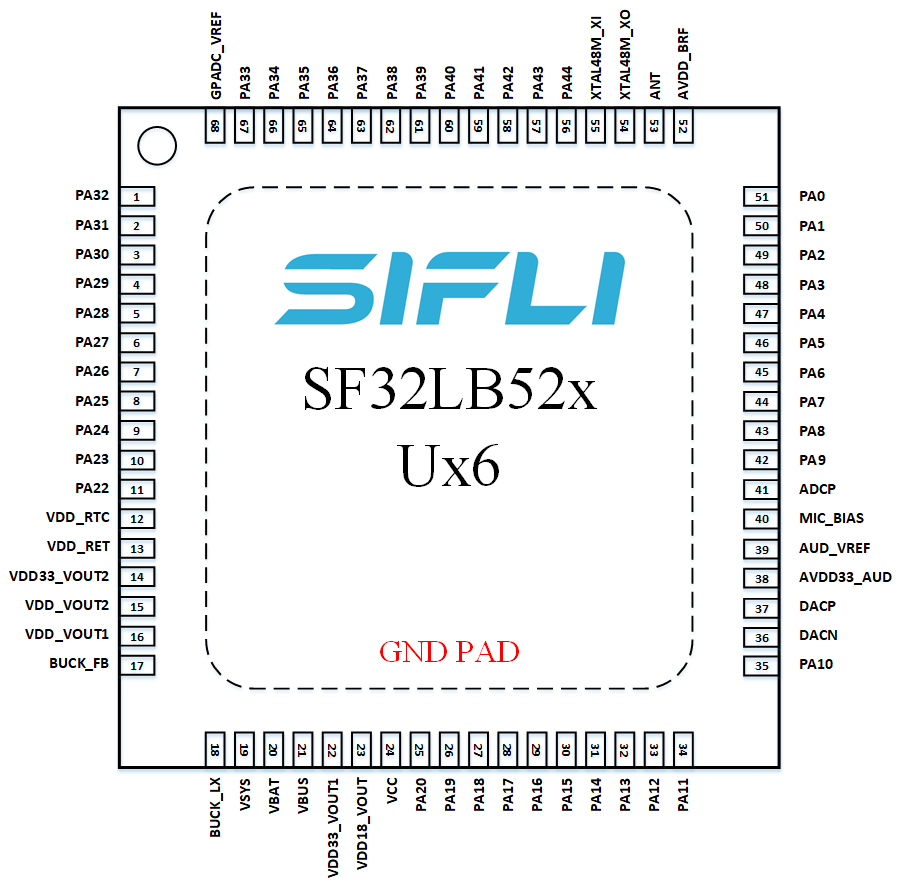  

<div align="center"> Figure 2-1 QFN68L Pin Distribution </div>  <br> <br> <br>


## Typical Application Scheme

The following diagram is a typical block diagram of an SF32LB52x sports watch, which includes display, storage, sensors, vibration motor, and audio input and output functions.

<!-- The image here is problematic and needs to be replaced with the B3 version diagram -->
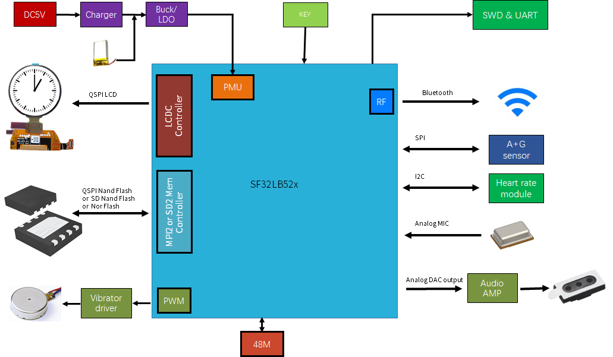  

<div align="center"> Figure 3-1 Sports Watch Block Diagram </div>   <br>  <br>  <br>


:::{Note} 

   - Big.LITTLE dual-CPU architecture, balancing high performance and low power design requirements
   - Integrated charging management and PMU module
   - Supports TFT or AMOLED displays with QSPI interface, with a maximum resolution of 512*512
   - Supports PWM backlight control
   - Supports external QSPI Nor/Nand Flash and SD Nand Flash storage chips
   - Supports dual-mode Bluetooth 5.3
   - Supports analog audio input
   - Supports analog audio output
   - Supports PWM vibration motor control
   - Supports SPI/I2C interface acceleration/magnetic/gyroscope sensors
   - Supports SPI/I2C interface heart rate/blood oxygen/EKG/magnetic sensors
   - Supports UART debug print interface and programming tools
   - Supports Bluetooth HCI debug interface
   - Supports mass production one-to-many program burning
   - Supports crystal calibration function in mass production
   - Supports OTA online upgrade function
:::


## Schematic Design Guidelines

### Power Supply

#### Processor Power Supply Requirements

<div align="center"> Table 4-1 Power Supply Requirements </div>

```{table}

|Power Pin| Minimum Voltage (V) | Typical Voltage (V) | Maximum Voltage (V) | Maximum Current (mA) |   Detailed Description |
|:--|:--|:--|:--|:--|:----------------------------------------------------|
|VBUS       |4.6    |5.0    |5.5    |500    |VBUS power input 
|VBAT       |3.2    |-      |4.7    |500    |VBAT power output
|VCC        |3.2    |-      |4.7    |500    |System power input{sup}`(1)` 
|VSYS       |-      |3.3    |-      |500    |VSYS power output{sup}`(2)` 
|BUCK_LX    |-      |1.25   |-      |50     |BUCK output pin, connected to inductor 
|BUCK_FB    |-      |1.25   |-      |50     |BUCK feedback and internal power input pin, connected to the other end of the inductor, and an external capacitor 
|VDD_VOUT1  |-      |1.1    |-      |50     |Internal LDO, external capacitor, internal power, does not supply power to peripherals 
|VDD_VOUT2  |-      |0.9    |-      |20     |Internal LDO, external capacitor, internal power, does not supply power to peripherals 
|VDD_RET    |-      |0.9    |-      |1      |Internal LDO, external capacitor, internal power, does not supply power to peripherals 
|VDD_RTC    |-      |1.1    |-      |1      |Internal LDO, external capacitor, internal power, does not supply power to peripherals 
|VDD18_VOUT |-      |1.8    |-      |30     |SIP power{sup}`(3)` internal power, does not supply power to peripherals, can supply power externally when LDO is off
|VDD33_VOUT1|-      |3.3    |-      |150    |3.3V LDO output 1{sup}`(4)` default no output, requires software configuration to output 3.3V
|VDD33_VOUT2|-      |3.3    |-      |150    |3.3V LDO output 2, default no output, requires software configuration to output 3.3V
|AVDD33_AUD |2.97   |3.3    |3.63   |50     |3.3V audio power input 
|AVDD_BRF   |2.97   |3.3    |3.63   |100    |RF power input 
|MIC_BIAS   |1.4    |-      |2.8    |-      |MIC power output 
```
:::{note} 

{sup}`(1)` VCC power input, powered by a lithium battery, default software setting low voltage = 3.48V; when powered by a constant voltage power supply, the voltage range is 3.6~4.7V, recommended 3.8V power supply 

{sup}`(2)` VSYS power, supplies power to AVDD_BRF 

{sup}`(3)` VDD18_VOUT power \
SF32LB520U36, supplies 3.3V power externally \
SF32LB523UB6, SF32LB525UC6, SF32LB527UD6, uses internal LDO, no external power supply required \
When configuring software, the internal VDD18 LDO should be set according to the chip model, and should not be enabled when supplying power externally 

{sup}`(4)` VDD33_VOUT1 power \
SF32LB520U36, supplies power to VDD18_VOUT, external Flash, and AVDD33_AUD \
SF32LB523UB6, SF32LB525UC6, SF32LB527UD6, supplies power to external Flash and AVDD33_AUD 
:::

#### Processor BUCK Inductor Selection Requirements

**Key Parameters of Power Inductor**
:::{important}
L (inductance) = 4.7uH ± 20%, DCR (DC resistance) ≦ 0.4 ohm, Isat (saturation current) ≧ 450mA.
:::

<!-- A3 version to add battery and charging control -->
#### Battery and Charging Control

The charging circuit has two usage scenarios: external charging management chips and integrated charging management modules.

##### External Charging Management Chip

External charging management chips are divided into two types: one without PPM (Power Path Management) function and one with PPM function. Figure 4-1 shows a typical charging circuit using a charging chip without PPM function, where the battery directly powers the VBAT and VCC pins of the SF32LB52x. Figure 4-2 shows a typical charging circuit using a charging chip with PPM function, where the VSYS of the charging chip powers the VCC pin of the SF32LB52x, and the VBAT of the charging chip connects to the battery and the VBAT pin of the SF32LB52x. Both solutions measure the battery voltage through the VBAT pin of the SF32LB52x. The VBAT pin integrates a GPADC that can sample the VBAT voltage with a precision of ±30mV.

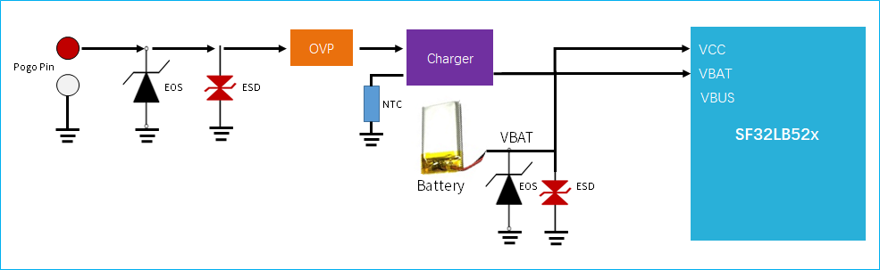  

<div align="center"> Figure 4-1 Schematic of External Charging Chip Circuit without PPM Function </div>   <br>  <br>  <br>

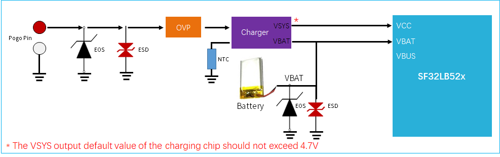  

<div align="center"> Figure 4-2 Schematic of External Charging Chip Circuit with PPM Function </div>   <br>  <br>  <br>

##### Integrated Charging Management Module

When using the integrated charging management module of the SF32LB52x, as shown in Figure 4-3, when the battery is low and the system is shut down, after inserting the charger, the battery must be charged to the power-on voltage before the system can start normally and display the charging interface.

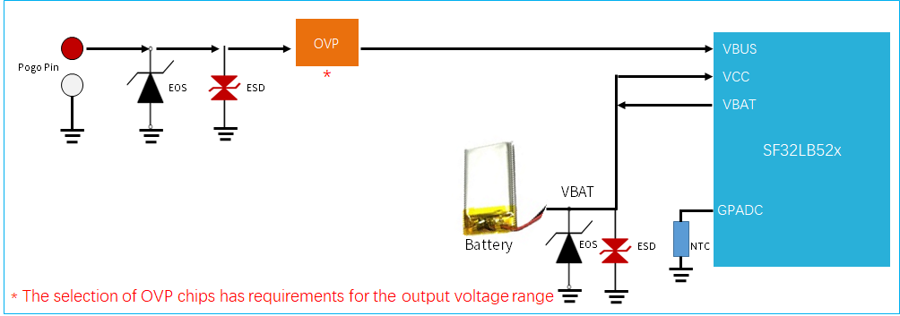  

<div align="center"> Figure 4-3 Schematic of Integrated Charging Management Circuit </div>   <br>  <br>  <br>

##### Selection of OVP Chip when Using Integrated Charging Management Module

The input voltage range for the VBUS pin of the SF32LB52x is 4.5V ~ 5.5V, so only the following two types of OVP chips can be selected:
- OVP chips with adjustable OVLO, reference chip model AW32905FCR
- OVP chips with Regulator output, reference chip models SGM4064YDE8G, LP5305AQVF

Figure 4-4 shows a typical application circuit for an OVP chip with adjustable OVLO, where the output voltage VIN_OVLO of the OVP chip should be set between 5.2V and 5.5V, considering the error of the chip and resistors. The specific formula is:
  <br>  <br>

**Requirement: The error of VOVLO_TH should be ≤3%, and the resistance error of R1 and R2 should be ≤1%**

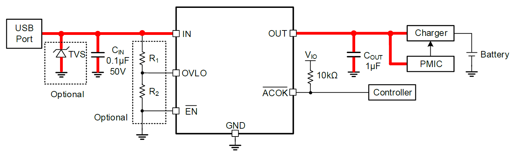  

<div align="center"> Figure 4-4 Application Circuit Diagram of OVP Chip with Adjustable OVLO </div>   <br>  <br>  <br>

Figure 4-5 is a typical application circuit diagram of an OVP chip with a Regulator output, where the Regulator of the OVP chip outputs a fixed voltage less than 5.5V to power the VBUS pin of the SF32LB52x.

**Requirement: The LDO output voltage of the OVP chip should be 4.5V ~ 5.4V**

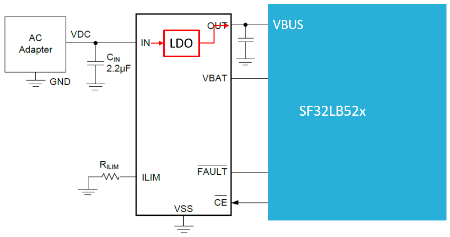  

<div align="center"> Figure 4-5 Application Circuit Diagram of OVP Chip with Regulator Output </div>   <br>  <br>  <br>

##### Precautions for Using the Internal Charging Management Module and Integrated LDO

:::{important}
**Precautions for Using the Internal Charging Management Module of SF32LB52x:**
- Input voltage range for VBUS: 4.6V~5.5V
- Input voltage range for VCC: 3.2V~4.7V
- The default trickle charge current is 56mA
- The default voltage for transitioning from trickle charge to constant current is 3.0V
- The default constant current is 65mA, adjustable within the range of 5~560mA
- The default full charge voltage is 4.2V, adjustable up to a maximum of 4.45V
- The re-charge voltage is the full charge voltage - 0.15V
- The charger must provide at least 350mA of power on the VBUS
- Pay attention to the DC impedance on the VBUS path; it should not be too high. The voltage at the VBUS pin of the chip must not drop below 4.6V during the entire charging process when the maximum current is reached
- When using wireless charging, ensure that the power supply capability of the wireless charger exceeds the constant current charging current.

**Precautions for Using the Integrated LDO of SF32LB52x:**
- The total capacitance on the output paths of the internally integrated VDD33_VOUT1 and VDD33_VOUT2 should not exceed 9.6uF
- AVDD33_AUD can only be powered by VDD33_VOUT1, not by VSYS
- The LCD cannot be powered by the internal LDO; it must be powered by an external LDO
:::

#### How to Reduce Standby Power Consumption

To meet the long battery life requirements of watch products, it is recommended to use load switches for dynamic power management of various functional modules in hardware design; if the module or path is always on, select appropriate components to reduce the static current.

As shown in Figure 4-6, in the typical power structure diagram of the SF32LB52x system, it is recommended to power the Motor with VDD33_VOUT2, and power external Flash and Sensors with VDD33_VOUT1. The LCD should be powered by an external LDO.

When designing, pay attention to the hardware default state of the GPIO pins controlling the power switches, and add pull-up or pull-down resistors with M-level resistance to ensure that the load switches are off by default.

In the selection of power components, choose LDOs and Load Switch chips with low static current Iq and low shutdown current Istb, especially for always-on power chips, pay attention to the Iq parameter.

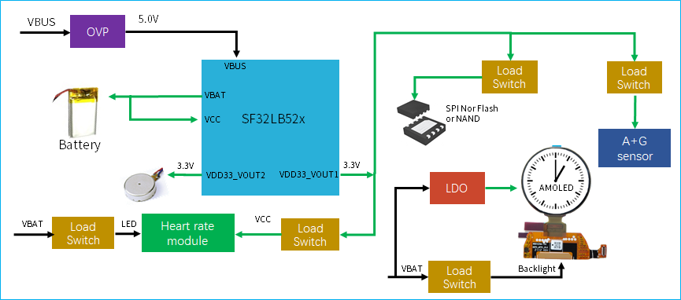  

<div align="center"> Figure 4-6 SF32LB52x System Power Structure Diagram </div>   <br>  <br>  <br>

### Processor Operating Modes and Wake-up Sources

<div align="center"> Table 4-4 CPU Mode Table </div>

```{table}

|Operating Mode|CPU |Peripherals |SRAM |IO |LPTIM |Wake-up Source |Wake-up Time |
|:--|:-------|:----|:----|:----|:---- |:---- |:----   |
|Active |Run |Run |Accessible |Toggle |Run |- |- |
|Sleep |Stop |Run |Accessible |Toggle |Run |Any Interrupt |<0.5us |
|DeepSleep |Stop |Stop |Not Accessible, Fully Retained |Level Hold |Run |RTC, Wake-up IO, GPIO, LPTIM, Bluetooth |250us |
|Standby |Reset |Reset |Not Accessible, Fully Retained |Level Hold |Run |RTC, Wake-up IO, LPTIM, Bluetooth |1ms |
|Hibernate |Reset |Reset |Not Accessible, Not Retained |High Impedance |Reset |RTC, Wake-up IO |>2ms |
```

As shown in Table 4-5, the entire series of chips supports 15 wake-up interrupt sources in Standby and Hibernate modes.

<div align="center"> Table 4-5 Interrupt Wake-up Source Table </div>

```{table}

|Interrupt Source|Pin |Detailed Description |
|:--|:-------|:--------|
|LWKUP_PIN0 |PA24 |Interrupt Signal 0 |
|LWKUP_PIN1 |PA25 |Interrupt Signal 1 |
|LWKUP_PIN2 |PA26 |Interrupt Signal 2 |
|LWKUP_PIN3 |PA27 |Interrupt Signal 3 |
|LWKUP_PIN10 |PA34 |Interrupt Signal 10 |
|LWKUP_PIN11 |PA35 |Interrupt Signal 11 |
|LWKUP_PIN12 |PA36 |Interrupt Signal 12 |
|LWKUP_PIN13 |PA37 |Interrupt Signal 13 |
|LWKUP_PIN14 |PA38 |Interrupt Signal 14 |
|LWKUP_PIN15 |PA39 |Interrupt Signal 15 |
|LWKUP_PIN16 |PA40 |Interrupt Signal 16 |
|LWKUP_PIN17 |PA41 |Interrupt Signal 17 |
|LWKUP_PIN18 |PA42 |Interrupt Signal 18 |
|LWKUP_PIN19 |PA43 |Interrupt Signal 19 |
|LWKUP_PIN20 |PA44 |Interrupt Signal 20 |
```

### Clock
The chip requires two external clock sources: a 48MHz main crystal and a 32.768KHz RTC crystal. The specific specifications and selection criteria for the crystals are as follows:

:::{important}

<div align="center"> Table 4-6 Crystal Specifications </div>

```{table}
:align: center
| Crystal | Crystal Specification Requirements | Detailed Description |
|:--|:-------|:--------|
| 48MHz | 7pF≦CL≦12pF (recommended value 8.8pF) △F/F0≦±10ppm ESR≦30 ohms (recommended value 22ohms) | Crystal power consumption is related to CL and ESR. The smaller the CL and ESR, the lower the power consumption. For optimal power performance, it is recommended to use materials with relatively smaller CL and ESR values within the required range. Reserve parallel matching capacitors next to the crystal. When CL<12pF, no capacitors need to be soldered. |
| 32.768KHz | CL≦12.5pF (recommended value 7pF) △F/F0≦±20ppm ESR≦80k ohms (recommended value 38Kohms) | Crystal power consumption is related to CL and ESR. The smaller the CL and ESR, the lower the power consumption. For optimal power performance, it is recommended to use materials with relatively smaller CL and ESR values within the required range. Reserve parallel matching capacitors next to the crystal. When CL<12.5pF, no capacitors need to be soldered. |
```

<div align="center"> Table 4-7 Recommended Crystal List </div>

```{table}

| Model | Manufacturer | Parameters |
|:---|:-------|:--------|
| E1SB48E001G00E | Hosonic | F0 = 48.000000MHz, △F/F0 = -6 ~ 8 ppm, CL = 8.8 pF, ESR = 22 ohms Max TOPR = -30 ~ 85℃, Package = (2016 metric) |
| ETST00327000LE | Hosonic | F0 = 32.768KHz, △F/F0 = -20 ~ 20 ppm, CL = 7 pF, ESR = 70K ohms Max TOPR = -40 ~ 85℃, Package = (3215 metric) |
| SX20Y048000B31T-8.8 | TKD | F0 = 48.000000MHz, △F/F0 = -10 ~ 10 ppm, CL = 8.8 pF, ESR = 40 ohms Max TOPR = -20 ~ 75℃, Package = (2016 metric) |
| SF32K32768D71T01 | TKD | F0 = 32.768KHz, △F/F0 = -20 ~ 20 ppm, CL = 7 pF, ESR = 70K ohms Max TOPR = -40 ~ 85℃, Package = (3215 metric) |
```
**
Note: The ESR of SX20Y048000B31T-8.8 is slightly larger, which will also result in slightly higher static power consumption.
When routing the PCB, at least the second layer GND copper should be removed under the crystal to reduce the parasitic load capacitance on the clock signal.
**
:::

For detailed material certification information, please refer to:
[SIFLI-MCU-AVL-Certification Table](index)

### RF

The RF trace requirement is 50ohms characteristic impedance. If the antenna is well-matched, no additional components are needed on the RF path. It is recommended to reserve a π-type matching network for stray filtering or antenna matching.

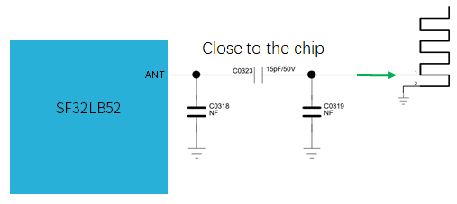  

<div align="center"> Figure 4-7 RF Circuit Diagram </div>   <br>  <br>  <br>

### Display

The chip supports 3-Line SPI, 4-Line SPI, Dual data SPI, Quad data SPI, and serial JDI interfaces. It supports 16.7M-colors (RGB888), 262K-colors (RGB666), 65K-colors (RGB565), and 8-color (RGB111) color depth modes. The maximum supported resolution is 512RGBx512. The supported LCD driver list is shown in Table 4-8.

<div align="center"> Table 4-8 Supported LCD Driver List </div>

```{table}

| Model | Manufacturer | Resolution | Type | Interface |
| :-- | :-- | :-- | :-- | :-- |
| RM69090 | Raydium | 368*448 | Amoled | 3-Line SPI, 4-Line SPI, Dual data SPI, Quad data SPI, MIPI-DSI |
| RM69330 | Raydium | 454*454 | Amoled | 3-Line SPI, 4-Line SPI, Dual data SPI, Quad data SPI, 8-bits 8080-Series MCU, MIPI-DSI |
| ILI8688E | ILITEK | 368*448 | Amoled | Quad data SPI, MIPI-DSI |
| SH8601A | Shenghe Technology | 454*454 | Amoled | 3-Line SPI, 4-Line SPI, Dual data SPI, Quad data SPI, 8-bits 8080-Series MCU, MIPI-DSI |
| SPD2012 | Solomon | 356*400 | TFT | Quad data SPI |
| GC9C01 | Galaxycore | 360*360 | TFT | Quad data SPI |
| GC9B71 | Galaxycore | 320*380 | TFT | Quad data SPI |
| ST77903 | Sitronix | 400*400 | TFT | Quad data SPI |
| ICNA3311 | Chipone | 454*454 | Amoled | Quad data SPI |
| FT2308 | FocalTech | 410*494 | Amoled | Quad data SPI |
```

#### SPI/QSPI Display Interface

The chip supports 3/4-wire SPI and Quad-SPI interfaces to connect to LCD displays. The signal descriptions are shown in the table below.

<div align="center"> Table 4-9 SPI/QSPI Signal Connection Methods </div>

```{table}

|spi signal|Pin   |Detailed Description  |
|:--|:-------|:--------|
|CSx |PA03 |Enable signal |
|WRx_SCL |PA04 |Clock signal |
|DCx |PA06 |Data/command signal in 4-wire SPI mode, Data1 in Quad-SPI mode  |
|SDI_RDx |PA05 |Data input signal in 3/4-wire SPI mode, Data0 in Quad-SPI mode  |
|SDO |PA05 |Data output signal in 3/4-wire SPI mode, please short to SDI_RDX |
|D[0] |PA07 |Data2 in Quad-SPI mode |
|D[1] |PA08 |Data3 in Quad-SPI mode |
|RESET |PA00 |Reset display signal |
|TE |PA02 |Tearing effect to MCU frame signal |
```

#### JDI Display Interface

The chip supports a parallel JDI interface to connect to an LCD display, as shown in the table below.

<div align="center"> Table 4-10 Parallel JDI Screen Signal Connections </div>

```{table}


| JDI Signal  | I/O  | Detailed Description   |
|:--|:-------|:--------|
| JDI_VCK  | PA39 | Shift clock for the vertical driver                  |
| JDI_VST  | PA08 | Start signal for the vertical driver                 |
| JDI_XRST | PA40 | Reset signal for the horizontal and  vertical driver |
| JDI_HCK  | PA41 | Shift  clock for the horizontal driver               |
| JDI_HST  | PA06 | Start signal for the horizontal driver               |
| JDI_ENB  | PA07 | Write enable signal for the pixel memory             |
| JDI_R1   | PA05 | Red image data (odd pixels)                          |
| JDI_R2   | PA42 | Red image data (even pixels)                         |
| JDI_G1   | PA04 | Green image data (odd pixels)                        |
| JDI_G2   | PA43 | Green image data (even pixels)                       |
| JDI_B1   | PA03 | Blue image data (odd pixels)                         |
| JDI_B2   | PA02 | Blue image data (even pixels)                        |
```


#### Touch and Backlight Interface

The chip supports an I2C format touch screen control interface and touch status interrupt input, and also supports a single PWM signal to control the enable and brightness of the backlight power, as shown in the table below.

<div align="center"> Table 4-11 Touch and Backlight Control Connections </div>

```{table}

| Touch Screen and Backlight Signal | Pin | Detailed Description                   |
| ---------------- | ---- | -------------------------- |
| Interrupt        | PA43 | Touch status interrupt signal (can wake up) |
| I2C1_SCL         | PA42 | Touch screen I2C clock signal        |
| I2C1_SDA         | PA41 | Touch screen I2C data signal        |
| BL_PWM           | PA01 | Backlight PWM control signal            |
| Reset            | PA44 | Touch reset signal               |
```

### Storage
#### Memory Connection Interface Description
The chip supports four types of external storage media: SPI Nor Flash, SPI NAND Flash, SD NAND Flash, and eMMC.

<div align="center"> Table 4-12 SPI Nor/Nand Flash Signal Connections </div>

```{table}

| Flash Signal | I/O Signal | Detailed Description                                    |
| ---------- | ------- | ------------------------------------------- |
| CS#        | PA12    | Chip select, active low.                    |
| SO         | PA13    | Data Input (Data Input Output 1)            |
| WP#        | PA14    | Write Protect Output (Data Input Output  2) |
| SI         | PA15    | Data Output (Data Input Output 0)           |
| SCLK       | PA16    | Serial Clock Output                         |
| Hold#      | PA17    | Data Output (Data Input Output 3)           |
```


<div align="center"> Table 4-13 SD Nand Flash and eMMC Signal Connections </div>

```{table}

| Flash Signal | I/O Signal | Detailed Description |
| ------------ | ---------- | -------------------- |
| SD2_CMD      | PA15       | Command signal       |
| SD2_D1       | PA17       | Data 1               |
| SD2_D0       | PA16       | Data 0               |
| SD2_CLK      | PA14       | Clock signal         |
| SD2_D2       | PA12       | Data 2               |
| SD2_D3       | PA13       | Data 3               |
```
:::{note}
The eMMC chip has two power domains, VCC and VCCQ. Method 1: Both power supplies can be controlled together, resulting in low power consumption during shutdown, but the eMMC takes longer to recover from sleep, leading to higher average CPU power consumption. Method 2: VCC can be controlled separately, while VCCQ remains powered, resulting in higher power consumption during shutdown compared to Method 1, but the eMMC recovers faster from sleep, leading to lower average CPU power consumption.
:::

#### Boot Configuration

The chip supports booting from internal SPI Nor Flash, external SPI Nor Flash, external SPI Nand Flash, and external SD Nand Flash. Specifically:
- SF32LB520Ux6 has an internal SPI Nor Flash and boots from the internal flash by default.
- SF32LB523/5/7Ux6 has an internal PSRAM and must boot from an external storage medium.

<!-- The image here needs to be modified, with different versions for A3 and B3 -->

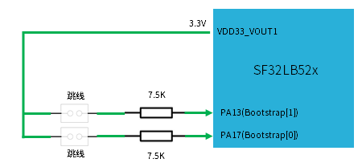  

<div align="center"> Figure 4-8 Recommended Bootstrap Pin Circuit Diagram </div>   <br>  <br>  <br>

<!-- eMMC is only supported by B3, A3 needs to be removed -->
<div align="center"> Table 4-14 Boot Option Configuration </div>

```{table}

|Bootstrap[1] (PA13) |Bootstrap[0] (PA17)    |Boot From External Memory  |
| ------------ | ------------ | -------------- |
| L            | L            | SPI Nor Flash  |
| L            | H            | SPI Nand Flash |
| H            | X            | SD Nand Flash  |
```

#### Power Control for Boot Storage Medium
The chip supports power switch control for the boot storage medium to reduce power consumption during shutdown. The power switch enable pin must be controlled using PA21, and the enable level requirement is [High to turn on, Low to turn off].

:::{important}
- For SF32LB520Ux6, which has an internal flash, use VDD33_VOUT1 to power VDD18_VOUT and set the internal LDO of VDD18_VOUT to the off state.
- For SF32LB523/5/7Ux6, which has an internal PSRAM, use the internal LDO for power, and an external VDD18_VOUT power supply is sufficient.
- When the external storage medium is a Nor Flash, use VDD33_VOUT1 for power, and no additional power switch is required.
- When the external storage medium is SPI Nand or SD Nand, use VDD33_VOUT1 for power, and a power switch is required.
- In the reference design, pull-up resistors are reserved for PA13 and PA17. Select the pull-up resistor based on the storage medium type, and a 7.5K resistor is recommended.
:::

### Buttons
#### Power On/Off Button
PA34 of the chip supports long-press reset functionality and can be designed as a button to achieve power on/off and long-press reset functions. The long-press reset function of PA34 requires a high level to be effective, so it is designed to be pulled low by default, and the level becomes high when the button is pressed, as shown in Figure 4-9.

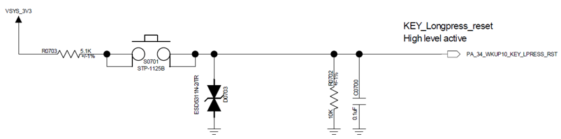  

<div align="center"> Figure 4-9 Power On/Off Button Circuit Diagram </div>   <br>  <br>  <br>

#### Mechanical Knob Button

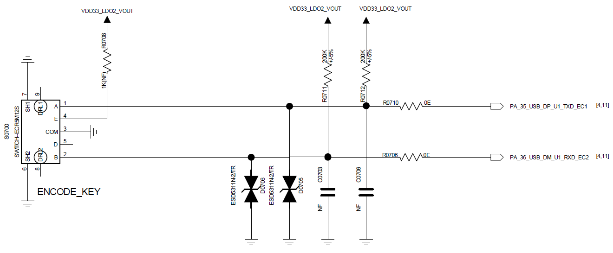  

<div align="center"> Figure 4-10 Mechanical Knob Button Circuit Diagram </div>   <br>  <br>  <br>

### Vibration Motor

The chip supports PWM output to control the vibration motor.

<!-- The content here needs to be handled differently for A3 and B3 -->
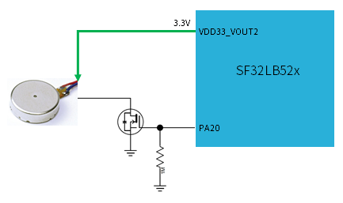  

<div align="center"> Figure 4-11 Vibration Motor Circuit Diagram </div>  <br> <br> <br>

### Audio Interface

The audio-related interfaces of the chip are shown in Table 4-15. The audio interface signals have the following characteristics:
1. Supports one single-ended ADC input, connected to an external analog MIC, with a coupling capacitor of at least 2.2uF added in between, and the power supply for the analog MIC is connected to the MIC_BIAS power output pin of the chip.
2. Supports one differential DAC output, connected to an external analog audio PA. The DAC output traces should be routed as differential lines with proper ground shielding, and the following should be noted: Trace Capacitance < 10pF, Length < 2cm.

<div align="center"> Table 4-15 Audio Signal Connection Methods </div>

```{table}

|Audio Signal |Pin   |Detailed Description |
|:---|:---|:---|
|BIAS |MIC_BIAS |Microphone power       |
|AU_ADC1P |ADCP |Single-ended analog MIC input  |
|AU_DAC1P |DACP |Differential analog output P    |
|AU_DAC1N |DACN |Differential analog output N    |
```

The recommended circuit for an analog MEMS MIC is shown in Figure 4-12, and the recommended circuit for an analog ECM MIC single-ended input is shown in Figure 4-13. Both MEMS_MIC_ADC_IN and ECM_MIC_ADC_IN are connected to the ADCP input pin of the SF32LB52x.

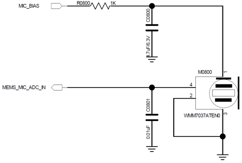  

<div align="center"> Figure 4-12 Analog MEMS MIC Single-Ended Input Circuit Diagram </div>   <br>  <br>  <br>

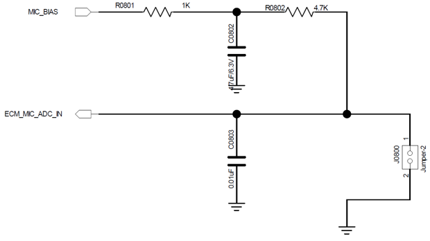  

<div align="center"> Figure 4-13 Analog ECM Single-Ended Input Circuit Diagram </div>   <br>  <br>  <br>

The recommended circuit for analog audio output is shown in Figure 4-14. Note that the differential low-pass filter within the dashed box should be placed close to the chip end.

  

<div align="center"> Figure 4-14 Analog Audio Output Circuit Diagram </div>   <br>  <br>  <br>

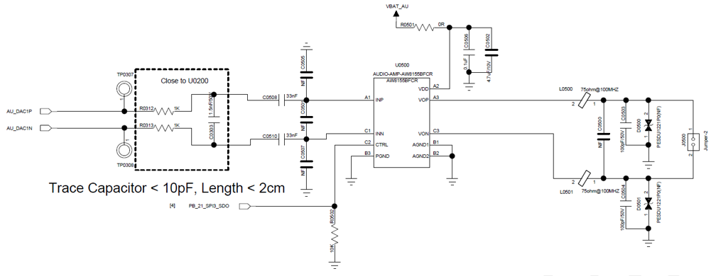  

<div align="center"> Figure 4-14 Analog Audio PA Circuit Diagram </div>   <br>  <br>  <br>


### Sensors

The chip supports heart rate, acceleration, and geomagnetic sensors. The power supply for the sensors is controlled using a Load Switch with a low Iq to manage the power on and off.

### UART and I2C Pin Configuration

The chip supports the mapping of UART and I2C functions to any pin, and all PA interfaces can be mapped to UART or I2C function pins.

### GPTIM Pin Configuration

The chip supports the mapping of GPTIM functions to any pin, and all PA interfaces can be mapped to GPTIM function pins.

### Debug and Download Interface

The chip supports the DBG_UART interface for downloading and debugging, using a UART-to-USB dongle with a 3.3V interface connected to the PC.

The SWD interface and DBG_UART interface are multiplexed on PA18 and PA19, and are configured by default as DBG_UART upon power-up.

DBG_UART supports single-step debugging and log output; refer to the SFtool and Impeller user manuals for more details.

<div align="center"> Table 4-16 Debug Port Connection Method </div>

```{table}

|DBG Signal |Pin   |Detailed Description |
|:---|:---|:---|
|DBG_UART_RXD |PA18 |Debug UART Receive |
|DBG_UART_TXD |PA19 |Debug UART Transmit |
```

### Production Programming and Crystal Calibration

Sichip provides an offline programmer to complete the production programming and crystal calibration. When designing the hardware, please ensure that at least the following test points are reserved: PVDD, GND, AVDD33, DB_UART_RXD, DB_UART_RXD, PA01.

For detailed programming and crystal calibration, refer to the “**_Offline Programmer User Guide.pdf” document, which is included in the development package.


### Schematic and PCB Drawing Checklists

Refer to the “**_Schematic checklist_**.xlsx” and “**_PCB checklist_**.xlsx” documents, which are included in the development package.


## PCB Design Guidelines

### PCB Package Design

The QFN68L package dimensions for the SF32LB52x series chips are: 7mm x 7mm x 0.85mm; number of pins: 68; pin pitch: 0.35mm. The detailed dimensions are shown in Figure 5-1.

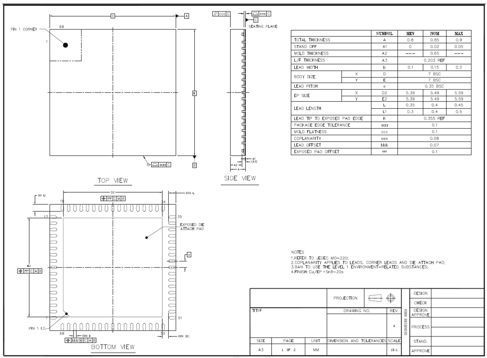  

<div align="center"> Figure 5-1 QFN68L Package Dimensions </div>   <br>  <br>  <br>


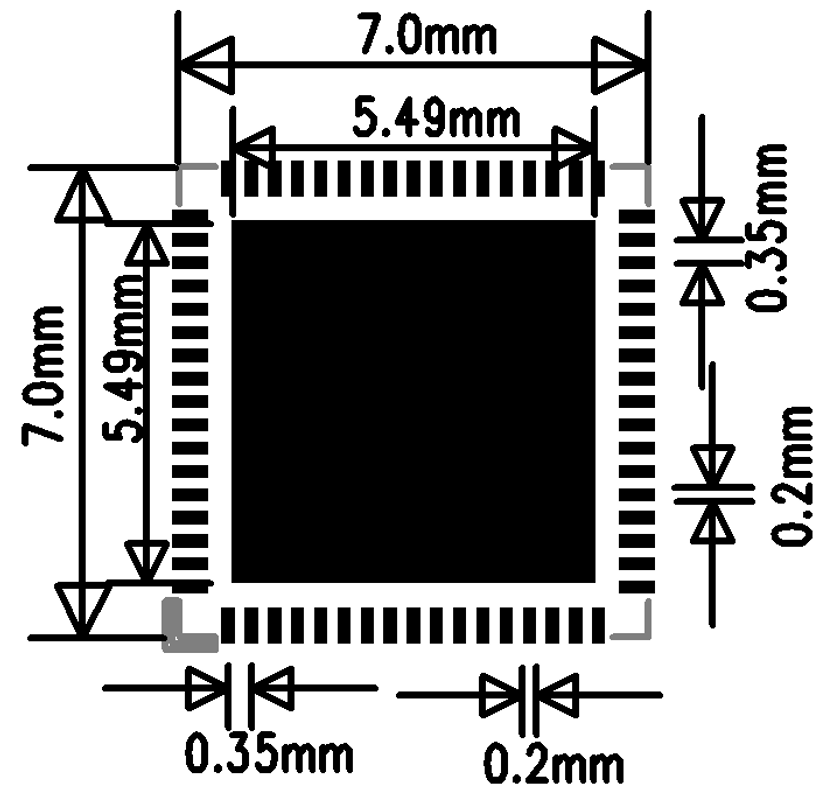  

<div align="center"> Figure 5-2 QFN68L Package Shape </div>   <br>  <br>  <br>


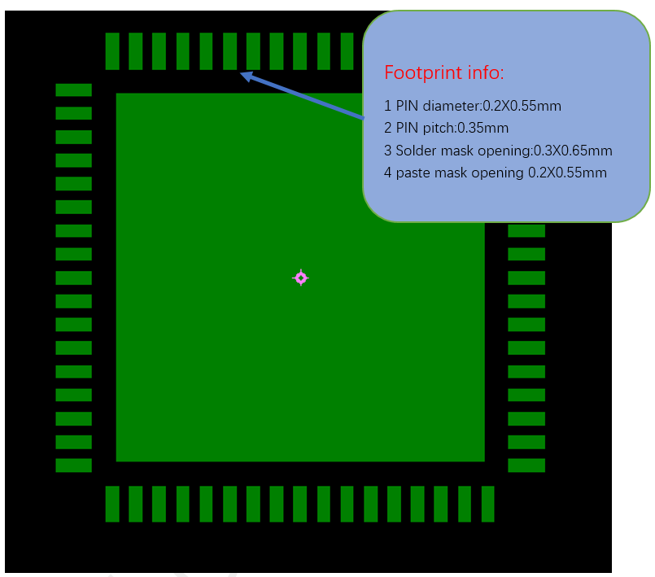  

<div align="center"> Figure 5-3 QFN68L Package PCB Pad Design Reference </div>   <br>  <br>  <br>


### PCB Layer Design

The SF32LB52x series chips support single and double-sided layouts. Components can be placed on a single side, or capacitors and other components can be placed on the back of the chip. The PCB supports PTH (Plated Through Hole) design, and a 4-layer PTH is recommended. The recommended stack-up structure is shown in Figure 5-4.

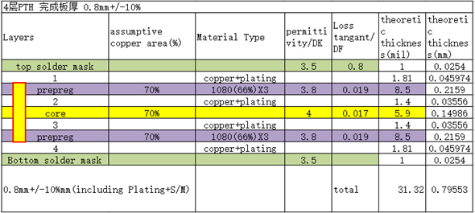  

<div align="center"> Figure 5-4 Recommended Stack-up Structure </div>   <br>  <br>  <br>


### General PCB Design Rules

General PCB design rules for PTH boards are shown in Figure 5-5.

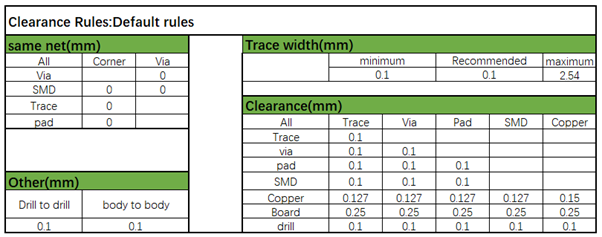  

<div align="center"> Figure 5-5 General Design Rules </div>   <br>  <br>  <br>


### PCB Trace Fan-out

For QFN package signal fan-out, all pins should be fanned out on the top layer, as shown in Figure 5-6.

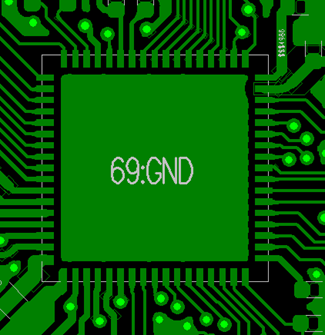  

<div align="center"> Figure 5-6 Top Layer Fan-out Reference </div>   <br>  <br>  <br>


### Clock Interface Traces

The crystal should be placed inside the shield, with a distance greater than 1mm from the PCB edge. It should be placed as far as possible from high-heat components such as PA, Charge, and PMU circuits, with a recommended distance of more than 5mm to avoid affecting the crystal frequency. The crystal circuit should have a clearance of more than 0.25mm to avoid other metals and components, as shown in Figure 5-7.

  

<div align="center"> Figure 5-7 Crystal Layout </div>   <br>  <br>  <br>


For the 48MHz crystal traces, it is recommended to route them on the top layer, with a length controlled between 3-10mm and a line width of 0.1mm. The traces must be surrounded by ground planes and should be kept away from VBAT, DC/DC, and high-speed signal lines. The area below the 48MHz crystal on the top layer and adjacent layers should be kept clear of other traces, as shown in Figures 5-8, 5-9, and 5-10.

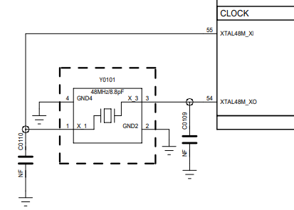  

<div align="center"> Figure 5-8 48MHz Crystal Schematic </div>   <br>  <br>  <br>


  

<div align="center"> Figure 5-9 48MHz Crystal Trace Model </div>   <br>  <br>  <br>


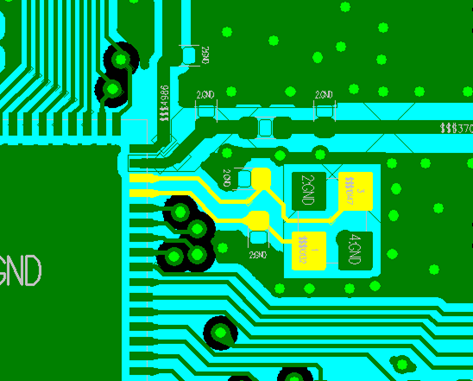  

<div align="center"> Figure 5-10 48MHz Crystal Trace Reference </div>   <br>  <br>  <br>

32.768KHz crystal traces are recommended to be routed on the surface layer, with a length controlled to ≤10mm and a line width of 0.1mm. The parallel routing distance between 32K_XI/32_XO should be ≥0.15mm, and a ground plane must be placed around the crystal. The area below and adjacent to the crystal should be kept free of other traces, as shown in Figures 5-11, 5-12, and 5-13.

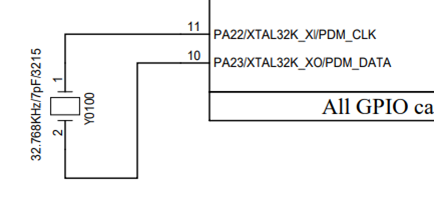  

<div align="center"> Figure 5-11 32.768KHz Crystal Schematic </div>   <br>  <br>  <br>


  

<div align="center"> Figure 5-12 32.768KHz Crystal Trace Model </div>   <br>  <br>  <br>


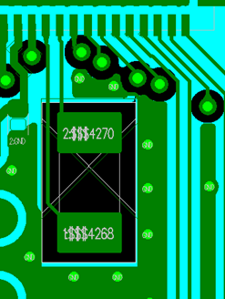  

<div align="center"> Figure 5-13 32.768KHz Crystal Trace Reference </div>   <br>  <br>  <br>


### RF Interface Traces

The RF matching circuit should be placed as close as possible to the chip end, not near the antenna end. The filter capacitors for the AVDD_BRF RF power supply should be placed as close as possible to the chip pins, and the capacitor ground pins should be connected directly to the main ground. The schematic and PCB layout of the π network and power circuit are shown in Figures 5-14 and 5-15.

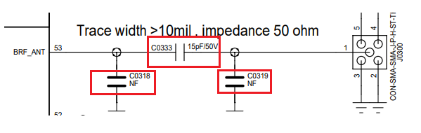  

<div align="center"> Figure 5-14 π Network and Power Circuit Schematic </div>   <br>  <br>  <br>


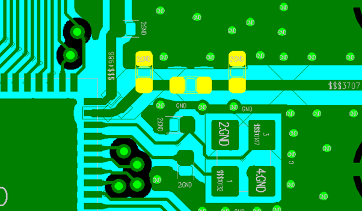  

<div align="center"> Figure 5-15 π Network and Power Circuit PCB Layout </div>   <br>  <br>  <br>


RF traces are recommended to be routed on the surface layer to avoid vias that can affect RF performance. The line width should be greater than 10mil, and a ground plane should be placed around the traces to avoid sharp and right angles. The RF traces should be controlled to 50 ohm impedance, and additional ground vias should be placed on both sides, as shown in Figures 5-16 and 5-17.

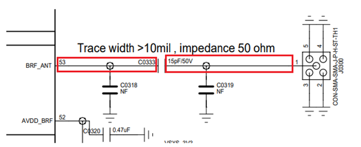  

<div align="center"> Figure 5-16 RF Signal Circuit Schematic </div>   <br>  <br>  <br>


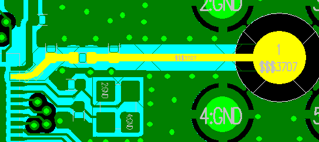  

<div align="center"> Figure 5-17 RF Signal PCB Trace Layout </div>   <br>  <br>  <br>


### Audio Interface Traces
AVDD33_AUD is the power supply pin for audio, and its filter capacitors should be placed close to the corresponding pins to ensure good connection to the main ground of the PCB. MIC_BIAS is the power output pin for the microphone peripheral, and its corresponding filter capacitors should be placed close to the corresponding pins. Similarly, the filter capacitors for the AUD_VREF pin should also be placed close to the pins, as shown in Figures 5-18a and 5-18b.

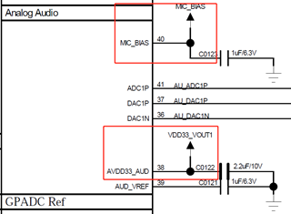  

<div align="center"> Figure 5-18a Audio Power Filter Circuit </div>   <br>  <br>  <br>


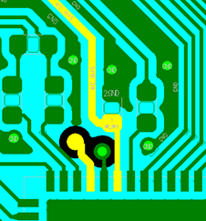  

<div align="center"> Figure 5-18b Audio Power Filter Circuit PCB Trace Reference </div>   <br>  <br>  <br>


For the ADCP pin, which is the analog signal input, the corresponding circuit components should be placed as close as possible to the chip pins, and the trace length should be kept as short as possible. A ground plane should be placed around the traces to avoid other strong interference signals, as shown in Figures 5-19a and 5-19b.

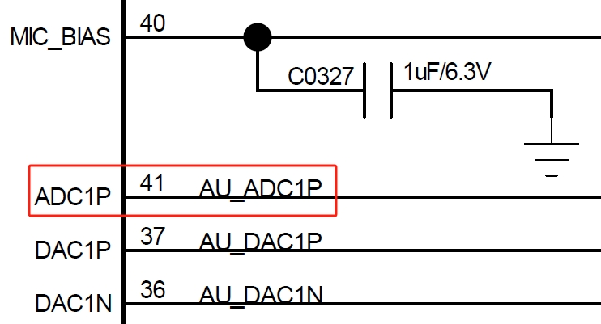  

<div align="center"> Figure 5-19a Analog Audio Input Schematic </div>   <br>  <br>  <br>


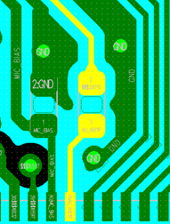  

<div align="center"> Figure 5-19b Analog Audio Input PCB Design </div>   <br>  <br>  <br>


For the DACP/DACN pins, which are the analog signal outputs, the corresponding circuit components should be placed as close as possible to the chip pins. Each P/N pair should be routed as differential lines, and the trace length should be kept as short as possible with parasitic capacitance less than 10pf. A ground plane should be placed around the traces to avoid other strong interference signals, as shown in Figures 5-20a and 5-20b.

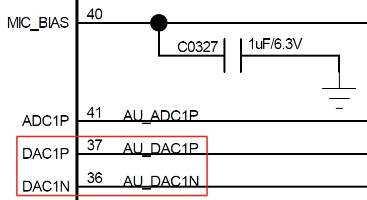  

<div align="center"> Figure 5-20a Analog Audio Output Schematic </div>   <br>  <br>  <br>


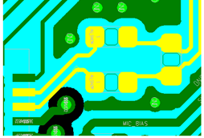  

<div align="center"> Figure 5-20b Analog Audio Output PCB Design </div>   <br>  <br>  <br>


### USB Interface Traces

The USB traces PA35(USB DP)/PA36(USB_DN) must first pass through the ESD device pins and then to the chip end. The ground pins of the ESD device should be well connected to the main ground. The traces should be routed as differential lines and controlled to 90 ohm differential impedance, and a ground plane should be placed around the traces, as shown in Figures 5-21a and 5-21b.

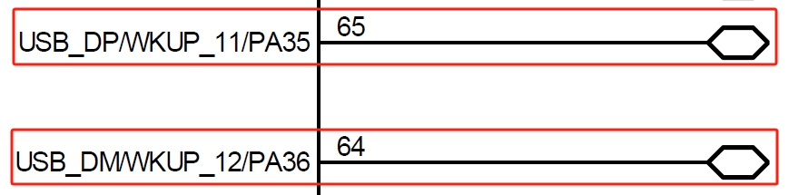  

<div align="center"> Figure 5-21a USB Signal Schematic </div>   <br>  <br>  <br>

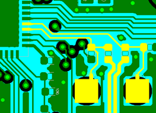  

<div align="center"> 5-21b USB Signal PCB Design </div>   <br>  <br>  <br>

Figure 5-22a is the component layout reference for USB signals, and Figure 5-22b is the PCB routing model.

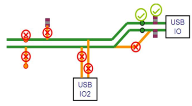  

<div align="center"> Figure 5-22a USB Signal Component Layout Reference </div>   <br>  <br>  <br>

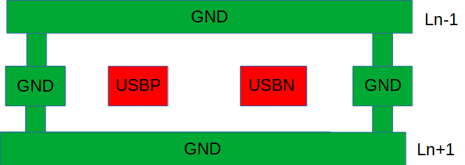  

<div align="center"> Figure 5-22b USB Signal Routing Model </div>   <br>  <br>  <br>

### SDIO Interface Routing
SDIO signal traces should be routed together to avoid separation, with the entire trace length ≤50mm, and the length difference within the group controlled to ≤6mm. The SDIO interface clock signal must be surrounded by ground, and the DATA and CMD signals also need to be surrounded by ground, as shown in Figures 5-23a and 5-23b.

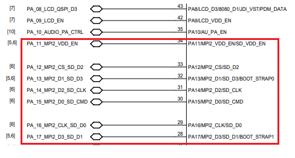  

<div align="center"> Figure 5-23a SDIO Interface Schematic </div>   <br>  <br>  <br>

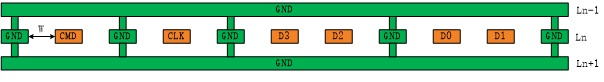  

<div align="center"> Figure 5-23b SDIO PCB Routing Model </div>   <br>  <br>  <br>

### DCDC Circuit Routing
The power inductor and filter capacitors of the DC-DC circuit must be placed close to the chip's pins. The BUCK_LX trace should be as short and wide as possible to ensure a low inductance in the entire DC-DC circuit loop; the BUCK_FB pin feedback line must not be too thin and must be greater than 0.25mm. All DC-DC output filter capacitors' ground pins should have multiple vias connecting to the main ground plane. The power inductor area must not have copper pour on the surface layer, and the adjacent layer must be a complete reference ground to avoid other traces passing through the inductor area, as shown in Figures 5-24a and 5-24b.

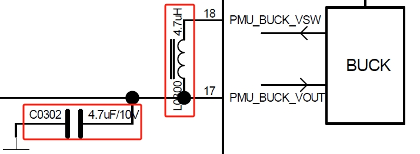  

<div align="center"> Figure 5-24a DC-DC Key Components Schematic </div>   <br>  <br>  <br>

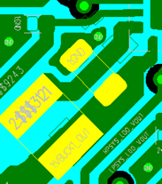  

<div align="center"> Figure 5-24b DC-DC Key Components PCB Layout </div>   <br>  <br>  <br>

### Power Supply Routing

VCC is the power input pin for the built-in PMU module of the chip. The corresponding capacitors must be placed close to the pins, and the traces should be as wide as possible, not less than 0.4mm, as shown in Figures 5-25a and 5-25b.

<!-- This content requires different handling for A3 and B3 -->
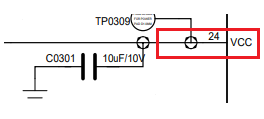  

<div align="center"> Figure 5-25a VCC Power Routing Diagram </div>   <br>  <br>  <br>

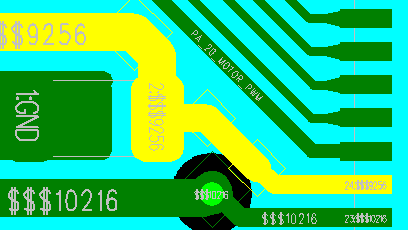  

<div align="center"> Figure 5-25b VCC Power Routing Diagram </div>   <br>  <br>  <br>

The filter capacitors for VDD_VOUT1, VDD_VOUT2, VDD_RET, VDD_RTC, VDD18_VOUT, VDD33_VOUT1, VDD33_VOUT2, AVDD33_AUD, and AVDD_BRF pins must be placed close to the corresponding pins. The trace width must meet the input current requirements and should be as short and wide as possible to reduce power ripple and improve system stability.

<!-- The charging circuit content needs to be added for the A3 version -->
### Charging Circuit Routing

VBUS and VBAT are the input and output pins of the built-in charging module of the chip. The corresponding filter capacitors must be placed close to the pins. Since the charging loop current is relatively high, the trace width for the pins must be at least 0.4mm. Sensitive traces must not run parallel to these traces to avoid interference during charging. The traces should be routed in a star configuration and should not share paths with other traces to avoid interference with other circuit modules during charging.

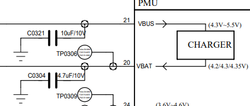  

<div align="center"> Figure 5-26a VBUS&VBAT Power Routing Diagram </div>   <br>  <br>  <br>

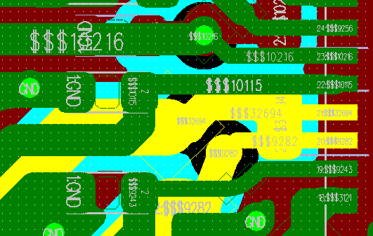  

<div align="center"> Figure 5-26b VBUS&VBAT Power Routing Diagram </div>   <br>  <br>  <br>

### Other Interface Routing

Pins configured as GPADC signal pins must be surrounded by ground and should be kept away from other interference signals, such as battery level circuits and temperature check circuits.

### EMI&ESD
- Avoid long-distance routing on the surface layer outside the shield, especially for clock and power signals, which should be routed on inner layers and not on the surface layer.
- ESD protection devices must be placed close to the corresponding connector pins. Signal traces should pass through the ESD protection device pins first to avoid branching before passing through the ESD protection device.
- The ground pins of ESD devices must have vias connecting to the main ground, with short and wide ground traces to reduce impedance and improve ESD device performance.

### Other

The USB charging test points must be placed before the TVS diode, and the battery connector TVS diode must be placed at the front of the platform. The traces must ensure that they pass through the TVS diode first and then to the chip, as shown in Figure 5-27.

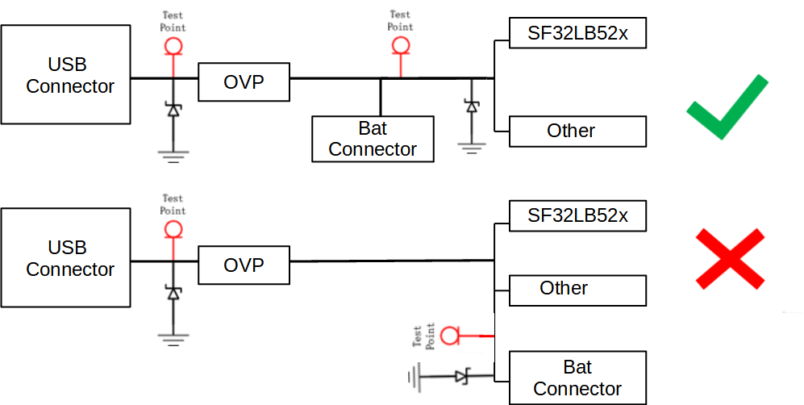  

<div align="center"> Figure 5-27 Power TVS Layout Reference </div>   <br>  <br>  <br>


<div align="center"> Figure 5-28 TVS Trace Reference </div>   <br>  <br>  <br>

The ground pin of the TVS diode should avoid being connected to ground via a long trace, as shown in Figure 5-28.

## Revision History

```{table}
:align: left
:name: sf32lb52X-B-history

|Version |Date   |Release Notes |
|:---|:---|:---|
|0.0.1 |10/2024 |Initial version |

```