# SF32LB52X - Hardware Design Guide

:::{attention}
This document is applicable to chips with suffix letters `B, E, G, J`, which are powered by 3.3V; chips with suffix letter `D` are powered by 1.8V.

For chips with suffix numbers `0, 3, 5, 7`, which belong to the SF32LB52x series, they are powered by a lithium battery and support USB charging. Please refer to the [Hardware Design Guide](/hardware/SF32LB520-3-5-7-HW-Application)
:::

## Introduction

The primary purpose of this document is to assist developers in completing the development of watch solutions based on the SF32LB52X series of chips. This document focuses on hardware design considerations during the development process, aiming to reduce the workload of developers and shorten the product's time to market.

The SF32LB52X is a series of highly integrated, high-performance MCU chips designed for ultra-low-power AIoT (Artificial Intelligence of Things) scenarios. The chip employs a big.LITTLE architecture based on the Arm Cortex-M33 STAR-MC1 processor, integrating a high-performance 2D/2.5D graphics engine, an AI neural network accelerator, dual-mode Bluetooth 5.3, and an audio CODEC. It can be widely used in various applications, including wearable electronic devices, smart mobile terminals, and smart home devices.

:::{attention}
The SF32LB52X is the **standard power supply version** of the SF32LB52 series, with a supply voltage of 2.97~3.63V (except for 52D, which is 1.71~1.98V) and does not support charging. It includes the following models:\
SF32LB52BU36, with 1MB QSPI-NOR Flash \
SF32LB52DUB6, with 4MB OPI-PSRAM \
SF32LB52EUB6, with 4MB OPI-PSRAM \
SF32LB52GUC6, with 8MB OPI-PSRAM \
SF32LB52JUD6, with 16MB OPI-PSRAM
:::

The processor's peripheral resources are as follows:

- 45x GPIO
- 3x UART
- 4x I2C
- 2x GPTIM
- 2x SPI
- 1x I2S audio interface
- 1x SDIO storage interface
- 1x PDM audio interface
- 1x differential analog audio output
- 1x single-ended analog audio input
- Supports single, dual, and quad data line SPI display interfaces, and serial JDI mode display interfaces
- Supports both GRAM and non-GRAM displays
- Supports UART download and software debugging

## Packaging

<div align="center"> Table 2-1 Packaging Information </div>

```{table}
:align: center
|Package Name|Dimensions|Pin Pitch|
|:--|:-|:-|
|QFN68L | 7x7x0.85 mm | 0.35 mm |
```

  

<div align="center"> Figure 2-1 QFN68L Pin Distribution </div>  <br> <br> <br>

## Typical Application Schemes

The following diagram is a typical block diagram of an SF32LB52X sports watch, which includes display, storage, sensors, vibration motor, and audio input and output functions.

<!-- The image here is problematic and needs to be replaced with the B3 version diagram -->
  

<div align="center"> Figure 3-1 Sports Watch Block Diagram </div>  <br> <br> <br>

:::{Note} 

   - Big.LITTLE dual-CPU architecture, balancing high performance and low power design requirements
   - Integrated PMU module
   - Supports TFT or AMOLED displays with QSPI interface, with a maximum resolution of 512*512
   - Supports PWM backlight control
   - Supports external QSPI NOR/NAND Flash and SD NAND Flash storage chips
   - Supports dual-mode Bluetooth 5.3
   - Supports analog audio input
   - Supports analog audio output
   - Supports PWM vibration motor control
   - Supports SPI/I2C interface accelerometer/magnetometer/gyroscope sensors
   - Supports SPI/I2C interface heart rate/blood oxygen/EKG/magnetometer sensors
   - Supports UART debugging and programming interfaces
   - Supports Bluetooth HCI debugging interface
   - Supports mass production programming
   - Supports crystal calibration function
   - Supports OTA online upgrade function
:::

## Schematic Design Guidelines

### Power Supply

#### Processor Power Supply Requirements

<div align="center"> Table 4-1 Power Supply Requirements </div>

```{table}
:align: center
|Power Supply Pin| Minimum Voltage(V) | Typical Voltage(V) | Maximum Voltage(V) | Maximum Current(mA) |   Detailed Description |
|:--|:--|:--|:--|:--|:----------------------------------------------------|
|PVDD       |2.97   |3.3        |3.63   |150    |PVDD system power input, connect a 10uF capacitor 
|BUCK_LX    |-      |1.25       |-      |50     |BUCK output pin, connect a 4.7uH inductor 
|BUCK_FB    |-      |1.25       |-      |50     |BUCK feedback and internal power input pin, connect to the other end of the inductor, and an external 4.7uF capacitor 
|VDD_VOUT1  |-      |1.1        |-      |50     |Internal LDO, connect an external 4.7uF capacitor, internal power, does not supply power to peripherals 
|VDD_VOUT2  |-      |0.9        |-      |20     |Internal LDO, connect an external 4.7uF capacitor, internal power, does not supply power to peripherals 
|VDD_RET    |-      |0.9        |-      |1      |Internal LDO, connect an external 0.47uF capacitor, internal power, does not supply power to peripherals 
|VDD_RTC    |-      |1.1        |-      |1      |Internal LDO, connect an external 1uF capacitor, internal power, does not supply power to peripherals 
|VDDIOA     |1.71   |1.8/3.3    |3.63   |-      |GPIO power input, connect an external 1uF capacitor 
|AVDD33     |2.97   |3.3        |3.63   |100    |3.3V analog power input, connect an external 4.7uF capacitor 
|AVDD33_AUD |2.97   |3.3        |3.63   |50     |3.3V audio power input, connect an external 2.2uF capacitor  
|VDD_SIP    |1.71   |1.8/3.3    |3.63   |30     |Internal LDO, or external power input{SUP}`(1)` , connect an external 1uF capacitor
|AVDD_BRF   |2.97   |3.3        |3.63   |100    |Analog power input, connect an external 4.7uF capacitor 
|MIC_BIAS   |1.4    |-          |2.8    |-      |MIC power output, connect an external 1uF capacitor 
```
:::{note} 
{SUP}`(1)`
* SF32LB52BU36, requires external 1.8V or 3.3V
* SF32LB52BU56, requires external 3.3V
* SF32LB52DUB6, requires external 1.8V
* SF32LB52E/G/JUx6, internal LDO directly powers, no external power required
:::
:::{important}
When the system is in Hibernate mode, the VDD_SIP power supply must be turned off, otherwise there is a risk of leakage current on the I/O of the integrated storage. The power control signal for VDD_SIP should use the dedicated PA21 pin.
:::

#### Processor BUCK Inductor Selection Requirements

**Power Inductor Key Parameters**
:::{important}
L(Inductance) = 4.7uH ± 20%, DCR(DC Resistance) ≦ 0.4 ohm, Isat(Saturation Current) ≧ 450mA.
:::

<!-- A3 version to add battery and charging control -->

#### How to Reduce Standby Power Consumption

To meet the long battery life requirements of watch products, it is recommended to use load switches for dynamic power management of various functional modules in hardware design; if the module or path is always on, select appropriate components to reduce the static current.

When designing, pay attention to the hardware default state of the GPIO pins controlling the power switches, and add pull-up or pull-down resistors with M-level resistance to ensure that the load switches are default off.

In terms of power component selection, choose LDOs and Load Switch chips with low static current Iq and low shutdown current Istb, especially for always-on power chips, pay attention to the Iq parameter.

### Processor Operating Modes and Wake-up Sources

<div align="center"> Table 4-4 CPU Mode Table </div>

```{table}
:align: center
|Operating Mode|CPU |Peripherals  |SRAM |IO   |LPTIM |Wake-up Source |Wake-up Time |
|:--|:-------|:----|:----|:----|:---- |:---- |:----   |
|Active |Run |Run |Accessible |Flippable |Run |- |- |
|Sleep |Stop |Run |Accessible |Flippable |Run |Any Interrupt |<0.5us |
|DeepSleep |Stop |Stop |Not Accessible, Fully Retained |Level Held |Run |RTC, Wake-up IO, GPIO, LPTIM, Bluetooth |250us |
|Standby |Reset |Reset |Not Accessible, Fully Retained |Level Held |Run |RTC, Wake-up IO, LPTIM, Bluetooth |1ms |
|Hibernate |Reset |Reset |Not Accessible, Not Retained |High Impedance |Reset |RTC, Wake-up IO |>2ms |
```

As shown in Table 4-5, the entire series of chips supports 15 wake-up interrupt sources in Standby and Hibernate modes.

<div align="center"> Table 4-5 Interrupt Wake-up Source Table </div>

```{table}
:align: center
|Interrupt Source|Pin   |Detailed Description  |
|:--|:-------|:--------|
|LWKUP_PIN0 |PA24 |Interrupt Signal 0 |
|LWKUP_PIN1 |PA25 |Interrupt Signal 1 |
|LWKUP_PIN2 |PA26 |Interrupt Signal 2 |
|LWKUP_PIN3 |PA27 |Interrupt Signal 3 |
|LWKUP_PIN10 |PA34 |Interrupt Signal 10 |
|LWKUP_PIN11 |PA35 |Interrupt Signal 11 |
|LWKUP_PIN12 |PA36 |Interrupt Signal 12 |
|LWKUP_PIN13 |PA37 |Interrupt Signal 13 |
|LWKUP_PIN14 |PA38 |Interrupt Signal 14 |
|LWKUP_PIN15 |PA39 |Interrupt Signal 15 |
|LWKUP_PIN16 |PA40 |Interrupt Signal 16 |
|LWKUP_PIN17 |PA41 |Interrupt Signal 17 |
|LWKUP_PIN18 |PA42 |Interrupt Signal 18 |
|LWKUP_PIN19 |PA43 |Interrupt Signal 19 |
|LWKUP_PIN20 |PA44 |Interrupt Signal 20 |
```

### Clock
The chip requires two external clock sources, a 48MHz main crystal and a 32.768KHz RTC crystal. The specific specifications and selection criteria for the crystals are as follows:

:::{important}

<div align="center"> Table 4-6 Crystal Specifications </div>
```

```{table}
:align: center
| Crystal | Crystal Specification Requirements | Detailed Description |
|:--|:-------|:--------|
| 48MHz | 7pF≦CL≦12pF (recommended value 8.8pF) △F/F0≦±10ppm ESR≦30 ohms (recommended value 22ohms) | Crystal power consumption is related to CL and ESR. The smaller the CL and ESR, the lower the power consumption. For optimal power performance, it is recommended to use materials with relatively smaller CL and ESR within the required range. Reserve parallel matching capacitors next to the crystal. When CL<12pF, no capacitors need to be soldered. |
| 32.768KHz | CL≦12.5pF (recommended value 7pF) △F/F0≦±20ppm ESR≦80k ohms (recommended value 38Kohms) | Crystal power consumption is related to CL and ESR. The smaller the CL and ESR, the lower the power consumption. For optimal power performance, it is recommended to use materials with relatively smaller CL and ESR within the required range. Reserve parallel matching capacitors next to the crystal. When CL<12.5pF, no capacitors need to be soldered. |
```

<div align="center"> Table 4-7 Recommended Crystal List </div>

```{table}
:align: center
| Model | Manufacturer | Parameters |
|:---|:-------|:--------|
| E1SB48E001G00E | Hosonic | F0 = 48.000000MHz, △F/F0 = -6 ~ 8 ppm, CL = 8.8 pF, ESR = 22 ohms Max TOPR = -30 ~ 85℃, Package = (2016 metric) |
| ETST00327000LE | Hosonic | F0 = 32.768KHz, △F/F0 = -20 ~ 20 ppm, CL = 7 pF, ESR = 70K ohms Max TOPR = -40 ~ 85℃, Package = (3215 metric) |
| SX20Y048000B31T-8.8 | TKD | F0 = 48.000000MHz, △F/F0 = -10 ~ 10 ppm, CL = 8.8 pF, ESR = 40 ohms Max TOPR = -20 ~ 75℃, Package = (2016 metric) |
| SF32K32768D71T01 | TKD | F0 = 32.768KHz, △F/F0 = -20 ~ 20 ppm, CL = 7 pF, ESR = 70K ohms Max TOPR = -40 ~ 85℃, Package = (3215 metric) |
```
:::

For detailed material certification information, please refer to:
[SIFLI-MCU-AVL-Certification Table](index)

### RF

The RF trace requirement is a 50ohms characteristic impedance. If the antenna is well-matched, no additional components are required on the RF line. It is recommended to reserve a π-type matching network for stray filtering or antenna matching.

  

<div align="center"> Figure 4-7 RF Circuit Diagram </div>   <br>  <br>  <br>

### Display

The chip supports 3-Line SPI, 4-Line SPI, Dual data SPI, Quad data SPI, and serial JDI interfaces. It supports 16.7M-colors (RGB888), 262K-colors (RGB666), 65K-colors (RGB565), and 8-color (RGB111) color depth modes. The maximum supported resolution is 512RGBx512.

<div align="center"> Table 4-8 Supported LCD Driver List </div>

```{table}
:align: center
| Model | Manufacturer | Resolution | Type | Interface |
| :-- | :-- | :-- | :-- | :-- |
| RM69090 | Raydium | 368*448 | Amoled | 3-Line SPI, 4-Line SPI, Dual data SPI, Quad data SPI, MIPI-DSI |
| RM69330 | Raydium | 454*454 | Amoled | 3-Line SPI, 4-Line SPI, Dual data SPI, Quad data SPI, 8-bits 8080-Series MCU, MIPI-DSI |
| ILI8688E | ILITEK | 368*448 | Amoled | Quad data SPI, MIPI-DSI |
| SH8601A | Shenghe Technology | 454*454 | Amoled | 3-Line SPI, 4-Line SPI, Dual data SPI, Quad data SPI, 8-bits 8080-Series MCU, MIPI-DSI |
| SPD2012 | Solomon | 356*400 | TFT | Quad data SPI |
| GC9C01 | Galaxycore | 360*360 | TFT | Quad data SPI |
| GC9B71 | Galaxycore | 320*380 | TFT | Quad data SPI |
| ST77903 | Sitronix | 400*400 | TFT | Quad data SPI |
| ICNA3311 | Chipone | 454*454 | Amoled | Quad data SPI |
| FT2308 | FocalTech | 410*494 | Amoled | Quad data SPI |
```

#### SPI/QSPI Display Interface

The chip supports 3/4-wire SPI and Quad-SPI interfaces to connect to LCD displays. The signal descriptions are shown in the table below.

<div align="center"> Table 4-9 SPI/QSPI Signal Connection Methods </div>

```{table}
:align: center
| spi signal | Pin | Detailed Description |
|:--|:-------|:--------|
| CSx | PA03 | Enable signal |
| WRx_SCL | PA04 | Clock signal |
| DCx | PA06 | Data/command signal in 4-wire SPI mode; Data1 in Quad-SPI mode |
| SDI_RDx | PA05 | Data input signal in 3/4-wire SPI mode; Data0 in Quad-SPI mode |
| SDO | PA05 | Data output signal in 3/4-wire SPI mode; Please connect to SDI_RDx |
| D[0] | PA07 | Data2 in Quad-SPI mode |
| D[1] | PA08 | Data3 in Quad-SPI mode |
| RESET | PA00 | Reset display signal |
| TE | PA02 | Tearing effect to MCU frame signal |
```

#### JDI Display Interface

The chip supports a parallel JDI interface to connect to an LCD display, as shown in the following table.

<div align="center"> Table 4-10 Parallel JDI Display Signal Connections </div>

```{table}
:align: center

| JDI Signal | I/O | Detailed Description |
|:--|:-------|:--------|
| JDI_VCK | PA39 | Shift clock for the vertical driver |
| JDI_VST | PA08 | Start signal for the vertical driver |
| JDI_XRST | PA40 | Reset signal for the horizontal and vertical driver |
| JDI_HCK | PA41 | Shift clock for the horizontal driver |
| JDI_HST | PA06 | Start signal for the horizontal driver |
| JDI_ENB | PA07 | Write enable signal for the pixel memory |
| JDI_R1 | PA05 | Red image data (odd pixels) |
| JDI_R2 | PA42 | Red image data (even pixels) |
| JDI_G1 | PA04 | Green image data (odd pixels) |
| JDI_G2 | PA43 | Green image data (even pixels) |
| JDI_B1 | PA03 | Blue image data (odd pixels) |
| JDI_B2 | PA02 | Blue image data (even pixels) |
```

#### EPD Display Interface

The chip supports an 8-bit parallel EPD display interface, as shown in the following table.

```{table}
:align: center
```

| EDP Signal | I/O  | Detailed Description   |
|:--|:-------|:--------|
| CLK          | PA04 | Clock source driver                    |
| CKV/CPV      | GPIO | Clock gate driver                      |
| SPH          | PA06 | Start pulse source driver              |
| SPV/STV      | GPIO | Start pulse gate driver                |
| LE           | GPIO | Latch enable source driver             |
| OE           | GPIO | Output enable source driver            |
| D0           | PA07 | Data signal source driver bit0         |
| D1           | PA08 | Data signal source driver bit1         |
| D2           | PA37 | Data signal source driver bit2         |
| D3           | PA39 | Data signal source driver bit3         |
| D4           | PA40 | Data signal source driver bit4         |
| D5           | PA41 | Data signal source driver bit5         |
| D6           | PA42 | Data signal source driver bit6         |
| D7           | PA43 | Data signal source driver bit7         |
| GMODE        | GPIO | Output mode selection gate driver      |
| VPOS         | TPS  | Positive power supply source driver    |
| VNEG         | TPS  | Negative power supply source driver    |
| VGH          | TPS  | Positive power supply gate driver      |
| VGL          | TPS  | Negative power supply gate driver      |
| VCOM         | TPS  | Common connection                      |
| TPS_WAKEUP   | GPIO | TPS pmic wake up                       |
| TPS_PWRUP    | GPIO | TPS pmic power up                      |
| TPS_SDA      | I2C  | TPS pmic I2C sda                       |
| TPS_SCL      | I2C  | TPS pmic I2C scl                       |
| TPS_PWRCOM   | GPIO | TPS pmic VCOM_CTRL, vcom enable         |
| TPS_GOOD     | GPIO | TPS pmic power good output             |

```
:::{note}

In the table above, in the I/O column:
- Marked 'PA**' indicates that the IO must be allocated in this way
- Marked GPIO indicates that the IO can be allocated arbitrarily
- Marked TPS refers to the IO output from the TPS pmic chip to the screen
- Marked I2C indicates that the IO must be allocated for I2C functionality

:::


#### Touch and Backlight Interfaces

The chip supports an I2C format touch screen control interface and a touch status interrupt input, and also supports one PWM signal to control the enablement and brightness of the backlight power supply, as shown in the table below.

<div align="center"> Table 4-11 Touch and Backlight Control Connections </div>

```{table}
:align: center
| Touch and Backlight Signal | Pin | Detailed Description                   |
| ---------------- | ---- | -------------------------- |
| Interrupt        | PA43 | Touch status interrupt signal (can wake up) |
| I2C1_SCL         | PA42 | Touch screen I2C clock signal        |
| I2C1_SDA         | PA41 | Touch screen I2C data signal        |
| BL_PWM           | PA01 | Backlight PWM control signal            |
| Reset            | PA44 | Touch reset signal               |
```

### Storage
#### Storage Interface Description
The chip supports four types of external storage media: SPI NOR Flash, SPI NAND Flash, SD NAND Flash, and eMMC.

<div align="center"> Table 4-12 SPI NOR/NAND Flash Signal Connections </div>

```{table}
:align: center
| Flash Signal | I/O Signal | Detailed Description                                    |
| ------------ | ---------- | ------------------------------------------------------- |
| CS#          | PA12       | Chip select, active low.                                |
| SO           | PA13       | Data Input (Data Input Output 1)                        |
| WP#          | PA14       | Write Protect Output (Data Input Output 2)              |
| SI           | PA15       | Data Output (Data Input Output 0)                       |
| SCLK         | PA16       | Serial Clock Output                                     |
| Hold#        | PA17       | Data Output (Data Input Output 3)                       |
```


<div align="center"> Table 4-13 SD NAND Flash and eMMC Signal Connections </div>

```{table}
:align: center
| Flash Signal | I/O Signal | Detailed Description |
| ------------ | ---------- | -------------------- |
| SD2_CMD      | PA15       | Command signal       |
| SD2_D1       | PA17       | Data 1              |
| SD2_D0       | PA16       | Data 0              |
| SD2_CLK      | PA14       | Clock signal        |
| SD2_D2       | PA12       | Data 2              |
| SD2_D3       | PA13       | Data 3              |
```
:::{important}
- NOR Flash: No external pull-up resistors required.
- Nand Flash: PA17 (Hold#) requires a pull-up resistor.
- SD Nand Flash: PA13 (D3) and PA15 (CMD) require pull-up resistors.
- eMMC: PA17 (D1), PA13 (D3), and PA15 (CMD) require pull-up resistors.
- Pull-up resistors are recommended to be 7.5K.
:::

#### Boot Configuration

The chip supports booting from internal integrated Spi NOR Flash, external Spi NOR Flash, external Spi NAND Flash, external SD NAND Flash, and external eMMC. Specifically:
- SF32LB52AUx6 has an internal integrated flash and boots from the internal integrated flash by default.
- SF32LB52D/F/HUx6 has an internal integrated PSRAM and must boot from an external storage medium.


<!-- The image here needs to be modified, A3 and B3 should have different versions -->

  

<div align="center"> Figure 4-8 Recommended Bootstrap Pin Circuit Diagram </div>  <br> <br> <br>

<!-- eMMC is only supported by B3, A3 should be removed -->
<div align="center"> Table 4-14 Boot Option Settings </div>

```{table}
:align: center
| Bootstrap[1] (PA13) | Bootstrap[0] (PA17) | Boot From External Memory |
| ------------------- | ------------------- | ------------------------- |
| L                   | L                   | SPI NOR Flash             |
| L                   | H                   | SPI NAND Flash            |
| H                   | X                   | SD NAND Flash             |
| H                   | H                   | eMMC                      |
```

#### Power Control for Boot Storage Medium
The chip supports power switch control for the boot storage medium to reduce power consumption during shutdown. The power switch enable pin must be controlled using PA21, and the enable level requirement is [high to turn on, low to turn off].

:::{important}
- For SF32LB52AUx6, which has an internal integrated flash, add a power switch to VDD_SIP.
- For SF32LB52D/F/HUx6, which has an internal integrated PSRAM:
  - If PVDD = 3.3V and VDD_SIP is powered by the internal LDO, a power switch for VDD_SIP is not required.
  - If PVDD = 1.8V, a power switch for VDD_SIP is required.
- The power supply for the external storage medium is independent of VDD_SIP and should have a separate power switch.
<!-- eMMC is only supported by B3, A3 should be removed -->
- eMMC has two power domains, VCC and VCCQ. Method 1: Both power supplies can be controlled together, which reduces shutdown power consumption but results in slower eMMC recovery from sleep and higher average CPU power consumption. Method 2: VCC can be controlled separately, while VCCQ remains powered, which increases shutdown power consumption but results in faster eMMC recovery from sleep and lower average CPU power consumption.
- **All power switches for storage media related to booting must be controlled by PA21.**
- When an external NOR Flash of 32MB or larger is connected to the MPI, the Flash must be controlled by PA21 to allow power-off, ensuring that the Flash can exit 4BYTE Mode when the MCU restarts or enters Hibernate. For external NOR Flash of 16MB or smaller, the Flash can be powered continuously.
- In the reference design, pull-up resistor positions are reserved for PA13 and PA17. Select the pull-up resistor based on the storage medium type, with a recommended value of 7.5K.
:::

### Buttons
#### Power On/Off Button
PA34 of the chip supports long-press reset functionality and can be designed as a button to achieve power on/off and long-press reset functions. The long-press reset function requires a high level to be effective, so it is designed to be pulled low by default, and the level becomes high when the button is pressed, as shown in {numref}`Figure {number} <sf32lb52X-B-PWKEY>`.

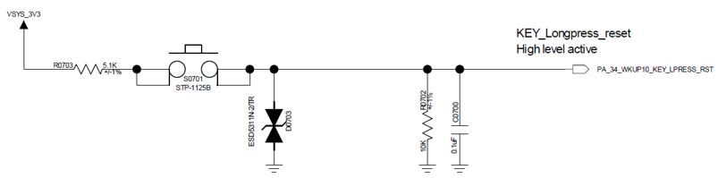  

<div align="center"> Figure 4-9 Power On/Off Button Circuit Diagram </div>   <br>  <br>  <br>

#### Mechanical Knob Button

  

<div align="center"> Figure 4-10 Mechanical Knob Button Circuit Diagram </div>   <br>  <br>  <br>

### Vibration Motor

The chip supports PWM output to control the vibration motor.

<!-- The content here needs to be processed differently for A3 and B3 -->
  

<div align="center"> Figure 4-11 Vibration Motor Circuit Diagram </div>  <br> <br> <br>


### Audio Interface

The audio-related interfaces of the chip, as shown in Table 4-15, have the following characteristics:
1.	Supports one single-ended ADC input, connected to an external analog MIC, with a coupling capacitor of at least 2.2uF added in between, and the power supply for the analog MIC is connected to the chip's MIC_BIAS power output pin;
2.	Supports one differential DAC output, connected to an external analog audio PA. The DAC output traces should be routed as differential lines with proper ground shielding, and the following should be noted: Trace Capacitance < 10pF, Length < 2cm.

<div align="center"> Table 4-15 Audio Signal Connection Methods </div>

```{table}
:align: center
|Audio Signal |Pin   |Detailed Description |
|:---|:---|:---|
|BIAS |MIC_BIAS |Microphone Power       |
|AU_ADC1P |ADCP |Single-ended Analog MIC Input  |
|AU_DAC1P |DACP |Differential Analog Output P    |
|AU_DAC1N |DACN |Differential Analog Output N    |
```

The recommended circuit for an analog MEMS MIC is shown in Figure 4-12, and the recommended circuit for an analog ECM MIC single-ended input is shown in Figure 4-13. The MEMS_MIC_ADC_IN and ECM_MIC_ADC_IN are connected to the ADCP input pin of the SF32LB52x.


  

<div align="center"> Figure 4-12 Analog MEMS MIC Single-ended Input Circuit Diagram </div>   <br>  <br>  <br>


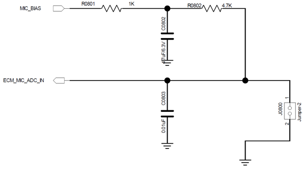  

<div align="center"> Figure 4-13 Analog ECM Single-ended Input Circuit Diagram </div>   <br>  <br> <br>


The recommended circuit for analog audio output is shown in Figure 4-14. Note that the differential low-pass filter within the dashed line should be placed close to the chip.

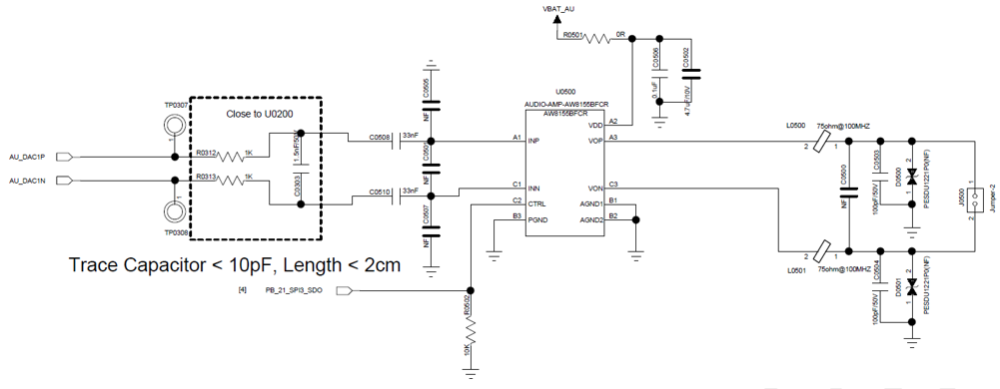  

<div align="center"> Figure 4-14 Analog Audio PA Circuit Diagram </div>   <br>  <br>  <br>


### Sensors

The chip supports heart rate, accelerometer, and magnetometer sensors. The power supply for the sensors should be controlled using a Load Switch with a low Iq.

### UART and I2C Pin Configuration

The chip supports arbitrary pin mapping for UART and I2C functions, and all PA interfaces can be mapped to UART or I2C function pins.

### GPTIM Pin Configuration

The chip supports arbitrary pin mapping for GPTIM functions, and all PA interfaces can be mapped to GPTIM function pins.

### Debug and Download Interface

The chip supports the DBG_UART interface for downloading and debugging, using a UART-to-USB dongle with a 3.3V interface connected to a PC.

<div align="center"> Table 4-16 Debug Port Connection Methods </div>

```{table}
:align: center
|DBG Signal |Pin   |Detailed Description |
|:---|:---|:---|
|DBG_UART_RXD |PA18 |Debug UART Receive |
|DBG_UART_TXD |PA19 |Debug UART Transmit |
```

### Production Programming and Crystal Calibration

Sichip Technology provides an offline programmer to complete production programming and crystal calibration. When designing the hardware, please ensure that at least the following test points are reserved: PVDD, GND, AVDD33, DB_UART_RXD, DB_UART_RXD, PA01.

For detailed programming and crystal calibration, refer to the “**_Offline Programmer User Guide.pdf” document, which is included in the development package.


### Schematic and PCB Layout Checklists

Refer to the “**_Schematic checklist_**.xlsx” and “**_PCB checklist_**.xlsx” documents, which are included in the development package.


## PCB Design Guidelines

### PCB Package Design

The QFN68L package dimensions for the SF32LB52X series chips are: 7mm x 7mm x 0.85mm; number of pins: 68; pin pitch: 0.35mm. Detailed dimensions are shown in Figure 5-1.

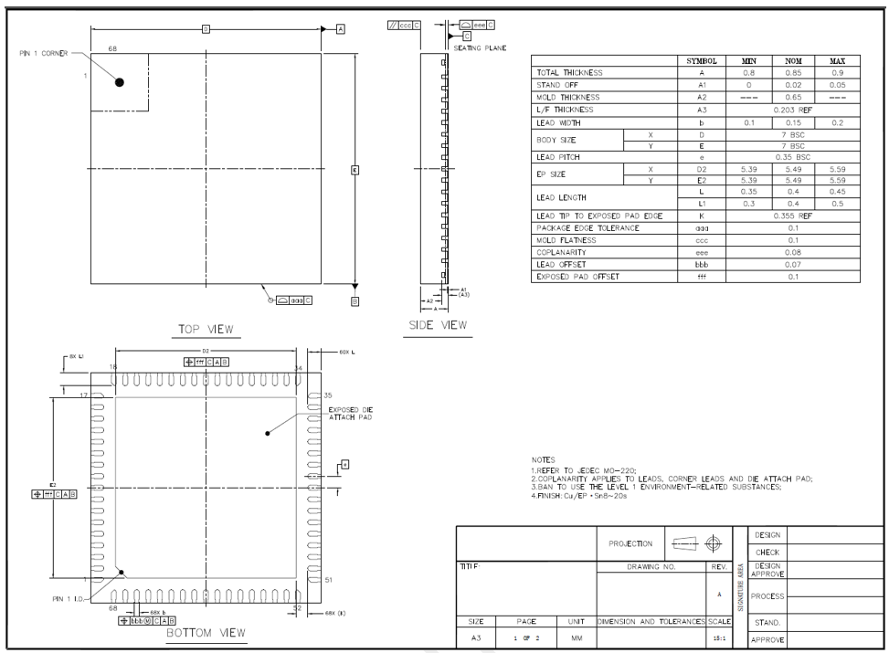  

<div align="center"> Figure 5-1 QFN68L Package Dimensions </div>   <br>  <br>  <br>


  

<div align="center"> Figure 5-2 QFN68L Package Shape </div>   <br>  <br>  <br>


  

<div align="center"> Figure 5-3 QFN68L Package PCB Pad Design Reference </div>   <br>  <br>  <br>


### PCB Stack-up Design

The SF32LB52X series chips support single and double-sided layouts, with components placed on a single side or capacitors and other components placed on the back of the chip. The PCB supports PTH (Plated Through Hole) design, and a 4-layer PTH is recommended. The recommended stack-up structure is shown in Figure 5-4.

  

<div align="center"> Figure 5-4 Recommended Stack-up Structure </div>   <br>  <br>  <br>


### General PCB Design Rules

General PCB design rules for PTH boards are shown in Figure 5-5.

  

<div align="center"> Figure 5-5 General Design Rules </div>   <br>  <br>  <br>


### PCB Trace Fan-out

For QFN package signal fan-out, all pins should be fanned out through the top layer, as shown in Figure 5-6.

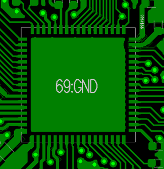  

<div align="center"> Figure 5-6 QFN Package Signal Fan-out </div>   <br>  <br>  <br>

  

<div align="center"> Figure 5-6 Surface Fanout Reference Diagram </div>   <br>  <br>  <br>


### Clock Interface Routing

The crystal should be placed inside the shield, with a distance greater than 1mm from the PCB edge. It should be placed as far as possible from heat-generating components such as PA, Charge, and PMU circuits, with a preferred distance of more than 5mm to avoid affecting the crystal frequency. The crystal circuit should have a clearance of more than 0.25mm to avoid any other metal or components, as shown in Figure 5-7.

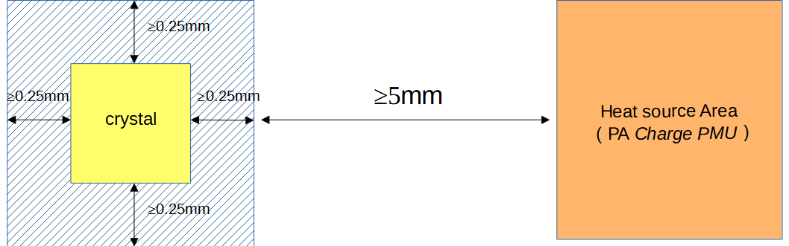  

<div align="center"> Figure 5-7 Crystal Layout Diagram </div>   <br>  <br>  <br>


The 48MHz crystal routing is recommended to be on the surface layer, with a length controlled between 3-10mm and a line width of 0.1mm. It must be surrounded by a ground plane and kept away from VBAT, DC/DC, and high-speed signal lines. The surface layer and adjacent layers below the 48MHz crystal area should be kept clear of other routing, as shown in Figures 5-8, 5-9, and 5-10.

  

<div align="center"> Figure 5-8 48MHz Crystal Schematic </div>   <br>  <br>  <br>


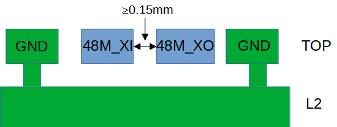  

<div align="center"> Figure 5-9 48MHz Crystal Routing Model </div>   <br>  <br>  <br>


  

<div align="center"> Figure 5-10 48MHz Crystal Routing Reference </div>   <br>  <br>  <br>


The 32.768KHz crystal routing is recommended to be on the surface layer, with a length controlled to ≤10mm and a line width of 0.1mm. The parallel routing distance between 32K_XI and 32K_XO should be ≥0.15mm and must be surrounded by a ground plane. The surface layer and adjacent layers below the 32.768KHz crystal area should be kept clear of other routing, as shown in Figures 5-11, 5-12, and 5-13.

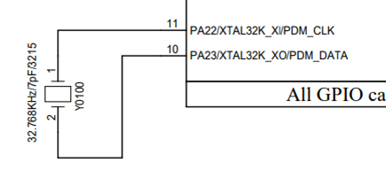  

<div align="center"> Figure 5-11 32.768KHz Crystal Schematic </div>   <br>  <br>  <br>


  

<div align="center"> Figure 5-12 32.768KHz Crystal Routing Model </div>   <br>  <br>  <br>


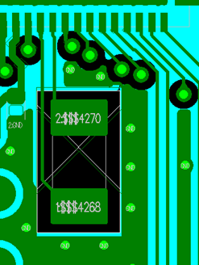  

<div align="center"> Figure 5-13 32.768KHz Crystal Routing Reference </div>   <br>  <br>  <br>


### RF Interface Routing

The RF matching circuit should be placed as close as possible to the chip end, not near the antenna end. The filter capacitors for the AVDD_BRF RF power supply should be placed as close as possible to the chip pins, with the capacitor ground pins connected directly to the main ground. The schematic and PCB layout of the π network and power circuit are shown in Figures 5-14 and 5-15.

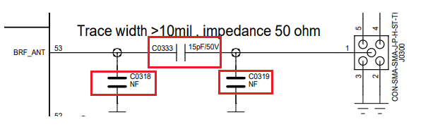  

<div align="center"> Figure 5-14 π Network and Power Circuit Schematic </div>   <br>  <br>  <br>


  

<div align="center"> Figure 5-15 π Network and Power PCB Layout </div>   <br>  <br>  <br>


The RF routing is recommended to be on the surface layer to avoid vias that can affect RF performance. The line width should be greater than 10mil and must be surrounded by a ground plane. Avoid sharp and right angles. The RF line should be controlled to 50 ohms, with additional ground vias on both sides, as shown in Figures 5-16 and 5-17.

  

<div align="center"> Figure 5-16 RF Signal Circuit Schematic </div>   <br>  <br>  <br>


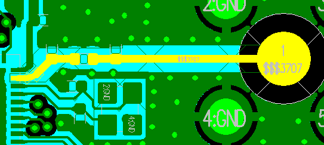  

<div align="center"> Figure 5-17 RF Signal PCB Routing Diagram </div>   <br>  <br>  <br>


### Audio Interface Routing
AVDD33_AUD is the power supply pin for audio, and its filter capacitors should be placed close to the corresponding pins to ensure good grounding to the main ground of the PCB. MIC_BIAS is the power output pin for the microphone peripheral, and its corresponding filter capacitors should be placed close to the corresponding pins. Similarly, the filter capacitors for the AUD_VREF pin should also be placed close to the pins, as shown in Figures 5-18a and 5-18b.

  

<div align="center"> Figure 5-18a Audio Power Filter Circuit </div>   <br>  <br>  <br>


  

<div align="center"> Figure 5-18b Audio Power Filter Circuit PCB Reference Routing </div>   <br>  <br>  <br>


The analog signal input to the ADCP pin should have the corresponding circuit components placed as close as possible to the chip pins, with the routing length kept as short as possible. The routing should be surrounded by a ground plane and kept away from other strong interference signals, as shown in Figures 5-19a and 5-19b.

  

<div align="center"> Figure 5-19a ADCP Input Circuit Schematic </div>   <br>  <br>  <br>


  

<div align="center"> Figure 5-19b ADCP Input Circuit PCB Reference Routing </div>   <br>  <br>  <br>

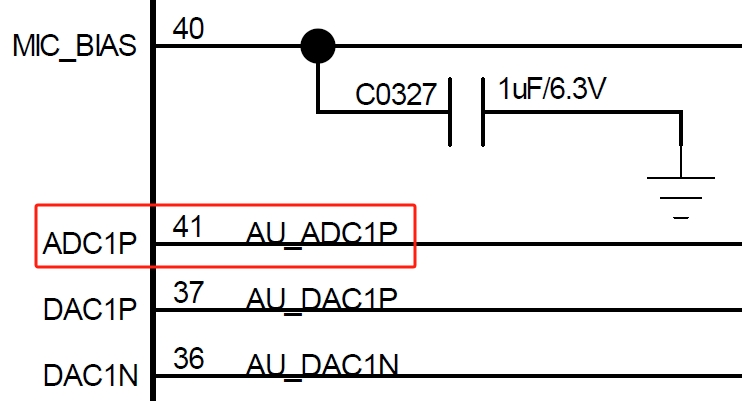  

<div align="center"> Figure 5-19a Analog Audio Input Schematic </div>   <br>  <br>  <br>


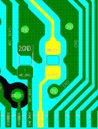  

<div align="center"> Figure 5-19b Analog Audio Input PCB Design </div>   <br>  <br>  <br>


The DACP/DACN pins for analog signal output should be placed as close as possible to the corresponding chip pins. Each P/N pair should be routed as differential lines, with the trace length as short as possible, parasitic capacitance less than 10pf, and a 3D ground plane should be implemented. The traces should be kept away from other strong interference signals, as shown in Figures 5-20a and 5-20b.

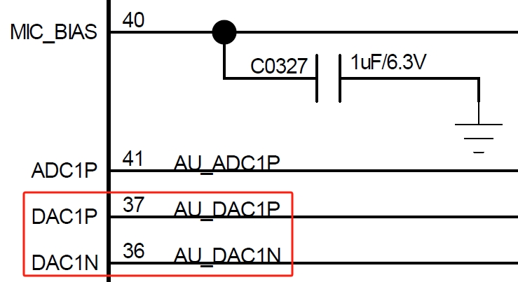  

<div align="center"> Figure 5-20a Analog Audio Output Schematic </div>   <br>  <br>  <br>


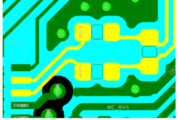  

<div align="center"> Figure 5-20b Analog Audio Output PCB Design </div>   <br>  <br>  <br>


### USB Interface Routing

The USB traces PA35 (USB DP) / PA36 (USB_DN) must first pass through the ESD device pins before connecting to the chip. Ensure that the ESD device ground pins are well connected to the main ground. The traces should be routed as differential pairs, with a 90 ohm differential impedance control, and a 3D ground plane should be implemented, as shown in Figures 5-21a and 5-21b.

  

<div align="center"> Figure 5-21a USB Signal Schematic </div>   <br>  <br>  <br>


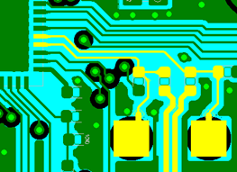  

<div align="center"> Figure 5-21b USB Signal PCB Design </div>   <br>  <br>  <br>


Figure 5-22a shows the component layout reference for USB signals, and Figure 5-22b shows the PCB routing model.

  

<div align="center"> Figure 5-22a USB Signal Component Layout Reference </div>   <br>  <br>  <br>


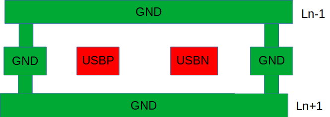  

<div align="center"> Figure 5-22b USB Signal Routing Model </div>   <br>  <br>  <br>


### SDIO Interface Routing
SDIO signal traces should be routed together as much as possible, avoiding separate routing. The total trace length should be ≤50mm, and the length difference within the group should be ≤6mm. The SDIO interface clock signal should be routed with a 3D ground plane, and the DATA and CMD signals should also be routed with a ground plane, as shown in Figures 5-23a and 5-23b.

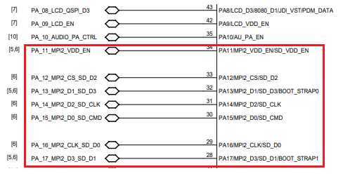  

<div align="center"> Figure 5-23a SDIO Interface Schematic </div>   <br>  <br>  <br>


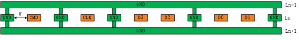  

<div align="center"> Figure 5-23b SDIO PCB Routing Model </div>   <br>  <br>  <br>


### DCDC Circuit Routing
The power inductor and filter capacitors for the DC-DC circuit must be placed as close as possible to the chip pins. The BUCK_LX trace should be as short and wide as possible to ensure a low inductance in the entire DC-DC circuit loop. The BUCK_FB pin feedback trace should not be too thin and must be greater than 0.25mm. All DC-DC output filter capacitors should have multiple vias connecting their ground pins to the main ground plane. The power inductor area should not have copper pours on the top layer, and the adjacent layer must be a complete reference ground to avoid other traces passing through the inductor area, as shown in Figures 5-24a and 5-24b.

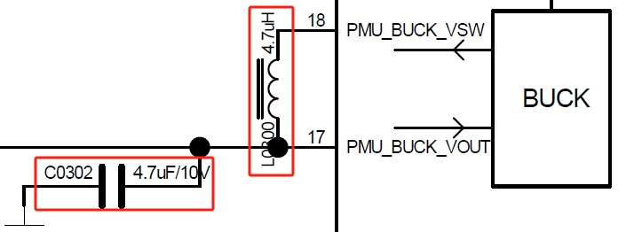  

<div align="center"> Figure 5-24a DC-DC Key Components Schematic </div>   <br>  <br>  <br>


  

<div align="center"> Figure 5-24b DC-DC Key Components PCB Layout </div>   <br>  <br>  <br>


### Power Supply Routing

PVDD is the power input pin for the built-in PMU module of the chip. The corresponding capacitors must be placed as close as possible to the pin, and the traces should be as wide as possible, not less than 0.4mm, as shown in Figure 5-25.

<!-- This content needs to be handled differently for A3 and B3 versions -->
  

<div align="center"> Figure 5-25 PVDD Power Routing Diagram </div>  <br> <br> <br>


The filter capacitors for AVDD33, VDDIOA, VDD_SIP, AVDD33_AUD, and AVDD_BRF pins should be placed as close as possible to the corresponding pins. The trace width must meet the input current requirements, and the traces should be as short and wide as possible to reduce power ripple and improve system stability.

<!-- The charging content needs to be added for the A3 version -->

### Other Interface Routing

Pins configured as GPADC signal pins must be routed with a 3D ground plane and kept away from other interference signals, such as battery level circuits and temperature check circuits.

### EMI&ESD
- Avoid long-distance routing on the top layer of the shield, especially for clock and power signals, which should be routed on inner layers and not on the top layer.
- ESD protection devices must be placed as close as possible to the corresponding connector pins. Signal traces should first pass through the ESD protection device pins to avoid signal branching before passing through the ESD protection device.
- The ground pins of the ESD device must be connected to the main ground via vias, ensuring that the ground plane traces are short and wide to reduce impedance and improve ESD device performance.
- 

### Other

The USB charging cable test points must be placed in front of the TVS diode, and the TVS diode for the battery holder must be placed in front of the platform. The wiring must ensure that it passes through the TVS first and then to the chip end, as shown in Figure 5-27.

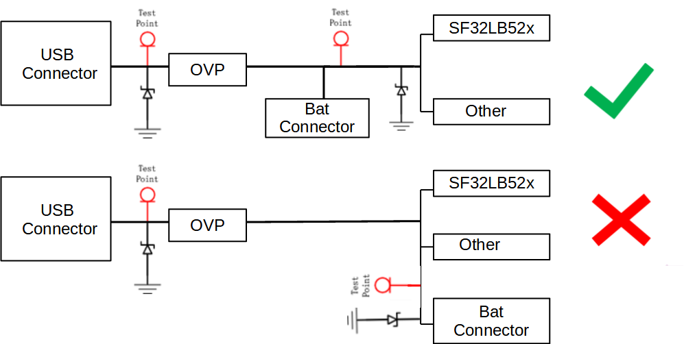  

<div align="center"> Figure 5-27 Power TVS Layout Reference </div>   <br>  <br>  <br>

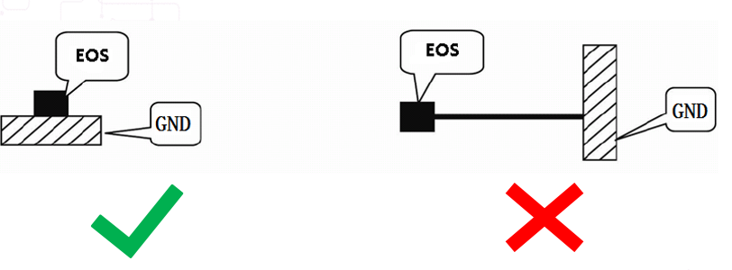  

<div align="center"> Figure 5-28 TVS Wiring Reference </div>   <br>  <br>  <br>

The ground pin of the TVS diode should avoid long traces before connecting to ground, as shown in Figure 5-28.

## Related Documents

- [SF32LB52x Chip Technical Specification](https://downloads.sifli.com/silicon/DS0052-SF32LB52x-%E8%8A%AF%E7%89%87%E6%8A%80%E6%9C%AF%E8%A7%84%E6%A0%BC%E4%B9%A6%20V2p4.pdf?)
- [SF32LB52x User Manual](https://downloads.sifli.com/silicon/UM0052-SF32LB52x-%E7%94%A8%E6%88%B7%E6%89%8B%E5%86%8C%20V0p3.pdf?)
- [SF32LB52 Hardware Reference Design Package](https://downloads.sifli.com/hardware/files/documentation/SF32LB52-%E7%A1%AC%E4%BB%B6%E5%8F%82%E8%80%83%E8%AE%BE%E8%AE%A1-20250619.zip?)

## Revision History

```{table}
:align: left
:name: sf32lb52x-B-history

|Version |Date   |Release Notes |
|:---|:---|:---|
|0.0.1 |10/2024 |Initial version |

```